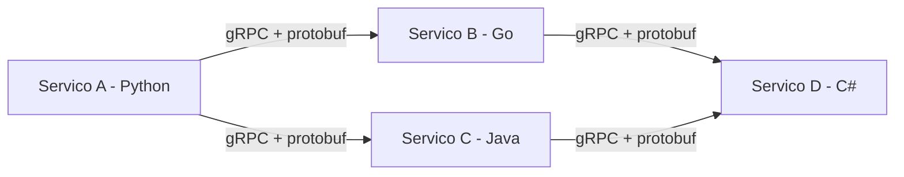
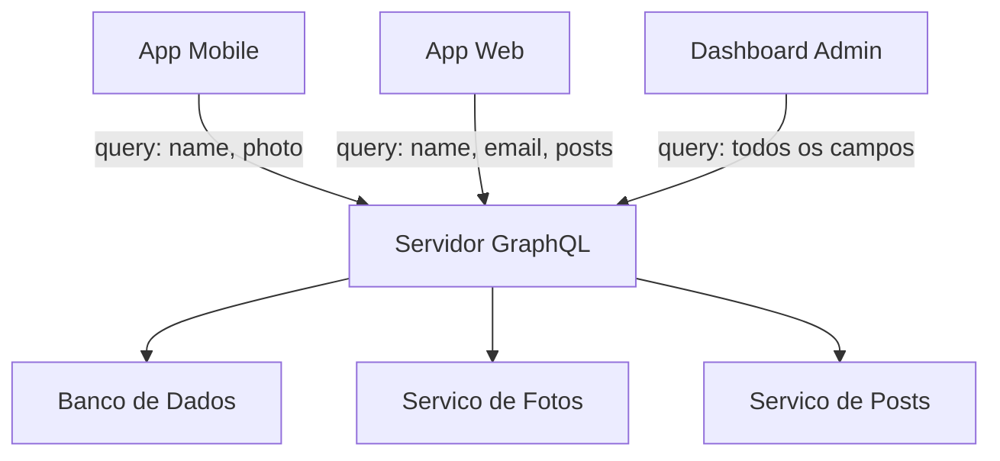
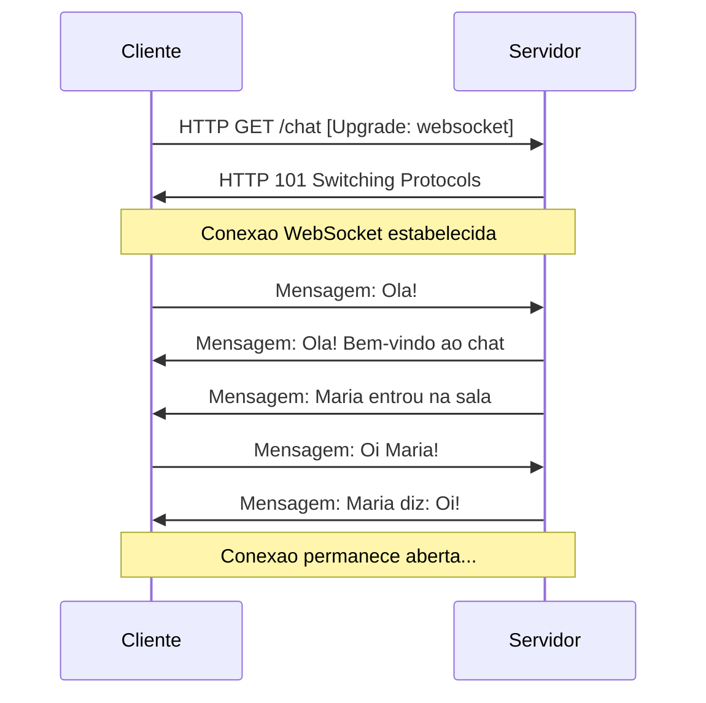
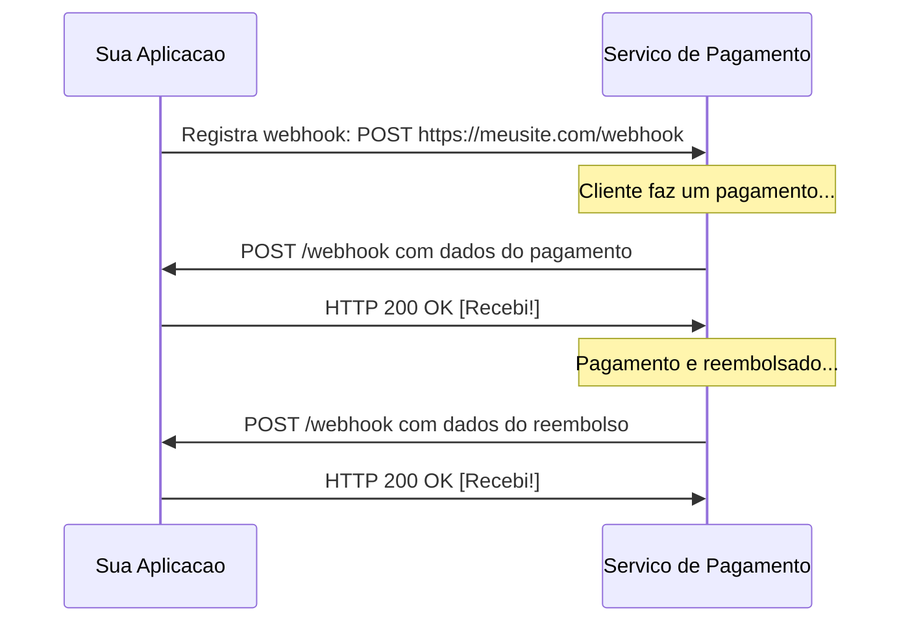
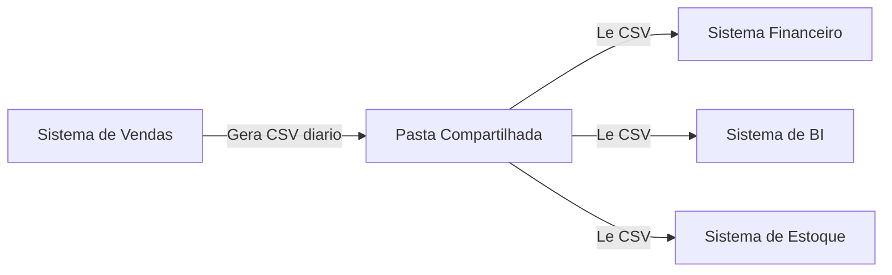
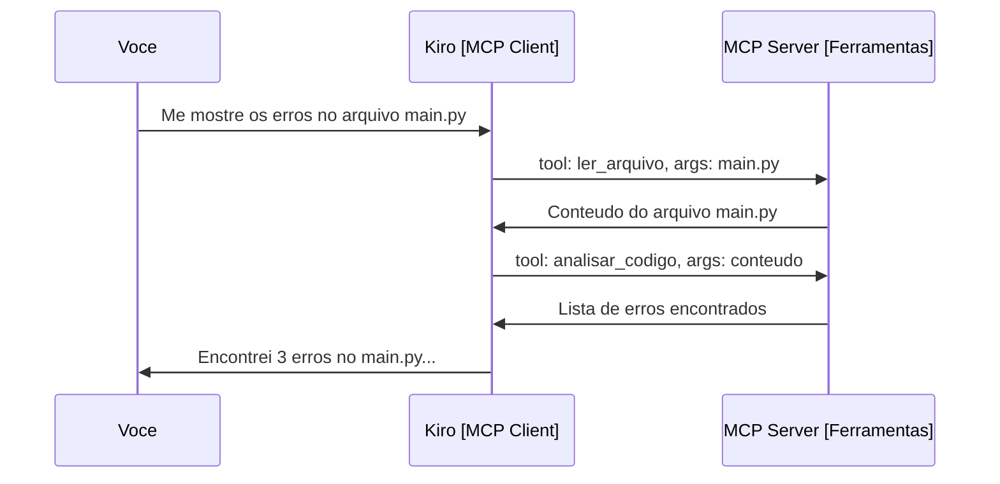
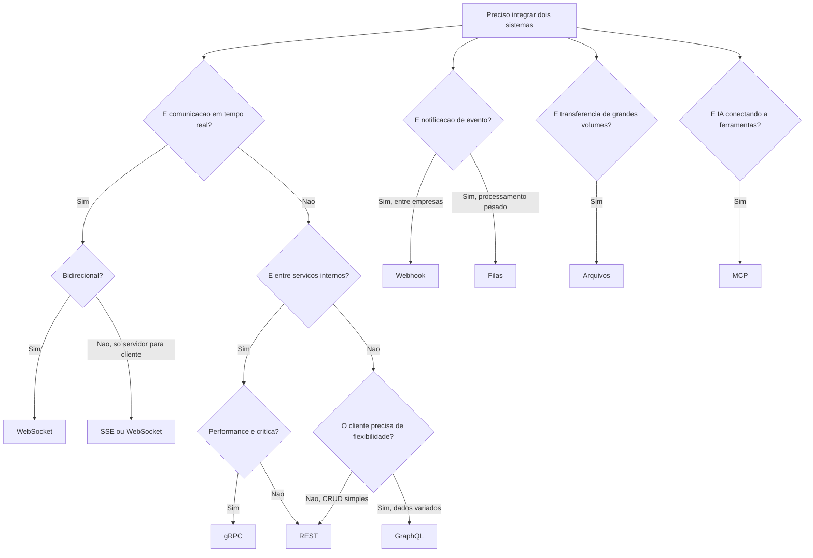
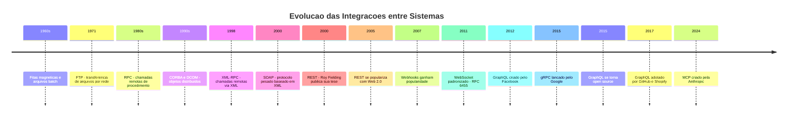

# 11.5 — Outras Formas de Integração: gRPC, GraphQL, MCP e mais

[← Anterior: Filas e Mensageria](cap11-mod04-filas-mensageria-conteudo.md) · [Próximo: Arquitetura de Integracoes →](cap11-mod06-arquitetura-integracoes-conteudo.md)

---

## Introdução

No módulo anterior, você aprendeu sobre filas e mensageria — a forma assincrona de comunicação entre servicos. Antes disso, no módulo 11.3, você mergulhou fundo em APIs HTTP e REST — a forma sincrona mais popular. Com esses dois módulos, você ja conhece as duas formas mais usadas de integração no mundo real.

Mas o mundo da tecnologia e vasto, e REST e filas não são as unicas opcoes. Ao longo dos anos, engenheiros enfrentaram problemas que REST não resolvia bem — ou resolvia de forma ineficiente — e criaram alternativas. Algumas dessas alternativas se tornaram muito populares em nichos específicos. Outras são mais recentes e estao ganhando espaco rapidamente.

Neste módulo, vamos conhecer as principais alternativas: gRPC, GraphQL, WebSockets, webhooks, TCP direto, integração por arquivos e o MCP (Model Context Protocol). O objetivo não e que você domine todas — isso levaria meses de estudo para cada uma. O objetivo e que você saiba que existem, entenda qual problema cada uma resolve, e consiga reconhecer quando alguem mencionar essas tecnologias no trabalho.

Pense assim: você ja sabe dirigir carro (REST) e andar de onibus (filas). Agora vamos conhecer a bicicleta, o trem, o aviao e o barco. Cada um tem seu uso ideal — ninguem pega um aviao para ir a padaria, e ninguem vai de bicicleta de São Paulo a Tokyo.

---

## Como Executar os Exemplos Deste Módulo

Este módulo e predominantemente conceitual. Os exemplos de código são ilustrativos — mostram a estrutura e a lógica de cada tecnologia, mas não precisam ser executados agora. Quando você encontrar gRPC, GraphQL ou WebSockets em projetos reais, vai ter a base conceitual para entender o que esta acontecendo.

Para os exemplos de WebSocket e webhook, você pode experimentar com ferramentas online:
- WebSockets: o site [websocket.org/echo](https://websocket.org/echo.html) permite testar conexões WebSocket
- Webhooks: o site [webhook.site](https://webhook.site/) gera URLs temporarias para receber webhooks

Para os exemplos de curl, você pode executar no terminal normalmente — como aprendeu no módulo 3.6.

---

## Por que REST Não Resolve Tudo

Antes de conhecer as alternativas, precisamos entender por que elas existem. REST e excelente — simples, padronizado, funciona em qualquer linguagem, usa HTTP que todo mundo conhece. Mas tem limitacoes reais:

### Problema 1: Performance em Comunicação Interna

Imagine que você tem 50 microservicos dentro da sua empresa. O servico A chama o B, que chama o C, que chama o D. Cada chamada REST envolve:

1. Serializar os dados em JSON (texto)
2. Enviar via HTTP (com headers, metadados, etc.)
3. O outro lado recebe, faz parse do JSON (texto de volta para dados)
4. Processa e repete tudo na resposta

JSON e texto puro — legivel para humanos, mas ineficiente para máquinas. Quando você tem milhoes de chamadas por segundo entre servicos internos, essa ineficiencia se acumula. Cada byte extra, cada milissegundo de parse, multiplicado por milhoes, vira um problema real.

E como se você precisasse enviar uma carta para o vizinho do lado. Com REST, você escreve a carta a mao, coloca no envelope, leva ao correio, o correio entrega ao vizinho. Funciona, mas e muito trabalho para uma comunicação tao próxima. Não seria melhor simplesmente falar pela janela?

### Problema 2: Over-fetching e Under-fetching

Imagine uma tela de perfil de usuario em um app. Você precisa mostrar:
- Nome e foto do usuario
- Ultimos 3 posts
- Número de seguidores
- Lista de amigos online

Com REST, você provavelmente faria:

```
GET /users/123          → retorna TODOS os dados do usuario (nome, email, endereco, telefone, preferencias...)
GET /users/123/posts    → retorna TODOS os posts (voce so precisa de 3)
GET /users/123/followers → retorna TODOS os seguidores (voce so precisa do count)
GET /users/123/friends   → retorna TODOS os amigos (voce so precisa dos online)
```

São 4 requisicoes, e cada uma retorna mais dados do que você precisa. Isso e **over-fetching** — receber dados demais. O contrario também acontece: as vezes uma única requisicao não traz tudo que você precisa, e você tem que fazer várias chamadas. Isso e **under-fetching**.

Em uma conexão rápida de fibra otica, isso não e problema. Mas em um celular com 3G no metro, cada requisicao extra e cada byte desnecessario fazem diferença real na experiência do usuario.

### Problema 3: Comunicação em Tempo Real

REST funciona no modelo request-response: o cliente pergunta, o servidor responde. Mas e se o servidor precisar avisar o cliente de algo sem que o cliente pergunte?

Exemplos:
- Chat em tempo real (WhatsApp, Slack)
- Placar de jogo ao vivo
- Preco de ações atualizando a cada segundo
- Notificacoes push
- Colaboracao em tempo real (Google Docs)

Com REST, a única opcao seria o cliente ficar perguntando repetidamente: "tem novidade? tem novidade? tem novidade?" — isso se chama **polling**, e e extremamente ineficiente. Imagine 10.000 usuarios conectados, cada um fazendo uma requisicao por segundo so para verificar se tem mensagem nova. São 10.000 requisicoes por segundo, e 99% delas recebem "não, nada novo".

### Problema 4: Contratos Rigidos

Em REST, o servidor define o formato da resposta. Se o endpoint `/users/123` retorna 20 campos, todos os clientes recebem os mesmos 20 campos — o app mobile que so precisa de 3 campos, o dashboard web que precisa de 15, e o servico interno que precisa de 2. Não ha como cada cliente pedir exatamente o que precisa.

Mudar o formato da resposta e arriscado — pode quebrar clientes existentes. Então as equipes criam versões (`/v1/users`, `/v2/users`), o que gera complexidade de manutenção.

---

## Tabela Comparativa: Visao Geral das Alternativas

Antes de mergulhar em cada tecnologia, veja o panorama completo:

| Tecnologia | Tipo | Problema que Resolve | Quando Usar | Complexidade |
|------------|------|---------------------|-------------|--------------|
| REST | Sincrono | Comunicação padrão entre servicos | Caso geral, APIs publicas | Baixa |
| gRPC | Sincrono | Performance em comunicação interna | Microservicos internos, alta performance | Media |
| GraphQL | Sincrono | Over/under-fetching, flexibilidade | Apps mobile, frontends complexos | Media-Alta |
| WebSocket | Tempo real | Comunicação bidirecional continua | Chat, jogos, dashboards ao vivo | Media |
| Webhook | Assincrono | Notificacao de eventos entre sistemas | Integracoes externas, pagamentos | Baixa |
| TCP direto | Sincrono | Performance máxima, protocolos custom | Jogos online, IoT, sistemas embarcados | Alta |
| Arquivos | Assincrono | Transferencia de grandes volumes | ETL, relatórios, migração de dados | Baixa |
| MCP | Sincrono | Conexão entre IA e ferramentas | Agentes de IA, assistentes inteligentes | Media |

Agora vamos conhecer cada uma em detalhe.

---

## gRPC: Comunicação Rápida entre Microservicos

### O que e e de Onde Veio

gRPC e um framework de comunicação criado pelo Google em 2015. O nome significa "gRPC Remote Procedure Call" — sim, o "g" e recursivo, uma brincadeira de engenheiros. O Google criou o gRPC porque internamente usava um sistema chamado Stubby desde 2001 para comunicação entre seus servicos. Stubby funcionava muito bem, mas era proprietario e fortemente acoplado a infraestrutura interna do Google. Em 2015, eles decidiram criar uma versão open source baseada nos mesmos principios — e nasceu o gRPC.

### Qual Problema Resolve

gRPC resolve o problema de performance na comunicação entre microservicos internos. Em vez de usar JSON (texto) sobre HTTP/1.1, gRPC usa:

- **Protocol Buffers (protobuf)**: formato binário para serializar dados. Em vez de texto legivel como JSON, os dados são compactados em bytes — muito menor e muito mais rápido de processar
- **HTTP/2**: versão mais moderna do HTTP que suporta multiplexacao (várias chamadas na mesma conexão), compressao de headers e streaming bidirecional

A diferença prática e significativa. Vamos comparar o mesmo dado em JSON e protobuf:

```json
{
  "id": 12345,
  "name": "Maria Silva",
  "email": "maria@email.com",
  "age": 28,
  "active": true
}
```

Esse JSON tem cerca de 100 bytes. O mesmo dado em protobuf ocupa cerca de 35-40 bytes — menos da metade. E o parse (transformar bytes em dados utilizaveis) e 5 a 10 vezes mais rápido que JSON.

Quando você tem um servico que recebe 100.000 requisicoes por segundo, essa diferença e enorme:
- JSON: ~10 MB/s so de payload, mais tempo de CPU para parse
- Protobuf: ~4 MB/s de payload, parse quase instantaneo

### Como Funciona

A ideia central do gRPC e o conceito de **Remote Procedure Call (RPC)** — Chamada de Procedimento Remoto. Em vez de pensar em "endpoints" e "recursos" como no REST, você pensa em "funções que existem em outro computador".

No REST, você faz:
```
GET /users/123
POST /users
PUT /users/123
```

No gRPC, você faz:
```
GetUser(id=123)
CreateUser(name="Maria", email="maria@email.com")
UpdateUser(id=123, name="Maria Santos")
```

Parece que você esta chamando uma função local, mas na verdade essa função esta rodando em outro servidor. O gRPC cuida de toda a comunicação por baixo dos panos.

### O Arquivo .proto

Para usar gRPC, você define um "contrato" em um arquivo `.proto`. Esse arquivo descreve quais funções existem e quais dados elas recebem e retornam:

```protobuf
// Definicao do servico de usuarios
// "syntax" = versao do protobuf
syntax = "proto3";

// "service" = grupo de funcoes disponiveis
service UserService {
  // "rpc" = funcao remota
  rpc GetUser (GetUserRequest) returns (User);
  rpc CreateUser (CreateUserRequest) returns (User);
  rpc ListUsers (ListUsersRequest) returns (UserList);
}

// "message" = estrutura de dados (como uma classe)
message GetUserRequest {
  int32 id = 1;  // "int32" = numero inteiro, "1" = posicao no binario
}

message CreateUserRequest {
  string name = 1;   // "string" = texto
  string email = 2;
  int32 age = 3;
}

message User {
  int32 id = 1;
  string name = 2;
  string email = 3;
  int32 age = 4;
  bool active = 5;   // "bool" = verdadeiro ou falso
}

message UserList {
  repeated User users = 1;  // "repeated" = lista
}
```

A partir desse arquivo, ferramentas automaticas geram código em qualquer linguagem — Python, Go, Java, C#, etc. O código gerado ja sabe como serializar, enviar, receber e deserializar os dados. Você so precisa implementar a lógica de negocio.

### Streaming com gRPC

Uma vantagem importante do gRPC sobre REST e o suporte nativo a streaming — enviar dados continuamente, não apenas request-response:

| Tipo | Descrição | Exemplo |
|------|-----------|---------|
| Unario | Request-response normal | Buscar um usuario por ID |
| Server streaming | Cliente pede, servidor envia vários | Acompanhar status de um pedido |
| Client streaming | Cliente envia vários, servidor responde uma vez | Upload de arquivo em chunks |
| Bidirecional | Ambos enviam e recebem continuamente | Chat entre servicos |

### Quando Usar e Quando Não Usar

**Use gRPC quando:**
- Comunicação entre microservicos internos (dentro da mesma empresa/rede)
- Performance e critica (milhares de chamadas por segundo)
- Você precisa de streaming
- Equipes usam linguagens diferentes (o .proto gera código para todas)

**Não use gRPC quando:**
- API pública para terceiros (REST e mais acessível e universal)
- Clientes são navegadores web (suporte a gRPC no browser e limitado)
- O time e pequeno e a complexidade não se justifica
- Você precisa de algo que humanos consigam ler facilmente (debug com curl, por exemplo)

### gRPC no Mundo Real

- **Google**: usa gRPC internamente entre praticamente todos os seus servicos
- **Netflix**: migrou comunicação interna de REST para gRPC e reduziu latencia em 50%
- **Uber**: usa gRPC para comunicação entre os mais de 2.000 microservicos internos
- **Spotify**: usa gRPC para streaming de dados entre servicos de recomendacao



---

## GraphQL: O Cliente Decide o que Receber

### O que e e de Onde Veio

GraphQL e uma linguagem de consulta para APIs criada pelo Facebook em 2012 e tornada open source em 2015. O Facebook criou GraphQL porque enfrentava exatamente o problema de over-fetching e under-fetching que descrevemos no inicio do módulo.

Em 2012, o Facebook estava reconstruindo seu app mobile. O app precisava mostrar o feed de noticias — que inclui posts, comentários, likes, fotos, informações do autor, e muito mais. Com REST, cada tela do app precisava fazer 5, 10, as vezes 15 requisicoes diferentes para montar todas as informações. Em conexões 3G (que eram comuns na epoca), isso tornava o app lento e frustrante.

A equipe do Facebook pensou: "e se o cliente pudesse dizer exatamente o que precisa em uma única requisicao, e o servidor retornasse exatamente isso — nada mais, nada menos?" Essa ideia virou o GraphQL.

### Qual Problema Resolve

GraphQL resolve o problema de flexibilidade na consulta de dados. Em vez do servidor decidir o formato da resposta (como no REST), o cliente envia uma query descrevendo exatamente quais campos quer receber.

Vamos comparar. Imagine que você quer mostrar o perfil de um usuario com nome, foto e os títulos dos 3 ultimos posts.

**Com REST:**

```
GET /users/123
→ Retorna: id, name, email, phone, address, photo, bio, created_at, updated_at, preferences...
  (voce so precisava de name e photo)

GET /users/123/posts?limit=3
→ Retorna: id, title, body, created_at, updated_at, tags, comments_count, likes_count...
  (voce so precisava de title)
```

Duas requisicoes, muitos dados desnecessarios.

**Com GraphQL:**

```graphql
query {
  user(id: 123) {
    name
    photo
    posts(limit: 3) {
      title
    }
  }
}
```

Uma única requisicao. O servidor retorna exatamente:

```json
{
  "data": {
    "user": {
      "name": "Maria Silva",
      "photo": "https://cdn.example.com/maria.jpg",
      "posts": [
        { "title": "Meu primeiro post" },
        { "title": "Aprendendo GraphQL" },
        { "title": "Dicas de Python" }
      ]
    }
  }
}
```

Nada mais, nada menos. Exatamente o que o cliente pediu.

### Como Funciona

GraphQL tem um único endpoint — geralmente `POST /graphql`. Todas as operações passam por esse endpoint. O que muda e o conteúdo da requisicao:

| Operação | Descrição | Equivalente REST |
|----------|-----------|-----------------|
| `query` | Buscar dados | GET |
| `mutation` | Criar, atualizar ou deletar dados | POST, PUT, DELETE |
| `subscription` | Receber atualizacoes em tempo real | WebSocket |

O servidor define um **schema** — um contrato que descreve todos os tipos de dados disponiveis e as operações possiveis:

```graphql
# Definicao dos tipos de dados
type User {
  id: ID!          # "ID!" = identificador obrigatorio
  name: String!    # "String!" = texto obrigatorio
  email: String!
  photo: String
  posts: [Post!]!  # "[Post!]!" = lista obrigatoria de posts
}

type Post {
  id: ID!
  title: String!
  body: String!
  author: User!    # Relacionamento: cada post tem um autor
}

# Operacoes disponiveis
type Query {
  user(id: ID!): User           # Buscar usuario por ID
  users(limit: Int): [User!]!   # Listar usuarios
  post(id: ID!): Post           # Buscar post por ID
}

type Mutation {
  createUser(name: String!, email: String!): User!
  updateUser(id: ID!, name: String): User!
  deleteUser(id: ID!): Boolean!
}
```

### O Poder da Navegação em Grafos

O nome "GraphQL" vem de "Graph Query Language" — linguagem de consulta em grafos. A ideia e que seus dados formam um grafo de relacionamentos, e você pode navegar por esse grafo em uma única query:

```graphql
query {
  user(id: 123) {
    name
    posts {
      title
      comments {
        text
        author {
          name
          followers {
            name
          }
        }
      }
    }
  }
}
```

Essa única query busca: o usuario, seus posts, os comentários de cada post, o autor de cada comentário, e os seguidores de cada autor. Com REST, isso exigiria dezenas de requisicoes encadeadas.

### Quando Usar e Quando Não Usar

**Use GraphQL quando:**
- Frontends complexos que precisam de dados de multiplas fontes
- Apps mobile onde economia de banda e importante
- Multiplos clientes (web, mobile, TV) que precisam de dados diferentes do mesmo backend
- Equipes de frontend querem independencia para evoluir sem esperar mudancas no backend

**Não use GraphQL quando:**
- APIs simples com poucos endpoints (REST e mais simples)
- Comunicação entre microservicos internos (gRPC e mais eficiente)
- Você não tem equipe para manter a complexidade do schema
- O sistema e predominantemente CRUD simples

### GraphQL no Mundo Real

- **Facebook/Meta**: usa GraphQL em todos os seus apps (Facebook, Instagram, WhatsApp)
- **GitHub**: a API v4 do GitHub e inteiramente GraphQL
- **Shopify**: toda a plataforma de e-commerce usa GraphQL
- **Twitter/X**: usa GraphQL para o feed e interacoes



---

## WebSockets: Comunicação em Tempo Real

### O que e e de Onde Veio

WebSocket e um protocolo de comunicação criado em 2011 (padronizado na RFC 6455). Ele nasceu para resolver um problema fundamental do HTTP: o servidor não consegue enviar dados para o cliente sem que o cliente pergunte primeiro.

Antes do WebSocket, desenvolvedores usavam gambiarras para simular tempo real:

- **Polling**: o cliente faz requisicoes a cada X segundos perguntando "tem novidade?" — desperdicava banda e recursos do servidor
- **Long polling**: o cliente faz uma requisicao e o servidor segura a conexão aberta ate ter novidade — melhor que polling, mas ainda ineficiente
- **Server-Sent Events (SSE)**: o servidor envia dados continuamente para o cliente, mas so em uma direcao — o cliente não pode enviar de volta pela mesma conexão

WebSocket resolveu tudo isso criando uma conexão bidirecional persistente. Uma vez estabelecida, tanto o cliente quanto o servidor podem enviar dados a qualquer momento, sem precisar abrir novas conexões.

### Como Funciona

A conexão WebSocket comeca como uma requisicao HTTP normal — isso se chama **handshake** (aperto de mao). O cliente pede para "atualizar" a conexão de HTTP para WebSocket:

```
# Cliente envia (handshake)
GET /chat HTTP/1.1
Host: servidor.com
Upgrade: websocket        # "Quero mudar para WebSocket"
Connection: Upgrade
Sec-WebSocket-Key: abc123  # Chave de seguranca

# Servidor responde
HTTP/1.1 101 Switching Protocols   # "OK, mudando"
Upgrade: websocket
Connection: Upgrade
Sec-WebSocket-Accept: xyz789       # Confirmacao
```

Depois do handshake, a conexão HTTP "vira" uma conexão WebSocket. A partir dai, ambos os lados podem enviar mensagens livremente:



### Comparação: HTTP vs WebSocket

| Aspecto | HTTP/REST | WebSocket |
|---------|-----------|-----------|
| Modelo | Request-Response | Bidirecional continuo |
| Conexão | Abre e fecha a cada requisicao | Permanece aberta |
| Quem inicia | Sempre o cliente | Qualquer lado |
| Overhead | Headers em cada requisicao | Headers so no handshake |
| Latencia | Maior (nova conexão cada vez) | Mínima (conexão ja aberta) |
| Uso de recursos | Menor quando ocioso | Maior (conexão aberta) |
| Ideal para | CRUD, consultas pontuais | Tempo real, streaming |

### Exemplo Prático: Chat Simples

Veja como seria um servidor WebSocket básico em Python (usando a biblioteca `websockets`):

```python
# servidor_chat.py
# Exemplo ilustrativo de servidor WebSocket
# "websockets" = biblioteca Python para WebSocket
import asyncio      # "asyncio" = programacao assincrona em Python
import websockets   # "websockets" = biblioteca para WebSocket

# Lista de clientes conectados
# "connected" = conectados
connected = set()

# Funcao que trata cada conexao
# "handler" = tratador, funcao que cuida de algo
async def handler(websocket):
    connected.add(websocket)  # Adiciona cliente a lista
    try:
        # Loop infinito: espera mensagens do cliente
        async for message in websocket:
            # Envia a mensagem para TODOS os outros clientes
            for client in connected:
                if client != websocket:  # Nao envia de volta para quem mandou
                    await client.send(message)
    finally:
        connected.remove(websocket)  # Remove quando desconecta

# Inicia o servidor na porta 8765
# "serve" = servir, disponibilizar
async def main():
    async with websockets.serve(handler, "localhost", 8765):
        await asyncio.Future()  # Roda para sempre

asyncio.run(main())
```

Saida esperada (no terminal do servidor):
```
(servidor rodando, aguardando conexoes na porta 8765)
```

E o cliente:

```python
# cliente_chat.py
# Exemplo ilustrativo de cliente WebSocket
import asyncio
import websockets

async def chat():
    # Conecta ao servidor
    # "connect" = conectar
    async with websockets.connect("ws://localhost:8765") as ws:
        # Envia uma mensagem
        await ws.send("Ola, estou no chat!")
        # Espera resposta
        response = await ws.recv()  # "recv" = receive = receber
        print(f"Recebido: {response}")

asyncio.run(chat())
```

Saida esperada:
```
Recebido: Ola, estou no chat!
```

### Quando Usar e Quando Não Usar

**Use WebSocket quando:**
- Chat em tempo real
- Jogos multiplayer online
- Dashboards com dados ao vivo (ações, criptomoedas, monitoramento)
- Colaboracao em tempo real (editores colaborativos como Google Docs)
- Notificacoes instantaneas

**Não use WebSocket quando:**
- CRUD normal (REST e mais simples)
- Atualizacoes pouco frequentes (polling a cada 30 segundos pode ser suficiente)
- O cliente e um servico backend (gRPC ou filas são melhores)
- Você não precisa de comunicação bidirecional (SSE pode ser suficiente)

### WebSocket no Mundo Real

- **Slack/Discord**: toda a comunicação de chat usa WebSocket
- **Binance/Coinbase**: precos de criptomoedas atualizando em tempo real
- **Google Docs**: colaboracao em tempo real entre multiplos editores
- **Uber**: atualização da posição do motorista no mapa em tempo real

---

## Webhooks: O Servidor Avisa Quando Acontece Algo

### O que e e de Onde Veio

Webhook e um conceito simples mas poderoso: em vez de você ficar perguntando "aconteceu algo?", você diz "me avisa quando acontecer". O termo foi popularizado por Jeff Lindsay em 2007, mas a ideia de callbacks HTTP ja existia antes.

Pense assim: você encomendou um pacote. Você pode ficar ligando para a transportadora a cada hora perguntando "meu pacote chegou?" (polling). Ou você pode pedir: "me manda uma mensagem quando o pacote chegar" (webhook). A segunda opcao e muito mais eficiente — você so recebe uma notificacao quando realmente importa.

### Como Funciona

O mecanismo e direto:

1. Você registra uma URL no servico que quer monitorar: "quando acontecer X, faca um POST para esta URL"
2. Quando o evento acontece, o servico faz uma requisicao HTTP POST para a sua URL
3. Sua aplicação recebe a requisicao e processa o evento



### Exemplo Prático: Recebendo um Webhook

Veja como seria receber um webhook de pagamento em Python com FastAPI:

```python
# webhook_pagamento.py
# Exemplo ilustrativo de endpoint que recebe webhooks
from fastapi import FastAPI, Request  # "Request" = requisicao

app = FastAPI()

# Endpoint que recebe notificacoes de pagamento
# "webhook" = gancho web, notificacao automatica
@app.post("/webhook/pagamento")
async def receber_webhook(request: Request):
    # Recebe os dados enviados pelo servico de pagamento
    dados = await request.json()  # "json" = formato dos dados

    # Verifica o tipo de evento
    # "event_type" = tipo do evento
    evento = dados.get("event_type")

    if evento == "payment.completed":
        # Pagamento aprovado - liberar o produto
        print(f"Pagamento aprovado: pedido {dados['order_id']}")
        # Aqui voce atualizaria o banco de dados, enviaria email, etc.

    elif evento == "payment.failed":
        # Pagamento falhou - notificar o cliente
        print(f"Pagamento falhou: pedido {dados['order_id']}")

    elif evento == "payment.refunded":
        # Reembolso processado
        print(f"Reembolso: pedido {dados['order_id']}")

    # Retorna 200 para confirmar que recebeu
    return {"status": "received"}  # "received" = recebido
```

Saida esperada (quando um webhook chega):
```
Pagamento aprovado: pedido 12345
```

### Desafios dos Webhooks

Webhooks parecem simples, mas tem armadilhas:

| Desafio | Problema | Solução |
|---------|----------|---------|
| Sua aplicação esta fora do ar | O webhook se perde | O servico deve ter retry (retentar) |
| Webhook chega duplicado | Você processa duas vezes | Implementar idempotencia (verificar se ja processou) |
| Webhook falso | Alguem envia dados falsos para sua URL | Verificar assinatura/segredo compartilhado |
| Ordem dos eventos | Webhooks podem chegar fora de ordem | Usar timestamp do evento, não da chegada |
| Timeout | Sua aplicação demora para responder | Responder 200 rápido, processar em background |

### Webhooks no Mundo Real

- **Stripe/PagSeguro**: notificam quando pagamentos são aprovados, recusados ou reembolsados
- **GitHub**: notifica quando alguem faz push, abre PR ou cria issue
- **Slack**: bots recebem webhooks quando mensagens são enviadas em canais
- **Shopify**: notifica quando pedidos são criados, atualizados ou cancelados

---

## TCP Direto: Quando HTTP e Demais

### O que e

TCP (Transmission Control Protocol) e o protocolo de transporte que fica "abaixo" do HTTP. Quando você faz uma requisicao HTTP, por baixo dos panos ela viaja via TCP. Mas você pode usar TCP diretamente, sem a camada HTTP por cima.

Lembra da analogia dos correios? HTTP e como enviar uma carta com envelope padrão, selo, endereco formatado — tudo seguindo regras. TCP direto e como ter um fio telefonico conectando duas casas — você fala o que quiser, no formato que quiser, sem intermediarios.

### Por que Alguem Usaria TCP Direto

HTTP adiciona overhead: headers, métodos, status codes, formatacao. Para a maioria dos casos, esse overhead e insignificante e a padronizacao compensa. Mas em alguns cenários, cada byte e cada microssegundo contam:

- **Jogos online multiplayer**: a posição de 100 jogadores precisa ser atualizada 60 vezes por segundo. Cada pacote tem poucos bytes. O overhead do HTTP seria maior que os dados em si
- **IoT (Internet das Coisas)**: sensores com pouca memória e bateria limitada. Enviar headers HTTP de 500 bytes para transmitir 10 bytes de temperatura e desperdicar 98% da banda
- **Sistemas de trading de alta frequência**: operações financeiras onde microssegundos fazem diferença entre lucro e prejuizo
- **Protocolos de banco de dados**: quando seu programa se conecta ao PostgreSQL ou MongoDB, a comunicação usa TCP direto com um protocolo binário proprietario

### Exemplo Conceitual

```python
# Exemplo ilustrativo de comunicacao TCP direta em Python
import socket  # "socket" = ponto de conexao de rede

# Servidor TCP simples
# "server" = servidor
server = socket.socket(socket.AF_INET, socket.SOCK_STREAM)
server.bind(("localhost", 9999))  # "bind" = vincular a um endereco
server.listen(1)                   # "listen" = escutar conexoes

print("Servidor TCP aguardando conexao...")
conn, addr = server.accept()       # "accept" = aceitar conexao
print(f"Cliente conectado: {addr}")

# Recebe dados (ate 1024 bytes)
data = conn.recv(1024)             # "recv" = receive = receber
print(f"Recebido: {data.decode()}")  # "decode" = decodificar bytes para texto

# Envia resposta
conn.send("Mensagem recebida!".encode())  # "encode" = codificar texto para bytes
conn.close()  # "close" = fechar conexao
```

Saida esperada:
```
Servidor TCP aguardando conexao...
Cliente conectado: ('127.0.0.1', 54321)
Recebido: Ola servidor!
```

### Quando Usar e Quando Não Usar

**Use TCP direto quando:**
- Performance extrema e requisito (jogos, trading)
- Dispositivos com recursos muito limitados (IoT)
- Você esta implementando um protocolo proprio
- O overhead do HTTP e inaceitavel para o caso de uso

**Não use TCP direto quando:**
- Qualquer caso normal de API (use REST ou gRPC)
- Você precisa de interoperabilidade com outros sistemas (HTTP e universal)
- Segurança e importante e você não quer implementar TLS manualmente
- O time não tem experiência com programação de rede de baixo nível

---

## Integração por Arquivos: O Método Mais Antigo

### O que e

Integração por arquivos e exatamente o que o nome diz: dois sistemas se comunicam trocando arquivos. O sistema A gera um arquivo (CSV, XML, JSON, Parquet), coloca em um local combinado (pasta compartilhada, servidor FTP, bucket S3), e o sistema B le esse arquivo e processa os dados.

Parece primitivo? E. Mas funciona incrivelmente bem para certos cenários e e usado ate hoje em empresas gigantes.

### De Onde Veio

Integração por arquivos e a forma mais antiga de comunicação entre sistemas. Nos anos 1960-70, quando computadores não tinham rede, a única forma de transferir dados era gravar em fita magnetica, levar fisicamente ate o outro computador e carregar la. Quando redes surgiram, o FTP (File Transfer Protocol, 1971) permitiu transferir arquivos remotamente — mas o conceito era o mesmo: gerar arquivo, transferir, processar.

Hoje, em vez de fitas magneticas e FTP, usamos armazenamento em nuvem (S3, Azure Blob, Google Cloud Storage) e formatos modernos (Parquet, Avro). Mas o padrão e identico: gerar, transferir, processar.

### Quando Faz Sentido

| Cenário | Por que arquivos funcionam bem |
|---------|-------------------------------|
| Relatórios diarios | Gerar um CSV com vendas do dia e enviar para o financeiro |
| Migração de dados | Exportar milhoes de registros de um sistema para outro |
| ETL (Extract, Transform, Load) | Extrair dados de várias fontes, transformar e carregar em um data warehouse |
| Integração com sistemas legados | Sistemas antigos que so sabem ler arquivos |
| Transferencia de grandes volumes | Enviar 10 GB de dados e mais eficiente por arquivo que por API |
| Backup e auditoria | Arquivos servem como registro histórico |

### Exemplo de Fluxo



### Formatos Comuns

| Formato | Tipo | Quando Usar |
|---------|------|-------------|
| CSV | Texto | Dados tabulares simples, compatibilidade universal |
| JSON | Texto | Dados estruturados, APIs, configurações |
| XML | Texto | Sistemas legados, notas fiscais eletronicas |
| Parquet | Binário | Big data, analytics, colunar (muito eficiente para consultas) |
| Avro | Binário | Streaming de dados, schema evolution |
| Excel | Binário | Relatórios para usuarios não-técnicos |

### Desvantagens

- **Latencia alta**: o sistema B so processa quando le o arquivo (pode ser horas depois)
- **Sem feedback imediato**: o sistema A não sabe se o B processou com sucesso
- **Complexidade de controle**: quem deleta o arquivo depois? Como saber se ja foi processado?
- **Concorrência**: o que acontece se o sistema B tenta ler enquanto o A ainda esta escrevendo?

---

## MCP: Model Context Protocol — IA Conectada ao Mundo

### O que e

MCP (Model Context Protocol) e um protocolo criado pela Anthropic em 2024 para resolver um problema muito específico e muito atual: como conectar modelos de IA (como o Claude, GPT, Gemini) a ferramentas e dados externos.

Você ja usou IA para conversar, gerar texto, explicar código. Mas a IA, por padrão, so sabe o que esta no texto que você enviou. Ela não consegue acessar seus arquivos, consultar seu banco de dados, executar comandos no terminal ou interagir com APIs externas — a menos que alguem construa essa ponte.

MCP e essa ponte. Ele define um padrão para que ferramentas (chamadas de "MCP servers") exponham suas capacidades para agentes de IA (chamados de "MCP clients") de forma estruturada e segura.

### Qual Problema Resolve

Antes do MCP, cada ferramenta de IA tinha sua propria forma de se conectar a servicos externos. O ChatGPT tinha plugins, o Claude tinha ferramentas internas, cada IDE tinha sua integração propria. Não havia padrão — cada integração era feita do zero, de forma diferente.

Imagine se cada site da internet usasse um protocolo diferente para transferir páginas. Em vez de HTTP para todos, o Google usasse "protocolo G", o Facebook usasse "protocolo F", e cada site inventasse o seu. Seria impossível ter um navegador universal. O HTTP padronizou a web. O MCP quer padronizar a conexão entre IA e ferramentas.

### Como Funciona

O MCP define tres conceitos principais:

| Conceito | O que e | Exemplo |
|----------|---------|---------|
| MCP Server | Programa que expoe ferramentas | Um servidor que sabe ler arquivos do seu computador |
| MCP Client | Programa que usa as ferramentas | O Kiro, Claude Desktop, ou qualquer agente de IA |
| Tools | Funções que o server disponibiliza | "ler_arquivo", "executar_sql", "buscar_documentacao" |

O fluxo e assim:



### MCP na Prática: Você Já Usa

Se você esta usando o Kiro para acompanhar este curso, você ja esta usando MCP sem saber. Quando o Kiro le seus arquivos, executa comandos no terminal, ou faz buscas na web — tudo isso acontece via ferramentas que seguem o padrão MCP (ou padrões similares).

A configuração de um MCP server e simples. Veja um exemplo de como configurar um servidor MCP no Kiro:

```json
{
  "mcpServers": {
    "meu-servidor": {
      "command": "python3",
      "args": ["meu_servidor_mcp.py"],
      "env": {
        "API_KEY": "minha-chave"
      }
    }
  }
}
```

Esse arquivo diz ao Kiro: "existe um servidor MCP chamado 'meu-servidor', rode ele com Python, e passe essa variável de ambiente". O Kiro se conecta, descobre quais ferramentas o servidor oferece, e pode usa-las quando você pedir.

### Por que MCP Importa

MCP e relevante porque IA generativa esta se tornando parte do fluxo de trabalho de desenvolvedores. Em vez de a IA ser apenas um chatbot que responde perguntas, ela esta se tornando um agente que executa ações — le código, roda testes, consulta documentação, faz deploy. Para isso funcionar de forma segura e padronizada, precisa de um protocolo como o MCP.

Pense no MCP como o "HTTP da IA" — um padrão que permite que qualquer agente de IA se conecte a qualquer ferramenta, independente de quem criou cada um.

### MCP no Mundo Real

- **Kiro**: usa MCP para conectar o agente de IA a ferramentas de desenvolvimento
- **Claude Desktop**: permite conectar o Claude a servidores MCP locais
- **Cursor**: IDE que usa conceitos similares para integrar IA com ferramentas de código
- **Servidores MCP da comunidade**: existem servidores para GitHub, bancos de dados, APIs de documentação, e muito mais

---

## Comparação Detalhada: Quando Usar Cada Tecnologia

Agora que você conhece todas as alternativas, vamos consolidar em uma comparação prática. A pergunta que você deve fazer e: **qual problema estou tentando resolver?**

### Por Tipo de Problema

| Problema | Melhor Opcao | Segunda Opcao |
|----------|-------------|---------------|
| API pública para terceiros | REST | GraphQL |
| Comunicação interna entre microservicos | gRPC | REST |
| Frontend complexo com dados variados | GraphQL | REST com BFF |
| Chat ou colaboracao em tempo real | WebSocket | SSE |
| Notificacao de eventos entre sistemas | Webhook | Filas |
| Processamento assincrono pesado | Filas | Webhook |
| Transferencia de grandes volumes de dados | Arquivos | gRPC streaming |
| Jogos multiplayer | TCP direto + WebSocket | WebSocket |
| Conectar IA a ferramentas | MCP | REST |
| IoT com dispositivos limitados | MQTT (sobre TCP) | REST simplificado |

### Por Caracteristica Técnica

| Caracteristica | REST | gRPC | GraphQL | WebSocket | Webhook |
|---------------|------|------|---------|-----------|---------|
| Formato de dados | JSON/XML | Protobuf | JSON | Qualquer | JSON |
| Protocolo | HTTP/1.1 | HTTP/2 | HTTP | WS | HTTP |
| Direcao | Client-Server | Bidirecional | Client-Server | Bidirecional | Server-Client |
| Tipagem | Fraca | Forte (.proto) | Forte (schema) | Nenhuma | Fraca |
| Curva de aprendizado | Baixa | Media | Media-Alta | Media | Baixa |
| Ferramentas de debug | Excelentes (curl, Postman) | Limitadas | Boas (GraphiQL) | Limitadas | Boas |
| Cache | Nativo (HTTP cache) | Manual | Complexo | N/A | N/A |

### Árvore de Decisao



---

## A Evolução das Integracoes: Uma Linha do Tempo

A história das integracoes entre sistemas acompanha a evolução da propria computacao:



Perceba o padrão: cada nova tecnologia surgiu para resolver um problema que as anteriores não resolviam bem. SOAP era poderoso mas complexo demais — REST simplificou. REST era simples mas inflexivel para frontends complexos — GraphQL deu flexibilidade. HTTP era ineficiente para comunicação interna — gRPC otimizou. HTTP não suportava tempo real — WebSocket resolveu.

Nenhuma tecnologia "matou" as anteriores. Todas coexistem porque resolvem problemas diferentes. Um sistema grande pode usar REST para APIs publicas, gRPC entre microservicos, WebSocket para features em tempo real, webhooks para integracoes externas e filas para processamento assincrono — tudo ao mesmo tempo.

---

## Mencoes Rapidas: Outras Tecnologias

Existem ainda outras formas de integração que você pode encontrar no mercado. Não vamos aprofundar, mas e importante que você saiba que existem:

### SOAP (Simple Object Access Protocol)

Protocolo baseado em XML, muito popular nos anos 2000. Extremamente verboso e complexo, mas com tipagem forte e contratos rigorosos (WSDL). Ainda usado em sistemas bancarios, governamentais e legados. Se você encontrar SOAP em 2026, provavelmente e um sistema antigo que ninguem quer mexer.

### Server-Sent Events (SSE)

Protocolo unidirecional: o servidor envia dados continuamente para o cliente via HTTP. Mais simples que WebSocket (não precisa de handshake especial), mas so funciona em uma direcao. Ideal para feeds de noticias, atualizacoes de status e dashboards que so precisam receber dados.

### MQTT (Message Queuing Telemetry Transport)

Protocolo leve de mensageria criado em 1999 pela IBM para dispositivos IoT. Funciona sobre TCP, usa modelo pub/sub, e e extremamente eficiente em banda e bateria. Usado em sensores, dispositivos inteligentes, carros conectados e automacao industrial.

### gRPC-Web

Variante do gRPC que funciona em navegadores. Como navegadores não suportam HTTP/2 diretamente para gRPC, o gRPC-Web usa um proxy que traduz entre o navegador e o servidor gRPC. Permite que frontends web usem gRPC em vez de REST.

### Apache Kafka

Não e exatamente um protocolo, mas uma plataforma de streaming de eventos. Kafka funciona como um log distribuido onde producers escrevem eventos e consumers leem. Diferente de filas tradicionais, os eventos ficam armazenados e podem ser relidos. Usado por LinkedIn, Netflix, Uber e praticamente toda empresa que processa grandes volumes de dados em tempo real.

### tRPC

Framework que permite chamar funções do backend diretamente do frontend TypeScript, com tipagem completa de ponta a ponta. Não e um protocolo de rede — e uma abstração que gera chamadas HTTP por baixo. Popular em projetos TypeScript full-stack.

---

## Como a IA pode te ajudar aqui

**Prompt 1 — Explorar o conceito:**
> "Explique gRPC como se eu tivesse 10 anos. Qual a diferença para REST?"

**Prompt 2 — Ver exemplos práticos:**
> "Me mostre um exemplo completo de servidor GraphQL em Python com Strawberry. Quero entender como definir o schema e fazer queries"

**Prompt 3 — Listar e descobrir:**
> "Quais empresas brasileiras usam WebSocket em produção? Me de exemplos concretos de como usam"

---

## Casos de Uso no Mundo Real

### Caso 1: iFood e a Orquestracao de Pedidos

Quando você faz um pedido no iFood, dezenas de sistemas precisam se comunicar. O app mobile usa REST para enviar o pedido ao backend. O backend usa filas para notificar o restaurante (assincrono — o restaurante pode demorar para aceitar). Quando o entregador aceita a corrida, WebSocket atualiza a posição dele no mapa em tempo real. Webhooks notificam o gateway de pagamento quando o pedido e entregue. Internamente, microservicos de cálculo de rota, precificacao e recomendacao se comunicam via gRPC para ter performance máxima. Um único pedido envolve REST, filas, WebSocket, webhooks e gRPC — cada tecnologia no cenário onde faz mais sentido.

### Caso 2: GitHub e a API GraphQL

O GitHub tinha uma API REST (v3) que funcionava bem, mas desenvolvedores reclamavam de dois problemas: precisavam fazer muitas requisicoes para montar uma única tela (listar repositórios, depois buscar issues de cada um, depois buscar PRs), e cada requisicao retornava dados demais. Em 2017, o GitHub lancou a API v4 em GraphQL. Agora, um desenvolvedor pode buscar "meus 10 repositórios mais recentes, com as 5 issues abertas de cada um e o número de stars" em uma única query. A API REST v3 continua funcionando — o GitHub não a removeu. As duas coexistem, e o desenvolvedor escolhe qual usar.

### Caso 3: Nubank e Comunicação entre Microservicos

O Nubank opera com centenas de microservicos. Para comunicação interna de alta performance, usam protocolos binarios eficientes (similares ao gRPC). Para notificacoes ao cliente (compra aprovada, fatura disponível), usam push notifications que internamente passam por filas de mensagens. Para integracoes com o Banco Central e outros bancos (PIX, TED), usam APIs REST padronizadas pelo regulador. Cada tipo de comunicação usa a tecnologia mais adequada para aquele contexto específico.

---

## Resumo do Módulo

| Conceito | Definição |
|----------|-----------|
| gRPC | Framework de comunicação binaria usando Protocol Buffers sobre HTTP/2, ideal para microservicos internos |
| Protocol Buffers | Formato binário de serialização de dados, mais compacto e rápido que JSON |
| GraphQL | Linguagem de consulta que permite ao cliente especificar exatamente quais dados quer receber |
| Over-fetching | Receber mais dados do que o necessário em uma resposta de API |
| Under-fetching | Precisar de multiplas requisicoes porque uma única não traz todos os dados necessários |
| WebSocket | Protocolo de comunicação bidirecional persistente para tempo real |
| Handshake | Processo inicial de negociacao para estabelecer uma conexão WebSocket |
| Polling | Técnica onde o cliente pergunta repetidamente ao servidor se ha novidades |
| Webhook | Callback HTTP onde o servidor notifica o cliente quando um evento acontece |
| Idempotencia | Propriedade de uma operação que pode ser executada multiplas vezes com o mesmo resultado |
| TCP | Protocolo de transporte confiavel que fica abaixo do HTTP |
| MCP | Model Context Protocol, padrão para conectar agentes de IA a ferramentas externas |
| SOAP | Protocolo baseado em XML, predecessor do REST, ainda usado em sistemas legados |
| SSE | Server-Sent Events, protocolo unidirecional do servidor para o cliente |
| MQTT | Protocolo leve de mensageria para IoT |
| Kafka | Plataforma de streaming de eventos distribuida |

---

## Glossário do Módulo

| Termo | Definição |
|-------|-----------|
| API (Application Programming Interface) | Interface que permite comunicação entre sistemas |
| Avro | Formato binário de serialização com suporte a evolução de schema |
| BFF (Backend for Frontend) | Padrão onde cada frontend tem seu proprio backend intermediario |
| Binário | Formato de dados não legivel por humanos, otimizado para máquinas |
| Callback | Função ou URL chamada automaticamente quando um evento ocorre |
| CSV (Comma-Separated Values) | Formato de texto para dados tabulares separados por virgula |
| ETL (Extract, Transform, Load) | Processo de extrair dados de fontes, transformar e carregar em destino |
| FTP (File Transfer Protocol) | Protocolo para transferencia de arquivos por rede |
| GraphQL | Linguagem de consulta para APIs criada pelo Facebook |
| gRPC | Framework de RPC criado pelo Google usando Protocol Buffers |
| Handshake | Processo de negociacao inicial entre cliente e servidor |
| HTTP/2 | Versão moderna do HTTP com multiplexacao e compressao |
| Idempotencia | Operação que produz o mesmo resultado independente de quantas vezes e executada |
| IoT (Internet of Things) | Rede de dispositivos fisicos conectados a internet |
| JSON (JavaScript Object Notation) | Formato de texto para troca de dados estruturados |
| Kafka | Plataforma de streaming de eventos distribuida criada pelo LinkedIn |
| Latencia | Tempo entre enviar uma requisicao e receber a resposta |
| Long polling | Técnica onde o servidor segura a conexão ate ter dados novos |
| MCP (Model Context Protocol) | Protocolo para conectar agentes de IA a ferramentas externas |
| MQTT (Message Queuing Telemetry Transport) | Protocolo leve de mensageria para IoT |
| Multiplexacao | Capacidade de enviar multiplas requisicoes pela mesma conexão |
| Over-fetching | Receber mais dados do que o necessário |
| Parquet | Formato binário colunar otimizado para analytics |
| Polling | Cliente pergunta repetidamente ao servidor se ha novidades |
| Protobuf (Protocol Buffers) | Formato binário de serialização criado pelo Google |
| Proxy | Intermediario que repassa requisicoes entre cliente e servidor |
| RPC (Remote Procedure Call) | Chamada de função que executa em outro computador |
| Schema | Definição da estrutura de dados (tipos, campos, relacionamentos) |
| Serialização | Processo de converter dados em formato transmissivel |
| SOAP (Simple Object Access Protocol) | Protocolo de comunicação baseado em XML |
| SSE (Server-Sent Events) | Protocolo unidirecional do servidor para o cliente |
| Streaming | Envio continuo de dados, em vez de tudo de uma vez |
| TCP (Transmission Control Protocol) | Protocolo de transporte confiavel da internet |
| tRPC | Framework TypeScript para chamadas de função tipadas entre frontend e backend |
| Under-fetching | Precisar de multiplas requisicoes para obter todos os dados necessários |
| WebSocket | Protocolo de comunicação bidirecional persistente |
| WSDL (Web Services Description Language) | Linguagem XML para descrever servicos SOAP |
| XML (eXtensible Markup Language) | Formato de texto para dados estruturados com tags |

---

## Na Cultura Popular

- **O Jogo da Imitacao** (filme, 2014) — Alan Turing criou uma das primeiras máquinas que precisava "se comunicar" com outras máquinas para quebrar codigos. O problema de fazer sistemas diferentes conversarem entre si e tao antigo quanto a propria computacao.
- **Matrix** (filme, 1999) — a Matrix e um sistema gigante onde programas (agentes, oraculos, chaveiros) se comunicam por protocolos proprios. Quando o Neo "entra" na Matrix, ele esta essencialmente fazendo uma conexão bidirecional persistente — como um WebSocket entre o mundo real e o virtual.
- **Silicon Valley** (serie, 2014-2019) — a startup Pied Piper enfrenta constantemente o desafio de fazer sistemas se comunicarem de forma eficiente. A compressao de dados que eles criam e, no fundo, o mesmo problema que Protocol Buffers resolve: transmitir dados usando o mínimo de bytes possível.

---

## Para Saber Mais

- [FastAPI Documentation](https://fastapi.tiangolo.com/) — *Documentação oficial do FastAPI com exemplos práticos de APIs REST e WebSocket*
- [gRPC Official Documentation](https://grpc.io/docs/) — *Documentação oficial do gRPC com tutoriais em multiplas linguagens*
- [GraphQL Official](https://graphql.org/learn/) — *Tutorial oficial de GraphQL, do básico ao avancado*
- [Public APIs](https://github.com/public-apis/public-apis) — *Lista de APIs publicas gratuitas para praticar integracoes com diferentes tecnologias*
- [Rocketseat — APIs com Python](https://www.youtube.com/@rocketseat) — *Conteúdo brasileiro sobre desenvolvimento de APIs e integracoes*

---

## Perguntas Frequentes (FAQ)

**P: Preciso aprender todas essas tecnologias para conseguir um emprego?**
R: Não. A grande maioria das vagas pede REST — e isso você ja sabe. gRPC e GraphQL aparecem em vagas mais especializadas. O importante e saber que existem e entender qual problema cada uma resolve. Quando você encontrar uma dessas tecnologias no trabalho, vai ter a base conceitual para aprender rapidamente.

**P: GraphQL vai substituir REST?**
R: Não. GraphQL resolve problemas específicos que REST não resolve bem (over-fetching, frontends complexos), mas REST continua sendo a melhor opcao para APIs simples, publicas e entre microservicos. As duas tecnologias coexistem e continuarao coexistindo. Muitas empresas usam ambas — REST para APIs publicas e GraphQL para frontends internos.

**P: gRPC e mais rápido que REST. Então por que não usar gRPC para tudo?**
R: Porque velocidade não e o único critério. gRPC e mais complexo de configurar, mais difícil de debugar (dados binarios não são legiveis), tem suporte limitado em navegadores, e exige ferramentas especificas. Para a maioria dos casos, REST e "rápido o suficiente" e muito mais simples. gRPC compensa quando você tem milhares de chamadas por segundo entre servicos internos.

**P: WebSocket gasta mais recursos do servidor?**
R: Sim, porque cada conexão WebSocket fica aberta permanentemente. Se você tem 100.000 usuarios conectados, são 100.000 conexões abertas simultaneamente. Isso exige mais memória e gerenciamento do que REST, onde cada conexão abre e fecha rapidamente. Por isso WebSocket so deve ser usado quando tempo real e realmente necessário.

**P: O que e um BFF (Backend for Frontend)?**
R: BFF e um padrão onde você cria um backend intermediario específico para cada tipo de frontend. O app mobile tem seu BFF que retorna dados otimizados para mobile. O site tem seu BFF que retorna dados otimizados para web. Cada BFF chama os microservicos internos e monta a resposta ideal para seu cliente. E uma alternativa ao GraphQL para resolver o problema de over/under-fetching.

**P: Webhook e seguro? Qualquer pessoa pode enviar dados para minha URL?**
R: Sim, qualquer pessoa que conheca sua URL pode enviar dados. Por isso, webhooks devem sempre ser protegidos com verificacao de assinatura. O servico que envia o webhook inclui um hash (assinatura) calculado com um segredo compartilhado. Sua aplicação recalcula o hash e compara — se não bater, rejeita a requisicao. Stripe, GitHub e outros servicos serios sempre incluem essa assinatura.

**P: MCP e so para o Kiro?**
R: Não. MCP e um protocolo aberto — qualquer ferramenta de IA pode implementar. O Claude Desktop, Cursor e outras ferramentas ja suportam MCP. A ideia e que MCP se torne um padrão universal, assim como HTTP e para a web. Qualquer desenvolvedor pode criar um MCP server que funciona com qualquer MCP client.

**P: Posso misturar várias tecnologias no mesmo sistema?**
R: Sim, e isso e extremamente comum em sistemas de produção. Um sistema grande pode usar REST para APIs publicas, gRPC entre microservicos, WebSocket para chat, webhooks para integracoes com parceiros, filas para processamento assincrono e arquivos para relatórios. Cada tecnologia no cenário onde faz mais sentido. Não existe "uma tecnologia para tudo".

**P: SOAP ainda e usado? Vale a pena aprender?**
R: SOAP ainda e usado em bancos, governos e sistemas legados. Não vale a pena aprender SOAP do zero em 2026 — se você precisar trabalhar com SOAP, vai aprender na hora, com a ajuda de documentação e IA. O importante e saber que existe e reconhecer quando encontrar.

**P: O que e melhor para um projeto pessoal: REST ou GraphQL?**
R: REST, sem duvida. Para projetos pessoais e pequenos, REST e mais simples, tem mais tutoriais, mais ferramentas e e mais fácil de debugar. GraphQL so compensa quando você tem frontends complexos com necessidades de dados muito variadas. Comece com REST — se um dia sentir que precisa de mais flexibilidade, migre para GraphQL.

**P: Como eu testo um WebSocket?**
R: Existem ferramentas especificas. O Postman suporta WebSocket. O site websocket.org tem um echo server para testes. No navegador, você pode usar o console do DevTools para criar conexões WebSocket com JavaScript. E em Python, a biblioteca `websockets` permite criar clientes e servidores de teste rapidamente.

**P: Kafka e uma fila de mensagens?**
R: Não exatamente. Kafka e uma plataforma de streaming de eventos. A diferença principal e que em uma fila tradicional (RabbitMQ), a mensagem e removida depois de consumida. No Kafka, os eventos ficam armazenados por um período configuravel e podem ser relidos por multiplos consumers. Kafka e mais como um "log de eventos" do que uma fila.

---

## Exercícios Práticos

### Exercício 1: Escolhendo a Tecnologia Certa

Para cada cenário abaixo, escolha a tecnologia de integração mais adequada e justifique sua escolha. Considere: performance, complexidade, direcao da comunicação e requisitos específicos.

1. Um app de delivery precisa mostrar a posição do entregador atualizando a cada 2 segundos no mapa
2. Uma fintech precisa processar 500.000 transações por segundo entre seus microservicos internos de validação, fraude e contabilidade
3. Um e-commerce quer permitir que parceiros (marketplaces) consultem o catalogo de produtos com flexibilidade — cada parceiro precisa de campos diferentes
4. Um sistema de RH precisa gerar um relatório mensal com dados de 50.000 funcionarios e enviar para o sistema de contabilidade
5. Uma plataforma de pagamentos precisa avisar lojas quando um pagamento e aprovado
6. Um assistente de IA precisa acessar a documentação interna da empresa para responder perguntas dos funcionarios
7. Um jogo multiplayer online precisa sincronizar a posição de 64 jogadores 30 vezes por segundo
8. Um sistema de monitoramento precisa enviar alertas para o Slack quando um servidor fica fora do ar

### Exercício 2: Projetando Integracoes para um Sistema Real

Você esta projetando a arquitetura de um sistema de streaming de video (como Netflix). O sistema tem os seguintes componentes:

- App mobile (iOS e Android)
- App web (navegador)
- App smart TV
- Servico de catalogo (filmes, series)
- Servico de recomendacao (sugestoes personalizadas)
- Servico de streaming (entrega do video)
- Servico de perfis (usuarios, preferencias)
- Servico de pagamentos (assinaturas)
- Servico de analytics (metricas de visualização)
- Servico de legendas (traducoes)

Para cada par de comunicação, defina:
- Qual tecnologia usar (REST, gRPC, GraphQL, WebSocket, webhook, filas, arquivos)
- Justificativa (por que essa tecnologia e a melhor para esse caso)
- Direcao (quem inicia a comunicação)

### Exercício 3: Comparando REST e GraphQL na Prática

Considere a seguinte tela de um app de rede social que mostra:
- Nome e foto do usuario
- Bio (descrição)
- Número de seguidores e seguindo
- Ultimos 5 posts com título, imagem e número de curtidas
- 3 amigos online com nome e foto

Descreva:
1. Quantas requisicoes REST você precisaria fazer e quais endpoints chamaria
2. Quais dados desnecessarios cada requisicao retornaria (over-fetching)
3. Escreva a query GraphQL equivalente que busca exatamente o necessário
4. Compare: quantos bytes a mais o REST transferiria em relação ao GraphQL? (estimativa)

---

[← Anterior: Filas e Mensageria](cap11-mod04-filas-mensageria-conteudo.md) · [Próximo: Arquitetura de Integracoes →](cap11-mod06-arquitetura-integracoes-conteudo.md)
