# 11.6 — Arquitetura de Integracoes em Microservicos

[← Anterior: Outras Formas de Integração](cap11-mod05-outras-integracoes-conteudo.md) · [Próximo: FastAPI — Construindo sua Primeira API →](cap11-mod07-fastapi-intro-conteudo.md)

---

## Introdução

Nos módulos anteriores, você conheceu as ferramentas: REST para comunicação sincrona, filas para comunicação assincrona, gRPC para performance, GraphQL para flexibilidade, WebSocket para tempo real, webhooks para notificacoes. Cada uma resolve um problema específico.

Mas conhecer as ferramentas individualmente não e suficiente. Um marceneiro que sabe usar martelo, serra e furadeira separadamente ainda precisa saber como combina-las para construir um móvel. Da mesma forma, você precisa saber como combinar essas tecnologias de integração para construir um sistema que funcione de verdade.

Neste módulo, vamos subir um nível. Em vez de olhar para cada tecnologia isoladamente, vamos olhar para o sistema como um todo: como os servicos se conectam, quais padrões arquiteturais existem para organizar essas conexões, e o que acontece quando as coisas dao errado — porque em sistemas distribuidos, as coisas sempre dao errado.

Este e um módulo conceitual e estrategico. Você não vai escrever código aqui, mas vai aprender a pensar como um arquiteto de sistemas — alguem que olha para o todo e toma decisoes que afetam a saude do sistema por anos.

---

## Como Executar os Exemplos Deste Módulo

Este módulo e inteiramente conceitual — não tem código para executar. Os diagramas e exemplos são para leitura, análise e discussao. O objetivo e desenvolver seu pensamento arquitetural: a capacidade de olhar para um problema e decidir como organizar a comunicação entre servicos.

Nos proximos módulos (11.7 e 11.8), você vai colocar esses conceitos em prática construindo uma API real com FastAPI.

---

## O Problema: Complexidade Cresce Exponencialmente

Quando você tem 2 servicos, a comunicação e simples: A fala com B. Quando tem 3, ja são 3 conexões possiveis (A-B, A-C, B-C). Com 5 servicos, são 10 conexões. Com 10 servicos, são 45. Com 50 servicos, são 1.225 conexões possiveis.

A formula e: `n * (n-1) / 2`, onde `n` e o número de servicos.

| Servicos | Conexões Possiveis | Complexidade |
|----------|-------------------|--------------|
| 2 | 1 | Trivial |
| 5 | 10 | Gerenciavel |
| 10 | 45 | Complicado |
| 20 | 190 | Muito complicado |
| 50 | 1.225 | Caos sem organização |
| 100 | 4.950 | Impossível sem padrões |

Empresas como Netflix tem mais de 1.000 microservicos. Uber tem mais de 2.000. Sem padrões arquiteturais para organizar essas conexões, o sistema vira o que engenheiros chamam de **"big ball of mud"** (grande bola de lama) — tudo conectado com tudo, sem lógica, sem organização, impossível de entender ou manter.

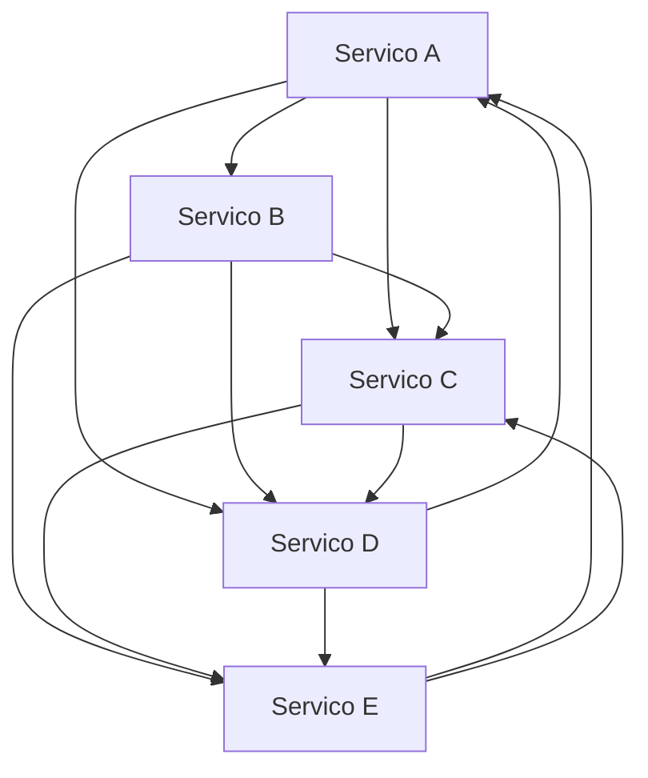

Esse diagrama com apenas 5 servicos ja e confuso. Imagine com 50. E por isso que padrões arquiteturais existem — para transformar caos em ordem.

---

## Padrão 1: API Gateway — O Porteiro do Sistema

### O que e

Um API Gateway e um servico que fica na frente de todos os outros servicos e funciona como ponto único de entrada. Todo o trafego externo (apps, sites, parceiros) passa pelo gateway antes de chegar aos microservicos internos.

Pense em um predio comercial com 50 empresas. Em vez de cada empresa ter sua propria portaria na rua, existe uma única portaria central. Você chega, diz para onde quer ir, e o porteiro direciona você. O porteiro também verifica sua identidade, registra sua entrada e pode negar acesso se necessário.

### Qual Problema Resolve

Sem um gateway, cada microservico precisa lidar individualmente com:
- Autenticação (verificar quem esta chamando)
- Rate limiting (limitar número de requisicoes)
- Logging (registrar quem chamou o que)
- CORS (permitir chamadas de navegadores)
- SSL/TLS (criptografia)
- Roteamento (direcionar para o servico certo)

Com um gateway, tudo isso e centralizado em um único lugar. Os microservicos internos so precisam se preocupar com sua lógica de negocio.

### Como Funciona

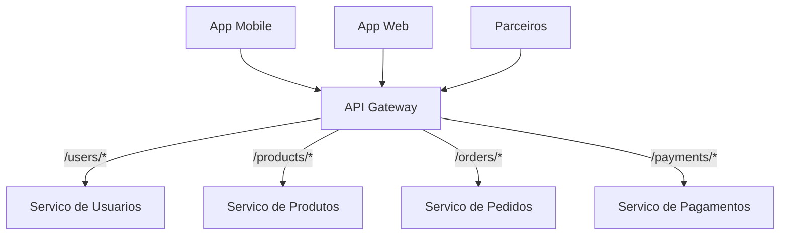

O gateway recebe todas as requisicoes e roteia para o servico correto baseado na URL:
- `GET /users/123` → encaminha para o Servico de Usuarios
- `POST /orders` → encaminha para o Servico de Pedidos
- `GET /products?category=eletronicos` → encaminha para o Servico de Produtos

### Responsabilidades do Gateway

| Responsabilidade | O que faz | Por que importa |
|-----------------|-----------|-----------------|
| Roteamento | Direciona requisicoes para o servico correto | Clientes não precisam conhecer cada servico |
| Autenticação | Verifica tokens, API keys | Centraliza segurança em um único ponto |
| Rate limiting | Limita requisicoes por cliente/tempo | Protege servicos de sobrecarga |
| Logging | Registra todas as requisicoes | Auditoria e debugging |
| Transformacao | Converte formatos de dados | Adapta respostas para diferentes clientes |
| Cache | Armazena respostas frequentes | Reduz carga nos servicos internos |
| Circuit breaker | Interrompe chamadas a servicos com falha | Evita cascata de erros |
| Load balancing | Distribui carga entre instâncias | Melhora performance e disponibilidade |

### Gateways no Mundo Real

- **Kong**: gateway open source muito popular, usado por empresas como Nasdaq e Honeywell
- **AWS API Gateway**: servico gerenciado da Amazon para APIs na nuvem
- **NGINX**: além de servidor web, funciona como gateway e load balancer
- **Traefik**: gateway moderno, popular em ambientes com Docker e Kubernetes

### Cuidados com o Gateway

O gateway e um ponto único de falha — se ele cair, nada funciona. Por isso:
- Sempre tenha multiplas instâncias do gateway (redundancia)
- Monitore o gateway com atencao especial
- Mantenha o gateway leve — ele deve rotear, não processar lógica de negocio
- Evite colocar lógica de negocio no gateway (anti-pattern comum)

---

## Padrão 2: Service Discovery — Como Servicos se Encontram

### O que e

Em um sistema com dezenas de microservicos, cada um rodando em multiplas instâncias, como um servico sabe o endereco do outro? O Servico A precisa chamar o Servico B, mas o B pode estar rodando em qualquer máquina, em qualquer porta, e pode ter 5 instâncias ativas.

Service Discovery e o mecanismo que resolve esse problema. E como uma lista telefonica automática: cada servico se registra quando sobe ("estou vivo, meu endereco e 10.0.1.5:8080") e consulta quando precisa chamar outro ("qual o endereco do Servico B?").

### Como Funciona

Existem dois modelos:

**Client-side discovery**: o cliente consulta um registro central e decide para qual instância enviar a requisicao.

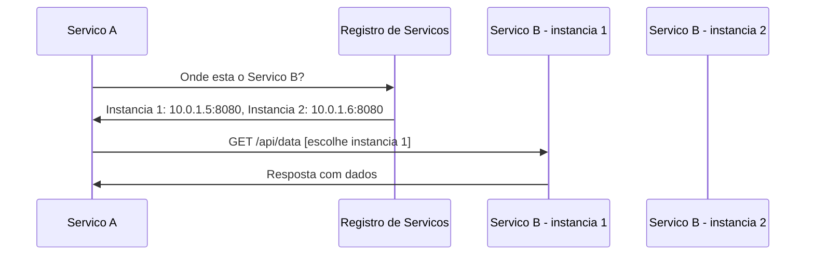

**Server-side discovery**: o cliente envia para um load balancer, que consulta o registro e encaminha.

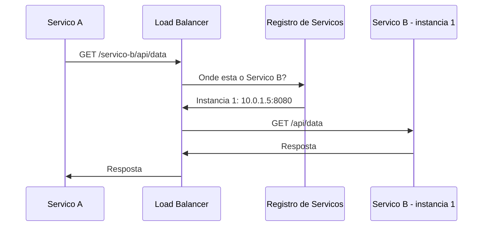

### Ferramentas de Service Discovery

| Ferramenta | Tipo | Usado por |
|------------|------|-----------|
| Consul (HashiCorp) | Registro dedicado | Muitas empresas, multi-cloud |
| etcd | Registro distribuido | Kubernetes (internamente) |
| Kubernetes DNS | Integrado ao orquestrador | Qualquer cluster Kubernetes |
| Eureka (Netflix) | Registro para Java/Spring | Ecossistema Netflix/Spring |
| ZooKeeper (Apache) | Coordenacao distribuida | Kafka, Hadoop, sistemas legados |

### Por que Importa

Sem service discovery, você teria que configurar manualmente o endereco de cada servico em cada outro servico que precisa chama-lo. Quando um servico muda de endereco (deploy novo, escalonamento, falha), você teria que atualizar a configuração em todos os lugares. Com service discovery, isso e automático.

---

## Padrão 3: Circuit Breaker — O Disjuntor do Sistema

### O que e

Você conhece o disjuntor da sua casa? Quando ha um curto-circuito ou sobrecarga, o disjuntor desarma automaticamente para proteger a instalacao eletrica. Sem ele, os fios poderiam pegar fogo.

O Circuit Breaker em software funciona da mesma forma. Quando um servico esta falhando repetidamente, o circuit breaker "desarma" e para de enviar requisicoes para aquele servico. Em vez de ficar tentando e falhando (desperdicando recursos e tempo), o sistema retorna um erro rápido ou uma resposta alternativa.

### O Problema que Resolve

Imagine que o Servico de Pagamentos esta fora do ar. Sem circuit breaker, o que acontece:

1. O Servico de Pedidos chama o Servico de Pagamentos
2. A requisicao fica esperando... esperando... timeout apos 30 segundos
3. Enquanto espera, a thread fica bloqueada
4. Mais pedidos chegam, mais threads ficam bloqueadas
5. O Servico de Pedidos fica sem threads disponiveis
6. O Servico de Pedidos para de responder
7. Outros servicos que dependem do Servico de Pedidos também param
8. Efeito cascata: um servico derruba o sistema inteiro

Isso se chama **falha em cascata** — e um dos problemas mais perigosos em sistemas distribuidos.

### Os Tres Estados

O circuit breaker tem tres estados:

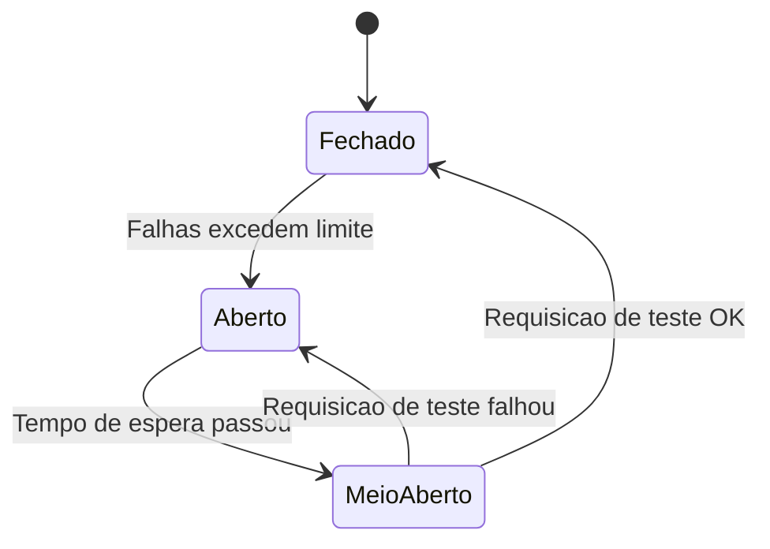

| Estado | Comportamento | Analogia |
|--------|--------------|----------|
| Fechado (normal) | Requisicoes passam normalmente | Disjuntor ligado, energia fluindo |
| Aberto (proteção) | Requisicoes são bloqueadas imediatamente | Disjuntor desarmado, energia cortada |
| Meio-aberto (teste) | Permite uma requisicao de teste | Tentando religar o disjuntor |

### Exemplo de Fluxo

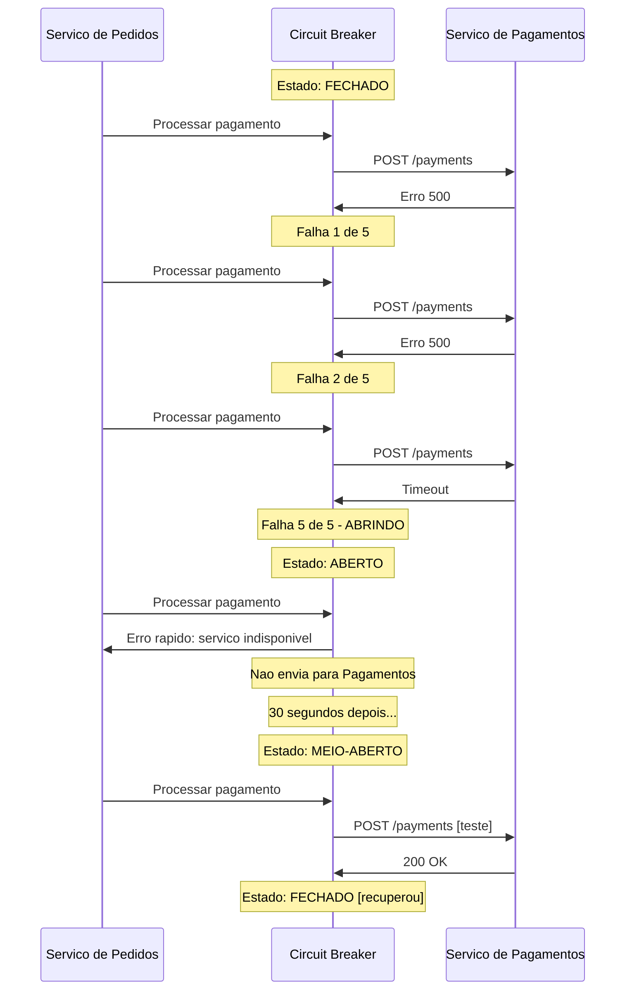

### Fallback: O Plano B

Quando o circuit breaker esta aberto, você pode oferecer uma resposta alternativa em vez de simplesmente retornar erro:

| Cenário | Fallback |
|---------|----------|
| Servico de recomendacoes fora do ar | Mostrar produtos mais vendidos (cache) |
| Servico de frete fora do ar | Mostrar "frete a calcular" e processar depois |
| Servico de avaliacoes fora do ar | Mostrar "avaliacoes indisponiveis" |
| Servico de pagamento fora do ar | Colocar pedido em fila para processar quando voltar |

### Circuit Breaker no Mundo Real

- **Netflix**: criou a biblioteca Hystrix (agora em modo de manutenção, substituida por Resilience4j) que popularizou o padrão
- **Qualquer sistema com microservicos**: circuit breaker e considerado obrigatório em arquiteturas distribuidas

---

## Padrão 4: Retry com Backoff Exponencial

### O que e

Quando uma requisicao falha, a reacao natural e tentar de novo. Mas tentar de novo imediatamente, repetidamente, pode piorar o problema — se o servico esta sobrecarregado, bombardea-lo com retentativas so piora a sobrecarga.

Retry com backoff exponencial e a estrategia de tentar de novo, mas esperando cada vez mais tempo entre as tentativas:

| Tentativa | Espera | Tempo total |
|-----------|--------|-------------|
| 1a | 0s (imediata) | 0s |
| 2a | 1s | 1s |
| 3a | 2s | 3s |
| 4a | 4s | 7s |
| 5a | 8s | 15s |
| 6a | 16s | 31s |

A espera dobra a cada tentativa — por isso "exponencial". Isso da tempo para o servico se recuperar sem sobrecarrega-lo.

### Jitter: Adicionando Aleatoriedade

Imagine que 1.000 clientes tentam chamar um servico ao mesmo tempo e todos falham. Se todos usarem o mesmo backoff, todos vao tentar de novo ao mesmo tempo — 1 segundo depois, 2 segundos depois, 4 segundos depois. Isso cria "ondas" de requisicoes que continuam sobrecarregando o servico.

A solução e adicionar **jitter** (aleatoriedade): em vez de esperar exatamente 2 segundos, esperar entre 1 e 3 segundos (aleatorio). Isso distribui as retentativas no tempo e evita as ondas.

```
# Sem jitter: todos tentam ao mesmo tempo
Tentativa 2: todos em t=1s
Tentativa 3: todos em t=3s
Tentativa 4: todos em t=7s

# Com jitter: distribuidos no tempo
Tentativa 2: entre t=0.5s e t=1.5s
Tentativa 3: entre t=1.5s e t=4.5s
Tentativa 4: entre t=3.5s e t=10.5s
```

### Quando Usar Retry

| Tipo de erro | Deve fazer retry? | Por que |
|-------------|-------------------|---------|
| Timeout | Sim | O servico pode estar temporariamente lento |
| Erro 500 (Internal Server Error) | Sim | Pode ser um problema temporário |
| Erro 503 (Service Unavailable) | Sim | Servico sobrecarregado, pode se recuperar |
| Erro 429 (Too Many Requests) | Sim, com backoff maior | Você esta sendo limitado, espere mais |
| Erro 400 (Bad Request) | Não | Seus dados estao errados, retry não vai resolver |
| Erro 401 (Unauthorized) | Não | Credenciais invalidas, retry não vai resolver |
| Erro 404 (Not Found) | Não | O recurso não existe, retry não vai resolver |

A regra geral: faca retry em erros temporarios (5xx, timeout). Não faca retry em erros do cliente (4xx) — o problema e seu, não do servidor.

---

## Padrão 5: Idempotencia — Segurança nas Retentativas

### O que e

Se você faz retry de uma requisicao, como garantir que a operação não e executada duas vezes? Imagine que você envia um pagamento de R$ 100. A requisicao chega ao servidor, o pagamento e processado, mas a resposta se perde no caminho de volta. Você não recebeu confirmacao, então faz retry. O servidor recebe de novo e processa outro pagamento de R$ 100. Agora foram cobrados R$ 200.

Uma operação e **idempotente** quando executa-la uma vez ou várias vezes produz o mesmo resultado. Idempotencia e essencial em sistemas distribuidos porque retentativas são inevitaveis.

### Exemplos de Idempotencia

| Operação | Idempotente? | Por que |
|----------|-------------|---------|
| GET /users/123 | Sim | Ler dados não muda nada |
| DELETE /users/123 | Sim | Deletar algo que ja foi deletado não muda nada |
| PUT /users/123 {name: "Maria"} | Sim | Substituir com os mesmos dados produz o mesmo resultado |
| POST /payments {valor: 100} | Não | Cada chamada cria um novo pagamento |

### Como Tornar Operações Idempotentes

A técnica mais comum e usar uma **chave de idempotencia** — um identificador único que o cliente envia junto com a requisicao:

```
POST /payments
Headers:
  Idempotency-Key: abc-123-def-456
Body:
  { "valor": 100, "destino": "loja-xyz" }
```

O servidor verifica: "ja recebi uma requisicao com a chave abc-123-def-456?" Se sim, retorna o resultado da primeira execução sem processar de novo. Se não, processa normalmente e guarda o resultado associado a essa chave.

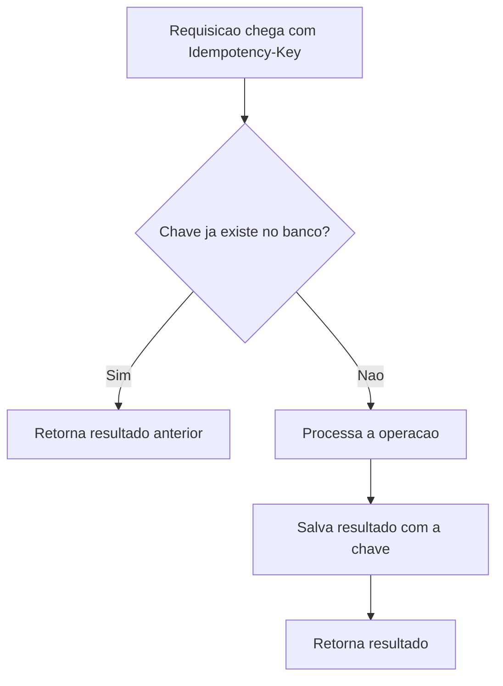

### Idempotencia no Mundo Real

- **Stripe**: toda requisicao de pagamento aceita um header `Idempotency-Key`
- **AWS**: operações de criação de recursos aceitam `ClientToken` para idempotencia
- **PIX**: cada transação tem um ID único que garante que não sera processada duas vezes

---

## Padrão 6: Saga — Transações Distribuidas

### O que e

Em um banco de dados único, você pode usar transações: "faca A, B e C juntos — se qualquer um falhar, desfaca tudo". Isso e o ACID que você aprendeu no capítulo 8.

Mas em microservicos, cada servico tem seu proprio banco de dados. Não existe uma transação que abranja multiplos servicos. Como garantir consistência quando uma operação envolve vários servicos?

O padrão Saga resolve isso dividindo uma transação distribuida em uma sequência de transações locais, cada uma em seu servico. Se uma etapa falha, as etapas anteriores são desfeitas por "transações compensatorias".

### Exemplo: Pedido em E-commerce

Quando um cliente faz um pedido, os seguintes passos precisam acontecer:

1. Servico de Pedidos: criar o pedido
2. Servico de Estoque: reservar os itens
3. Servico de Pagamentos: cobrar o cliente
4. Servico de Entregas: agendar a entrega

Se o pagamento falhar na etapa 3, precisamos desfazer as etapas 1 e 2:

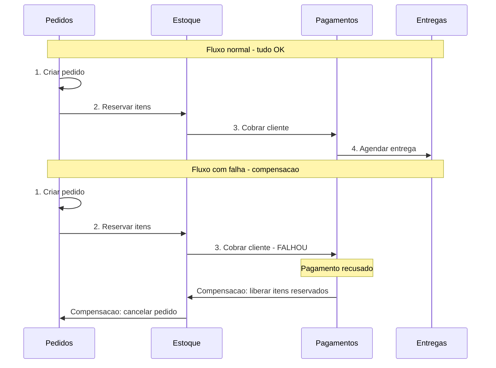

### Tipos de Saga

| Tipo | Como funciona | Quando usar |
|------|--------------|-------------|
| Coreografia | Cada servico sabe o próximo passo e pública eventos | Sagas simples com poucos passos |
| Orquestracao | Um servico central coordena todos os passos | Sagas complexas com muitos passos |

**Coreografia**: cada servico escuta eventos e reage. O Servico de Pedidos pública "pedido criado", o Estoque escuta e reserva itens, pública "itens reservados", o Pagamento escuta e cobra, e assim por diante. Não ha coordenador central.

**Orquestracao**: um servico orquestrador (Saga Manager) coordena tudo. Ele diz ao Estoque "reserve itens", espera a resposta, diz ao Pagamento "cobre o cliente", espera a resposta, e assim por diante. Se algo falha, o orquestrador sabe exatamente quais compensacoes executar.

### Saga no Mundo Real

- **Uber**: quando você solicita uma corrida, uma saga coordena: encontrar motorista, calcular preco, reservar motorista, iniciar corrida. Se o motorista cancela, a saga desfaz tudo.
- **Amazon**: o processo de compra envolve uma saga com estoque, pagamento, logistica e notificacao.
- **Bancos**: transferencias entre contas em bancos diferentes usam sagas para garantir que o debito e o credito acontecam de forma consistente.

---

## Padrão 7: Event-Driven Architecture — Arquitetura Orientada a Eventos

### O que e

Em vez de servicos chamarem uns aos outros diretamente (acoplamento), servicos publicam eventos quando algo acontece, e outros servicos reagem a esses eventos. Ninguem chama ninguem diretamente — todos se comunicam através de eventos.

Pense em um jornal. O jornal pública noticias. Leitores assinam o jornal e recebem as noticias. O jornal não sabe quem são os leitores, e os leitores não sabem como o jornal funciona internamente. A única coisa que os conecta e a noticia publicada.

### Comparação: Chamada Direta vs Eventos

**Chamada direta (acoplamento forte):**

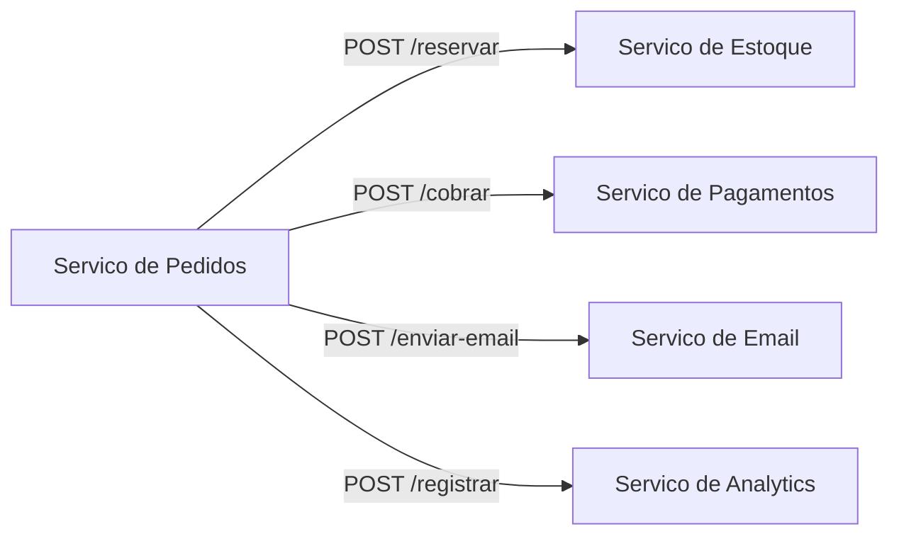

O Servico de Pedidos precisa conhecer todos os outros servicos. Se um novo servico precisar ser notificado, o Servico de Pedidos precisa ser alterado.

**Eventos (acoplamento fraco):**

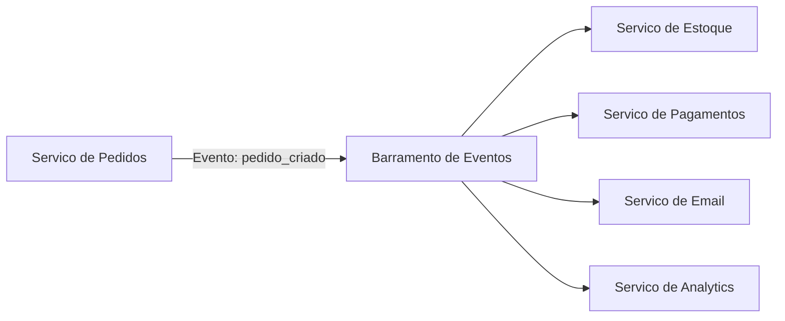

O Servico de Pedidos so pública um evento. Não sabe e não se importa com quem esta escutando. Se um novo servico precisar reagir, ele simplesmente se inscreve no evento — sem alterar o Servico de Pedidos.

### Vantagens e Desvantagens

| Aspecto | Vantagem | Desvantagem |
|---------|----------|-------------|
| Acoplamento | Servicos independentes | Difícil rastrear o fluxo completo |
| Escalabilidade | Cada servico escala independentemente | Complexidade de infraestrutura |
| Resiliencia | Falha de um servico não afeta outros | Consistência eventual (não imediata) |
| Evolução | Adicionar consumers sem alterar producers | Debugging mais complexo |
| Performance | Processamento paralelo natural | Latencia pode ser maior |

### Consistência Eventual

Em arquiteturas orientadas a eventos, os dados não ficam consistentes imediatamente. Quando o Servico de Pedidos pública "pedido criado", o Estoque pode levar alguns milissegundos (ou segundos) para processar o evento e atualizar seu estado. Durante esse intervalo, o sistema esta em um estado "eventualmente consistente" — vai ficar consistente, mas não esta agora.

Para muitos cenários, isso e perfeitamente aceitavel. Você não precisa que o email de confirmacao chegue no mesmo milissegundo em que o pedido e criado. Mas para outros cenários (como debitar dinheiro de uma conta), consistência imediata pode ser necessária — e ai você usa chamadas sincronas.

---

## Padrão 8: Observabilidade — Enxergando o que Acontece

### O que e

Em um monolito, quando algo da errado, você olha um log, em um lugar, e encontra o problema. Em microservicos, uma única requisicao do usuario pode passar por 10 servicos diferentes. Se algo da errado, onde você procura?

Observabilidade e a capacidade de entender o que esta acontecendo dentro do sistema olhando de fora. Ela se baseia em tres pilares:

### Os Tres Pilares

| Pilar | O que e | Analogia |
|-------|---------|----------|
| Logs | Registros textuais de eventos | Diario: "as 14:32 aconteceu X" |
| Metricas | Números que medem o comportamento | Painel do carro: velocidade, temperatura, combustivel |
| Traces | Rastreamento de uma requisicao entre servicos | GPS: o caminho completo que a requisicao percorreu |

### Distributed Tracing: Seguindo a Requisicao

O conceito mais importante para microservicos e o **distributed tracing** (rastreamento distribuido). Cada requisicao recebe um identificador único (trace ID) que e propagado entre todos os servicos. Assim, você pode reconstruir o caminho completo:

```
Trace ID: abc-123

[14:32:01.000] API Gateway     → Recebeu GET /orders/456
[14:32:01.005] Servico Pedidos → Buscando pedido 456
[14:32:01.010] Servico Pedidos → Chamando Servico de Usuarios
[14:32:01.015] Servico Usuarios → Buscando usuario 789
[14:32:01.025] Servico Usuarios → Retornou usuario 789
[14:32:01.030] Servico Pedidos → Chamando Servico de Produtos
[14:32:01.035] Servico Produtos → Buscando produto 101
[14:32:01.050] Servico Produtos → Retornou produto 101
[14:32:01.055] Servico Pedidos → Montando resposta
[14:32:01.060] API Gateway     → Retornou 200 OK (60ms total)
```

Com esse trace, você sabe exatamente onde o tempo foi gasto e onde procurar se algo falhar.

### Ferramentas de Observabilidade

| Ferramenta | Pilar | Descrição |
|------------|-------|-----------|
| Jaeger | Traces | Rastreamento distribuido, criado pelo Uber |
| Zipkin | Traces | Rastreamento distribuido, criado pelo Twitter |
| Prometheus | Metricas | Coleta e armazenamento de metricas |
| Grafana | Metricas/Logs | Dashboards e visualização |
| ELK Stack | Logs | Elasticsearch + Logstash + Kibana para logs |
| Datadog | Todos | Plataforma completa de observabilidade |
| OpenTelemetry | Todos | Padrão aberto para instrumentacao |

---

## As 8 Falacias da Computacao Distribuida

Em 1994, Peter Deutsch (engenheiro da Sun Microsystems) listou 8 suposicoes que desenvolvedores fazem sobre redes — e que são todas falsas. Essas "falacias" são tao relevantes hoje quanto eram ha 30 anos:

| Falacia | O que você assume | A realidade |
|---------|-------------------|-------------|
| 1. A rede e confiavel | Requisicoes sempre chegam | Pacotes se perdem, conexões caem |
| 2. A latencia e zero | Chamadas remotas são instantaneas | Cada chamada tem latencia (ms a segundos) |
| 3. A banda e infinita | Posso enviar quantos dados quiser | Banda e limitada e compartilhada |
| 4. A rede e segura | Ninguem intercepta meus dados | Tudo pode ser interceptado sem criptografia |
| 5. A topologia não muda | Os servicos estao sempre no mesmo lugar | Servicos mudam de endereco, escalam, morrem |
| 6. Ha um único administrador | Uma pessoa controla tudo | Multiplas equipes, multiplos provedores |
| 7. O custo de transporte e zero | Enviar dados não custa nada | Serialização, rede e parse tem custo |
| 8. A rede e homogenea | Todos usam a mesma tecnologia | Sistemas diferentes, protocolos diferentes |

Todos os padrões que vimos neste módulo — circuit breaker, retry, idempotencia, saga — existem porque essas falacias são falsas. Se a rede fosse confiavel, não precisariamos de retry. Se a latencia fosse zero, não precisariamos de cache. Se a rede fosse segura, não precisariamos de autenticação.

---

## Juntando Tudo: Arquitetura de Referência

Vamos ver como todos esses padrões se combinam em um sistema real. Considere um e-commerce com os seguintes servicos:

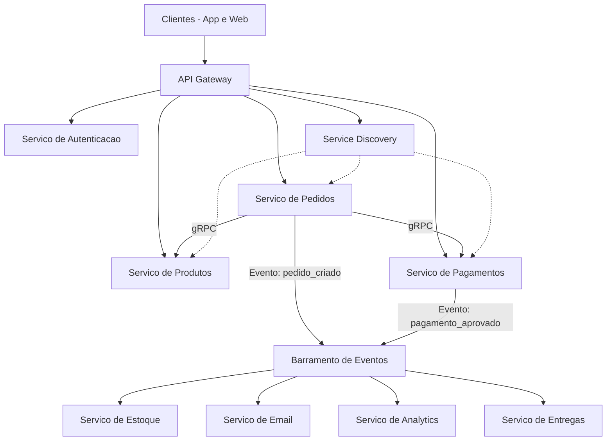

Nessa arquitetura:
- **API Gateway**: ponto único de entrada, autenticação, rate limiting
- **REST**: comunicação entre clientes e gateway
- **gRPC**: comunicação sincrona entre microservicos internos (performance)
- **Eventos/Filas**: comunicação assincrona para operações que não precisam de resposta imediata
- **Service Discovery**: servicos se encontram automaticamente
- **Circuit Breaker**: em cada chamada sincrona entre servicos
- **Retry com backoff**: em chamadas que podem falhar temporariamente
- **Idempotencia**: em operações de pagamento e criação de pedidos
- **Saga**: para o fluxo completo de pedido (criar → reservar estoque → cobrar → entregar)
- **Observabilidade**: traces distribuidos em todas as chamadas

---

## Principios para Projetar Integracoes

Depois de ver todos esses padrões, aqui estao os principios que guiam boas decisoes de integração:

### 1. Prefira Acoplamento Fraco

Servicos devem saber o mínimo possível sobre os outros. Use eventos em vez de chamadas diretas quando possível. Quanto menos um servico sabe sobre os outros, mais fácil e mudar, escalar e manter cada um independentemente.

### 2. Projete para Falha

Em sistemas distribuidos, falhas não são exceção — são regra. Todo servico vai falhar em algum momento. Projete assumindo que qualquer chamada pode falhar: use circuit breaker, retry, fallback e timeouts.

### 3. Idempotencia por Padrão

Toda operação que pode ser retentada deve ser idempotente. Isso inclui: criação de recursos (use chave de idempotencia), processamento de mensagens de filas (use deduplicacao), e webhooks (verifique se ja processou).

### 4. Sincrono para o que Precisa de Resposta Imediata

Use chamadas sincronas (REST, gRPC) quando o cliente precisa da resposta para continuar. Exemplo: verificar se o usuario esta autenticado, buscar dados para mostrar na tela.

### 5. Assincrono para o Resto

Use comunicação assincrona (filas, eventos) para tudo que não precisa de resposta imediata. Exemplo: enviar email, atualizar analytics, gerar relatórios, processar pagamentos em background.

### 6. Observe Tudo

Se você não consegue ver o que esta acontecendo, não consegue consertar quando quebra. Implemente logging, metricas e tracing desde o inicio — não deixe para depois.

### 7. Comece Simples

Não implemente todos os padrões de uma vez. Comece com REST, adicione circuit breaker quando precisar, adicione filas quando a carga exigir, adicione tracing quando o debugging ficar difícil. Cada padrão adiciona complexidade — so adicione quando o problema justificar.

---

## Como a IA pode te ajudar aqui

**Prompt 1 — Listar e descobrir:**
> "Estou projetando um sistema de delivery com 5 microservicos. Me ajude a decidir quais comunicacoes devem ser sincronas e quais assincronas"

**Prompt 2 — Explorar o conceito:**
> "Explique o padrão Saga com um exemplo de transferencia bancaria entre dois bancos diferentes. Mostre o fluxo normal e o fluxo de compensacao"

**Prompt 3 — Entender erros comuns:**
> "Quais são os erros mais comuns que desenvolvedores juniores cometem ao projetar integracoes entre microservicos?"

---

## Casos de Uso no Mundo Real

### Caso 1: Netflix e o Circuit Breaker

A Netflix foi pioneira no uso de circuit breakers em microservicos. Com mais de 1.000 microservicos, falhas são constantes — algum servico esta sempre com problema. A Netflix criou a biblioteca Hystrix especificamente para implementar circuit breakers. Quando o servico de recomendacoes falha, em vez de mostrar erro, o app mostra uma lista genérica de filmes populares (fallback). O usuario nem percebe que algo deu errado. Essa abordagem permitiu que a Netflix mantivesse 99.99% de disponibilidade mesmo com falhas constantes em servicos individuais.

### Caso 2: Mercado Livre e Event-Driven Architecture

O Mercado Livre processa milhoes de transações por dia na America Latina. Quando um comprador finaliza uma compra, um evento "compra_realizada" e publicado. Dezenas de servicos reagem: estoque e atualizado, pagamento e processado, vendedor e notificado, logistica e acionada, metricas são registradas, recomendacoes são atualizadas. Cada servico processa o evento no seu ritmo, sem depender dos outros. Se o servico de email estiver lento, isso não atrasa o processamento do pagamento. Essa arquitetura permite que o Mercado Livre escale cada servico independentemente conforme a demanda.

### Caso 3: PIX e Idempotencia

O sistema PIX do Banco Central do Brasil processa milhoes de transações por dia. Cada transação tem um identificador único (EndToEndId) que garante idempotencia. Se uma transação e enviada duas vezes (por falha de rede, retry, ou qualquer outro motivo), o sistema detecta o ID duplicado e não processa novamente. Isso e critico em um sistema financeiro — cobrar duas vezes seria inaceitavel. A idempotencia e implementada em todas as camadas: no app do banco, no sistema do banco, e no sistema central do Banco Central.

---

## Resumo do Módulo

| Conceito | Definição |
|----------|-----------|
| API Gateway | Ponto único de entrada que roteia, autentica e protege microservicos |
| Service Discovery | Mecanismo para servicos se encontrarem automaticamente |
| Circuit Breaker | Padrão que interrompe chamadas a servicos com falha para evitar cascata |
| Fallback | Resposta alternativa quando o servico principal esta indisponivel |
| Retry com Backoff | Retentativa com espera crescente entre tentativas |
| Jitter | Aleatoriedade adicionada ao backoff para evitar ondas de requisicoes |
| Idempotencia | Operação que produz o mesmo resultado independente de quantas vezes e executada |
| Saga | Padrão para transações distribuidas com compensacao em caso de falha |
| Event-Driven | Arquitetura onde servicos se comunicam por eventos, sem chamadas diretas |
| Consistência Eventual | Dados ficam consistentes apos um intervalo, não imediatamente |
| Observabilidade | Capacidade de entender o sistema por logs, metricas e traces |
| Distributed Tracing | Rastreamento de uma requisicao através de multiplos servicos |
| Falacias da Computacao Distribuida | 8 suposicoes falsas sobre redes que causam bugs |

---

## Glossário do Módulo

| Termo | Definição |
|-------|-----------|
| ACID | Atomicidade, Consistência, Isolamento, Durabilidade — propriedades de transações |
| API Gateway | Servico que centraliza o acesso a microservicos |
| Backoff exponencial | Estrategia de espera que dobra o intervalo entre retentativas |
| Barramento de eventos | Infraestrutura que transporta eventos entre servicos |
| Big ball of mud | Anti-padrão: sistema sem estrutura onde tudo depende de tudo |
| Circuit breaker | Padrão que interrompe chamadas a servicos com falha |
| Client-side discovery | Modelo onde o cliente consulta o registro e escolhe a instância |
| Compensacao | Operação que desfaz o efeito de uma operação anterior |
| Consistência eventual | Modelo onde dados convergem para consistência ao longo do tempo |
| Consul | Ferramenta de service discovery da HashiCorp |
| Coreografia | Tipo de saga onde cada servico decide o próximo passo |
| CORS (Cross-Origin Resource Sharing) | Mecanismo de segurança para requisicoes entre dominios |
| Datadog | Plataforma de observabilidade |
| Distributed tracing | Rastreamento de requisicoes entre multiplos servicos |
| ELK Stack | Elasticsearch + Logstash + Kibana para gerenciamento de logs |
| etcd | Armazenamento distribuido de chave-valor usado pelo Kubernetes |
| Eureka | Service discovery do ecossistema Netflix/Spring |
| Event-driven architecture | Arquitetura baseada em publicacao e consumo de eventos |
| Falacia | Suposicao falsa que parece verdadeira |
| Fallback | Resposta alternativa quando o servico principal falha |
| Grafana | Ferramenta de visualização de metricas e dashboards |
| Hystrix | Biblioteca de circuit breaker criada pela Netflix |
| Idempotencia | Propriedade de operação que pode ser repetida sem efeito colateral |
| Idempotency-Key | Header HTTP usado para garantir idempotencia |
| Jaeger | Sistema de distributed tracing criado pelo Uber |
| Jitter | Aleatoriedade adicionada a intervalos de retry |
| Kong | API Gateway open source |
| Load balancer | Componente que distribui requisicoes entre multiplas instâncias |
| Observabilidade | Capacidade de entender o estado interno de um sistema |
| OpenTelemetry | Padrão aberto para instrumentacao de observabilidade |
| Orquestracao | Tipo de saga com coordenador central |
| Prometheus | Sistema de monitoramento e coleta de metricas |
| Rate limiting | Limitacao do número de requisicoes por período |
| Redundancia | Ter multiplas copias de um componente para evitar falha total |
| Resilience4j | Biblioteca Java de resiliencia (circuit breaker, retry, etc.) |
| Retry | Retentativa de uma operação que falhou |
| Saga | Padrão para gerenciar transações distribuidas |
| Server-side discovery | Modelo onde um load balancer consulta o registro |
| Service discovery | Mecanismo para servicos se encontrarem automaticamente |
| SSL/TLS | Protocolos de criptografia para comunicação segura |
| Timeout | Tempo máximo de espera por uma resposta |
| Trace ID | Identificador único que acompanha uma requisicao entre servicos |
| Transação compensatoria | Operação que reverte o efeito de uma transação anterior |
| Zipkin | Sistema de distributed tracing criado pelo Twitter |
| ZooKeeper | Servico de coordenacao distribuida do Apache |

---

## Na Cultura Popular

- **Apollo 13** (filme, 1995) — quando o módulo de servico falha, a equipe da NASA precisa improvisar soluções usando apenas os recursos disponiveis. E exatamente o conceito de fallback: quando o sistema principal falha, você precisa ter um plano B. A frase "Houston, we have a problem" e o equivalente de um alerta de circuit breaker abrindo.
- **The Martian** (filme, 2015) — Mark Watney sobrevive em Marte porque projeta sistemas resilientes: se uma coisa falha, tem backup. Se o backup falha, tem outro plano. Essa mentalidade de "projetar para falha" e exatamente o que fazemos em arquitetura de microservicos.
- **Mr. Robot** (serie, 2015-2019) — mostra como sistemas interconectados podem ter falhas em cascata. Quando Elliot ataca um servico, o efeito se propaga para outros — exatamente o problema que circuit breakers e arquitetura event-driven tentam evitar.

---

## Para Saber Mais

- [Postman Learning Center](https://learning.postman.com/) — *Tutoriais para testar e documentar APIs, incluindo cenários de microservicos*
- [REST API Tutorial](https://restfulapi.net/) — *Guia completo sobre principios REST e boas práticas de design de APIs*
- [Martin Fowler — Microservices](https://martinfowler.com/articles/microservices.html) — *Artigo classico que define o padrão de microservicos*
- [Microsoft — Cloud Design Patterns](https://learn.microsoft.com/en-us/azure/architecture/patterns/) — *Catalogo completo de padrões para sistemas distribuidos na nuvem*
- [Fabio Akita — Arquitetura](https://www.youtube.com/@Akitando) — *Videos profundos sobre arquitetura e decisoes técnicas em portugues*

---

## Perguntas Frequentes (FAQ)

**P: Preciso implementar todos esses padrões no meu primeiro projeto?**
R: Não. Comece com o básico: REST, um único servico, sem microservicos. Adicione complexidade conforme o problema exigir. Circuit breaker so faz sentido quando você tem multiplos servicos. Saga so faz sentido quando você tem transações distribuidas. A maioria dos projetos pequenos e medios funciona perfeitamente com um monolito bem estruturado.

**P: API Gateway e obrigatório em microservicos?**
R: Na prática, sim. Sem gateway, cada cliente precisa conhecer o endereco de cada microservico, e cada microservico precisa implementar autenticação, rate limiting e logging. O gateway centraliza tudo isso. Em projetos pequenos, um NGINX configurado como reverse proxy ja funciona como gateway básico.

**P: Circuit breaker e a mesma coisa que timeout?**
R: Não. Timeout e o tempo máximo que você espera por uma resposta individual. Circuit breaker e um padrão que monitora multiplas falhas ao longo do tempo e decide parar de tentar. Timeout e por requisicao; circuit breaker e por servico. Você usa os dois juntos: timeout em cada requisicao, circuit breaker monitorando o padrão de falhas.

**P: O que e "consistência eventual" na prática?**
R: Significa que depois de uma operação, os dados podem estar temporariamente inconsistentes entre servicos, mas vao convergir para o estado correto. Exemplo: você faz uma compra, o estoque e atualizado em 2 segundos, o email chega em 5 segundos, o relatório de vendas e atualizado em 1 minuto. Tudo fica consistente, mas não no mesmo instante.

**P: Saga e muito complexo. Tem alternativa?**
R: Para casos simples, você pode usar "melhor esforco" — tenta fazer tudo, e se algo falhar, registra para correcao manual. Para casos medios, você pode usar filas com retry — se o pagamento falhar, a mensagem volta para a fila e tenta de novo. Saga e necessária quando você precisa de garantias fortes de consistência entre multiplos servicos.

**P: Como sei se preciso de microservicos ou se um monolito basta?**
R: Se você esta perguntando, provavelmente um monolito basta. Microservicos adicionam complexidade enorme (service discovery, circuit breaker, tracing, deploy independente). Só valem a pena quando: equipes diferentes precisam deployar independentemente, partes do sistema tem requisitos de escala muito diferentes, ou o monolito ficou grande demais para uma equipe manter.

**P: O que e "service mesh"?**
R: Service mesh e uma camada de infraestrutura que gerência a comunicação entre microservicos automaticamente. Em vez de cada servico implementar circuit breaker, retry e tracing no código, o service mesh faz isso de forma transparente. Ferramentas como Istio e Linkerd são service meshes populares. E um conceito avancado — você não precisa disso no inicio.

**P: Observabilidade e a mesma coisa que monitoramento?**
R: Monitoramento e verificar se o sistema esta funcionando (esta no ar? esta respondendo?). Observabilidade e entender por que o sistema esta se comportando de determinada forma (por que esta lento? onde esta o gargalo? qual servico esta falhando?). Monitoramento responde "esta funcionando?". Observabilidade responde "por que esta assim?".

**P: Posso usar esses padrões com um monolito?**
R: Alguns sim. Retry e idempotencia são úteis em qualquer sistema que faz chamadas externas (APIs de pagamento, envio de email). Observabilidade (logs, metricas) e essencial em qualquer sistema. Circuit breaker faz sentido quando seu monolito chama servicos externos. Saga e service discovery são específicos de microservicos.

**P: O que e "correlation ID"?**
R: E um identificador único gerado no inicio de uma requisicao e propagado por todos os servicos que ela percorre. Funciona como o trace ID do distributed tracing. Quando você precisa debugar um problema, busca pelo correlation ID nos logs de todos os servicos e reconstroi o caminho completo da requisicao.

**P: Event-driven architecture e a mesma coisa que pub/sub?**
R: Pub/sub e um padrão de comunicação (publicar e assinar). Event-driven architecture e um estilo arquitetural que usa pub/sub como mecanismo principal de comunicação. Você pode usar pub/sub sem ter uma arquitetura event-driven (por exemplo, usar pub/sub so para notificacoes). Mas uma arquitetura event-driven sempre usa alguma forma de pub/sub.

---

## Exercícios Práticos

### Exercício 1: Identificando Padrões

Para cada situação, identifique qual padrão arquitetural seria mais adequado:

1. O servico de email esta fora do ar ha 5 minutos e seu sistema continua tentando enviar emails, acumulando milhares de requisicoes na fila de espera
2. Você precisa garantir que uma transferencia bancaria debite de uma conta e credite em outra, mesmo que os servicos estejam em servidores diferentes
3. Uma requisicao do usuario passa por 8 microservicos e você precisa descobrir qual deles esta causando lentidao
4. Seu sistema tem 30 microservicos e cada um precisa saber o endereco dos outros para se comunicar
5. Um cliente faz retry de um pagamento e você precisa garantir que não cobre duas vezes

### Exercício 2: Projetando a Arquitetura de um Sistema

Você esta projetando um sistema de reserva de passagens aereas. Os servicos são:

- Servico de Busca (pesquisar voos)
- Servico de Precos (calcular tarifas)
- Servico de Reservas (criar reservas)
- Servico de Pagamentos (processar pagamento)
- Servico de Assentos (reservar assento)
- Servico de Email (enviar confirmacao)
- Servico de Fidelidade (adicionar milhas)

Desenhe a arquitetura respondendo:
1. Quais comunicacoes são sincronas e quais são assincronas?
2. Onde você colocaria um API Gateway?
3. Onde você usaria circuit breaker?
4. Descreva a saga para o fluxo de reserva (incluindo compensacoes)
5. Quais servicos se beneficiariam de event-driven architecture?

### Exercício 3: Analisando Falhas

Considere o seguinte cenário: um e-commerce tem pico de vendas na Black Friday. O Servico de Pagamentos comeca a ficar lento (tempo de resposta sobe de 200ms para 5 segundos). Descreva:

1. O que acontece sem circuit breaker? (efeito cascata)
2. O que acontece com circuit breaker? (proteção)
3. Qual fallback você implementaria?
4. Como o retry com backoff ajudaria?
5. Como você usaria observabilidade para diagnosticar o problema?

---

[← Anterior: Outras Formas de Integração](cap11-mod05-outras-integracoes-conteudo.md) · [Próximo: FastAPI — Construindo sua Primeira API →](cap11-mod07-fastapi-intro-conteudo.md)
