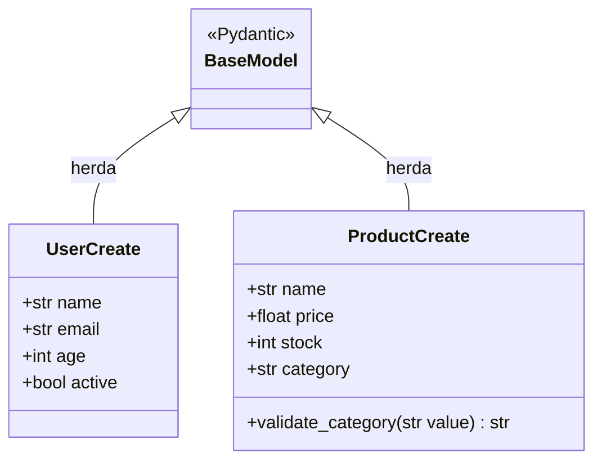
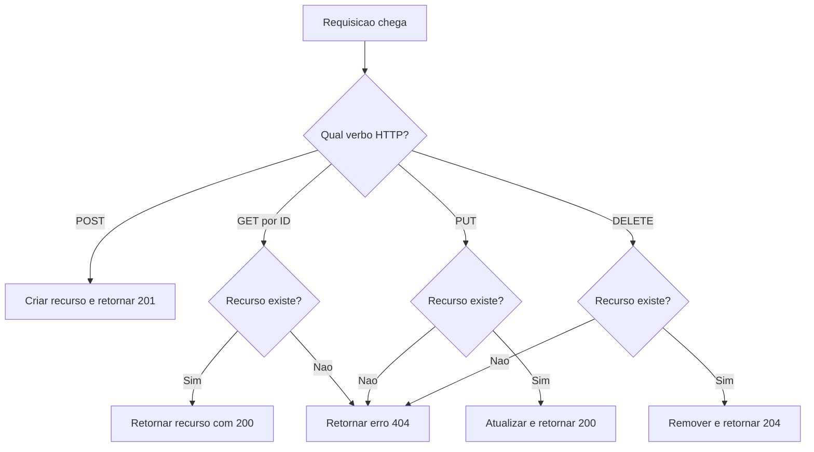
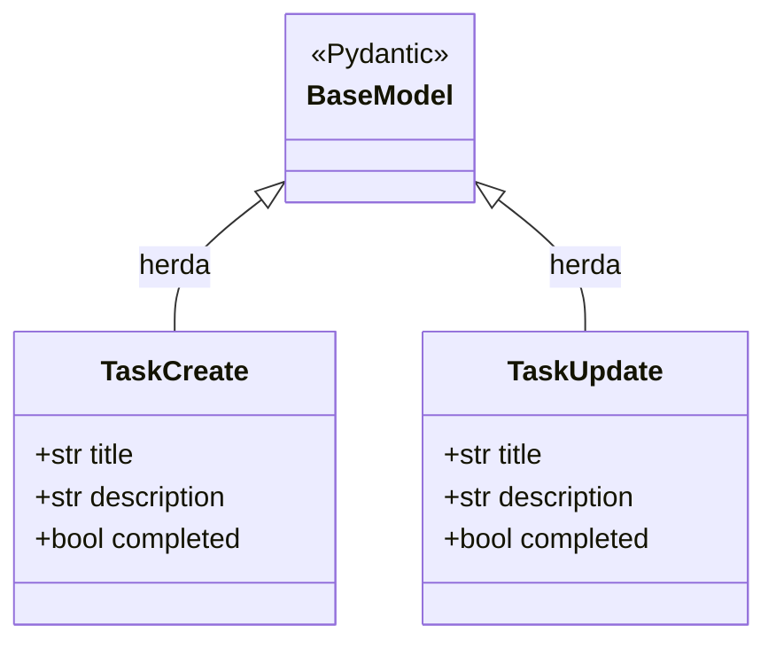
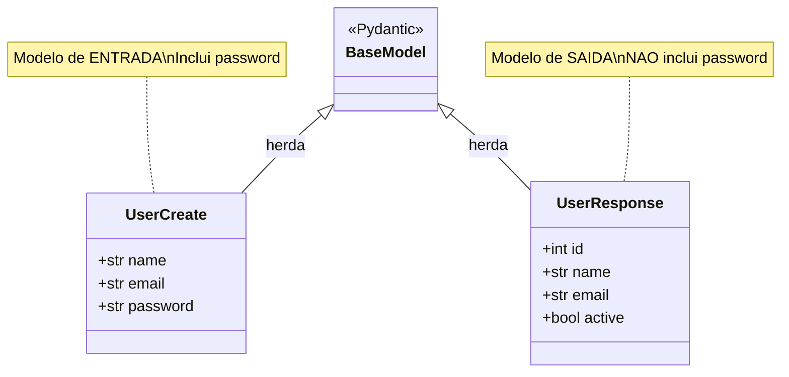

# 11.7 — FastAPI: Construindo sua Primeira API

[← Anterior: Arquitetura de Integracoes](cap11-mod06-arquitetura-integracoes-conteudo.md) · [Próximo: Projeto — CRUD com FastAPI e SQLite →](cap11-mod08-projeto-crud-fastapi-conteudo.md)

---

## Introdução

Nos ultimos seis módulos, você construiu uma base conceitual solida sobre integração de sistemas. Aprendeu como servicos se comunicam, a diferença entre sincrono e assincrono, os detalhes de APIs REST, filas e mensageria, tecnologias alternativas como gRPC e GraphQL, e padrões arquiteturais como circuit breaker e saga.

Agora e hora de colocar a mao no código.

Neste módulo, você vai construir sua primeira API REST real usando FastAPI — um framework Python moderno, rápido e com excelente documentação. Você vai criar endpoints, receber dados, retornar respostas, validar entradas e ver sua API funcionando no navegador. Tudo que você aprendeu sobre verbos HTTP, status codes, JSON e endpoints vai ganhar vida aqui.

Por que FastAPI? Porque e Python — a linguagem que você ja conhece desde o capítulo 5. Porque e simples — você consegue criar uma API funcional em menos de 10 linhas de código. E porque e profissional — empresas como Netflix, Uber e Microsoft usam FastAPI em produção.

---

## Como Executar os Exemplos Deste Módulo

### Instalando o FastAPI

Abra o terminal e execute:

```bash
# Instala o FastAPI e o servidor Uvicorn
# "pip3" = gerenciador de pacotes do Python
# "fastapi" = o framework
# "uvicorn" = servidor ASGI que roda o FastAPI
pip3 install fastapi uvicorn
```

Saida esperada:
```
Successfully installed fastapi-0.111.0 uvicorn-0.30.0 ...
```

### Rodando uma API

Para cada exemplo deste módulo, salve o código em um arquivo `.py` e execute:

```bash
# "uvicorn" = servidor que roda o FastAPI
# "nome_do_arquivo:app" = arquivo e variavel da aplicacao
# "--reload" = reinicia automaticamente quando voce salva o arquivo
uvicorn nome_do_arquivo:app --reload
```

A API vai rodar em `http://localhost:8000`. Você pode testar de tres formas:
1. **Navegador**: abra `http://localhost:8000/docs` para ver a documentação interativa
2. **curl**: use o terminal para fazer requisicoes (como aprendeu no módulo 3.6)
3. **Postman**: ferramenta gráfica para testar APIs

Para parar o servidor, pressione `Ctrl + C` no terminal.

---

## Sua Primeira API: Hello World

Vamos comecar com o exemplo mais simples possível:

```python
# hello_api.py
# Sua primeira API com FastAPI
from fastapi import FastAPI  # "FastAPI" = classe principal do framework

# Cria a aplicacao
# "app" = instancia da aplicacao FastAPI
app = FastAPI()

# Define um endpoint GET na raiz "/"
# "@app.get" = decorador que registra a funcao como endpoint GET
@app.get("/")
def hello():
    # Retorna um dicionario que vira JSON automaticamente
    return {"message": "Ola, mundo!"}  # "message" = mensagem
```

Salve como `hello_api.py` e execute:

```bash
uvicorn hello_api:app --reload
```

Saida esperada no terminal:
```
INFO:     Uvicorn running on http://127.0.0.1:8000 (Press CTRL+C to quit)
INFO:     Started reloader process [12345]
INFO:     Started server process [12346]
INFO:     Waiting for application startup.
INFO:     Application startup complete.
```

Agora teste no navegador: abra `http://localhost:8000`. Você vera:

```json
{"message": "Ola, mundo!"}
```

Ou teste com curl:

```bash
curl http://localhost:8000
```

Saida esperada:
```json
{"message":"Ola, mundo!"}
```

### O que Aconteceu

Vamos entender cada parte:

1. `from fastapi import FastAPI` — importa o framework
2. `app = FastAPI()` — cria a aplicação (como criar um "servidor")
3. `@app.get("/")` — diz "quando alguem fizer GET na raiz /, execute esta função"
4. `def hello()` — função Python normal que retorna dados
5. `return {"message": "Ola, mundo!"}` — retorna um dicionário que o FastAPI converte automaticamente para JSON

O FastAPI faz muita coisa por você automaticamente:
- Converte dicionários Python para JSON
- Define o Content-Type como `application/json`
- Retorna status code 200 (OK) por padrão
- Gera documentação interativa automaticamente

### Documentação Automática: Swagger UI

Abra `http://localhost:8000/docs` no navegador. Você vera uma página interativa onde pode testar todos os endpoints da sua API sem precisar de curl ou Postman. Essa documentação e gerada automaticamente pelo FastAPI baseada no seu código.

Existe também uma versão alternativa em `http://localhost:8000/redoc` — mais bonita para leitura, mas menos interativa.

Essa e uma das maiores vantagens do FastAPI: a documentação nunca fica desatualizada porque e gerada diretamente do código.

---

## Endpoints com Parametros

### Parametros de Caminho (Path Parameters)

Parametros de caminho são valores que fazem parte da URL:

```python
# parametros_path.py
# API com parametros de caminho
from fastapi import FastAPI

app = FastAPI()

# {user_id} e um parametro de caminho
# O valor na URL e passado como argumento da funcao
@app.get("/users/{user_id}")
def get_user(user_id: int):  # "user_id: int" = parametro inteiro
    return {
        "user_id": user_id,
        "name": f"Usuario {user_id}",  # Exemplo simples
        "active": True
    }

# Multiplos parametros de caminho
@app.get("/users/{user_id}/posts/{post_id}")
def get_user_post(user_id: int, post_id: int):
    return {
        "user_id": user_id,
        "post_id": post_id,
        "title": f"Post {post_id} do usuario {user_id}"
    }
```

Teste:

```bash
curl http://localhost:8000/users/42
```

Saida esperada:
```json
{"user_id": 42, "name": "Usuario 42", "active": true}
```

```bash
curl http://localhost:8000/users/42/posts/7
```

Saida esperada:
```json
{"user_id": 42, "post_id": 7, "title": "Post 7 do usuario 42"}
```

O FastAPI faz validação automática. Se você passar um texto onde espera um número:

```bash
curl http://localhost:8000/users/abc
```

Saida esperada:
```json
{
  "detail": [
    {
      "type": "int_parsing",
      "loc": ["path", "user_id"],
      "msg": "Input should be a valid integer",
      "input": "abc"
    }
  ]
}
```

O FastAPI retorna automaticamente um erro 422 (Unprocessable Entity) com uma mensagem clara explicando o problema. Você não precisou escrever nenhum código de validação.

### Parametros de Query (Query Parameters)

Parametros de query são valores passados apos o `?` na URL:

```python
# parametros_query.py
# API com parametros de query
from fastapi import FastAPI

app = FastAPI()

# Parametros de query sao argumentos da funcao que NAO estao no caminho
# "skip" e "limit" sao parametros de query com valores padrao
@app.get("/products")
def list_products(skip: int = 0, limit: int = 10, category: str = None):
    # "skip" = pular (para paginacao)
    # "limit" = limite de resultados
    # "category" = filtro opcional
    products = [
        {"id": 1, "name": "Notebook", "category": "eletronicos", "price": 3500.0},
        {"id": 2, "name": "Mouse", "category": "eletronicos", "price": 89.90},
        {"id": 3, "name": "Cadeira", "category": "moveis", "price": 750.0},
        {"id": 4, "name": "Mesa", "category": "moveis", "price": 1200.0},
        {"id": 5, "name": "Teclado", "category": "eletronicos", "price": 199.90},
    ]

    # Filtra por categoria se fornecida
    if category:
        products = [p for p in products if p["category"] == category]

    # Aplica paginacao
    return products[skip : skip + limit]
```

Teste:

```bash
# Todos os produtos (padrao: skip=0, limit=10)
curl "http://localhost:8000/products"

# Apenas eletronicos
curl "http://localhost:8000/products?category=eletronicos"

# Paginacao: pular 2, trazer 2
curl "http://localhost:8000/products?skip=2&limit=2"
```

Saida esperada (filtro por categoria):
```json
[
  {"id": 1, "name": "Notebook", "category": "eletronicos", "price": 3500.0},
  {"id": 2, "name": "Mouse", "category": "eletronicos", "price": 89.90},
  {"id": 5, "name": "Teclado", "category": "eletronicos", "price": 199.90}
]
```

---

## Recebendo Dados: Request Body com Pydantic

Até agora, so fizemos GET (buscar dados). Para criar ou atualizar dados, precisamos enviar informações no corpo da requisicao (request body). O FastAPI usa Pydantic para definir e validar a estrutura dos dados.

### O que e Pydantic

Pydantic e uma biblioteca Python que define modelos de dados com validação automática. Você cria uma classe descrevendo os campos e seus tipos, e o Pydantic garante que os dados recebidos estao no formato correto.

```python
# models_basico.py
# Usando Pydantic para validar dados de entrada
from fastapi import FastAPI
from pydantic import BaseModel  # "BaseModel" = classe base para modelos

app = FastAPI()

# Define o modelo de dados para criar um usuario
# Herda de BaseModel para ter validacao automatica
class UserCreate(BaseModel):
    name: str          # "name" = nome (texto obrigatorio)
    email: str         # "email" = email (texto obrigatorio)
    age: int           # "age" = idade (numero inteiro obrigatorio)
    active: bool = True  # "active" = ativo (booleano, padrao True)

# Lista em memoria para armazenar usuarios (simulando banco de dados)
users = []
next_id = 1  # "next_id" = proximo ID disponivel

# POST /users — criar usuario
@app.post("/users", status_code=201)  # "status_code=201" = Created
def create_user(user: UserCreate):  # "user: UserCreate" = recebe dados validados
    global next_id
    # Cria o usuario com ID
    new_user = {
        "id": next_id,
        "name": user.name,
        "email": user.email,
        "age": user.age,
        "active": user.active
    }
    users.append(new_user)
    next_id += 1
    return new_user  # Retorna o usuario criado com ID

# GET /users — listar todos
@app.get("/users")
def list_users():
    return users

# GET /users/{user_id} — buscar por ID
@app.get("/users/{user_id}")
def get_user(user_id: int):
    for user in users:
        if user["id"] == user_id:
            return user
    # Se nao encontrou, retorna 404
    from fastapi import HTTPException
    raise HTTPException(status_code=404, detail="Usuario nao encontrado")
```

Teste criando um usuario:

```bash
# POST com dados JSON no corpo
# "-X POST" = metodo POST
# "-H" = header (tipo do conteudo)
# "-d" = dados (body)
curl -X POST http://localhost:8000/users \
  -H "Content-Type: application/json" \
  -d '{"name": "Maria Silva", "email": "maria@email.com", "age": 28}'
```

Saida esperada:
```json
{"id": 1, "name": "Maria Silva", "email": "maria@email.com", "age": 28, "active": true}
```

Teste a validação — envie dados invalidos:

```bash
# Idade como texto em vez de numero
curl -X POST http://localhost:8000/users \
  -H "Content-Type: application/json" \
  -d '{"name": "Joao", "email": "joao@email.com", "age": "vinte"}'
```

Saida esperada:
```json
{
  "detail": [
    {
      "type": "int_parsing",
      "loc": ["body", "age"],
      "msg": "Input should be a valid integer",
      "input": "vinte"
    }
  ]
}
```

O Pydantic rejeitou automaticamente porque `age` deveria ser `int` e recebeu uma string. Você não escreveu nenhum `if` para validar — o modelo faz isso por você.

### Validacoes Avancadas com Pydantic

Pydantic permite validacoes mais sofisticadas:

```python
# models_avancado.py
# Validacoes avancadas com Pydantic
from fastapi import FastAPI
from pydantic import BaseModel, Field, field_validator

app = FastAPI()

class ProductCreate(BaseModel):
    # "Field" permite definir restricoes
    name: str = Field(min_length=2, max_length=100)  # Nome: 2 a 100 caracteres
    price: float = Field(gt=0)  # "gt" = greater than = maior que 0
    stock: int = Field(ge=0)    # "ge" = greater or equal = maior ou igual a 0
    category: str

    # Validador customizado
    # "field_validator" = validador de campo
    @field_validator("category")
    @classmethod
    def validate_category(cls, value):
        allowed = ["eletronicos", "moveis", "roupas", "alimentos"]
        if value not in allowed:
            raise ValueError(f"Categoria deve ser uma de: {allowed}")
        return value

products = []
next_id = 1

@app.post("/products", status_code=201)
def create_product(product: ProductCreate):
    global next_id
    new_product = {
        "id": next_id,
        "name": product.name,
        "price": product.price,
        "stock": product.stock,
        "category": product.category
    }
    products.append(new_product)
    next_id += 1
    return new_product

@app.get("/products")
def list_products():
    return products
```

Teste com dados invalidos:

```bash
# Preco negativo
curl -X POST http://localhost:8000/products \
  -H "Content-Type: application/json" \
  -d '{"name": "X", "price": -10, "stock": 5, "category": "eletronicos"}'
```

Saida esperada:
```json
{
  "detail": [
    {
      "type": "string_too_short",
      "loc": ["body", "name"],
      "msg": "String should have at least 2 characters"
    },
    {
      "type": "greater_than",
      "loc": ["body", "price"],
      "msg": "Input should be greater than 0"
    }
  ]
}
```

O FastAPI retorna todos os erros de uma vez — não para no primeiro. Isso e muito útil para o cliente corrigir tudo de uma vez.

O diagrama a seguir mostra a estrutura dos modelos Pydantic usados até aqui — cada modelo herda de `BaseModel` e define seus campos com tipos e validacoes:



---

## CRUD Completo: Todos os Verbos HTTP

Agora vamos juntar tudo em uma API CRUD completa — Create, Read, Update, Delete:

Cada endpoint segue um fluxo de decisao para verificar se o recurso existe antes de operar:



```python
# crud_api.py
# API CRUD completa com FastAPI
from fastapi import FastAPI, HTTPException  # "HTTPException" = erro HTTP
from pydantic import BaseModel, Field

app = FastAPI(
    title="API de Tarefas",           # Titulo na documentacao
    description="CRUD de tarefas",     # Descricao
    version="1.0.0"                    # Versao
)

# --- Modelos ---

class TaskCreate(BaseModel):
    """Dados para criar uma tarefa"""
    title: str = Field(min_length=1, max_length=200)
    description: str = None  # Opcional
    completed: bool = False  # Padrao: nao concluida

class TaskUpdate(BaseModel):
    """Dados para atualizar uma tarefa (todos opcionais)"""
    title: str = None
    description: str = None
    completed: bool = None

# --- Armazenamento em memoria ---

tasks = []
next_id = 1

# --- Endpoints ---

# CREATE — POST /tasks
@app.post("/tasks", status_code=201)
def create_task(task: TaskCreate):
    """Cria uma nova tarefa"""
    global next_id
    new_task = {
        "id": next_id,
        "title": task.title,
        "description": task.description,
        "completed": task.completed
    }
    tasks.append(new_task)
    next_id += 1
    return new_task

# READ ALL — GET /tasks
@app.get("/tasks")
def list_tasks(completed: bool = None):
    """Lista todas as tarefas. Filtro opcional por status."""
    if completed is not None:
        return [t for t in tasks if t["completed"] == completed]
    return tasks

# READ ONE — GET /tasks/{task_id}
@app.get("/tasks/{task_id}")
def get_task(task_id: int):
    """Busca uma tarefa por ID"""
    for task in tasks:
        if task["id"] == task_id:
            return task
    # "raise" = lancar excecao
    # "HTTPException" = erro HTTP com status code e mensagem
    raise HTTPException(
        status_code=404,
        detail=f"Tarefa {task_id} nao encontrada"
    )

# UPDATE — PUT /tasks/{task_id}
@app.put("/tasks/{task_id}")
def update_task(task_id: int, task_data: TaskUpdate):
    """Atualiza uma tarefa existente"""
    for task in tasks:
        if task["id"] == task_id:
            # Atualiza apenas os campos fornecidos
            if task_data.title is not None:
                task["title"] = task_data.title
            if task_data.description is not None:
                task["description"] = task_data.description
            if task_data.completed is not None:
                task["completed"] = task_data.completed
            return task
    raise HTTPException(
        status_code=404,
        detail=f"Tarefa {task_id} nao encontrada"
    )

# DELETE — DELETE /tasks/{task_id}
@app.delete("/tasks/{task_id}", status_code=204)
def delete_task(task_id: int):
    """Remove uma tarefa"""
    for i, task in enumerate(tasks):
        if task["id"] == task_id:
            tasks.pop(i)  # "pop" = remover pelo indice
            return  # 204 No Content — sem corpo na resposta
    raise HTTPException(
        status_code=404,
        detail=f"Tarefa {task_id} nao encontrada"
    )
```

### Testando o CRUD Completo

```bash
# 1. Criar tarefas
curl -X POST http://localhost:8000/tasks \
  -H "Content-Type: application/json" \
  -d '{"title": "Estudar FastAPI", "description": "Modulo 11.7 do curso"}'

curl -X POST http://localhost:8000/tasks \
  -H "Content-Type: application/json" \
  -d '{"title": "Fazer exercicios", "completed": false}'

curl -X POST http://localhost:8000/tasks \
  -H "Content-Type: application/json" \
  -d '{"title": "Revisar capitulo 10", "completed": true}'
```

Saida esperada (primeira criação):
```json
{"id": 1, "title": "Estudar FastAPI", "description": "Modulo 11.7 do curso", "completed": false}
```

```bash
# 2. Listar todas
curl http://localhost:8000/tasks
```

Saida esperada:
```json
[
  {"id": 1, "title": "Estudar FastAPI", "description": "Modulo 11.7 do curso", "completed": false},
  {"id": 2, "title": "Fazer exercicios", "description": null, "completed": false},
  {"id": 3, "title": "Revisar capitulo 10", "description": null, "completed": true}
]
```

```bash
# 3. Filtrar por status
curl "http://localhost:8000/tasks?completed=false"
```

Saida esperada:
```json
[
  {"id": 1, "title": "Estudar FastAPI", "description": "Modulo 11.7 do curso", "completed": false},
  {"id": 2, "title": "Fazer exercicios", "description": null, "completed": false}
]
```

```bash
# 4. Buscar por ID
curl http://localhost:8000/tasks/1
```

Saida esperada:
```json
{"id": 1, "title": "Estudar FastAPI", "description": "Modulo 11.7 do curso", "completed": false}
```

```bash
# 5. Atualizar
curl -X PUT http://localhost:8000/tasks/1 \
  -H "Content-Type: application/json" \
  -d '{"completed": true}'
```

Saida esperada:
```json
{"id": 1, "title": "Estudar FastAPI", "description": "Modulo 11.7 do curso", "completed": true}
```

```bash
# 6. Deletar
curl -X DELETE http://localhost:8000/tasks/2
# Retorna 204 No Content (sem corpo)

# 7. Tentar buscar tarefa deletada
curl http://localhost:8000/tasks/2
```

Saida esperada:
```json
{"detail": "Tarefa 2 nao encontrada"}
```

O diagrama a seguir mostra os modelos Pydantic usados na API CRUD de tarefas — `TaskCreate` para entrada e `TaskUpdate` para atualizacao parcial:



---

## Status Codes: Comunicando o Resultado

No módulo 11.3, você aprendeu os status codes HTTP. Agora vamos ver como usa-los no FastAPI:

```python
# status_codes.py
# Usando status codes corretamente
from fastapi import FastAPI, HTTPException, status

app = FastAPI()

items = {}

# 201 Created — recurso criado com sucesso
@app.post("/items", status_code=status.HTTP_201_CREATED)
def create_item(name: str, price: float):
    item_id = len(items) + 1
    items[item_id] = {"id": item_id, "name": name, "price": price}
    return items[item_id]

# 200 OK — busca bem-sucedida (padrao, nao precisa especificar)
@app.get("/items/{item_id}")
def get_item(item_id: int):
    if item_id not in items:
        # 404 Not Found — recurso nao existe
        raise HTTPException(
            status_code=status.HTTP_404_NOT_FOUND,
            detail="Item nao encontrado"
        )
    return items[item_id]

# 204 No Content — deletado com sucesso, sem corpo na resposta
@app.delete("/items/{item_id}", status_code=status.HTTP_204_NO_CONTENT)
def delete_item(item_id: int):
    if item_id not in items:
        raise HTTPException(
            status_code=status.HTTP_404_NOT_FOUND,
            detail="Item nao encontrado"
        )
    del items[item_id]
```

### Tabela de Status Codes Mais Usados em APIs

| Código | Nome | Quando Usar | Verbo Tipico |
|--------|------|-------------|-------------|
| 200 | OK | Requisicao bem-sucedida | GET, PUT |
| 201 | Created | Recurso criado | POST |
| 204 | No Content | Operação OK, sem corpo | DELETE |
| 400 | Bad Request | Dados invalidos | POST, PUT |
| 401 | Unauthorized | Não autenticado | Qualquer |
| 403 | Forbidden | Sem permissão | Qualquer |
| 404 | Not Found | Recurso não existe | GET, PUT, DELETE |
| 409 | Conflict | Conflito (ex: email duplicado) | POST |
| 422 | Unprocessable Entity | Validação falhou | POST, PUT |
| 500 | Internal Server Error | Erro no servidor | Qualquer |

---

## Response Models: Controlando o que a API Retorna

Até agora, retornamos dicionários diretamente. Mas em APIs profissionais, você define modelos de resposta para controlar exatamente quais campos são retornados:

```python
# response_models.py
# Controlando a resposta com modelos
from fastapi import FastAPI, HTTPException
from pydantic import BaseModel, Field

app = FastAPI()

# Modelo de entrada (o que o cliente envia)
class UserCreate(BaseModel):
    name: str
    email: str
    password: str  # "password" = senha

# Modelo de resposta (o que a API retorna)
# Note: NAO inclui password — nunca retorne senhas!
class UserResponse(BaseModel):
    id: int
    name: str
    email: str
    active: bool

users_db = []
next_id = 1

# "response_model" = modelo que define o formato da resposta
@app.post("/users", response_model=UserResponse, status_code=201)
def create_user(user: UserCreate):
    global next_id
    new_user = {
        "id": next_id,
        "name": user.name,
        "email": user.email,
        "password": user.password,  # Salva no "banco" (nunca faca isso em producao!)
        "active": True
    }
    users_db.append(new_user)
    next_id += 1
    return new_user  # FastAPI filtra automaticamente — so retorna campos do UserResponse

@app.get("/users", response_model=list[UserResponse])
def list_users():
    return users_db  # Mesmo tendo "password" no dicionario, nao aparece na resposta
```

Teste:

```bash
curl -X POST http://localhost:8000/users \
  -H "Content-Type: application/json" \
  -d '{"name": "Maria", "email": "maria@email.com", "password": "senha123"}'
```

Saida esperada:
```json
{"id": 1, "name": "Maria", "email": "maria@email.com", "active": true}
```

A senha não aparece na resposta, mesmo estando no dicionário interno. O `response_model` filtra automaticamente. Isso e segurança básica — nunca retorne dados sensiveis na resposta da API.

O diagrama a seguir mostra a diferenca entre o modelo de entrada e o modelo de resposta — note que `UserCreate` inclui `password`, mas `UserResponse` nao:



---

## Organizando o Código: Routers

Quando sua API cresce, colocar tudo em um único arquivo fica confuso. O FastAPI permite organizar endpoints em **routers** — módulos separados por dominio:

```python
# routers/users.py
# Router para endpoints de usuarios
from fastapi import APIRouter, HTTPException  # "APIRouter" = roteador modular
from pydantic import BaseModel

# Cria o router com prefixo e tag
# "prefix" = todas as rotas comecam com /users
# "tags" = agrupamento na documentacao
router = APIRouter(prefix="/users", tags=["Users"])

class UserCreate(BaseModel):
    name: str
    email: str

users = []
next_id = 1

@router.post("/", status_code=201)
def create_user(user: UserCreate):
    global next_id
    new_user = {"id": next_id, "name": user.name, "email": user.email}
    users.append(new_user)
    next_id += 1
    return new_user

@router.get("/")
def list_users():
    return users

@router.get("/{user_id}")
def get_user(user_id: int):
    for user in users:
        if user["id"] == user_id:
            return user
    raise HTTPException(status_code=404, detail="Usuario nao encontrado")
```

```python
# routers/products.py
# Router para endpoints de produtos
from fastapi import APIRouter, HTTPException
from pydantic import BaseModel, Field

router = APIRouter(prefix="/products", tags=["Products"])

class ProductCreate(BaseModel):
    name: str = Field(min_length=2)
    price: float = Field(gt=0)

products = []
next_id = 1

@router.post("/", status_code=201)
def create_product(product: ProductCreate):
    global next_id
    new_product = {"id": next_id, "name": product.name, "price": product.price}
    products.append(new_product)
    next_id += 1
    return new_product

@router.get("/")
def list_products():
    return products
```

```python
# main.py
# Arquivo principal que junta todos os routers
from fastapi import FastAPI
from routers import users, products  # Importa os routers

app = FastAPI(title="Minha API Organizada")

# Registra os routers na aplicacao
# "include_router" = incluir roteador
app.include_router(users.router)
app.include_router(products.router)

@app.get("/")
def root():
    return {"message": "API funcionando", "docs": "/docs"}
```

Agora a estrutura de pastas fica:

```
minha-api/
├── main.py              # Arquivo principal
├── routers/
│   ├── __init__.py      # Arquivo vazio (marca como pacote Python)
│   ├── users.py         # Endpoints de usuarios
│   └── products.py      # Endpoints de produtos
```

Execute com:

```bash
uvicorn main:app --reload
```

Na documentação (`/docs`), os endpoints aparecem agrupados por tags — Users e Products separados. Isso facilita muito a navegação quando a API tem muitos endpoints.

---

## Middleware: Código que Roda em Toda Requisicao

Middleware e código que executa antes e/ou depois de cada requisicao. E útil para logging, medicao de tempo, autenticação global, CORS, etc.

```python
# middleware_exemplo.py
# Middleware para logging e medicao de tempo
import time
from fastapi import FastAPI, Request  # "Request" = objeto da requisicao

app = FastAPI()

# Middleware que mede o tempo de cada requisicao
@app.middleware("http")
async def log_requests(request: Request, call_next):
    # "call_next" = funcao que chama o proximo middleware ou endpoint
    start_time = time.time()  # Marca o inicio

    # Processa a requisicao
    response = await call_next(request)

    # Calcula o tempo
    duration = time.time() - start_time
    # Loga no terminal
    print(f"{request.method} {request.url.path} — {response.status_code} — {duration:.3f}s")

    # Adiciona header com o tempo de processamento
    response.headers["X-Process-Time"] = f"{duration:.3f}"
    return response

@app.get("/")
def root():
    return {"message": "Hello"}

@app.get("/slow")
def slow_endpoint():
    time.sleep(2)  # Simula operacao lenta
    return {"message": "Demorei 2 segundos"}
```

Saida no terminal quando você acessa os endpoints:
```
GET / — 200 — 0.001s
GET /slow — 200 — 2.003s
```

### CORS: Permitindo Chamadas de Navegadores

Se você tem um frontend (React, Vue, etc.) rodando em `localhost:3000` e sua API em `localhost:8000`, o navegador bloqueia as requisicoes por segurança (CORS). Para permitir:

```python
# cors_exemplo.py
# Configurando CORS
from fastapi import FastAPI
from fastapi.middleware.cors import CORSMiddleware  # Middleware de CORS

app = FastAPI()

# Adiciona middleware de CORS
app.add_middleware(
    CORSMiddleware,
    allow_origins=["http://localhost:3000"],  # Origens permitidas
    allow_credentials=True,                    # Permitir cookies
    allow_methods=["*"],                       # Todos os metodos HTTP
    allow_headers=["*"],                       # Todos os headers
)

@app.get("/")
def root():
    return {"message": "CORS configurado"}
```

---

## Tratamento de Erros

APIs profissionais tratam erros de forma consistente. O FastAPI facilita isso:

```python
# erros_api.py
# Tratamento de erros padronizado
from fastapi import FastAPI, HTTPException, Request
from fastapi.responses import JSONResponse  # "JSONResponse" = resposta JSON customizada

app = FastAPI()

# Handler global para excecoes nao tratadas
# "exception_handler" = tratador de excecoes
@app.exception_handler(Exception)
async def global_exception_handler(request: Request, exc: Exception):
    return JSONResponse(
        status_code=500,
        content={
            "error": "internal_server_error",
            "message": "Ocorreu um erro interno. Tente novamente mais tarde.",
            "path": str(request.url.path)
        }
    )

# Dados de exemplo
books = {
    1: {"id": 1, "title": "O Senhor dos Aneis", "author": "Tolkien", "available": True},
    2: {"id": 2, "title": "1984", "author": "George Orwell", "available": False},
}

@app.get("/books/{book_id}")
def get_book(book_id: int):
    if book_id not in books:
        # 404 — livro nao encontrado
        raise HTTPException(
            status_code=404,
            detail={
                "error": "not_found",
                "message": f"Livro com ID {book_id} nao encontrado"
            }
        )
    return books[book_id]

@app.post("/books/{book_id}/borrow")
def borrow_book(book_id: int):
    if book_id not in books:
        raise HTTPException(status_code=404, detail="Livro nao encontrado")

    book = books[book_id]
    if not book["available"]:
        # 409 Conflict — livro ja emprestado
        raise HTTPException(
            status_code=409,
            detail={
                "error": "conflict",
                "message": f"Livro '{book['title']}' ja esta emprestado"
            }
        )

    book["available"] = False
    return {"message": f"Livro '{book['title']}' emprestado com sucesso"}
```

Teste:

```bash
# Livro que nao existe
curl http://localhost:8000/books/999
```

Saida esperada:
```json
{"detail": {"error": "not_found", "message": "Livro com ID 999 nao encontrado"}}
```

```bash
# Tentar emprestar livro ja emprestado
curl -X POST http://localhost:8000/books/2/borrow
```

Saida esperada:
```json
{"detail": {"error": "conflict", "message": "Livro '1984' ja esta emprestado"}}
```

---

## Async: FastAPI e Programação Assincrona

O FastAPI suporta funções assincronas nativamente. Você pode usar `async def` em vez de `def` para endpoints que fazem operações de I/O (banco de dados, chamadas HTTP, leitura de arquivos):

```python
# async_exemplo.py
# Endpoints assincronos
import asyncio
from fastapi import FastAPI

app = FastAPI()

# Endpoint sincrono (funciona normalmente)
@app.get("/sync")
def sync_endpoint():
    return {"type": "sincrono"}

# Endpoint assincrono (usa async/await)
@app.get("/async")
async def async_endpoint():
    # "await asyncio.sleep" = espera assincrona (nao bloqueia o servidor)
    await asyncio.sleep(1)  # Simula operacao de I/O
    return {"type": "assincrono", "message": "Esperei 1 segundo sem bloquear"}
```

A diferença prática: com `def`, o FastAPI roda a função em uma thread separada. Com `async def`, roda no event loop principal. Para a maioria dos casos, ambos funcionam bem. Use `async def` quando fizer chamadas a bancos de dados assincronos ou APIs externas.

---

## Conectando com o que Você Já Sabe

Vamos mapear o que você aprendeu neste módulo com os conceitos dos módulos anteriores:

| Conceito do Módulo 11.3 | Implementação no FastAPI |
|--------------------------|------------------------|
| Verbo GET | `@app.get("/path")` |
| Verbo POST | `@app.post("/path")` |
| Verbo PUT | `@app.put("/path")` |
| Verbo DELETE | `@app.delete("/path")` |
| Status 200 OK | Padrão do FastAPI |
| Status 201 Created | `status_code=201` |
| Status 204 No Content | `status_code=204` |
| Status 404 Not Found | `raise HTTPException(status_code=404)` |
| JSON no body | Pydantic BaseModel |
| Query parameters | Argumentos da função com valor padrão |
| Path parameters | `{param}` na URL + argumento da função |
| Headers | `response.headers["X-Custom"]` |

| Conceito do Módulo 10 | Implementação no FastAPI |
|------------------------|------------------------|
| Controller | Endpoints (funções com decoradores) |
| Service | Lógica de negocio (funções separadas) |
| Repository | Acesso a dados (no próximo módulo, com SQLite) |
| DTO | Modelos Pydantic (UserCreate, UserResponse) |

---

## Como a IA pode te ajudar aqui

**Prompt 1 — Ver exemplos práticos:**
> "Me mostre como adicionar autenticação com JWT no FastAPI. Quero proteger endpoints para que so usuarios logados acessem"

**Prompt 2 — Aprofundar o tema:**
> "Como faco upload de arquivos no FastAPI? Quero criar um endpoint que recebe uma imagem e salva no servidor"

**Prompt 3 — Aprender sobre testes:**
> "Me ajude a criar testes automatizados para minha API FastAPI usando pytest e TestClient"

---

## Casos de Uso no Mundo Real

### Caso 1: APIs Internas em Startups

Startups brasileiras como Nubank, iFood e QuintoAndar usam frameworks similares ao FastAPI (ou o proprio FastAPI) para construir APIs internas rapidamente. Um desenvolvedor junior em uma dessas empresas pode receber a tarefa: "crie um endpoint que retorna a lista de pedidos do usuario". Com FastAPI, isso e uma função de 10 linhas. A validação automática do Pydantic garante que dados invalidos nunca chegam a lógica de negocio, e a documentação automática permite que outros times testem a API sem precisar ler o código.

### Caso 2: Microservicos em Python

Empresas que usam Python como linguagem principal (Netflix, Spotify, Instagram) frequentemente usam FastAPI para microservicos. Cada microservico e uma aplicação FastAPI pequena e focada: um para usuarios, outro para pagamentos, outro para notificacoes. O FastAPI e ideal para isso porque e leve (sobe rápido), rápido (performance comparavel a Node.js e Go) e tem tipagem forte (Pydantic previne bugs).

### Caso 3: Backend para Apps Mobile

Quando uma equipe precisa criar o backend de um app mobile rapidamente, FastAPI e uma escolha popular. O app mobile faz requisicoes REST para a API FastAPI, que processa e retorna JSON. A documentação automática (Swagger) permite que o time de mobile teste os endpoints antes mesmo do frontend estar pronto — eles abrem `/docs` e testam tudo interativamente.

---

## Resumo do Módulo

| Conceito | Definição |
|----------|-----------|
| FastAPI | Framework Python para construir APIs REST de forma rápida e com validação automática |
| Uvicorn | Servidor ASGI que roda aplicações FastAPI |
| Pydantic | Biblioteca de validação de dados usada pelo FastAPI |
| BaseModel | Classe base do Pydantic para definir modelos de dados |
| Path parameter | Parametro que faz parte da URL (/users/{id}) |
| Query parameter | Parametro passado apos ? na URL (?limit=10) |
| Request body | Dados enviados no corpo da requisicao (JSON) |
| Response model | Modelo que define quais campos a API retorna |
| HTTPException | Exceção que retorna um erro HTTP com status code |
| Router | Módulo que agrupa endpoints por dominio |
| Middleware | Código que executa em toda requisicao (logging, CORS, auth) |
| CORS | Mecanismo que permite requisicoes entre dominios diferentes |
| Swagger UI | Documentação interativa gerada automaticamente pelo FastAPI |

---

## Glossário do Módulo

| Termo | Definição |
|-------|-----------|
| API (Application Programming Interface) | Interface para comunicação entre sistemas |
| APIRouter | Classe do FastAPI para criar routers modulares |
| ASGI (Asynchronous Server Gateway Interface) | Interface padrão para servidores Python assincronos |
| async/await | Sintaxe Python para programação assincrona |
| BaseModel | Classe base do Pydantic para modelos de dados |
| Body | Corpo da requisicao HTTP, onde dados JSON são enviados |
| CORS (Cross-Origin Resource Sharing) | Mecanismo de segurança para requisicoes entre dominios |
| CRUD | Create, Read, Update, Delete — operações básicas de dados |
| curl | Ferramenta de linha de comando para fazer requisicoes HTTP |
| Decorador | Função que modifica o comportamento de outra função (@app.get) |
| Endpoint | URL específica que aceita requisicoes em uma API |
| FastAPI | Framework Python para APIs REST |
| Field | Função do Pydantic para definir restrições em campos |
| HTTPException | Exceção do FastAPI para retornar erros HTTP |
| JSON (JavaScript Object Notation) | Formato de dados para troca de informações |
| Middleware | Código que intercepta requisicoes antes/depois do endpoint |
| Path parameter | Valor dinâmico na URL (/users/{id}) |
| Postman | Ferramenta gráfica para testar APIs |
| Pydantic | Biblioteca Python de validação de dados |
| Query parameter | Parametro na URL apos ? (?key=value) |
| Request | Objeto que representa a requisicao HTTP recebida |
| Response model | Modelo que filtra quais campos são retornados |
| Router | Módulo que agrupa endpoints relacionados |
| Status code | Código numerico que indica o resultado da requisicao |
| Swagger | Especificacao para documentação de APIs (OpenAPI) |
| Tag | Agrupamento de endpoints na documentação |
| Uvicorn | Servidor ASGI para rodar FastAPI |
| Validação | Verificacao automática de que os dados estao no formato correto |

---

## Na Cultura Popular

- **Silicon Valley** (serie, 2014-2019) — a startup Pied Piper constroi uma API que outros desenvolvedores usam para acessar sua plataforma de compressao. O desafio de criar uma API que seja fácil de usar, bem documentada e performatica e central na trama. A documentação automática do FastAPI resolve exatamente esse problema.
- **The Social Network** (filme, 2010) — Mark Zuckerberg cria o Facebook conectando diferentes fontes de dados (fotos dos dormitorios, diretório de alunos) através de código. Hoje, essas conexões seriam feitas via APIs REST — exatamente o que você esta aprendendo a construir.

---

## Para Saber Mais

- [FastAPI Documentation](https://fastapi.tiangolo.com/) — *Documentação oficial do FastAPI, excelente e com exemplos práticos em cada página*
- [Postman Learning Center](https://learning.postman.com/) — *Tutoriais para testar APIs com a ferramenta Postman*
- [HTTP Status Codes](https://httpstatuses.com/) — *Referência completa de todos os status codes HTTP com explicacoes*
- [Pydantic Documentation](https://docs.pydantic.dev/) — *Documentação oficial do Pydantic para validação avancada*
- [Rocketseat — APIs com Python](https://www.youtube.com/@rocketseat) — *Conteúdo brasileiro sobre desenvolvimento de APIs*

---

## Perguntas Frequentes (FAQ)

**P: FastAPI e a mesma coisa que Flask?**
R: Não. Flask e FastAPI são frameworks Python para APIs, mas tem diferenças importantes. Flask e mais antigo (2010), mais simples e não tem validação automática nem documentação gerada. FastAPI (2018) e mais moderno, mais rápido, tem validação com Pydantic e gera documentação automaticamente. Para projetos novos, FastAPI e geralmente a melhor escolha. Flask ainda e muito usado em projetos existentes.

**P: Preciso saber programação assincrona (async/await) para usar FastAPI?**
R: Não. Você pode usar funções normais (`def`) em todos os endpoints. O FastAPI cuida de rodar em threads separadas. `async def` e opcional e so faz diferença quando você usa bibliotecas assincronas (como bancos de dados assincronos). Para iniciantes, use `def` normal.

**P: Os dados somem quando eu reinicio o servidor. Por que?**
R: Porque estamos armazenando em listas Python na memória. Quando o servidor para, a memória e limpa. No próximo módulo (11.8), vamos conectar com SQLite para persistir os dados em banco de dados — ai eles sobrevivem a reinicializacoes.

**P: Como faco deploy da minha API para a internet?**
R: Existem várias opcoes: Render, Railway, Fly.io (gratuitos para projetos pequenos), ou Docker + qualquer provedor de nuvem. O básico e: instalar dependências, rodar `uvicorn main:app --host 0.0.0.0 --port 8000`, e configurar um dominio. Vamos ver mais sobre deploy no capítulo 12.

**P: O que e ASGI?**
R: ASGI (Asynchronous Server Gateway Interface) e o padrão que define como servidores Python se comunicam com frameworks. Uvicorn e um servidor ASGI. FastAPI e um framework ASGI. E como o WSGI (usado pelo Flask), mas com suporte a programação assincrona.

**P: Posso usar FastAPI com banco de dados?**
R: Sim. FastAPI funciona com qualquer banco de dados. Para SQLite, você pode usar o módulo `sqlite3` do Python (que ja vem instalado). Para bancos mais robustos, existem ORMs como SQLAlchemy e Tortoise-ORM. No próximo módulo, vamos usar SQLite diretamente.

**P: A documentação automática funciona em produção?**
R: Sim, mas você pode desabilita-la em produção por segurança (para não expor a estrutura da API). Basta passar `docs_url=None` ao criar o FastAPI: `app = FastAPI(docs_url=None)`.

**P: Como protejo minha API com autenticação?**
R: O FastAPI tem suporte nativo a OAuth2, JWT e API Keys. O mais comum e usar JWT (JSON Web Tokens): o cliente faz login, recebe um token, e envia esse token em cada requisicao no header `Authorization`. O FastAPI válida o token automaticamente. Isso e um tópico avancado que você pode explorar com ajuda da IA.

**P: FastAPI e rápido de verdade?**
R: Sim. Em benchmarks, FastAPI tem performance comparavel a Node.js (Express) e Go (Gin). Isso porque usa Starlette (framework ASGI otimizado) por baixo e Uvicorn (servidor baseado em uvloop, uma implementação rápida de event loop). Para a maioria dos casos, a performance do FastAPI não sera o gargalo.

**P: Posso usar FastAPI para servir páginas HTML?**
R: Sim, mas não e o uso principal. FastAPI e otimizado para APIs (retornar JSON). Para servir HTML, você pode usar templates Jinja2 (o FastAPI suporta), mas frameworks como Django ou Flask são mais adequados para sites com HTML. O padrão moderno e: FastAPI no backend (API) + React/Vue/Angular no frontend (HTML).

---

## Exercícios Práticos

### Exercício 1: API de Contatos

Crie uma API com FastAPI que gerência uma lista de contatos. Cada contato tem: nome, telefone, email e cidade. Implemente:
- POST /contacts — criar contato (com validação: nome obrigatório, email obrigatório)
- GET /contacts — listar todos (com filtro opcional por cidade)
- GET /contacts/{id} — buscar por ID
- PUT /contacts/{id} — atualizar
- DELETE /contacts/{id} — remover

Teste todos os endpoints com curl e verifique que a validação funciona (tente criar contato sem nome).

### Exercício 2: API com Regras de Negocio

Crie uma API de biblioteca com os seguintes endpoints:
- POST /books — cadastrar livro (título, autor, copias_disponiveis)
- GET /books — listar livros (filtro opcional: disponível=true/false)
- POST /books/{id}/borrow — emprestar livro (diminui copias_disponiveis em 1)
- POST /books/{id}/return — devolver livro (aumenta copias_disponiveis em 1)

Regras:
- Não pode emprestar se copias_disponiveis == 0 (retornar 409)
- Não pode devolver se não foi emprestado (retornar 409)
- Livro não encontrado retorna 404

### Exercício 3: Organizando com Routers

Pegue a API do exercício 2 e reorganize usando routers:
- `routers/books.py` — endpoints de livros
- `main.py` — arquivo principal que registra o router

Verifique que a documentação em `/docs` mostra os endpoints agrupados por tag.

---

[← Anterior: Arquitetura de Integracoes](cap11-mod06-arquitetura-integracoes-conteudo.md) · [Próximo: Projeto — CRUD com FastAPI e SQLite →](cap11-mod08-projeto-crud-fastapi-conteudo.md)
