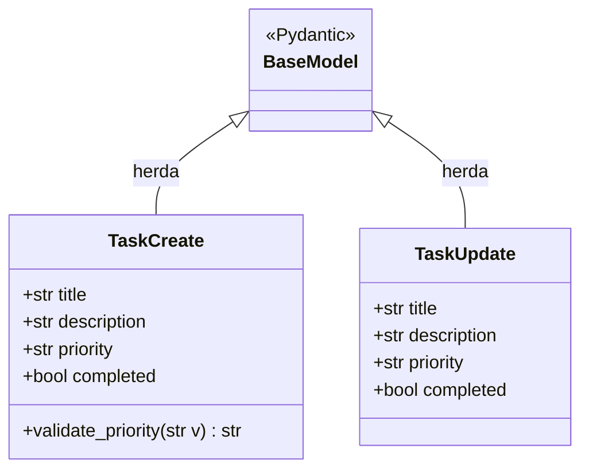

# 11.7 — Exercícios: FastAPI — Construindo sua Primeira API

[← Voltar ao conteúdo](cap11-mod07-fastapi-intro-conteudo.md)

---

## Sobre estes Exercícios

Estes exercícios são práticos — você vai escrever código, rodar o servidor e testar com curl. Cada exercício constroi sobre o anterior, aumentando a complexidade progressivamente. Certifique-se de que o FastAPI e o Uvicorn estao instalados antes de comecar:

```bash
pip3 install fastapi uvicorn
```

---

## Exercício 1: API de Notas de Alunos

Crie uma API que gerência notas de alunos. Cada aluno tem: nome, materia e nota (0 a 10).

**Requisitos:**
- `POST /grades` — criar registro de nota
  - Validação: nome obrigatório (min 2 caracteres), materia obrigatória, nota entre 0 e 10
  - Retorna 201 Created
- `GET /grades` — listar todas as notas
  - Filtro opcional por materia: `?subject=matemática`
- `GET /grades/{id}` — buscar por ID (404 se não encontrar)
- `GET /grades/average` — retornar a media geral de todas as notas
- `DELETE /grades/{id}` — remover (204 No Content)

**Dica:** Cuidado com a ordem dos endpoints. O FastAPI avalia na ordem em que são definidos. Se `/grades/{id}` vier antes de `/grades/average`, o FastAPI vai tentar converter "average" para int e dar erro. Defina `/grades/average` ANTES de `/grades/{id}`.

**Resposta esperada:**

```python
# notas_api.py
from fastapi import FastAPI, HTTPException
from pydantic import BaseModel, Field

app = FastAPI(title="API de Notas")

class GradeCreate(BaseModel):
    name: str = Field(min_length=2)       # "name" = nome do aluno
    subject: str = Field(min_length=2)    # "subject" = materia
    grade: float = Field(ge=0, le=10)     # "grade" = nota (0 a 10)

grades = []
next_id = 1

@app.post("/grades", status_code=201)
def create_grade(data: GradeCreate):
    global next_id
    new_grade = {
        "id": next_id,
        "name": data.name,
        "subject": data.subject,
        "grade": data.grade
    }
    grades.append(new_grade)
    next_id += 1
    return new_grade

@app.get("/grades/average")
def get_average():
    if not grades:
        return {"average": 0, "total_grades": 0}
    avg = sum(g["grade"] for g in grades) / len(grades)
    return {"average": round(avg, 2), "total_grades": len(grades)}

@app.get("/grades")
def list_grades(subject: str = None):
    if subject:
        return [g for g in grades if g["subject"].lower() == subject.lower()]
    return grades

@app.get("/grades/{grade_id}")
def get_grade(grade_id: int):
    for g in grades:
        if g["id"] == grade_id:
            return g
    raise HTTPException(status_code=404, detail="Nota nao encontrada")

@app.delete("/grades/{grade_id}", status_code=204)
def delete_grade(grade_id: int):
    for i, g in enumerate(grades):
        if g["id"] == grade_id:
            grades.pop(i)
            return
    raise HTTPException(status_code=404, detail="Nota nao encontrada")
```

**Testes com curl:**

```bash
# Criar notas
curl -X POST http://localhost:8000/grades \
  -H "Content-Type: application/json" \
  -d '{"name": "Maria", "subject": "matematica", "grade": 8.5}'

curl -X POST http://localhost:8000/grades \
  -H "Content-Type: application/json" \
  -d '{"name": "Joao", "subject": "portugues", "grade": 7.0}'

curl -X POST http://localhost:8000/grades \
  -H "Content-Type: application/json" \
  -d '{"name": "Ana", "subject": "matematica", "grade": 9.0}'

# Listar todas
curl http://localhost:8000/grades

# Filtrar por materia
curl "http://localhost:8000/grades?subject=matematica"

# Media geral
curl http://localhost:8000/grades/average

# Nota invalida (deve retornar 422)
curl -X POST http://localhost:8000/grades \
  -H "Content-Type: application/json" \
  -d '{"name": "X", "subject": "historia", "grade": 15}'
```

---

## Exercício 2: API de Tarefas com Prioridade

Crie uma API de tarefas (to-do list) com prioridade e data de criação.

**Requisitos:**
- Modelo: título (obrigatório, 1-200 chars), descrição (opcional), prioridade ("baixa", "media", "alta"), concluida (bool, padrão false)
- `POST /tasks` — criar tarefa (validar que prioridade e uma das 3 opcoes)
- `GET /tasks` — listar com filtros opcionais: `?priority=alta` e `?completed=false`
- `GET /tasks/{id}` — buscar por ID
- `PUT /tasks/{id}` — atualizar (campos opcionais)
- `PATCH /tasks/{id}/complete` — marcar como concluida
- `DELETE /tasks/{id}` — remover
- `GET /tasks/stats` — retornar estatisticas: total, concluidas, pendentes, por prioridade

**Resposta esperada:**

```python
# tarefas_api.py
from fastapi import FastAPI, HTTPException
from pydantic import BaseModel, Field, field_validator
from datetime import datetime

app = FastAPI(title="API de Tarefas")

class TaskCreate(BaseModel):
    title: str = Field(min_length=1, max_length=200)
    description: str = None
    priority: str = "media"  # "priority" = prioridade

    @field_validator("priority")
    @classmethod
    def validate_priority(cls, v):
        allowed = ["baixa", "media", "alta"]
        if v not in allowed:
            raise ValueError(f"Prioridade deve ser: {allowed}")
        return v

class TaskUpdate(BaseModel):
    title: str = None
    description: str = None
    priority: str = None

    @field_validator("priority")
    @classmethod
    def validate_priority(cls, v):
        if v is not None:
            allowed = ["baixa", "media", "alta"]
            if v not in allowed:
                raise ValueError(f"Prioridade deve ser: {allowed}")
        return v

tasks = []
next_id = 1

@app.post("/tasks", status_code=201)
def create_task(task: TaskCreate):
    global next_id
    new_task = {
        "id": next_id,
        "title": task.title,
        "description": task.description,
        "priority": task.priority,
        "completed": False,
        "created_at": datetime.now().isoformat()
    }
    tasks.append(new_task)
    next_id += 1
    return new_task

@app.get("/tasks/stats")
def get_stats():
    total = len(tasks)
    completed = sum(1 for t in tasks if t["completed"])
    by_priority = {}
    for p in ["baixa", "media", "alta"]:
        by_priority[p] = sum(1 for t in tasks if t["priority"] == p)
    return {
        "total": total,
        "completed": completed,
        "pending": total - completed,
        "by_priority": by_priority
    }

@app.get("/tasks")
def list_tasks(priority: str = None, completed: bool = None):
    result = tasks
    if priority:
        result = [t for t in result if t["priority"] == priority]
    if completed is not None:
        result = [t for t in result if t["completed"] == completed]
    return result

@app.get("/tasks/{task_id}")
def get_task(task_id: int):
    for t in tasks:
        if t["id"] == task_id:
            return t
    raise HTTPException(status_code=404, detail="Tarefa nao encontrada")

@app.put("/tasks/{task_id}")
def update_task(task_id: int, data: TaskUpdate):
    for t in tasks:
        if t["id"] == task_id:
            if data.title is not None:
                t["title"] = data.title
            if data.description is not None:
                t["description"] = data.description
            if data.priority is not None:
                t["priority"] = data.priority
            return t
    raise HTTPException(status_code=404, detail="Tarefa nao encontrada")

@app.patch("/tasks/{task_id}/complete")
def complete_task(task_id: int):
    for t in tasks:
        if t["id"] == task_id:
            if t["completed"]:
                raise HTTPException(status_code=409, detail="Tarefa ja concluida")
            t["completed"] = True
            return t
    raise HTTPException(status_code=404, detail="Tarefa nao encontrada")

@app.delete("/tasks/{task_id}", status_code=204)
def delete_task(task_id: int):
    for i, t in enumerate(tasks):
        if t["id"] == task_id:
            tasks.pop(i)
            return
    raise HTTPException(status_code=404, detail="Tarefa nao encontrada")
```

**Testes com curl:**

```bash
# Criar tarefas
curl -X POST http://localhost:8000/tasks \
  -H "Content-Type: application/json" \
  -d '{"title": "Estudar FastAPI", "priority": "alta"}'

curl -X POST http://localhost:8000/tasks \
  -H "Content-Type: application/json" \
  -d '{"title": "Comprar cafe", "priority": "baixa"}'

curl -X POST http://localhost:8000/tasks \
  -H "Content-Type: application/json" \
  -d '{"title": "Fazer exercicios", "description": "Modulo 11.7", "priority": "alta"}'

# Listar todas
curl http://localhost:8000/tasks

# Filtrar por prioridade
curl "http://localhost:8000/tasks?priority=alta"

# Estatisticas
curl http://localhost:8000/tasks/stats

# Marcar como concluida
curl -X PATCH http://localhost:8000/tasks/1/complete

# Tentar concluir de novo (deve dar 409)
curl -X PATCH http://localhost:8000/tasks/1/complete

# Prioridade invalida (deve dar 422)
curl -X POST http://localhost:8000/tasks \
  -H "Content-Type: application/json" \
  -d '{"title": "Teste", "priority": "urgente"}'
```

Diagrama de classes dos modelos Pydantic da API de tarefas:



---

## Exercício 3: API com Routers e Middleware

Reorganize a API de tarefas do exercício 2 usando routers e adicione um middleware de logging.

**Estrutura de pastas:**

```
todo-api/
├── main.py
├── routers/
│   ├── __init__.py
│   └── tasks.py
```

**Requisitos:**
- Mover todos os endpoints de tarefas para `routers/tasks.py`
- Adicionar middleware que loga método, path e tempo de resposta
- Adicionar endpoint `GET /` na raiz que retorna informações da API
- Verificar que `/docs` mostra os endpoints agrupados por tag "Tasks"

**Resposta esperada:**

`routers/tasks.py`:
```python
from fastapi import APIRouter, HTTPException
from pydantic import BaseModel, Field, field_validator

router = APIRouter(prefix="/tasks", tags=["Tasks"])

# (mesmos modelos e endpoints do exercicio 2, trocando @app por @router)
# ...
```

`main.py`:
```python
import time
from fastapi import FastAPI, Request
from routers import tasks

app = FastAPI(title="Todo API", version="1.0.0")

@app.middleware("http")
async def log_requests(request: Request, call_next):
    start = time.time()
    response = await call_next(request)
    duration = time.time() - start
    print(f"{request.method} {request.url.path} - {response.status_code} - {duration:.3f}s")
    return response

app.include_router(tasks.router)

@app.get("/", tags=["Root"])
def root():
    return {"name": "Todo API", "version": "1.0.0", "docs": "/docs"}
```

---

## Exercício 4: API de Inventario com Regras de Negocio

Crie uma API de inventario de uma loja. Cada produto tem: nome, preco, quantidade em estoque e categoria.

**Requisitos:**
- `POST /products` — criar produto (nome único — se ja existir, retornar 409 Conflict)
- `GET /products` — listar com filtros: `?category=X`, `?min_price=X`, `?max_price=X`, `?in_stock=true`
- `GET /products/{id}` — buscar por ID
- `POST /products/{id}/sell` — vender unidades (recebe `{"quantity": N}`)
  - Se quantidade insuficiente, retornar 409 com mensagem clara
  - Se quantidade <= 0, retornar 400
- `POST /products/{id}/restock` — repor estoque (recebe `{"quantity": N}`)
  - Se quantidade <= 0, retornar 400
- `GET /products/low-stock` — listar produtos com estoque abaixo de 5 unidades
- `DELETE /products/{id}` — remover (so se estoque == 0, senao 409)

**Dica:** Para verificar nome único, percorra a lista de produtos e compare os nomes (case-insensitive).

**Testes sugeridos:**

```bash
# Criar produtos
curl -X POST http://localhost:8000/products \
  -H "Content-Type: application/json" \
  -d '{"name": "Notebook Dell", "price": 3500.0, "stock": 10, "category": "eletronicos"}'

curl -X POST http://localhost:8000/products \
  -H "Content-Type: application/json" \
  -d '{"name": "Mouse Logitech", "price": 89.90, "stock": 3, "category": "eletronicos"}'

# Tentar criar duplicado (deve dar 409)
curl -X POST http://localhost:8000/products \
  -H "Content-Type: application/json" \
  -d '{"name": "Notebook Dell", "price": 4000.0, "stock": 5, "category": "eletronicos"}'

# Vender 2 unidades
curl -X POST http://localhost:8000/products/1/sell \
  -H "Content-Type: application/json" \
  -d '{"quantity": 2}'

# Tentar vender mais do que tem (deve dar 409)
curl -X POST http://localhost:8000/products/2/sell \
  -H "Content-Type: application/json" \
  -d '{"quantity": 10}'

# Produtos com estoque baixo
curl http://localhost:8000/products/low-stock

# Filtrar por preco
curl "http://localhost:8000/products?min_price=100&max_price=5000"

# Tentar deletar com estoque > 0 (deve dar 409)
curl -X DELETE http://localhost:8000/products/1
```

---

## Exercício 5: Desafio — API com Relacionamentos

Crie uma API de blog simples com dois recursos relacionados: autores e posts.

**Modelos:**
- Autor: nome, email (único), bio (opcional)
- Post: título, conteúdo, author_id (referência ao autor), publicado (bool, padrão false)

**Endpoints:**
- CRUD completo de autores (`/authors`)
- CRUD completo de posts (`/posts`)
- `GET /authors/{id}/posts` — listar posts de um autor específico
- `POST /posts/{id}/publish` — publicar post (mudar publicado para true)
- `GET /posts?published=true` — filtrar posts publicados

**Regras:**
- Não pode criar post com author_id que não existe (400)
- Não pode deletar autor que tem posts (409)
- Email do autor deve ser único (409)

**Dica:** Use dois routers separados (`routers/authors.py` e `routers/posts.py`) e listas compartilhadas para simular o banco de dados.

Este exercício prepara você para o projeto do próximo módulo, onde faremos algo similar mas com SQLite.

---

[← Voltar ao conteúdo](cap11-mod07-fastapi-intro-conteudo.md)
