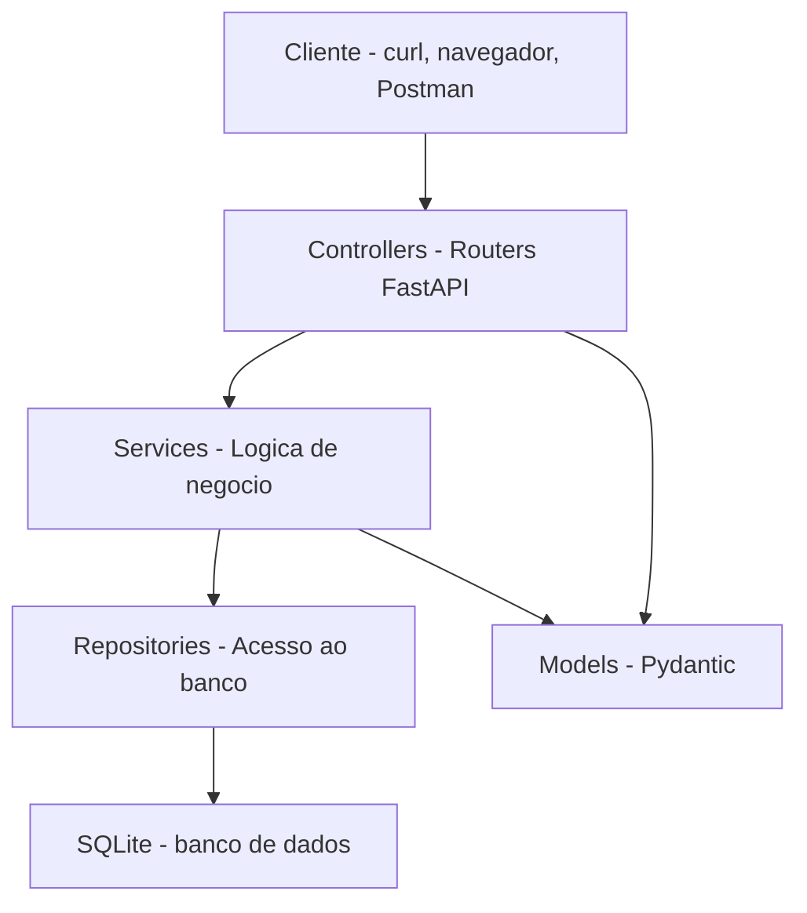
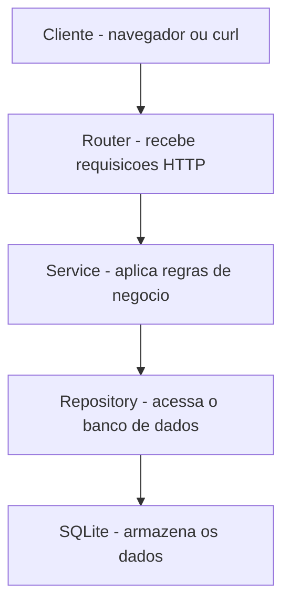
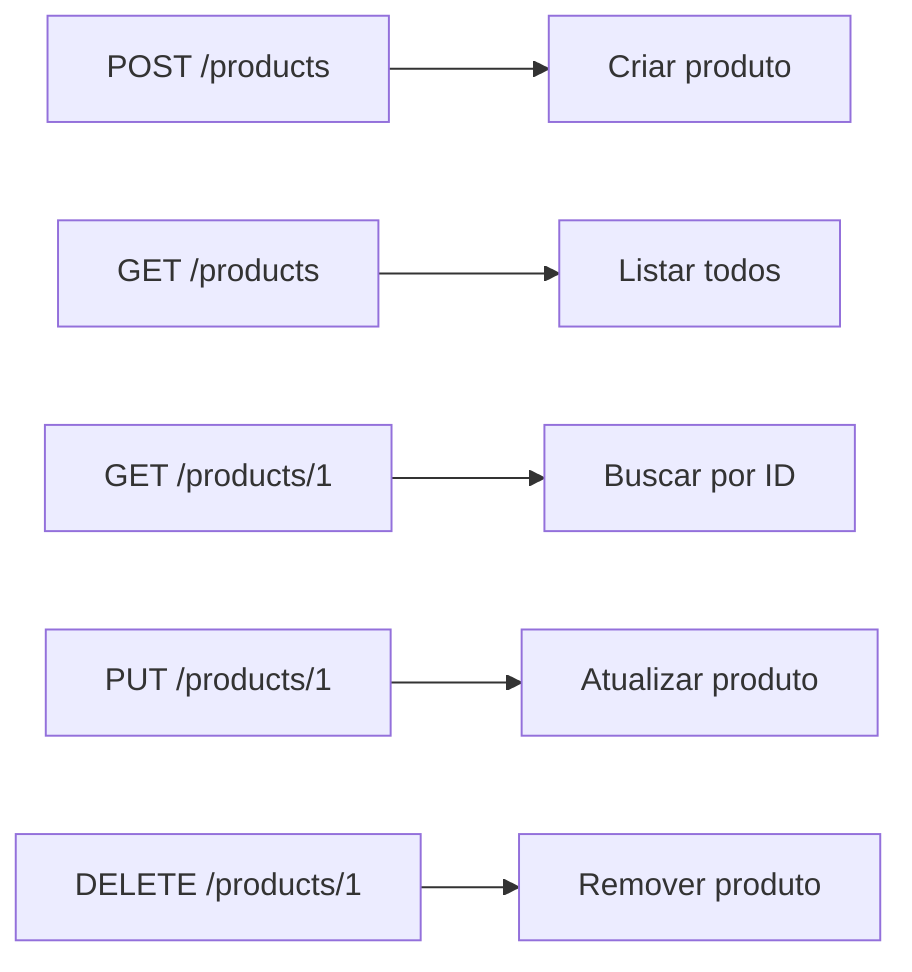
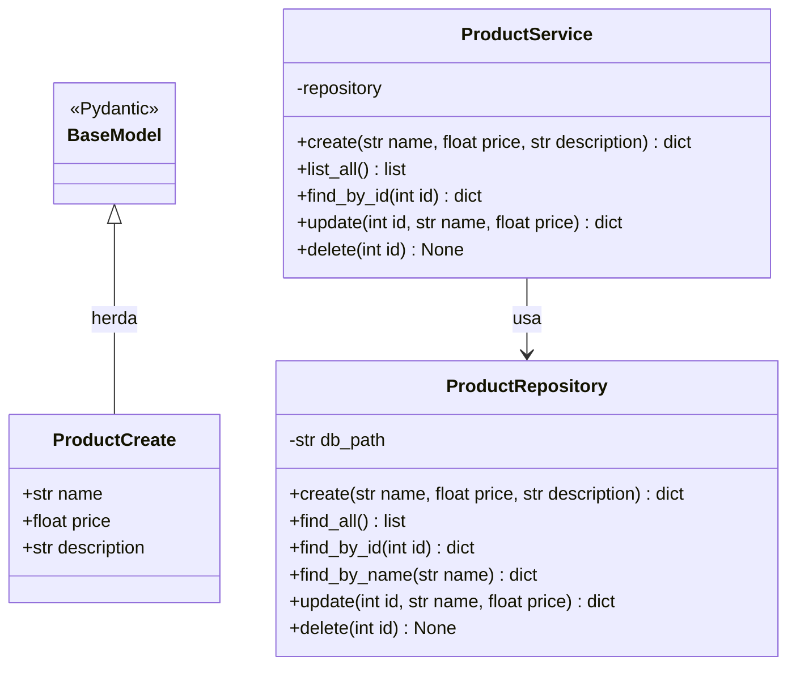
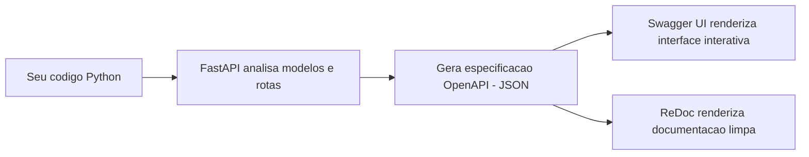

# 11.8 — Projeto: CRUD Completo com FastAPI e SQLite

[← Anterior: FastAPI — Construindo sua Primeira API](cap11-mod07-fastapi-intro-conteudo.md) · [Próximo: Capítulo 12 — Projeto Final →](cap12-mod01-definicao-problema.md)

---

## Introdução

Este e o projeto final do capítulo 11 — e também o projeto mais completo que você vai construir ate agora. Nos módulos anteriores, você aprendeu como servicos se comunicam, os detalhes de APIs REST, filas e mensageria, tecnologias alternativas, padrões arquiteturais e os fundamentos do FastAPI. Agora você vai juntar tudo isso em uma aplicação real.

O projeto e uma API REST completa de gerenciamento de produtos, construida com Python, FastAPI e SQLite. Diferente do módulo anterior (onde os dados ficavam em memória e sumiam ao reiniciar), aqui os dados serao persistidos em banco de dados — exatamente como em sistemas de produção.

Além disso, você vai aplicar a arquitetura em camadas que aprendeu no capítulo 10: separar o código em camadas de dominio, servico e repositório. O resultado sera uma aplicação profissional, organizada e extensivel.

O guia completo do projeto, com todas as fases, código e critérios de conclusão, esta no arquivo de projeto: [projeto-crud-fastapi.md](../projects/projeto-crud-fastapi.md).

---

## O que Você Vai Construir

Uma API REST com os seguintes recursos:

### Endpoints de Produtos

| Método | Endpoint | Descrição |
|--------|----------|-----------|
| POST | /products | Criar produto |
| GET | /products | Listar produtos (com filtros e paginacao) |
| GET | /products/{id} | Buscar produto por ID |
| PUT | /products/{id} | Atualizar produto |
| DELETE | /products/{id} | Remover produto |
| GET | /products/stats | Estatisticas (total, por categoria, valor medio) |

### Endpoints de Categorias

| Método | Endpoint | Descrição |
|--------|----------|-----------|
| POST | /categories | Criar categoria |
| GET | /categories | Listar categorias |
| GET | /categories/{id} | Buscar categoria com seus produtos |
| DELETE | /categories/{id} | Remover categoria (so se vazia) |

### Funcionalidades

- Persistência em SQLite (dados sobrevivem a reinicializacao)
- Validação automática com Pydantic
- Paginacao (skip/limit)
- Filtros por categoria, preco mínimo/máximo, em estoque
- Busca por nome (parcial, case-insensitive)
- Tratamento de erros consistente
- Documentação automática (Swagger)
- Arquitetura em camadas (controller/service/repository)

---

## Arquitetura do Projeto

O projeto segue a arquitetura em 3 camadas que você aprendeu no capítulo 10:



### Estrutura de Pastas

```
projeto-crud-fastapi/
├── main.py                  # Ponto de entrada da aplicacao
├── database.py              # Configuracao e inicializacao do banco
├── models/
│   ├── __init__.py
│   ├── product.py           # Modelos Pydantic de produto
│   └── category.py          # Modelos Pydantic de categoria
├── repositories/
│   ├── __init__.py
│   ├── product_repository.py    # Acesso a dados de produtos
│   └── category_repository.py   # Acesso a dados de categorias
├── services/
│   ├── __init__.py
│   ├── product_service.py       # Logica de negocio de produtos
│   └── category_service.py      # Logica de negocio de categorias
├── routers/
│   ├── __init__.py
│   ├── products.py              # Endpoints de produtos
│   └── categories.py            # Endpoints de categorias
└── products.db                  # Banco SQLite (criado automaticamente)
```

### Responsabilidade de Cada Camada

| Camada | Responsabilidade | Exemplo |
|--------|-----------------|---------|
| Router (Controller) | Receber requisicoes, validar entrada, retornar resposta | Recebe POST /products, válida JSON, retorna 201 |
| Service | Lógica de negocio, regras, validacoes de dominio | Verifica se categoria existe antes de criar produto |
| Repository | Acesso ao banco de dados, queries SQL | INSERT INTO products, SELECT com filtros |
| Model | Definição de dados, validação de formato | ProductCreate, ProductResponse |

---

## Tecnologias Utilizadas

| Tecnologia | Versão | Proposito |
|------------|--------|-----------|
| Python | 3.10+ | Linguagem de programação |
| FastAPI | 0.100+ | Framework para API REST |
| Uvicorn | 0.20+ | Servidor ASGI |
| Pydantic | 2.0+ | Validação de dados |
| SQLite | 3 | Banco de dados (embutido no Python) |
| sqlite3 | stdlib | Módulo Python para SQLite (ja vem instalado) |

---

## Fases do Projeto

O projeto e desenvolvido em 4 fases incrementais. Cada fase adiciona funcionalidade sobre a anterior:

### Fase 1: Banco de Dados e Modelos
- Criar o banco SQLite com tabelas de produtos e categorias
- Definir modelos Pydantic para entrada e saida
- Testar a criação do banco

### Fase 2: Repositórios e CRUD Básico
- Implementar repositórios com operações SQL
- Criar endpoints básicos (POST, GET, PUT, DELETE)
- Testar com curl

### Fase 3: Servicos e Regras de Negocio
- Adicionar camada de servico entre routers e repositórios
- Implementar regras: nome único, categoria válida, estoque não-negativo
- Tratamento de erros consistente

### Fase 4: Funcionalidades Avancadas
- Paginacao e filtros
- Busca por nome
- Estatisticas
- Middleware de logging
- Documentação customizada

---


---

## Decisões de Arquitetura: Por que Cada Escolha?

Antes de começar a programar, é importante entender por que o projeto está organizado dessa forma. Cada decisão de arquitetura resolve um problema específico.

### Por que Separar em Camadas?

No capítulo 10, você aprendeu sobre arquitetura em 3 camadas. Neste projeto, aplicamos esse conceito na prática:



| Camada | Arquivo | Responsabilidade | Exemplo |
|--------|---------|-----------------|---------|
| Router | `routers/products.py` | Receber HTTP, validar formato, retornar resposta | Recebe POST /products com JSON |
| Service | `services/product_service.py` | Aplicar regras de negócio | Verificar se preço é positivo |
| Repository | `repositories/product_repository.py` | Acessar banco de dados | INSERT INTO products |
| Model | `models/product.py` | Definir estrutura dos dados | Classe Product com id, name, price |

A vantagem dessa separação: se amanhã você quiser trocar SQLite por PostgreSQL, muda apenas o repository. Se quiser adicionar uma regra de negócio (ex: "não pode ter dois produtos com o mesmo nome"), muda apenas o service. O router não precisa saber nada sobre banco de dados, e o repository não precisa saber nada sobre HTTP.

### Por que SQLite?

SQLite é a escolha ideal para este projeto por vários motivos:

| Vantagem | Explicação |
|----------|-----------|
| Sem instalação | O SQLite já vem com o Python — não precisa instalar nada |
| Arquivo único | O banco inteiro é um arquivo `.db` na pasta do projeto |
| SQL padrão | Os comandos SQL que você aprendeu no cap 8 funcionam aqui |
| Leve | Perfeito para desenvolvimento e projetos pequenos |
| Portátil | Copie o arquivo `.db` e o banco vai junto |

Em produção, empresas usam PostgreSQL, MySQL ou outros bancos mais robustos. Mas para aprender e para projetos pessoais, SQLite é perfeito.

### Por que Pydantic para Validação?

O FastAPI usa **Pydantic** para validar dados automaticamente. Em vez de você escrever código para verificar se o preço é um número, se o nome não está vazio, etc., o Pydantic faz isso por você:

```python
# Sem Pydantic — validacao manual (trabalhoso e propenso a erros)
# "data" = dados recebidos
def create_product(data):
    if "name" not in data:
        return {"error": "nome obrigatorio"}
    if not isinstance(data["name"], str):
        return {"error": "nome deve ser texto"}
    if "price" not in data:
        return {"error": "preco obrigatorio"}
    if not isinstance(data["price"], (int, float)):
        return {"error": "preco deve ser numero"}
    if data["price"] <= 0:
        return {"error": "preco deve ser positivo"}
    # ... e assim por diante
```

Saída esperada: nenhuma (exemplo conceitual)

```python
# Com Pydantic — validacao automatica (limpo e seguro)
from pydantic import BaseModel, Field

# "ProductCreate" = dados para criar produto
class ProductCreate(BaseModel):
    # "name" = nome (obrigatorio, minimo 1 caractere)
    name: str = Field(min_length=1)
    # "price" = preco (obrigatorio, maior que zero)
    price: float = Field(gt=0)
    # "description" = descricao (opcional)
    description: str = ""
```

Saída esperada: nenhuma (é apenas a definição da classe)

Se alguém enviar um JSON com preço negativo, o FastAPI automaticamente retorna um erro 422 (Unprocessable Entity) com uma mensagem clara explicando o problema. Você não precisa escrever nenhum código de validação.

### Por que Uvicorn?

**Uvicorn** é o servidor que roda sua aplicação FastAPI. Pense nele como o "garçom" que recebe os pedidos (requisições HTTP) e os entrega para a "cozinha" (sua aplicação). Quando você roda `uvicorn main:app --reload`, está dizendo:

- `main` — o arquivo `main.py`
- `app` — a variável `app` dentro desse arquivo (que é a instância do FastAPI)
- `--reload` — reiniciar automaticamente quando você mudar o código (útil durante desenvolvimento)

---

## Detalhamento das Fases

### Fase 1: Estrutura e Banco de Dados

Nesta fase, você cria a fundação do projeto:

1. Criar a estrutura de pastas
2. Configurar o banco de dados SQLite
3. Criar a tabela de produtos
4. Testar a conexão

```python
# database.py — configuracao do banco de dados
import sqlite3

# "DB_PATH" = caminho do banco de dados
DB_PATH = "products.db"

# "get_connection" = obter conexao com o banco
def get_connection():
    # "conn" = conexao
    conn = sqlite3.connect(DB_PATH)
    # Row factory permite acessar colunas por nome
    conn.row_factory = sqlite3.Row
    return conn

# "init_db" = inicializar banco de dados
def init_db():
    # "conn" = conexao
    conn = get_connection()
    conn.execute("""
        CREATE TABLE IF NOT EXISTS products (
            id INTEGER PRIMARY KEY AUTOINCREMENT,
            name TEXT NOT NULL,
            price REAL NOT NULL,
            description TEXT DEFAULT '',
            created_at TIMESTAMP DEFAULT CURRENT_TIMESTAMP
        )
    """)
    conn.commit()
    conn.close()
```

Saída esperada: nenhuma (é apenas a definição do módulo)

O `CREATE TABLE IF NOT EXISTS` é importante: ele cria a tabela apenas se ela não existir. Assim, você pode rodar o programa várias vezes sem erro.

### Fase 2: CRUD Básico (Repository + Router)

Nesta fase, você implementa as 4 operações básicas:

| Operação | Verbo HTTP | Endpoint | SQL |
|----------|-----------|----------|-----|
| Criar | POST | /products | INSERT INTO products |
| Listar | GET | /products | SELECT * FROM products |
| Buscar por ID | GET | /products/{id} | SELECT * FROM products WHERE id = ? |
| Atualizar | PUT | /products/{id} | UPDATE products SET ... WHERE id = ? |
| Remover | DELETE | /products/{id} | DELETE FROM products WHERE id = ? |



Cada operação segue o mesmo fluxo: Router recebe a requisição → Service aplica regras → Repository executa SQL → Resposta volta ao cliente.

### Fase 3: Regras de Negócio (Service)

Nesta fase, você adiciona validações e regras que vão além da estrutura dos dados:

- Não permitir produtos com preço zero ou negativo
- Não permitir nomes duplicados
- Retornar erro 404 quando o produto não existe
- Validar que o ID é um número positivo

```python
# services/product_service.py — regras de negocio
# "ProductService" = servico de produtos
class ProductService:
    def __init__(self, repository):
        # "repository" = repositorio de dados
        self.repository = repository

    # "create" = criar produto
    def create(self, name, price, description=""):
        # Regra: nome nao pode ser vazio
        if not name or not name.strip():
            raise ValueError("Nome do produto e obrigatorio")
        # Regra: preco deve ser positivo
        if price <= 0:
            raise ValueError("Preco deve ser maior que zero")
        # Regra: nome nao pode ser duplicado
        # "existing" = produto existente com mesmo nome
        existing = self.repository.find_by_name(name)
        if existing:
            raise ValueError(f"Ja existe um produto com o nome '{name}'")
        return self.repository.create(name.strip(), price, description.strip())
```

Saída esperada: nenhuma (é apenas a definição da classe)

O diagrama a seguir mostra a arquitetura de classes do projeto CRUD com FastAPI — o modelo Pydantic para entrada, o servico com regras de negocio e o repositorio para acesso a dados:



### Fase 4: Funcionalidades Extras

Nesta fase, você adiciona funcionalidades que tornam a API mais completa:

- Paginação (listar 10 produtos por vez em vez de todos)
- Busca por nome (filtrar produtos que contêm um texto)
- Ordenação (listar por preço, por nome, por data)
- Contagem total de produtos

A paginação é especialmente importante. Sem ela, se o banco tiver 10.000 produtos, a API retorna todos de uma vez — lento e pesado. Com paginação, retorna apenas 10 por vez:

```
GET /products?page=1&size=10    → produtos 1 a 10
GET /products?page=2&size=10    → produtos 11 a 20
GET /products?page=3&size=10    → produtos 21 a 30
```

---

## Troubleshooting: Problemas Comuns

### "ModuleNotFoundError: No module named 'fastapi'"

Você não instalou o FastAPI. Execute:
```bash
pip install fastapi uvicorn
```

### "Address already in use"

Outro processo já está usando a porta 8000. Soluções:
- Fechar o outro processo
- Usar outra porta: `uvicorn main:app --port 8001`

### "sqlite3.OperationalError: no such table: products"

O banco não foi inicializado. Certifique-se de chamar `init_db()` no início do `main.py`.

### "422 Unprocessable Entity"

O JSON que você enviou não passou na validação do Pydantic. Verifique:
- O campo `name` é uma string?
- O campo `price` é um número positivo?
- Todos os campos obrigatórios estão presentes?

### "404 Not Found"

O produto com o ID informado não existe no banco. Verifique o ID com `GET /products` primeiro.

### O banco está vazio depois de reiniciar

Se você está usando banco em memória (`:memory:`), os dados se perdem ao reiniciar. Use um arquivo: `products.db`.

### Alterações no código não aparecem

Certifique-se de que está rodando com `--reload`:
```bash
uvicorn main:app --reload
```

Sem `--reload`, você precisa parar e reiniciar o servidor manualmente a cada mudança.
## Conectando com o que Você Aprendeu

Este projeto consolida conceitos de multiplos capítulos:

| Capítulo | Conceito Aplicado |
|----------|-------------------|
| Cap 5 — Python | Linguagem, funções, dicionários, listas |
| Cap 8 — Bancos de Dados | SQLite, SQL, modelagem de dados |
| Cap 9 — OOP | Classes (Pydantic models), organização de código |
| Cap 10 — Arquitetura | Camadas, separacao de responsabilidades |
| Cap 11.1-11.3 — APIs REST | Verbos HTTP, status codes, JSON |
| Cap 11.6 — Padrões | Tratamento de erros, validação |
| Cap 11.7 — FastAPI | Framework, routers, middleware |

---

## Como Executar o Projeto

### Instalacao

```bash
# Criar pasta do projeto
mkdir projeto-crud-fastapi

# Instalar dependencias
pip3 install fastapi uvicorn
```

### Executando

```bash
# Entrar na pasta do projeto
# Rodar o servidor
uvicorn main:app --reload
```

### Testando

```bash
# Documentacao interativa
# Abra no navegador: http://localhost:8000/docs

# Criar categoria
curl -X POST http://localhost:8000/categories \
  -H "Content-Type: application/json" \
  -d '{"name": "Eletronicos", "description": "Produtos eletronicos"}'

# Criar produto
curl -X POST http://localhost:8000/products \
  -H "Content-Type: application/json" \
  -d '{"name": "Notebook Dell", "price": 3500.0, "stock": 10, "category_id": 1}'

# Listar produtos
curl http://localhost:8000/products

# Filtrar por categoria
curl "http://localhost:8000/products?category_id=1"

# Buscar por nome
curl "http://localhost:8000/products?search=notebook"

# Paginacao
curl "http://localhost:8000/products?skip=0&limit=5"

# Estatisticas
curl http://localhost:8000/products/stats
```

---


---

## Testando a API com curl

Depois de implementar cada fase, teste a API usando `curl` no terminal. Aqui estão os comandos para cada operação:

### Criar um produto

```bash
# Criar um produto — POST /products
curl -X POST http://localhost:8000/products \
  -H "Content-Type: application/json" \
  -d '{"name": "Notebook", "price": 3500.00, "description": "Notebook 16GB RAM"}'
```

Saída esperada:

```json
{"id": 1, "name": "Notebook", "price": 3500.0, "description": "Notebook 16GB RAM", "created_at": "2024-01-15T10:30:00"}
```

### Listar todos os produtos

```bash
# Listar produtos — GET /products
curl http://localhost:8000/products
```

Saída esperada:

```json
[{"id": 1, "name": "Notebook", "price": 3500.0, "description": "Notebook 16GB RAM", "created_at": "2024-01-15T10:30:00"}]
```

### Buscar por ID

```bash
# Buscar produto por ID — GET /products/1
curl http://localhost:8000/products/1
```

Saída esperada:

```json
{"id": 1, "name": "Notebook", "price": 3500.0, "description": "Notebook 16GB RAM", "created_at": "2024-01-15T10:30:00"}
```

### Atualizar um produto

```bash
# Atualizar produto — PUT /products/1
curl -X PUT http://localhost:8000/products/1 \
  -H "Content-Type: application/json" \
  -d '{"name": "Notebook Pro", "price": 4200.00, "description": "Notebook 32GB RAM"}'
```

Saída esperada:

```json
{"id": 1, "name": "Notebook Pro", "price": 4200.0, "description": "Notebook 32GB RAM", "created_at": "2024-01-15T10:30:00"}
```

### Remover um produto

```bash
# Remover produto — DELETE /products/1
curl -X DELETE http://localhost:8000/products/1
```

Saída esperada:

```json
{"message": "Produto removido com sucesso"}
```

### Testar erro de validação

```bash
# Enviar preco negativo — deve retornar erro 422
curl -X POST http://localhost:8000/products \
  -H "Content-Type: application/json" \
  -d '{"name": "Teste", "price": -10}'
```

Saída esperada:

```json
{"detail": [{"loc": ["body", "price"], "msg": "ensure this value is greater than 0", "type": "value_error"}]}
```

### Usando a Documentação Automática

Uma das maiores vantagens do FastAPI é a documentação automática. Depois de iniciar o servidor, abra no navegador:

- `http://localhost:8000/docs` — interface Swagger UI (interativa, permite testar endpoints)
- `http://localhost:8000/redoc` — interface ReDoc (mais limpa, melhor para leitura)

A documentação é gerada automaticamente a partir dos seus modelos Pydantic e das definições dos endpoints. Você não precisa escrever documentação separada — ela nasce do código.



Isso é um padrão da indústria chamado **OpenAPI** (anteriormente Swagger). Empresas como Stripe, Twilio e GitHub usam OpenAPI para documentar suas APIs. Ao usar FastAPI, você já está seguindo esse padrão profissional.

---

## Checklist de Cada Fase

Use este checklist para verificar se completou cada fase antes de avançar:

### Fase 1 — Estrutura e Banco

- [ ] Estrutura de pastas criada
- [ ] `database.py` com `get_connection()` e `init_db()`
- [ ] Tabela `products` criada no SQLite
- [ ] `main.py` chama `init_db()` ao iniciar
- [ ] Servidor inicia sem erros com `uvicorn main:app --reload`

### Fase 2 — CRUD Básico

- [ ] POST /products cria um produto e retorna com ID
- [ ] GET /products lista todos os produtos
- [ ] GET /products/{id} retorna um produto específico
- [ ] PUT /products/{id} atualiza um produto
- [ ] DELETE /products/{id} remove um produto
- [ ] Todos os endpoints testados com curl

### Fase 3 — Regras de Negócio

- [ ] Preço negativo ou zero retorna erro
- [ ] Nome vazio retorna erro
- [ ] Nome duplicado retorna erro
- [ ] ID inexistente retorna 404
- [ ] Mensagens de erro são claras e úteis

### Fase 4 — Funcionalidades Extras

- [ ] Paginação funciona (page e size como query params)
- [ ] Busca por nome funciona (search como query param)
- [ ] Contagem total de produtos disponível
- [ ] Documentação Swagger acessível em /docs


### Dica Final: Commite a Cada Fase

Use Git para versionar seu projeto. Faça um commit ao final de cada fase:

```bash
# Apos completar a Fase 1
git add .
git commit -m "feat: setup database and project structure"

# Apos completar a Fase 2
git add .
git commit -m "feat: implement basic CRUD endpoints"

# Apos completar a Fase 3
git add .
git commit -m "feat: add business rules and validation"

# Apos completar a Fase 4
git add .
git commit -m "feat: add pagination, search and sorting"
```

Assim, se algo der errado em uma fase, você pode voltar para o estado anterior com `git checkout`. Você aprendeu isso no capítulo 4 — agora é hora de usar na prática.
## Critérios de Conclusão

Seu projeto esta pronto quando:

- [ ] O servidor inicia sem erros
- [ ] Categorias podem ser criadas, listadas e removidas
- [ ] Produtos podem ser criados, listados, atualizados e removidos
- [ ] Dados persistem apos reiniciar o servidor (SQLite)
- [ ] Validação rejeita dados invalidos (preco negativo, nome vazio)
- [ ] Produto com categoria inexistente retorna erro 400
- [ ] Produto com nome duplicado retorna erro 409
- [ ] Categoria com produtos não pode ser removida (erro 409)
- [ ] Paginacao funciona (skip/limit)
- [ ] Filtros funcionam (categoria, preco, estoque)
- [ ] Busca por nome funciona (parcial, case-insensitive)
- [ ] Estatisticas retornam dados corretos
- [ ] Documentação em /docs mostra todos os endpoints
- [ ] Código organizado em camadas (routers, services, repositories, models)

---

## Guia Completo do Projeto

O guia detalhado com todo o código, explicacoes passo a passo e testes esta em:

**[projeto-crud-fastapi.md](../projects/projeto-crud-fastapi.md)**

Siga o guia fase por fase. Não pule etapas — cada fase constroi sobre a anterior.

Com este projeto, você encerra o capítulo 11 e toda a parte técnica prática do curso. No próximo capítulo, vamos mudar de perspectiva: em vez de construir software, vamos falar sobre as boas práticas, a cultura profissional e a mentalidade que fazem a diferença na carreira de um desenvolvedor.

---

## Como a IA pode te ajudar aqui

**Prompt 1 — Entender erros comuns:**
> "Estou recebendo erro 'no such table: products' no SQLite. O que pode estar errado?"

**Prompt 2 — Aprofundar o tema:**
> "Como faco para adicionar autenticação JWT nesta API FastAPI? Quero proteger os endpoints de criação e delecao"

**Prompt 3 — Aprender sobre testes:**
> "Me ajude a escrever testes automatizados com pytest para os endpoints de produtos"

---

## Casos de Uso no Mundo Real

### Caso 1: Backend de E-commerce

O projeto que você esta construindo e uma versão simplificada do backend de qualquer e-commerce. Empresas como Magazine Luiza, Americanas e Mercado Livre tem APIs internas que fazem exatamente isso: gerenciar produtos com categorias, precos, estoque e busca. A diferença e escala (milhoes de produtos) e complexidade (imagens, avaliacoes, recomendacoes), mas a estrutura base e a mesma.

### Caso 2: APIs de Catalogo

Servicos como Rappi, iFood e Uber Eats tem APIs de catalogo que listam restaurantes e pratos. A estrutura e identica: categorias (culinaria japonesa, pizza, hamburguer), itens (pratos), filtros (preco, distancia, avaliacao) e busca. Você esta construindo a mesma lógica.

### Caso 3: Sistemas Internos de Empresas

Muitas empresas tem sistemas internos para gerenciar inventario, funcionarios, projetos ou clientes. Esses sistemas frequentemente comecam como uma API simples com CRUD — exatamente o que você esta construindo. Com o tempo, ganham autenticação, permissões, relatórios e integracoes, mas a base e sempre um CRUD bem estruturado.

---

## Resumo do Módulo

| Conceito | Definição |
|----------|-----------|
| Projeto CRUD | Aplicação completa com Create, Read, Update, Delete |
| Persistência | Dados salvos em banco de dados (sobrevivem a reinicializacao) |
| Arquitetura em camadas | Separacao de responsabilidades: router, service, repository |
| Paginacao | Dividir resultados em páginas (skip/limit) |
| Filtros | Parametros de query para refinar resultados |
| Busca | Encontrar registros por texto parcial |
| Validação de dominio | Regras de negocio (nome único, categoria válida) |

---

## Glossário do Módulo

| Termo | Definição |
|-------|-----------|
| CRUD | Create, Read, Update, Delete — operações básicas de dados |
| Endpoint | URL específica que aceita requisicoes em uma API |
| FastAPI | Framework Python para APIs REST |
| Middleware | Código que intercepta requisicoes antes/depois do endpoint |
| Paginacao | Técnica de dividir resultados em páginas menores |
| Persistência | Capacidade de manter dados apos reinicializacao |
| Pydantic | Biblioteca Python de validação de dados |
| Repository | Camada responsável pelo acesso ao banco de dados |
| Router | Módulo que agrupa endpoints relacionados |
| Service | Camada responsável pela lógica de negocio |
| SQLite | Banco de dados relacional embutido, sem servidor |
| Swagger | Documentação interativa de APIs gerada automaticamente |
| Uvicorn | Servidor ASGI para rodar FastAPI |

---

## Na Cultura Popular

- **The Internship** (filme, 2013) — dois vendedores conseguem estagio no Google e precisam construir um app funcional em equipe. O desafio de criar algo que funcione de ponta a ponta — do banco de dados a interface — e exatamente o que você esta fazendo neste projeto. A diferença e que você tem FastAPI e eles tinham que convencer Sergey Brin.

---

## Para Saber Mais

- [FastAPI Documentation — SQL Databases](https://fastapi.tiangolo.com/tutorial/sql-databases/) — *Tutorial oficial de como usar bancos de dados com FastAPI*
- [SQLite Documentation](https://www.sqlite.org/docs.html) — *Referência oficial do SQLite*
- [HTTP Status Codes](https://httpstatuses.com/) — *Referência completa de status codes HTTP*
- [Public APIs](https://github.com/public-apis/public-apis) — *Lista de APIs publicas para inspiracao e prática*
- [Postman Learning Center](https://learning.postman.com/) — *Tutoriais para testar APIs com Postman*

---

## Perguntas Frequentes (FAQ)

**P: Posso usar outro banco de dados em vez de SQLite?**
R: Sim. A arquitetura em camadas facilita isso — você so precisa trocar o repositório. O servico e os routers não mudam. Mas SQLite e ideal para aprendizado porque não precisa instalar nada (ja vem com Python) e os dados ficam em um único arquivo.

**P: Por que não usar um ORM como SQLAlchemy?**
R: Para este projeto, usamos SQL direto (módulo sqlite3) porque você ja aprendeu SQL no capítulo 8. Usar SQL direto ajuda a entender o que esta acontecendo. ORMs como SQLAlchemy são otimos para projetos maiores, mas adicionam uma camada de abstração que pode confundir iniciantes.

**P: Os dados ficam onde?**
R: Em um arquivo chamado `products.db` na pasta do projeto. E um arquivo SQLite que contem todas as tabelas e dados. Você pode abrir esse arquivo com ferramentas como DB Browser for SQLite para ver os dados visualmente.

**P: Como faco para resetar o banco de dados?**
R: Delete o arquivo `products.db` e reinicie o servidor. O código cria o banco automaticamente se ele não existir.

**P: Posso adicionar mais funcionalidades?**
R: Claro. Sugestoes: autenticação com JWT, upload de imagens de produtos, histórico de precos, sistema de avaliacoes, exportacao para CSV. Cada funcionalidade e uma oportunidade de praticar.

**P: Este projeto serve como portfolio?**
R: Sim. Uma API REST bem estruturada com banco de dados, validação e documentação e um excelente item de portfolio para desenvolvedores juniores. Coloque no GitHub com um README explicando o que faz e como rodar.

**P: Quanto tempo leva para fazer o projeto?**
R: Depende do seu ritmo. Se você seguiu todos os módulos anteriores, as fases 1 e 2 levam cerca de 2-3 horas. As fases 3 e 4 levam mais 2-3 horas. No total, entre 4 e 8 horas de trabalho focado.

**P: Preciso fazer todas as 4 fases?**
R: As fases 1 e 2 são essenciais — sem elas você não tem uma API funcional. A fase 3 e muito importante para aprender boas práticas. A fase 4 e um diferencial que mostra maturidade. Recomendamos fazer todas, mas se o tempo for curto, priorize 1-3.

---

## Exercícios Práticos

Os exercícios deste módulo são o proprio projeto. Siga o guia em [projeto-crud-fastapi.md](../projects/projeto-crud-fastapi.md) e complete todas as fases.

Apos completar o projeto base, tente estas extensões:

### Extensão 1: Endpoint de Busca Avancada
Adicione um endpoint `POST /products/search` que aceita um body JSON com critérios de busca combinados:
```json
{
  "name_contains": "note",
  "min_price": 1000,
  "max_price": 5000,
  "categories": [1, 2],
  "in_stock": true
}
```

### Extensão 2: Histórico de Precos
Crie uma tabela `price_history` que registra toda alteração de preco. Adicione um endpoint `GET /products/{id}/price-history` que retorna o histórico.

### Extensão 3: Importacao em Lote
Crie um endpoint `POST /products/bulk` que recebe uma lista de produtos e cria todos de uma vez. Se algum falhar, nenhum deve ser criado (transação).

---

[← Anterior: FastAPI — Construindo sua Primeira API](cap11-mod07-fastapi-intro-conteudo.md) · [Próximo: Capítulo 12 — Projeto Final →](cap12-mod01-definicao-problema.md)
