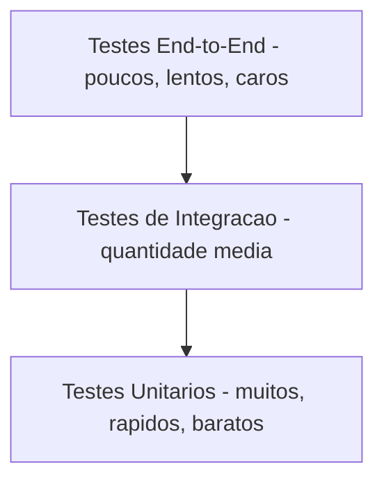
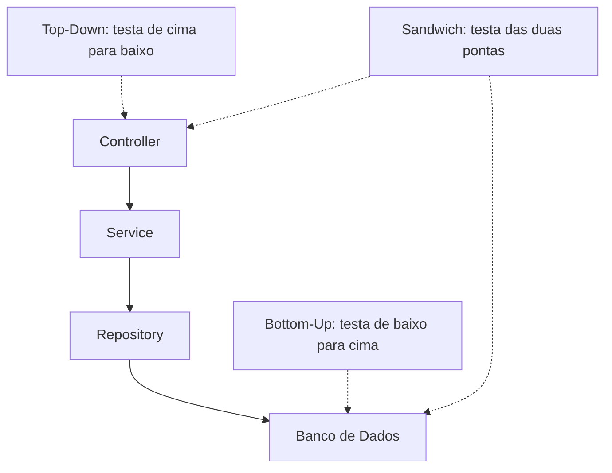
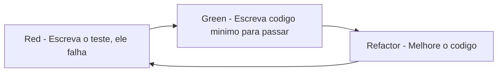
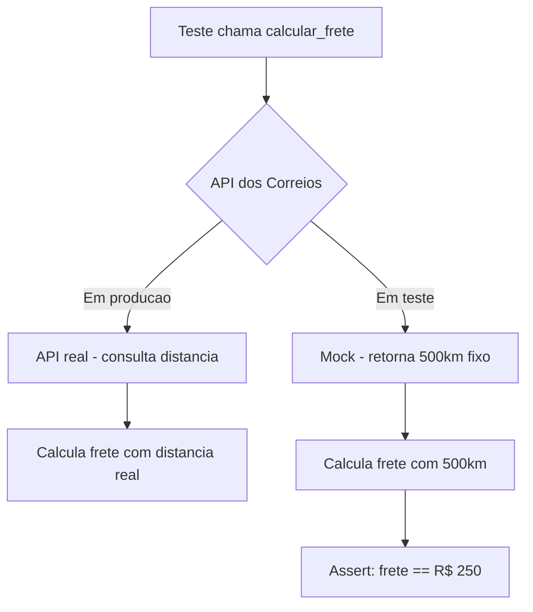
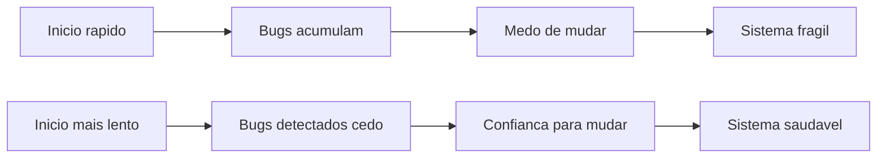
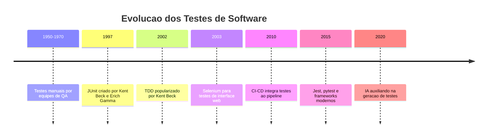
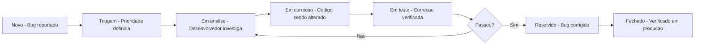
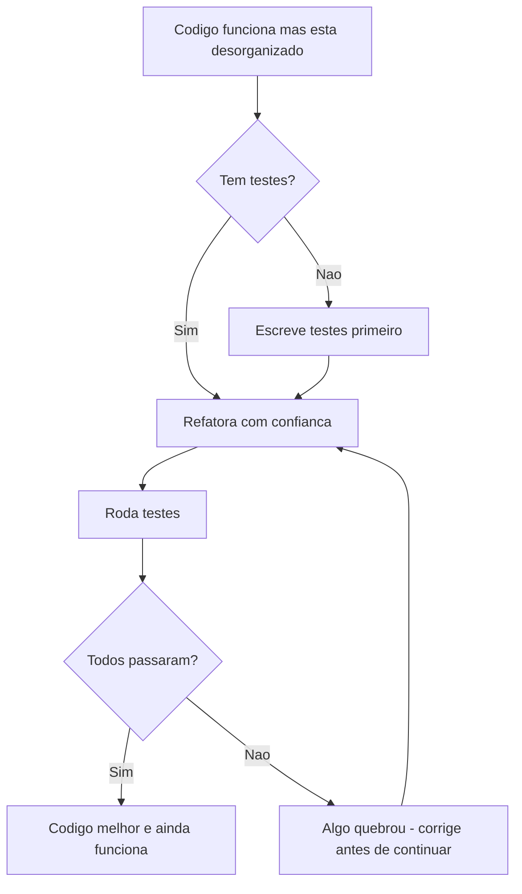

# 12.1 — Testes de Software: A Rede de Segurança do Desenvolvedor

[← Anterior: Projeto CRUD com FastAPI](cap11-mod08-projeto-crud-fastapi-conteudo.md) · [Próximo: Esteiras de CI e CD →](cap12-mod02-ci-cd.md)

---

## Introdução

No capítulo anterior, você construiu uma API REST completa com FastAPI, aplicando tudo que aprendeu ao longo do curso — arquitetura em camadas, banco de dados, integração entre serviços. Você escreveu código que funciona, que resolve um problema real.

Mas como você sabe que funciona? Você testou manualmente — abriu o navegador, fez algumas requisições, viu que as respostas pareciam corretas. E se amanhã você mudar uma função e, sem perceber, quebrar outra parte do sistema? E se um colega alterar o código e introduzir um bug que só aparece em uma situação específica? E se o sistema crescer para 50 arquivos e você não conseguir mais testar tudo manualmente?

É aqui que entram os testes de software — um dos conceitos mais importantes da carreira de qualquer desenvolvedor. Testes não são uma burocracia, não são algo que "dá para fazer depois", não são luxo de empresa grande. Testes são a rede de segurança que permite que você mude o código com confiança, que permite que equipes trabalhem juntas sem medo, e que permite que sistemas cresçam sem se tornarem frágeis.

Neste módulo, vamos entender o que são testes, por que existem, quais tipos existem e por que testes unitários são tão fundamentais. Não vamos escrever código de teste aqui — o objetivo é que você entenda o conceito profundamente, para que quando encontrar testes na prática, saiba exatamente o que está acontecendo e por quê.

---

## O Problema: Por que Testar Software?

Imagine que você é um engenheiro civil e acabou de projetar uma ponte. Você confia no seu projeto, fez os cálculos, escolheu os materiais. Mas antes de abrir a ponte para o público, você simplesmente... abre? Sem testar se ela aguenta o peso? Sem verificar se os materiais estão dentro da especificação? Sem simular condições extremas como vento forte ou carga máxima?

Claro que não. Engenheiros civis testam exaustivamente antes de entregar. Testam cada componente individualmente (o aço aguenta a tensão?), testam componentes juntos (a viga conectada ao pilar suporta a carga?) e testam o sistema completo (a ponte inteira funciona sob condições reais?).

Software deveria ser igual. Mas durante décadas, a indústria de software tratou testes como algo opcional, algo que "se der tempo a gente faz". O resultado? Sistemas que quebram em produção, bugs que custam milhões, empresas que têm medo de atualizar seus próprios sistemas porque "vai que quebra alguma coisa".

### O Custo de Não Testar

A história da tecnologia está repleta de exemplos onde a falta de testes causou prejuízos enormes:

Em 1996, o foguete Ariane 5 da Agência Espacial Europeia explodiu 37 segundos após o lançamento. O motivo? Um erro de conversão de número — um valor de 64 bits foi convertido para 16 bits e causou um overflow. O software havia sido reutilizado do Ariane 4 sem ser testado adequadamente para as novas condições do Ariane 5. Prejuízo: 370 milhões de dólares, literalmente em chamas.

Em 2012, a Knight Capital, uma das maiores empresas de trading dos Estados Unidos, perdeu 440 milhões de dólares em 45 minutos por causa de um bug em uma atualização de software que não foi testada corretamente. A empresa quase faliu.

Em 1999, a sonda Mars Climate Orbiter da NASA se desintegrou ao entrar na atmosfera de Marte. O motivo? Uma parte do software usava unidades imperiais (libras-força) e outra usava unidades métricas (newtons). Ninguém testou a integração entre os dois módulos. Prejuízo: 125 milhões de dólares.

Esses não são casos isolados. São exemplos extremos de um problema cotidiano: software sem testes é software frágil. E software frágil custa caro — em dinheiro, em tempo, em reputação e em confiança.

### O Custo de Corrigir Bugs

Existe um conceito bem estabelecido na engenharia de software: quanto mais tarde você descobre um bug, mais caro ele é para corrigir. Isso é intuitivo quando você pensa a respeito:

| Quando o bug e descoberto | Custo relativo | Por que |
|---------------------------|----------------|---------|
| Durante a escrita do código | 1x | Você esta olhando para o código, sabe o contexto, corrige na hora |
| Durante testes automatizados | 2-5x | Precisa investigar qual mudanca causou, mas o escopo e limitado |
| Durante testes manuais | 10-20x | Alguem precisa reportar, reproduzir, investigar, corrigir |
| Em produção, antes do usuario perceber | 50-100x | Precisa diagnosticar em ambiente real, fazer deploy de emergência |
| Em produção, depois que o usuario percebeu | 100-1000x | Além de tudo acima, tem impacto em reputacao e confianca |

Testes automatizados existem para puxar a descoberta de bugs para o mais cedo possível — idealmente, para o momento em que o desenvolvedor ainda está escrevendo o código.

---

## O que São Testes de Software?

Testar software é verificar se ele faz o que deveria fazer. Parece simples, mas essa definição esconde muita complexidade. "O que deveria fazer" pode significar muitas coisas:

- A função de soma retorna o resultado correto? (comportamento funcional)
- O sistema responde em menos de 200 milissegundos? (performance)
- O sistema continua funcionando quando 10.000 usuários acessam ao mesmo tempo? (carga)
- O sistema protege os dados do usuário contra acesso não autorizado? (segurança)
- O sistema funciona no Chrome, Firefox e Safari? (compatibilidade)
- O usuário consegue completar uma compra sem se confundir? (usabilidade)

Cada uma dessas perguntas leva a um tipo diferente de teste. Mas todos compartilham a mesma estrutura básica:

1. **Preparar** — criar as condições necessárias para o teste (dados, ambiente, estado inicial)
2. **Executar** — realizar a ação que está sendo testada
3. **Verificar** — comparar o resultado obtido com o resultado esperado

Essa estrutura é tão fundamental que tem até um nome técnico: **Arrange, Act, Assert** (Preparar, Agir, Verificar) — ou simplesmente AAA. Você vai encontrar esse padrão em qualquer framework de testes, em qualquer linguagem.

### Testes Manuais vs Testes Automatizados

Quando você abre o navegador e testa sua API manualmente, está fazendo um teste manual. Testes manuais são importantes — especialmente para verificar usabilidade e experiência do usuário — mas têm limitações sérias:

| Aspecto | Teste manual | Teste automatizado |
|---------|-------------|-------------------|
| Velocidade | Lento, minutos a horas | Rápido, segundos a minutos |
| Consistência | Humanos cometem erros, esquecem passos | Executa exatamente igual toda vez |
| Repetibilidade | Cansativo repetir centenas de vezes | Roda quantas vezes quiser sem custo |
| Cobertura | Impossível testar tudo manualmente | Pode cobrir milhares de cenários |
| Custo ao longo do tempo | Cresce linearmente com o tamanho do sistema | Custo inicial alto, mas estavel depois |
| Feedback | Demorado, as vezes dias | Imediato, em segundos |

Testes automatizados são programas que testam outros programas. Você escreve código que verifica se o seu código funciona corretamente. Parece estranho no início — "escrever código para testar código?" — mas é uma das práticas mais valiosas que um desenvolvedor pode adotar.

---

## A Pirâmide de Testes

Existem muitos tipos de testes, e eles se complementam. Uma forma clássica de visualizar isso é a **Pirâmide de Testes**, proposta por Mike Cohn no livro "Succeeding with Agile" (2009). A ideia é simples: diferentes tipos de testes têm diferentes custos, velocidades e escopos.

A base da pirâmide — a parte mais larga — são os testes unitários. Eles são muitos, rápidos e baratos. O meio são os testes de integração. O topo são os testes end-to-end (ponta a ponta). Eles são poucos, lentos e caros.

A mensagem da pirâmide é clara: a maior parte dos seus testes deveria ser unitária. Testes de integração complementam. Testes end-to-end são a cereja do bolo, não a base.

Vamos entender cada tipo em profundidade.

---

## Testes Unitários: A Base de Tudo

Um teste unitário testa a menor unidade possível do seu código — geralmente uma função ou um método — de forma isolada. "Isolada" significa que o teste não depende de banco de dados, não depende de rede, não depende de arquivos, não depende de outros sistemas. Ele testa apenas a lógica daquela função.

### Por que "Unitário"?

O nome vem de "unidade" — a menor parte indivisível do código. Assim como na química, onde o átomo é a menor unidade de um elemento, na programação a "unidade" é a menor parte que faz sentido testar sozinha.

Pense em uma fábrica de carros. Antes de montar o carro inteiro, cada peça é testada individualmente: o motor é testado no banco de provas, os freios são testados em uma máquina específica, os airbags são testados em simulações. Se cada peça funciona corretamente sozinha, a chance do carro inteiro funcionar é muito maior.

Testes unitários fazem a mesma coisa com código. Se cada função funciona corretamente sozinha, a chance do sistema inteiro funcionar é muito maior.

### Características de um Bom Teste Unitário

A comunidade de desenvolvimento criou o acrônimo **FIRST** para descrever as características de bons testes unitários:

| Letra | Significado | O que quer dizer |
|-------|-------------|-----------------|
| F | Fast - Rápido | Deve rodar em milissegundos, não em segundos |
| I | Independent - Independente | Não deve depender de outros testes nem de ordem de execução |
| R | Repeatable - Repetivel | Deve dar o mesmo resultado toda vez que rodar |
| S | Self-validating - Auto-verificavel | Deve dizer claramente se passou ou falhou, sem interpretacao humana |
| T | Timely - Oportuno | Deve ser escrito próximo ao momento em que o código e escrito |

Se um teste demora 30 segundos para rodar, ninguém vai querer executá-lo com frequência. Se um teste depende de um banco de dados externo, ele pode falhar por motivos que não têm nada a ver com o código. Se um teste dá resultados diferentes cada vez que roda, ele não serve para nada.

### O Padrão AAA na Prática

Todo teste unitário segue o padrão Arrange-Act-Assert. Vamos ver como isso funciona conceitualmente:

Imagine que você tem uma função que calcula o desconto de um produto. O teste seria:

1. **Arrange (Preparar)**: criar um produto com preço de 100 reais e um desconto de 10%
2. **Act (Agir)**: chamar a função de cálculo de desconto
3. **Assert (Verificar)**: confirmar que o resultado é 90 reais

Se o resultado for 90, o teste passa. Se for qualquer outro valor, o teste falha. Simples assim.

Agora imagine que você tem 200 funções no seu sistema. Se cada uma tem pelo menos 3 testes (caso normal, caso limite, caso de erro), você tem 600 testes. Todos rodam em segundos. Toda vez que você muda qualquer coisa no código, roda os 600 testes e sabe imediatamente se quebrou algo. Essa é a rede de segurança.

### O que Testar em um Teste Unitário?

Uma dúvida comum de iniciantes é: "o que exatamente eu devo testar?". A resposta é: teste os comportamentos, não a implementação. Teste o que a função faz, não como ela faz.

Cenários que todo teste unitário deveria cobrir:

| Cenário | Exemplo | Por que testar |
|---------|---------|---------------|
| Caso feliz - happy path | Calcular desconto de 10% em 100 reais resulta em 90 | Verificar que o básico funciona |
| Valores limite - edge cases | Desconto de 0%, desconto de 100%, preco zero | Limites são onde bugs se escondem |
| Entradas invalidas | Preco negativo, desconto maior que 100% | O sistema deve lidar com erros graciosamente |
| Casos especiais | Lista vazia, texto com caracteres especiais | Situações que o desenvolvedor pode não ter previsto |

---

## Testes de Integração: Peças Trabalhando Juntas

Se testes unitários testam cada peça isoladamente, testes de integração testam se as peças funcionam juntas. Voltando à analogia da fábrica de carros: o motor funciona sozinho, os freios funcionam sozinhos, mas quando você conecta o motor ao sistema de freios, eles funcionam juntos?

Testes de integração verificam a comunicação entre componentes:

- A camada de serviço consegue chamar o repositório e obter dados do banco?
- A API consegue receber uma requisição, processar e retornar a resposta correta?
- O sistema de autenticação funciona quando integrado com o banco de dados de usuários?

Esses testes são mais lentos que os unitários porque envolvem componentes reais — banco de dados, sistema de arquivos, rede. Mas são essenciais para garantir que as peças se encaixam.

### Estratégias de Teste de Integração

Existem diferentes abordagens para testes de integração, cada uma com seus trade-offs:

**Big Bang**: testar todos os componentes juntos de uma vez. Simples de configurar, mas quando falha, é difícil identificar qual integração causou o problema.

**Incremental (Top-Down)**: começar testando os componentes de nível mais alto (controllers) e ir descendo. Útil quando a interface do sistema já está definida.

**Incremental (Bottom-Up)**: começar testando os componentes de nível mais baixo (repositórios, acesso a dados) e ir subindo. Útil quando a camada de dados é complexa.

**Sandwich**: combinar top-down e bottom-up, testando as extremidades primeiro e encontrando-se no meio. Mais complexo, mas oferece cobertura mais rápida.

### Banco de Dados em Testes de Integração

Um desafio comum em testes de integração é o banco de dados. Você não quer usar o banco de produção (perigoso), mas precisa de um banco real para testar a integração. As soluções mais comuns são:

| Estrategia | Como funciona | Vantagem | Desvantagem |
|-----------|--------------|----------|-------------|
| Banco em memoria | SQLite em modo memoria, H2 para Java | Rapido, sem instalacao | Pode ter diferenças do banco real |
| Container Docker | Sobe um banco real em container para o teste | Identico ao producao | Mais lento para iniciar |
| Banco de teste dedicado | Banco separado so para testes | Ambiente controlado | Precisa de infraestrutura |
| Transacao com rollback | Cada teste roda em uma transacao que e revertida | Isolamento perfeito | Nem sempre possivel |

A abordagem mais moderna é usar containers Docker para subir um banco idêntico ao de produção, rodar os testes e destruir o container. Isso garante que os testes usam exatamente a mesma tecnologia que o sistema real, eliminando surpresas do tipo "funciona no teste mas não funciona em produção".

### A Diferença na Prática

| Aspecto | Teste unitario | Teste de integração |
|---------|---------------|-------------------|
| O que testa | Uma função isolada | Multiplos componentes juntos |
| Velocidade | Milissegundos | Segundos a minutos |
| Dependências externas | Nenhuma, tudo simulado | Usa componentes reais |
| Quantidade | Muitos, centenas a milhares | Dezenas a centenas |
| Quando falha | Aponta exatamente qual função quebrou | Indica que a integração entre componentes falhou |

---

## Testes End-to-End: O Sistema Completo

Testes end-to-end (E2E, ou ponta a ponta) testam o sistema inteiro, do início ao fim, simulando o comportamento real de um usuário. É como se alguém sentasse na frente do computador e usasse o sistema de verdade — mas de forma automatizada.

Um teste E2E de um e-commerce poderia ser: abrir o navegador, buscar um produto, adicionar ao carrinho, preencher os dados de pagamento, finalizar a compra e verificar se o pedido aparece no histórico.

Esses testes são os mais caros e lentos, mas são os que mais se aproximam da experiência real do usuário. O problema é que são frágeis — qualquer mudança na interface pode quebrá-los — e lentos — podem levar minutos ou até horas para rodar.

Por isso a pirâmide recomenda poucos testes E2E: apenas para os fluxos mais críticos do sistema.

### Ferramentas de Teste E2E

As ferramentas mais populares para testes end-to-end de aplicações web são:

| Ferramenta | Linguagem | Destaque |
|-----------|-----------|---------|
| Selenium | Multiplas | O pioneiro, mais antigo e mais usado |
| Cypress | JavaScript | Moderno, rapido, excelente para SPAs |
| Playwright | Multiplas | Criado pela Microsoft, suporta multiplos navegadores |
| Puppeteer | JavaScript | Controle direto do Chrome/Chromium |

Para APIs (como a que você construiu com FastAPI), testes E2E podem ser feitos com ferramentas mais simples como `curl`, `httpie` ou bibliotecas HTTP da própria linguagem. O importante é testar o fluxo completo: criar um recurso, consultar, atualizar e deletar, verificando que cada operação afeta o estado do sistema corretamente.

### Quando Testes E2E São Indispensáveis

Apesar de serem caros e lentos, existem situações onde testes E2E são insubstituíveis:

- **Fluxos de pagamento**: qualquer erro pode causar prejuízo financeiro direto
- **Fluxos de autenticação**: falhas de segurança podem expor dados de usuários
- **Fluxos de onboarding**: a primeira experiência do usuário determina se ele continua usando o produto
- **Integrações com terceiros**: APIs externas podem mudar sem aviso

A regra prática é: se um fluxo quebrado causa impacto financeiro, legal ou de segurança, ele merece um teste E2E.

---

## Testes e Entrevistas de Emprego

Um ponto prático que vale mencionar: conhecimento sobre testes é cada vez mais valorizado em entrevistas de emprego para desenvolvedores. Muitas empresas pedem que candidatos escrevam testes como parte do processo seletivo, ou perguntam sobre estratégias de teste em entrevistas técnicas.

Perguntas comuns em entrevistas:

- "Como você testaria essa função?" — esperam que você identifique cenários (happy path, edge cases, erros)
- "Qual a diferença entre teste unitário e teste de integração?" — esperam a explicação que você aprendeu neste módulo
- "O que é TDD?" — esperam que você explique o ciclo Red-Green-Refactor
- "Como você lida com dependências externas em testes?" — esperam que você fale sobre mocks e stubs
- "Qual cobertura de testes você considera adequada?" — esperam uma resposta pragmática (70-85%), não dogmática (100%)

Saber responder essas perguntas com confiança te coloca à frente de muitos candidatos que nunca estudaram testes formalmente. Mesmo que você ainda não tenha escrito testes na prática, entender os conceitos já é um diferencial significativo.

---

## Outros Tipos de Testes

Além dos três tipos da pirâmide, existem outros tipos de testes que vale conhecer:

| Tipo de teste | O que verifica | Quando usar |
|--------------|---------------|-------------|
| Teste de performance | O sistema responde rápido o suficiente? | Quando velocidade e critica |
| Teste de carga | O sistema aguenta muitos usuarios simultaneos? | Antes de lancamentos grandes |
| Teste de segurança | O sistema e vulneravel a ataques? | Sempre, especialmente com dados sensiveis |
| Teste de regressao | Uma mudanca nova quebrou algo que funcionava? | Toda vez que o código muda |
| Teste de aceitacao | O sistema atende aos requisitos do cliente? | Antes de entregar ao cliente |
| Teste de usabilidade | O usuario consegue usar sem se confundir? | Durante o design da interface |
| Smoke test | As funções básicas funcionam? | Apos cada deploy |

### Teste de Regressão: O Guardião do Passado

O teste de regressão merece destaque especial. "Regressão" significa "voltar para trás" — um bug de regressão é quando algo que funcionava para de funcionar depois de uma mudança no código.

Imagine que você corrigiu um bug na função de cálculo de frete. Tudo funciona. Duas semanas depois, um colega muda a função de cálculo de impostos e, sem querer, quebra o cálculo de frete novamente. Sem testes de regressão, ninguém percebe até um cliente reclamar.

Com testes de regressão (que na prática são seus testes unitários e de integração rodando continuamente), o bug é detectado imediatamente quando o colega faz a mudança. Essa é a verdadeira rede de segurança.

---

## Test-Driven Development (TDD): Testes Primeiro

Uma abordagem que revolucionou a forma como muitos desenvolvedores trabalham é o **TDD** (Test-Driven Development, ou Desenvolvimento Guiado por Testes). A ideia é contraintuitiva: você escreve o teste antes de escrever o código.

O ciclo do TDD tem três passos, conhecidos como **Red-Green-Refactor**:

1. **Red (Vermelho)**: escreva um teste para uma funcionalidade que ainda não existe. O teste vai falhar — e isso é esperado. O vermelho indica que o teste está funcionando (ele detecta a ausência da funcionalidade).

2. **Green (Verde)**: escreva o código mínimo necessário para fazer o teste passar. Não se preocupe com elegância ou performance — apenas faça o teste ficar verde.

3. **Refactor (Refatorar)**: agora que o teste passa, melhore o código. Limpe, organize, otimize — mas sem mudar o comportamento. O teste garante que você não quebrou nada durante a refatoração.

### Por que TDD Funciona?

TDD parece mais lento no início — "preciso escrever o teste antes?!" — mas traz benefícios profundos:

- **Força você a pensar no problema antes da solução**: ao escrever o teste primeiro, você precisa definir claramente o que a função deve fazer antes de implementá-la
- **Garante cobertura de testes**: se o teste vem primeiro, todo código nasce testado
- **Produz código mais simples**: como você escreve o mínimo para passar no teste, evita over-engineering
- **Dá confiança para refatorar**: com testes sólidos, você pode melhorar o código sem medo

TDD não é obrigatório e não é a única forma de trabalhar. Muitos desenvolvedores excelentes não usam TDD. Mas é uma ferramenta poderosa que vale conhecer e experimentar.

---

## Cobertura de Testes: Quanto Testar?

Uma métrica comum em projetos de software é a **cobertura de testes** (test coverage) — a porcentagem do código que é executada pelos testes. Se você tem 100 linhas de código e seus testes executam 80 delas, sua cobertura é de 80%.

Mas cuidado: cobertura alta não significa qualidade alta. Você pode ter 100% de cobertura e ainda ter bugs, se os testes não verificam os cenários certos. Cobertura mede quantidade, não qualidade.

| Cobertura | O que geralmente significa |
|-----------|--------------------------|
| 0-20% | Praticamente sem testes, alto risco |
| 20-50% | Testes básicos, muitas areas descobertas |
| 50-70% | Cobertura razoavel, areas criticas testadas |
| 70-85% | Boa cobertura, padrão de muitas empresas |
| 85-100% | Cobertura alta, mas retorno diminui apos 85% |

A maioria das equipes profissionais mira entre 70% e 85% de cobertura. Buscar 100% geralmente não compensa — o esforço para testar os últimos 15% (código de configuração, tratamento de erros raros, código gerado) é desproporcional ao benefício.

O mais importante não é o número, mas testar as partes certas: lógica de negócio, cálculos, validações, fluxos críticos. Testar getters e setters triviais não agrega valor.

---

## Mocks, Stubs e Doubles: Simulando o Mundo

Um conceito fundamental em testes unitários é o de **test doubles** — objetos que simulam componentes reais para que você possa testar uma função isoladamente.

Imagine que sua função de cálculo de frete precisa consultar uma API externa para obter a distância entre duas cidades. Em um teste unitário, você não quer depender dessa API — ela pode estar fora do ar, pode ser lenta, pode custar dinheiro a cada chamada. Então você cria um "dublê" que finge ser a API e retorna um valor fixo.

Os tipos mais comuns de test doubles são:

| Tipo | O que faz | Analogia |
|------|----------|----------|
| Stub | Retorna valores pre-definidos quando chamado | Um ator que so fala as falas do roteiro |
| Mock | Verifica se foi chamado corretamente, com os parametros certos | Um ator que também verifica se o diretor deu as instruções certas |
| Fake | Implementação simplificada que funciona, mas não e real | Um cenário de filme, parece real mas e de papelao |
| Spy | Registra como foi chamado para verificacao posterior | Uma camera escondida que grava tudo |

Na prática, a maioria dos frameworks de teste oferece ferramentas para criar mocks e stubs facilmente. O conceito importante é: testes unitários testam a lógica da sua função, não a infraestrutura ao redor dela.

### Exemplo Conceitual de Mock

Imagine que você tem um sistema de e-commerce com uma função `calcular_frete(cep_origem, cep_destino)`. Essa função precisa consultar uma API dos Correios para obter a distância. Em um teste unitário, você não quer depender da API dos Correios — ela pode estar fora do ar, pode ser lenta, pode mudar o preço.

Então você cria um mock da API dos Correios que sempre retorna uma distância fixa (por exemplo, 500 km). Assim, você testa apenas a lógica de cálculo do frete — se a distância é 500 km e o preço por km é R$ 0,50, o frete deveria ser R$ 250,00.

O fluxo fica assim:

Se o teste falhar, você sabe que o problema está na lógica de cálculo, não na API dos Correios. Essa é a essência do isolamento em testes unitários.

### Injeção de Dependência: Facilitando os Testes

Para que mocks funcionem bem, o código precisa ser escrito de uma forma que permita trocar componentes reais por simulados. Isso se chama **injeção de dependência** — em vez de a função criar suas próprias dependências, ela recebe as dependências de fora.

Código difícil de testar (dependência interna):
- A função cria a conexão com o banco dentro dela mesma
- Não tem como substituir o banco por um mock

Código fácil de testar (dependência injetada):
- A função recebe a conexão com o banco como parâmetro
- Em produção, recebe o banco real; em teste, recebe um mock

Esse conceito conecta diretamente com o que você aprendeu sobre interfaces no capítulo 9. Interfaces definem contratos — e mocks implementam esses contratos com comportamento simulado. É por isso que código bem estruturado com interfaces é naturalmente mais fácil de testar.

---

## Quando NÃO Testar (e Por Quê)

Pode parecer contraditório depois de tudo que falamos, mas nem tudo precisa de teste. Saber o que NÃO testar é tão importante quanto saber o que testar:

- **Código gerado automaticamente**: se um framework gera código (migrations, scaffolding), não precisa testar o código gerado — teste o comportamento que ele produz
- **Getters e setters triviais**: se uma propriedade apenas retorna ou define um valor sem lógica, testar isso não agrega valor
- **Código de terceiros**: não teste bibliotecas que você não escreveu — confie que os autores testaram. Teste a integração do seu código com a biblioteca
- **Código de configuração**: arquivos de configuração (JSON, YAML) geralmente não precisam de testes unitários — validação de schema é mais apropriada
- **Protótipos e provas de conceito**: se o código vai ser jogado fora em uma semana, testes podem não valer o investimento

A regra geral é: teste lógica de negócio, cálculos, validações e fluxos críticos. Não teste infraestrutura trivial, código gerado ou bibliotecas de terceiros.

### O Equilíbrio Pragmático

O objetivo não é ter 100% de cobertura — é ter confiança. Você quer poder mudar o código e saber rapidamente se quebrou algo importante. Se seus testes cobrem os fluxos críticos e a lógica de negócio, você tem essa confiança mesmo com 70% de cobertura.

Lembre-se: testes são uma ferramenta, não um fim em si mesmos. O objetivo final é entregar software que funciona e que pode ser mantido e evoluído com confiança. Testes são o meio mais eficaz que conhecemos para alcançar esse objetivo.

---

## A Cultura de Testes

Testes não são apenas uma técnica — são uma cultura. Equipes que levam testes a sério têm características distintas:

- **Testes fazem parte da definição de "pronto"**: uma funcionalidade só está pronta quando tem testes
- **Testes rodam automaticamente**: a cada mudança no código, os testes são executados (vamos falar sobre isso no próximo módulo, sobre CI/CD)
- **Testes quebrados são tratados como emergência**: se um teste falha, a equipe para e corrige antes de continuar
- **Novos bugs geram novos testes**: quando um bug é encontrado, primeiro se escreve um teste que reproduz o bug, depois se corrige o código
- **Refatoração é encorajada**: com testes sólidos, a equipe tem confiança para melhorar o código continuamente

Essa cultura não surge da noite para o dia. É construída com prática, disciplina e liderança. Mas os resultados são claros: equipes com boa cultura de testes entregam software mais confiável, com menos bugs em produção e com mais velocidade a longo prazo.

### O Paradoxo da Velocidade

Muitos desenvolvedores e gestores resistem a testes porque "demora mais". E é verdade que escrever testes leva tempo no curto prazo. Mas no médio e longo prazo, testes aceleram o desenvolvimento:

- Sem testes: desenvolvimento rápido no início, mas cada mudança fica mais arriscada e lenta com o tempo. O sistema se torna frágil, bugs se acumulam, e eventualmente a equipe gasta mais tempo corrigindo problemas do que criando funcionalidades novas.

- Com testes: desenvolvimento um pouco mais lento no início, mas cada mudança é segura e rápida. O sistema se mantém saudável, bugs são detectados cedo, e a equipe mantém velocidade constante ao longo do tempo.

É como a diferença entre correr uma maratona sem treino (rápido no início, colapso no meio) e correr com treino adequado (ritmo constante até o final).

### Anti-Patterns de Testes: O que NÃO Fazer

Assim como existem boas práticas, existem anti-patterns — práticas que parecem boas mas causam problemas:

| Anti-pattern | O que e | Por que e ruim |
|-------------|---------|---------------|
| Ice cream cone | Muitos testes E2E, poucos unitarios - piramide invertida | Testes lentos, frageis e caros de manter |
| Teste acoplado a implementacao | Testa COMO o codigo faz, nao O QUE faz | Qualquer refatoracao quebra os testes |
| Teste sem assert | Teste que roda o codigo mas nao verifica nada | Da falsa sensacao de seguranca |
| Teste flaky | Teste que as vezes passa, as vezes falha | Destroi a confianca na suite de testes |
| Teste gigante | Um unico teste que verifica 20 coisas | Quando falha, nao sabe o que quebrou |
| Teste que depende de ordem | Teste B so passa se teste A rodar antes | Fragil e impossivel de rodar isoladamente |
| Teste que depende de dados externos | Teste que precisa de banco populado ou API externa | Falha por motivos que nao tem a ver com o codigo |

O anti-pattern mais perigoso é o **teste sem assert** — um teste que executa o código mas não verifica se o resultado está correto. Ele aparece como "passando" nos relatórios, dando uma falsa sensação de segurança. É como um alarme de incêndio que nunca dispara — você acha que está protegido, mas não está.

### A Evolução Histórica dos Testes

A prática de testar software evoluiu significativamente ao longo das décadas:

**Anos 1950-1970**: Testes eram feitos manualmente, geralmente por equipes separadas de "QA" (Quality Assurance). O desenvolvedor escrevia o código e jogava para outra equipe testar. O ciclo era lento — semanas ou meses entre escrever e testar.

**Anos 1980-1990**: Surgiram os primeiros frameworks de teste automatizado. O JUnit, criado por Kent Beck e Erich Gamma em 1997 para Java, revolucionou a indústria ao tornar testes automatizados acessíveis e práticos. O conceito de "xUnit" (frameworks de teste inspirados no JUnit) se espalhou para todas as linguagens.

**Anos 2000**: Kent Beck publicou "Test-Driven Development: By Example" em 2002, popularizando o TDD. O movimento Agile trouxe testes para o centro do processo de desenvolvimento. A ideia de que "código sem teste é código legado" ganhou força.

**Anos 2010-presente**: Testes se tornaram parte integral do pipeline de desenvolvimento. CI/CD (que veremos no próximo módulo) automatizou a execução de testes a cada mudança. Ferramentas de cobertura, análise estática e testes de mutação tornaram a prática ainda mais sofisticada. Hoje, empresas como Google, Netflix e Amazon executam milhões de testes automatizados por dia.

### Métricas Além da Cobertura

Cobertura de código é a métrica mais conhecida, mas não é a única. Equipes maduras acompanham outras métricas:

| Metrica | O que mede | Por que importa |
|---------|-----------|----------------|
| Cobertura de codigo | % do codigo executado pelos testes | Indica areas sem teste |
| Tempo de execucao da suite | Quanto tempo todos os testes levam | Suites lentas sao executadas com menos frequencia |
| Taxa de testes flaky | % de testes que falham intermitentemente | Testes flaky destroem confianca |
| Tempo medio para detectar bug | Quanto tempo entre introducao e deteccao do bug | Quanto menor, melhor |
| Taxa de bugs em producao | Quantos bugs chegam ao usuario | Indicador final de qualidade |
| Mutation score | % de mutacoes no codigo detectadas pelos testes | Mede qualidade dos testes, nao apenas quantidade |

**Testes de mutação** merecem uma menção especial. A ideia é: o framework faz pequenas mudanças (mutações) no seu código — troca um `>` por `<`, remove uma linha, muda um valor — e verifica se algum teste falha. Se nenhum teste detecta a mutação, significa que seus testes não estão verificando aquele comportamento adequadamente. É uma forma de testar a qualidade dos seus testes.
---

## Frameworks de Teste: As Ferramentas do Ofício

Cada linguagem de programação tem seus próprios frameworks de teste — bibliotecas que facilitam a escrita, organização e execução de testes. Você não precisa decorar todos agora, mas é importante saber que existem e que são ferramentas maduras usadas por milhões de desenvolvedores.

| Linguagem | Framework principal | Outros populares |
|-----------|-------------------|-----------------|
| Python | pytest | unittest, nose2 |
| C# / .NET | xUnit | NUnit, MSTest |
| JavaScript | Jest | Mocha, Vitest |
| Java | JUnit | TestNG, Mockito |
| Go | testing (stdlib) | testify |
| C | Unity, CUnit | Check, cmocka |

O que todos esses frameworks têm em comum:

- **Descoberta automática de testes**: o framework encontra seus testes automaticamente (geralmente por convenção de nome)
- **Assertions**: funções para verificar resultados (`assertEqual`, `assertTrue`, `assertThrows`)
- **Setup e teardown**: código que roda antes e depois de cada teste para preparar e limpar o ambiente
- **Relatórios**: saída clara mostrando quais testes passaram e quais falharam
- **Integração com CI/CD**: podem ser executados automaticamente em pipelines (vamos falar sobre isso no próximo módulo)

A escolha do framework geralmente é simples: use o mais popular da sua linguagem. Para Python, use pytest. Para C#, use xUnit. Para JavaScript, use Jest. Esses são os padrões da indústria e têm a maior comunidade e documentação.

---

## O Ciclo de Vida de um Bug

Quando um bug é encontrado — seja por um teste, por um usuário ou por um desenvolvedor — ele passa por um ciclo de vida bem definido. Entender esse ciclo ajuda a entender por que testes são tão importantes: eles encurtam drasticamente esse ciclo.

Cada etapa desse ciclo tem um custo em tempo e esforço. Quando um teste automatizado detecta o bug antes de chegar ao usuário, o ciclo inteiro é eliminado — o desenvolvedor vê o teste falhar, corrige o código e segue em frente. Sem tickets, sem triagem, sem idas e vindas.

### Severidade vs Prioridade

Nem todos os bugs são iguais. Dois conceitos importantes para classificar bugs:

**Severidade** — o impacto técnico do bug:

| Severidade | Descrição | Exemplo |
|-----------|-----------|---------|
| Critica | Sistema inutilizavel, perda de dados | Banco de dados corrompido apos salvar |
| Alta | Funcionalidade principal quebrada, sem workaround | Botao de pagamento nao funciona |
| Media | Funcionalidade afetada, mas tem workaround | Filtro de busca nao funciona, mas busca geral sim |
| Baixa | Problema cosmetico ou menor | Texto desalinhado em uma pagina |

**Prioridade** — a urgência de negócio para corrigir:

Um bug de severidade baixa pode ter prioridade alta (erro de ortografia no nome da empresa na página principal) e um bug de severidade alta pode ter prioridade baixa (funcionalidade quebrada que quase ninguém usa).

---

## Testes e Refatoração: Uma Relação Simbiótica

Refatoração é o processo de melhorar a estrutura interna do código sem mudar seu comportamento externo. É como reformar uma casa por dentro sem mudar a fachada — os cômodos ficam melhores organizados, mas de fora parece a mesma casa.

Sem testes, refatoração é arriscada. Você muda a estrutura do código e não tem como saber se quebrou algo. Com testes, refatoração é segura — você muda o código, roda os testes, e se todos passam, sabe que o comportamento não mudou.

Essa relação é simbiótica: testes habilitam refatoração, e refatoração mantém o código saudável para que os testes continuem sendo fáceis de escrever e manter. Sem refatoração, o código se degrada com o tempo e os testes ficam cada vez mais difíceis de manter. Sem testes, a refatoração é tão arriscada que ninguém faz, e o código se degrada ainda mais rápido.

Martin Fowler, um dos maiores nomes da engenharia de software, resume assim: "Sempre que você é tentado a escrever um comentário explicando o que o código faz, pare e refatore o código para que ele se explique sozinho. E para refatorar com segurança, você precisa de testes."

---

## Testes em Diferentes Contextos

A forma como testes são aplicados varia conforme o tipo de projeto:

### APIs e Backend

Para APIs (como a que você construiu com FastAPI), os testes mais importantes são:

- **Testes unitários** das funções de serviço e lógica de negócio
- **Testes de integração** verificando que as rotas retornam os status codes e dados corretos
- **Testes de contrato** garantindo que a API respeita o formato documentado (OpenAPI/Swagger)

### Frontend e Interfaces

Para interfaces de usuário, os testes incluem:

- **Testes de componente** verificando que cada elemento visual renderiza corretamente
- **Testes de interação** simulando cliques, digitação e navegação
- **Testes visuais** comparando screenshots para detectar mudanças inesperadas na aparência

### Dados e Pipelines

Para sistemas de dados, os testes focam em:

- **Testes de qualidade de dados** verificando que os dados estão no formato esperado
- **Testes de transformação** garantindo que cálculos e agregações produzem resultados corretos
- **Testes de volume** verificando que o sistema lida com grandes quantidades de dados

### Infraestrutura

Até infraestrutura pode ser testada:

- **Testes de configuração** verificando que servidores estão configurados corretamente
- **Testes de resiliência** simulando falhas para verificar que o sistema se recupera
- **Testes de segurança** verificando que portas e acessos estão configurados corretamente

---

## Como a IA pode te ajudar aqui

A IA é uma parceira excelente para aprender sobre testes. Aqui estão alguns prompts que você pode usar:

**Prompt 1 — Explorar o conceito:**
> "Me explique o que é um teste unitário como se eu tivesse 10 anos. Dê exemplos do dia a dia."

**Prompt 2 — Entender erros comuns:**
> "Quais são os erros mais comuns que iniciantes cometem ao escrever testes unitários?"

**Prompt 3 — Ver exemplos práticos:**
> "Me dê 5 exemplos de funções simples e como seriam os testes unitários para cada uma, mostrando o padrão AAA."

---

## Resumo do Módulo

| Conceito | Definição |
|----------|-----------|
| Teste de software | Verificacao sistematica de que o software faz o que deveria fazer |
| Teste unitario | Testa uma função isolada, sem dependências externas |
| Teste de integração | Testa se multiplos componentes funcionam juntos |
| Teste end-to-end | Testa o sistema completo simulando um usuario real |
| Piramide de testes | Modelo que recomenda muitos testes unitarios, menos de integração, poucos E2E |
| TDD | Abordagem onde o teste e escrito antes do código |
| Red-Green-Refactor | Ciclo do TDD: teste falha, código passa, código melhora |
| Cobertura de testes | Porcentagem do código executada pelos testes |
| Mock e Stub | Objetos que simulam componentes reais em testes unitarios |
| AAA | Padrão Arrange-Act-Assert para estruturar testes |
| Teste de regressao | Verifica se mudancas novas quebraram funcionalidades existentes |
| FIRST | Acronimo para bons testes: Fast, Independent, Repeatable, Self-validating, Timely |

---

## Glossário do Módulo

| Termo | Definição |
|-------|-----------|
| AAA - Arrange Act Assert | Padrão de estrutura de testes: preparar, agir, verificar |
| Assert | Verificacao que confirma se o resultado e o esperado |
| Bug | Erro no software que causa comportamento inesperado |
| Code coverage - Cobertura de código | Metrica que indica qual porcentagem do código e executada pelos testes |
| E2E - End-to-End | Teste que verifica o sistema completo de ponta a ponta |
| Edge case - Caso limite | Situação nos limites do esperado que pode causar bugs |
| Fake | Implementação simplificada de um componente para uso em testes |
| FIRST | Acronimo para caracteristicas de bons testes unitarios |
| Happy path - Caminho feliz | Cenário onde tudo funciona como esperado, sem erros |
| Integration test - Teste de integração | Teste que verifica a comunicação entre componentes |
| Mock | Objeto simulado que verifica se foi chamado corretamente |
| Regression test - Teste de regressao | Teste que garante que funcionalidades existentes continuam funcionando |
| Smoke test | Teste rápido que verifica se as funções básicas do sistema funcionam |
| Spy | Objeto que registra como foi chamado para verificacao posterior |
| Stub | Objeto que retorna valores pre-definidos em testes |
| TDD - Test-Driven Development | Desenvolvimento guiado por testes, onde o teste e escrito antes do código |
| Test double - Duble de teste | Objeto que substitui um componente real em testes |
| Test suite - Suite de testes | Conjunto de testes agrupados |
| Unit test - Teste unitario | Teste que verifica uma única função de forma isolada |
| Dependency injection - Injecao de dependencia | Tecnica onde dependencias sao passadas de fora, facilitando testes |
| Mutation testing - Teste de mutacao | Tecnica que modifica o codigo para verificar se os testes detectam a mudanca |
| Test coverage - Cobertura de testes | Metrica que indica qual porcentagem do codigo e executada pelos testes |
| Flaky test - Teste instavel | Teste que falha intermitentemente sem mudanca no codigo |
| Anti-pattern | Pratica que parece boa mas causa problemas a longo prazo |
| Ice cream cone | Anti-pattern onde ha mais testes E2E do que unitarios |

---

## Na Cultura Popular

- **The Imitation Game / O Jogo da Imitação** (filme, 2014) — Alan Turing e sua equipe precisavam testar exaustivamente cada configuração da máquina Enigma. O processo de teste e verificação era fundamental — cada tentativa que falhava eliminava possibilidades e aproximava da solução. A lógica é a mesma dos testes de software: cada teste que passa ou falha te dá informação valiosa.

- **Apollo 13** (filme, 1995) — Quando o módulo de comando teve uma falha, os engenheiros da NASA precisaram testar cada solução alternativa em simuladores antes de transmitir instruções para os astronautas. Testar em ambiente controlado antes de aplicar em produção — exatamente o princípio dos testes de software.

- **Halt and Catch Fire** (série, 2014-2017) — A série mostra o desenvolvimento de computadores pessoais e software nos anos 80 e 90. Em vários episódios, os personagens enfrentam bugs críticos que poderiam ter sido evitados com testes mais rigorosos. A pressão por entregar rápido versus a necessidade de testar bem é um tema recorrente.

---

## Para Saber Mais

- [Martin Fowler — Test Pyramid](https://martinfowler.com/articles/practical-test-pyramid.html) — *Artigo referência sobre a pirâmide de testes, com exemplos práticos e discussão aprofundada*
- [Refactoring Guru — Testes e Refatoração](https://refactoring.guru/pt-br/refactoring) — *Como testes habilitam refatoração segura, com exemplos visuais em português*
- [Kent Beck — Test-Driven Development by Example](https://www.oreilly.com/library/view/test-driven-development/0321146530/) — *O livro que popularizou TDD, escrito pelo criador da metodologia*
- [Software Testing Fundamentals](https://softwaretestingfundamentals.com/) — *Site com explicações claras sobre todos os tipos de testes*

---

## Perguntas Frequentes (FAQ)

**P: Preciso aprender a escrever testes agora?**
R: Neste módulo, o objetivo é entender o conceito. Quando você começar a trabalhar em projetos reais, vai aprender a escrever testes na prática. O importante agora é saber por que testes existem e como funcionam conceitualmente.

**P: Todo código precisa de testes?**
R: Na teoria, sim. Na prática, você prioriza: lógica de negócio, cálculos, validações e fluxos críticos devem ter testes. Código trivial (como getters simples) pode ficar sem.

**P: Testes garantem que o software não tem bugs?**
R: Não. Testes reduzem drasticamente a quantidade de bugs, mas não eliminam todos. Um teste só verifica os cenários que você pensou em testar. Bugs podem existir em cenários que ninguém previu.

**P: Quanto tempo devo gastar escrevendo testes?**
R: Uma regra comum é que o código de teste tenha tamanho similar ao código de produção. Se você escreveu 100 linhas de código, espere escrever algo entre 100 e 200 linhas de teste. Com prática, isso fica natural.

**P: O que é mais importante: testes unitários ou testes de integração?**
R: Ambos são importantes e se complementam. Testes unitários são a base — rápidos, baratos, muitos. Testes de integração verificam se as peças se encaixam. Um sem o outro deixa lacunas.

**P: TDD é obrigatório?**
R: Não. TDD é uma abordagem, não uma regra. Muitos desenvolvedores excelentes escrevem testes depois do código. O importante é que os testes existam, não quando foram escritos.

**P: Empresas realmente se importam com testes?**
R: Sim, e cada vez mais. Em entrevistas de emprego, saber sobre testes é um diferencial. Empresas maduras consideram código sem testes como código incompleto.

**P: O que acontece se eu mudar o código e os testes quebrarem?**
R: Isso é bom — significa que os testes estão funcionando. Você analisa: se o teste quebrou porque o comportamento mudou intencionalmente, atualiza o teste. Se quebrou porque você introduziu um bug, corrige o código.

**P: Posso usar IA para escrever testes?**
R: Sim, e é uma das melhores aplicações de IA no desenvolvimento. IAs são boas em gerar testes porque o padrão é repetitivo (AAA). Mas sempre revise — a IA pode não cobrir todos os cenários importantes.

**P: O que é um "teste flaky"?**
R: É um teste que às vezes passa e às vezes falha sem que o código tenha mudado. Geralmente causado por dependências de tempo, ordem de execução ou recursos externos. Testes flaky são um problema sério porque destroem a confiança na suite de testes. Quando a equipe não confia nos testes, para de prestar atenção quando eles falham — e aí bugs reais passam despercebidos.

**P: O que é injeção de dependência e por que facilita testes?**
R: Injeção de dependência é quando uma função recebe suas dependências de fora em vez de criá-las internamente. Isso facilita testes porque você pode "injetar" mocks no lugar de componentes reais. É o mesmo conceito de interfaces que você aprendeu no capítulo 9.

**P: Vale a pena aprender TDD como iniciante?**
R: Vale experimentar, mas não se pressione. TDD é uma habilidade avançada que fica mais natural com prática. Comece escrevendo testes depois do código — já é um grande avanço. Com o tempo, experimente escrever o teste primeiro e veja se funciona para você.

## Casos de Uso no Mundo Real

Testes de software não são teoria acadêmica — são práticas que salvam empresas, carreiras e, em alguns casos, vidas. Os exemplos abaixo mostram o que acontece quando testes são negligenciados.

### Ariane 5: 370 Milhões em 37 Segundos

Em 4 de junho de 1996, o foguete Ariane 5 da Agência Espacial Europeia explodiu 37 segundos após o lançamento. A causa foi um erro de software: um valor de ponto flutuante de 64 bits foi convertido para um inteiro de 16 bits, causando um overflow. O software havia sido reutilizado do Ariane 4 sem testes adequados para as novas condições de voo do Ariane 5. O sistema de navegação recebeu dados inválidos e desligou, causando a autodestruição do foguete. Prejuízo: 370 milhões de dólares. Um teste de integração que simulasse as condições reais de voo do Ariane 5 teria detectado o problema antes do lançamento.

### Knight Capital: 440 Milhões em 45 Minutos

Em 1 de agosto de 2012, a Knight Capital Group, uma das maiores empresas de trading dos EUA, perdeu 440 milhões de dólares em 45 minutos. A causa: uma atualização de software que reativou acidentalmente um código antigo de teste em um dos oito servidores. O código antigo começou a executar operações de compra e venda descontroladas. A empresa não tinha testes automatizados que verificassem a consistência da implantação entre todos os servidores. A Knight Capital quase faliu e foi adquirida por outra empresa meses depois.

### Therac-25: Quando Bugs Custam Vidas

Entre 1985 e 1987, a máquina de radioterapia Therac-25 administrou doses letais de radiação a pelo menos seis pacientes, matando três deles. A causa foi uma combinação de bugs de software — condições de corrida (race conditions) que permitiam que a máquina operasse em modo de alta energia sem os filtros de segurança. O software não tinha sido testado adequadamente para cenários de uso rápido, onde o operador digitava comandos mais rápido do que o sistema processava. Este caso é estudado até hoje em cursos de engenharia de software como exemplo extremo de por que testes e verificação de software são questões de vida ou morte em sistemas críticos.

Esses três casos ilustram um padrão claro: o custo de não testar é sempre maior do que o custo de testar. Sempre. Seja em dinheiro, em reputação ou em vidas humanas, a falta de testes cobra seu preço — e geralmente no pior momento possível.

---

## Exercícios Práticos

1. **Reflexão sobre bugs**: pense em uma situação onde você usou um aplicativo ou site e encontrou um bug (algo que não funcionou como esperado). Descreva: o que aconteceu, qual era o comportamento esperado, e como um teste automatizado poderia ter detectado esse bug antes de chegar até você.

2. **Identificando cenários de teste**: escolha uma funcionalidade simples de um aplicativo que você usa (por exemplo, o login de um site). Liste pelo menos 5 cenários que deveriam ser testados: o caso feliz (login com dados corretos), casos de erro (senha errada, usuário inexistente) e casos limite (campo vazio, senha muito longa). Para cada cenário, descreva o que deveria acontecer.

3. **Pirâmide na prática**: pesquise uma empresa de tecnologia que você admira e tente descobrir como ela lida com testes. Muitas empresas publicam artigos em seus blogs de engenharia sobre suas práticas de teste. Escreva um parágrafo resumindo o que encontrou.

4. **Estudo de caso — Knight Capital**: pesquise mais detalhes sobre o incidente da Knight Capital em 2012. Responda: (a) O que exatamente deu errado no processo de deploy? (b) Que tipo de teste poderia ter prevenido o problema? (c) Que mudanças de processo a empresa deveria ter implementado? Justifique suas respostas.

5. **Análise comparativa de frameworks**: escolha duas linguagens de programação que você conhece (Python e C#, por exemplo) e pesquise o framework de teste mais popular de cada uma. Compare: como os testes são escritos, como são executados, e quais funcionalidades cada framework oferece. Monte uma tabela comparativa.

---

[← Anterior: Projeto CRUD com FastAPI](cap11-mod08-projeto-crud-fastapi-conteudo.md) · [Próximo: Esteiras de CI e CD →](cap12-mod02-ci-cd.md)
