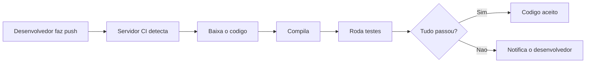
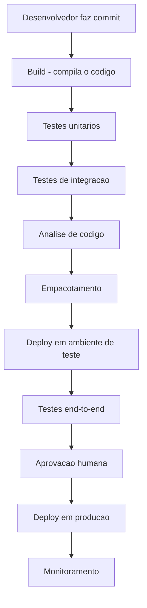
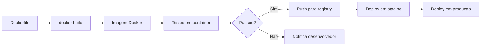
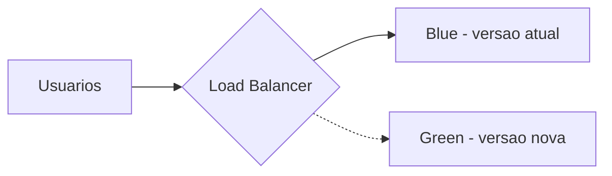
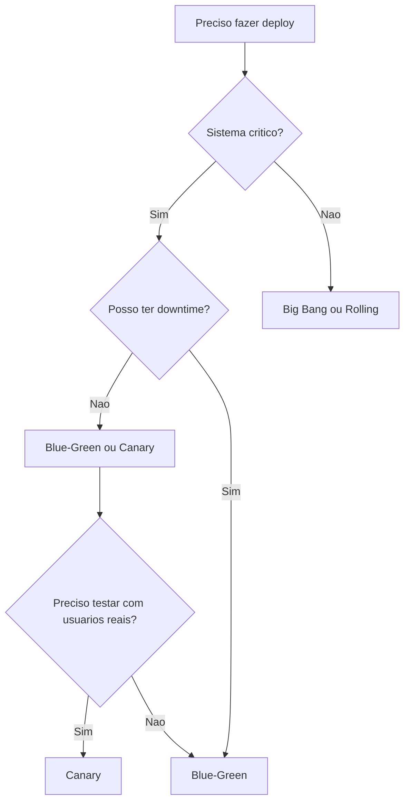
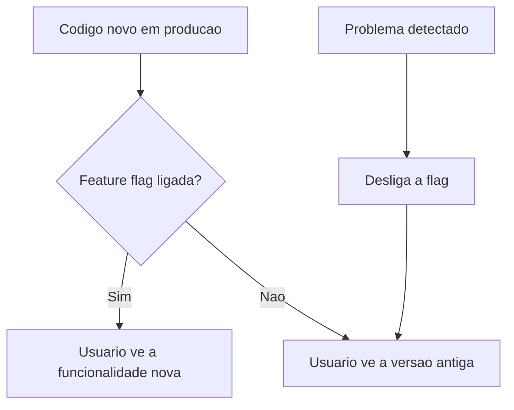
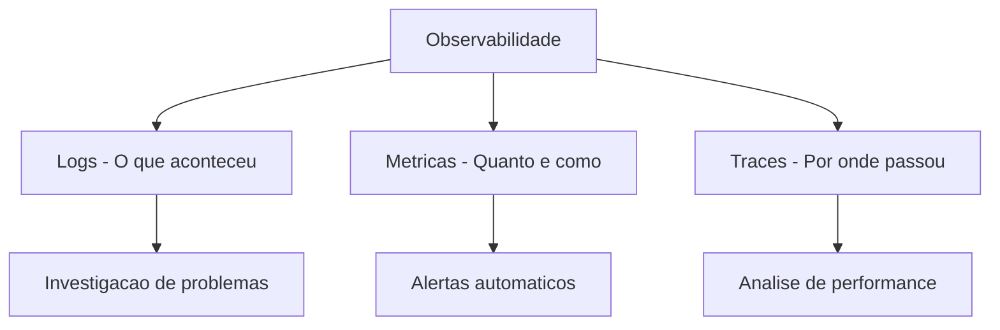
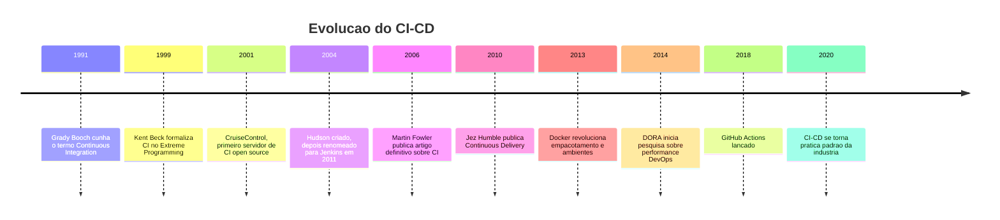

# 12.2 — Esteiras de CI e CD: Do Código ao Usuário com Confiança

[← Anterior: Testes de Software](cap12-mod01-testes-de-software.md) · [Próximo: Automação e Infraestrutura →](cap12-mod03-automacao-infraestrutura.md)

---

## Introdução

No módulo anterior, vimos que testes são a rede de segurança do desenvolvedor — eles garantem que o código funciona como esperado. Mas testes sozinhos não resolvem tudo. Quem roda os testes? Quando? O que acontece depois que os testes passam? Como o código chega até o usuário final?

Imagine que você trabalha em uma equipe com 10 desenvolvedores. Cada um escreve código no seu computador, cada um roda seus testes localmente. No final do dia, todos tentam juntar o código. E aí começa o caos: o código do João conflita com o da Maria, os testes do Pedro passam no computador dele mas falham no servidor, a Ana esqueceu de rodar os testes antes de enviar, e ninguém sabe qual versão está funcionando.

Esse cenário era a realidade de muitas equipes até o início dos anos 2000. A solução veio de duas práticas que transformaram a indústria de software: **Integração Contínua** (CI) e **Entrega Contínua** (CD). Juntas, elas formam o que chamamos de "esteira" — um processo automatizado que leva o código do computador do desenvolvedor até o usuário final, com verificações em cada etapa.

Neste módulo, vamos entender o que são CI e CD, por que existem, qual problema resolvem e por que são tão importantes para qualquer equipe de desenvolvimento.

Se testes são a rede de segurança, CI/CD é o sistema de transporte que leva o código do seu computador até o usuário final — de forma segura, rápida e confiável. Sem CI/CD, mesmo com testes perfeitos, o processo de entregar software é manual, lento e propenso a erros. Com CI/CD, o processo é automatizado, rápido e reproduzível.

Não se preocupe se os termos parecem complicados agora. Ao final deste módulo, você vai entender exatamente o que cada sigla significa, como as peças se encaixam, e por que empresas como Amazon, Netflix e Google investem tanto nessas práticas.

---

## O Problema: A Integração Dolorosa

Antes de CI/CD, o processo de desenvolvimento de software em equipe funcionava mais ou menos assim:

1. Cada desenvolvedor trabalhava isoladamente por dias ou semanas
2. No final de um ciclo, todos tentavam juntar (integrar) o código
3. A integração falhava — conflitos, incompatibilidades, bugs que só apareciam quando o código era combinado
4. A equipe gastava dias ou semanas resolvendo problemas de integração
5. Depois de integrado, alguém empacotava o software manualmente
6. Alguém copiava o pacote para o servidor de produção, também manualmente
7. Se algo desse errado em produção, o processo de voltar para a versão anterior era manual e arriscado

Esse processo era tão doloroso que ganhou um nome: **Integration Hell** (Inferno da Integração). Quanto mais tempo os desenvolvedores trabalhavam isolados, pior era a integração. Era como se cada pessoa estivesse construindo uma parte de um quebra-cabeça sem ver as peças dos outros — quando tentavam montar, as peças não encaixavam.

### O Custo do Integration Hell

Para entender o tamanho do problema, considere estes números de projetos reais antes da adoção de CI/CD:

| Metrica | Antes de CI/CD | Depois de CI/CD |
|---------|---------------|----------------|
| Tempo de integracao | 2-5 dias por ciclo | Minutos, automatico |
| Frequencia de deploy | Mensal ou trimestral | Diaria ou mais |
| Bugs encontrados na integracao | Dezenas por ciclo | Poucos, detectados cedo |
| Tempo para corrigir bug de integracao | Horas a dias | Minutos |
| Moral da equipe durante integracao | Baixa, estressante | Normal, rotineiro |

O Integration Hell não era apenas um problema técnico — era um problema humano. Desenvolvedores temiam o dia da integração. Gerentes adiavam deploys por medo de problemas. Clientes esperavam meses por correções simples. Todo o ciclo de desenvolvimento era dominado pelo medo de quebrar algo.

### A Analogia da Limpeza

Pense em limpar a casa. Se você limpa um pouco todo dia (lava a louça depois de usar, organiza a mesa antes de dormir), a casa nunca fica muito suja e a limpeza nunca é dolorosa. Mas se você deixa acumular por um mês, a limpeza se torna um projeto de fim de semana inteiro — exaustivo, demorado e desagradável.

CI é a mesma coisa: integrar um pouco todo dia é fácil. Integrar tudo de uma vez por mês é doloroso. A frequência elimina a dor.

### O Nascimento da Integração Contínua

Em 1999, Kent Beck — o mesmo que criou o TDD que vimos no módulo anterior — publicou o livro "Extreme Programming Explained", onde descreveu a prática de Integração Contínua. A ideia era radical para a época: em vez de integrar o código uma vez por semana ou por mês, integre várias vezes por dia.

A lógica é simples: se integrar uma vez por mês é doloroso, integrar todo dia é menos doloroso, e integrar várias vezes por dia é quase indolor. Quanto menor a mudança, menor o risco de conflito. Quanto mais frequente a integração, mais rápido os problemas são detectados.

Martin Fowler, outro nome importante da engenharia de software, formalizou a prática em um artigo influente em 2006, estabelecendo os princípios que usamos até hoje.

---

## Integração Contínua (CI): Juntando Código com Confiança

**Integração Contínua** (CI, do inglês Continuous Integration) é a prática de integrar o código de todos os desenvolvedores em um repositório compartilhado várias vezes ao dia, com verificação automatizada a cada integração.

Na prática, funciona assim:

1. O desenvolvedor termina uma mudança no código
2. Ele envia (push) o código para o repositório compartilhado (como o GitHub, que você aprendeu no capítulo 4)
3. Automaticamente, um servidor de CI detecta a mudança
4. O servidor baixa o código, compila (se necessário), e roda todos os testes
5. Se tudo passar, o código é aceito. Se algo falhar, o desenvolvedor é notificado imediatamente



### Os Princípios da CI

Para que a Integração Contínua funcione de verdade, algumas práticas são fundamentais:

| Principio | O que significa | Por que importa |
|-----------|----------------|-----------------|
| Repositório único | Todo o código vive em um único repositório compartilhado | Todos trabalham com a mesma base |
| Commits frequentes | Cada desenvolvedor integra pelo menos uma vez por dia | Mudancas pequenas, conflitos pequenos |
| Build automatizado | O processo de compilação e automático, sem intervencao humana | Elimina erros manuais |
| Testes automatizados | Testes rodam a cada integração | Bugs detectados imediatamente |
| Build rápido | O processo completo deve levar minutos, não horas | Feedback rápido para o desenvolvedor |
| Ambiente identico | O build roda em um ambiente igual ao de produção | Evita o classico funciona na minha máquina |
| Visibilidade | Todos veem o estado do build, quem quebrou, quem consertou | Transparência e responsabilidade |

### "Funciona na Minha Máquina"

Uma das frases mais famosas (e temidas) do desenvolvimento de software é: "Mas funciona na minha máquina!". Isso acontece quando o código funciona no computador do desenvolvedor mas falha em outro lugar — no servidor, no computador do colega, em produção.

As causas são variadas: versões diferentes de bibliotecas, configurações diferentes do sistema operacional, variáveis de ambiente que existem em um lugar mas não em outro, dados de teste que só existem localmente.

CI resolve esse problema porque o código é compilado e testado em um ambiente padronizado — o servidor de CI. Se funciona no servidor de CI, funciona em qualquer lugar que tenha o mesmo ambiente. E como o ambiente de CI é configurado para ser idêntico ao de produção, a confiança é alta.

Lembra do Docker, que você aprendeu no capítulo 6? Docker é uma das ferramentas mais usadas em CI justamente por isso — ele garante que o ambiente é sempre o mesmo, independente de onde o código roda.

---

## Entrega Contínua (CD): Do Código ao Usuário

Se CI cuida de integrar e testar o código, **Entrega Contínua** (CD, do inglês Continuous Delivery) cuida de levar o código testado até o usuário final.

Entrega Contínua é a prática de manter o software sempre em um estado que pode ser colocado em produção a qualquer momento. Isso não significa que você faz deploy a cada commit — significa que você poderia fazer, se quisesse, porque o código está sempre testado, empacotado e pronto.

### A Diferença entre Entrega Contínua e Deploy Contínuo

Existe uma distinção sutil mas importante:

- **Entrega Contínua** (Continuous Delivery): o código está sempre pronto para ir para produção, mas alguém precisa apertar um botão para fazer o deploy. A decisão de quando colocar em produção é humana.

- **Deploy Contínuo** (Continuous Deployment): o código vai para produção automaticamente após passar por todos os testes. Não há botão — se os testes passam, o código vai para o ar.

| Aspecto | Entrega Continua | Deploy Continuo |
|---------|-----------------|-----------------|
| Testes automatizados | Sim | Sim |
| Deploy automático | Não, requer aprovacao humana | Sim, totalmente automático |
| Risco | Menor, humano válida antes | Maior, depende 100% dos testes |
| Velocidade | Alta | Muito alta |
| Quem usa | Maioria das empresas | Empresas com testes muito maduros |

Na prática, a maioria das empresas usa Entrega Contínua — o código é preparado automaticamente, mas um humano decide quando fazer o deploy. Deploy Contínuo é mais comum em empresas com cultura de testes muito madura, como algumas equipes do Google, Netflix e Amazon.

---

## A Esteira Completa: Do Commit ao Usuário

Quando juntamos CI e CD, temos uma "esteira" (pipeline) completa que leva o código do computador do desenvolvedor até o usuário final. Cada etapa da esteira é automatizada e tem um propósito:



Vamos detalhar cada etapa:

### 1. Build (Compilação)

O código-fonte é compilado (em linguagens compiladas como C, C#, Go) ou empacotado (em linguagens interpretadas como Python). Essa etapa verifica se o código pelo menos compila sem erros de sintaxe.

### 2. Testes Unitários

Os testes unitários rodam primeiro porque são os mais rápidos. Se um teste unitário falha, não faz sentido continuar — o problema é na lógica básica do código.

### 3. Testes de Integração

Se os testes unitários passam, rodam os testes de integração. Eles verificam se os componentes funcionam juntos — banco de dados, APIs, serviços externos.

### 4. Análise de Código

Ferramentas automatizadas analisam o código em busca de problemas de qualidade, segurança e estilo. Isso inclui verificar se há vulnerabilidades conhecidas, se o código segue os padrões da equipe, e se a complexidade está dentro do aceitável.

### 5. Empacotamento

O código é empacotado em um formato pronto para deploy — pode ser uma imagem Docker, um arquivo executável, um pacote de instalação. O importante é que o pacote seja imutável: o mesmo pacote que foi testado é o que vai para produção.

### 6. Deploy em Ambiente de Teste

O pacote é instalado em um ambiente que simula produção (chamado de staging ou homologação). Esse ambiente tem a mesma configuração de produção, mas com dados de teste.

### 7. Testes End-to-End

No ambiente de teste, rodam os testes end-to-end que simulam o comportamento real do usuário. Se tudo funciona no staging, a confiança de que vai funcionar em produção é alta.

### 8. Aprovação Humana

Em Entrega Contínua, alguém da equipe revisa e aprova o deploy para produção. Pode ser o líder técnico, o gerente de produto, ou qualquer pessoa com autoridade para decidir.

### 9. Deploy em Produção

O pacote é instalado no ambiente de produção — onde os usuários reais estão. Esse processo deve ser automatizado e reversível (se algo der errado, deve ser possível voltar para a versão anterior rapidamente).

### 10. Monitoramento

Após o deploy, o sistema é monitorado para detectar problemas que os testes não pegaram: aumento de erros, lentidão, comportamento inesperado. Se algo estiver errado, a equipe é alertada automaticamente.

### O Conceito de "Imutabilidade"

Um princípio fundamental em pipelines modernos é a **imutabilidade**: o artefato (pacote, imagem Docker) que foi testado é exatamente o mesmo que vai para produção. Você não recompila, não reempacota, não muda nada. O mesmo binário que passou nos testes é o que roda em produção.

Isso elimina uma classe inteira de problemas: "mas eu testei e funcionava!" — se o artefato é o mesmo, o comportamento é o mesmo. Se algo mudou entre teste e produção, o problema está no ambiente, não no código.

Na prática, isso significa:
- Build uma vez, deploy em múltiplos ambientes
- Nunca alterar o artefato depois do build
- Configurações específicas de ambiente (URLs, credenciais) são injetadas via variáveis de ambiente, não compiladas no código

### O Papel do Docker em CI/CD

Docker (que você aprendeu no capítulo 6) é uma peça fundamental em pipelines modernos de CI/CD por três razões:

1. **Ambiente reproduzível**: o Dockerfile define exatamente o ambiente — mesma versão do sistema operacional, mesmas bibliotecas, mesmas configurações. Elimina o "funciona na minha máquina".

2. **Artefato imutável**: a imagem Docker é o artefato. Uma vez construída e testada, ela é promovida entre ambientes sem alteração.

3. **Isolamento**: cada etapa do pipeline pode rodar em seu próprio container, sem interferir nas outras. Testes de integração podem subir um banco de dados em container, rodar os testes, e destruir tudo ao final.



---

## Por que CI/CD é Tão Importante?

CI/CD transformou a indústria de software. Antes, empresas faziam deploy uma vez por mês, por trimestre, ou até por ano. Hoje, empresas como Amazon fazem deploy a cada 11,7 segundos (dado de 2019). O Netflix faz centenas de deploys por dia. O Google faz milhares.

Isso não é exibicionismo — é necessidade. Em um mercado competitivo, a capacidade de entregar valor rapidamente é uma vantagem enorme. Se você descobre um bug, quer corrigi-lo e entregar a correção em minutos, não em semanas.

### Os Benefícios Concretos

| Beneficio | Sem CI/CD | Com CI/CD |
|-----------|----------|----------|
| Tempo para detectar bugs | Dias a semanas | Minutos |
| Tempo para corrigir e entregar | Dias a semanas | Horas a minutos |
| Risco de cada deploy | Alto, muitas mudancas juntas | Baixo, mudancas pequenas e testadas |
| Frequência de deploy | Mensal ou trimestral | Diaria ou mais |
| Confianca da equipe | Baixa, medo de quebrar | Alta, testes garantem |
| Tempo gasto em integração | Dias de Integration Hell | Zero, automático |
| Rastreabilidade | Difícil saber o que mudou | Cada mudanca e rastreavel |

### O Relatório DORA

Desde 2014, o programa DORA (DevOps Research and Assessment), liderado por Nicole Forsgren, Jez Humble e Gene Kim, pesquisa o que diferencia equipes de software de alta performance. Os resultados, publicados no livro "Accelerate" (2018), mostram que equipes que praticam CI/CD consistentemente têm:

- Deploy 208 vezes mais frequente
- Tempo de entrega 106 vezes mais rápido
- Taxa de falha em mudanças 7 vezes menor
- Tempo de recuperação de falhas 2.604 vezes mais rápido

Esses números não são teóricos — são baseados em dados de milhares de equipes reais ao redor do mundo. CI/CD não é moda — é uma prática comprovadamente eficaz.

### As Quatro Métricas-Chave do DORA

O DORA identificou quatro métricas que melhor predizem a performance de uma equipe de software:

| Metrica | O que mede | Elite | Alta | Media | Baixa |
|---------|-----------|-------|------|-------|-------|
| Frequencia de deploy | Quantas vezes o codigo vai para producao | Sob demanda, multiplas vezes por dia | Entre uma vez por dia e uma vez por semana | Entre uma vez por semana e uma vez por mes | Menos de uma vez por mes |
| Lead time | Tempo do commit ate producao | Menos de 1 hora | Entre 1 dia e 1 semana | Entre 1 semana e 1 mes | Mais de 1 mes |
| Taxa de falha | Porcentagem de deploys que causam problemas | 0-15% | 16-30% | 16-30% | 46-60% |
| Tempo de recuperacao | Tempo para restaurar servico apos falha | Menos de 1 hora | Menos de 1 dia | Entre 1 dia e 1 semana | Mais de 1 mes |

O insight mais importante do DORA é que essas métricas não são trade-offs — equipes de elite são melhores em TODAS as quatro métricas simultaneamente. Velocidade e estabilidade não são opostos — com CI/CD bem implementado, você consegue ambos.

Isso desafia a crença comum de que "se entregarmos mais rápido, vamos ter mais bugs". Na verdade, equipes que entregam mais frequentemente têm MENOS bugs, porque cada mudança é menor e mais fácil de testar e reverter.

### Como Medir na Prática

Se você quiser medir essas métricas na sua equipe (mesmo que seja uma equipe de uma pessoa), comece simples:

- **Frequência de deploy**: conte quantas vezes por semana você faz deploy
- **Lead time**: meça o tempo entre o commit e o deploy em produção
- **Taxa de falha**: conte quantos deploys causaram problemas dividido pelo total de deploys
- **Tempo de recuperação**: meça quanto tempo levou para resolver o último problema em produção

Não precisa de ferramentas sofisticadas — uma planilha simples já serve para começar. O importante é medir, porque o que não é medido não pode ser melhorado.

---

## CI/CD e o Desenvolvedor Júnior

Se você está começando na carreira, CI/CD pode parecer algo distante — "isso é coisa de DevOps, não de desenvolvedor". Mas a realidade é que CI/CD afeta diretamente o seu dia a dia como desenvolvedor:

- **Você vai fazer push e esperar o pipeline rodar** — entender o que cada etapa faz te ajuda a diagnosticar falhas
- **Você vai ser notificado quando quebrar o build** — saber como investigar e corrigir é essencial
- **Você vai participar de code reviews** — entender que o código precisa passar no pipeline antes de ser mergeado
- **Você vai configurar pipelines** — mesmo em projetos pessoais, saber configurar CI básico é um diferencial

Não precisa ser especialista em CI/CD para começar a trabalhar. Mas entender os conceitos — o que é um pipeline, por que existe, como funciona — te coloca em uma posição muito melhor do que alguém que nunca ouviu falar do assunto.

E lembre-se: ninguém nasce sabendo configurar pipelines. Todo profissional sênior que você admira já quebrou builds, fez deploys errados e aprendeu com os erros. O importante é entender os princípios — as ferramentas específicas você aprende na prática.

---

## Ambientes: Dev, Staging e Produção

Um conceito fundamental em CI/CD é o de ambientes. O código passa por diferentes ambientes antes de chegar ao usuário:

| Ambiente | Proposito | Quem usa | Dados |
|----------|----------|----------|-------|
| Desenvolvimento - Dev | Onde o desenvolvedor trabalha | Desenvolvedores | Dados de teste locais |
| Integração - CI | Onde os testes automatizados rodam | Servidor de CI | Dados de teste automatizados |
| Homologacao - Staging | Replica de produção para validação final | QA e stakeholders | Dados similares a produção |
| Produção - Production | Onde os usuarios reais estao | Usuarios finais | Dados reais |

A regra de ouro é: o código sempre flui em uma direção — de Dev para Produção, nunca o contrário. E cada ambiente deve ser o mais parecido possível com produção, para minimizar surpresas.

### Por que Múltiplos Ambientes?

Pode parecer exagero ter tantos ambientes. Por que não testar direto em produção? Porque produção tem dados reais de usuários reais. Um bug em produção afeta pessoas de verdade — pode causar perda de dados, perda de dinheiro, ou simplesmente uma experiência ruim.

Ambientes intermediários existem para que você possa errar sem consequências. É como um piloto de avião que treina em simulador antes de voar com passageiros — o simulador reproduz as condições reais, mas se algo der errado, ninguém se machuca.

A progressão Dev → CI → Staging → Produção é uma série de filtros. Cada ambiente pega problemas que o anterior não pegou. Quanto mais cedo o problema é detectado, mais barato é corrigir — o mesmo princípio que vimos com testes no módulo anterior.

---

## Estratégias de Deploy

Quando o código está pronto para ir para produção, existem diferentes estratégias para fazer o deploy. Cada uma tem seus riscos e benefícios:

### Deploy Direto (Big Bang)

A forma mais simples: para o sistema antigo, instala o novo, liga. Se der errado, para o novo, reinstala o antigo. É arriscado porque todos os usuários são afetados de uma vez.

### Blue-Green Deploy

Você mantém dois ambientes idênticos: Blue (atual) e Green (novo). O tráfego vai para o Blue enquanto você instala a nova versão no Green. Quando o Green está pronto e testado, você redireciona o tráfego. Se der errado, redireciona de volta para o Blue em segundos.



### Canary Deploy

Você direciona uma pequena porcentagem dos usuários (por exemplo, 5%) para a nova versão. Se tudo funcionar bem, aumenta gradualmente (10%, 25%, 50%, 100%). Se algo der errado, apenas 5% dos usuários foram afetados.

O nome vem dos canários que mineradores levavam para dentro das minas de carvão — se o canário morresse, significava que havia gás tóxico e os mineradores deviam sair. O pequeno grupo de usuários é o "canário" que testa a nova versão antes de todos.

### Rolling Deploy

A nova versão é instalada gradualmente nos servidores, um por um. Enquanto um servidor é atualizado, os outros continuam servindo a versão antiga. Quando todos estão atualizados, o deploy está completo.

| Estrategia | Risco | Velocidade de rollback | Complexidade |
|-----------|-------|----------------------|-------------|
| Big Bang | Alto | Lento | Baixa |
| Blue-Green | Baixo | Instantaneo | Media |
| Canary | Muito baixo | Rápido | Alta |
| Rolling | Baixo | Medio | Media |

### Rollback: O Plano B

Nenhum deploy é 100% seguro. Por isso, toda estratégia de deploy precisa de um plano de rollback — a capacidade de voltar para a versão anterior rapidamente.

Um bom rollback deve ser:
- **Rápido**: segundos a minutos, não horas
- **Automatizado**: um comando ou um clique, não um processo manual de 20 passos
- **Testado**: você precisa ter certeza de que o rollback funciona ANTES de precisar dele
- **Documentado**: todos na equipe devem saber como fazer rollback

A pior hora para descobrir que seu rollback não funciona é durante uma crise em produção às 3 da manhã. Teste o rollback regularmente — faça "simulações de incêndio" onde a equipe pratica o processo de rollback em ambiente de staging.

### Escolhendo a Estratégia Certa

A escolha da estratégia de deploy depende do contexto:



Para a maioria dos projetos iniciantes, Blue-Green é a melhor escolha: simples de implementar, rollback instantâneo, e sem downtime. Canary é mais sofisticado e geralmente usado por empresas com milhões de usuários.

### Zero Downtime Deploy

Um objetivo comum em sistemas modernos é o **zero downtime deploy** — atualizar o sistema sem que nenhum usuário perceba interrupção. Isso é possível com Blue-Green, Canary e Rolling deploy, mas requer cuidado com:

- **Compatibilidade de banco de dados**: se a nova versão muda o schema do banco, a versão antiga precisa continuar funcionando durante a transição
- **Compatibilidade de API**: se a nova versão muda a API, clientes antigos precisam continuar funcionando
- **Sessões de usuário**: usuários que estão no meio de uma operação não podem ser interrompidos

Essas preocupações levam a práticas como **migrações de banco de dados compatíveis com versões anteriores** e **versionamento de API** — temas que você vai encontrar na prática quando trabalhar em equipes profissionais.

---

## A Cultura DevOps

CI/CD não é apenas sobre ferramentas — é sobre cultura. E essa cultura tem um nome: **DevOps**.

Historicamente, equipes de desenvolvimento (Dev) e equipes de operações (Ops) trabalhavam separadas. Os desenvolvedores escreviam código e "jogavam por cima do muro" para a equipe de operações, que era responsável por colocar em produção e manter funcionando. Quando algo dava errado, cada lado culpava o outro.

DevOps é a filosofia de quebrar esse muro. Desenvolvedores e operações trabalham juntos, compartilham responsabilidades, e usam automação (CI/CD) para tornar o processo fluido. O desenvolvedor que escreve o código também se preocupa com como ele vai rodar em produção. O profissional de operações participa do design do sistema desde o início.

Essa mudança cultural é tão importante quanto as ferramentas. CI/CD sem cultura DevOps é apenas automação de um processo ruim. CI/CD com cultura DevOps é transformação real.

---

## Ferramentas de CI/CD

Existem muitas ferramentas de CI/CD disponíveis, desde gratuitas até enterprise. Conhecer as principais te ajuda a entender o ecossistema:

### Ferramentas Populares

| Ferramenta | Tipo | Destaque | Custo |
|-----------|------|---------|-------|
| GitHub Actions | Cloud, integrado ao GitHub | Mais popular para projetos open source | Gratuito para repos publicos |
| GitLab CI | Cloud ou self-hosted | Integrado ao GitLab, pipeline como codigo | Gratuito com limites |
| Jenkins | Self-hosted | O mais antigo e flexivel, enorme ecossistema de plugins | Gratuito, open source |
| CircleCI | Cloud | Rapido, boa integracao com Docker | Gratuito com limites |
| Azure DevOps | Cloud | Integrado ao ecossistema Microsoft | Gratuito com limites |
| AWS CodePipeline | Cloud | Integrado ao ecossistema AWS | Pago por uso |
| Travis CI | Cloud | Pioneiro em CI para open source | Pago |

### Pipeline como Código

Uma evolução importante nas ferramentas de CI/CD é o conceito de **pipeline como código** — a configuração da esteira é definida em um arquivo de texto versionado junto com o código do projeto, em vez de ser configurada manualmente em uma interface gráfica.

No GitHub Actions, por exemplo, a esteira é definida em um arquivo YAML dentro do repositório:

```yaml
# .github/workflows/ci.yml
name: CI Pipeline
on: [push, pull_request]

jobs:
  test:
    runs-on: ubuntu-latest
    steps:
      - uses: actions/checkout@v4
      - name: Setup Python
        uses: actions/setup-python@v5
        with:
          python-version: '3.12'
      - name: Install dependencies
        run: pip install -r requirements.txt
      - name: Run tests
        run: pytest
```

Esse arquivo diz: "toda vez que alguém fizer push ou abrir um pull request, rode os testes em um ambiente Ubuntu com Python 3.12". Simples, versionado, e reproduzível.

A vantagem de pipeline como código é que a configuração da esteira evolui junto com o código. Se você muda a versão do Python no projeto, muda no pipeline também. Se você adiciona um novo tipo de teste, adiciona no pipeline. Tudo versionado, tudo rastreável.

---

## Feature Flags: Separando Deploy de Release

Um conceito avançado mas cada vez mais comum é o de **feature flags** (bandeiras de funcionalidade). A ideia é separar o momento do deploy (código vai para produção) do momento do release (funcionalidade é ativada para os usuários).

Com feature flags, você pode fazer deploy de código novo que está "desligado" — ele existe em produção, mas ninguém vê. Quando a funcionalidade está pronta e testada, você "liga" a flag e os usuários passam a ver a novidade. Se algo der errado, você "desliga" a flag sem precisar fazer rollback.



Feature flags são especialmente úteis para:

- **Lançamentos graduais**: ativar para 1% dos usuários, depois 10%, depois 50%, depois 100%
- **Testes A/B**: mostrar versão A para metade dos usuários e versão B para a outra metade
- **Kill switch**: desligar uma funcionalidade problemática instantaneamente
- **Desenvolvimento em trunk**: todos trabalham na mesma branch, funcionalidades incompletas ficam atrás de flags

Empresas como Netflix, Facebook e LinkedIn usam feature flags extensivamente — o Netflix tem milhares de flags ativas a qualquer momento.

---

## Monitoramento Pós-Deploy

A esteira de CI/CD não termina no deploy. Depois que o código está em produção, o monitoramento é essencial para detectar problemas que os testes não pegaram.

### O que Monitorar

| Metrica | O que indica | Exemplo de alerta |
|---------|-------------|------------------|
| Taxa de erros | Porcentagem de requisicoes que falham | Erros acima de 1% nos ultimos 5 minutos |
| Latencia | Tempo de resposta do sistema | P95 acima de 500ms |
| Throughput | Quantidade de requisicoes por segundo | Queda de 50% no trafego normal |
| Uso de recursos | CPU, memoria, disco | CPU acima de 80% por mais de 10 minutos |
| Erros de negocio | Falhas em fluxos criticos | Zero vendas nos ultimos 30 minutos |

### Observabilidade: Logs, Métricas e Traces

O conceito moderno de monitoramento se chama **observabilidade** e se baseia em três pilares:

1. **Logs**: registros textuais do que aconteceu ("usuário X fez login às 14:32", "erro ao conectar ao banco")
2. **Métricas**: números que medem o comportamento do sistema (taxa de erros, latência, uso de CPU)
3. **Traces**: rastreamento de uma requisição através de todos os componentes do sistema (a requisição passou pelo load balancer, depois pelo API gateway, depois pelo serviço de autenticação, depois pelo banco de dados)



Juntos, esses três pilares permitem que a equipe entenda o que está acontecendo no sistema em tempo real e diagnostique problemas rapidamente quando eles ocorrem.

---

## Casos de Uso no Mundo Real

### Amazon: Deploy a Cada 11,7 Segundos

Em 2019, a Amazon revelou que fazia deploy em produção a cada 11,7 segundos em média. Isso significa que em um dia útil de 8 horas, a Amazon faz mais de 2.400 deploys. Isso só é possível porque a empresa investiu pesadamente em CI/CD, testes automatizados e monitoramento. Cada equipe tem sua própria esteira, seus próprios testes, e autonomia para fazer deploy quando quiser. O resultado: a Amazon consegue corrigir bugs em minutos e lançar funcionalidades novas constantemente.

### Netflix: Chaos Engineering

O Netflix não apenas pratica CI/CD — eles inventaram o conceito de **Chaos Engineering**. A ferramenta Chaos Monkey, criada pelo Netflix em 2011, desliga servidores aleatoriamente em produção para testar se o sistema se recupera automaticamente. A lógica é: se o sistema sobrevive a falhas aleatórias no dia a dia, ele vai sobreviver a falhas reais quando elas acontecerem. Isso só funciona porque o Netflix tem uma esteira de CI/CD extremamente madura que permite fazer deploy e rollback em segundos.

### Etsy: De Deploy Mensal a Deploy Diário

A Etsy, marketplace de produtos artesanais, passou por uma transformação famosa. Em 2009, a empresa fazia deploy uma vez por mês, com um processo manual que levava horas e frequentemente causava problemas. Em 2011, após adotar CI/CD e cultura DevOps, a Etsy passou a fazer mais de 50 deploys por dia. O tempo de deploy caiu de horas para minutos, a taxa de falhas diminuiu drasticamente, e a equipe ganhou confiança para experimentar e inovar. A história da Etsy é um dos casos mais citados de transformação DevOps bem-sucedida.

---

## A Evolução Histórica do CI/CD



---

## Como a IA pode te ajudar aqui

**Prompt 1 — Explorar o conceito:**
> "Me explique a diferença entre Integração Contínua e Entrega Contínua usando uma analogia de fábrica."

**Prompt 2 — Listar e descobrir:**
> "Quais são os passos típicos de uma esteira de CI/CD para uma aplicação web com Python e Docker?"

**Prompt 3 — Entender o porquê:**
> "O que é o relatório DORA e por que ele é importante para equipes de desenvolvimento?"

---

## Resumo do Módulo

| Conceito | Definição |
|----------|-----------|
| CI - Integração Continua | Prática de integrar código frequentemente com verificacao automatizada |
| CD - Entrega Continua | Prática de manter o software sempre pronto para deploy |
| Deploy Continuo | Deploy automático apos testes passarem, sem intervencao humana |
| Pipeline - Esteira | Sequência automatizada de etapas do commit ao deploy |
| Build | Etapa de compilação ou empacotamento do código |
| Staging | Ambiente que replica produção para validação final |
| Blue-Green Deploy | Estrategia com dois ambientes identicos para deploy seguro |
| Canary Deploy | Estrategia que direciona pequena porcentagem de usuarios para versão nova |
| DevOps | Cultura de colaboracao entre desenvolvimento e operações |
| Rollback | Processo de voltar para a versão anterior em caso de problema |
| DORA | Programa de pesquisa sobre performance de equipes de software |
| Feature flag | Mecanismo para ativar ou desativar funcionalidades sem deploy |
| Imutabilidade | Principio de que o artefato testado e o mesmo que vai para producao |
| Pipeline como codigo | Configuracao da esteira definida em arquivo versionado no repositorio |
| Shift left | Filosofia de mover verificacoes para o mais cedo possivel no processo |
| Trunk-based development | Pratica de todos trabalharem na mesma branch principal |
| Observabilidade | Capacidade de entender o estado do sistema via logs, metricas e traces |
| Zero downtime | Deploy sem interrupcao perceptivel para o usuario |
| Chaos Engineering | Pratica de injetar falhas propositais para testar resiliencia do sistema |
| Progressive delivery | Evolucao do canary deploy com controle mais granular |
| Supply chain security | Seguranca da cadeia de suprimentos de software |

---

## Glossário do Módulo

| Termo | Definição |
|-------|-----------|
| Big Bang deploy | Estrategia de deploy onde toda a aplicação e substituida de uma vez |
| Blue-Green deploy | Estrategia com dois ambientes identicos para troca instantanea |
| Build | Processo de compilar ou empacotar o código fonte |
| Canary deploy | Deploy gradual para pequena porcentagem de usuarios |
| CD - Continuous Delivery | Entrega Continua, software sempre pronto para produção |
| CI - Continuous Integration | Integração Continua, código integrado e testado frequentemente |
| Continuous Deployment | Deploy Continuo, deploy automático sem intervencao humana |
| DevOps | Cultura e práticas que unem desenvolvimento e operações |
| DORA | DevOps Research and Assessment, programa de pesquisa sobre performance |
| Integration Hell | Termo para o processo doloroso de integrar código apos longo isolamento |
| Load balancer | Componente que distribui trafego entre servidores |
| Pipeline | Sequência de etapas automatizadas do código ao deploy |
| Production | Ambiente onde os usuarios reais utilizam o software |
| Rollback | Reverter para uma versão anterior do software |
| Rolling deploy | Deploy gradual servidor por servidor |
| Staging | Ambiente de homologacao que replica produção |
| Artifact - Artefato | Arquivo produzido pelo pipeline, como imagem Docker ou binario |
| Feature flag | Mecanismo para ativar ou desativar funcionalidades sem deploy |
| Chaos Engineering | Pratica de injetar falhas propositais para testar resiliencia |
| Observabilidade | Capacidade de entender o estado do sistema via logs, metricas e traces |
| Fail fast | Principio de detectar falhas o mais cedo possivel no pipeline |
| Imutabilidade | Principio de nao alterar artefatos apos o build |
| GitOps | Pratica de usar Git como fonte unica de verdade para infraestrutura |
| Supply chain security | Seguranca da cadeia de suprimentos de software |
| Zero downtime deploy | Deploy sem interrupcao perceptivel para o usuario |

---

## Na Cultura Popular

- **The Phoenix Project** (livro, 2013) — Romance sobre uma empresa de TI em crise que descobre DevOps e CI/CD para salvar seus projetos. Escrito por Gene Kim, Kevin Behr e George Spafford, é leitura obrigatória para quem quer entender a cultura DevOps de forma envolvente. O protagonista, Bill Palmer, é promovido a VP de TI e precisa salvar um projeto crítico que está atrasado e cheio de problemas. Ao longo do livro, ele descobre os princípios de CI/CD e DevOps que transformam a empresa.

- **Silicon Valley** (série, 2014-2019) — Em vários episódios, a equipe do Pied Piper enfrenta problemas clássicos de deploy: código que funciona no laptop mas não no servidor, deploys que derrubam o sistema, e a pressão de entregar rápido sem quebrar nada. O episódio onde eles fazem deploy na véspera de uma demonstração importante e tudo dá errado é dolorosamente realista para qualquer desenvolvedor.

- **Accelerate** (livro, 2018) — Escrito por Nicole Forsgren, Jez Humble e Gene Kim, este livro apresenta os dados do programa DORA que mencionamos neste módulo. Não é ficção, mas é uma leitura fascinante que mostra com dados concretos por que CI/CD e DevOps funcionam. Se você quer argumentos baseados em evidências para convencer sua equipe a adotar CI/CD, este é o livro.

- **The Unicorn Project** (livro, 2019) — Sequência espiritual do The Phoenix Project, conta a mesma história do ponto de vista dos desenvolvedores. Foca nos "Cinco Ideais" do desenvolvimento de software: localidade e simplicidade, foco e fluxo, melhoria do trabalho diário, segurança psicológica, e foco no cliente. CI/CD é central para vários desses ideais.

---

## Para Saber Mais

- [Martin Fowler — Continuous Integration](https://martinfowler.com/articles/continuousIntegration.html) — *O artigo clássico que formalizou CI, escrito por um dos nomes mais respeitados da engenharia de software*
- [The Phoenix Project (livro)](https://itrevolution.com/product/the-phoenix-project/) — *Romance que ensina DevOps e CI/CD de forma narrativa e envolvente — leitura obrigatória*
- [DORA — State of DevOps Report](https://dora.dev/) — *Relatórios anuais com dados sobre performance de equipes de software — a base científica do DevOps*
- [GitHub Actions Documentation](https://docs.github.com/en/actions) — *Documentação da ferramenta de CI/CD integrada ao GitHub — a mais acessível para começar*
- [Continuous Delivery (livro)](https://continuousdelivery.com/) — *O livro de Jez Humble e David Farley que definiu o conceito de Entrega Contínua*
- [Fireship — CI/CD in 100 Seconds](https://www.youtube.com/watch?v=scEDHsr3APg) — *Vídeo curto e visual que explica CI/CD em 100 segundos — excelente para revisão rápida*

---

## Perguntas Frequentes (FAQ)

**P: Preciso saber configurar CI/CD agora?**
R: Não. O objetivo aqui é entender o conceito. Quando você trabalhar em uma equipe, vai aprender as ferramentas específicas. O importante é saber por que CI/CD existe e como funciona.

**P: CI/CD é só para empresas grandes?**
R: Não. Até projetos pessoais se beneficiam. Se você tem um projeto no GitHub, pode configurar CI gratuito para rodar seus testes a cada push. É simples e evita surpresas.

**P: Qual a diferença entre CI/CD e DevOps?**
R: CI/CD são práticas específicas (integrar e entregar código automaticamente). DevOps é a cultura mais ampla que inclui CI/CD, mas também colaboração, monitoramento, infraestrutura como código e mais.

**P: O que acontece se o deploy em produção der errado?**
R: Com boas práticas de CI/CD, você faz rollback — volta para a versão anterior. Estratégias como Blue-Green e Canary minimizam o impacto de problemas.

**P: Quanto tempo leva para configurar uma esteira de CI/CD?**
R: Uma esteira básica pode ser configurada em horas. Uma esteira completa e madura pode levar semanas ou meses para refinar. Mas o investimento se paga rapidamente.

**P: CI/CD substitui testes manuais?**
R: Não completamente. CI/CD automatiza a execução de testes automatizados. Testes manuais (como testes de usabilidade) ainda são necessários para certos cenários.

**P: O que é "shift left"?**
R: É a filosofia de mover verificações para o mais cedo possível no processo. Em vez de testar só no final, teste desde o início. Em vez de verificar segurança só antes do deploy, verifique a cada commit. CI/CD é a implementação prática do shift left.

**P: O que são "feature flags" e quando usar?**
R: Feature flags são mecanismos para ativar ou desativar funcionalidades sem fazer deploy. São úteis para lançamentos graduais, testes A/B, e como "kill switch" para desligar funcionalidades problemáticas instantaneamente.

**P: O que é "trunk-based development"?**
R: É a prática de todos os desenvolvedores trabalharem na mesma branch principal (trunk/main), fazendo commits pequenos e frequentes. Funcionalidades incompletas ficam atrás de feature flags. É o modelo usado por empresas como Google e Facebook, e funciona melhor com CI/CD maduro.

**P: Qual a diferença entre "deploy" e "release"?**
R: Deploy é colocar o código em produção. Release é tornar a funcionalidade visível para os usuários. Com feature flags, você pode fazer deploy sem release — o código está em produção mas desligado. Isso separa a decisão técnica (deploy) da decisão de negócio (release).

**P: Posso usar CI/CD com qualquer linguagem de programação?**
R: Sim. CI/CD é agnóstico de linguagem. Funciona com Python, C#, JavaScript, Go, Java, ou qualquer outra linguagem.

**P: O que são "artifacts" em CI/CD?**
R: Artifacts (artefatos) são os arquivos produzidos pela esteira — binários compilados, imagens Docker, pacotes de instalação, relatórios de teste. Eles são armazenados para que possam ser usados em etapas posteriores ou para rollback.

**P: O que é "infrastructure as code"?**
R: É a prática de definir a infraestrutura (servidores, redes, bancos de dados) em arquivos de código, em vez de configurar manualmente. Isso permite que a infraestrutura seja versionada, testada e reproduzida automaticamente — os mesmos princípios de CI/CD aplicados à infraestrutura. Vamos falar mais sobre isso no próximo módulo.

**P: O que acontece se dois desenvolvedores fazem push ao mesmo tempo?**
R: O servidor de CI cria uma fila e processa cada push na ordem. Se o primeiro push quebra o build, o segundo pode ser afetado. Por isso é importante que builds quebrados sejam corrigidos imediatamente — é responsabilidade de quem quebrou.

**P: CI/CD funciona para projetos solo?**
R: Sim, e é altamente recomendado. Mesmo trabalhando sozinho, CI garante que seus testes rodam a cada mudança e CD garante que o deploy é automatizado e reproduzível. Você elimina o risco de "esqueci de rodar os testes" ou "fiz o deploy errado".

---

## Boas Práticas de Pipeline

Ao longo dos anos, a comunidade de desenvolvimento consolidou boas práticas para pipelines de CI/CD:

### Mantenha o Pipeline Rápido

Um pipeline que demora 30 minutos para rodar é um pipeline que ninguém quer esperar. Desenvolvedores vão começar a pular etapas ou fazer push sem esperar o resultado. O ideal é que o pipeline completo rode em menos de 10 minutos.

Estratégias para manter o pipeline rápido:
- Rode testes em paralelo quando possível
- Use cache para dependências (não baixe tudo do zero a cada build)
- Separe testes rápidos (unitários) de testes lentos (E2E) — rode os rápidos primeiro
- Use containers pré-construídos com dependências já instaladas

### Falhe Rápido (Fail Fast)

Se algo vai falhar, é melhor que falhe o mais cedo possível. Organize as etapas do pipeline da mais rápida para a mais lenta:

1. Verificação de sintaxe e linting (segundos)
2. Testes unitários (segundos a minutos)
3. Testes de integração (minutos)
4. Análise de segurança (minutos)
5. Testes E2E (minutos a dezenas de minutos)

Se o linting falha em 5 segundos, não faz sentido esperar 10 minutos pelos testes E2E para descobrir.

### Trate o Pipeline como Código de Produção

O arquivo de configuração do pipeline é código — e deve ser tratado como tal:
- Versionado no repositório
- Revisado em pull requests
- Testado quando possível
- Documentado para que novos membros da equipe entendam

### Nunca Ignore um Build Quebrado

Quando o build quebra, a prioridade número um da equipe é consertar. Não faça push de código novo em cima de um build quebrado — isso só piora a situação. A regra é: quem quebrou, conserta. Se não conseguir consertar rápido, reverte a mudança.

---

## Segurança em CI/CD

Pipelines de CI/CD têm acesso a informações sensíveis — credenciais de banco de dados, chaves de API, tokens de deploy. Proteger o pipeline é tão importante quanto proteger o código.

### Práticas de Segurança

| Pratica | O que fazer | Por que |
|---------|-----------|---------|
| Secrets management | Usar variáveis de ambiente seguras, nunca hardcoded | Credenciais no código sao vulnerabilidade critica |
| Principio do menor privilegio | Pipeline so tem acesso ao que precisa | Limita dano em caso de comprometimento |
| Scan de dependencias | Verificar vulnerabilidades em bibliotecas | Dependencias desatualizadas sao vetor de ataque |
| Scan de codigo | Analise estatica para detectar vulnerabilidades | Detecta problemas antes de chegar a producao |
| Imagens base confiáveis | Usar imagens Docker oficiais e verificadas | Imagens nao confiáveis podem conter malware |
| Audit trail | Registrar quem fez deploy, quando e o que mudou | Rastreabilidade em caso de incidente |

### Supply Chain Security

Um tema cada vez mais relevante é a segurança da cadeia de suprimentos de software (supply chain). Em 2020, o ataque SolarWinds mostrou que atacantes podem comprometer o pipeline de CI/CD de uma empresa para injetar código malicioso que é distribuído automaticamente para milhares de clientes. Isso reforça a importância de proteger não apenas o código, mas todo o processo de build e deploy.

---

## O Futuro do CI/CD

CI/CD continua evoluindo. Algumas tendências atuais:

- **GitOps**: usar Git como fonte única de verdade para infraestrutura e deploys. Toda mudança em produção começa com um commit no Git.
- **Progressive Delivery**: evolução do canary deploy, com controle mais granular sobre quem vê o quê e quando.
- **AI-assisted CI/CD**: uso de IA para priorizar testes (rodar primeiro os testes mais prováveis de falhar), detectar anomalias pós-deploy, e sugerir otimizações no pipeline.
- **Serverless CI/CD**: pipelines que rodam em infraestrutura serverless, pagando apenas pelo tempo de execução.

O princípio fundamental, porém, permanece o mesmo desde 1999: integre frequentemente, teste automaticamente, entregue com confiança.

---

## Exercícios Práticos

1. **Mapeando a esteira**: desenhe (no papel ou em um diagrama Mermaid) como seria uma esteira de CI/CD para o projeto CRUD com FastAPI que você construiu no capítulo 11. Quais etapas teria? Quais testes rodariam em cada etapa? O que aconteceria se um teste falhasse? Inclua pelo menos 6 etapas e explique o propósito de cada uma.

2. **Pesquisa sobre deploys famosos**: pesquise um caso real de deploy que deu errado (há muitos documentados na internet — busque por "deploy gone wrong" ou "deployment disaster"). Descreva: (a) o que aconteceu, (b) qual foi o impacto (financeiro, reputacional, técnico), (c) qual era o processo de deploy da empresa, (d) como CI/CD poderia ter prevenido ou minimizado o problema. Escreva pelo menos 2 parágrafos.

3. **Comparando estratégias**: para cada cenário abaixo, qual estratégia de deploy você escolheria e por quê? Justifique cada escolha com pelo menos 2 argumentos: (a) Um blog pessoal com 100 visitantes por dia. (b) Um e-commerce com 50.000 usuários simultâneos na Black Friday. (c) Um aplicativo bancário que não pode ficar fora do ar nem por 1 segundo. (d) Uma startup que precisa lançar funcionalidades novas toda semana para testar com usuários.

4. **Análise de ferramentas**: escolha duas ferramentas de CI/CD da tabela apresentada neste módulo. Pesquise cada uma e compare: (a) como a esteira é configurada (interface gráfica vs arquivo de código), (b) quais linguagens e plataformas suporta, (c) qual o custo para um projeto pequeno, (d) qual a comunidade e documentação disponível. Monte uma tabela comparativa.

5. **Reflexão sobre cultura**: pense em uma equipe de desenvolvimento hipotética onde os desenvolvedores fazem deploy manualmente, não têm testes automatizados, e cada deploy leva 4 horas. Descreva: (a) quais problemas essa equipe provavelmente enfrenta, (b) por onde você começaria a implementar CI/CD, (c) quais resistências você esperaria encontrar, (d) como convenceria a equipe de que vale o investimento.

---

[← Anterior: Testes de Software](cap12-mod01-testes-de-software.md) · [Próximo: Automação e Infraestrutura →](cap12-mod03-automacao-infraestrutura.md)
