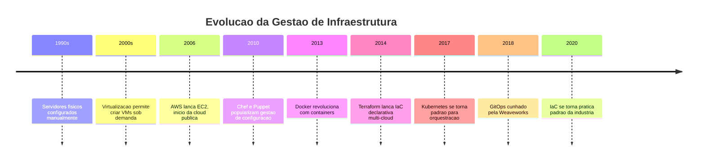
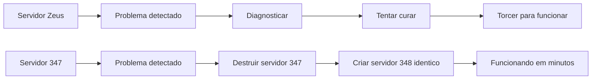
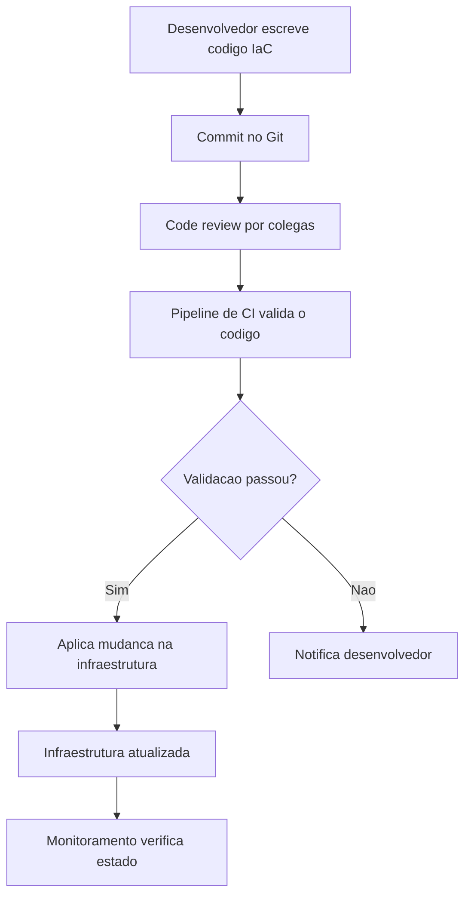
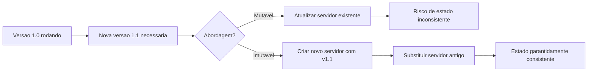
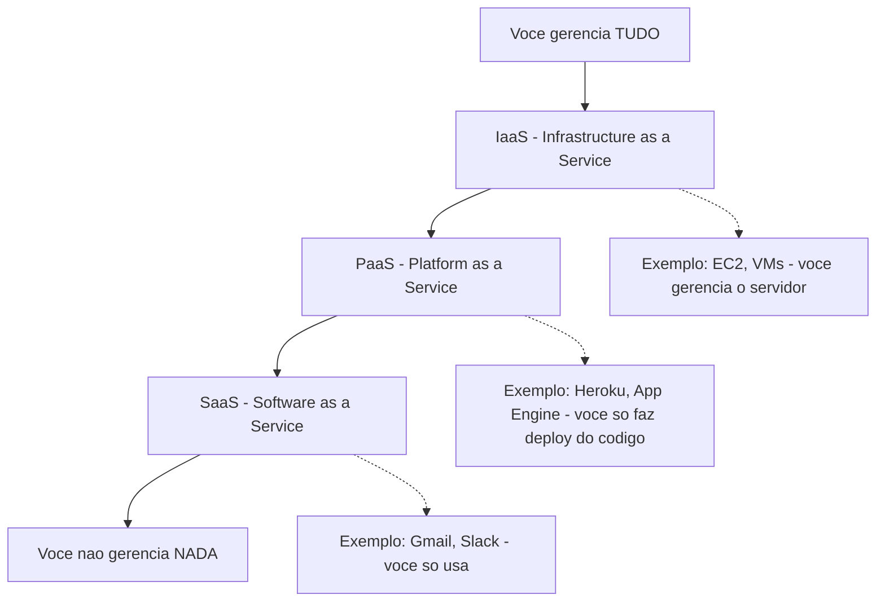
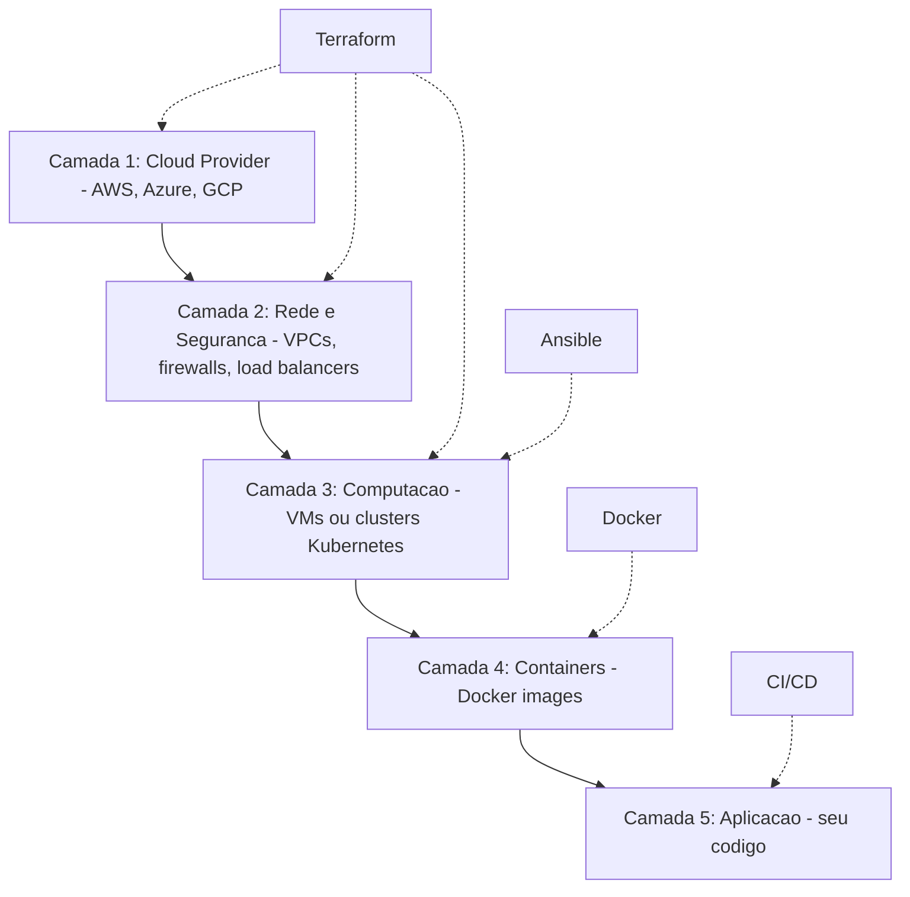

# 12.3 — Automação de Software: Provisionamento e Gestão de Configuração

[← Anterior: Esteiras de CI e CD](cap12-mod02-ci-cd.md) · [Próximo: Projetos Digitais →](cap12-mod04-projetos-digitais.md)

---

## Introdução

No módulo anterior, vimos como esteiras de CI/CD automatizam o caminho do código até o usuário. Mas existe uma pergunta que vem antes: onde esse código vai rodar? Quem cria os servidores? Quem instala o sistema operacional? Quem configura a rede, o banco de dados, o firewall? Quem garante que o ambiente de produção é idêntico ao de staging?

Durante muito tempo, a resposta era: uma pessoa. Um administrador de sistemas que, manualmente, instalava servidores, configurava redes, aplicava atualizações e resolvia problemas. Esse profissional era essencial — e sobrecarregado. Cada servidor era configurado à mão, cada ambiente era ligeiramente diferente, e documentar tudo era quase impossível porque as coisas mudavam o tempo todo.

Esse modelo tinha um nome informal: "administração artesanal". Cada servidor era uma obra de arte única — configurado com carinho, com pequenas diferenças que só o administrador conhecia. Quando esse administrador saía de férias ou mudava de emprego, o conhecimento ia embora junto. Ninguém mais sabia exatamente como aquele servidor estava configurado ou por que aquela configuração específica existia.

O problema se agravava com o crescimento. Quando a empresa tinha 3 servidores, um administrador dava conta. Quando tinha 30, precisava de uma equipe. Quando tinha 300, o modelo inteiro entrava em colapso — era impossível manter consistência, documentação e velocidade com configuração manual.

Esse modelo funcionou enquanto empresas tinham poucos servidores. Mas quando a escala cresceu — de 5 servidores para 50, de 50 para 500, de 500 para 5.000 — ficou claro que configurar servidores manualmente não escalava. Era lento, propenso a erros e impossível de reproduzir com consistência. O custo de um erro era alto: um servidor mal configurado podia derrubar um sistema inteiro, e descobrir qual configuração estava errada em um ambiente de centenas de servidores era como procurar uma agulha em um palheiro.

A solução foi a mesma que resolveu tantos outros problemas na computação: automação. Neste módulo, vamos entender como a automação transformou a gestão de infraestrutura e por que isso importa para qualquer desenvolvedor.

Não se preocupe se os termos parecem técnicos demais — vamos explicar cada um com analogias e exemplos concretos. Ao final deste módulo, você vai entender por que "infraestrutura como código" é uma das ideias mais transformadoras da computação moderna.

---

## A Evolução da Gestão de Infraestrutura

Para entender por que automação é tão importante, vale olhar como a gestão de infraestrutura evoluiu ao longo das décadas:



Cada etapa dessa evolução resolveu um problema da etapa anterior. Servidores físicos eram caros e lentos para provisionar. Virtualização resolveu isso, mas VMs ainda precisavam ser configuradas manualmente. Cloud resolveu o provisionamento, mas a configuração ainda era manual. Ferramentas de gestão de configuração automatizaram a configuração. Docker simplificou o empacotamento. Kubernetes automatizou a orquestração. GitOps trouxe governança e rastreabilidade.

---

## O Problema: Servidores como Animais de Estimação

Existe uma analogia famosa no mundo de infraestrutura, criada por Bill Baker da Microsoft em 2012: **Pets vs Cattle** (Animais de Estimação vs Gado).

No modelo antigo, cada servidor era como um animal de estimação: tinha nome próprio (como "Zeus", "Apollo", "Athena"), era cuidado individualmente, e quando ficava doente, você fazia de tudo para curá-lo. Se o servidor "Zeus" caísse, era uma emergência — alguém precisava diagnosticar o problema, aplicar correções e torcer para funcionar.

No modelo moderno, servidores são como gado: não têm nome, são identificados por números, são idênticos entre si, e quando um fica doente, você o substitui por outro igual. Se o servidor #347 cair, você simplesmente cria o #348 com a mesma configuração em minutos.

| Aspecto | Pets - Animais de estimacao | Cattle - Gado |
|---------|---------------------------|---------------|
| Identidade | Nome proprio, único | Número, substituivel |
| Configuração | Manual, artesanal | Automatizada, reproduzivel |
| Quando falha | Diagnosticar e curar | Destruir e recriar |
| Escala | Dezenas | Milhares |
| Consistência | Cada um e diferente | Todos são identicos |
| Documentação | Na cabeca do admin | No código de automacao |

Essa mudança de mentalidade — de pets para cattle — só é possível com automação. Se cada servidor é configurado manualmente, ele é único e insubstituível. Se a configuração é automatizada, qualquer servidor pode ser recriado em minutos.



---

## Infraestrutura como Código (IaC)

O conceito que viabiliza a mentalidade "cattle" é **Infraestrutura como Código** (IaC, do inglês Infrastructure as Code). A ideia é simples e poderosa: em vez de configurar servidores manualmente (clicando em interfaces ou digitando comandos), você descreve a infraestrutura desejada em arquivos de código. Esses arquivos são versionados (com Git, como você aprendeu no capítulo 4), revisados, testados e executados automaticamente.

Pense assim: quando você escreve um programa em Python, está descrevendo em código o que o computador deve fazer. Infraestrutura como Código é a mesma ideia aplicada a servidores, redes e bancos de dados — você descreve em código como a infraestrutura deve ser, e uma ferramenta de automação faz acontecer.

### Por que Código e Não Cliques?

| Aspecto | Configuração manual | Infraestrutura como Código |
|---------|-------------------|---------------------------|
| Reprodutibilidade | Difícil, depende da memória de quem fez | Total, o código descreve tudo |
| Versionamento | Impossível, não ha histórico | Completo, cada mudanca e rastreavel no Git |
| Revisao | Ninguem revisa cliques | Código pode ser revisado por colegas |
| Velocidade | Horas a dias por servidor | Minutos para dezenas de servidores |
| Consistência | Cada servidor e ligeiramente diferente | Todos os servidores são identicos |
| Recuperacao de desastres | Reconstruir do zero, manualmente | Executar o código e tudo volta |
| Documentação | Separada e desatualizada | O código E a documentação |

O último ponto é especialmente importante: quando a infraestrutura é código, o código é a documentação. Não existe o problema de "a documentação está desatualizada" porque a documentação é o próprio código que cria a infraestrutura. Se o código muda, a documentação muda junto.

### O Fluxo de IaC na Prática



### Ferramentas de IaC e Gestão de Configuração

O ecossistema de ferramentas de automação é vasto. Aqui estão as mais importantes, organizadas por categoria:

**Provisionamento (criar infraestrutura):**

| Ferramenta | Abordagem | Cloud | Destaque |
|-----------|-----------|-------|---------|
| Terraform | Declarativa | Multi-cloud | A mais popular, suporta AWS, Azure, GCP e dezenas de outros |
| AWS CloudFormation | Declarativa | AWS apenas | Nativa da AWS, integração profunda |
| Pulumi | Declarativa com linguagens reais | Multi-cloud | Usa Python, TypeScript, Go em vez de linguagem propria |
| Azure Bicep | Declarativa | Azure apenas | Simplificação do ARM Templates da Microsoft |

**Gestão de Configuração (configurar servidores):**

| Ferramenta | Abordagem | Agente | Destaque |
|-----------|-----------|--------|---------|
| Ansible | Declarativa, sem agente | Nao | A mais popular, usa YAML, conecta via SSH |
| Chef | Imperativa | Sim | Usa Ruby, muito flexivel |
| Puppet | Declarativa | Sim | Pioneira, muito usada em grandes empresas |
| SaltStack | Declarativa e imperativa | Opcional | Rapida, boa para ambientes grandes |

**Containers e Orquestração:**

| Ferramenta | Proposito | Destaque |
|-----------|----------|---------|
| Docker | Empacotar aplicacoes em containers | Voce ja aprendeu no capitulo 6 |
| Kubernetes | Orquestrar containers em escala | Padrao da industria para rodar containers em producao |
| Docker Compose | Orquestrar containers localmente | Voce ja usou no capitulo 6 |

Você não precisa aprender todas essas ferramentas agora. O importante é saber que existem, entender as categorias (provisionamento vs configuração vs orquestração), e saber que todas seguem o princípio de infraestrutura como código.

---

## Provisionamento vs Gestão de Configuração

Dentro do mundo de automação de infraestrutura, existem dois conceitos distintos que se complementam:

**Provisionamento** é criar a infraestrutura: criar servidores, redes, bancos de dados, balanceadores de carga. É como construir a casa — levantar paredes, instalar encanamento, fazer a fiação elétrica.

**Gestão de Configuração** é configurar o que já existe: instalar software nos servidores, configurar serviços, gerenciar arquivos de configuração, aplicar atualizações. É como mobiliar e decorar a casa — colocar os móveis, instalar os eletrodomésticos, organizar tudo.

| Aspecto | Provisionamento | Gestao de Configuração |
|---------|----------------|----------------------|
| O que faz | Cria infraestrutura | Configura infraestrutura existente |
| Analogia | Construir a casa | Mobiliar a casa |
| Frequência | Ocasional, quando precisa de novos recursos | Continua, mantendo tudo atualizado |
| Exemplo | Criar 10 servidores na nuvem | Instalar e configurar o banco de dados nesses servidores |

Na prática, os dois trabalham juntos: primeiro você provisiona a infraestrutura, depois configura. E ambos são automatizados com código.

---

## Abordagens: Imperativa vs Declarativa

Existem duas formas fundamentais de descrever automação, e entender a diferença é importante:

**Abordagem Imperativa**: você descreve os passos que devem ser executados, na ordem. "Primeiro instale o pacote X, depois crie o diretório Y, depois copie o arquivo Z, depois reinicie o serviço W." É como uma receita de cozinha — passo a passo.

**Abordagem Declarativa**: você descreve o estado final desejado, sem se preocupar com os passos. "Quero que o pacote X esteja instalado, o diretório Y exista, o arquivo Z esteja no lugar certo, e o serviço W esteja rodando." A ferramenta descobre sozinha quais passos são necessários para chegar nesse estado.

| Aspecto | Imperativa | Declarativa |
|---------|-----------|-------------|
| Descreve | Os passos para chegar ao resultado | O resultado desejado |
| Analogia | Receita de bolo passo a passo | Foto do bolo pronto, o cozinheiro decide como fazer |
| Idempotencia | Precisa ser implementada manualmente | Geralmente automática |
| Complexidade | Simples para tarefas pequenas | Melhor para infraestrutura complexa |
| Exemplo | Instale nginx, crie diretório, copie config | Quero nginx rodando com esta configuração |

### Idempotência: Rodar Duas Vezes Sem Problema

Um conceito crucial em automação é a **idempotência** — a propriedade de que executar a mesma operação múltiplas vezes produz o mesmo resultado que executar uma vez. Se você rodar seu código de automação duas vezes seguidas, o resultado deve ser o mesmo. Não deve instalar o software duas vezes, não deve criar o diretório duas vezes, não deve duplicar configurações.

Isso é importante porque em sistemas reais, coisas falham no meio do caminho. Se a automação falha na etapa 7 de 10, você precisa poder rodar de novo sem que as etapas 1 a 6 causem problemas. Com idempotência, você simplesmente roda tudo de novo — as etapas já concluídas são ignoradas, e a execução continua de onde parou.

### Idempotência na Prática

Pense em um interruptor de luz. Se você aperta "ligar" e a luz já está ligada, nada acontece — a luz continua ligada. Isso é idempotente. Agora pense em um botão de "toggle" (alterna entre ligado e desligado). Se você aperta duas vezes, volta ao estado original. Isso NÃO é idempotente — o resultado depende do estado atual.

Em automação de infraestrutura, idempotência significa:
- "Instalar nginx" → se já está instalado, não faz nada. Se não está, instala.
- "Criar diretório /app" → se já existe, não faz nada. Se não existe, cria.
- "Configurar firewall para permitir porta 80" → se a regra já existe, não duplica. Se não existe, cria.

Ferramentas declarativas como Ansible e Terraform são naturalmente idempotentes — você descreve o estado desejado, e a ferramenta calcula o que precisa mudar. Se nada precisa mudar, nada é feito.

Ferramentas imperativas (scripts bash, por exemplo) precisam de cuidado extra para serem idempotentes. Um script que executa `mkdir /app` vai falhar na segunda execução porque o diretório já existe. Um script idempotente usaria `mkdir -p /app` (que não falha se o diretório já existe).

### Por que Idempotência é Tão Importante?

Em ambientes de produção, automação é executada repetidamente:
- A cada deploy, o pipeline roda as mesmas etapas
- Ferramentas de gestão de configuração verificam o estado periodicamente (a cada 15 minutos, por exemplo)
- Quando um problema é detectado, a automação é re-executada para corrigir

Se a automação não for idempotente, cada re-execução pode causar problemas: pacotes instalados duas vezes, configurações duplicadas, serviços reiniciados desnecessariamente. Idempotência garante que re-executar é sempre seguro.

---

## Imutabilidade: Não Conserte, Substitua

Um conceito que ganhou força com a popularização de containers (que você aprendeu no capítulo 6) é a **infraestrutura imutável**. A ideia é: em vez de atualizar um servidor existente (instalar nova versão, mudar configuração), você cria um servidor novo com a configuração desejada e substitui o antigo.

Pense em um copo de café. Se o café esfriou, você tem duas opções: esquentar o café que está no copo (mutável — alterar o existente) ou jogar fora e pegar um café novo (imutável — substituir por um novo).

Em infraestrutura, a abordagem imutável é mais segura porque:

- Não há risco de "configuração parcial" (atualização que falha no meio)
- O servidor novo é idêntico ao que foi testado
- Se algo der errado, o servidor antigo ainda existe para rollback
- Não há acúmulo de "sujeira" — configurações antigas, arquivos temporários, estados inconsistentes

Docker é o exemplo mais claro de infraestrutura imutável: você não atualiza um container rodando — você cria uma nova imagem e substitui o container.



---

## Gestão de Configuração: Mantendo Tudo em Ordem

Mesmo com provisionamento automatizado, servidores precisam ser mantidos ao longo do tempo: atualizações de segurança, mudanças de configuração, instalação de novos serviços. A gestão de configuração automatiza essa manutenção contínua.

Os princípios fundamentais são:

### Estado Desejado

Você define como cada servidor deve estar configurado — quais pacotes instalados, quais serviços rodando, quais arquivos presentes, quais permissões aplicadas. A ferramenta de gestão de configuração verifica periodicamente se o servidor está no estado desejado e corrige qualquer desvio.

Se alguém entrar manualmente em um servidor e mudar uma configuração, a ferramenta detecta a mudança e reverte para o estado desejado. Isso é chamado de **configuration drift prevention** (prevenção de desvio de configuração) — o servidor sempre volta ao estado definido no código.

### Inventário

Em ambientes grandes, você precisa saber quais servidores existem, qual o papel de cada um, e quais configurações se aplicam a cada grupo. O inventário é a lista organizada de todos os servidores e suas características.

### Papéis e Grupos

Servidores são organizados em grupos por função: servidores web, servidores de banco de dados, servidores de cache. Cada grupo recebe um conjunto de configurações (um "papel" ou "role"). Isso permite aplicar a mesma configuração a dezenas de servidores de uma vez.

### Exemplo Prático: Configurando 50 Servidores Web

Imagine que você precisa configurar 50 servidores web idênticos. Sem automação, você precisaria:
1. Conectar em cada servidor via SSH (50 conexões)
2. Instalar o nginx em cada um (50 instalações)
3. Copiar o arquivo de configuração para cada um (50 cópias)
4. Reiniciar o serviço em cada um (50 reinicializações)
5. Verificar que cada um está funcionando (50 verificações)

Total: 250 operações manuais, horas de trabalho, alto risco de erro.

Com Ansible, você escreve um playbook de 10 linhas e executa um comando. O Ansible conecta nos 50 servidores simultaneamente, executa todas as operações, e reporta o resultado. Total: 1 comando, minutos de execução, zero risco de inconsistência.

E se amanhã você precisar mudar a configuração do nginx? Muda o arquivo, executa o playbook novamente, e os 50 servidores são atualizados em minutos. Sem automação, seriam mais 50 operações manuais.

### Drift Detection: Detectando Desvios

Uma funcionalidade importante das ferramentas de gestão de configuração é a **detecção de drift** — verificar periodicamente se os servidores estão no estado desejado e alertar quando não estão.

Isso é crucial porque em ambientes reais, coisas mudam sem que ninguém perceba:
- Um desenvolvedor entra em um servidor e muda uma configuração "temporariamente" (e esquece de reverter)
- Uma atualização automática do sistema operacional muda um arquivo de configuração
- Um script de manutenção altera permissões de arquivos
- Um colega instala um pacote "para testar" e esquece de remover

Sem detecção de drift, essas mudanças se acumulam silenciosamente até que algo quebra e ninguém sabe por quê. Com detecção de drift, qualquer desvio é detectado e pode ser corrigido automaticamente ou alertado para investigação.

---

## GitOps: Git como Fonte de Verdade

Uma evolução recente na automação de infraestrutura é o **GitOps** — a prática de usar o repositório Git como a única fonte de verdade para toda a infraestrutura e configuração. Toda mudança na infraestrutura passa por um pull request, é revisada por colegas, e é aplicada automaticamente quando aprovada.

O fluxo é:

1. Desenvolvedor quer mudar uma configuração
2. Cria um branch no Git e faz a mudança no código de infraestrutura
3. Abre um pull request
4. Colegas revisam a mudança
5. Quando aprovada, o merge dispara a aplicação automática da mudança

Isso traz todos os benefícios do Git para a infraestrutura: histórico completo de mudanças, possibilidade de reverter, revisão por pares, rastreabilidade de quem mudou o quê e quando.

### GitOps vs Abordagem Tradicional

| Aspecto | Abordagem tradicional | GitOps |
|---------|---------------------|--------|
| Como mudar infraestrutura | Executar comandos manualmente ou via scripts | Commit no Git, aplicacao automatica |
| Quem pode mudar | Quem tem acesso ao servidor | Quem tem acesso ao repositorio |
| Rastreabilidade | Logs de acesso, nem sempre completos | Historico completo no Git |
| Reversao | Manual, nem sempre possivel | git revert e a mudanca e desfeita |
| Revisao | Opcional, geralmente nao acontece | Obrigatoria via pull request |
| Documentacao | Separada, frequentemente desatualizada | O codigo no Git E a documentacao |

### Os Quatro Princípios do GitOps

1. **Declarativo**: toda a infraestrutura é descrita de forma declarativa em código
2. **Versionado**: todo o código de infraestrutura é versionado no Git
3. **Automatizado**: mudanças aprovadas são aplicadas automaticamente
4. **Reconciliado**: o sistema verifica continuamente se o estado real corresponde ao estado desejado no Git, e corrige desvios automaticamente

O quarto princípio é especialmente poderoso: se alguém fizer uma mudança manual em um servidor, o sistema GitOps detecta que o estado real divergiu do estado no Git e automaticamente reverte a mudança. Isso garante que o Git é sempre a fonte de verdade — nenhuma mudança manual sobrevive.

---

## Por que Desenvolvedores Precisam Saber Isso?

Você pode estar pensando: "Eu quero ser desenvolvedor, não administrador de sistemas. Por que preciso saber sobre automação de infraestrutura?"

A resposta é que a fronteira entre desenvolvimento e operações está cada vez mais borrada. No modelo DevOps que vimos no módulo anterior, desenvolvedores são responsáveis não apenas por escrever código, mas por garantir que ele funcione em produção. Isso inclui:

- Escrever Dockerfiles para empacotar suas aplicações
- Definir como a aplicação deve ser configurada em diferentes ambientes
- Entender como a infraestrutura afeta a performance do código
- Participar de decisões sobre escalabilidade e resiliência
- Diagnosticar problemas que envolvem tanto código quanto infraestrutura

Você não precisa ser especialista em automação de infraestrutura, mas precisa entender os conceitos. Quando alguém falar sobre "infraestrutura como código", "configuração declarativa" ou "infraestrutura imutável", você precisa saber do que estão falando.

---

## Cloud Computing e Automação

A automação de infraestrutura ganhou uma dimensão completamente nova com a popularização da **cloud computing** (computação em nuvem). Antes da cloud, provisionar um servidor significava comprar hardware físico, esperar semanas pela entrega, instalar em um data center, configurar rede e sistema operacional. Com a cloud, provisionar um servidor significa fazer uma chamada de API — e em minutos o servidor está pronto.

Os três maiores provedores de cloud são:

| Provedor | Lancamento | Destaque |
|----------|-----------|---------|
| AWS - Amazon Web Services | 2006 | Maior e mais maduro, maior variedade de servicos |
| Azure - Microsoft | 2010 | Forte integracao com ecossistema Microsoft e .NET |
| GCP - Google Cloud Platform | 2011 | Forte em dados, IA e Kubernetes |

A cloud transformou infraestrutura em algo programável. Em vez de ligar para um fornecedor e pedir um servidor, você escreve código que cria o servidor. Em vez de esperar semanas, espera minutos. Em vez de pagar por hardware que fica ocioso, paga apenas pelo que usa.

Essa programabilidade é o que torna IaC possível e prático. Sem cloud, IaC seria limitado a ambientes internos. Com cloud, IaC pode criar e gerenciar infraestrutura em escala global.

### Modelos de Serviço Cloud

A cloud oferece diferentes níveis de abstração:



| Modelo | O que voce gerencia | O que o provedor gerencia | Exemplo |
|--------|-------------------|--------------------------|---------|
| IaaS | Aplicacao, dados, runtime, SO | Hardware, rede, virtualizacao | AWS EC2, Azure VMs |
| PaaS | Aplicacao e dados | Runtime, SO, hardware, rede | Heroku, Google App Engine |
| SaaS | Nada, apenas usa | Tudo | Gmail, Slack, Salesforce |

Para desenvolvedores, o modelo mais relevante é PaaS — você faz deploy do seu código e a plataforma cuida do resto. Mas muitas empresas usam IaaS porque precisam de mais controle. E é no IaaS que IaC brilha — automatizando a criação e configuração de toda a infraestrutura.

---

## Exemplos Concretos de IaC

Para tornar o conceito mais tangível, vamos ver como IaC se parece na prática. Não se preocupe em entender cada detalhe — o objetivo é ver a forma e entender a ideia.

### Terraform: Criando um Servidor na Cloud

```
# Exemplo conceitual de Terraform (HCL)
# Cria um servidor na AWS

resource "aws_instance" "web_server" {
  ami           = "ami-0c55b159cbfafe1f0"  # imagem do sistema operacional
  instance_type = "t2.micro"                # tipo do servidor (pequeno)
  
  tags = {
    Name = "meu-servidor-web"
    Environment = "production"
  }
}
```

Esse código diz: "quero um servidor na AWS, usando esta imagem de sistema operacional, deste tamanho, com estas tags". Quando você executa `terraform apply`, o Terraform cria o servidor automaticamente. Se você mudar o `instance_type` para `t2.large` e executar novamente, o Terraform atualiza o servidor existente.

### Ansible: Configurando um Servidor

```yaml
# Exemplo conceitual de Ansible (YAML)
# Configura um servidor web

- name: Configurar servidor web
  hosts: web_servers
  tasks:
    - name: Instalar nginx
      apt:
        name: nginx
        state: present
    
    - name: Copiar configuracao
      copy:
        src: nginx.conf
        dest: /etc/nginx/nginx.conf
    
    - name: Garantir que nginx esta rodando
      service:
        name: nginx
        state: started
        enabled: yes
```

Esse código diz: "nos servidores do grupo web_servers, quero que o nginx esteja instalado, com esta configuração, e rodando". Se o nginx já estiver instalado, o Ansible não faz nada (idempotência). Se não estiver, instala. Se estiver parado, inicia.

### Docker Compose: Orquestrando Containers

Você já viu isso no capítulo 6, mas vale relembrar no contexto de IaC:

```yaml
# docker-compose.yml
# Define a infraestrutura local da aplicacao

services:
  app:
    build: .
    ports:
      - "8000:8000"
    environment:
      - DATABASE_URL=postgresql://db:5432/mydb
    depends_on:
      - db
  
  db:
    image: postgres:15
    environment:
      - POSTGRES_DB=mydb
      - POSTGRES_PASSWORD=secret
    volumes:
      - db_data:/var/lib/postgresql/data

volumes:
  db_data:
```

Esse é IaC na sua forma mais simples: um arquivo que descreve toda a infraestrutura necessária para rodar a aplicação. Um comando (`docker-compose up`) e tudo está funcionando.

---

## Segurança em Automação de Infraestrutura

Automação de infraestrutura lida com recursos críticos — servidores, bancos de dados, redes. Um erro pode derrubar sistemas inteiros. Por isso, segurança é fundamental:

### Princípios de Segurança em IaC

| Principio | O que significa | Por que importa |
|-----------|----------------|-----------------|
| Menor privilegio | Cada automacao so tem acesso ao que precisa | Limita dano em caso de comprometimento |
| Secrets management | Credenciais nunca no codigo, sempre em cofres seguros | Evita vazamento de senhas e chaves |
| Code review | Toda mudanca em IaC e revisada por colegas | Quatro olhos veem mais que dois |
| Audit trail | Toda mudanca e registrada com quem, quando e o que | Rastreabilidade em caso de incidente |
| Testes de IaC | Codigo de infraestrutura tambem e testado | Detecta problemas antes de aplicar em producao |
| Scan de vulnerabilidades | Verificar configuracoes inseguras automaticamente | Detecta portas abertas, permissoes excessivas |

### O Perigo do "Terraform Destroy"

Uma história que circula na comunidade: um desenvolvedor executou `terraform destroy` (comando que destrói toda a infraestrutura) no ambiente errado — em vez de destruir o ambiente de teste, destruiu produção. Todos os servidores, bancos de dados e configurações foram apagados.

Isso ilustra por que automação precisa de guardrails (proteções):
- Ambientes de produção devem ter proteção contra destruição acidental
- Comandos destrutivos devem exigir confirmação explícita
- Acesso a ambientes de produção deve ser restrito
- Backups devem existir e ser testados regularmente

---

## Escalabilidade: De 1 a 10.000 Servidores

Um dos maiores benefícios da automação é a escalabilidade. Configurar 1 servidor manualmente leva 1 hora. Configurar 10 servidores manualmente leva 10 horas. Configurar 100 servidores manualmente leva... bem, ninguém faz isso.

Com automação, configurar 1 servidor ou 10.000 servidores leva praticamente o mesmo tempo — você escreve o código uma vez e executa quantas vezes precisar.

### Auto-scaling: Escala Automática

Cloud computing permite algo que seria impossível com servidores físicos: **auto-scaling** — o sistema automaticamente cria mais servidores quando a demanda aumenta e remove servidores quando a demanda diminui.

Imagine um e-commerce na Black Friday. Normalmente, o site recebe 1.000 visitas por hora. Na Black Friday, recebe 100.000. Com auto-scaling:

1. O sistema detecta o aumento de tráfego
2. Automaticamente cria mais servidores (de 5 para 50, por exemplo)
3. O tráfego é distribuído entre todos os servidores
4. Quando a Black Friday acaba e o tráfego volta ao normal, os servidores extras são removidos
5. Você paga apenas pelo tempo que os servidores extras existiram

Sem automação, você teria que prever a demanda, comprar servidores com antecedência, configurar manualmente, e depois ficar com servidores ociosos o resto do ano. Com automação, a infraestrutura se adapta à demanda em tempo real.

---

## O Papel do SRE (Site Reliability Engineering)

Uma evolução do papel de administrador de sistemas é o **SRE** (Site Reliability Engineering, ou Engenharia de Confiabilidade de Sites), conceito criado pelo Google em 2003.

A ideia do SRE é tratar operações de infraestrutura como um problema de engenharia de software. Em vez de administradores que configuram servidores manualmente, SREs são engenheiros que escrevem código para automatizar operações.

O Google define SRE como "o que acontece quando você pede a um engenheiro de software para projetar uma equipe de operações". Os princípios incluem:

- **Eliminar trabalho manual repetitivo** (chamado de "toil") através de automação
- **Definir SLOs** (Service Level Objectives) — metas mensuráveis de confiabilidade
- **Error budgets** — aceitar que falhas vão acontecer e definir quanto é aceitável
- **Blameless postmortems** — quando algo dá errado, investigar a causa sem culpar pessoas

SRE é relevante para desenvolvedores porque muitas empresas esperam que desenvolvedores participem de rotações de on-call (plantão) e entendam como seus sistemas se comportam em produção.

---

## Containers vs VMs no Contexto de Automação

No capítulo 6, você aprendeu sobre containers e VMs. No contexto de automação de infraestrutura, a escolha entre containers e VMs tem implicações importantes:

| Aspecto | VMs | Containers |
|---------|-----|-----------|
| Tempo de provisionamento | Minutos | Segundos |
| Tamanho | Gigabytes | Megabytes |
| Isolamento | Completo, SO proprio | Compartilha kernel do host |
| IaC | Terraform para criar, Ansible para configurar | Dockerfile para definir, Kubernetes para orquestrar |
| Imutabilidade | Possivel mas mais complexa | Natural, containers sao imutaveis por design |
| Escala | Dezenas a centenas | Centenas a milhares |

A tendência da indústria é usar containers para aplicações e VMs para infraestrutura base. Você cria VMs com Terraform, configura com Ansible, e roda containers nessas VMs com Kubernetes. Cada camada de automação cuida de um nível diferente.

### O Conceito de "Infraestrutura em Camadas"

Infraestrutura moderna é organizada em camadas, cada uma automatizada por ferramentas diferentes:



Cada camada tem suas próprias ferramentas de automação, mas todas seguem o mesmo princípio: infraestrutura como código, versionada, testada e reproduzível.

---

## O Futuro da Automação de Infraestrutura

A automação de infraestrutura continua evoluindo rapidamente. Algumas tendências atuais:

### Platform Engineering

Uma evolução do DevOps é o **Platform Engineering** — equipes dedicadas a construir plataformas internas que abstraem a complexidade da infraestrutura para os desenvolvedores. Em vez de cada desenvolvedor precisar saber Terraform, Kubernetes e Ansible, a equipe de plataforma cria ferramentas e templates que permitem que qualquer desenvolvedor provisione infraestrutura com um clique ou um comando simples.

### FinOps: Otimização de Custos

Com a cloud, infraestrutura virou custo variável — você paga pelo que usa. **FinOps** (Financial Operations) é a prática de otimizar custos de cloud, e automação é fundamental: scripts que desligam servidores fora do horário comercial, que identificam recursos ociosos, que recomendam tipos de instância mais econômicos.

### AI-Assisted Operations (AIOps)

Inteligência artificial está sendo aplicada à gestão de infraestrutura para:
- Detectar anomalias automaticamente (aumento incomum de erros, latência fora do padrão)
- Prever problemas antes que aconteçam (disco vai encher em 3 dias, certificado vai expirar em 2 semanas)
- Sugerir otimizações (este servidor está superdimensionado, esta configuração pode ser melhorada)
- Automatizar respostas a incidentes (se o erro X acontecer, execute o runbook Y)

### Serverless: Infraestrutura Invisível

O modelo **serverless** leva a abstração ao extremo: você escreve apenas o código da sua função, e o provedor de cloud cuida de toda a infraestrutura — servidores, escala, disponibilidade. Você não provisiona nada, não configura nada, não gerencia nada. Paga apenas pelo tempo de execução da sua função.

Serverless não elimina a infraestrutura — ela ainda existe. Mas elimina a necessidade de você gerenciá-la. É o nível máximo de abstração: de "eu gerencio tudo" (servidores físicos) para "eu não gerencio nada" (serverless).

| Modelo | O que voce gerencia | Exemplo |
|--------|-------------------|---------|
| Bare metal | Tudo: hardware, SO, rede, aplicacao | Servidor fisico no seu escritorio |
| IaaS | SO, rede virtual, aplicacao | AWS EC2, Azure VMs |
| PaaS | Aplicacao e dados | Heroku, Google App Engine |
| Containers | Aplicacao empacotada | Docker + Kubernetes |
| Serverless | Apenas o codigo da funcao | AWS Lambda, Azure Functions |

A evolução é clara: cada modelo abstrai mais responsabilidade, permitindo que desenvolvedores foquem cada vez mais no que importa — o código que resolve o problema do usuário.

O importante é entender que automação de infraestrutura não é um luxo — é uma necessidade. E os conceitos que você aprendeu neste módulo (IaC, idempotência, imutabilidade, declarativo vs imperativo) são universais e permanentes, independente de qual ferramenta específica você usar no futuro.

---

## Casos de Uso no Mundo Real

### Netflix: Infraestrutura Imutável em Escala

O Netflix é um dos maiores exemplos de infraestrutura imutável em escala. A empresa roda milhares de instâncias na AWS e nunca atualiza uma instância existente — sempre cria novas com a versão desejada e substitui as antigas. O processo é totalmente automatizado: quando uma nova versão de um serviço é aprovada, novas instâncias são criadas com a nova versão, o tráfego é gradualmente migrado (canary deploy), e as instâncias antigas são destruídas. Se algo der errado, as instâncias antigas ainda existem para rollback instantâneo.

### Spotify: Backstage e Developer Experience

O Spotify criou o Backstage, uma plataforma open source para gerenciar infraestrutura e serviços. O problema que resolveram: com centenas de equipes e milhares de serviços, era impossível que cada desenvolvedor soubesse como provisionar e configurar infraestrutura. O Backstage oferece templates de IaC que permitem que qualquer desenvolvedor crie um novo serviço com toda a infraestrutura necessária em minutos, sem precisar ser especialista em automação.

### Capital One: Regulamentação e IaC

O Capital One, um dos maiores bancos dos EUA, adotou IaC não apenas por eficiência, mas por compliance regulatório. No setor financeiro, toda mudança em infraestrutura precisa ser documentada, auditada e aprovada. Com IaC e GitOps, cada mudança é um pull request no Git — automaticamente documentada, revisada por pares, e com histórico completo. Isso transformou um processo burocrático de dias em um processo automatizado de minutos, mantendo toda a rastreabilidade exigida pelos reguladores.

A lição do Capital One é importante: automação não é apenas sobre velocidade — é sobre governança. Em setores regulados (financeiro, saúde, governo), a capacidade de provar quem mudou o quê, quando e por quê é um requisito legal. IaC e GitOps atendem esse requisito naturalmente, porque o Git registra tudo.

### GitLab: Dogfooding de IaC

O GitLab, plataforma de desenvolvimento de software, pratica o que prega: toda a infraestrutura que roda o GitLab.com é gerenciada como código, versionada no próprio GitLab, e aplicada automaticamente. A empresa tem mais de 1.000 servidores e toda a configuração é pública — qualquer pessoa pode ver como a infraestrutura do GitLab é gerenciada. Isso é um exemplo extremo de transparência e confiança no processo de IaC.

No próximo módulo, vamos sair da infraestrutura e olhar para o panorama mais amplo: como projetos digitais são planejados, organizados e executados do início ao fim — desde a ideia até a entrega.

---

## Como a IA pode te ajudar aqui

**Prompt 1 — Explorar o conceito:**
> "Me explique a diferença entre provisionamento e gestão de configuração usando uma analogia de construção de casa."

**Prompt 2 — Entender o porquê:**
> "O que é infraestrutura imutável e por que é mais segura que atualizar servidores existentes?"

**Prompt 3 — Ver exemplos práticos:**
> "Me dê exemplos reais de como GitOps funciona no dia a dia de uma equipe de desenvolvimento."

---

## Resumo do Módulo

| Conceito | Definição |
|----------|-----------|
| Pets vs Cattle | Analogia entre servidores unicos e artesanais vs servidores substituiveis e identicos |
| IaC - Infraestrutura como Código | Descrever infraestrutura em arquivos de código versionaveis |
| Provisionamento | Criar infraestrutura: servidores, redes, bancos de dados |
| Gestao de Configuração | Configurar e manter infraestrutura existente |
| Imperativa vs Declarativa | Descrever passos vs descrever estado final desejado |
| Idempotencia | Executar multiplas vezes produz o mesmo resultado |
| Infraestrutura imutavel | Substituir em vez de atualizar |
| GitOps | Usar Git como fonte de verdade para infraestrutura |
| Configuration drift | Desvio entre configuração desejada e real |
| Cloud computing | Infraestrutura sob demanda via internet |
| Auto-scaling | Criar e remover servidores automaticamente conforme demanda |
| SRE | Tratar operacoes de infraestrutura como problema de engenharia |
| Toil | Trabalho manual repetitivo que deveria ser automatizado |

---

## Glossário do Módulo

| Termo | Definição |
|-------|-----------|
| Cattle - Gado | Modelo onde servidores são substituiveis e identicos |
| Configuration drift | Desvio gradual entre a configuração desejada e a real |
| Configuration management | Gestao de configuração, manter servidores no estado desejado |
| Declarative - Declarativa | Abordagem que descreve o estado final desejado |
| GitOps | Prática de usar Git como fonte única de verdade para infraestrutura |
| IaC - Infrastructure as Code | Infraestrutura como Código, descrever infra em arquivos versionaveis |
| Idempotent - Idempotente | Operação que produz o mesmo resultado independente de quantas vezes e executada |
| Immutable infrastructure | Infraestrutura imutavel, substituir em vez de modificar |
| Imperative - Imperativa | Abordagem que descreve os passos a serem executados |
| Inventory - Inventario | Lista organizada de servidores e suas caracteristicas |
| Pets - Animais de estimacao | Modelo onde servidores são unicos e insubstituiveis |
| Provisioning - Provisionamento | Processo de criar infraestrutura |
| Role - Papel | Conjunto de configurações aplicaveis a um grupo de servidores |
| Auto-scaling | Capacidade de criar e remover servidores automaticamente conforme demanda |
| Cloud computing | Computacao em nuvem, infraestrutura sob demanda via internet |
| IaaS | Infrastructure as a Service, voce gerencia o servidor |
| PaaS | Platform as a Service, voce so faz deploy do codigo |
| SaaS | Software as a Service, voce so usa o software |
| SRE | Site Reliability Engineering, tratar operacoes como problema de engenharia |
| SLO | Service Level Objective, meta mensuravel de confiabilidade |
| Error budget | Quantidade aceitavel de falhas em um periodo |
| Toil | Trabalho manual repetitivo que deveria ser automatizado |
| Blameless postmortem | Investigacao de incidentes sem culpar pessoas |
| Terraform | Ferramenta de IaC declarativa multi-cloud |
| Ansible | Ferramenta de gestao de configuracao sem agente |
| Kubernetes | Plataforma de orquestracao de containers |
| Platform Engineering | Equipes que constroem plataformas internas para abstrair complexidade |
| FinOps | Pratica de otimizar custos de cloud |
| AIOps | Uso de IA para gestao de operacoes de infraestrutura |
| Serverless | Modelo onde o provedor gerencia toda a infraestrutura |
| Drift detection | Deteccao automatica de desvios entre estado desejado e real |
| Playbook | Arquivo de automacao do Ansible que descreve tarefas a executar |
| HCL | HashiCorp Configuration Language, linguagem do Terraform |
| On-call | Plantao de desenvolvedores ou SREs para responder a incidentes |
| Runbook | Documento com passos para resolver um tipo especifico de incidente |

---

## Na Cultura Popular

- **The Phoenix Project** (livro, 2013) — O protagonista Bill descobre que a empresa gasta semanas configurando ambientes manualmente, e que cada servidor é um "floco de neve" único. A jornada de automação é um dos arcos centrais do livro.

- **Mr. Robot** (série, 2015-2019) — A série mostra como infraestrutura de TI funciona por dentro — servidores, redes, configurações. Vários ataques exploram justamente a falta de automação e consistência na configuração de servidores.

- **The Unicorn Project** (livro, 2019) — Sequência do The Phoenix Project, foca na perspectiva dos desenvolvedores. Mostra como a falta de automação de infraestrutura cria gargalos que impedem os desenvolvedores de entregar valor. A protagonista Maxine luta contra ambientes que levam semanas para serem configurados — um problema que IaC resolve em minutos.

- **Halt and Catch Fire** (série, 2014-2017) — Nos episódios sobre a era dos data centers e da internet, a série mostra como era gerenciar servidores nos anos 90 — tudo manual, tudo artesanal, cada servidor um "pet" com personalidade própria.

---

## Para Saber Mais

- [Martin Fowler — Infrastructure as Code](https://martinfowler.com/bliki/InfrastructureAsCode.html) — *Artigo conciso sobre o conceito de IaC por um dos maiores nomes da engenharia de software*
- [The Phoenix Project (livro)](https://itrevolution.com/product/the-phoenix-project/) — *Romance que mostra a transformação de uma empresa através de automação e DevOps*
- [12 Factor App — Config](https://12factor.net/pt_br/config) — *Princípios para gestão de configuração em aplicações modernas, em português*
- [GitOps — Weaveworks](https://www.weave.works/technologies/gitops/) — *Introdução ao conceito de GitOps pela empresa que cunhou o termo*
- [LINUXtips — Infraestrutura](https://www.youtube.com/@LINUXtips) — *Canal brasileiro com conteúdo profundo sobre infraestrutura e automação*
- [Terraform Getting Started](https://developer.hashicorp.com/terraform/tutorials) — *Tutoriais oficiais do Terraform para quem quiser experimentar IaC na prática*
- [Ansible Getting Started](https://docs.ansible.com/ansible/latest/getting_started/) — *Documentação oficial do Ansible com tutoriais para iniciantes*
- [Kubernetes Documentation](https://kubernetes.io/docs/home/) — *Documentação oficial do Kubernetes, para quando você quiser explorar orquestração de containers*
- [AWS Well-Architected Framework](https://aws.amazon.com/architecture/well-architected/) — *Boas práticas de arquitetura na cloud, aplicáveis a qualquer provedor*

---

## Perguntas Frequentes (FAQ)

**P: Preciso aprender ferramentas de automação agora?**
R: Não. O objetivo é entender os conceitos. Quando você trabalhar em uma equipe, vai aprender as ferramentas específicas que ela usa. Os conceitos são universais.

**P: Automação de infraestrutura é responsabilidade do desenvolvedor?**
R: Depende da empresa. Em equipes com cultura DevOps, sim — desenvolvedores participam. Em empresas maiores, pode haver equipes especializadas (SRE, Platform Engineering). Mas entender os conceitos é importante para qualquer desenvolvedor.

**P: O que é "infraestrutura como código" na prática?**
R: São arquivos de texto (geralmente YAML, JSON ou uma linguagem específica) que descrevem servidores, redes, bancos de dados e configurações. Esses arquivos são versionados no Git e executados por ferramentas de automação.

**P: Qual a relação entre Docker e IaC?**
R: Docker é uma forma de IaC para aplicações — o Dockerfile descreve como a aplicação deve ser empacotada. IaC em sentido mais amplo inclui também a infraestrutura onde os containers rodam.

**P: O que acontece se o código de automação tiver um bug?**
R: O mesmo que acontece com qualquer código — pode causar problemas. Por isso, código de infraestrutura também deve ser testado e revisado. A diferença é que um bug em código de infraestrutura pode derrubar servidores inteiros.

**P: GitOps é a mesma coisa que CI/CD?**
R: Não, mas se complementam. CI/CD automatiza o pipeline de código da aplicação. GitOps aplica os mesmos princípios à infraestrutura. Juntos, cobrem tanto o código quanto o ambiente onde ele roda.

**P: O que é "configuration drift" e por que é um problema?**
R: É quando a configuração real de um servidor diverge da configuração desejada — alguém fez uma mudança manual, uma atualização automática mudou algo, etc. É um problema porque cria inconsistência e imprevisibilidade.

**P: Infraestrutura imutável significa que nunca atualizo nada?**
R: Não. Significa que em vez de atualizar o servidor existente, você cria um novo com a versão atualizada e substitui o antigo. O resultado é o mesmo (software atualizado), mas o processo é mais seguro.

**P: O que é "toil" e por que é ruim?**
R: Toil é trabalho manual, repetitivo e automatizável que não agrega valor permanente. Exemplos: reiniciar servidores manualmente, aplicar patches um por um, copiar arquivos de configuração. É ruim porque consome tempo que poderia ser usado para melhorar o sistema.

**P: O que é auto-scaling?**
R: É a capacidade de criar e remover servidores automaticamente conforme a demanda. Quando o tráfego aumenta, mais servidores são criados. Quando diminui, servidores extras são removidos. Você paga apenas pelo que usa.

**P: Preciso saber cloud computing para ser desenvolvedor?**
R: Não precisa ser especialista, mas entender os conceitos básicos (IaaS, PaaS, SaaS) é cada vez mais importante. A maioria das aplicações modernas roda na cloud, e desenvolvedores frequentemente interagem com serviços cloud.

**P: O que é SRE e como se relaciona com desenvolvimento?**
R: SRE (Site Reliability Engineering) é a prática de tratar operações como problema de engenharia. SREs escrevem código para automatizar operações. Muitas empresas esperam que desenvolvedores entendam conceitos de SRE e participem de rotações de plantão.

**P: Terraform e Ansible são concorrentes?**
R: Não, são complementares. Terraform cria infraestrutura (servidores, redes). Ansible configura infraestrutura existente (instala software, configura serviços). Muitas empresas usam os dois juntos.

**P: O que é Kubernetes e preciso aprender agora?**
R: Kubernetes é uma plataforma para orquestrar containers em escala. É complexo e geralmente não é necessário para projetos pequenos. Você não precisa aprender agora, mas saber que existe e qual problema resolve é útil.

---

## Exercícios Práticos

1. **Pets vs Cattle no dia a dia**: pense em exemplos do seu cotidiano que seguem o modelo "pets" e o modelo "cattle". Por exemplo: seu celular é um "pet" (único, personalizado, insubstituível) ou "cattle" (substituível por outro igual)? E suas roupas? E os copos da sua casa? Escreva 3 exemplos de cada modelo e explique por que classificou cada um assim.

2. **Infraestrutura do seu projeto**: pense no projeto CRUD com FastAPI do capítulo 11. Se você quisesse colocar esse projeto em produção, que infraestrutura precisaria? Liste: servidores, banco de dados, rede, configurações. Agora imagine que precisa de 10 cópias idênticas — como a automação ajudaria? Descreva o processo manual vs o processo automatizado.

3. **Pesquisa sobre IaC**: pesquise uma das ferramentas mencionadas neste módulo (Terraform, Ansible, Kubernetes ou outra). Descubra: (a) quem criou e quando, (b) qual problema resolve, (c) como é usada na prática, (d) quais empresas famosas usam. Escreva um resumo de pelo menos 2 parágrafos.

4. **Análise de cenário**: uma empresa tem 50 servidores configurados manualmente ao longo de 5 anos. Cada servidor é ligeiramente diferente. A empresa quer migrar para IaC. Descreva: (a) quais desafios essa migração enfrentaria, (b) por onde você começaria, (c) quanto tempo estimaria para a migração completa, (d) quais benefícios a empresa teria após a migração. Justifique suas respostas.

5. **Imperativa vs Declarativa**: pense em uma tarefa do dia a dia (como fazer um bolo). Escreva as instruções de forma imperativa (passo a passo) e de forma declarativa (descrevendo o resultado desejado). Qual abordagem é mais fácil de seguir? Qual é mais flexível? Conecte com as abordagens de automação de infraestrutura.

---

[← Anterior: Esteiras de CI e CD](cap12-mod02-ci-cd.md) · [Próximo: Projetos Digitais →](cap12-mod04-projetos-digitais.md)
