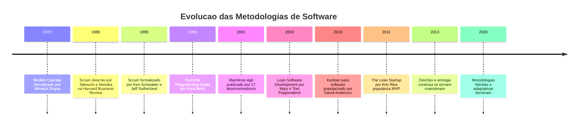
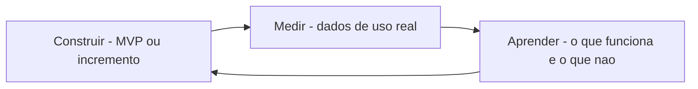
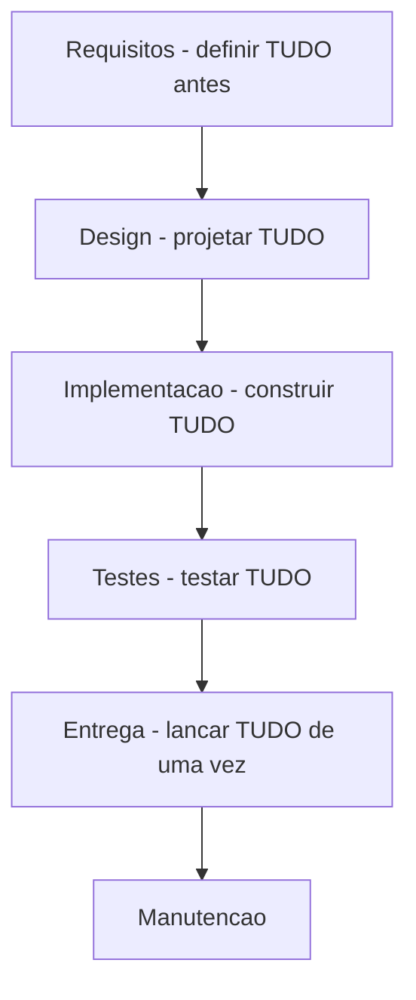
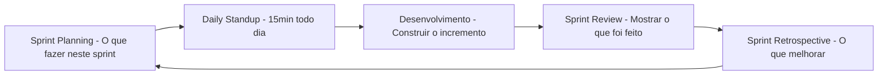
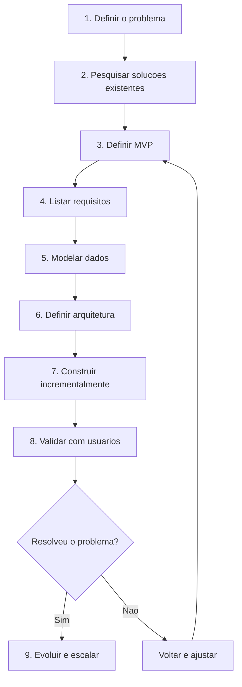
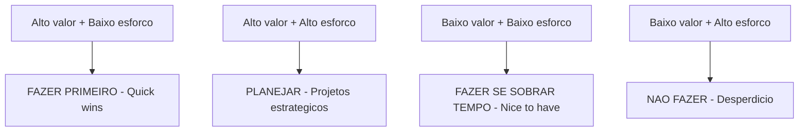

# 12.4 — Projetos Digitais: De Ideias a Soluções

[← Anterior: Automação e Infraestrutura](cap12-mod03-automacao-infraestrutura.md) · [Próximo: Open Source e Comunidades →](cap12-mod05-open-source.md)

---

## Introdução

Nos módulos anteriores, falamos sobre testes, esteiras de CI/CD e automação de infraestrutura — práticas que tornam o desenvolvimento de software mais confiável e eficiente. Mas todas essas práticas pressupõem algo fundamental: que você sabe o que construir.

E essa é, talvez, a parte mais difícil de toda a engenharia de software. Não é escrever código — isso você aprende com prática. Não é configurar servidores — isso se automatiza. A parte mais difícil é entender o problema que precisa ser resolvido e transformar esse entendimento em um projeto que pode ser construído.

A história da tecnologia está cheia de projetos que falharam não por problemas técnicos, mas porque construíram a coisa errada. O software funcionava perfeitamente — mas resolvia o problema errado, ou resolvia um problema que ninguém tinha, ou resolvia o problema certo de uma forma que ninguém conseguia usar.

Neste módulo, vamos falar sobre como projetos digitais nascem, como transformar ideias em requisitos, e como organizar o desenvolvimento para maximizar as chances de sucesso. Não vamos falar de ferramentas específicas — vamos falar de conceitos que se aplicam a qualquer projeto, em qualquer tecnologia, em qualquer época.

Se você está pensando "mas eu só quero programar, não quero ser gerente de projetos" — entendo. Mas a realidade é que todo desenvolvedor participa de decisões sobre o que construir, como priorizar e quando entregar. Quanto melhor você entender o processo de transformar ideias em software, mais valioso você será em qualquer equipe.

---

## A Evolução das Metodologias de Desenvolvimento

Antes de mergulhar nos conceitos, vale entender como a indústria chegou onde está hoje:

Cada metodologia surgiu como resposta a problemas da anterior. O modelo cascata era previsível mas inflexível. Métodos ágeis trouxeram flexibilidade mas exigiam disciplina. Lean trouxe foco em eliminar desperdício. DevOps conectou desenvolvimento e operações. Hoje, a maioria das equipes usa uma combinação adaptada ao seu contexto.

---

## O Problema: Por que Projetos Falham?

Antes de falar sobre como fazer projetos darem certo, vale entender por que tantos dão errado. O Standish Group pública desde 1994 o CHAOS Report, um dos estudos mais citados sobre sucesso e fracasso de projetos de software:

Segundo dados históricos do relatório, cerca de 30% dos projetos de software são cancelados antes de serem concluídos, e mais de 50% ultrapassam significativamente o orçamento ou prazo original. Apenas uma minoria é entregue no prazo, no orçamento e com todas as funcionalidades planejadas.

As causas mais comuns de fracasso não são técnicas:

| Causa de fracasso | Frequência | O que significa |
|-------------------|-----------|-----------------|
| Requisitos incompletos ou mal definidos | Muito alta | Ninguem sabia direito o que construir |
| Falta de envolvimento do usuario | Alta | Construiram sem perguntar para quem vai usar |
| Escopo descontrolado | Alta | O projeto cresceu sem controle, sempre adicionando mais coisas |
| Expectativas irrealistas | Media | Prometeram mais do que era possível entregar |
| Falta de planejamento | Media | Comecaram a construir sem pensar antes |
| Mudancas frequentes de requisitos | Media | O que era para construir mudava o tempo todo |

Repare: nenhuma dessas causas é "o programador não sabia programar" ou "a tecnologia era ruim". A maioria dos fracassos acontece antes de uma linha de código ser escrita — na fase de entender o problema e planejar a solução.

### Casos Famosos de Fracasso

A história da tecnologia tem exemplos emblemáticos:

**Healthcare.gov (2013)**: O site de saúde do governo americano custou mais de 2 bilhões de dólares e falhou espetacularmente no lançamento. O site não suportava a carga de usuários, tinha bugs graves e era praticamente inutilizável. As causas: requisitos mal definidos, falta de testes de carga, múltiplos fornecedores sem coordenação, e lançamento "big bang" sem validação incremental.

**Google Wave (2009)**: O Google investiu anos desenvolvendo uma plataforma de comunicação revolucionária. O produto era tecnicamente impressionante — mas ninguém entendia para que servia. O Google construiu uma solução sofisticada para um problema que as pessoas não tinham (ou não sabiam que tinham). Foi descontinuado em 2012.

**Windows Vista (2007)**: A Microsoft gastou 5 anos e bilhões de dólares desenvolvendo o Windows Vista. O resultado: um sistema operacional lento, incompatível com hardware existente, e cheio de problemas de usabilidade. O escopo cresceu descontroladamente durante o desenvolvimento (scope creep), e a Microsoft tentou fazer tudo de uma vez em vez de entregar incrementalmente.

Esses casos reforçam a mesma lição: o problema raramente é técnico. É de processo, comunicação e foco.

### O Custo do Fracasso

Para colocar em perspectiva o impacto de projetos mal gerenciados:

| Metrica | Impacto |
|---------|---------|
| Projetos cancelados | Bilhoes de dolares desperdicados globalmente por ano |
| Projetos atrasados | Oportunidades de mercado perdidas, concorrentes avancam |
| Projetos com escopo errado | Software que ninguem usa, investimento sem retorno |
| Moral da equipe | Desenvolvedores frustrados, turnover alto |
| Reputacao | Clientes perdem confianca, dificil recuperar |

A boa notícia é que a taxa de sucesso de projetos tem melhorado ao longo dos anos, em grande parte graças à adoção de metodologias ágeis, MVP e práticas de CI/CD. Projetos menores, incrementais e com feedback frequente têm taxas de sucesso significativamente maiores do que projetos grandes e monolíticos.

---

## Tudo Começa com um Problema

O mantra mais importante deste curso — e talvez da sua carreira inteira — é: **"Qual problema você quer resolver?"**

Todo projeto de software deveria começar com essa pergunta. Não com "qual tecnologia vamos usar?", não com "qual framework está na moda?", não com "vamos fazer um app!". Começa com: qual problema existe no mundo real que este software vai resolver?

Parece óbvio, mas é surpreendente quantos projetos começam pela solução em vez do problema. "Vamos fazer um aplicativo de delivery" — por quê? Qual problema específico ele resolve que os existentes não resolvem? Para quem? Em que contexto?

### Entendendo o Problema

Antes de pensar em qualquer solução técnica, você precisa entender profundamente o problema:

- **Quem tem o problema?** Identifique as pessoas reais que sofrem com ele. Não "os usuários" de forma genérica — pessoas específicas com necessidades específicas.

- **Qual é o problema exatamente?** Descreva o problema sem mencionar tecnologia. "Os vendedores perdem 2 horas por dia preenchendo relatórios manualmente" é um problema. "Precisamos de um sistema web com React" não é um problema — é uma solução prematura.

- **Qual o impacto do problema?** Quanto custa não resolver? Em tempo, dinheiro, frustração, oportunidades perdidas?

- **Como o problema é resolvido hoje?** Quase sempre existe uma solução atual, mesmo que seja manual, ineficiente ou improvisada. Entender a solução atual te ajuda a entender o que funciona e o que não funciona.

- **O que seria "resolver" o problema?** Como você sabe que o problema foi resolvido? Quais critérios de sucesso?

---

## Levantamento de Requisitos: O que Construir?

Depois de entender o problema, o próximo passo é definir o que o software precisa fazer para resolvê-lo. Esse processo se chama **levantamento de requisitos** — e é uma das habilidades mais valiosas que um profissional de tecnologia pode ter.

### O que São Requisitos?

Requisitos são descrições do que o software deve fazer (requisitos funcionais) e como deve se comportar (requisitos não-funcionais).

**Requisitos funcionais** descrevem funcionalidades:
- "O sistema deve permitir que o usuário cadastre produtos com nome, preço e categoria"
- "O sistema deve enviar um e-mail de confirmação quando um pedido for realizado"
- "O sistema deve calcular o frete com base no CEP do destinatário"

**Requisitos não-funcionais** descrevem qualidades:
- "O sistema deve responder em menos de 2 segundos"
- "O sistema deve suportar 1.000 usuários simultâneos"
- "O sistema deve estar disponível 99,9% do tempo"
- "Os dados do usuário devem ser criptografados"

| Tipo | O que descreve | Exemplos |
|------|---------------|----------|
| Funcional | O que o sistema faz | Cadastrar, buscar, calcular, enviar |
| Não-funcional | Como o sistema se comporta | Velocidade, segurança, disponibilidade, escalabilidade |

### Técnicas de Levantamento

Existem várias formas de descobrir o que o software precisa fazer:

**Entrevistas**: conversar diretamente com as pessoas que vão usar o sistema. Perguntar sobre o dia a dia, as dificuldades, o que funciona e o que não funciona. A chave é ouvir mais do que falar — o usuário conhece o problema melhor do que você.

**Observação**: assistir as pessoas trabalhando no processo atual. Muitas vezes, as pessoas não conseguem descrever tudo o que fazem — mas quando você observa, percebe detalhes que elas consideram "óbvios" e não mencionam.

**Prototipação**: criar versões simplificadas do sistema (protótipos) para validar ideias antes de construir. Pode ser um desenho no papel, uma apresentação de slides, ou uma interface clicável sem funcionalidade real. O objetivo é mostrar para o usuário e perguntar: "É isso que você precisa?"

### Níveis de Prototipação

Protótipos variam em fidelidade — de rascunhos rápidos a simulações quase reais:

| Nivel | O que e | Tempo para criar | Quando usar |
|-------|---------|-----------------|-------------|
| Sketch - Rascunho | Desenho a mao no papel ou quadro branco | Minutos | Brainstorming inicial, explorar ideias |
| Wireframe | Esquema digital com layout basico, sem cores ou imagens | Horas | Definir estrutura e fluxo de navegacao |
| Mockup | Design visual completo, com cores, fontes e imagens | Dias | Validar aparencia e experiencia visual |
| Prototipo interativo | Interface clicavel que simula o sistema real | Dias a semanas | Testar fluxos com usuarios reais |

A regra é: comece com o nível mais baixo de fidelidade que permite validar sua hipótese. Não gaste dias criando um mockup perfeito se um rascunho no papel já responde a pergunta "essa funcionalidade faz sentido?".

### Ferramentas de Prototipação

Existem muitas ferramentas para criar protótipos, desde as mais simples até as mais sofisticadas:

- **Papel e caneta**: o protótipo mais rápido e barato. Desenhe telas, recorte, simule a navegação movendo os papéis. Parece primitivo, mas é surpreendentemente eficaz para validar ideias iniciais.
- **Figma**: ferramenta gratuita e online para criar wireframes, mockups e protótipos interativos. É a mais popular entre designers e desenvolvedores.
- **Excalidraw**: ferramenta simples para desenhos e diagramas rápidos, com estilo de "feito à mão". Ótima para wireframes informais.
- **Miro/FigJam**: quadros brancos digitais para brainstorming colaborativo e mapeamento de fluxos.

O importante não é a ferramenta — é o processo de validar ideias antes de investir tempo construindo. Um protótipo de papel que valida a ideia certa é infinitamente mais valioso do que um mockup perfeito da ideia errada.

**Análise de documentos**: estudar documentos existentes — planilhas, formulários, relatórios, e-mails — para entender o fluxo de informação atual.

**Histórias de usuário**: descrever funcionalidades do ponto de vista do usuário, no formato: "Como [tipo de usuário], eu quero [ação] para [benefício]". Exemplo: "Como vendedor, eu quero gerar relatórios automáticos para não perder 2 horas por dia preenchendo manualmente."

### Critérios de Aceitação

Cada requisito ou história de usuário deve ter **critérios de aceitação** — condições claras que definem quando a funcionalidade está "pronta". Sem critérios de aceitação, não há como saber se o que foi construído atende ao que foi pedido.

Formato comum: "Dado [contexto], quando [ação], então [resultado esperado]."

Exemplos:
- "Dado que o vendedor está logado, quando ele clica em 'Gerar Relatório', então o sistema gera um PDF com as vendas do mês atual"
- "Dado que o usuário digita um CEP válido, quando ele clica em 'Calcular Frete', então o sistema mostra o valor e o prazo de entrega"
- "Dado que o usuário digita um CEP inválido, quando ele clica em 'Calcular Frete', então o sistema mostra uma mensagem de erro clara"

Critérios de aceitação são importantes porque:
- Eliminam ambiguidade ("o que significa 'funcionar'?")
- Servem como base para testes automatizados
- Alinham expectativas entre quem pede e quem constrói
- Definem claramente quando uma tarefa está concluída

### Requisitos Não-Funcionais em Detalhe

Requisitos não-funcionais são frequentemente esquecidos, mas podem fazer a diferença entre um sistema que funciona e um sistema que funciona bem:

| Categoria | Exemplos de requisitos | Por que importa |
|-----------|----------------------|-----------------|
| Performance | Responder em menos de 200ms | Usuarios abandonam sistemas lentos |
| Escalabilidade | Suportar 10x mais usuarios sem degradacao | Crescimento do negocio |
| Disponibilidade | 99.9% uptime - menos de 9h de downtime por ano | Confiabilidade para o usuario |
| Seguranca | Dados criptografados, autenticacao obrigatoria | Protecao de dados e compliance |
| Usabilidade | Completar tarefa principal em menos de 3 cliques | Experiencia do usuario |
| Manutenibilidade | Codigo com testes, documentado, modular | Custo de evolucao do sistema |
| Portabilidade | Funcionar em Chrome, Firefox e Safari | Alcance de usuarios |

### A Armadilha dos Requisitos Perfeitos

Um erro comum é tentar definir todos os requisitos perfeitamente antes de começar a construir. Isso é impossível — você não sabe tudo no início, e vai aprender muito durante o desenvolvimento. O objetivo não é ter requisitos perfeitos, mas ter requisitos suficientes para começar.

A abordagem ágil aceita que requisitos vão mudar e evolui com eles. O importante é ter um entendimento claro do problema e dos requisitos mais críticos (os "Must have" do MoSCoW). O resto pode ser refinado ao longo do caminho.

---

## MVP: O Mínimo Viável

Um conceito que revolucionou a forma como projetos digitais são desenvolvidos é o **MVP** (Minimum Viable Product, ou Produto Mínimo Viável). A ideia, popularizada por Eric Ries no livro "The Lean Startup" (2011), é: em vez de construir o produto completo e lançar, construa a versão mais simples possível que resolve o problema central, lance, aprenda com os usuários reais, e evolua a partir daí.

O MVP não é um produto ruim ou incompleto — é um produto focado. Ele faz uma coisa bem feita, em vez de fazer dez coisas mais ou menos.

### Por que MVP?

O maior risco de qualquer projeto é construir algo que ninguém quer. O MVP minimiza esse risco porque:

- Você valida a ideia com usuários reais antes de investir meses de desenvolvimento
- Você aprende o que realmente importa (que pode ser diferente do que você imaginava)
- Você entrega valor rapidamente em vez de esperar meses para entregar tudo
- Você pode mudar de direção com custo baixo se descobrir que estava no caminho errado

### Exemplos de MVPs Famosos

Muitos produtos que hoje são gigantes começaram como MVPs extremamente simples:

| Produto | MVP original | O que e hoje |
|---------|-------------|-------------|
| Dropbox | Um video de 3 minutos mostrando o conceito | Servico de cloud storage com 700M+ usuarios |
| Airbnb | Um site simples com fotos do apartamento dos fundadores | Plataforma global de hospedagem |
| Zappos | Site que mostrava fotos de sapatos de lojas locais, comprados manualmente | Maior loja online de sapatos dos EUA |
| Buffer | Uma landing page com precos, sem produto real | Ferramenta de gestao de redes sociais |
| Amazon | Livraria online que vendia apenas livros | Maior empresa de e-commerce do mundo |

O padrão é claro: comece pequeno, valide rápido, evolua com base em dados reais. Nenhum desses produtos nasceu completo — todos começaram resolvendo um problema específico para um público específico.

### O que NÃO é um MVP

É importante esclarecer o que MVP não é:

- **Não é um protótipo**: um protótipo é para testar ideias internamente. Um MVP é um produto real que vai para usuários reais.
- **Não é uma versão bugada**: o MVP deve funcionar bem — apenas com escopo reduzido.
- **Não é uma desculpa para entregar lixo**: qualidade importa. O MVP é mínimo em funcionalidades, não em qualidade.
- **Não é o produto final**: é o ponto de partida. O produto vai evoluir muito a partir do MVP.

### O Ciclo Construir-Medir-Aprender

O MVP faz parte de um ciclo contínuo:

1. **Construir**: desenvolva a versão mais simples que permite testar sua hipótese
2. **Medir**: coloque nas mãos de usuários reais e colete dados — o que usam, o que ignoram, onde travam, o que pedem
3. **Aprender**: análise os dados e decida o próximo passo — melhorar o que existe, adicionar funcionalidade, ou mudar de direção

---

## Metodologias de Desenvolvimento

Ao longo das décadas, a indústria de software desenvolveu diferentes formas de organizar o trabalho de desenvolvimento. Duas abordagens dominam:

### Cascata (Waterfall)

O modelo cascata é sequencial: primeiro você define todos os requisitos, depois projeta toda a arquitetura, depois implementa todo o código, depois testa tudo, depois entrega. Cada fase só começa quando a anterior termina.

O modelo cascata foi formalizado por Winston Royce em 1970 e dominou a indústria por décadas. Ele funciona bem quando:
- Os requisitos são estáveis e bem conhecidos (raro em software)
- O projeto é pequeno e simples
- O domínio é bem entendido (como sistemas embarcados ou software de aviação)

O problema é que o mundo real raramente atende essas condições. Requisitos mudam, descobertas durante a implementação afetam o design, e o usuário só vê o produto no final — quando é tarde demais para mudar. O custo de descobrir um erro de requisito na fase de testes é enormemente maior do que descobrir durante o levantamento.

Curiosamente, o próprio Winston Royce, no artigo original de 1970, alertou que o modelo cascata puro era arriscado e recomendou iterações. Mas a indústria adotou a versão simplificada e sequencial, ignorando o aviso do autor.

### Ágil (Agile)

O Manifesto Ágil, publicado em fevereiro de 2001 por 17 desenvolvedores experientes reunidos em uma estação de ski em Utah, propôs uma abordagem radicalmente diferente. Em vez de planejar tudo antecipadamente, trabalhe em ciclos curtos (iterações), entregue valor frequentemente, e adapte o plano com base no que aprende.

Os 17 signatários incluíam nomes como Kent Beck (criador do TDD e XP), Martin Fowler, Robert C. Martin (Uncle Bob), e Jeff Sutherland (co-criador do Scrum). Eles não concordavam em tudo — cada um tinha sua metodologia preferida — mas concordavam nos valores fundamentais.

Os quatro valores do Manifesto Ágil:

| Valorizar mais | Do que |
|----------------|--------|
| Individuos e interacoes | Processos e ferramentas |
| Software funcionando | Documentação abrangente |
| Colaboracao com o cliente | Negociacao de contratos |
| Responder a mudancas | Seguir um plano |

Isso não significa que processos, documentação, contratos e planos não importam — significa que os itens da esquerda são mais importantes. A documentação é valiosa, mas software funcionando é mais valioso. Planos são úteis, mas adaptar-se a mudanças é mais útil.

### Os 12 Princípios do Manifesto Ágil

Além dos 4 valores, o manifesto define 12 princípios. Os mais relevantes para você agora:

1. A maior prioridade é satisfazer o cliente através da entrega contínua de software com valor
2. Mudanças de requisitos são bem-vindas, mesmo no final do desenvolvimento
3. Entregar software funcionando frequentemente (semanas, não meses)
4. Pessoas de negócio e desenvolvedores devem trabalhar juntos diariamente
5. Construa projetos ao redor de indivíduos motivados — dê a eles o ambiente e o suporte que precisam
6. Software funcionando é a medida primária de progresso
7. Simplicidade — a arte de maximizar a quantidade de trabalho não feito — é essencial

O princípio 7 é especialmente poderoso: a melhor forma de ser produtivo é não fazer trabalho desnecessário. Cada funcionalidade que você não constrói é uma funcionalidade que não precisa ser testada, mantida, documentada e suportada.

Esses princípios podem parecer abstratos agora, mas quando você trabalhar em uma equipe real, vai perceber como eles se aplicam no dia a dia. Equipes que seguem esses princípios entregam mais valor, com mais qualidade, e com menos estresse do que equipes que tentam planejar tudo antecipadamente e seguir um plano rígido.

A transição de cascata para ágil não foi instantânea — levou anos e muita resistência. Muitas empresas ainda usam modelos híbridos. Mas a tendência é clara: a indústria se move cada vez mais em direção a entregas frequentes, feedback rápido e adaptação contínua.

### Na Prática

A maioria das equipes modernas trabalha com alguma variação de metodologia ágil. As mais comuns são:

**Scrum**: trabalho organizado em sprints (ciclos de 1-4 semanas). Cada sprint tem um objetivo claro, e no final a equipe entrega algo funcional. Reuniões diárias curtas (daily standup) mantêm todos alinhados. Os papéis principais são:

- **Product Owner**: decide O QUE construir. Prioriza o backlog, representa o usuário, define o que entra em cada sprint.
- **Scrum Master**: facilita o processo. Remove impedimentos, garante que a equipe segue as práticas, protege a equipe de distrações.
- **Time de Desenvolvimento**: decide COMO construir. Auto-organizado, multidisciplinar, responsável por entregar o incremento.

O fluxo de um sprint:

**Kanban**: trabalho organizado em um quadro visual com colunas (A Fazer, Fazendo, Feito). Não há sprints fixos — o trabalho flui continuamente. O foco é limitar o trabalho em progresso (WIP — Work In Progress) para manter a qualidade e evitar sobrecarga.

O princípio central do Kanban é: **pare de começar, comece a terminar**. Em vez de iniciar 10 tarefas ao mesmo tempo (e não terminar nenhuma), limite-se a 2-3 tarefas em progresso e termine cada uma antes de começar a próxima.

| Aspecto | Scrum | Kanban |
|---------|-------|--------|
| Ciclos | Sprints fixos de 1-4 semanas | Fluxo continuo |
| Planejamento | No inicio de cada sprint | Continuo, conforme demanda |
| Papeis | Product Owner, Scrum Master, Time | Sem papeis fixos obrigatórios |
| Foco | Entregar incremento a cada sprint | Limitar trabalho em progresso |
| Melhor para | Projetos com escopo definido | Manutenção e suporte continuo |
| Metricas | Velocity - pontos entregues por sprint | Lead time - tempo do inicio ao fim |

### Scrumban: O Melhor dos Dois Mundos

Muitas equipes usam uma combinação de Scrum e Kanban chamada **Scrumban**. Mantêm os sprints e as cerimônias do Scrum, mas usam o quadro visual e os limites de WIP do Kanban. Não existe uma regra fixa — cada equipe adapta o processo ao seu contexto.

---

## Da Ideia ao Projeto: Um Caminho Prático

Se você tem uma ideia e quer transformá-la em um projeto, aqui está um caminho conceitual:

1. **Defina o problema**: escreva em uma frase qual problema você quer resolver e para quem
2. **Pesquise**: veja como o problema é resolvido hoje, quais soluções existem, o que funciona e o que não funciona
3. **Defina o MVP**: qual é a versão mais simples que resolve o problema central?
4. **Liste os requisitos do MVP**: o que o sistema precisa fazer (funcional) e como deve se comportar (não-funcional)
5. **Modele os dados**: quais informações o sistema precisa guardar e como se relacionam
6. **Defina a arquitetura**: quais componentes o sistema terá e como se comunicam
7. **Construa incrementalmente**: implemente uma funcionalidade por vez, teste, valide
8. **Coloque nas mãos de usuários**: mesmo que seja um grupo pequeno, feedback real é insubstituível
9. **Aprenda e evolua**: use o feedback para decidir o que fazer a seguir

Esse caminho não é linear — você vai voltar a etapas anteriores conforme aprende. E tudo bem. O importante é começar pelo problema, não pela solução.

---

## Documentação de Projetos

Um aspecto frequentemente negligenciado em projetos digitais é a documentação. Muitos desenvolvedores veem documentação como burocracia, mas documentação bem feita é uma das coisas mais valiosas que um projeto pode ter.

### O que Documentar

| Documento | Proposito | Quando criar |
|-----------|----------|-------------|
| README | Visao geral do projeto, como rodar, como contribuir | No inicio, atualizar sempre |
| Requisitos | O que o sistema faz e como deve se comportar | Antes de comecar a construir |
| Arquitetura | Como o sistema e organizado, quais componentes existem | Antes ou durante a construcao |
| API docs | Como usar a API, endpoints, parametros, exemplos | Durante a construcao |
| Guia de contribuicao | Como outros podem contribuir com o projeto | Quando o projeto aceita contribuicoes |
| Changelog | O que mudou em cada versao | A cada release |
| Decisoes de arquitetura | Por que escolhemos X em vez de Y | Quando decisoes importantes sao tomadas |

### ADRs: Architecture Decision Records

Uma prática cada vez mais adotada é registrar decisões de arquitetura em documentos chamados **ADRs** (Architecture Decision Records). Cada ADR documenta:

- **Contexto**: qual era a situação quando a decisão foi tomada
- **Decisão**: o que foi decidido
- **Consequências**: quais são os impactos positivos e negativos da decisão

ADRs são valiosos porque decisões de arquitetura são difíceis de reverter e fáceis de esquecer. Seis meses depois, ninguém lembra por que escolheram PostgreSQL em vez de MongoDB — mas se tem um ADR, a justificativa está documentada.

---

## Estimativas: A Arte de Prever o Imprevisível

Uma das perguntas mais temidas por desenvolvedores é: "Quanto tempo vai levar?" Estimar software é notoriamente difícil porque:

- Requisitos mudam durante o desenvolvimento
- Problemas técnicos imprevistos aparecem
- A complexidade real só é descoberta durante a implementação
- Dependências externas podem atrasar

### Técnicas de Estimativa

| Tecnica | Como funciona | Quando usar |
|---------|-------------|-------------|
| Planning Poker | Cada membro da equipe estima independentemente, discutem divergencias | Sprints de Scrum |
| T-shirt sizing | Classificar tarefas como P, M, G, GG | Planejamento de alto nivel |
| Historico | Basear estimativas em tarefas similares ja concluidas | Quando ha dados historicos |
| Decomposicao | Quebrar tarefa grande em tarefas menores e estimar cada uma | Tarefas complexas |
| Tres pontos | Estimar otimista, pessimista e mais provavel, calcular media | Quando ha muita incerteza |

A regra mais importante sobre estimativas: **sempre adicione margem**. Se você acha que leva 3 dias, diga 5. Se acha que leva 1 semana, diga 2. Não é desonestidade — é realismo. Imprevistos sempre acontecem, e é melhor entregar antes do prazo do que depois.

### A Lei de Hofstadter

Existe uma "lei" humorística mas verdadeira na computação, criada por Douglas Hofstadter: "Tudo leva mais tempo do que você espera, mesmo quando você leva em conta a Lei de Hofstadter." Em outras palavras: mesmo sabendo que vai demorar mais do que você pensa, ainda vai demorar mais do que você pensa.

---

## Priorização: O que Fazer Primeiro?

Em qualquer projeto, há mais coisas para fazer do que tempo disponível. Priorizar é decidir o que fazer primeiro, o que fazer depois, e o que não fazer.

### A Matriz de Eisenhower Adaptada

Uma forma simples de priorizar é classificar cada funcionalidade em dois eixos: valor para o usuário e esforço de implementação.

A lógica é:
- **Alto valor, baixo esforço**: faça primeiro. São as "vitórias rápidas" que entregam muito valor com pouco trabalho.
- **Alto valor, alto esforço**: planeje com cuidado. São os projetos estratégicos que precisam de investimento.
- **Baixo valor, baixo esforço**: faça se sobrar tempo. São melhorias pequenas que não são urgentes.
- **Baixo valor, alto esforço**: não faça. É desperdício de recursos.

### MoSCoW: Must, Should, Could, Won't

Outra técnica popular é o **MoSCoW**, que classifica requisitos em quatro categorias:

| Categoria | Significado | Exemplo |
|-----------|-----------|---------|
| Must have | Obrigatorio, o sistema nao funciona sem | Login, cadastro de produtos |
| Should have | Importante, mas o sistema funciona sem | Filtros de busca avancados |
| Could have | Desejavel, melhora a experiencia | Tema escuro, exportar para PDF |
| Wont have | Nao sera feito nesta versao | Integracao com redes sociais |

O MVP geralmente inclui apenas os "Must have". As versões seguintes adicionam "Should have" e "Could have" conforme o feedback dos usuários.

---

## Dívida Técnica: O Custo das Decisões Rápidas

Um conceito fundamental em projetos de software é a **dívida técnica** (technical debt), cunhado por Ward Cunningham em 1992. A analogia é com dívida financeira: quando você toma um atalho no código para entregar mais rápido, está "pegando emprestado" — ganha velocidade agora, mas paga juros depois na forma de código mais difícil de manter, mais bugs e mais tempo para implementar mudanças.

Assim como dívida financeira, dívida técnica não é necessariamente ruim. Às vezes faz sentido tomar um atalho para entregar um MVP rapidamente e validar a ideia. O problema é quando a dívida se acumula sem controle — os "juros" ficam tão altos que a equipe gasta mais tempo lidando com problemas do código antigo do que criando funcionalidades novas.

### Tipos de Dívida Técnica

| Tipo | Causa | Exemplo |
|------|-------|---------|
| Deliberada e prudente | Decisao consciente de simplificar para entregar rapido | Usar SQLite no MVP sabendo que vai migrar para PostgreSQL |
| Deliberada e imprudente | Decisao consciente de ignorar boas praticas | Nao escrever testes porque da preguica |
| Acidental e prudente | Aprendizado posterior revela que a decisao nao era ideal | Descobrir que a arquitetura escolhida nao escala |
| Acidental e imprudente | Falta de conhecimento leva a decisoes ruins | Nao saber que existe um padrao melhor |

A dívida deliberada e prudente é aceitável — você sabe que está tomando um atalho e planeja pagar depois. A dívida imprudente (deliberada ou acidental) é perigosa e deve ser evitada.

### Gerenciando Dívida Técnica

Boas práticas para gerenciar dívida técnica:
- **Registre**: mantenha uma lista de dívidas técnicas conhecidas
- **Priorize**: nem toda dívida precisa ser paga imediatamente — priorize as que causam mais dor
- **Reserve tempo**: dedique uma porcentagem de cada sprint (10-20%) para pagar dívida técnica
- **Não acumule**: é mais fácil pagar dívidas pequenas frequentemente do que uma dívida enorme de uma vez

---

## Comunicação em Projetos

A comunicação é tão importante quanto o código em projetos de software. Projetos não falham por falta de tecnologia — falham por falta de comunicação.

### Tipos de Comunicação

| Tipo | Quando usar | Exemplo |
|------|-----------|---------|
| Sincrona | Decisoes urgentes, brainstorming, resolucao de conflitos | Reunioes, calls, pair programming |
| Assincrona | Atualizacoes, documentacao, decisoes nao urgentes | Mensagens, pull requests, documentos |
| Formal | Decisoes importantes, comunicacao com stakeholders | ADRs, relatorios, apresentacoes |
| Informal | Alinhamento rapido, duvidas simples | Chat, conversa no corredor |

### Boas Práticas de Comunicação

- **Documente decisões**: se uma decisão importante foi tomada em uma conversa, registre por escrito
- **Prefira assíncrono quando possível**: reuniões são caras (tempo de todos os participantes). Use mensagens e documentos para o que não precisa de discussão em tempo real
- **Seja explícito**: não assuma que todos sabem o que você sabe. Contextualize, explique, dê exemplos
- **Peça feedback cedo**: não espere terminar para mostrar. Mostre rascunhos, protótipos, versões parciais
- **Mantenha um canal de comunicação claro**: a equipe precisa saber onde encontrar informações (qual ferramenta, qual canal, qual documento)

---

## Métricas de Projeto: Como Saber se Está Indo Bem?

Medir o progresso de um projeto de software é mais complexo do que parece. Linhas de código escritas não medem progresso (você pode escrever 1.000 linhas de código ruim em um dia). Horas trabalhadas não medem produtividade (você pode trabalhar 12 horas e não entregar nada útil).

### Métricas Úteis

| Metrica | O que mede | Por que importa |
|---------|-----------|----------------|
| Velocity | Pontos de historia entregues por sprint | Previsibilidade da equipe |
| Lead time | Tempo do inicio ao fim de uma tarefa | Velocidade de entrega |
| Cycle time | Tempo que uma tarefa fica em progresso | Eficiencia do fluxo |
| Burndown | Trabalho restante ao longo do sprint | Progresso visual |
| Satisfacao do usuario | O quanto os usuarios estao satisfeitos | O objetivo final |
| Taxa de bugs | Quantidade de bugs encontrados por periodo | Qualidade do software |

### A Métrica Mais Importante

No final do dia, a métrica mais importante é: **o software resolve o problema do usuário?** Todas as outras métricas são meios para esse fim. Uma equipe pode ter velocity alta, lead time baixo e zero bugs — mas se o software não resolve o problema certo, nada disso importa.

Por isso o ciclo Construir-Medir-Aprender é tão importante: ele mantém o foco no que realmente importa — entregar valor para quem usa o software.

---

## Casos de Uso no Mundo Real

### Spotify: Squads e Autonomia

O Spotify desenvolveu um modelo organizacional famoso baseado em **Squads** — equipes pequenas (6-12 pessoas) com autonomia para decidir o que construir e como construir. Cada squad é responsável por uma parte do produto (busca, playlists, pagamentos) e funciona como uma mini-startup dentro da empresa. O modelo prioriza autonomia e velocidade de entrega, com alinhamento garantido por "Tribes" (grupos de squads relacionados) e "Guilds" (comunidades de prática transversais).

### Amazon: Working Backwards

A Amazon usa uma técnica chamada **Working Backwards** (Trabalhando de Trás para Frente). Antes de construir qualquer produto, a equipe escreve um press release fictício anunciando o produto como se já estivesse pronto. O press release descreve o problema que o produto resolve, quem se beneficia, e por que é melhor que as alternativas. Se o press release não é convincente, o produto não é construído. Essa técnica força a equipe a pensar no valor para o usuário antes de pensar na tecnologia.

### Basecamp: Shape Up

O Basecamp (empresa criadora do Ruby on Rails) desenvolveu a metodologia **Shape Up**, que é uma alternativa ao Scrum. Em vez de sprints de 2 semanas, o Shape Up usa ciclos de 6 semanas. Antes de cada ciclo, os projetos são "moldados" (shaped) — definidos com escopo claro e apetite de tempo. Se o projeto não cabe em 6 semanas, ele é reduzido até caber. Isso evita projetos que se arrastam indefinidamente.

---

## Erros Comuns em Projetos Digitais

Ao longo da sua carreira, você vai encontrar (e provavelmente cometer) alguns desses erros. Conhecê-los antecipadamente ajuda a evitá-los:

| Erro | O que acontece | Como evitar |
|------|---------------|-------------|
| Comecar pela tecnologia | Escolher framework antes de entender o problema | Sempre comece pelo problema |
| Scope creep | Projeto cresce sem controle, nunca termina | Defina MVP claro e resista a adicoes |
| Gold plating | Adicionar funcionalidades que ninguem pediu | Foque no que o usuario precisa, nao no que voce acha legal |
| Analysis paralysis | Planejar tanto que nunca comeca a construir | Defina um prazo para planejamento e comece |
| Big bang launch | Construir tudo e lancar de uma vez | Lance incrementalmente, valide com usuarios |
| Ignorar feedback | Construir o que voce quer, nao o que o usuario precisa | Valide com usuarios reais frequentemente |
| Nao documentar | Ninguem sabe como o sistema funciona | Documente decisoes e arquitetura desde o inicio |

---

## O Papel do Desenvolvedor em Projetos

Como desenvolvedor, você não é apenas "a pessoa que escreve código". Você é parte fundamental do processo de transformar ideias em software. Seu papel inclui:

### Participar do Levantamento de Requisitos

Desenvolvedores trazem uma perspectiva técnica que complementa a visão de negócio. Quando o Product Owner diz "quero um sistema que faça X", o desenvolvedor pode perguntar:
- "X é tecnicamente viável com o prazo e orçamento disponíveis?"
- "Existe uma forma mais simples de resolver o mesmo problema?"
- "Quais são os riscos técnicos dessa abordagem?"
- "Precisamos de alguma infraestrutura que não temos?"

### Estimar com Honestidade

Quando perguntarem "quanto tempo leva?", resista à tentação de dar a resposta que querem ouvir. Estime com honestidade, inclua margem para imprevistos, e explique suas premissas. Uma estimativa honesta que se prova correta constrói confiança. Uma estimativa otimista que falha destrói confiança.

### Comunicar Problemas Cedo

Se você perceber que algo vai atrasar, que um requisito é mais complexo do que parecia, ou que uma decisão técnica precisa ser revista — comunique imediatamente. Problemas descobertos cedo são baratos de resolver. Problemas escondidos até o último momento são caros e destrutivos.

### Propor Soluções, Não Apenas Problemas

Quando identificar um problema, traga também uma proposta de solução. "Isso vai atrasar 2 semanas" é útil. "Isso vai atrasar 2 semanas, mas se simplificarmos a funcionalidade X, conseguimos entregar no prazo" é muito mais útil.

### Pensar no Usuário

Código não existe no vácuo — existe para resolver o problema de alguém. Quando estiver implementando uma funcionalidade, pense: "Se eu fosse o usuário, isso faria sentido? É fácil de usar? Resolve o problema de verdade?"

---

## O Projeto como Aprendizado

Um último ponto importante: todo projeto é uma oportunidade de aprendizado. Mesmo projetos que "fracassam" ensinam lições valiosas — sobre tecnologia, sobre pessoas, sobre processos, sobre si mesmo.

As equipes mais maduras praticam **retrospectivas** — reuniões periódicas onde a equipe reflete sobre o que funcionou, o que não funcionou, e o que pode melhorar. Não para culpar ninguém, mas para aprender e evoluir.

Perguntas de uma boa retrospectiva:
- O que fizemos bem e devemos continuar fazendo?
- O que não funcionou e devemos parar de fazer?
- O que podemos experimentar de diferente no próximo ciclo?

Se você adotar essa mentalidade de aprendizado contínuo — em cada projeto, em cada sprint, em cada tarefa — vai crescer muito mais rápido do que alguém que apenas "entrega código" sem refletir sobre o processo.

No próximo módulo, vamos explorar um dos movimentos mais transformadores da indústria de software: o open source. Você vai entender como projetos abertos funcionam, por que empresas bilionárias contribuem com código gratuito e como participar dessa comunidade pode acelerar sua carreira.

---

## Como a IA pode te ajudar aqui
**Prompt 1 — Entender erros comuns:**
> "Tenho uma ideia de aplicativo para [descreva]. Me ajude a definir o problema que ele resolve e quem são os usuários."

**Prompt 2 — Explorar a história:**
> "Me ajude a escrever histórias de usuário para um sistema de [descreva o sistema]."

**Prompt 3 — Praticar com projetos:**
> "Qual seria um MVP razoável para um projeto que [descreva o objetivo]? O que incluir e o que deixar para depois?"

---

## Resumo do Módulo

| Conceito | Definição |
|----------|-----------|
| Requisitos funcionais | O que o sistema deve fazer |
| Requisitos não-funcionais | Como o sistema deve se comportar |
| Levantamento de requisitos | Processo de descobrir o que o software precisa fazer |
| MVP | Produto Mínimo Viavel, versão mais simples que resolve o problema central |
| Metodologia agil | Abordagem iterativa e incremental de desenvolvimento |
| Scrum | Framework agil com sprints e papeis definidos |
| Kanban | Método visual de gestao de fluxo de trabalho |
| História de usuario | Descrição de funcionalidade do ponto de vista do usuario |
| Cascata | Modelo sequencial de desenvolvimento |
| Divida tecnica | Custo futuro de decisoes tecnicas rapidas |
| Criterios de aceitacao | Condicoes que definem quando funcionalidade esta pronta |
| ADR | Documento que registra decisoes de arquitetura |
| Prototipo | Versão simplificada para validar ideias antes de construir |
| Retrospectiva | Reuniao para refletir sobre o que melhorar no processo |

---

## Glossário do Módulo

| Termo | Definição |
|-------|-----------|
| Agile - Agil | Abordagem de desenvolvimento iterativa e adaptativa |
| Backlog | Lista priorizada de funcionalidades a serem desenvolvidas |
| CHAOS Report | Estudo sobre sucesso e fracasso de projetos de software |
| Functional requirement | Requisito funcional, descreve o que o sistema faz |
| Iteration - Iteração | Ciclo curto de desenvolvimento com entrega de valor |
| Kanban | Método visual de gestao de fluxo de trabalho |
| MVP - Minimum Viable Product | Produto Mínimo Viavel |
| Non-functional requirement | Requisito não-funcional, descreve qualidades do sistema |
| Product Owner | Pessoa responsável por definir o que sera construido |
| Prototype - Prototipo | Versão simplificada para validar ideias |
| Requirements gathering | Levantamento de requisitos |
| Scope creep | Crescimento descontrolado do escopo do projeto |
| Scrum | Framework agil com sprints e papeis definidos |
| Sprint | Ciclo fixo de trabalho no Scrum |
| Stakeholder | Pessoa interessada ou afetada pelo projeto |
| User story - História de usuario | Descrição de funcionalidade do ponto de vista do usuario |
| Waterfall - Cascata | Modelo sequencial de desenvolvimento |
| ADR - Architecture Decision Record | Documento que registra decisoes de arquitetura |
| Technical debt - Divida tecnica | Custo futuro de decisoes tecnicas rapidas |
| WIP - Work In Progress | Trabalho em progresso, limitado no Kanban |
| Retrospective - Retrospectiva | Reuniao para refletir sobre o que melhorar |
| Acceptance criteria - Criterios de aceitacao | Condicoes que definem quando uma funcionalidade esta pronta |
| Velocity | Metrica de pontos entregues por sprint no Scrum |
| Lead time | Tempo total do inicio ao fim de uma tarefa |
| Scrumban | Combinacao de praticas do Scrum e Kanban |
| Working Backwards | Tecnica da Amazon de escrever press release antes de construir |
| Shape Up | Metodologia do Basecamp com ciclos de 6 semanas |
| Gold plating | Adicionar funcionalidades que ninguem pediu |

---

## Na Cultura Popular

- **The Lean Startup** (livro, 2011) — Eric Ries descreve como startups podem usar o ciclo Construir-Medir-Aprender para criar produtos que as pessoas realmente querem. Leitura essencial para quem quer transformar ideias em projetos.

- **The Social Network** (filme, 2010) — A criação do Facebook ilustra como um projeto digital nasce: Mark Zuckerberg identificou um problema (conectar estudantes de Harvard), construiu um MVP em dias, e evoluiu com base no uso real. O filme também mostra os riscos de não definir bem escopo e expectativas.

- **Silicon Valley** (série, 2014-2019) — A série satiriza o mundo das startups, mas mostra com precisão os desafios de transformar uma ideia técnica em um produto que resolve um problema real para pessoas reais.

- **Jobs** (filme, 2013) — A história de Steve Jobs mostra como a obsessão por resolver o problema certo (computadores pessoais acessíveis) e a atenção ao usuário final podem transformar uma empresa de garagem na maior empresa do mundo. Também mostra os riscos de um líder que ignora feedback e insiste na sua visão sem validar.

- **Moneyball** (filme, 2011) — Billy Beane usou dados em vez de intuição para montar um time de baseball competitivo com orçamento limitado. A lição para projetos digitais: decisões baseadas em dados (métricas, feedback de usuários) são mais confiáveis do que decisões baseadas em opinião.

---

## Para Saber Mais

- [Manifesto Ágil](https://agilemanifesto.org/iso/ptbr/manifesto.html) — *O documento original que definiu os valores do desenvolvimento ágil, em português*
- [The Lean Startup (livro)](https://theleanstartup.com/) — *O livro que popularizou o conceito de MVP e o ciclo Construir-Medir-Aprender*
- [Scrum Guide](https://scrumguides.org/docs/scrumguide/v2020/2020-Scrum-Guide-Portuguese-European.pdf) — *O guia oficial do Scrum, gratuito e em português*
- [How to Write a Good README](https://www.makeareadme.com/) — *Guia para documentar projetos de forma clara e completa*
- [Shape Up (livro online gratuito)](https://basecamp.com/shapeup) — *A metodologia do Basecamp para projetos de software, disponível gratuitamente online*
- [Refactoring Guru — Refatoração](https://refactoring.guru/pt-br/refactoring) — *Guia sobre como melhorar código existente, conectando com o conceito de dívida técnica*

---

## Perguntas Frequentes (FAQ)

**P: Preciso seguir uma metodologia ágil para fazer meus projetos?**
R: Não obrigatoriamente. Mas os princípios ágeis — trabalhar incrementalmente, validar com frequência, adaptar o plano — são valiosos para qualquer projeto, mesmo pessoal.

**P: O que é mais importante: requisitos funcionais ou não-funcionais?**
R: Ambos. Um sistema que faz tudo certo mas demora 30 segundos para responder é inútil. Um sistema rápido que faz a coisa errada também. Os dois tipos se complementam.

**P: MVP significa entregar algo ruim?**
R: Não. MVP significa entregar algo focado. A qualidade deve ser alta — mas o escopo é reduzido ao essencial. É melhor fazer uma coisa bem feita do que dez coisas mais ou menos.

**P: Como sei se minha ideia é boa?**
R: Você não sabe até testar com usuários reais. Por isso o MVP é tão importante — ele permite validar a ideia com investimento mínimo.

**P: Scrum ou Kanban?**
R: Depende do contexto. Scrum funciona bem para projetos com escopo definido e equipes dedicadas. Kanban funciona bem para fluxo contínuo de trabalho e equipes que lidam com demandas variadas. Muitas equipes usam uma mistura dos dois.

**P: Requisitos mudam durante o projeto. Isso é normal?**
R: Sim, e é esperado. O mundo muda, o entendimento do problema evolui, os usuários descobrem novas necessidades. Metodologias ágeis abraçam essa realidade em vez de lutar contra ela.

**P: Preciso de um Product Owner para fazer um projeto pessoal?**
R: Não. Em projetos pessoais, você é o Product Owner, o desenvolvedor e o usuário. Mas os conceitos de priorização e foco no problema continuam válidos.

**P: O que é "scope creep" e como evitar?**
R: É quando o escopo do projeto cresce sem controle — "já que estamos fazendo isso, vamos adicionar aquilo também". Para evitar, defina claramente o que está dentro e fora do escopo do MVP, e resista à tentação de adicionar funcionalidades antes de validar as existentes.

**P: O que é dívida técnica?**
R: É o custo futuro de decisões técnicas rápidas. Quando você toma um atalho no código para entregar mais rápido, está "pegando emprestado" — ganha velocidade agora, mas paga juros depois. Dívida técnica controlada é aceitável; dívida técnica descontrolada é perigosa.

**P: Como convencer meu chefe a adotar metodologia ágil?**
R: Com dados e resultados. Proponha um projeto piloto pequeno usando práticas ágeis e meça os resultados (tempo de entrega, satisfação do usuário, quantidade de bugs). Dados concretos são mais convincentes do que argumentos teóricos.

**P: Preciso de um time grande para usar Scrum?**
R: Não. Scrum funciona com times de 3 a 9 pessoas. Para projetos solo, os princípios ágeis (trabalhar incrementalmente, validar frequentemente, adaptar o plano) continuam válidos, mesmo sem as cerimônias formais.

**P: O que é um "stakeholder"?**
R: É qualquer pessoa interessada ou afetada pelo projeto — pode ser o cliente, o usuário final, o gerente, o investidor, ou até outro time que depende do seu sistema. Identificar e gerenciar stakeholders é parte importante de qualquer projeto.

**P: Como lidar com requisitos que mudam o tempo todo?**
R: Aceite que mudanças são normais e esperadas. Use metodologias ágeis que abraçam mudanças. Mantenha o backlog priorizado e renegocie escopo quando necessário. O importante é que mudanças sejam conscientes e priorizadas, não caóticas.

**P: O que é mais importante: entregar rápido ou entregar com qualidade?**
R: Os dois. Entregar rápido sem qualidade gera retrabalho. Entregar com qualidade mas nunca entregar não gera valor. O equilíbrio é entregar incrementos pequenos com qualidade — é exatamente o que metodologias ágeis propõem.

---

## Exercícios Práticos

1. **Definindo um problema**: escolha um problema do seu dia a dia (pode ser simples — organizar receitas, controlar gastos, gerenciar tarefas) e descreva-o seguindo a estrutura: quem tem o problema, qual é o problema exatamente, qual o impacto, como é resolvido hoje, e o que seria "resolver". Escreva pelo menos 1 parágrafo para cada item.

2. **MVP de um projeto**: pegue o problema que você definiu no exercício anterior e descreva um MVP para resolvê-lo. O que o sistema faria? O que ficaria de fora da primeira versão? Escreva 5 requisitos funcionais e 3 não-funcionais. Use a técnica MoSCoW para classificar cada requisito.

3. **Análise de produto existente**: escolha um aplicativo que você usa no dia a dia (Instagram, Uber, iFood, Spotify) e tente imaginar como foi o MVP dele. Qual era a funcionalidade central? O que provavelmente foi adicionado depois? Pesquise a história do aplicativo para validar suas hipóteses. Escreva pelo menos 2 parágrafos.

4. **Estimativa de projeto**: imagine que você precisa construir um sistema simples de lista de tarefas (to-do list) com: cadastro de tarefas, marcar como concluída, filtrar por status, e deletar. Estime quanto tempo levaria para construir cada funcionalidade. Depois, adicione 50% de margem. Justifique suas estimativas.

5. **Estudo de caso — Fracasso de projeto**: pesquise um projeto de software famoso que fracassou (Healthcare.gov, Google Wave, Windows Vista, ou outro). Descreva: (a) qual era o objetivo do projeto, (b) o que deu errado, (c) quais das causas de fracasso listadas neste módulo se aplicam, (d) o que poderia ter sido feito diferente. Escreva pelo menos 3 parágrafos.

---

[← Anterior: Automação e Infraestrutura](cap12-mod03-automacao-infraestrutura.md) · [Próximo: Open Source e Comunidades →](cap12-mod05-open-source.md)
