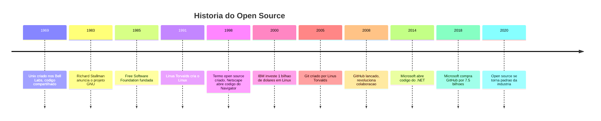
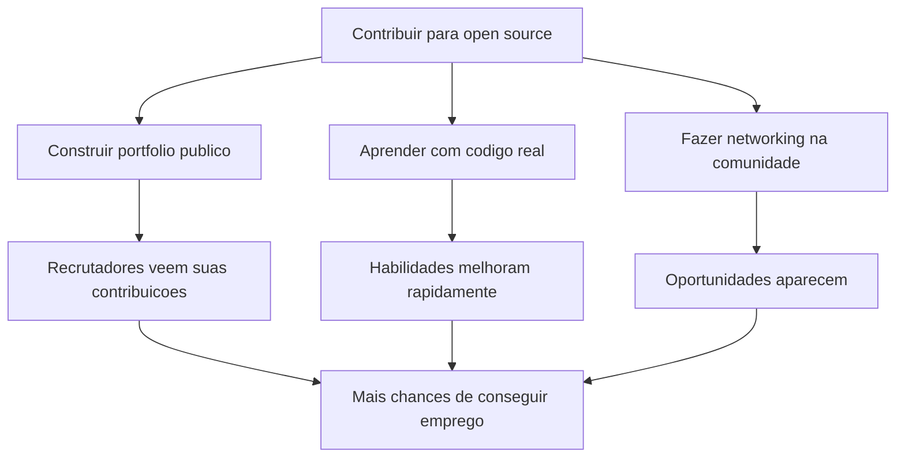
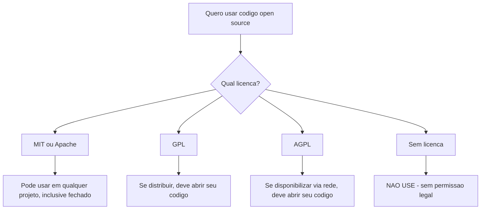
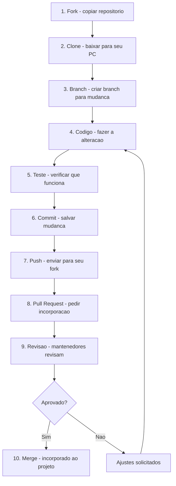

# 12.5 — Open Source: Código Aberto, Comunidades e Licenças

[← Anterior: Projetos Digitais](cap12-mod04-projetos-digitais.md) · [Próximo: LGPD e Dados Sensíveis →](cap12-mod06-lgpd-dados-sensiveis.md)

---

## Introdução

No módulo anterior, falamos sobre como transformar ideias em projetos. Mas nem todo software precisa ser construído do zero. Na verdade, a maior parte do software que roda no mundo hoje é construída sobre uma base enorme de código que está disponível gratuitamente para qualquer pessoa usar, estudar, modificar e distribuir. Esse código se chama **open source** — código aberto.

O Linux que você aprendeu no capítulo 2? Open source. O Python que você usou no capítulo 5? Open source. O Git que você aprendeu no capítulo 4? Open source. O Docker do capítulo 6? Open source. O SQLite do capítulo 8? Open source. O FastAPI do capítulo 11? Open source. Praticamente todas as ferramentas que você usou neste curso existem porque alguém decidiu compartilhar seu código com o mundo.

Open source não é apenas uma forma de distribuir software — é uma filosofia, uma comunidade e um ecossistema que transformou a indústria de tecnologia. Neste módulo, vamos entender o que é open source, como surgiu, como funciona, como contribuir, e um tema fundamental que muitos desenvolvedores ignoram: as licenças de software.

Entender open source é essencial para qualquer desenvolvedor por três razões:

1. **Você já usa open source todos os dias** — praticamente todas as ferramentas deste curso são open source
2. **Contribuir para open source é a melhor forma de crescer como desenvolvedor** — você aprende com código real, recebe feedback de profissionais experientes, e constrói um portfólio público
3. **Ignorar licenças pode ter consequências legais sérias** — usar código sem respeitar sua licença é violação de direitos autorais

Não se preocupe se o tema parece complexo — vamos construir o entendimento passo a passo, como sempre.

---

## A História: Do Software Livre ao Open Source

Para entender open source, precisamos voltar aos anos 1970 e 1980, quando o software começou a se tornar um produto comercial. Essa história é fascinante porque mostra como ideias sobre liberdade, colaboração e pragmatismo moldaram a indústria que conhecemos hoje.

Nos primeiros anos da computação, software era compartilhado livremente. Pesquisadores e programadores trocavam código como cientistas trocam artigos — era parte da cultura acadêmica. O sistema operacional Unix, criado nos Bell Labs em 1969, era distribuído com código-fonte para universidades.

Mas nos anos 1980, empresas começaram a fechar o código. O software passou a ser vendido como produto, e o código-fonte se tornou segredo comercial. Você comprava o programa, mas não podia ver como funcionava, não podia modificá-lo, não podia compartilhá-lo.

### Richard Stallman e o Software Livre

Em 1983, Richard Stallman, um programador do MIT, ficou frustrado com essa mudança. Ele não conseguia mais modificar o software da impressora do laboratório porque o código era fechado. Para Stallman, isso era uma questão de liberdade — não de preço.

Em 1985, Stallman fundou a **Free Software Foundation** (FSF) e definiu as quatro liberdades do software livre:

| Liberdade | O que significa |
|-----------|----------------|
| Liberdade 0 | Usar o programa para qualquer proposito |
| Liberdade 1 | Estudar como o programa funciona e adapta-lo |
| Liberdade 2 | Redistribuir copias para ajudar outros |
| Liberdade 3 | Melhorar o programa e distribuir as melhorias |

A palavra "free" em inglês é ambígua — pode significar "livre" ou "grátis". Stallman sempre enfatizou: "Free as in freedom, not as in free beer" (Livre como em liberdade, não como em cerveja grátis). Software livre é sobre liberdade, não sobre preço. Você pode cobrar por software livre — desde que mantenha as quatro liberdades.

### Linus Torvalds e o Linux

Em 1991, Linus Torvalds, um estudante finlandês de 21 anos, criou o Linux — um kernel de sistema operacional inspirado no Unix, distribuído como software livre. O Linux se tornou o exemplo mais bem-sucedido de software livre da história, e hoje roda em praticamente todos os servidores da internet, em todos os smartphones Android, e em supercomputadores.

A história do Linux é fascinante porque mostra o poder da colaboração aberta. Torvalds escreveu a primeira versão sozinho, mas rapidamente outros desenvolvedores começaram a contribuir. Hoje, o kernel Linux tem mais de 20.000 contribuidores de mais de 1.700 empresas. Cada nova versão do kernel tem contribuições de centenas de desenvolvedores — é o maior projeto colaborativo da história da humanidade.

### O Impacto do GitHub

Em 2008, Tom Preston-Werner, Chris Wanstrath e PJ Hyett lançaram o GitHub — uma plataforma que tornava a colaboração em código open source dramaticamente mais fácil. Antes do GitHub, contribuir para um projeto open source exigia conhecimento de ferramentas complexas (mailing lists, patches por e-mail, sistemas de revisão arcaicos). O GitHub simplificou tudo com uma interface web intuitiva, o conceito de "fork" com um clique, e pull requests visuais.

O impacto foi transformador:
- O número de projetos open source explodiu (de milhares para milhões)
- Contribuir se tornou acessível para iniciantes
- Empresas começaram a publicar código abertamente
- O perfil do GitHub se tornou um "currículo" para desenvolvedores

Em 2018, a Microsoft comprou o GitHub por 7,5 bilhões de dólares — um sinal claro de que open source havia se tornado central para a indústria. Hoje, o GitHub tem mais de 100 milhões de desenvolvedores e mais de 300 milhões de repositórios.

### O Termo "Open Source"

Em 1998, um grupo de desenvolvedores — incluindo Eric Raymond e Bruce Perens — criou o termo **open source** como alternativa a "software livre". A motivação era pragmática: o termo "free software" confundia empresas (que pensavam em "grátis"), e o discurso de Stallman sobre liberdade era visto como radical demais pelo mundo corporativo.

O momento catalisador foi a decisão da Netscape de abrir o código do seu navegador Navigator em janeiro de 1998. Eric Raymond, autor do influente ensaio "The Cathedral and the Bazaar" (1997), argumentou que o modelo de desenvolvimento aberto (o "bazar") produzia software melhor do que o modelo fechado e hierárquico (a "catedral"). O ensaio de Raymond influenciou diretamente a decisão da Netscape e se tornou um dos textos mais importantes da história do open source.

Open source mantém os mesmos princípios práticos (código aberto, liberdade de uso e modificação), mas com uma mensagem mais focada em benefícios técnicos e de negócio: código aberto produz software melhor porque mais pessoas podem revisar, testar e melhorar.

### A Tensão entre Software Livre e Open Source

Existe uma tensão filosófica entre os movimentos de software livre e open source que persiste até hoje:

- **Software livre** (Stallman): foco em liberdade e ética. O código deve ser livre porque é um direito moral. Usar software proprietário é eticamente errado.
- **Open source** (Raymond, Perens): foco em pragmatismo e qualidade. O código deve ser aberto porque produz software melhor. Não há julgamento moral sobre software proprietário.

Na prática, a maioria dos desenvolvedores não se preocupa com essa distinção filosófica — usa software open source porque é bom, gratuito e tem comunidade ativa. Mas entender a tensão ajuda a compreender debates sobre licenças e governança que surgem regularmente na comunidade.

Hoje, os termos "software livre" e "open source" são frequentemente usados juntos como **FOSS** (Free and Open Source Software) ou **FLOSS** (Free/Libre and Open Source Software).

---

## Por que Open Source Funciona?

Pode parecer contraintuitivo: por que alguém trabalharia de graça em software que outros vão usar? A realidade é mais complexa e interessante do que "trabalho voluntário":

### Motivações Individuais

Por que desenvolvedores contribuem para open source sem receber pagamento direto? As motivações são variadas e frequentemente se sobrepõem:

- **Aprendizado**: contribuir para projetos open source é uma das melhores formas de aprender programação com código real. Você lê código escrito por desenvolvedores experientes, recebe feedback em code reviews, e enfrenta problemas reais — não exercícios acadêmicos.

- **Portfólio**: suas contribuições são públicas e demonstram suas habilidades para empregadores. Um perfil ativo no GitHub com contribuições reais vale mais do que qualquer certificado ou diploma.

- **Comunidade**: fazer parte de uma comunidade de desenvolvedores que compartilham interesses é motivador e enriquecedor. Muitas amizades e parcerias profissionais nascem em comunidades open source.

- **Resolver o próprio problema**: muitas contribuições nascem de alguém que precisava de uma funcionalidade que não existia. Em vez de criar uma solução privada, a pessoa contribui para o projeto e todos se beneficiam.

- **Reputação**: contribuidores reconhecidos são respeitados na comunidade e têm mais oportunidades profissionais. Mantenedores de projetos populares são frequentemente recrutados por empresas de tecnologia.

- **Satisfação pessoal**: saber que seu código é usado por milhares ou milhões de pessoas é gratificante. É uma forma de impactar o mundo positivamente através do seu trabalho.

- **Reciprocidade**: muitos desenvolvedores contribuem porque se beneficiam de open source diariamente. É uma forma de "devolver" para a comunidade que tanto lhes deu.

Uma pesquisa do GitHub (2017) com mais de 5.500 contribuidores open source revelou que as motivações mais citadas eram: usar open source no trabalho (86%), aprender e melhorar habilidades (80%), e diversão e prazer (78%). Apenas 28% citaram compensação financeira como motivação.

### Motivações Empresariais

Grandes empresas investem pesadamente em open source — não por altruísmo, mas por estratégia:

- **Google** mantém Android, Kubernetes, TensorFlow, Go e centenas de outros projetos
- **Meta** mantém React, PyTorch e muitos outros
- **Microsoft** mantém VS Code, TypeScript, .NET e é o maior contribuidor do GitHub
- **Red Hat** (IBM) construiu um negócio bilionário vendendo suporte para Linux

Por que empresas investem em open source?

| Razao | Explicacao |
|-------|-----------|
| Redução de custos | Compartilhar o custo de desenvolvimento com a comunidade |
| Atracao de talentos | Desenvolvedores querem trabalhar em projetos open source |
| Padronizacao | Se seu projeto se torna o padrão, você tem vantagem competitiva |
| Qualidade | Mais olhos no código significa menos bugs |
| Inovacao | A comunidade contribui com ideias e melhorias que a empresa não teria sozinha |
| Confianca | Clientes confiam mais em software que podem inspecionar |

### A Revolução Corporativa do Open Source

A relação entre empresas e open source mudou drasticamente ao longo dos anos:

**Anos 1990-2000**: Empresas viam open source como ameaça. Steve Ballmer, CEO da Microsoft, chamou Linux de "câncer" em 2001. Empresas de software proprietário lutavam ativamente contra o open source.

**Anos 2010**: A percepção mudou completamente. Empresas perceberam que open source não era ameaça — era oportunidade. A Microsoft, que antes combatia Linux, se tornou o maior contribuidor do GitHub. Em 2018, comprou o GitHub por 7,5 bilhões de dólares.

**Anos 2020**: Open source é o padrão. Praticamente toda empresa de tecnologia usa e contribui para open source. Não usar open source é a exceção, não a regra.

Essa transformação é uma das maiores mudanças culturais da história da tecnologia. Em 20 anos, open source passou de "ameaça radical" para "fundação da indústria".

### O Ecossistema de Pacotes

Uma das maiores contribuições do open source é o ecossistema de pacotes — repositórios centralizados onde desenvolvedores publicam e compartilham bibliotecas reutilizáveis:

| Ecossistema | Linguagem | Pacotes disponiveis | Gerenciador |
|------------|-----------|-------------------|-------------|
| PyPI | Python | 500.000+ | pip |
| npm | JavaScript | 2.000.000+ | npm, yarn |
| NuGet | C# e .NET | 350.000+ | dotnet |
| crates.io | Rust | 130.000+ | cargo |
| Maven Central | Java | 500.000+ | Maven, Gradle |
| RubyGems | Ruby | 170.000+ | gem |

Esses ecossistemas são o que torna o desenvolvimento moderno tão produtivo. Em vez de escrever tudo do zero, você instala pacotes que resolvem problemas comuns — autenticação, manipulação de datas, conexão com banco de dados, geração de PDFs. Cada pacote é um projeto open source mantido por alguém.

O lado negativo é a dependência: um projeto típico pode ter centenas de dependências diretas e indiretas. Se uma dessas dependências tem um bug ou vulnerabilidade, todos os projetos que a usam são afetados. É o problema de supply chain que mencionamos na seção de segurança.

### O Impacto Econômico do Open Source

Estudos estimam que o valor do software open source existente, se tivesse que ser recriado do zero, seria de trilhões de dólares. Um estudo da Harvard Business School (2024) estimou que o valor de reposição do open source seria de 8,8 trilhões de dólares.

Para colocar em perspectiva: se todo o software open source desaparecesse amanhã, a internet pararia de funcionar. Servidores web (Linux, Nginx, Apache), bancos de dados (PostgreSQL, MySQL, Redis), linguagens de programação (Python, JavaScript, Go), frameworks (React, Django, Spring), ferramentas de desenvolvimento (Git, Docker, Kubernetes) — tudo é open source.

Empresas que usam open source sem contribuir de volta estão, de certa forma, se beneficiando de um bem público sem pagar por ele. Esse é um dos argumentos para que empresas contribuam ativamente — não apenas por altruísmo, mas por responsabilidade com o ecossistema que sustenta seus negócios.

### O Modelo de Negócio do Open Source

Uma pergunta comum é: "Se o código é grátis, como empresas ganham dinheiro?" A resposta é que o código é apenas uma parte do valor. Empresas open source vendem:

- **Suporte e consultoria**: Red Hat fatura bilhões vendendo suporte para Linux. Empresas pagam por garantia de que alguém vai resolver problemas rapidamente.
- **Versão enterprise**: GitLab, Elastic e MongoDB oferecem versões gratuitas com funcionalidades básicas e versões pagas com funcionalidades avançadas (segurança, escalabilidade, suporte).
- **Cloud hosting**: muitas empresas oferecem o software open source como serviço gerenciado na cloud. Você não precisa instalar e manter — paga para que alguém faça isso por você.
- **Treinamento e certificação**: empresas como Linux Foundation e Red Hat vendem cursos e certificações.
- **Funcionalidades complementares**: o core é open source, mas plugins, integrações e ferramentas de gestão são pagos.

O modelo mais comum hoje é o **Open Core**: o núcleo do software é open source (atraindo comunidade e adoção), e funcionalidades enterprise são pagas (gerando receita).

---

## Governança de Projetos Open Source

Projetos open source precisam de governança — regras sobre quem decide o quê, como conflitos são resolvidos, e como o projeto evolui. Sem governança clara, projetos podem se fragmentar ou morrer.

### Modelos de Governança

| Modelo | Como funciona | Exemplo |
|--------|-------------|---------|
| BDFL - Benevolent Dictator For Life | Uma pessoa toma todas as decisoes finais | Python - Guido van Rossum ate 2018, Linux - Linus Torvalds |
| Meritocracia | Quem contribui mais ganha mais influencia | Apache Foundation |
| Comite | Grupo eleito ou nomeado toma decisoes | Node.js Technical Steering Committee |
| Corporativo | Uma empresa controla o projeto | Android - Google, React - Meta |
| Fundacao | Organizacao sem fins lucrativos governa o projeto | Linux Foundation, Apache Foundation, CNCF |

### O Papel das Fundações

Fundações open source existem para dar estabilidade e neutralidade a projetos importantes:

- **Linux Foundation**: governa Linux, Kubernetes, Node.js e centenas de outros projetos. Tem mais de 1.000 empresas membros.
- **Apache Software Foundation**: governa mais de 350 projetos incluindo Kafka, Spark, Hadoop. Usa um modelo de governança baseado em mérito.
- **Cloud Native Computing Foundation (CNCF)**: governa projetos de cloud native como Kubernetes, Prometheus, Envoy.
- **Python Software Foundation**: governa Python e seu ecossistema.

Fundações garantem que nenhuma empresa controla sozinha um projeto crítico. Se a empresa que criou o projeto perder interesse, a fundação garante continuidade.

### Forks: Quando a Comunidade Diverge

Às vezes, a comunidade de um projeto diverge sobre a direção a seguir. Quando isso acontece, pode ocorrer um **fork** — uma cópia do projeto que segue um caminho independente.

Forks famosos:

| Fork | Projeto original | Motivo |
|------|-----------------|--------|
| LibreOffice | OpenOffice | Oracle comprou Sun e a comunidade nao confiava na Oracle |
| MariaDB | MySQL | Oracle comprou Sun e a comunidade temia que MySQL fosse fechado |
| OpenSearch | Elasticsearch | AWS criou fork apos Elastic mudar licenca |
| io.js | Node.js | Comunidade queria governanca mais aberta |
| Nextcloud | ownCloud | Fundador saiu e criou versao com governanca comunitaria |

Forks são um mecanismo de segurança do open source: se o mantenedor tomar decisões que a comunidade não aceita, a comunidade pode criar sua própria versão. Isso incentiva mantenedores a ouvir a comunidade.

---

## Open Source e sua Carreira

Para um desenvolvedor iniciante, open source oferece oportunidades únicas:

### Portfólio Público

Suas contribuições open source são visíveis para qualquer empregador. Um perfil ativo no GitHub com contribuições reais vale mais do que qualquer certificado. Recrutadores e gerentes de contratação frequentemente olham o GitHub de candidatos para avaliar:

- Qualidade do código
- Capacidade de trabalhar em equipe (code reviews, discussões em issues)
- Consistência (contribuições regulares vs esporádicas)
- Comunicação (mensagens de commit, descrições de PRs)

### Aprendizado Acelerado

Contribuir para projetos open source expõe você a:
- Código escrito por desenvolvedores experientes
- Padrões e práticas de projetos reais
- Code review por pessoas que sabem mais que você
- Problemas reais que afetam usuários reais

É como um estágio gratuito em dezenas de empresas ao mesmo tempo.

### Networking

A comunidade open source é global e conectada. Contribuidores ativos conhecem outros contribuidores, são convidados para conferências, e têm acesso a oportunidades que não aparecem em sites de emprego.

### Primeiro Emprego

Muitas empresas contratam diretamente de suas comunidades open source. Se você contribui ativamente para um projeto que uma empresa usa, você já demonstrou que sabe trabalhar com o código deles, que entende o domínio, e que sabe colaborar. É a melhor entrevista de emprego possível — sem a pressão de uma entrevista formal.

---

## Licenças de Software: As Regras do Jogo

Este é um dos temas mais importantes e mais ignorados por desenvolvedores iniciantes. Quando alguém pública código open source, ele não está dizendo "faça o que quiser". Ele está dizendo "você pode usar, mas sob estas condições". Essas condições são definidas pela **licença** do software.

Usar código sem respeitar sua licença é ilegal — é violação de direitos autorais. Empresas já foram processadas por isso. Desenvolvedores já perderam empregos por isso. É um tema sério.

### Por que Licenças Existem?

Por padrão, todo código que alguém escreve é protegido por direitos autorais. Se você escreve um programa e não coloca nenhuma licença, ninguém tem permissão legal para usar, copiar ou modificar seu código — mesmo que ele esteja público no GitHub.

Licenças existem para dar permissões explícitas: "Eu, autor deste código, autorizo você a usá-lo sob estas condições."

### As Principais Licenças

Existem dezenas de licenças open source, mas a maioria dos projetos usa uma destas:

#### Licenças Permissivas

Licenças permissivas dão muita liberdade: você pode usar o código para qualquer coisa, inclusive em software comercial fechado. A principal exigência é manter o aviso de copyright.

**MIT License**: a mais popular e simples. Basicamente diz: "Faça o que quiser, mas mantenha o aviso de copyright e não me culpe se der problema." Usada por React, Node.js, jQuery, Rails e milhares de outros projetos.

**Apache License 2.0**: similar à MIT, mas inclui uma concessão explícita de patentes — se o autor tem patentes relacionadas ao código, ele autoriza você a usá-las. Usada por Android, Kubernetes, TensorFlow.

**BSD License**: uma das mais antigas, similar à MIT. Existe em variantes de 2 e 3 cláusulas. Usada por FreeBSD, Nginx (originalmente).

#### Licenças Copyleft

Licenças copyleft têm uma condição adicional: se você modificar o código e distribuir a versão modificada, deve distribuir sob a mesma licença. Isso garante que o código permanece aberto — ninguém pode pegar código copyleft, modificar e fechar.

**GPL (GNU General Public License)**: a licença copyleft mais famosa, criada por Richard Stallman. Se você usa código GPL no seu programa e distribui o programa, deve disponibilizar o código-fonte do programa inteiro sob GPL. Usada pelo Linux, GCC, WordPress.

**LGPL (Lesser GPL)**: versão mais branda da GPL. Permite que software proprietário use bibliotecas LGPL sem precisar abrir o código do software inteiro — apenas as modificações na biblioteca devem ser abertas.

**AGPL (Affero GPL)**: versão mais restritiva da GPL. Inclui uso via rede — se você roda software AGPL em um servidor e usuários acessam pela internet, deve disponibilizar o código-fonte. Usada por MongoDB (versões antigas).

#### Comparação

| Licença | Pode usar comercialmente | Precisa abrir código | Precisa manter copyright | Concessao de patentes |
|---------|------------------------|---------------------|-------------------------|---------------------|
| MIT | Sim | Não | Sim | Não explicita |
| Apache 2.0 | Sim | Não | Sim | Sim |
| GPL | Sim | Sim, se distribuir | Sim | Sim |
| LGPL | Sim | Só modificacoes na lib | Sim | Sim |
| AGPL | Sim | Sim, inclusive via rede | Sim | Sim |

### Licenças na Prática: Casos Reais

A importância de entender licenças fica clara quando olhamos para casos reais:

**MongoDB e a SSPL (2018)**: O MongoDB mudou sua licença de AGPL para SSPL (Server Side Public License) para impedir que provedores de cloud (como AWS) oferecessem MongoDB como serviço sem contribuir de volta. A mudança gerou controvérsia — a SSPL é tão restritiva que a Open Source Initiative não a reconhece como open source.

**Redis e o Commons Clause (2018)**: O Redis adicionou o "Commons Clause" à sua licença, proibindo que empresas vendessem Redis como serviço. Isso gerou debate sobre o que significa "open source" quando há restrições comerciais.

**Elastic vs AWS (2021)**: A Elastic (criadora do Elasticsearch) mudou sua licença para impedir que a AWS oferecesse Elasticsearch como serviço. A AWS respondeu criando o OpenSearch, um fork do Elasticsearch sob licença Apache 2.0. Esse caso ilustra como licenças afetam a dinâmica do ecossistema.

Esses casos mostram que licenças não são apenas formalidades legais — são decisões estratégicas que afetam comunidades, empresas e o futuro dos projetos.

### Como Escolher uma Licença

Se você está criando um projeto open source:

- Quer máxima adoção, inclusive por empresas? **MIT** ou **Apache 2.0**
- Quer garantir que o código permaneça aberto? **GPL**
- Está criando uma biblioteca que quer que todos usem? **MIT** ou **LGPL**
- Está criando um serviço web e quer que modificações sejam compartilhadas? **AGPL**

Se você está usando código open source:

- Sempre leia a licença antes de usar
- MIT e Apache: pode usar em quase qualquer contexto
- GPL: cuidado — pode exigir que você abra seu código
- Sem licença: não use — legalmente, você não tem permissão

### Licenças na Prática do Dia a Dia

Como desenvolvedor, você vai lidar com licenças constantemente — mesmo que não perceba. Toda vez que você instala um pacote com `pip install`, `npm install` ou `dotnet add package`, está usando código com uma licença.

Na prática, o que você precisa saber:

**Para projetos pessoais e de estudo**: use o que quiser. Licenças só importam quando você distribui software.

**Para projetos da empresa**: consulte a política da empresa. A maioria das empresas tem uma lista de licenças aprovadas (geralmente MIT, Apache, BSD) e proibidas (geralmente GPL, AGPL). Se não tem política, sugira criar uma.

**Para seu próprio projeto open source**: escolha MIT se quer máxima adoção, GPL se quer garantir que o código permaneça aberto. Na dúvida, MIT é a escolha mais segura e popular.

**Ferramentas de verificação**: existem ferramentas que verificam automaticamente as licenças de todas as suas dependências:
- `license-checker` para npm
- `pip-licenses` para Python
- `dotnet-project-licenses` para .NET

Essas ferramentas são especialmente úteis em empresas, onde usar uma dependência com licença incompatível pode ter consequências legais.

### O Caso Especial do Domínio Público

Além das licenças open source, existe o conceito de **domínio público** — quando o autor renuncia a todos os direitos sobre o código. A licença mais conhecida para isso é a **CC0** (Creative Commons Zero) e a **Unlicense**.

Código em domínio público pode ser usado para absolutamente qualquer coisa, sem nenhuma restrição. SQLite, por exemplo, é domínio público — não tem licença, porque o autor renunciou a todos os direitos.

---

## Open Source no Brasil

O Brasil tem uma comunidade open source ativa e crescente:

- **Governo Federal**: o governo brasileiro tem uma política de preferência por software livre em órgãos públicos, formalizada desde 2003. O Portal do Software Público Brasileiro disponibiliza dezenas de sistemas open source desenvolvidos por órgãos governamentais.

- **Comunidades**: existem comunidades ativas de Python (Python Brasil), Linux (diversas), PHP, JavaScript e outras tecnologias, com conferências anuais e meetups regulares.

- **Empresas**: empresas brasileiras como Nubank, iFood, Mercado Livre e VTEX contribuem ativamente para projetos open source e publicam seus próprios projetos.

- **Educação**: muitas universidades brasileiras usam software livre em seus cursos e laboratórios, e incentivam alunos a contribuir para projetos open source como parte da formação.

Para um desenvolvedor brasileiro iniciante, participar da comunidade open source local é uma excelente forma de fazer networking, aprender e encontrar oportunidades. Conferências como Python Brasil, PHP Conference Brasil e BrazilJS são eventos acessíveis e acolhedores para iniciantes.

---

## Como Contribuir para Open Source

Contribuir para projetos open source é uma das melhores formas de crescer como desenvolvedor. E contribuir não significa necessariamente escrever código complexo.

### Formas de Contribuir

Muitos iniciantes pensam que contribuir para open source significa escrever código complexo. Na verdade, as contribuições mais valorizadas por mantenedores são frequentemente as mais simples:

| Tipo de contribuição | Exemplo | Nível de dificuldade | Valor para o projeto |
|---------------------|---------|---------------------|---------------------|
| Reportar bugs | Encontrou um problema? Abra uma issue descrevendo | Iniciante | Alto - bugs reportados bem sao ouro |
| Melhorar documentação | Corrigir erros, adicionar exemplos, traduzir | Iniciante | Muito alto - documentacao e sempre carente |
| Responder perguntas | Ajudar outros usuarios em issues e foruns | Iniciante a intermediario | Alto - alivia carga dos mantenedores |
| Corrigir bugs simples | Typos no código, erros de formatacao | Iniciante | Medio |
| Adicionar testes | Escrever testes para código existente | Intermediario | Muito alto - testes sao sempre bem-vindos |
| Corrigir bugs complexos | Investigar e corrigir problemas reais | Intermediario a avancado | Muito alto |
| Implementar funcionalidades | Adicionar features solicitadas pela comunidade | Avancado | Alto |
| Revisar código | Revisar pull requests de outros contribuidores | Avancado | Muito alto - poucos fazem isso |
| Triagem de issues | Classificar, priorizar e organizar issues | Qualquer nivel | Alto - mantenedores adoram ajuda com triagem |
| Design e UX | Melhorar interfaces, criar icones, redesenhar fluxos | Qualquer nivel | Alto - muitos projetos carecem de design |

### Sua Primeira Contribuição: Um Guia Prático

Se você nunca contribuiu para open source, aqui está um caminho passo a passo:

**Etapa 1 — Explorar**
- Crie uma conta no GitHub (se ainda não tem)
- Explore projetos que você usa e gosta
- Leia o README e o CONTRIBUTING.md de 3-5 projetos
- Observe como as issues e PRs são escritas

**Etapa 2 — Escolher**
- Procure issues com label "good first issue" em projetos que te interessam
- Escolha uma issue que pareça acessível
- Leia o código relacionado à issue para entender o contexto
- Comente na issue dizendo que quer trabalhar nela

**Etapa 3 — Contribuir**
- Faça fork e clone do repositório
- Crie um branch para sua mudança
- Implemente a solução (pode ser pequena — um typo, uma melhoria na doc)
- Teste localmente
- Faça commit e push
- Abra um Pull Request com descrição clara

**Etapa 4 — Iterar**
- Responda ao feedback dos revisores
- Faça ajustes se solicitados
- Quando aprovado, celebre — você é um contribuidor open source!

Não se preocupe se sua primeira contribuição for pequena. Todo mundo começa assim. O importante é dar o primeiro passo.

### Código de Conduta

A maioria dos projetos open source adota um **Código de Conduta** (Code of Conduct) — um documento que define comportamentos aceitáveis e inaceitáveis na comunidade. O mais comum é o Contributor Covenant, adotado por projetos como Linux, Kubernetes, Rails e milhares de outros.

O Código de Conduta existe para garantir que a comunidade seja acolhedora e segura para todos — independente de gênero, orientação sexual, etnia, religião, experiência ou qualquer outra característica. Assédio, discriminação e comportamento tóxico não são tolerados.

Como contribuidor, respeitar o Código de Conduta é obrigatório. Como membro da comunidade, reportar violações é encorajado. Comunidades saudáveis produzem software melhor.

### O Fluxo de Contribuição

A maioria dos projetos open source segue um fluxo parecido:

1. **Fork**: crie uma cópia do repositório na sua conta do GitHub
2. **Clone**: baixe a cópia para seu computador
3. **Branch**: crie um branch para sua mudança
4. **Mudança**: faça a alteração no código
5. **Teste**: verifique que sua mudança funciona e não quebra nada
6. **Commit**: salve a mudança com uma mensagem descritiva
7. **Push**: envie para seu fork no GitHub
8. **Pull Request**: peça para o projeto original incorporar sua mudança
9. **Revisão**: mantenedores revisam, pedem ajustes se necessário
10. **Merge**: sua contribuição é incorporada ao projeto

### Etiqueta em Projetos Open Source

Projetos open source são comunidades, e comunidades têm normas sociais:

- Leia o arquivo CONTRIBUTING.md antes de contribuir — ele explica as regras do projeto
- Seja respeitoso e construtivo em todas as interações
- Não exija que mantenedores aceitem sua contribuição — eles são voluntários
- Aceite feedback com humildade — revisões de código são oportunidades de aprendizado
- Comece pequeno — sua primeira contribuição não precisa ser uma feature enorme

---

## Inner Source: Open Source Dentro da Empresa

Um conceito que ganhou força nos últimos anos é o **Inner Source** — aplicar as práticas de open source dentro de uma empresa. Em vez de cada equipe trabalhar isoladamente em seus repositórios privados, o código é compartilhado internamente e qualquer equipe pode contribuir para qualquer projeto.

Os benefícios são os mesmos do open source: mais olhos no código, menos duplicação de esforço, melhor qualidade, e mais colaboração entre equipes. Empresas como PayPal, Bloomberg e Bosch adotaram Inner Source com resultados positivos.

Para você como desenvolvedor, Inner Source significa que mesmo em uma empresa com código proprietário, as habilidades de contribuição open source (fork, PR, code review) são diretamente aplicáveis.

---

## Sustentabilidade de Projetos Open Source

Um desafio crescente no ecossistema open source é a sustentabilidade. Muitos projetos críticos — usados por milhões de pessoas e empresas — são mantidos por uma ou duas pessoas em seu tempo livre, sem remuneração.

O caso mais emblemático é o **Heartbleed** (2014): uma vulnerabilidade crítica no OpenSSL, biblioteca de criptografia usada por dois terços dos servidores da internet. O OpenSSL era mantido por uma equipe minúscula com orçamento anual de menos de 1 milhão de dólares — para um software que protegia trilhões de dólares em transações.

### Modelos de Sustentabilidade

| Modelo | Como funciona | Exemplo |
|--------|-------------|---------|
| Patrocinio corporativo | Empresas pagam desenvolvedores para trabalhar em projetos | Linux Foundation, Apache Foundation |
| Open core | Versão basica open source, versão enterprise paga | GitLab, Elastic, Redis |
| SaaS | Software open source oferecido como servico pago | WordPress.com, MongoDB Atlas |
| Doações | Usuarios e empresas doam voluntariamente | Wikipedia, curl |
| GitHub Sponsors | Plataforma de patrocinio direto a desenvolvedores | Milhares de projetos individuais |
| Consultoria | Mantenedores vendem consultoria e suporte | Red Hat, Canonical |
| Bounties | Empresas pagam por funcionalidades especificas | Bountysource |

A sustentabilidade de open source é um problema em aberto. Não existe solução única, e muitos projetos importantes continuam dependendo de voluntários. Como usuário e potencial contribuidor, estar ciente dessa realidade é importante — e contribuir (com código, documentação ou dinheiro) é uma forma de ajudar.

### O Problema do "Voluntário Invisível"

Existe uma ironia no open source: quanto mais bem-sucedido um projeto, mais trabalho o mantenedor tem — mas não necessariamente mais recursos. Um projeto usado por milhões de pessoas gera milhares de issues, pull requests, perguntas e pedidos de funcionalidades. Se o mantenedor é um voluntário, ele pode se sentir sobrecarregado, estressado e eventualmente abandonar o projeto.

Esse fenômeno é tão comum que tem nome: **maintainer burnout** (esgotamento do mantenedor). Muitos mantenedores de projetos populares relatam ansiedade, culpa por não responder rápido o suficiente, e frustração com usuários que exigem suporte gratuito como se fosse um direito.

Como comunidade, podemos ajudar:
- Sendo respeitosos e pacientes com mantenedores
- Contribuindo com código, documentação ou triagem de issues
- Patrocinando projetos que usamos (GitHub Sponsors, Open Collective)
- Não exigindo suporte gratuito — mantenedores não nos devem nada
- Reconhecendo e agradecendo o trabalho dos mantenedores

Lembre-se: por trás de cada `pip install` ou `npm install` existe uma pessoa (ou um pequeno grupo) que dedicou tempo e esforço para criar e manter aquele código. Reconhecer e valorizar esse trabalho é parte de ser um bom membro da comunidade.

---

## Open Source e Segurança

Existe um debate antigo: código aberto é mais seguro ou menos seguro que código fechado?

**Argumento a favor**: com o código aberto, qualquer pessoa pode inspecionar e encontrar vulnerabilidades. Mais olhos no código significa mais chances de encontrar e corrigir problemas. É o princípio de Linus: "Dados olhos suficientes, todos os bugs são superficiais."

**Argumento contra**: com o código aberto, atacantes também podem inspecionar e encontrar vulnerabilidades. E na prática, "muitos olhos" nem sempre olham — projetos populares podem ter código que ninguém revisou em anos.

A realidade é nuançada: código aberto não é automaticamente mais seguro, mas permite que seja. A segurança depende de:
- Quantas pessoas realmente revisam o código
- Qual a qualidade das revisões
- Quão rápido vulnerabilidades são corrigidas quando encontradas
- Se existem processos de segurança (auditorias, scan automatizado)

### Supply Chain Attacks

Um risco crescente é o **supply chain attack** — ataques que comprometem dependências open source para afetar todos os projetos que as usam. Em 2021, o ataque ao pacote `ua-parser-js` no npm afetou milhões de projetos JavaScript. Em 2024, a vulnerabilidade no `xz-utils` quase comprometeu a maioria dos servidores Linux do mundo.

Isso reforça a importância de:
- Verificar as dependências que você usa
- Manter dependências atualizadas
- Usar ferramentas de scan de vulnerabilidades (como Dependabot do GitHub)
- Preferir dependências bem mantidas e com comunidade ativa

---

## O Ecossistema Open Source em Números

Para dimensionar o impacto do open source:

| Metrica | Valor |
|---------|-------|
| Repositorios publicos no GitHub | 300+ milhoes |
| Desenvolvedores no GitHub | 100+ milhoes |
| Projetos na Linux Foundation | 700+ |
| Valor estimado do software open source | Trilhoes de dolares |
| Porcentagem de codigo em aplicacoes comerciais que e open source | 70-90% |
| Servidores web rodando Linux | 96%+ |
| Smartphones rodando Android - baseado em Linux | 72%+ |

Esses números mostram que open source não é um nicho — é a base da infraestrutura digital global. Quando você contribui para open source, está contribuindo para algo que afeta bilhões de pessoas.

---

## Casos de Uso no Mundo Real

### Linux: De Projeto de Estudante a Base da Internet

Em 1991, Linus Torvalds postou uma mensagem em um grupo de discussão: "Estou fazendo um sistema operacional (livre) (apenas um hobby, não será grande e profissional como o GNU)." Trinta anos depois, o Linux roda em 96% dos servidores web, em todos os smartphones Android, nos 500 supercomputadores mais rápidos do mundo, e na maioria dos dispositivos IoT. O Linux é mantido por milhares de contribuidores de centenas de empresas, coordenados por Linus Torvalds e a Linux Foundation. É o maior projeto colaborativo da história da humanidade.

### React: Facebook Abrindo o Código

Em 2013, o Facebook (agora Meta) abriu o código do React, sua biblioteca de interface de usuário. A decisão foi estratégica: ao tornar React open source, o Facebook ganhou contribuições da comunidade, atraiu desenvolvedores talentosos que queriam trabalhar com React, e estabeleceu React como padrão da indústria. Hoje, React é a biblioteca de frontend mais usada no mundo, com milhões de desenvolvedores e milhares de empresas usando.

### curl: Um Desenvolvedor, Bilhões de Dispositivos

Daniel Stenberg mantém o curl — ferramenta de linha de comando para transferência de dados — praticamente sozinho desde 1998. O curl está instalado em mais de 10 bilhões de dispositivos: computadores, smartphones, carros, TVs, geladeiras, satélites. Stenberg trabalha no curl em tempo integral graças a patrocínios, mas por muitos anos foi um projeto de tempo livre. É um exemplo tanto do poder do open source quanto dos desafios de sustentabilidade.

No próximo módulo, vamos tratar de um tema cada vez mais presente no dia a dia de quem desenvolve software: a proteção de dados pessoais. Você vai entender o que é a LGPD, por que ela existe e como ela impacta diretamente as decisões técnicas que você toma ao construir sistemas.

---

## Como a IA pode te ajudar aqui

**Prompt 1 — Praticar com projetos:**
> "Quero contribuir para um projeto open source em Python. Me ajude a encontrar projetos amigáveis para iniciantes."

**Prompt 2 — Comparar alternativas:**
> "Qual a diferença prática entre a licença MIT e a GPL? Em que situações cada uma me afeta como desenvolvedor?"

**Prompt 3 — Pedir ajuda prática:**
> "Me ajude a entender o arquivo CONTRIBUTING.md deste projeto: [cole o conteúdo]."

---

## Resumo do Módulo

| Conceito | Definição |
|----------|-----------|
| Open source | Software com código fonte disponível para uso, estudo, modificacao e distribuição |
| Software livre | Software que respeita as quatro liberdades definidas pela FSF |
| Licença de software | Documento legal que define as condições de uso do código |
| Licença permissiva | Permite uso amplo, inclusive em software fechado - MIT, Apache, BSD |
| Licença copyleft | Exige que modificacoes sejam distribuidas sob a mesma licença - GPL, AGPL |
| Fork | Copia de um repositório para desenvolvimento independente |
| Pull request | Pedido para incorporar suas mudancas ao projeto original |
| FOSS | Free and Open Source Software |
| Inner Source | Praticas de open source aplicadas dentro de uma empresa |
| Open core | Modelo de negocio com nucleo open source e funcionalidades enterprise pagas |
| Governanca | Regras sobre quem decide o que em um projeto open source |
| Supply chain attack | Ataque que compromete dependencias para afetar projetos |
| Sustentabilidade | Desafio de manter projetos open source financeiramente viaveis |
| Codigo de conduta | Documento que define comportamentos aceitaveis na comunidade |
| Dominio publico | Quando o autor renuncia a todos os direitos sobre o codigo |

---

## Glossário do Módulo

| Termo | Definição |
|-------|-----------|
| AGPL - Affero General Public License | Licença copyleft que inclui uso via rede |
| Apache License | Licença permissiva com concessao explicita de patentes |
| BSD License | Uma das licenças permissivas mais antigas |
| Contributor - Contribuidor | Pessoa que contribui para um projeto open source |
| Copyleft | Principio que exige que derivados mantenham a mesma licença |
| Copyright - Direitos autorais | Proteção legal automática sobre obras criativas, incluindo código |
| FLOSS | Free Libre and Open Source Software |
| Fork | Copia de um repositório para desenvolvimento independente |
| FOSS | Free and Open Source Software |
| FSF - Free Software Foundation | Organização fundada por Stallman para promover software livre |
| GPL - General Public License | Licença copyleft mais famosa, criada por Stallman |
| Issue | Registro de bug, sugestao ou discussao em um projeto |
| LGPL - Lesser General Public License | Versão mais branda da GPL para bibliotecas |
| Maintainer - Mantenedor | Pessoa responsável por um projeto open source |
| MIT License | Licença permissiva mais popular e simples |
| Open source | Código fonte disponível publicamente com permissão de uso |
| Pull request - PR | Pedido para incorporar mudancas ao repositório original |
| BDFL | Benevolent Dictator For Life, modelo de governanca com uma pessoa decidindo |
| Inner Source | Praticas de open source aplicadas dentro de uma empresa |
| Supply chain attack | Ataque que compromete dependencias para afetar projetos que as usam |
| Open core | Modelo de negocio com nucleo open source e funcionalidades enterprise pagas |
| SSPL | Server Side Public License, licenca restritiva criada pelo MongoDB |
| Cathedral and Bazaar | Ensaio de Eric Raymond comparando modelos de desenvolvimento |
| Heartbleed | Vulnerabilidade critica no OpenSSL descoberta em 2014 |
| Linux Foundation | Organizacao que governa Linux e centenas de projetos open source |
| Apache Foundation | Organizacao que governa mais de 350 projetos open source |
| Code of Conduct | Codigo de conduta que define comportamentos aceitaveis na comunidade |
| Contributor Covenant | Codigo de conduta mais adotado em projetos open source |
| Good first issue | Label em issues indicando que sao adequadas para iniciantes |
| Maintainer burnout | Esgotamento de mantenedores de projetos open source |
| Open Collective | Plataforma de financiamento coletivo para projetos open source |
| PyPI | Python Package Index, repositorio central de pacotes Python |
| npm | Node Package Manager, repositorio central de pacotes JavaScript |
| NuGet | Repositorio central de pacotes .NET e C# |
| CC0 | Creative Commons Zero, licenca de dominio publico |
| Unlicense | Licenca que coloca codigo em dominio publico |
| Meritocracia | Modelo de governanca onde influencia e proporcional a contribuicao |
| CNCF | Cloud Native Computing Foundation, governa Kubernetes e projetos cloud native |

---

## Na Cultura Popular

- **Revolution OS** (documentário, 2001) — Conta a história do movimento open source e software livre, com entrevistas de Linus Torvalds, Richard Stallman, Eric Raymond e outros protagonistas. Essencial para entender as motivações e debates por trás do open source. Disponível gratuitamente no YouTube.

- **The Code: Story of Linux** (documentário, 2001) — Documentário finlandês sobre a criação do Linux por Linus Torvalds e como um projeto de estudante se tornou a base da internet moderna. Mais curto e focado que Revolution OS, excelente para uma visão rápida da história.

- **Halt and Catch Fire** (série, 2014-2017) — A série mostra a tensão entre software proprietário e aberto nos anos 80 e 90, incluindo a cultura de compartilhamento de código que precedeu o movimento open source formal. Os personagens enfrentam dilemas reais sobre abrir ou fechar código.

- **The Internet's Own Boy: The Story of Aaron Swartz** (documentário, 2014) — Conta a história de Aaron Swartz, co-criador do RSS e do Reddit, ativista pela liberdade de informação e acesso aberto ao conhecimento. O documentário mostra como os ideais de abertura e compartilhamento se estendem além do código para a informação em geral.

- **Pirates of Silicon Valley / Piratas do Vale do Silício** (filme, 1999) — Embora focado em Apple e Microsoft (empresas de software proprietário), o filme mostra o contexto dos anos 70-80 que levou ao surgimento do movimento de software livre como reação ao fechamento do código.

---

## Para Saber Mais

- [Choose a License](https://choosealicense.com/) — *Guia interativo para escolher a licença certa para seu projeto, criado pelo GitHub*
- [Open Source Guide](https://opensource.guide/pt/) — *Guia completo sobre como contribuir e manter projetos open source, em português*
- [GitHub — First Contributions](https://github.com/firstcontributions/first-contributions) — *Tutorial prático para fazer sua primeira contribuição open source*
- [Revolution OS (documentário)](https://www.youtube.com/watch?v=GsHh2wfy_-4) — *Documentário completo sobre a história do open source, disponível gratuitamente*
- [The Cathedral and the Bazaar — Eric Raymond](http://www.catb.org/~esr/writings/cathedral-bazaar/) — *O ensaio que influenciou a Netscape e ajudou a criar o movimento open source*
- [Good First Issue](https://goodfirstissue.dev/) — *Agregador de issues amigáveis para iniciantes em projetos open source populares*
- [Up For Grabs](https://up-for-grabs.net/) — *Outro agregador de oportunidades para contribuir com open source*
- [Fabio Akita — Open Source](https://www.youtube.com/@Akitando) — *Canal brasileiro com vídeos profundos sobre a história e cultura do open source*

---

## Perguntas Frequentes (FAQ)

**P: Posso ganhar dinheiro com open source?**
R: Sim. Muitas empresas lucram com open source — vendendo suporte, consultoria, versões enterprise, hospedagem, ou serviços complementares. Red Hat fatura bilhões com Linux.

**P: Se o código é aberto, qualquer um pode copiar e vender?**
R: Depende da licença. Com licenças permissivas (MIT, Apache), sim. Com licenças copyleft (GPL), pode vender, mas deve manter o código aberto.

**P: Preciso ser um programador experiente para contribuir?**
R: Não. Documentação, tradução, reportar bugs e responder perguntas são contribuições valiosas que não exigem experiência avançada.

**P: O que acontece se eu usar código GPL no meu projeto comercial?**
R: Se você distribuir o software, precisa disponibilizar o código-fonte sob GPL. Isso pode ser um problema para software proprietário. Consulte um advogado se tiver dúvidas.

**P: Código no GitHub sem licença é open source?**
R: Não. Sem licença, o código é protegido por copyright padrão — ninguém tem permissão legal para usar. Sempre adicione uma licença aos seus projetos.

**P: Como sei qual licença um projeto usa?**
R: Procure o arquivo LICENSE ou LICENSE.md na raiz do repositório. O GitHub também mostra a licença na página principal do projeto.

**P: Open source significa que o software é gratuito?**
R: Geralmente sim, mas não obrigatoriamente. Open source significa que o código é aberto. O autor pode cobrar pelo software, pelo suporte, ou por funcionalidades adicionais.

**P: Posso usar código open source em projetos da empresa?**
R: Sim, mas respeite a licença. Muitas empresas têm políticas sobre quais licenças são permitidas. GPL pode ser problemática para software proprietário; MIT e Apache geralmente são aceitas.

**P: O que é um "fork" e quando devo fazer um?**
R: Fork é uma cópia do repositório. Faça um fork quando quiser contribuir (fluxo padrão) ou quando quiser criar uma versão independente do projeto com direção diferente.

**P: Como encontro projetos para contribuir?**
R: Procure por labels como "good first issue" ou "help wanted" no GitHub. Sites como goodfirstissue.dev e up-for-grabs.net listam oportunidades para iniciantes.

**P: O que é Inner Source?**
R: É a prática de aplicar princípios de open source dentro de uma empresa — código compartilhado internamente, qualquer equipe pode contribuir para qualquer projeto. Usa os mesmos fluxos (fork, PR, code review) mas com código privado.

**P: O que é a "Cathedral and the Bazaar"?**
R: É um ensaio influente de Eric Raymond (1997) que compara dois modelos de desenvolvimento: a "catedral" (desenvolvimento fechado, hierárquico, planejado) e o "bazar" (desenvolvimento aberto, descentralizado, orgânico). Raymond argumenta que o modelo bazar produz software melhor, e esse ensaio influenciou a Netscape a abrir seu código.

**P: O que é supply chain attack em open source?**
R: É quando um atacante compromete uma dependência open source para afetar todos os projetos que a usam. É um risco crescente — por isso é importante verificar dependências, mantê-las atualizadas e usar ferramentas de scan de vulnerabilidades.

**P: O que é BDFL?**
R: Benevolent Dictator For Life — modelo de governança onde uma pessoa toma todas as decisões finais. Linus Torvalds é o BDFL do Linux, e Guido van Rossum foi o BDFL do Python até 2018, quando abdicou do título.

**P: Posso criar meu próprio projeto open source?**
R: Sim, e é encorajado. Crie um repositório no GitHub, adicione uma licença (MIT é a mais simples para começar), escreva um README claro, e compartilhe. Mesmo projetos pequenos podem ser úteis para outros.

---

## Exercícios Práticos

1. **Explorando licenças**: escolha 5 ferramentas ou bibliotecas que você usou neste curso (Python, Git, Docker, SQLite, FastAPI) e descubra qual licença cada uma usa. Anote em uma tabela: nome do projeto, licença, e o que essa licença permite e proíbe. Pesquise no repositório oficial de cada projeto.

2. **Primeira contribuição simulada**: acesse o repositório [First Contributions](https://github.com/firstcontributions/first-contributions) e siga o tutorial para fazer sua primeira contribuição no GitHub. É um exercício guiado que ensina o fluxo completo de fork, clone, branch, commit e pull request. Documente cada passo que você fez.

3. **Análise de comunidade**: escolha um projeto open source que você acha interessante e analise sua comunidade: quantos contribuidores tem? Qual a frequência de commits? Tem arquivo CONTRIBUTING.md? As issues são respondidas? O projeto parece saudável e ativo? Escreva pelo menos 2 parágrafos com sua análise.

4. **Estudo de caso — Licenças**: pesquise o caso da mudança de licença do MongoDB (de AGPL para SSPL) ou do Elasticsearch (de Apache para SSPL). Descreva: (a) por que a empresa mudou a licença, (b) como a comunidade reagiu, (c) quais foram as consequências (forks, perda de contribuidores, etc.), (d) você concorda com a decisão? Justifique.

5. **Mapeando dependências**: escolha um dos projetos que você construiu no curso e liste todas as dependências open source que ele usa (direta e indiretamente). Para cada dependência, anote: nome, licença, e quantos mantenedores tem. Reflita: o que aconteceria se uma dessas dependências fosse abandonada?

---

[← Anterior: Projetos Digitais](cap12-mod04-projetos-digitais.md) · [Próximo: LGPD e Dados Sensíveis →](cap12-mod06-lgpd-dados-sensiveis.md)
