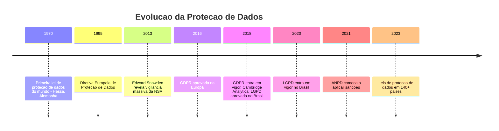
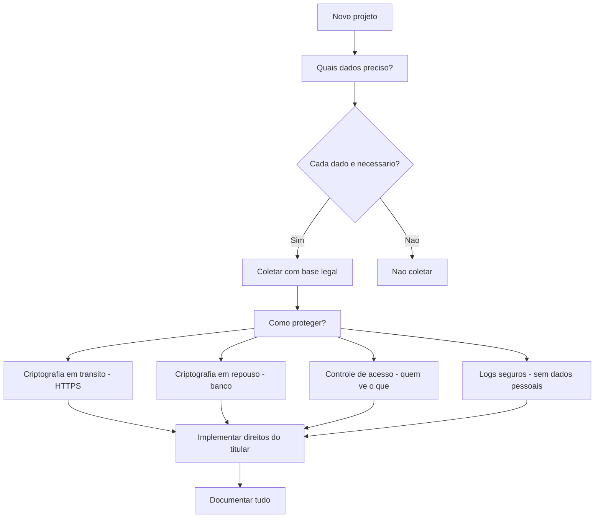
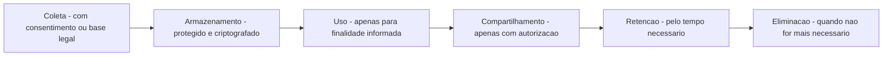
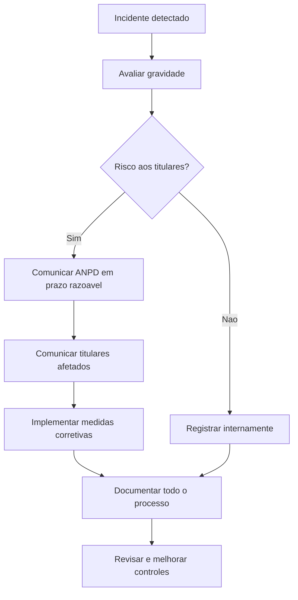

# 12.6 — LGPD e Dados Sensíveis: A Responsabilidade de Quem Constrói Software

[← Anterior: Open Source e Comunidades](cap12-mod05-open-source.md) · [Próximo: Segurança no Desenvolvimento →](cap12-mod07-seguranca.md)

---

## Introdução

No módulo anterior, falamos sobre open source — código aberto que qualquer pessoa pode ver. Agora vamos falar sobre o oposto: dados que ninguém deveria ver sem autorização. Dados pessoais, dados sensíveis, dados que pertencem a pessoas reais e que, se expostos, podem causar danos reais.

Ao longo deste curso, você aprendeu a criar programas que coletam dados (input), processam dados (lógica) e armazenam dados (banco de dados). No capítulo 8, você criou um CRUD que guarda informações. No capítulo 11, você construiu uma API que recebe e retorna dados. Mas em nenhum momento paramos para perguntar: que dados estamos coletando? Precisamos mesmo deles? O que acontece se esses dados vazarem?

Essas perguntas não são apenas técnicas — são legais e éticas. No Brasil, desde 2020, existe uma lei que regula como dados pessoais devem ser tratados: a **LGPD** (Lei Geral de Proteção de Dados). E não é só o Brasil — mais de 140 países já têm alguma forma de lei de proteção de dados, porque os abusos se tornaram grandes demais para ignorar.

A proteção de dados não é um tema "chato" ou "burocrático" — é um dos temas mais relevantes da tecnologia moderna. Cada vez que você faz login em um site, cada vez que um aplicativo pede sua localização, cada vez que você aceita cookies, dados pessoais estão sendo coletados e processados. Entender como isso funciona e quais são suas responsabilidades como desenvolvedor é fundamental.

Como desenvolvedor, você vai construir sistemas que lidam com dados de pessoas reais. Entender suas responsabilidades não é opcional — é parte fundamental da profissão.

Não se preocupe — você não precisa virar advogado. Mas precisa entender os princípios e saber aplicá-los no código que escreve. Ao final deste módulo, você vai saber o que pode e o que não pode fazer com dados pessoais, e como construir sistemas que respeitam a privacidade dos usuários.

---

## A Evolução da Proteção de Dados



---

## O Problema: Por que Precisamos de Leis sobre Dados?

Para entender por que leis como a LGPD existem, precisamos entender o que aconteceu nas últimas duas décadas.

Com a explosão da internet e dos smartphones, empresas passaram a coletar quantidades absurdas de dados sobre as pessoas: onde você está, o que compra, com quem conversa, o que pesquisa, que sites visita, quanto tempo fica em cada página, que músicas ouve, que rotas faz no trânsito.

Esses dados se tornaram extremamente valiosos — a ponto de se dizer que "dados são o novo petróleo". Empresas construíram impérios bilionários sobre a coleta e venda de dados pessoais, muitas vezes sem que as pessoas soubessem ou consentissem.

A analogia do petróleo é útil mas imperfeita. Petróleo é um recurso finito que se esgota. Dados são infinitos — cada interação gera mais dados. E diferente do petróleo, dados podem ser copiados infinitamente sem custo. Isso torna a proteção ainda mais importante: uma vez que dados vazam, não há como "desvazar".

O modelo de negócio de muitas empresas de tecnologia é baseado em dados: o serviço é "gratuito" (você não paga com dinheiro), mas você paga com seus dados. O Google sabe o que você pesquisa. O Facebook sabe com quem você se relaciona. A Amazon sabe o que você compra. O Spotify sabe o que você ouve. O Waze sabe por onde você anda. Individualmente, cada dado parece inofensivo. Juntos, pintam um retrato detalhado da sua vida.

E então vieram os escândalos:

- Em 2018, o caso **Cambridge Analytica** revelou que dados de 87 milhões de usuários do Facebook foram coletados sem consentimento e usados para influenciar eleições nos Estados Unidos e no Reino Unido.

- Vazamentos de dados se tornaram rotineiros: Yahoo (3 bilhões de contas em 2013-2014, o maior vazamento da história), Equifax (147 milhões de pessoas com dados financeiros expostos em 2017), Marriott (500 milhões de hóspedes em 2018), LinkedIn (700 milhões de perfis em 2021).

- No Brasil, vazamentos expuseram CPFs, dados bancários e informações pessoais de milhões de brasileiros. Em 2021, um megavazamento expôs dados de 223 milhões de brasileiros — mais do que a população do país.

- Empresas usavam dados para discriminação: algoritmos de crédito que negavam empréstimos com base em CEP (discriminação geográfica), sistemas de recrutamento que filtravam candidatos por gênero ou etnia, seguradoras que usavam dados de saúde para negar cobertura.

- Governos usavam dados para vigilância: as revelações de Edward Snowden em 2013 mostraram que a NSA (agência de segurança dos EUA) coletava dados de comunicações de milhões de pessoas no mundo inteiro, incluindo líderes de outros países.

O padrão era claro: sem regulamentação, dados pessoais eram tratados como recurso a ser explorado, não como direito a ser protegido. A LGPD e leis similares no mundo inteiro surgiram para mudar essa dinâmica — colocando o titular dos dados no centro e exigindo que empresas tratem dados com responsabilidade.

### O Impacto no Brasil

O Brasil tem características que tornam a proteção de dados especialmente importante:

- **Digitalização acelerada**: milhões de brasileiros entraram na internet nos últimos anos, muitos sem educação digital sobre privacidade
- **Concentração de dados**: poucos grandes bancos, operadoras e empresas de tecnologia concentram dados de grande parte da população
- **Fraudes digitais**: o Brasil é um dos países com maior incidência de fraudes online, muitas baseadas em dados pessoais vazados
- **Governo digital**: serviços públicos cada vez mais digitais (gov.br, PIX, e-SUS) concentram dados sensíveis de toda a população

A LGPD é um passo importante, mas a implementação ainda está em evolução. A ANPD começou a aplicar sanções em 2023, e a cultura de proteção de dados está se consolidando gradualmente nas empresas brasileiras.

A sociedade percebeu que precisava de regras. Não dava mais para confiar que empresas tratariam dados pessoais com responsabilidade por conta própria.

### O Contexto Global

A preocupação com proteção de dados não é exclusiva do Brasil. O mundo inteiro está regulamentando:

| Pais ou Regiao | Lei | Ano | Destaque |
|---------------|-----|-----|---------|
| Europa | GDPR | 2018 | Referencia mundial, multas de ate 4% do faturamento global |
| Brasil | LGPD | 2020 | Inspirada na GDPR, adaptada ao contexto brasileiro |
| California - EUA | CCPA | 2020 | Primeira lei estadual de privacidade nos EUA |
| China | PIPL | 2021 | Lei de protecao de dados da China |
| India | DPDPA | 2023 | Lei de protecao de dados da India |
| Argentina | LPDP | 2000 | Uma das primeiras da America Latina |

Mais de 140 países já têm alguma forma de lei de proteção de dados. A tendência é clara: privacidade de dados é um direito fundamental reconhecido globalmente.

### LGPD vs GDPR: Semelhanças e Diferenças

Como a LGPD foi inspirada na GDPR, as duas leis são muito parecidas. Mas existem diferenças importantes:

| Aspecto | LGPD - Brasil | GDPR - Europa |
|---------|-------------|--------------|
| Multa maxima | 2% do faturamento, ate R$ 50 milhoes | 4% do faturamento global, ate 20 milhoes de euros |
| Bases legais | 10 bases legais | 6 bases legais |
| DPO obrigatorio | Sim, para todos os controladores | Depende do tipo de tratamento |
| Transferencia internacional | Permitida com garantias | Permitida com garantias, mais restritiva |
| Autoridade fiscalizadora | ANPD | Autoridades nacionais de cada pais |
| Abrangencia | Dados tratados no Brasil | Dados de residentes na Europa, independente de onde tratados |

Se você trabalhar em uma empresa que atende clientes europeus, precisará cumprir a GDPR além da LGPD. Na prática, cumprir a GDPR (mais restritiva) geralmente garante conformidade com a LGPD também.

---

## LGPD: O que É e o que Muda

A **LGPD** (Lei Geral de Proteção de Dados Pessoais — Lei nº 13.709/2018) é a lei brasileira que regula a coleta, armazenamento, tratamento e compartilhamento de dados pessoais. Ela entrou em vigor em setembro de 2020 e se aplica a qualquer pessoa ou empresa que trate dados pessoais no Brasil.

A LGPD foi inspirada na **GDPR** (General Data Protection Regulation), a lei europeia de proteção de dados que entrou em vigor em 2018 e se tornou referência mundial.

### Conceitos Fundamentais

| Conceito | Definição | Exemplo |
|----------|-----------|---------|
| Dado pessoal | Qualquer informação que identifique ou possa identificar uma pessoa | Nome, CPF, e-mail, endereco, telefone, IP |
| Dado sensivel | Dado pessoal sobre origem racial, saude, religiao, opiniao politica, vida sexual, dados biometricos | Tipo sanguineo, diagnostico medico, impressao digital |
| Titular | A pessoa a quem os dados se referem | Você, o usuario do sistema |
| Controlador | Quem decide o que fazer com os dados | A empresa que coleta os dados |
| Operador | Quem processa os dados a mando do controlador | A empresa de cloud que hospeda o banco de dados |
| Tratamento | Qualquer operação com dados pessoais | Coletar, armazenar, consultar, compartilhar, deletar |
| ANPD | Autoridade Nacional de Proteção de Dados | Órgão que fiscaliza o cumprimento da LGPD |

### Princípios da LGPD

A LGPD estabelece 10 princípios que devem guiar todo tratamento de dados pessoais:

| Principio | O que significa | Impacto no desenvolvimento |
|-----------|----------------|---------------------------|
| Finalidade | Dados so podem ser coletados para um proposito específico e informado | Não colete dados sem saber para que servem |
| Adequacao | O tratamento deve ser compatível com a finalidade informada | Não use dados de compras para enviar propaganda politica |
| Necessidade | Colete apenas o mínimo necessário | Se não precisa do CPF, não peca |
| Livre acesso | O titular pode consultar seus dados gratuitamente | Implemente função de consulta de dados |
| Qualidade | Dados devem ser exatos e atualizados | Permita que o usuario corrija seus dados |
| Transparência | O titular deve saber como seus dados são tratados | Tenha politica de privacidade clara |
| Segurança | Dados devem ser protegidos contra acessos não autorizados | Criptografia, controle de acesso, logs |
| Prevenção | Adote medidas para prevenir danos | Testes de segurança, auditorias |
| Não discriminacao | Dados não podem ser usados para discriminar | Não use dados sensiveis para negar servicos |
| Responsabilizacao | Quem trata dados deve demonstrar conformidade | Documente suas práticas, mantenha registros |

### Bases Legais

A LGPD define que dados pessoais só podem ser tratados se houver uma base legal — uma justificativa prevista em lei. As principais são:

| Base legal | Quando se aplica | Exemplo |
|-----------|-----------------|---------|
| Consentimento | O titular concordou explicitamente | Usuario aceita termos de uso |
| Obrigacao legal | A lei exige o tratamento | Empresa guarda dados fiscais por 5 anos |
| Execução de contrato | Necessário para cumprir um contrato | Loja precisa do endereco para entregar |
| Interesse legitimo | O controlador tem interesse justificavel | Empresa analisa dados para prevenir fraudes |
| Proteção da vida | Necessário para proteger a vida do titular | Hospital acessa dados em emergência |

### Consentimento: A Base Legal Mais Conhecida (e Mais Mal Usada)

Consentimento é a base legal mais conhecida, mas não é a única — e muitas empresas abusam dela. Pedir consentimento quando outra base legal se aplica é desnecessário e pode até ser prejudicial (porque o titular pode revogar o consentimento a qualquer momento, mesmo que o tratamento seja necessário por outra razão).

Exemplos de uso correto e incorreto de consentimento:

| Situacao | Base legal correta | Erro comum |
|----------|-------------------|------------|
| Loja precisa do endereco para entregar | Execucao de contrato | Pedir consentimento desnecessariamente |
| Empresa guarda dados fiscais por 5 anos | Obrigacao legal | Pedir consentimento que nao pode ser revogado |
| App envia newsletter | Consentimento | Enviar sem pedir, alegando interesse legitimo |
| Banco analisa transacoes para prevenir fraude | Interesse legitimo | Pedir consentimento que confunde o cliente |
| Hospital acessa prontuario em emergencia | Protecao da vida | Exigir consentimento em situacao de emergencia |

A regra prática: use consentimento quando não há outra base legal aplicável. Quando há (contrato, obrigação legal, proteção da vida), use a base legal mais específica.

### Interesse Legítimo: A Base Legal Mais Flexível (e Mais Perigosa)

O **interesse legítimo** é a base legal mais flexível — e por isso a mais perigosa. Ela permite tratar dados quando o controlador tem um interesse justificável que não prejudica os direitos do titular.

O problema é que "interesse justificável" é subjetivo. Muitas empresas usam interesse legítimo como desculpa para tratar dados sem consentimento. Para evitar abusos, a LGPD exige que o controlador faça um **teste de balanceamento**: o interesse do controlador deve ser proporcional ao impacto nos direitos do titular.

Na prática, interesse legítimo é adequado para:
- Prevenção de fraudes
- Segurança da informação
- Marketing direto para clientes existentes (com opt-out fácil)
- Melhoria de produtos com dados agregados

E NÃO é adequado para:
- Vender dados para terceiros
- Criar perfis detalhados sem conhecimento do titular
- Monitoramento invasivo de comportamento
- Tratamento de dados sensíveis

---

## O que Isso Significa para Desenvolvedores?

Como desenvolvedor, você não é advogado e não precisa decorar a lei. Mas precisa entender os princípios e aplicá-los no código que escreve. Aqui estão as implicações práticas:

### 1. Colete Apenas o Necessário

Antes de adicionar um campo no formulário ou na tabela do banco de dados, pergunte: "Preciso mesmo desse dado?" Se a resposta não for um "sim" claro, não colete.

Exemplo: um sistema de cadastro de biblioteca precisa do nome e e-mail do usuário. Precisa do CPF? Provavelmente não. Precisa da data de nascimento? Talvez, se houver regras de idade. Precisa do endereço? Só se fizer entrega.

### 2. Proteja os Dados

Dados pessoais devem ser protegidos em todas as etapas:

- **Em trânsito**: use HTTPS para toda comunicação (nunca HTTP puro)
- **Em repouso**: criptografe dados sensíveis no banco de dados
- **Em logs**: nunca registre dados pessoais em logs de sistema
- **Em backups**: backups devem ter a mesma proteção dos dados originais

### 3. Implemente Direitos do Titular

A LGPD garante direitos aos titulares dos dados. Seu sistema deve permitir:

| Direito | O que o sistema deve fazer | Complexidade de implementacao |
|---------|---------------------------|------------------------------|
| Acesso | Mostrar ao usuario quais dados você tem sobre ele | Baixa - query no banco |
| Correcao | Permitir que o usuario corrija dados incorretos | Baixa - update no banco |
| Exclusao | Deletar os dados quando o usuario pedir | Alta - deletar de todas as tabelas, backups, caches |
| Portabilidade | Exportar os dados em formato legivel - JSON, CSV | Media - criar endpoint de exportacao |
| Revogacao | Permitir que o usuario retire o consentimento | Media - parar tratamento, manter registro |
| Anonimizacao | Tornar dados nao identificaveis quando solicitado | Alta - garantir irreversibilidade |
| Informacao | Informar com quem os dados foram compartilhados | Media - manter registro de compartilhamentos |
| Oposicao | Permitir que o titular se oponha a tratamento especifico | Media - implementar opt-out granular |

### Implementação Prática dos Direitos

Na prática, implementar esses direitos requer planejamento desde o início do projeto:

**Acesso e Portabilidade**: crie um endpoint na API que retorne todos os dados do usuário em formato estruturado (JSON). Isso atende tanto o direito de acesso quanto o de portabilidade. Exemplo: `GET /api/v1/users/{id}/data-export`

**Exclusão**: este é o mais complexo. Você precisa:
1. Identificar TODAS as tabelas que contêm dados do usuário
2. Decidir o que deletar e o que anonimizar (dados fiscais podem precisar ser mantidos por obrigação legal)
3. Deletar de caches e sistemas auxiliares
4. Considerar backups — dados em backups antigos podem ser mantidos se a restauração do backup incluir processo de re-exclusão
5. Confirmar a exclusão ao titular

**Revogação de consentimento**: mantenha um registro de consentimentos com:
- Data e hora do consentimento
- Finalidade específica
- Versão dos termos aceitos
- Data e hora da revogação (se aplicável)

Quando o consentimento é revogado, o tratamento para aquela finalidade deve parar imediatamente, mas dados já tratados legalmente não precisam ser deletados (a menos que o titular peça exclusão separadamente).

### 4. Documente e Registre

Mantenha registro de:
- Quais dados você coleta e por quê
- Onde os dados são armazenados
- Quem tem acesso
- Por quanto tempo são mantidos
- Quais medidas de segurança são aplicadas

### 5. Pense em Privacidade desde o Início

O conceito de **Privacy by Design** (Privacidade desde o Projeto) significa que a proteção de dados não é algo que você adiciona depois — é algo que você considera desde o primeiro dia do projeto. Quando estiver modelando o banco de dados, pergunte: "Esses dados são necessários?" Quando estiver desenhando a API, pergunte: "Essa resposta expõe dados demais?"



### 6. Ciclo de Vida dos Dados

Dados pessoais têm um ciclo de vida que deve ser gerenciado:



Cada etapa tem responsabilidades específicas:

| Etapa | Responsabilidade do desenvolvedor |
|-------|----------------------------------|
| Coleta | Validar consentimento, coletar minimo necessario |
| Armazenamento | Criptografar, controlar acesso, fazer backup seguro |
| Uso | Garantir que dados sao usados apenas para finalidade informada |
| Compartilhamento | Verificar autorizacao, registrar com quem compartilhou |
| Retencao | Definir prazo, implementar politica de retencao |
| Eliminacao | Deletar de forma segura, inclusive de backups |

### 7. Dados em APIs

Quando você constrói uma API (como fez no capítulo 11), precisa ter cuidado especial com dados pessoais:

- **Não exponha dados desnecessários**: se o endpoint lista usuários, retorne apenas nome e ID — não CPF, endereço e telefone
- **Use paginação**: não retorne todos os registros de uma vez — isso pode expor dados em massa
- **Implemente autenticação**: toda API que lida com dados pessoais deve exigir autenticação
- **Registre acessos**: mantenha log de quem acessou quais dados e quando (sem registrar os dados em si)
- **Rate limiting**: limite a quantidade de requisições para evitar extração em massa de dados

---

## Dados Sensíveis: Cuidado Redobrado

A LGPD define uma categoria especial de dados que exige proteção ainda maior: **dados sensíveis**. São dados sobre:

- Origem racial ou étnica
- Convicção religiosa
- Opinião política
- Filiação a sindicato ou organização
- Dados de saúde
- Vida sexual
- Dados genéticos ou biométricos

Dados sensíveis só podem ser tratados com consentimento específico e destacado do titular, ou em situações muito específicas previstas em lei (como proteção da vida em emergências médicas).

Na prática, se seu sistema lida com dados de saúde (aplicativos de saúde, sistemas hospitalares), dados biométricos (reconhecimento facial, impressão digital), ou qualquer dado sensível, as exigências de segurança e consentimento são muito mais rigorosas.

### Pseudonimização vs Anonimização

Duas técnicas importantes para proteger dados:

| Tecnica | O que faz | Reversivel? | Exemplo |
|---------|----------|-------------|---------|
| Pseudonimizacao | Substitui identificadores por pseudonimos | Sim, com chave | Trocar nome por codigo: USR-12345 |
| Anonimizacao | Remove toda possibilidade de identificacao | Nao | Agregar dados: media de idade por cidade |

A LGPD não se aplica a dados anonimizados (porque não é mais possível identificar a pessoa). Mas anonimização real é difícil — pesquisas mostram que com poucos dados (idade, CEP, gênero) é possível re-identificar a maioria das pessoas.

Pseudonimização é mais prática e é recomendada pela LGPD como medida de segurança. Os dados reais ficam em um sistema separado, protegido, e o sistema principal trabalha apenas com pseudônimos.

---

## Penalidades: O que Acontece se Não Cumprir?

A LGPD prevê penalidades que vão desde advertências até multas pesadas:

| Penalidade | Descrição |
|-----------|-----------|
| Advertencia | Com prazo para correcao |
| Multa simples | Até 2% do faturamento, limitada a 50 milhoes de reais por infracao |
| Multa diaria | Para cada dia de descumprimento |
| Publicizacao | A infracao e tornada pública |
| Bloqueio de dados | Proibicao de usar os dados ate regularizar |
| Eliminacao de dados | Obrigacao de deletar os dados coletados irregularmente |

Mas além das penalidades legais, há o dano reputacional. Empresas que sofrem vazamentos de dados perdem a confiança dos clientes — e confiança, uma vez perdida, é muito difícil de recuperar.

---

## DPO: O Encarregado de Proteção de Dados

A LGPD exige que toda empresa que trata dados pessoais nomeie um **DPO** (Data Protection Officer, ou Encarregado de Proteção de Dados). O DPO é a pessoa responsável por:

- Receber reclamações e comunicações dos titulares
- Receber comunicações da ANPD
- Orientar funcionários sobre práticas de proteção de dados
- Executar as demais atribuições determinadas pelo controlador

Na prática, em empresas pequenas, o DPO pode ser o próprio dono ou um funcionário acumulando funções. Em empresas grandes, é um cargo dedicado com equipe própria.

Como desenvolvedor, você provavelmente vai interagir com o DPO quando:
- Precisar definir quais dados um novo sistema vai coletar
- Houver um incidente de segurança envolvendo dados pessoais
- Precisar implementar um novo direito do titular (ex: portabilidade)
- Houver dúvidas sobre se um tratamento de dados é permitido

---

## Dados de Crianças e Adolescentes

A LGPD tem regras especiais para dados de crianças e adolescentes (menores de 18 anos):

- O tratamento de dados de crianças (menores de 12 anos) requer consentimento específico de pelo menos um dos pais ou responsável legal
- O consentimento deve ser dado de forma clara e acessível
- Jogos, aplicativos e serviços direcionados a crianças não podem condicionar o uso à coleta de dados além do necessário

Se você desenvolver aplicativos que podem ser usados por menores de idade (jogos, redes sociais, aplicativos educacionais), as exigências são significativamente mais rigorosas.

---

## Transferência Internacional de Dados

Em um mundo globalizado, dados frequentemente cruzam fronteiras. Seu aplicativo pode estar hospedado na AWS (servidores nos EUA), usar o Google Analytics (dados processados na Irlanda), e enviar e-mails via SendGrid (servidores em múltiplos países).

A LGPD permite transferência internacional de dados, mas com condições:

| Condicao | Quando se aplica |
|----------|-----------------|
| Pais com nivel adequado de protecao | ANPD reconhece que o pais destino protege dados adequadamente |
| Garantias contratuais | Clausulas contratuais padrao entre controlador e receptor |
| Consentimento especifico | Titular autoriza explicitamente a transferencia |
| Cooperacao juridica internacional | Acordos entre paises |
| Protecao da vida | Necessario para proteger a vida do titular |

Na prática, a maioria das empresas usa cláusulas contratuais padrão com provedores de cloud (AWS, Azure, GCP) para garantir conformidade.

---

## Resposta a Incidentes de Dados

Quando ocorre um vazamento ou acesso não autorizado a dados pessoais, a LGPD exige uma resposta rápida e estruturada:



Um bom plano de resposta a incidentes inclui:

1. **Detecção**: como o incidente é descoberto (monitoramento, alerta, denúncia)
2. **Contenção**: como parar o vazamento (desligar acesso, bloquear IP, revogar credenciais)
3. **Avaliação**: quais dados foram afetados, quantas pessoas, qual a gravidade
4. **Comunicação**: notificar ANPD e titulares conforme exigido pela lei
5. **Correção**: corrigir a vulnerabilidade que causou o incidente
6. **Aprendizado**: documentar o que aconteceu e o que fazer para evitar no futuro

### Simulações de Incidente

Assim como bombeiros fazem simulações de incêndio, equipes de tecnologia devem fazer simulações de incidentes de dados. A pior hora para descobrir que seu plano de resposta não funciona é durante um incidente real.

Simulações incluem:
- Testar se a equipe sabe quem contatar
- Verificar se os logs permitem identificar o que aconteceu
- Medir quanto tempo leva para conter o incidente
- Validar se a comunicação com ANPD e titulares funciona

---

## Boas Práticas para Desenvolvedores

Aqui está um guia prático detalhado do que você deve ter em mente ao desenvolver software que lida com dados pessoais:

### Minimização de Dados

O princípio mais importante: colete apenas o que precisa. Para cada campo no formulário ou coluna no banco de dados, pergunte:

- "Preciso desse dado para a funcionalidade funcionar?"
- "Posso oferecer a mesma funcionalidade sem esse dado?"
- "Se esse dado vazar, qual o impacto para o usuário?"

Exemplo prático: um sistema de e-commerce precisa do endereço para entrega. Mas precisa do CPF? Só se for emitir nota fiscal. Precisa da data de nascimento? Só se tiver restrição de idade. Precisa do gênero? Provavelmente não.

### Criptografia

Dados pessoais devem ser protegidos em todas as camadas:

**Em trânsito (dados viajando pela rede)**:
- Use HTTPS para toda comunicação — nunca HTTP puro
- Use TLS 1.2 ou superior
- Certifique-se de que certificados SSL estão válidos e atualizados

**Em repouso (dados armazenados)**:
- Criptografe dados sensíveis no banco de dados (senhas, CPFs, dados de saúde)
- Use algoritmos modernos (AES-256 para criptografia simétrica, bcrypt/argon2 para senhas)
- Nunca armazene senhas em texto puro — sempre use hash com salt
- Proteja as chaves de criptografia (não no mesmo lugar que os dados)

**Em uso (dados sendo processados)**:
- Minimize o tempo que dados sensíveis ficam em memória
- Limpe variáveis que contêm dados sensíveis após o uso
- Não exiba dados sensíveis completos na interface (mascare CPF: ***.456.789-**)

### Controle de Acesso

Nem todo mundo na empresa precisa ver todos os dados:

| Papel | Acesso permitido | Acesso negado |
|-------|-----------------|---------------|
| Atendente | Nome, e-mail, historico de pedidos | CPF, dados financeiros |
| Financeiro | Dados de pagamento, notas fiscais | Historico de navegacao |
| Desenvolvedor | Dados anonimizados para testes | Dados reais de producao |
| DBA | Estrutura do banco, indices | Conteudo dos dados sensiveis |
| DPO | Relatorios agregados, auditorias | Dados individuais sem justificativa |

O princípio é o **menor privilégio**: cada pessoa tem acesso apenas ao que precisa para fazer seu trabalho. Nada mais.

### Logs Seguros

Logs são essenciais para debugging e auditoria, mas podem se tornar um risco se contiverem dados pessoais:

**O que NÃO registrar em logs:**
- Senhas (nem criptografadas)
- CPFs, RGs, números de documentos
- Números de cartão de crédito
- Dados de saúde
- Tokens de autenticação completos

**O que registrar em logs:**
- IDs de usuário (não nomes)
- Ações realizadas (login, consulta, alteração)
- Timestamps
- IPs de origem (com política de retenção)
- Códigos de erro

**Exemplo ruim de log:**
```
[2024-01-15 14:32:01] User login: name=João Silva, cpf=123.456.789-00, password=minhasenha123
```

**Exemplo bom de log:**
```
[2024-01-15 14:32:01] User login: user_id=USR-12345, status=success, ip=192.168.1.100
```

### Retenção e Eliminação

Dados não devem ser mantidos indefinidamente. Defina políticas claras:

| Tipo de dado | Tempo de retencao sugerido | Motivo |
|-------------|--------------------------|--------|
| Dados de conta ativa | Enquanto a conta existir | Necessario para o servico |
| Dados de conta encerrada | 30-90 dias apos encerramento | Periodo de graca para reativacao |
| Logs de acesso | 6-12 meses | Auditoria e seguranca |
| Dados fiscais | 5 anos | Obrigacao legal |
| Dados de marketing | Ate revogacao do consentimento | Base legal: consentimento |
| Backups | Conforme politica de backup | Alinhado com retencao dos dados |

Quando o período de retenção expira, os dados devem ser eliminados de forma segura — não apenas marcados como "deletados", mas efetivamente removidos do banco de dados, dos backups e de qualquer cache.

### Consentimento na Prática

Implementar consentimento corretamente é mais complexo do que parece:

**O que o consentimento deve ser:**
- **Livre**: o usuário não pode ser forçado a consentir
- **Informado**: o usuário deve saber exatamente para que está consentindo
- **Inequívoco**: deve ser uma ação afirmativa (checkbox desmarcado por padrão, não pré-marcado)
- **Específico**: consentimento para cada finalidade separadamente

**O que o consentimento NÃO deve ser:**
- Checkbox pré-marcado ("Aceito os termos")
- Consentimento genérico ("Aceito tudo")
- Consentimento embutido em termos de uso longos e incompreensíveis
- Consentimento obrigatório para funcionalidades não relacionadas

**Implementação técnica:**
- Registre quando o consentimento foi dado (timestamp)
- Registre para que foi dado (finalidade específica)
- Registre como foi dado (qual tela, qual versão dos termos)
- Permita revogação a qualquer momento
- Quando revogado, pare de tratar os dados para aquela finalidade

### Cookies e Rastreamento

Cookies são pequenos arquivos que sites armazenam no navegador do usuário. A LGPD (e especialmente a GDPR) exige consentimento para cookies que não são estritamente necessários:

| Tipo de cookie | Necessita consentimento | Exemplo |
|---------------|------------------------|---------|
| Essencial | Nao | Cookie de sessao, carrinho de compras |
| Funcional | Sim | Preferencia de idioma, tema escuro |
| Analitico | Sim | Google Analytics, metricas de uso |
| Marketing | Sim | Rastreamento para publicidade direcionada |

O banner de cookies que você vê em praticamente todo site existe por causa dessas leis. Como desenvolvedor, você vai implementar esses banners e a lógica de consentimento por trás deles.

---

## O Futuro da Proteção de Dados

A proteção de dados está evoluindo rapidamente:

- **IA e dados pessoais**: modelos de IA treinados com dados pessoais levantam questões novas — o titular pode pedir que seus dados sejam removidos do modelo? Como garantir que a IA não discrimina com base em dados sensíveis?
- **Dados biométricos**: reconhecimento facial, impressão digital e outros dados biométricos estão se tornando comuns, mas são dados sensíveis com riscos únicos — você não pode "trocar" sua impressão digital se ela vazar.
- **IoT e dados**: dispositivos conectados (smart homes, wearables, carros) coletam dados constantemente. Quem é responsável por esses dados? Como o titular controla?
- **Crianças e redes sociais**: regulamentações específicas para proteção de menores online estão sendo criadas em vários países.
- **Portabilidade real**: o direito de levar seus dados de um serviço para outro ainda é difícil de implementar na prática, mas está evoluindo.

Como desenvolvedor, você vai estar no centro dessas questões. As decisões técnicas que você tomar — quais dados coletar, como proteger, como implementar direitos — terão impacto direto na privacidade de milhões de pessoas.

---

## Casos de Uso no Mundo Real

### Cambridge Analytica: O Escândalo que Mudou Tudo

Em 2018, o caso Cambridge Analytica revelou que dados de 87 milhões de usuários do Facebook foram coletados sem consentimento através de um quiz aparentemente inofensivo. Os dados foram usados para criar perfis psicológicos e direcionar propaganda política personalizada nas eleições americanas de 2016 e no referendo do Brexit. O escândalo resultou em multa de 5 bilhões de dólares para o Facebook e acelerou a aprovação de leis de proteção de dados no mundo inteiro, incluindo a LGPD no Brasil.

### Equifax: 147 Milhões de Dados Financeiros Expostos

Em 2017, a Equifax — uma das maiores agências de crédito dos EUA — sofreu um vazamento que expôs dados financeiros de 147 milhões de pessoas: nomes, números de seguro social, datas de nascimento, endereços e números de cartão de crédito. A causa: uma vulnerabilidade conhecida em um framework web (Apache Struts) que não foi corrigida por meses, apesar de o patch estar disponível. A Equifax pagou 700 milhões de dólares em multas e acordos. O caso ilustra como a negligência na segurança de dados pode ter consequências catastróficas.

### Vazamento de Dados no Brasil: O Caso dos 223 Milhões de CPFs

Em janeiro de 2021, foi descoberto um vazamento massivo de dados de 223 milhões de brasileiros (mais do que a população do país, incluindo pessoas falecidas). Os dados incluíam nome, CPF, data de nascimento, endereço, score de crédito, renda e muito mais. A origem exata nunca foi confirmada publicamente, mas o caso expôs a fragilidade da proteção de dados no Brasil e reforçou a importância da LGPD.

---

## LGPD e o Desenvolvedor Júnior

Se você está começando na carreira, pode parecer que LGPD é "problema do jurídico" ou "responsabilidade do gerente". Mas na prática, é o desenvolvedor que implementa (ou não) as proteções. Algumas situações que você vai enfrentar:

- **Modelando o banco de dados**: alguém pede para adicionar um campo "religião" no cadastro de clientes. Você precisa questionar: "Precisamos mesmo desse dado? Qual a base legal?"
- **Construindo uma API**: o endpoint retorna todos os dados do usuário, incluindo CPF e endereço. Você precisa filtrar: "O consumidor dessa API precisa de todos esses dados?"
- **Escrevendo logs**: o sistema registra cada requisição com todos os parâmetros, incluindo dados pessoais. Você precisa sanitizar: "Logs não devem conter dados pessoais."
- **Implementando exclusão**: o usuário pede para deletar sua conta. Você precisa garantir que os dados são realmente removidos — de todas as tabelas, de todos os backups, de todos os caches.

Essas decisões são técnicas, mas têm impacto legal. Saber fazer as perguntas certas e implementar as proteções adequadas é o que diferencia um desenvolvedor consciente de um que cria vulnerabilidades sem perceber.

No próximo módulo, vamos aprofundar ainda mais esse tema: segurança no desenvolvimento de software. Você vai aprender sobre as vulnerabilidades mais comuns, os ataques mais famosos da história e as práticas que todo desenvolvedor deve adotar para construir sistemas seguros desde o início.

---

## Como a IA pode te ajudar aqui
**Prompt 1 — Listar e descobrir:**
> "Estou criando um sistema de cadastro de clientes. Quais dados são realmente necessários e quais posso evitar coletar?"

**Prompt 2 — Explorar o conceito:**
> "Me explique os direitos do titular de dados na LGPD de forma simples, com exemplos práticos."

**Prompt 3 — Otimizar o código:**
> "Quais são as melhores práticas para proteger dados pessoais em uma API REST?"

---

## Resumo do Módulo

| Conceito | Definição |
|----------|-----------|
| LGPD | Lei Geral de Proteção de Dados Pessoais, lei brasileira sobre privacidade |
| GDPR | Regulamento europeu de proteção de dados, referência mundial |
| Dado pessoal | Informação que identifica ou pode identificar uma pessoa |
| Dado sensivel | Dado pessoal sobre saude, religiao, biometria, etc |
| Titular | Pessoa a quem os dados se referem |
| Controlador | Quem decide o que fazer com os dados |
| Operador | Quem processa os dados a mando do controlador |
| DPO | Encarregado de Protecao de Dados |
| Privacy by Design | Considerar privacidade desde o inicio do projeto |
| Privacy by Default | Configuracoes padrao devem ser as mais privadas possiveis |
| Minimizacao de dados | Coletar apenas o estritamente necessário |
| Consentimento | Autorização explicita do titular para tratar seus dados |
| Anonimizacao | Processo de tornar dados não identificaveis, irreversivel |
| Pseudonimizacao | Substituir identificadores por pseudonimos, reversivel |
| Base legal | Justificativa prevista em lei para tratar dados pessoais |
| Retencao | Periodo pelo qual dados sao mantidos antes de serem eliminados |
| Direito ao esquecimento | Direito do titular de ter seus dados deletados |
| Resposta a incidentes | Plano de acao para quando ocorre vazamento de dados |
| Cookies | Pequenos arquivos armazenados no navegador, requerem consentimento |
| Interesse legitimo | Base legal flexivel que requer teste de balanceamento |
| Dados de criancas | Requerem consentimento especifico dos pais ou responsaveis |
| Transferencia internacional | Envio de dados para outros paises, permitido com condicoes |

---

## Glossário do Módulo

| Termo | Definição |
|-------|-----------|
| ANPD | Autoridade Nacional de Proteção de Dados, órgão fiscalizador da LGPD |
| Anonymization - Anonimizacao | Processo que torna impossível identificar a pessoa a partir dos dados |
| Consent - Consentimento | Autorização explicita do titular para tratamento de dados |
| Controller - Controlador | Pessoa ou empresa que decide sobre o tratamento de dados |
| Data breach - Vazamento de dados | Acesso não autorizado a dados pessoais |
| Data subject - Titular | Pessoa a quem os dados pessoais se referem |
| Encryption - Criptografia | Técnica de proteger dados tornando-os ilegiveis sem a chave |
| GDPR - General Data Protection Regulation | Lei europeia de proteção de dados |
| LGPD | Lei Geral de Proteção de Dados Pessoais, Lei 13709 de 2018 |
| Operator - Operador | Quem processa dados a mando do controlador |
| Personal data - Dado pessoal | Informação que identifica ou pode identificar uma pessoa |
| Privacy by Design | Principio de considerar privacidade desde o inicio do projeto |
| Processing - Tratamento | Qualquer operação realizada com dados pessoais |
| Pseudonymization - Pseudonimizacao | Substituir identificadores por pseudonimos reversiveis |
| Sensitive data - Dado sensivel | Dados sobre saude, religiao, biometria, opiniao politica |
| DPO - Data Protection Officer | Encarregado de Protecao de Dados, pessoa responsavel pela conformidade |
| Data breach - Vazamento de dados | Acesso nao autorizado a dados pessoais |
| Incident response | Plano de resposta a incidentes de seguranca de dados |
| CCPA | California Consumer Privacy Act, lei de privacidade da California |
| PIPL | Personal Information Protection Law, lei de protecao de dados da China |
| Data minimization | Principio de coletar apenas o minimo necessario |
| Right to be forgotten | Direito de ter dados deletados, garantido pela LGPD e GDPR |
| Data portability | Direito de receber seus dados em formato legivel e transferivel |
| Retention policy | Politica que define por quanto tempo dados sao mantidos |
| Cookie | Pequeno arquivo armazenado no navegador pelo site |
| Legitimate interest | Interesse legitimo, base legal flexivel para tratamento de dados |
| Balancing test | Teste de balanceamento entre interesse do controlador e direitos do titular |
| Privacy by Default | Configuracoes padrao devem ser as mais privadas possiveis |
| Opt-in | Usuario precisa agir para aceitar - modelo correto de consentimento |
| Opt-out | Usuario precisa agir para recusar - modelo menos adequado |
| Salt | Valor aleatorio adicionado a senha antes do hash para aumentar seguranca |
| Hash | Transformacao irreversivel de dados, usada para armazenar senhas |
| TLS | Transport Layer Security, protocolo de criptografia para comunicacao em rede |
| HTTPS | HTTP sobre TLS, comunicacao web criptografada |
| AES-256 | Algoritmo de criptografia simetrica padrao da industria |
| bcrypt | Algoritmo de hash para senhas, resistente a ataques de forca bruta |
| argon2 | Algoritmo moderno de hash para senhas, vencedor da Password Hashing Competition |

---

## Na Cultura Popular

- **O Dilema das Redes** (documentário, 2020) — Mostra como empresas de tecnologia coletam e usam dados pessoais para manipular comportamento. Ex-funcionários de Google, Facebook e Twitter explicam os mecanismos por trás da coleta massiva de dados. Essencial para entender por que leis como a LGPD são necessárias.

- **O Quinto Poder** (filme, 2013) — Conta a história do WikiLeaks e levanta questões sobre transparência, privacidade e o poder da informação. Mostra o outro lado: quando dados que deveriam ser públicos são escondidos.

- **Black Mirror** (série, 2011-presente) — Vários episódios exploram cenários onde dados pessoais são usados de formas perturbadoras. O episódio "Nosedive" (temporada 3) mostra uma sociedade onde cada interação é avaliada e os dados definem oportunidades — um alerta sobre os riscos do uso irresponsável de dados. O episódio "Shut Up and Dance" (temporada 3) mostra como dados pessoais podem ser usados para chantagem — um cenário que já acontece na vida real.

- **Snowden** (filme, 2016) — Conta a história de Edward Snowden, que revelou programas de vigilância massiva da NSA. O filme mostra como governos podem usar dados pessoais para vigilância em escala global, e levanta questões sobre o equilíbrio entre segurança nacional e privacidade individual. As revelações de Snowden em 2013 foram um dos catalisadores para a criação da GDPR e da LGPD.

- **The Great Hack** (documentário, 2019) — Documentário da Netflix sobre o escândalo Cambridge Analytica. Mostra em detalhes como dados do Facebook foram usados para manipulação política, e como a falta de regulamentação permitiu que isso acontecesse. Essencial para entender por que a LGPD existe.

---

## Para Saber Mais

- [LGPD — Texto Completo da Lei](https://www.planalto.gov.br/ccivil_03/_ato2015-2018/2018/lei/l13709.htm) — *Texto oficial da Lei Geral de Proteção de Dados no site do governo*
- [ANPD — Guias e Orientações](https://www.gov.br/anpd/pt-br) — *Site oficial da Autoridade Nacional de Proteção de Dados com guias práticos*
- [GDPR.eu — Guia Completo](https://gdpr.eu/) — *Guia acessível sobre a GDPR europeia, útil para comparação com a LGPD*
- [OWASP — Privacy Risks](https://owasp.org/www-project-top-10-privacy-risks/) — *Top 10 riscos de privacidade em aplicações web*
- [Serpro — LGPD para Desenvolvedores](https://www.serpro.gov.br/lgpd) — *Material do Serpro sobre LGPD com foco prático*
- [O Dilema das Redes (Netflix)](https://www.netflix.com/title/81254224) — *Documentário essencial sobre coleta de dados e manipulação por empresas de tecnologia*
- [Have I Been Pwned](https://haveibeenpwned.com/) — *Site que verifica se seu e-mail apareceu em vazamentos de dados conhecidos — útil para conscientização*
- [OWASP — Top 10 Privacy Risks](https://owasp.org/www-project-top-10-privacy-risks/) — *Os 10 maiores riscos de privacidade em aplicações web, pela OWASP*
- [Data Protection Laws of the World](https://www.dlapiperdataprotection.com/) — *Mapa interativo com leis de proteção de dados de todos os países*
- [ICO — Guide to GDPR](https://ico.org.uk/for-organisations/guide-to-data-protection/guide-to-the-general-data-protection-regulation-gdpr/) — *Guia prático e acessível sobre GDPR, útil para comparação com LGPD*

---

## Perguntas Frequentes (FAQ)

**P: A LGPD se aplica a projetos pessoais e de estudo?**
R: Tecnicamente, a LGPD se aplica a qualquer tratamento de dados pessoais. Na prática, projetos de estudo com dados fictícios não são afetados. Mas é bom praticar os princípios desde cedo.

**P: Posso guardar senhas no banco de dados?**
R: Nunca em texto puro. Senhas devem ser armazenadas como hash (uma transformação irreversível). Se o banco vazar, as senhas reais não são expostas.

**P: O que é anonimização?**
R: É tornar impossível identificar a pessoa a partir dos dados. Se você remove nome, CPF e e-mail de um registro, mas mantém idade, cidade e profissão, ainda pode ser possível identificar a pessoa. Anonimização real é mais difícil do que parece.

**P: LGPD e GDPR são a mesma coisa?**
R: São parecidas, mas não idênticas. A LGPD foi inspirada na GDPR, mas tem diferenças em bases legais, penalidades e detalhes de implementação. Se seu sistema atende usuários europeus, precisa cumprir a GDPR também.

**P: Quem é responsável se houver um vazamento?**
R: O controlador (quem decide sobre os dados) é o principal responsável. Mas o operador (quem processa) também pode ser responsabilizado. Como desenvolvedor, você pode ser parte da cadeia de responsabilidade.

**P: Preciso pedir consentimento para tudo?**
R: Não. Consentimento é apenas uma das bases legais. Se o tratamento é necessário para cumprir um contrato ou uma obrigação legal, não precisa de consentimento. Mas precisa informar o titular.

**P: O que fazer se descobrir um vazamento de dados?**
R: A LGPD exige comunicação à ANPD e aos titulares afetados em prazo razoável. Ter um plano de resposta a incidentes é fundamental.

**P: Dados de empresas (CNPJ) são protegidos pela LGPD?**
R: Não diretamente. A LGPD protege dados de pessoas físicas. Mas dados de representantes legais de empresas (nome, e-mail corporativo) são dados pessoais.

**P: O que é um DPO e toda empresa precisa ter um?**
R: DPO (Data Protection Officer) é o Encarregado de Proteção de Dados — a pessoa responsável por garantir conformidade com a LGPD. Sim, a LGPD exige que todo controlador de dados nomeie um DPO, embora a ANPD possa flexibilizar para pequenas empresas.

**P: Posso usar dados reais em ambiente de desenvolvimento?**
R: Não é recomendado. Use dados fictícios ou anonimizados para desenvolvimento e testes. Se precisar de dados reais para debugging, use o mínimo necessário e delete após resolver o problema.

**P: O que são cookies e por que preciso pedir consentimento?**
R: Cookies são pequenos arquivos que sites armazenam no navegador. Cookies essenciais (sessão, carrinho) não precisam de consentimento. Cookies de analytics e marketing precisam. O banner de cookies que você vê em todo site existe por causa disso.

**P: Como implementar o "direito ao esquecimento"?**
R: O titular pode pedir que seus dados sejam deletados. Você precisa: (1) identificar todos os lugares onde os dados estão (banco, backups, logs, caches), (2) deletar de todos, (3) confirmar a exclusão ao titular. É mais complexo do que parece, especialmente com backups.

**P: A LGPD se aplica a dados de funcionários?**
R: Sim. Dados de funcionários são dados pessoais. A empresa precisa ter base legal para tratar esses dados (geralmente execução de contrato de trabalho ou obrigação legal).

**P: O que é "privacy by default"?**
R: É o princípio de que as configurações padrão do sistema devem ser as mais privadas possíveis. O usuário deve optar por compartilhar mais dados, não por compartilhar menos. Exemplo: perfil privado por padrão, não público.

**P: Posso transferir dados para servidores fora do Brasil?**
R: Sim, mas com condições. A LGPD permite transferência internacional quando o país destino tem nível adequado de proteção, quando há cláusulas contratuais padrão, ou quando o titular consente especificamente.

---

## Exercícios Práticos

1. **Auditoria de dados**: pense no projeto CRUD que você construiu no capítulo 8. Quais dados ele coleta? Todos são necessários? Quais seriam considerados dados pessoais pela LGPD? Quais seriam dados sensíveis? Escreva uma análise identificando o que poderia ser removido ou protegido melhor. Para cada dado, indique a base legal que justificaria sua coleta.

2. **Política de privacidade**: escreva uma política de privacidade simplificada para um aplicativo fictício de lista de tarefas que coleta nome, e-mail e as tarefas do usuário. Inclua: quais dados são coletados, por quê (finalidade), como são protegidos (medidas de segurança), por quanto tempo são mantidos (retenção), e quais direitos o usuário tem (acesso, correção, exclusão).

3. **Pesquisa sobre vazamentos**: pesquise um caso real de vazamento de dados (no Brasil ou no mundo). Descreva: (a) o que aconteceu, (b) quantas pessoas foram afetadas, (c) quais dados foram expostos, (d) qual foi a causa técnica, (e) quais foram as consequências para a empresa (multas, perda de clientes, dano reputacional). Escreva pelo menos 2 parágrafos.

4. **Análise de consentimento**: acesse 3 sites ou aplicativos que você usa e analise como eles pedem consentimento para coleta de dados. O consentimento é claro? É específico? É fácil de revogar? Compare os 3 e identifique qual faz melhor e qual faz pior. Justifique.

5. **Privacy by Design**: imagine que você vai construir um sistema de agendamento de consultas médicas. Quais dados precisaria coletar? Quais seriam dados sensíveis? Como protegeria esses dados? Quais direitos do titular precisaria implementar? Desenhe um diagrama mostrando o fluxo de dados e as proteções em cada etapa.

---

[← Anterior: Open Source e Comunidades](cap12-mod05-open-source.md) · [Próximo: Segurança no Desenvolvimento →](cap12-mod07-seguranca.md)
