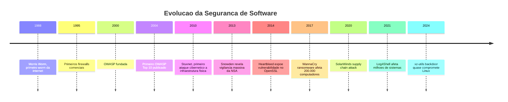
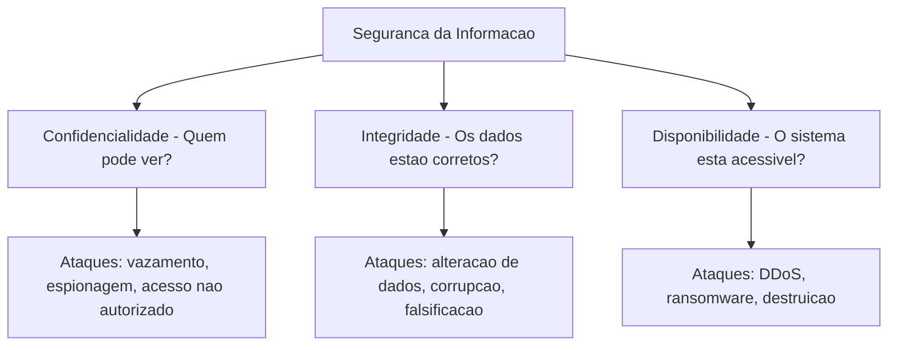
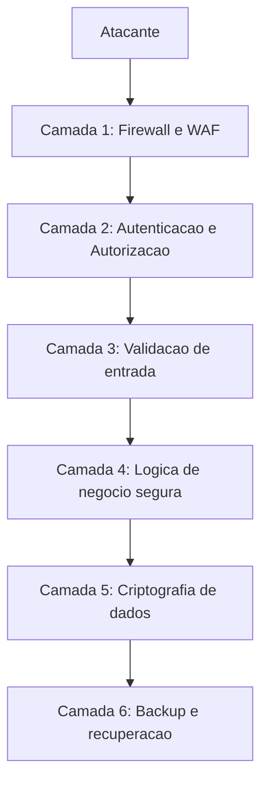
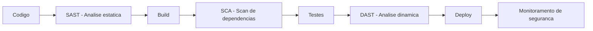

# 12.7 — Segurança no Desenvolvimento: Pensando como um Atacante para Defender Melhor

[← Anterior: LGPD e Dados Sensíveis](cap12-mod06-lgpd-dados-sensiveis.md) · [Próximo: Conceitos sobre Ferramentas →](cap12-mod08-conceitos-sobre-ferramentas.md)

---

## Introdução

No módulo anterior, falamos sobre LGPD e a responsabilidade de proteger dados pessoais. Mas proteção de dados é apenas uma parte de um tema muito maior: **segurança de software**. E segurança não é algo que você adiciona no final — é algo que precisa estar presente em cada linha de código que você escreve.

A realidade é dura: todo software conectado à internet está sob ataque. Não é questão de "se" seu sistema será atacado, mas "quando". Bots automatizados varrem a internet 24 horas por dia procurando vulnerabilidades. Se seu sistema tem uma falha conhecida, ela será encontrada — geralmente em horas, não em dias.

Isso não significa que você precisa ser um especialista em segurança para programar. Significa que precisa conhecer os riscos mais comuns e as práticas básicas de defesa. A maioria dos ataques bem-sucedidos explora vulnerabilidades simples e conhecidas — não falhas sofisticadas. Saber evitar os erros mais comuns já te coloca muito à frente.

Neste módulo, vamos entender os conceitos fundamentais de segurança no desenvolvimento de software. Não vamos ensinar a atacar sistemas — vamos ensinar a pensar sobre segurança para que você construa software mais resistente.

Se você está pensando "segurança é complicado demais para mim" — relaxe. A maioria das vulnerabilidades exploradas em ataques reais são simples e conhecidas. Saber evitar os 5 erros mais comuns já te coloca à frente de muitos desenvolvedores profissionais. Vamos construir esse conhecimento passo a passo.

---

## A Evolução da Segurança de Software



---

## O Problema: Por que Software é Vulnerável?

Software é vulnerável porque é feito por humanos, e humanos cometem erros. Mas além disso, existem razões estruturais:

- **Complexidade**: sistemas modernos têm milhões de linhas de código, dezenas de dependências e múltiplas camadas. Cada ponto de interação é uma superfície de ataque potencial.

- **Pressão por velocidade**: equipes são pressionadas a entregar rápido. Segurança é frequentemente vista como algo que "atrasa" — até que um incidente acontece.

- **Assimetria**: o defensor precisa proteger todos os pontos. O atacante precisa encontrar apenas um.

- **Evolução constante**: novas vulnerabilidades são descobertas todos os dias. O que era seguro ontem pode não ser hoje.

### O Custo dos Ataques

Ataques cibernéticos não são abstratos — têm custos reais e crescentes. Segundo relatórios da indústria, o custo médio de um vazamento de dados para uma empresa ultrapassa milhões de dólares, considerando multas, perda de clientes, danos à reputação e custos de remediação.

Alguns casos emblemáticos:

- **Equifax (2017)**: dados financeiros de 147 milhões de pessoas expostos por uma vulnerabilidade conhecida que não foi corrigida a tempo. A empresa pagou mais de 700 milhões de dólares em acordos.

- **SolarWinds (2020)**: atacantes comprometeram o processo de build de uma empresa de software, inserindo código malicioso em atualizações legítimas. Milhares de organizações, incluindo agências do governo americano, foram afetadas.

- **Log4Shell (2021)**: uma vulnerabilidade em uma biblioteca Java amplamente usada (Log4j) permitia execução remota de código. Afetou milhões de sistemas no mundo inteiro.

### A Escala do Problema

Para dimensionar o problema de segurança:

| Metrica | Valor |
|---------|-------|
| Custo medio de um vazamento de dados | 4.45 milhoes de dolares - IBM 2023 |
| Tempo medio para detectar um vazamento | 204 dias |
| Tempo medio para conter um vazamento | 73 dias |
| Ataques de ransomware por dia | 4.000+ |
| Vulnerabilidades novas descobertas por ano | 25.000+ |
| Porcentagem de ataques que exploram vulnerabilidades conhecidas | 60%+ |

O dado mais revelador é o último: mais de 60% dos ataques exploram vulnerabilidades que já têm correção disponível. Isso significa que a maioria dos ataques poderia ser prevenida simplesmente mantendo o software atualizado. Segurança não precisa ser sofisticada — precisa ser consistente.

### Tipos de Atacantes

Nem todos os atacantes são iguais. Entender quem ataca ajuda a entender o que proteger:

| Tipo | Motivacao | Sofisticacao | Alvo |
|------|----------|-------------|------|
| Script kiddies | Diversao, vandalismo | Baixa, usam ferramentas prontas | Qualquer sistema vulneravel |
| Hacktivistas | Ideologia, protesto | Media | Governos, empresas controversas |
| Criminosos | Dinheiro - ransomware, fraude | Media a alta | Empresas com dados valiosos |
| Insiders | Vinganca, ganancia | Varia | Propria empresa |
| Estado-nacao | Espionagem, sabotagem | Muito alta | Governos, infraestrutura critica |
| Pesquisadores | Encontrar e reportar vulnerabilidades | Alta | Qualquer sistema, de forma etica |

Para a maioria das aplicações, os atacantes mais comuns são script kiddies e criminosos automatizados. Eles usam ferramentas que varrem a internet procurando vulnerabilidades conhecidas. Se seu sistema não tem as vulnerabilidades mais comuns, você já está protegido contra a maioria dos ataques.

---

## Conceitos Fundamentais de Segurança

Antes de falar sobre ataques específicos, vamos estabelecer os conceitos base:

### A Tríade CIA

O modelo mais fundamental de segurança da informação é a tríade **CIA** (não confundir com a agência americana):

| Pilar | Significado | Exemplo |
|-------|-------------|---------|
| Confidentiality - Confidencialidade | Dados acessiveis apenas por quem tem autorização | Senha do usuario não pode ser vista por outros |
| Integrity - Integridade | Dados não podem ser alterados sem autorização | Valor de uma transferencia bancaria não pode ser modificado em transito |
| Availability - Disponibilidade | Sistema deve estar acessível quando necessário | Loja online não pode ficar fora do ar na Black Friday |

Todo ataque viola pelo menos um desses pilares. Um vazamento de dados viola confidencialidade. Uma alteração não autorizada viola integridade. Um ataque DDoS viola disponibilidade.



### Autenticação vs Autorização

Dois conceitos que você já viu no capítulo 1 (sistemas operacionais) e que são centrais em segurança:

**Autenticação**: verificar quem você é. "Prove que você é quem diz ser." Geralmente feita com senha, token, biometria ou certificado.

Os três fatores de autenticação:
1. **Algo que você sabe**: senha, PIN, resposta a pergunta secreta
2. **Algo que você tem**: celular (para receber código), chave física (YubiKey), cartão
3. **Algo que você é**: impressão digital, reconhecimento facial, íris

Autenticação forte usa dois ou mais fatores (2FA/MFA). Exemplo: senha (algo que sabe) + código no celular (algo que tem). Mesmo que a senha seja comprometida, o atacante não tem o celular.

**Autorização**: verificar o que você pode fazer. "Você é quem diz ser, mas tem permissão para isso?" Um usuário autenticado pode não ter autorização para acessar dados de outro usuário.

A diferença é sutil mas crucial:

| Conceito | Pergunta | Exemplo | Falha comum |
|----------|----------|---------|-------------|
| Autenticação | Quem e você? | Login com usuario e senha | Permitir senhas fracas |
| Autorização | O que você pode fazer? | Usuario comum não pode acessar painel de admin | Verificar so no frontend, nao no backend |

Um erro comum e perigoso é implementar autenticação mas esquecer da autorização. O usuário faz login (autenticado), mas consegue acessar dados de outros usuários mudando o ID na URL (falta de autorização). Isso é chamado de **IDOR** (Insecure Direct Object Reference) e é uma das vulnerabilidades mais comuns em APIs.

Outro erro comum é verificar autorização apenas no frontend (esconder botões na interface) mas não no backend. Um atacante pode simplesmente fazer requisições diretas à API, ignorando a interface. Autorização DEVE ser verificada no servidor, em cada requisição.

### Princípio do Menor Privilégio

Um dos princípios mais importantes de segurança: cada usuário, processo ou sistema deve ter apenas as permissões mínimas necessárias para realizar sua função. Nada mais.

Se um serviço precisa apenas ler dados de uma tabela, ele não deve ter permissão para escrever, deletar ou acessar outras tabelas. Se um usuário é vendedor, ele não precisa de acesso de administrador.

Isso limita o dano em caso de comprometimento: se um atacante consegue acesso a uma conta com poucos privilégios, o estrago é limitado.

### Superfície de Ataque

A **superfície de ataque** é o conjunto de todos os pontos onde um atacante pode tentar entrar no sistema. Quanto maior a superfície, mais difícil é defender.

Formas de reduzir a superfície de ataque:
- Desabilitar serviços e portas que não são necessários
- Remover código e dependências que não são usados
- Limitar quem pode acessar o sistema (firewall, VPN)
- Usar o princípio do menor privilégio
- Manter o sistema o mais simples possível

Cada funcionalidade adicionada, cada dependência instalada, cada porta aberta aumenta a superfície de ataque. Simplicidade é uma virtude em segurança — assim como em arquitetura de software (módulo 12.9).

### Segurança por Obscuridade: O que NÃO Fazer

**Segurança por obscuridade** é a prática de depender do segredo da implementação para proteção. Exemplo: "ninguém vai descobrir que a URL do painel de admin é /admin-secreto-2024".

Isso NÃO é segurança. Atacantes usam ferramentas automatizadas que testam milhares de URLs comuns. Segurança deve funcionar mesmo que o atacante conheça todos os detalhes da implementação — o que deve ser secreto são as chaves e credenciais, não o design do sistema.

O princípio de Kerckhoffs (1883) diz: "Um sistema criptográfico deve ser seguro mesmo que tudo sobre o sistema, exceto a chave, seja de conhecimento público." Esse princípio se aplica a toda segurança de software.

---

## As Vulnerabilidades Mais Comuns

A **OWASP** (Open Web Application Security Project) mantém uma lista das 10 vulnerabilidades mais comuns em aplicações web, atualizada periodicamente. Vamos ver as mais relevantes para quem está começando:

### 1. Injeção (Injection)

Injeção acontece quando dados fornecidos pelo usuário são interpretados como código pelo sistema. O exemplo mais clássico é a **SQL Injection**: o usuário digita um comando SQL no campo de login, e o sistema executa esse comando no banco de dados.

Imagine um sistema que monta a query assim: "SELECT * FROM users WHERE name = '" + nome_digitado + "'". Se o usuário digitar algo malicioso no campo de nome, pode manipular a query para acessar dados que não deveria, ou até deletar tabelas inteiras.

A defesa é simples: nunca concatene dados do usuário diretamente em queries. Use queries parametrizadas (prepared statements), onde os dados são tratados como dados, nunca como código.

### Como SQL Injection Funciona (Conceitual)

Imagine um formulário de login que monta a query assim:

```
Query: SELECT * FROM users WHERE username = '{input}' AND password = '{input}'
```

Se o usuário digitar normalmente:
- Username: `joao`
- Password: `minhasenha`
- Query resultante: `SELECT * FROM users WHERE username = 'joao' AND password = 'minhasenha'`

Mas se o atacante digitar no campo de username:
- Username: `' OR '1'='1' --`
- Query resultante: `SELECT * FROM users WHERE username = '' OR '1'='1' --' AND password = ''`

O `OR '1'='1'` é sempre verdadeiro, e o `--` comenta o resto da query. Resultado: o atacante faz login sem saber a senha.

A defesa com queries parametrizadas:

```
Query: SELECT * FROM users WHERE username = ? AND password = ?
Parametros: ['joao', 'minhasenha']
```

Com queries parametrizadas, o banco de dados sabe que os parâmetros são dados, não código. Mesmo que o atacante digite `' OR '1'='1' --`, o banco trata isso como um username literal (e não encontra nenhum usuário com esse nome).

Essa é uma das vulnerabilidades mais antigas e mais conhecidas — e ainda é explorada com sucesso porque desenvolvedores continuam concatenando strings em queries. Não faça isso. Nunca.

### 2. Autenticação Quebrada

Falhas na implementação de autenticação: senhas fracas permitidas, tokens que não expiram, sessões que não são invalidadas no logout, falta de proteção contra tentativas repetidas de login (brute force).

Defesas: exigir senhas fortes, implementar bloqueio após tentativas falhas, usar tokens com expiração, invalidar sessões corretamente.

### 3. Exposição de Dados Sensíveis

Dados sensíveis transmitidos sem criptografia (HTTP em vez de HTTPS), armazenados em texto puro no banco, ou expostos em mensagens de erro detalhadas.

Defesas: usar HTTPS sempre, criptografar dados sensíveis no banco, nunca expor detalhes internos em mensagens de erro para o usuário.

### 4. Controle de Acesso Quebrado

O usuário consegue acessar recursos que não deveria: mudar o ID na URL para ver dados de outro usuário, acessar endpoints de administrador sem ser admin, manipular tokens para elevar privilégios.

Defesas: verificar autorização em cada requisição (não apenas na interface), validar no servidor (nunca confiar no cliente), implementar controle de acesso baseado em papéis.

### 5. Cross-Site Scripting (XSS)

O atacante injeta código JavaScript malicioso em uma página web que outros usuários vão ver. Quando a vítima acessa a página, o código malicioso executa no navegador dela, podendo roubar cookies, sessões ou dados.

Existem três tipos de XSS:

| Tipo | Como funciona | Exemplo |
|------|-------------|---------|
| Stored XSS | Codigo malicioso armazenado no servidor | Comentario em forum com script malicioso |
| Reflected XSS | Codigo malicioso na URL, refletido na resposta | Link malicioso enviado por e-mail |
| DOM-based XSS | Codigo malicioso manipula o DOM no navegador | JavaScript que le parametros da URL sem sanitizar |

Defesas: escapar (sanitizar) todo conteúdo gerado por usuários antes de exibir em páginas web, usar Content Security Policy (CSP), usar frameworks que escapam automaticamente (React, Angular).

### 6. Cross-Site Request Forgery (CSRF)

O atacante engana o navegador da vítima para fazer uma requisição não autorizada a um site onde a vítima está autenticada. Exemplo: a vítima está logada no banco, visita um site malicioso que faz uma requisição de transferência para o site do banco usando a sessão da vítima.

Defesas: usar tokens CSRF (um token único por formulário que o servidor verifica), verificar o header Origin/Referer, usar SameSite cookies.

### 7. Security Misconfiguration

Configurações padrão inseguras, serviços desnecessários habilitados, mensagens de erro detalhadas expostas, headers de segurança ausentes. É uma das vulnerabilidades mais comuns porque muitos desenvolvedores não alteram as configurações padrão.

Exemplos:
- Servidor com modo debug ativado em produção (expõe stack traces)
- Banco de dados acessível pela internet sem senha
- Diretório de listagem habilitado no servidor web
- Headers de segurança ausentes (X-Frame-Options, X-Content-Type-Options)

Defesas: revisar configurações antes do deploy, usar checklists de segurança, desabilitar tudo que não é necessário, nunca usar credenciais padrão.

### Resumo das Vulnerabilidades

| Vulnerabilidade | O que e | Defesa principal |
|----------------|---------|-----------------|
| Injecao SQL | Dados do usuario executados como código SQL | Queries parametrizadas |
| Autenticação quebrada | Falhas no login e gestao de sessoes | Senhas fortes, tokens com expiracao, 2FA |
| Exposicao de dados | Dados sensiveis sem proteção | HTTPS, criptografia |
| Controle de acesso | Usuario acessa o que não deveria | Verificacao de autorização no servidor |
| XSS | Código malicioso injetado em páginas web | Sanitizacao de entrada, CSP |
| CSRF | Requisicao forjada usando sessao da vitima | Tokens CSRF, SameSite cookies |
| Misconfiguration | Configuracoes padrao inseguras | Checklists, revisao de config |

---

## Senhas e Autenticação Moderna

Senhas são o método de autenticação mais comum — e o mais problemático. Pessoas escolhem senhas fracas, reutilizam senhas entre serviços, e esquecem senhas com frequência.

### O Problema das Senhas

| Problema | Impacto | Solucao |
|----------|---------|---------|
| Senhas fracas | Faceis de adivinhar por forca bruta | Exigir complexidade minima |
| Reutilizacao | Vazamento em um servico compromete todos | Educacao do usuario, 2FA |
| Phishing | Usuario entrega senha para site falso | 2FA, passkeys |
| Armazenamento inseguro | Vazamento expoe senhas em texto puro | Hash com salt - bcrypt, argon2 |

### Autenticação de Dois Fatores (2FA)

2FA adiciona uma segunda camada de verificação além da senha. Mesmo que a senha seja comprometida, o atacante precisa do segundo fator:

| Tipo de 2FA | Como funciona | Seguranca |
|------------|-------------|-----------|
| SMS | Codigo enviado por mensagem de texto | Baixa - SMS pode ser interceptado |
| App autenticador | Codigo gerado por app como Google Authenticator | Media - depende do dispositivo |
| Chave fisica | Dispositivo USB como YubiKey | Alta - precisa do dispositivo fisico |
| Biometria | Impressao digital, reconhecimento facial | Alta - dificil de falsificar |
| Passkeys | Chave criptografica vinculada ao dispositivo | Muito alta - resistente a phishing |

### Passkeys: O Futuro da Autenticação

Passkeys são uma tecnologia recente que promete substituir senhas. Em vez de digitar uma senha, você se autentica com biometria (impressão digital, reconhecimento facial) ou PIN do dispositivo. A autenticação usa criptografia assimétrica — o servidor nunca vê sua "senha", apenas verifica uma assinatura criptográfica.

Vantagens das passkeys:
- Impossível de phishing (a chave é vinculada ao domínio)
- Não há senha para vazar
- Mais conveniente que digitar senhas
- Suportado por Apple, Google e Microsoft

---

## Segurança em Containers

No capítulo 6, você aprendeu sobre Docker. Containers trazem benefícios de segurança (isolamento), mas também riscos específicos:

### Boas Práticas de Segurança em Docker

| Pratica | O que fazer | Por que |
|---------|-----------|---------|
| Imagens minimas | Usar imagens base pequenas como alpine | Menos software instalado, menos vulnerabilidades |
| Nao rodar como root | Usar USER no Dockerfile | Limitar dano se container for comprometido |
| Scan de imagens | Usar Trivy ou Clair para verificar vulnerabilidades | Detectar problemas antes do deploy |
| Secrets seguros | Nao colocar senhas no Dockerfile ou docker-compose | Usar Docker secrets ou variáveis de ambiente seguras |
| Imagens oficiais | Preferir imagens oficiais e verificadas | Imagens nao oficiais podem conter malware |
| Atualizar regularmente | Rebuildar imagens com base atualizada | Corrigir vulnerabilidades conhecidas |

### O Princípio do Container Imutável

Containers devem ser imutáveis — nunca altere um container rodando. Se precisa mudar algo, crie uma nova imagem e substitua o container. Isso garante que o container em produção é exatamente o que foi testado, sem modificações manuais que podem introduzir vulnerabilidades.

---

## CORS: Cross-Origin Resource Sharing

Se você construiu uma API (capítulo 11), vai encontrar CORS rapidamente. CORS é um mecanismo de segurança dos navegadores que impede que um site faça requisições para outro domínio sem autorização.

Exemplo: seu frontend está em `app.exemplo.com` e sua API está em `api.exemplo.com`. Sem CORS configurado, o navegador bloqueia as requisições do frontend para a API.

CORS é configurado no servidor (na API) definindo quais origens podem fazer requisições:

- `Access-Control-Allow-Origin: *` — permite qualquer origem (inseguro para APIs com autenticação)
- `Access-Control-Allow-Origin: https://app.exemplo.com` — permite apenas a origem específica (seguro)

A regra é: nunca use `*` em APIs que requerem autenticação. Sempre especifique as origens permitidas.

---

## Segurança e o Desenvolvedor Júnior

Se você está começando, aqui está um checklist mínimo de segurança que todo desenvolvedor deveria seguir:

### Checklist de Segurança para Iniciantes

- [ ] Usar HTTPS para toda comunicação
- [ ] Nunca armazenar senhas em texto puro — sempre hash com bcrypt ou argon2
- [ ] Usar queries parametrizadas — nunca concatenar dados do usuário em SQL
- [ ] Validar e sanitizar toda entrada do usuário
- [ ] Implementar autenticação e autorização em cada endpoint
- [ ] Não expor informações internas em mensagens de erro
- [ ] Manter dependências atualizadas
- [ ] Não commitar credenciais no Git (usar .gitignore e variáveis de ambiente)
- [ ] Usar 2FA em suas próprias contas (GitHub, e-mail, cloud)
- [ ] Revisar código com olhar de segurança antes de fazer deploy

Esse checklist não cobre tudo, mas evita os erros mais comuns — que são responsáveis pela maioria dos ataques bem-sucedidos.

### Recursos para Aprender Mais

Segurança é um campo vasto e em constante evolução. Se o tema te interessou, aqui estão caminhos para aprofundar:

- **OWASP**: a melhor fonte de conhecimento sobre segurança web. Comece pelo Top 10 e explore os cheat sheets.
- **CTFs (Capture The Flag)**: competições de segurança onde você resolve desafios práticos. Plataformas como HackTheBox e TryHackMe são excelentes para iniciantes.
- **Bug Bounty**: programas onde empresas pagam por vulnerabilidades encontradas. Plataformas como HackerOne e Bugcrowd listam programas abertos.
- **Certificações**: CompTIA Security+, CEH (Certified Ethical Hacker), OSCP (Offensive Security Certified Professional) — para quem quer se especializar.

---

## Segurança como Mentalidade

Mais do que conhecer vulnerabilidades específicas, o importante é desenvolver uma mentalidade de segurança. Isso significa:

### Nunca Confie na Entrada do Usuário

Essa é a regra número um. Todo dado que vem de fora do seu sistema — formulários, URLs, headers HTTP, APIs externas — deve ser tratado como potencialmente malicioso. Valide, sanitize e escape tudo.

### Defesa em Profundidade

Não dependa de uma única camada de proteção. Se o firewall falhar, o controle de acesso da aplicação deve segurar. Se o controle de acesso falhar, a criptografia dos dados deve proteger. Cada camada é uma barreira adicional.



A analogia é com um castelo medieval: não basta ter um muro alto. Você precisa de fosso, ponte levadiça, muralha externa, muralha interna, torre de vigia e guardas. Se o atacante passar por uma defesa, encontra outra. Quanto mais camadas, mais difícil é o ataque.

Na prática, defesa em profundidade para uma aplicação web inclui:

| Camada | O que protege | Ferramentas |
|--------|-------------|-------------|
| Rede | Trafego malicioso | Firewall, WAF, CDN |
| Transporte | Dados em transito | HTTPS, TLS |
| Aplicacao | Logica e dados | Validacao, sanitizacao, autorizacao |
| Dados | Informacoes armazenadas | Criptografia, controle de acesso ao banco |
| Monitoramento | Deteccao de ataques | Logs, alertas, SIEM |
| Recuperacao | Continuidade apos incidente | Backups, plano de recuperacao |

### Falhe de Forma Segura

Quando algo dá errado, o sistema deve falhar de forma segura — negando acesso por padrão, não expondo informações internas, e registrando o evento para investigação.

Exemplos de falha segura vs falha insegura:

| Situacao | Falha insegura | Falha segura |
|----------|---------------|-------------|
| Erro no banco de dados | Mostrar stack trace com nome do banco e query | Mostrar mensagem generica: Erro interno |
| Token invalido | Permitir acesso sem autenticacao | Negar acesso e retornar 401 |
| Erro de autorizacao | Mostrar que o recurso existe mas acesso e negado | Retornar 404 como se o recurso nao existisse |
| Excecao nao tratada | Aplicacao continua em estado inconsistente | Aplicacao para e reinicia em estado limpo |
| Configuracao ausente | Usar valor padrao permissivo | Recusar iniciar sem configuracao explicita |

O princípio é: quando em dúvida, negue. É melhor um usuário legítimo ser temporariamente bloqueado do que um atacante ter acesso. Falhas devem fechar portas, não abrir.

### Nunca Confie na Entrada do Usuário

Essa é a regra número um de segurança. Todo dado que vem de fora do seu sistema — formulários, URLs, headers HTTP, APIs externas, cookies — deve ser tratado como potencialmente malicioso. Valide, sanitize e escape tudo.

A regra prática: defina o que é válido (whitelist) e rejeite todo o resto. É mais seguro do que tentar listar tudo que é inválido (blacklist), porque atacantes sempre encontram formas de contornar blacklists.

### Mantenha Tudo Atualizado

Muitos ataques exploram vulnerabilidades conhecidas em software desatualizado. Manter dependências, frameworks e sistemas operacionais atualizados é uma das defesas mais eficazes e mais negligenciadas.

O caso Equifax é o exemplo perfeito: a vulnerabilidade tinha patch disponível há meses. Se a equipe tivesse aplicado a atualização, o ataque não teria acontecido. Parece simples, mas em organizações grandes com centenas de sistemas, manter tudo atualizado é um desafio logístico significativo.

Boas práticas de atualização:
- Use ferramentas automatizadas de scan de dependências (Dependabot, Snyk, Renovate)
- Defina uma política de atualização (ex: patches de segurança em 48h, atualizações menores em 1 semana)
- Teste atualizações em ambiente de staging antes de aplicar em produção
- Monitore advisories de segurança das tecnologias que usa

---

## Logging e Monitoramento de Segurança

Logs são essenciais para detectar e investigar ataques. Sem logs adequados, você não sabe que está sendo atacado até que seja tarde demais.

### O que Registrar para Segurança

| Evento | Por que registrar |
|--------|------------------|
| Tentativas de login falhas | Detectar ataques de forca bruta |
| Logins bem-sucedidos | Rastrear acessos legitimos e suspeitos |
| Mudancas de permissao | Detectar escalacao de privilegios |
| Acessos a dados sensiveis | Auditoria e compliance |
| Erros de autorizacao | Detectar tentativas de acesso nao autorizado |
| Mudancas de configuracao | Rastrear alteracoes no sistema |
| Requisicoes bloqueadas pelo WAF | Entender padroes de ataque |

### Alertas Automáticos

Logs só são úteis se alguém os lê. Na prática, ninguém lê logs manualmente — são milhões de linhas por dia. A solução é configurar alertas automáticos para padrões suspeitos:

- Mais de 10 tentativas de login falhas em 1 minuto → alerta de brute force
- Login de um IP em país diferente do habitual → alerta de acesso suspeito
- Aumento repentino de erros 403 (forbidden) → alerta de tentativa de acesso não autorizado
- Requisições com padrões de SQL injection → alerta de ataque

Ferramentas como ELK Stack (Elasticsearch, Logstash, Kibana), Splunk e Datadog são usadas para centralizar, analisar e alertar sobre logs de segurança.

### Segurança é Responsabilidade de Todos

Segurança não é responsabilidade apenas da "equipe de segurança". Todo desenvolvedor que escreve código que aceita entrada de usuários, que acessa banco de dados, que se comunica com outros serviços, está na linha de frente da segurança.

---

## Segurança em APIs

Como você construiu uma API no capítulo 11, vale detalhar os riscos específicos de APIs:

### Autenticação de APIs

APIs geralmente usam tokens em vez de sessões. Os métodos mais comuns:

| Metodo | Como funciona | Quando usar |
|--------|-------------|-------------|
| API Key | Chave fixa enviada em cada requisicao | APIs simples, integracao entre servicos |
| JWT - JSON Web Token | Token assinado com informacoes do usuario | APIs com autenticacao de usuarios |
| OAuth 2.0 | Protocolo de autorizacao delegada | Login com Google, Facebook, etc |
| mTLS | Certificados mutuos entre cliente e servidor | Comunicacao entre servicos internos |

### Riscos Específicos de APIs

| Risco | Descricao | Defesa |
|-------|-----------|--------|
| Broken Object Level Authorization | Usuario acessa dados de outro usuario mudando o ID | Verificar autorizacao em cada requisicao |
| Broken Authentication | Tokens que nao expiram, senhas fracas | Tokens com expiracao, rate limiting |
| Excessive Data Exposure | API retorna mais dados do que o necessario | Retornar apenas campos necessarios |
| Lack of Resources and Rate Limiting | API sem limite de requisicoes | Implementar rate limiting |
| Mass Assignment | Usuario envia campos que nao deveria poder alterar | Whitelist de campos permitidos |

### Rate Limiting: Protegendo contra Abuso

Rate limiting é a prática de limitar quantas requisições um cliente pode fazer em um período de tempo. Sem rate limiting, um atacante pode:

- Tentar milhares de senhas por segundo (brute force)
- Extrair todos os dados da API (scraping)
- Sobrecarregar o servidor (DoS)

Implementação típica: "máximo 100 requisições por minuto por IP". Se o limite for excedido, retornar HTTP 429 (Too Many Requests).

---

## DevSecOps: Segurança no Pipeline

No módulo 12.2, falamos sobre CI/CD. **DevSecOps** é a prática de integrar segurança em cada etapa do pipeline de desenvolvimento — não apenas no final.



| Etapa | Ferramenta | O que verifica |
|-------|-----------|---------------|
| SAST | SonarQube, Semgrep | Vulnerabilidades no codigo fonte |
| SCA | Dependabot, Snyk | Vulnerabilidades em dependencias |
| DAST | OWASP ZAP, Burp Suite | Vulnerabilidades na aplicacao rodando |
| Container scan | Trivy, Clair | Vulnerabilidades em imagens Docker |
| Secret scan | GitLeaks, TruffleHog | Credenciais acidentalmente commitadas |

A ideia é "shift left" — mover a detecção de problemas de segurança para o mais cedo possível. É muito mais barato corrigir uma vulnerabilidade durante o desenvolvimento do que em produção.

---

## Engenharia Social: O Fator Humano

Nem todos os ataques são técnicos. **Engenharia social** é a arte de manipular pessoas para obter acesso a sistemas ou informações. É frequentemente o vetor de ataque mais eficaz, porque explora a confiança humana — algo que nenhum firewall protege.

### Tipos de Engenharia Social

| Tipo | Como funciona | Exemplo |
|------|-------------|---------|
| Phishing | E-mail falso que parece legitimo | E-mail do banco pedindo para atualizar senha |
| Spear phishing | Phishing direcionado a pessoa especifica | E-mail personalizado para o CEO da empresa |
| Pretexting | Criar cenario falso para obter informacao | Ligar fingindo ser do suporte tecnico |
| Baiting | Oferecer algo atraente com armadilha | Pendrive infectado deixado no estacionario |
| Tailgating | Seguir alguem autorizado para entrar em area restrita | Entrar no escritorio atras de um funcionario |

### Como se Proteger

- Desconfie de e-mails que pedem ação urgente ("sua conta será bloqueada em 24h")
- Verifique o remetente real (não apenas o nome exibido)
- Nunca clique em links suspeitos — digite a URL diretamente no navegador
- Nunca forneça senhas por telefone ou e-mail
- Use autenticação de dois fatores (2FA) sempre que possível

---

## Criptografia: Os Fundamentos

Criptografia é a ciência de proteger informações tornando-as ilegíveis para quem não tem a chave. Você não precisa ser criptógrafo, mas precisa entender os conceitos básicos:

### Criptografia Simétrica vs Assimétrica

| Tipo | Como funciona | Uso principal |
|------|-------------|--------------|
| Simetrica | Mesma chave para criptografar e descriptografar | Proteger dados armazenados - AES-256 |
| Assimetrica | Chave publica para criptografar, chave privada para descriptografar | Comunicacao segura - RSA, HTTPS |

### Hash: Transformação Irreversível

Hash não é criptografia (porque não pode ser revertido), mas é fundamental para segurança:

- **Senhas**: armazene o hash da senha, não a senha em si. Quando o usuário faz login, aplique o hash na senha digitada e compare com o hash armazenado.
- **Integridade**: calcule o hash de um arquivo para verificar se ele não foi alterado.
- **Algoritmos recomendados para senhas**: bcrypt, argon2, scrypt. NUNCA use MD5 ou SHA-1 para senhas — são rápidos demais e vulneráveis a ataques de força bruta.

---

## Casos de Uso no Mundo Real

### Equifax (2017): A Vulnerabilidade que Custou 700 Milhões

Em setembro de 2017, a Equifax revelou que dados financeiros de 147 milhões de pessoas foram expostos. A causa: uma vulnerabilidade conhecida no Apache Struts (CVE-2017-5638) que tinha patch disponível desde março — seis meses antes do ataque. A Equifax simplesmente não aplicou a atualização. O atacante explorou a vulnerabilidade para acessar o banco de dados e extrair nomes, números de seguro social, datas de nascimento, endereços e números de cartão de crédito. A empresa pagou mais de 700 milhões de dólares em multas e acordos. A lição: manter software atualizado é uma das defesas mais simples e mais negligenciadas.

### SolarWinds (2020): O Ataque à Cadeia de Suprimentos

Em dezembro de 2020, foi descoberto que atacantes (atribuídos à inteligência russa) haviam comprometido o processo de build da SolarWinds, uma empresa de software de monitoramento usada por milhares de organizações. Os atacantes inseriram código malicioso em uma atualização legítima do software Orion. Quando os clientes instalaram a atualização, o código malicioso deu aos atacantes acesso às redes internas. Mais de 18.000 organizações foram afetadas, incluindo o Departamento do Tesouro dos EUA, o Departamento de Segurança Interna e a Microsoft. O ataque mostrou que a cadeia de suprimentos de software é um vetor de ataque crítico — e que confiar cegamente em atualizações de fornecedores é arriscado.

### Log4Shell (2021): A Vulnerabilidade que Abalou a Internet

Em dezembro de 2021, uma vulnerabilidade crítica foi descoberta no Log4j, uma biblioteca de logging para Java usada por milhões de aplicações. A vulnerabilidade (CVE-2021-44228) permitia execução remota de código — um atacante podia executar qualquer comando no servidor simplesmente enviando uma string especial em qualquer campo de entrada que fosse registrado em log. A gravidade era máxima (10.0 no CVSS) e a exploração era trivial. Empresas no mundo inteiro correram para atualizar seus sistemas. O caso ilustrou dois problemas: (1) a dependência massiva em bibliotecas open source mantidas por poucos voluntários, e (2) a dificuldade de saber quais sistemas usam qual biblioteca (o problema de inventário de dependências).

No próximo módulo, vamos mudar de perspectiva: em vez de falar sobre ferramentas e práticas específicas, vamos discutir uma mentalidade fundamental — a de que conceitos são permanentes, mas ferramentas são temporárias. Entender essa diferença vai mudar a forma como você estuda e evolui na carreira.

---

## Como a IA pode te ajudar aqui

**Prompt 1 — Entender segurança:**
> "Revise este trecho de código e me diga se há vulnerabilidades de segurança: [cole o código]."

**Prompt 2 — Listar e descobrir:**
> "Quais são as 5 práticas de segurança mais importantes que um desenvolvedor júnior deve conhecer?"

**Prompt 3 — Explorar o conceito:**
> "Me explique SQL Injection com um exemplo simples e como prevenir."

---

## Resumo do Módulo

| Conceito | Definição |
|----------|-----------|
| Triade CIA | Confidencialidade, Integridade e Disponibilidade |
| Autenticação | Verificar a identidade do usuario |
| Autorização | Verificar as permissões do usuario |
| Menor privilegio | Dar apenas as permissões minimas necessárias |
| SQL Injection | Ataque que injeta comandos SQL via entrada do usuario |
| XSS | Ataque que injeta JavaScript malicioso em páginas web |
| OWASP | Organização que cataloga vulnerabilidades web |
| Defesa em profundidade | Multiplas camadas de proteção |
| Sanitizacao | Limpar e validar dados de entrada |
| Superficie de ataque | Conjunto de pontos onde um atacante pode tentar entrar |
| DevSecOps | Seguranca integrada ao pipeline de desenvolvimento |
| Rate limiting | Limitar requisicoes por periodo para prevenir abuso |
| CORS | Mecanismo de seguranca dos navegadores para requisicoes entre dominios |
| CSRF | Ataque que forja requisicoes usando sessao da vitima |
| Engenharia social | Manipulacao de pessoas para obter acesso a sistemas |
| 2FA | Autenticacao de dois fatores |
| Passkeys | Autenticacao sem senha baseada em criptografia |
| Superficie de ataque | Conjunto de pontos onde um atacante pode tentar entrar |
| Seguranca por obscuridade | Pratica insegura de depender do segredo da implementacao |
| Principio de Kerckhoffs | Sistema deve ser seguro mesmo que o design seja publico |
| CSRF | Cross-Site Request Forgery, requisicao forjada usando sessao da vitima |
| CORS | Cross-Origin Resource Sharing, mecanismo de seguranca dos navegadores |
| Security misconfiguration | Configuracoes padrao inseguras em producao |

---

## Glossário do Módulo

| Termo | Definição |
|-------|-----------|
| Authentication - Autenticação | Processo de verificar a identidade de um usuario |
| Authorization - Autorização | Processo de verificar as permissões de um usuario |
| Brute force | Ataque que tenta todas as combinacoes possiveis de senha |
| CIA triad | Modelo de segurança: Confidencialidade, Integridade, Disponibilidade |
| CSP - Content Security Policy | Mecanismo de segurança que restringe recursos em páginas web |
| DDoS - Distributed Denial of Service | Ataque que sobrecarrega um sistema com trafego |
| Defense in depth | Estrategia de multiplas camadas de proteção |
| Encryption - Criptografia | Técnica de proteger dados tornando-os ilegiveis sem a chave |
| HTTPS | Versão segura do HTTP com criptografia TLS |
| Injection - Injecao | Ataque que insere código malicioso via dados de entrada |
| Least privilege | Principio de conceder apenas permissões minimas necessárias |
| OWASP | Open Web Application Security Project |
| Prepared statement | Query parametrizada que separa dados de código SQL |
| Sanitization - Sanitizacao | Processo de limpar dados de entrada removendo conteúdo malicioso |
| SQL Injection | Ataque que injeta comandos SQL via campos de entrada |
| Token | Credencial temporária usada para autenticação |
| Vulnerability - Vulnerabilidade | Falha que pode ser explorada por um atacante |
| XSS - Cross-Site Scripting | Ataque que injeta JavaScript malicioso em páginas web |
| DevSecOps | Integracao de seguranca em cada etapa do pipeline de desenvolvimento |
| SAST | Static Application Security Testing, analise de seguranca do codigo fonte |
| DAST | Dynamic Application Security Testing, analise de seguranca da aplicacao rodando |
| SCA | Software Composition Analysis, scan de vulnerabilidades em dependencias |
| Rate limiting | Limitar quantidade de requisicoes por periodo de tempo |
| JWT | JSON Web Token, token assinado para autenticacao de APIs |
| OAuth | Protocolo de autorizacao delegada |
| 2FA | Two-Factor Authentication, autenticacao de dois fatores |
| Phishing | Ataque de engenharia social via e-mail falso |
| Ransomware | Malware que criptografa dados e exige resgate |
| WAF | Web Application Firewall, firewall especializado para aplicacoes web |
| SIEM | Security Information and Event Management, sistema de monitoramento de seguranca |
| CVE | Common Vulnerabilities and Exposures, identificador unico de vulnerabilidades |
| CVSS | Common Vulnerability Scoring System, sistema de pontuacao de gravidade |
| Zero-day | Vulnerabilidade desconhecida pelo fabricante, sem patch disponivel |
| Penetration testing | Teste de invasao autorizado para encontrar vulnerabilidades |
| Responsible disclosure | Pratica de reportar vulnerabilidades ao fabricante antes de publicar |
| IDOR | Insecure Direct Object Reference, acesso a recursos de outros usuarios |
| Whitelist | Lista de valores permitidos, abordagem mais segura que blacklist |

---

## Na Cultura Popular

- **Mr. Robot** (série, 2015-2019) — A série mais realista sobre hacking e segurança já produzida para TV. Mostra ataques reais (SQL injection, engenharia social, exploração de vulnerabilidades) com precisão técnica impressionante. Essencial para quem quer entender a mentalidade de um atacante.

- **O Jogo da Imitação** (filme, 2014) — Alan Turing quebrando a criptografia da máquina Enigma durante a Segunda Guerra Mundial. Mostra que segurança e criptografia são temas antigos — e que a corrida entre quem protege e quem ataca nunca termina.

- **Snowden** (filme, 2016) — Conta a história de Edward Snowden e a vigilância massiva da NSA. Levanta questões fundamentais sobre privacidade, segurança e os limites do poder governamental sobre dados.

- **Zero Day** (série, 2025) — Série da Netflix sobre um ataque cibernético massivo aos Estados Unidos. Embora seja ficção, mostra de forma realista como ataques cibernéticos podem afetar infraestrutura crítica (energia, transporte, comunicações) e as consequências para a sociedade.

- **Darknet Diaries** (podcast) — Podcast que conta histórias reais de hacking, vazamentos de dados e cibersegurança. Cada episódio é uma história diferente, contada de forma envolvente e acessível. Excelente para entender como ataques reais acontecem.

- **The Cuckoo's Egg** (livro, 1989) — Clifford Stoll, um astrônomo que virou administrador de sistemas, conta como rastreou um hacker que invadia computadores de universidades e bases militares nos anos 80. É uma das primeiras histórias de investigação de cibersegurança, contada de forma narrativa e emocionante.

---

## Para Saber Mais

- [OWASP Top 10](https://owasp.org/www-project-top-ten/) — *Lista das 10 vulnerabilidades mais críticas em aplicações web, atualizada periodicamente*
- [OWASP Cheat Sheet Series](https://cheatsheetseries.owasp.org/) — *Guias práticos de segurança para desenvolvedores, organizados por tema*
- [Have I Been Pwned](https://haveibeenpwned.com/) — *Verifique se seu e-mail apareceu em algum vazamento de dados conhecido*
- [PortSwigger Web Security Academy](https://portswigger.net/web-security) — *Curso gratuito e interativo sobre segurança web com laboratórios práticos*
- [Cybrary — Introduction to IT and Cybersecurity](https://www.cybrary.it/) — *Plataforma com cursos gratuitos sobre fundamentos de segurança*
- [HackTheBox](https://www.hackthebox.com/) — *Plataforma de CTF (Capture The Flag) para praticar segurança de forma ética e legal*
- [TryHackMe](https://tryhackme.com/) — *Plataforma de aprendizado de segurança com laboratórios guiados, excelente para iniciantes*
- [Krebs on Security](https://krebsonsecurity.com/) — *Blog de Brian Krebs, jornalista investigativo especializado em cibersegurança — excelente para acompanhar incidentes reais*

---

## Perguntas Frequentes (FAQ)

**P: Preciso ser especialista em segurança para programar?**
R: Não. Mas precisa conhecer os riscos básicos e as defesas fundamentais. A maioria dos ataques explora erros simples que qualquer desenvolvedor pode evitar.

**P: Segurança é responsabilidade do desenvolvedor ou da equipe de segurança?**
R: De todos. A equipe de segurança define políticas e faz auditorias, mas quem escreve o código é quem implementa (ou falha em implementar) a segurança na prática.

**P: HTTPS é realmente necessário para todo site?**
R: Sim. Mesmo sites que não lidam com dados sensíveis devem usar HTTPS. Sem ele, qualquer pessoa na mesma rede pode interceptar o tráfego.

**P: O que é engenharia social?**
R: É manipular pessoas para obter acesso a sistemas ou informações. O atacante não explora uma falha técnica — explora a confiança humana. Exemplo: ligar para alguém fingindo ser do suporte técnico e pedir a senha.

**P: Como sei se meu código tem vulnerabilidades?**
R: Use ferramentas de análise estática de segurança (SAST), mantenha dependências atualizadas, faça revisão de código com foco em segurança, e considere testes de penetração para sistemas críticos.

**P: O que é um ataque DDoS?**
R: Distributed Denial of Service — o atacante sobrecarrega o sistema com tráfego de milhares de fontes simultâneas, tornando-o inacessível para usuários legítimos. A defesa envolve infraestrutura (CDN, load balancers) mais do que código.

**P: Senhas devem ser armazenadas como hash. O que é hash?**
R: Hash é uma transformação matemática irreversível. Você transforma a senha em uma sequência de caracteres que não pode ser revertida para a senha original. Quando o usuário faz login, você aplica o hash na senha digitada e compara com o hash armazenado.

**P: O que fazer se descobrir uma vulnerabilidade em um software que uso?**
R: Reporte de forma responsável ao mantenedor do software (responsible disclosure). Não publique a vulnerabilidade antes que uma correção esteja disponível. Muitos projetos têm políticas de segurança documentadas.

**P: O que é CORS e por que minha API está bloqueando requisições?**
R: CORS (Cross-Origin Resource Sharing) é um mecanismo de segurança dos navegadores que impede requisições entre domínios diferentes. Configure o header Access-Control-Allow-Origin na sua API para permitir as origens que devem ter acesso.

**P: O que é um ataque de supply chain?**
R: É quando o atacante compromete uma dependência (biblioteca, pacote) que seu software usa. Quando você instala ou atualiza a dependência comprometida, o código malicioso entra no seu sistema. O caso SolarWinds e o Log4Shell são exemplos.

**P: O que é zero-day?**
R: É uma vulnerabilidade que o fabricante do software ainda não conhece — portanto não tem correção (patch) disponível. São as vulnerabilidades mais perigosas porque não há defesa específica. A defesa é ter múltiplas camadas de proteção (defesa em profundidade).

**P: Devo usar um gerenciador de senhas?**
R: Sim, absolutamente. Gerenciadores de senhas (como Bitwarden, 1Password, KeePass) permitem usar senhas únicas e fortes para cada serviço sem precisar memorizá-las. É uma das melhores práticas de segurança pessoal.

**P: O que é ransomware?**
R: É um tipo de malware que criptografa os dados da vítima e exige pagamento (resgate) para descriptografar. A melhor defesa é ter backups atualizados e testados — se seus dados estão em backup, você não precisa pagar o resgate.

**P: Segurança é um tema que muda muito?**
R: Os princípios fundamentais (CIA, menor privilégio, defesa em profundidade, validação de entrada) são estáveis há décadas. O que muda são as tecnologias, as ferramentas e os vetores de ataque específicos. Se você entender os princípios, consegue se adaptar às mudanças.

**P: O que é "security by design"?**
R: É o princípio de considerar segurança desde o início do projeto — não como algo adicionado depois. Similar ao "privacy by design" que vimos no módulo anterior. Quando você projeta o sistema pensando em segurança, as defesas são mais naturais e eficazes.


---

## Exercícios Práticos

1. **Identificando vulnerabilidades**: pense na API que você construiu no capítulo 11. Liste pelo menos 5 pontos onde um atacante poderia tentar explorar vulnerabilidades. Para cada ponto, descreva: (a) o tipo de ataque possível (SQL injection, XSS, broken auth, etc.), (b) o impacto se o ataque for bem-sucedido, (c) como você se defenderia. Use a tabela OWASP como referência.

2. **Pesquisa OWASP**: acesse o site da OWASP Top 10 e leia sobre uma vulnerabilidade que não foi detalhada neste módulo (por exemplo: SSRF, Insecure Deserialization, ou Security Misconfiguration). Escreva pelo menos 2 parágrafos explicando o que é, como funciona, um exemplo real de exploração, e como se defender.

3. **Verificação de vazamentos**: acesse o site Have I Been Pwned e verifique se algum e-mail seu apareceu em vazamentos conhecidos. Se sim, reflita: quais dados podem ter sido expostos? Você usava a mesma senha em outros serviços? O que pode fazer para se proteger melhor? Escreva um plano de ação pessoal.

4. **Estudo de caso — SolarWinds ou Log4Shell**: escolha um dos dois incidentes e pesquise em profundidade. Descreva: (a) como o ataque funcionou tecnicamente, (b) por que foi tão difícil de detectar, (c) quais foram as consequências, (d) que lições a indústria aprendeu, (e) como práticas de DevSecOps poderiam ter ajudado. Escreva pelo menos 3 parágrafos.

5. **Análise de segurança de senha**: pesquise quanto tempo leva para quebrar senhas de diferentes complexidades usando ataques de força bruta modernos. Monte uma tabela comparando: senha de 6 caracteres (só letras), 8 caracteres (letras e números), 12 caracteres (letras, números e símbolos), e uma passphrase de 4 palavras. Qual abordagem é mais segura e por quê?

---

[← Anterior: LGPD e Dados Sensíveis](cap12-mod06-lgpd-dados-sensiveis.md) · [Próximo: Conceitos sobre Ferramentas →](cap12-mod08-conceitos-sobre-ferramentas.md)
