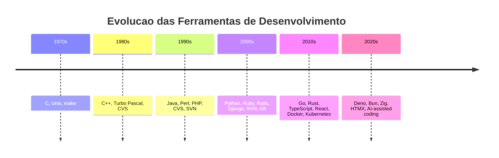
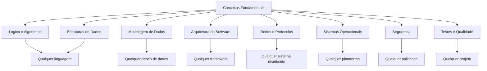
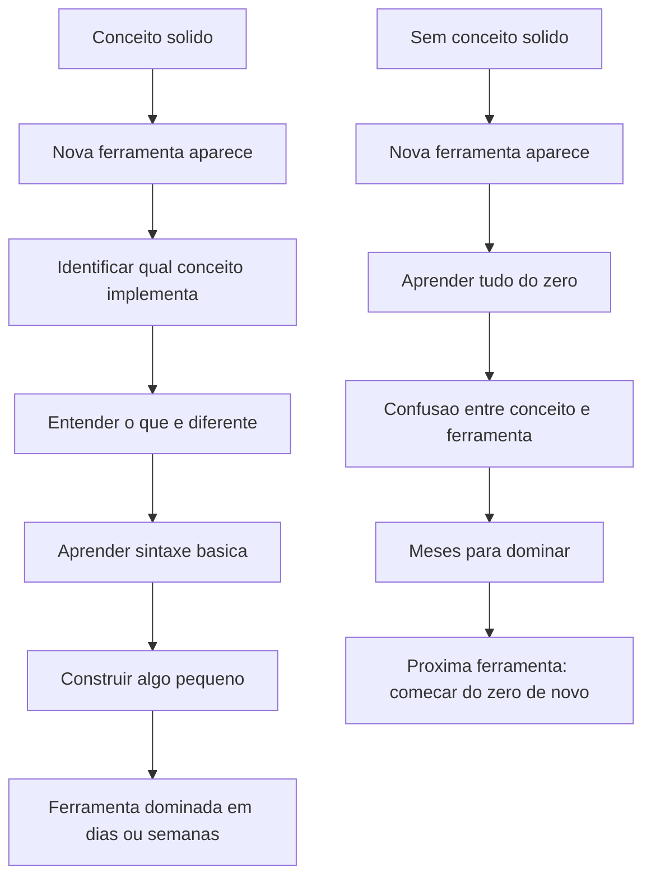
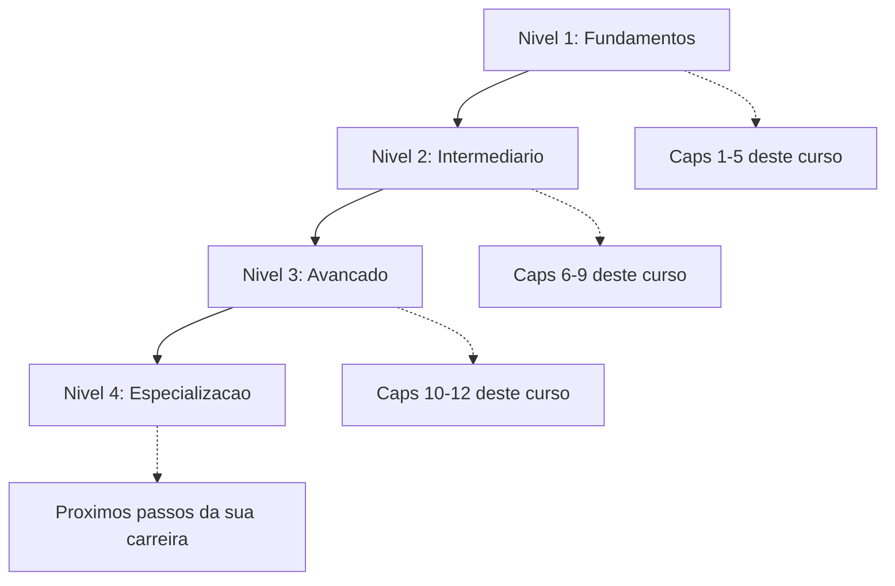

# 12.8 — Conceitos São para Sempre, Ferramentas Apenas os Implementam

[← Anterior: Segurança no Desenvolvimento](cap12-mod07-seguranca.md) · [Próximo: O Problema que Precisamos Resolver →](cap12-mod09-foco-no-problema.md)

---

## Introdução

No módulo anterior, vimos como a segurança é uma responsabilidade de todo desenvolvedor — desde proteger dados pessoais até prevenir vulnerabilidades que podem custar milhões. Aprendemos sobre os ataques mais famosos da história e as práticas que tornam o software mais seguro. Agora vamos dar um passo atrás e falar sobre algo ainda mais fundamental: a diferença entre conceitos e ferramentas.

Ao longo deste curso, você usou várias ferramentas: Python, C, C#, Git, Docker, SQLite, FastAPI, VSCode, Linux. Cada uma delas foi escolhida por um motivo — Python pela simplicidade, C para entender memória, C# para orientação a objetos, Docker para containers.

Mas aqui vai uma verdade que pode parecer contraditória vindo de um curso de tecnologia: nenhuma dessas ferramentas é o que realmente importa. O que importa são os conceitos por trás delas.

Python pode ser substituído. Docker pode ser substituído. Git pode ser substituído. Mas lógica de programação, estruturas de dados, modelagem de dados, arquitetura de sistemas, controle de versão como conceito — esses são permanentes. Eles existiam antes dessas ferramentas e vão continuar existindo depois que elas forem substituídas por outras.

Pense assim: ferramentas são como carros — modelos novos saem todo ano, cada um com features diferentes. Conceitos são como saber dirigir — uma vez que aprende, dirige qualquer carro. Você não precisa reaprender a dirigir quando troca de carro. Da mesma forma, não precisa reaprender programação quando troca de linguagem.

Este é um dos módulos mais importantes deste capítulo, porque trata de uma mentalidade que vai definir a qualidade da sua carreira inteira.

Se você absorver apenas uma ideia de todo este curso, que seja esta: **invista em conceitos, não em ferramentas**. Ferramentas são o veículo — conceitos são o destino. Você pode trocar de carro, mas precisa saber dirigir.

---

## A Evolução das Ferramentas

Para entender por que conceitos são mais duráveis que ferramentas, basta olhar para a história:

Cada década trouxe ferramentas novas. As ferramentas dos anos 70 são quase todas obsoletas (exceto C e Unix, que são excepcionais). As dos anos 90 estão sendo substituídas. As dos anos 2010 já estão sendo questionadas. Mas os conceitos — compilação, tipagem, versionamento, componentização, containerização — permanecem.

---

## O Problema: A Armadilha das Ferramentas

A indústria de tecnologia tem uma obsessão por ferramentas. Toda semana surge um novo framework, uma nova linguagem, uma nova plataforma. As redes sociais amplificam isso: "Aprenda X em 30 dias!", "Y é o futuro!", "Se você não sabe Z, está ficando para trás!".

Isso cria uma ansiedade constante em desenvolvedores — especialmente iniciantes. A sensação de que você nunca sabe o suficiente, de que está sempre atrasado, de que precisa aprender tudo ao mesmo tempo.

Essa ansiedade tem nome: **FOMO** (Fear Of Missing Out — Medo de Ficar de Fora). No contexto de tecnologia, é o medo de que se você não aprender a ferramenta da moda, vai ficar obsoleto. Mas a ironia é que quem corre atrás de toda ferramenta nova nunca domina nenhuma — e quem domina os conceitos fundamentais nunca fica obsoleto.

### O Ciclo Vicioso das Ferramentas

O ciclo é previsível e se repete a cada poucos anos:

1. Nova ferramenta é lançada com promessas revolucionárias
2. Early adopters começam a usar e evangelizar
3. Artigos e tutoriais aparecem: "Por que você deveria usar X"
4. Empresas começam a adotar, vagas pedem a ferramenta
5. Desenvolvedores correm para aprender
6. Problemas e limitações da ferramenta aparecem
7. Nova ferramenta é lançada prometendo resolver os problemas da anterior
8. Volta ao passo 1

Quem entende os conceitos observa esse ciclo com calma: "Ah, mais um framework de frontend. Usa componentização? Gerenciamento de estado? Virtual DOM? Ok, são os mesmos conceitos de sempre com sintaxe diferente."

Quem não entende os conceitos entra em pânico a cada iteração do ciclo: "Preciso aprender X urgentemente ou vou ficar para trás!"

Mas se você olhar com calma, vai perceber algo interessante: as ferramentas mudam, mas os problemas que elas resolvem são os mesmos há décadas.

### Ferramentas Mudam, Conceitos Permanecem

Vamos olhar para a história:

| Conceito | Ferramentas dos anos 90 | Ferramentas dos anos 2000 | Ferramentas dos anos 2020 |
|----------|------------------------|--------------------------|--------------------------|
| Controle de versão | CVS, RCS | SVN | Git |
| Containers e isolamento | chroot | Solaris Zones, LXC | Docker, Podman |
| Banco de dados relacional | Oracle, DB2 | MySQL, PostgreSQL | PostgreSQL, SQLite, CockroachDB |
| Linguagem de alto nível | Perl, Tcl | Java, PHP, Python | Python, Go, Rust, TypeScript |
| Framework web | CGI scripts | Rails, Django, Spring | FastAPI, Next.js, Gin |
| CI/CD | Scripts manuais | Jenkins, Hudson | GitHub Actions, GitLab CI |

As ferramentas da coluna da esquerda são quase todas obsoletas. As do meio estão sendo substituídas. As da direita serão substituídas também, eventualmente. Mas os conceitos — controle de versão, isolamento de ambientes, dados relacionais, abstração de linguagem, automação de entrega — continuam os mesmos.

Se você aprendeu CVS nos anos 90 e entendeu o conceito de controle de versão, migrar para Git foi natural. Se você aprendeu apenas os comandos do CVS sem entender o conceito, ficou perdido quando o CVS morreu.

### A Velocidade da Mudança

Para ter uma ideia de quão rápido ferramentas mudam, considere o ecossistema JavaScript:

| Ano | Framework frontend dominante | O que aconteceu |
|-----|----------------------------|-----------------|
| 2010 | jQuery | Dominava o mercado |
| 2012 | Backbone.js, Ember.js | Frameworks MVC ganharam forca |
| 2014 | AngularJS | Google lancou e dominou |
| 2016 | React | Facebook lancou e tomou o mercado |
| 2018 | React + Redux | Padrao da industria |
| 2020 | React + Next.js | Server-side rendering ganhou forca |
| 2022 | React, Vue, Svelte, Solid | Multiplas opcoes competindo |
| 2024 | React Server Components, HTMX | Paradigma mudando novamente |

Em 14 anos, o framework dominante mudou pelo menos 5 vezes. Se você investiu todo seu tempo aprendendo jQuery em 2010, esse conhecimento específico é quase inútil hoje. Mas se você aprendeu os conceitos de manipulação de DOM, componentização e gerenciamento de estado, cada transição foi natural.

Essa velocidade de mudança não é exclusiva do JavaScript — acontece em todas as áreas da tecnologia. É por isso que conceitos são o investimento mais seguro que você pode fazer na sua carreira.

---

## A Diferença entre Saber uma Ferramenta e Entender um Conceito

Existe uma diferença fundamental entre saber usar uma ferramenta e entender o conceito que ela implementa:

**Saber a ferramenta**: "Eu sei usar Docker. Sei escrever um Dockerfile, sei rodar docker-compose, sei fazer push de imagens."

**Entender o conceito**: "Eu entendo o que é isolamento de processos, por que containers existem, qual problema resolvem que VMs não resolvem bem, e quais são os trade-offs. Docker é uma implementação desses conceitos."

A pessoa que sabe a ferramenta fica perdida quando a ferramenta muda. A pessoa que entende o conceito migra para qualquer ferramenta nova com facilidade, porque reconhece os mesmos padrões.

### Exemplos Concretos

| Se você entende o conceito de... | Você consegue aprender rapidamente... |
|----------------------------------|--------------------------------------|
| Lógica de programação | Qualquer linguagem de programação |
| Estruturas de dados | Qualquer biblioteca de coleções em qualquer linguagem |
| Banco de dados relacional | MySQL, PostgreSQL, SQLite, SQL Server |
| Orientacao a objetos | Java, C#, Python, Kotlin, Swift |
| APIs REST | FastAPI, Express, Spring Boot, Gin |
| Controle de versão | Git, Mercurial, qualquer sistema futuro |
| Containers | Docker, Podman, containerd |
| CI/CD | Jenkins, GitHub Actions, GitLab CI, CircleCI |

Perceba o padrão: um conceito, muitas ferramentas. Se você domina o conceito, a ferramenta é apenas sintaxe.

### A Prova Definitiva

Quer testar se você entende o conceito ou apenas a ferramenta? Tente explicar o conceito para alguém sem mencionar nenhuma ferramenta específica.

**Teste 1 — Controle de versão:**
- Ferramenta: "Git é um sistema que faz commits e branches"
- Conceito: "Controle de versão é a capacidade de registrar o histórico de mudanças em arquivos, voltar a qualquer ponto anterior, trabalhar em versões paralelas e juntar mudanças de múltiplas pessoas"

**Teste 2 — Containers:**
- Ferramenta: "Docker cria containers com Dockerfile e docker-compose"
- Conceito: "Containers são processos isolados que compartilham o kernel do sistema operacional, permitindo empacotar uma aplicação com todas as suas dependências para rodar de forma idêntica em qualquer ambiente"

**Teste 3 — OOP:**
- Ferramenta: "Em C# você cria classes com class, herda com :, e implementa interfaces com interface"
- Conceito: "Orientação a objetos organiza código em unidades que combinam dados e comportamentos, permitindo encapsulamento (esconder complexidade), herança (reutilizar comportamento) e polimorfismo (tratar objetos diferentes de forma uniforme)"

Se você consegue dar a explicação conceitual, está no caminho certo. Se só consegue dar a explicação da ferramenta, precisa aprofundar.

---

## A História dos Conceitos Fundamentais

Os conceitos que você aprendeu neste curso não surgiram do nada — cada um tem uma história fascinante:

### Algoritmos: 2.000+ Anos

O conceito de algoritmo — uma sequência finita de passos para resolver um problema — existe desde a antiguidade. O nome vem de Al-Khwarizmi, matemático persa do século IX que escreveu tratados sobre procedimentos matemáticos. Euclides descreveu um algoritmo para encontrar o máximo divisor comum por volta de 300 a.C. — e esse algoritmo ainda é usado hoje.

### Lógica Booleana: 1854

George Boole publicou "An Investigation of the Laws of Thought" em 1854, formalizando a lógica que hoje é a base de toda computação digital. Verdadeiro/falso, AND/OR/NOT — os mesmos operadores que você usou em Python no capítulo 5 foram formalizados há mais de 170 anos.

### Estruturas de Dados: 1950s-1960s

As estruturas de dados fundamentais foram formalizadas nas décadas de 1950 e 1960:
- **Arrays**: conceito básico desde os primeiros computadores
- **Listas encadeadas**: formalizadas por Allen Newell, Cliff Shaw e Herbert Simon em 1955-1956
- **Árvores binárias**: formalizadas por Andrew Donald Booth em 1960
- **Tabelas hash**: conceito descrito por Hans Peter Luhn da IBM em 1953

### Banco de Dados Relacional: 1970

Edgar F. Codd publicou "A Relational Model of Data for Large Shared Data Banks" em 1970, definindo o modelo relacional que você usou no capítulo 8. Mais de 50 anos depois, bancos relacionais continuam sendo a forma mais comum de armazenar dados estruturados.

### Orientação a Objetos: 1967

Simula, criada por Ole-Johan Dahl e Kristen Nygaard na Noruega em 1967, foi a primeira linguagem orientada a objetos. Os conceitos de classes, objetos, herança e polimorfismo que você aprendeu no capítulo 9 têm quase 60 anos.

### Controle de Versão: 1972

SCCS (Source Code Control System), criado por Marc Rochkind nos Bell Labs em 1972, foi o primeiro sistema de controle de versão. O conceito de rastrear mudanças em código tem mais de 50 anos — Git é apenas a implementação mais recente.

### REST: 2000

Roy Fielding definiu REST (Representational State Transfer) em sua tese de doutorado em 2000. Os princípios de APIs REST que você aprendeu no capítulo 11 têm 25 anos — e continuam sendo o padrão dominante para comunicação entre serviços.

Esses exemplos mostram que os conceitos fundamentais da computação são extraordinariamente duráveis. Algoritmos têm 2.000+ anos. Lógica booleana tem 170 anos. Estruturas de dados têm 70 anos. OOP tem quase 60 anos. Nenhuma ferramenta dura tanto.

---

## O Desenvolvedor como Resolvedor de Problemas

No final das contas, o que diferencia um bom desenvolvedor não é quantas ferramentas conhece — é a capacidade de resolver problemas. E resolver problemas requer conceitos, não ferramentas.

Quando alguém te apresenta um problema, o processo mental é:

1. **Entender o problema** (conceito: análise de requisitos)
2. **Decompor em partes menores** (conceito: decomposição)
3. **Identificar padrões** (conceito: reconhecimento de padrões)
4. **Projetar uma solução** (conceito: arquitetura, design)
5. **Implementar** (ferramenta: linguagem, framework)
6. **Verificar** (conceito: testes, validação)
7. **Melhorar** (conceito: refatoração, otimização)

Repare: 6 dos 7 passos são conceituais. Apenas 1 envolve ferramenta. A ferramenta é o menor dos problemas — o difícil é pensar bem.

### A Analogia do Músico

Um músico profissional pode tocar em qualquer instrumento de qualidade — porque domina os conceitos de música (ritmo, harmonia, melodia, dinâmica). O instrumento é a ferramenta. Um iniciante que só sabe tocar uma música específica em um violão específico fica perdido com qualquer mudança.

Da mesma forma, um desenvolvedor que domina conceitos pode programar em qualquer linguagem, usar qualquer framework, trabalhar em qualquer domínio — porque entende os fundamentos. Um desenvolvedor que só sabe "fazer X no framework Y" fica perdido quando Y muda.

### A Mensagem Final

Se você chegou até aqui neste curso, já tem uma base conceitual sólida. Você entende como computadores funcionam, como programas são escritos, como dados são organizados, como sistemas são estruturados, como equipes trabalham juntas.

Essas são as fundações da sua carreira. Ferramentas vão ir e vir — Python pode ser substituído, Docker pode evoluir, Git pode ser superado. Mas a capacidade de pensar logicamente, modelar dados, projetar sistemas e resolver problemas? Isso é seu para sempre.

Invista nos conceitos. As ferramentas cuidam de si mesmas.

---

## Os Conceitos que Duram para Sempre

Quais são os conceitos que realmente importam e que vão te acompanhar por toda a carreira? Aqui está uma lista — não exaustiva, mas fundamental:

### Lógica e Pensamento Computacional

A capacidade de decompor um problema em partes menores, identificar padrões, abstrair detalhes irrelevantes e criar uma sequência de passos para resolver. Isso não depende de nenhuma linguagem — é a base de tudo.

Pensamento computacional não é "pensar como um computador" — é pensar de forma estruturada sobre problemas. Envolve quatro habilidades:

1. **Decomposição**: quebrar um problema grande em problemas menores e gerenciáveis
2. **Reconhecimento de padrões**: identificar similaridades entre problemas diferentes
3. **Abstração**: focar no que é importante e ignorar detalhes irrelevantes
4. **Algoritmos**: criar uma sequência de passos para resolver o problema

Essas habilidades se aplicam a qualquer área — não apenas programação. Um médico decompõe sintomas para chegar a um diagnóstico. Um engenheiro civil reconhece padrões em projetos anteriores. Um chef abstrai uma receita para adaptá-la a ingredientes disponíveis.

### Estruturas de Dados

Listas, filas, pilhas, árvores, grafos, tabelas hash. Cada uma resolve um tipo de problema. Saber quando usar cada uma é mais importante do que saber a sintaxe específica em uma linguagem.

A escolha da estrutura de dados certa pode fazer a diferença entre um programa que roda em milissegundos e um que roda em horas. Isso não muda com a linguagem — uma busca em lista é O(n) em Python, em Java, em Go, em qualquer linguagem. O conceito é universal.

### Algoritmos

Busca, ordenação, recursão, programação dinâmica. Os algoritmos fundamentais são os mesmos há 50 anos. As implementações mudam, os princípios não.

Donald Knuth começou a escrever "The Art of Computer Programming" em 1962. Mais de 60 anos depois, os algoritmos descritos no livro continuam sendo a base de toda computação. Nenhuma ferramenta tem essa longevidade.

### Modelagem de Dados

Como representar o mundo real em dados. Entidades, relacionamentos, normalização, desnormalização. Isso se aplica a bancos relacionais, NoSQL, arquivos, APIs — qualquer lugar onde dados existem.

A habilidade de olhar para um problema do mundo real e transformá-lo em um modelo de dados é uma das mais valiosas que um desenvolvedor pode ter. E é puramente conceitual — não depende de nenhuma ferramenta.

### Arquitetura de Software

Separação de responsabilidades, camadas, interfaces, acoplamento, coesão. Esses princípios se aplicam a qualquer sistema, em qualquer linguagem, em qualquer escala.

Robert C. Martin (Uncle Bob) escreveu sobre princípios SOLID nos anos 2000, mas os conceitos por trás existem desde os anos 70. Separação de responsabilidades foi descrita por David Parnas em 1972. Esses princípios são tão duráveis quanto os algoritmos de Knuth.

### Redes e Protocolos

Como computadores se comunicam. TCP/IP, HTTP, DNS, TLS. A internet funciona sobre esses protocolos há décadas, e eles não vão mudar tão cedo. HTTP foi criado em 1991 e continua sendo a base da web. TCP/IP foi padronizado em 1983 e continua sendo a base da internet.

### Sistemas Operacionais

Processos, threads, memória, sistema de arquivos, permissões. Todo programa roda dentro de um SO, e entender como o SO funciona te torna um programador melhor.

### Padrões de Design (Design Patterns)

Factory, Repository, Observer, Strategy, Singleton. Esses padrões existem há décadas e aparecem em toda linguagem e framework. Quando você reconhece um padrão, entende imediatamente a intenção do código — independente da linguagem.

### Princípios de Engenharia de Software

SOLID, DRY (Don't Repeat Yourself), KISS (Keep It Simple, Stupid), YAGNI (You Ain't Gonna Need It). Esses princípios guiam decisões de design em qualquer contexto.

### Testes e Qualidade

O conceito de testar software — unitário, integração, E2E — é universal. Os frameworks mudam (JUnit, pytest, xUnit), mas o conceito de "verificar que o código faz o que deveria" é permanente.

### Segurança

Autenticação, autorização, criptografia, validação de entrada, princípio do menor privilégio. Esses conceitos se aplicam a qualquer sistema, em qualquer linguagem, em qualquer plataforma.

### Concorrência e Paralelismo

Threads, processos, locks, race conditions, deadlocks. Esses conceitos existem desde os primeiros sistemas operacionais e são cada vez mais relevantes com processadores multi-core.

---

## A Falácia do "Full Stack"

Um fenômeno moderno é a obsessão por ser "full stack" — saber frontend, backend, banco de dados, infraestrutura, mobile, DevOps, tudo. Isso cria uma pressão enorme para aprender dezenas de ferramentas.

A realidade é que ninguém é especialista em tudo. O que profissionais "full stack" realmente têm é: conceitos sólidos que permitem transitar entre diferentes áreas com competência. Eles não sabem tudo sobre React E tudo sobre Kubernetes E tudo sobre PostgreSQL. Eles entendem os conceitos de componentização, orquestração e dados relacionais — e conseguem trabalhar com as ferramentas específicas quando necessário.

Se você tem os conceitos, pode ser "full stack" com qualquer combinação de ferramentas. Se não tem, colecionar ferramentas no currículo não te torna full stack — te torna superficial em muitas coisas.

---

## Casos de Uso no Mundo Real

### A Migração do Angular para React no Facebook

Quando o Facebook criou o React em 2013, muitas equipes internas usavam Angular. A migração não foi traumática para desenvolvedores que entendiam os conceitos de componentização, gerenciamento de estado e ciclo de vida de componentes. Eles reconheceram os mesmos padrões em uma sintaxe diferente. Desenvolvedores que só sabiam "Angular" (a ferramenta) tiveram muito mais dificuldade.

### A Transição de Java para Go no Google

O Google usa Go extensivamente, mas muitos desenvolvedores vieram de Java. A transição foi suave para quem entendia conceitos de tipagem estática, concorrência, interfaces e compilação. Go é diferente de Java em muitos aspectos (sem herança, sem exceções, goroutines em vez de threads), mas os conceitos fundamentais são os mesmos.

### Desenvolvedores COBOL em 2020

Quando a pandemia de COVID-19 sobrecarregou os sistemas de seguro-desemprego dos EUA em 2020, muitos desses sistemas rodavam em COBOL — uma linguagem dos anos 60. Houve uma corrida para encontrar programadores COBOL. Mas os desenvolvedores que conseguiram ajudar não eram necessariamente especialistas em COBOL — eram profissionais com conceitos sólidos de programação que aprenderam COBOL rapidamente porque entendiam os fundamentos.

---

## Como Aprender Ferramentas Novas (Rápido)

Quando você tem os conceitos sólidos, aprender uma ferramenta nova segue um padrão previsível:

1. **Identifique qual conceito a ferramenta implementa**: "Ah, isso é um framework web. Eu sei o que frameworks web fazem."

2. **Entenda o que é diferente**: toda ferramenta tem suas particularidades. Qual é a filosofia? Quais decisões de design foram feitas? O que ela faz diferente das alternativas?

3. **Aprenda a sintaxe básica**: como criar um projeto, como rodar, como fazer as operações fundamentais.

4. **Construa algo pequeno**: a melhor forma de aprender é fazendo. Construa um projeto simples que exercite os conceitos principais.

5. **Aprofunde conforme necessário**: não tente aprender tudo de uma vez. Aprenda o que precisa para o problema que está resolvendo.

Esse processo leva dias ou semanas, não meses ou anos — porque você não está aprendendo o conceito do zero, está apenas aprendendo uma nova forma de aplicá-lo.

### O Efeito Composto do Conhecimento Conceitual

Cada conceito que você aprende torna o próximo mais fácil. Quando você aprendeu Python no capítulo 5, aprender C no capítulo 7 foi mais fácil porque os conceitos de variáveis, condicionais e loops já eram familiares. Quando aprendeu C# no capítulo 9, foi ainda mais fácil porque já conhecia dois paradigmas.

Esse é o efeito composto: conhecimento conceitual se acumula e se multiplica. Cada novo conceito se conecta com os anteriores, criando uma rede de entendimento cada vez mais rica. Ferramentas, por outro lado, são isoladas — saber React não ajuda a aprender Terraform.

É por isso que desenvolvedores seniores aprendem ferramentas novas tão rápido: não é porque são mais inteligentes, é porque têm décadas de conceitos acumulados que tornam cada nova ferramenta apenas "mais uma implementação de algo que já conheço".

---

## O Perigo do "Currículo de Ferramentas"

Muitos desenvolvedores caem na armadilha de colecionar ferramentas no currículo: "Sei React, Angular, Vue, Svelte, Next.js, Nuxt, Gatsby..." Mas se você perguntar sobre os conceitos por trás — componentização, gerenciamento de estado, renderização, ciclo de vida — a resposta é vaga.

Empregadores experientes sabem disso. Em entrevistas técnicas boas, a pergunta não é "você sabe usar X?" — é "como você resolveria este problema?" A ferramenta é secundária.

Um desenvolvedor que entende profundamente conceitos de programação e resolve problemas com clareza é infinitamente mais valioso do que um que sabe a sintaxe de 15 frameworks mas não consegue explicar por que escolheria um em vez de outro.

### O Teste do "Por Quê?"

Uma forma simples de avaliar se alguém (incluindo você mesmo) entende conceitos ou apenas ferramentas é o teste do "por quê?":

- "Uso React" → Por quê? → "Porque é popular" ❌ (ferramenta)
- "Uso React" → Por quê? → "Porque preciso de componentização com estado reativo e o ecossistema de React tem as bibliotecas que meu projeto precisa" ✅ (conceito)

- "Uso Docker" → Por quê? → "Porque todo mundo usa" ❌ (ferramenta)
- "Uso Docker" → Por quê? → "Porque preciso garantir que o ambiente de desenvolvimento é idêntico ao de produção, e containers resolvem isso com overhead mínimo" ✅ (conceito)

- "Uso PostgreSQL" → Por quê? → "Porque é o melhor banco" ❌ (ferramenta)
- "Uso PostgreSQL" → Por quê? → "Porque meus dados são relacionais, preciso de transações ACID, e PostgreSQL tem o melhor suporte a JSON para os casos onde preciso de flexibilidade" ✅ (conceito)

Se você consegue responder "por quê?" com argumentos conceituais, está no caminho certo. Se a resposta é "porque é popular" ou "porque todo mundo usa", precisa aprofundar.

### Construindo um Portfólio Conceitual

Em vez de listar ferramentas no currículo, considere organizar por conceitos:

**Abordagem tradicional (foco em ferramentas):**
- Python, C#, JavaScript
- FastAPI, React, Docker
- PostgreSQL, SQLite, Redis
- Git, GitHub Actions, Linux

**Abordagem conceitual (foco em problemas resolvidos):**
- Desenvolvimento de APIs REST com arquitetura em camadas (Python/FastAPI)
- Sistemas orientados a objetos com design patterns (C#/.NET)
- Modelagem e persistência de dados relacionais (PostgreSQL, SQLite)
- Containerização e automação de ambientes (Docker, CI/CD)
- Controle de versão e colaboração em equipe (Git)

A segunda abordagem mostra que você entende o que fez e por quê — não apenas quais ferramentas usou. Recrutadores experientes preferem essa abordagem.

---

## Como Este Curso Aplicou Esse Princípio

Se você olhar para trás, vai perceber que este curso foi estruturado exatamente com essa filosofia. Cada capítulo ensinou conceitos primeiro e usou ferramentas como meio:

| Capitulo | Conceito ensinado | Ferramenta usada |
|----------|------------------|-----------------|
| 1 | Como computadores funcionam | Nenhuma - puro conceito |
| 2 | Sistemas operacionais e estrutura | Linux |
| 3 | Linha de comando e automacao | Bash |
| 4 | Controle de versao | Git |
| 5 | Logica de programacao | Python |
| 6 | Isolamento de ambientes | Docker |
| 7 | Estruturas de dados e memoria | C |
| 8 | Modelagem e persistencia de dados | SQLite |
| 9 | Orientacao a objetos e design patterns | C# |
| 10 | Arquitetura de software | Conceitual com exemplos |
| 11 | Integracao de sistemas | FastAPI |
| 12 | Boas praticas profissionais | Conceitual |

Repare: usamos 3 linguagens diferentes (Python, C, C#) não porque são "as melhores", mas porque cada uma ilustra conceitos diferentes. Python para lógica (simplicidade), C para memória (baixo nível), C# para OOP (estruturação). Se amanhã Python for substituído por outra linguagem, os conceitos de lógica que você aprendeu continuam válidos.

Essa é a essência deste módulo: o curso te ensinou a pescar, não te deu peixes. As ferramentas são os peixes — os conceitos são a habilidade de pescar. Com a habilidade, você pega qualquer peixe.

---

## Quando a Ferramenta Importa

Isso não significa que ferramentas são irrelevantes. Elas importam — mas no contexto certo:

- **Para resolver um problema específico**: se você precisa construir uma API em Python, saber FastAPI é útil
- **Para produtividade**: ferramentas boas te tornam mais produtivo. Um bom IDE, um bom terminal, um bom gerenciador de pacotes fazem diferença real no dia a dia
- **Para o mercado de trabalho**: empresas usam ferramentas específicas e precisam de pessoas que as conheçam. Saber a ferramenta que a empresa usa te dá vantagem na contratação
- **Para a comunidade**: ferramentas têm comunidades, e participar delas é valioso para networking e aprendizado

O ponto não é ignorar ferramentas — é não confundir ferramenta com conhecimento fundamental. Aprenda ferramentas quando precisar delas, mas invista a maior parte do seu tempo em conceitos.

### A Regra 70/30

Uma boa regra para organizar seu estudo:

- **70% em conceitos e fundamentos**: lógica, algoritmos, estruturas de dados, arquitetura, design patterns, princípios de engenharia. Esses são investimentos de longo prazo que nunca depreciam.
- **30% em ferramentas específicas**: a linguagem que usa no trabalho, o framework do projeto atual, as ferramentas do dia a dia. Esses são investimentos de curto prazo que te mantêm produtivo.

Essa proporção garante que você está sempre construindo uma base sólida enquanto se mantém produtivo com as ferramentas atuais. Com o tempo, a base conceitual se torna tão forte que aprender ferramentas novas leva dias em vez de meses.

### Ferramentas como Porta de Entrada para Conceitos

Uma abordagem pragmática é usar ferramentas como porta de entrada para conceitos. Quando você aprende Docker, não aprenda apenas os comandos — aprenda os conceitos de isolamento de processos, namespaces, cgroups e sistemas de arquivos em camadas. Quando aprende FastAPI, não aprenda apenas as rotas — aprenda os conceitos de HTTP, REST, serialização e validação.

Dessa forma, cada ferramenta que você aprende te ensina conceitos que transcendem a ferramenta. É o melhor dos dois mundos: você fica produtivo com a ferramenta E constrói conhecimento conceitual duradouro.

### O Papel da Curiosidade

A curiosidade é o motor que conecta ferramentas a conceitos. Quando você usa uma ferramenta e pergunta "por que funciona assim?", está fazendo a transição de ferramenta para conceito. Quando aceita "é assim que se faz" sem questionar, está preso à ferramenta.

Cultive a curiosidade. Pergunte "por quê?" constantemente. Não se contente com "funciona" — entenda por que funciona. Essa mentalidade é o que separa desenvolvedores que crescem continuamente de desenvolvedores que ficam estagnados.

E lembre-se: você já está praticando isso. Ao longo deste curso, cada vez que perguntamos "qual problema isso resolve?" antes de apresentar uma ferramenta, estávamos priorizando conceitos. Cada vez que explicamos o "por quê" antes do "como", estávamos construindo fundamentos. Continue fazendo isso na sua carreira — e as ferramentas nunca serão um problema.

---

## Paradigmas de Programação: Conceitos que Transcendem Linguagens

Um dos melhores exemplos de "conceitos sobre ferramentas" são os paradigmas de programação. Cada paradigma é uma forma de pensar sobre problemas — e cada linguagem implementa um ou mais paradigmas:

| Paradigma | Ideia central | Linguagens que implementam |
|-----------|-------------|---------------------------|
| Imperativo | Sequencia de comandos que mudam estado | C, Python, JavaScript, Go |
| Orientado a objetos | Dados e comportamentos organizados em objetos | Java, C#, Python, Ruby |
| Funcional | Funcoes puras sem efeitos colaterais | Haskell, Elixir, Clojure, F# |
| Declarativo | Descrever O QUE quer, nao COMO fazer | SQL, HTML, CSS, Terraform |
| Reativo | Fluxos de dados e propagacao de mudancas | RxJS, Reactor, Akka |

Quando você entende o paradigma orientado a objetos (classes, herança, polimorfismo, encapsulamento), pode trabalhar com Java, C#, Python, Ruby, Kotlin, Swift — qualquer linguagem OO. Os nomes das keywords mudam, a sintaxe muda, mas os conceitos são os mesmos.

Quando você entende o paradigma funcional (funções puras, imutabilidade, composição), pode trabalhar com Haskell, Elixir, Scala, ou usar conceitos funcionais em Python e JavaScript.

### Linguagens Multi-Paradigma

A maioria das linguagens modernas é multi-paradigma — suporta mais de um estilo de programação:

| Linguagem | Paradigmas suportados |
|-----------|---------------------|
| Python | Imperativo, OO, funcional |
| JavaScript | Imperativo, OO - prototipos, funcional |
| C# | Imperativo, OO, funcional |
| Kotlin | OO, funcional |
| Scala | OO, funcional |
| Rust | Imperativo, funcional |

Isso significa que aprender os conceitos de múltiplos paradigmas te torna mais versátil em qualquer linguagem. Você pode escrever Python de forma imperativa, orientada a objetos ou funcional — dependendo do que faz mais sentido para o problema.

---

## O Mapa Mental do Desenvolvedor

Se conceitos são o que realmente importa, quais são os "blocos de construção" que todo desenvolvedor deveria dominar? Aqui está um mapa organizado por nível:

### Nível 1 — Fundamentos (o que você aprendeu nos caps 1-5)

- Como computadores funcionam (CPU, memória, armazenamento)
- Sistemas operacionais e linha de comando
- Lógica de programação (variáveis, condicionais, loops, funções)
- Estruturas de dados básicas (listas, dicionários)
- Controle de versão

### Nível 2 — Intermediário (o que você aprendeu nos caps 6-9)

- Containers e ambientes isolados
- Estruturas de dados avançadas (filas, pilhas, árvores, hash tables)
- Bancos de dados e modelagem de dados
- Orientação a objetos e design patterns
- SQL e manipulação de dados

### Nível 3 — Avançado (o que você aprendeu nos caps 10-12)

- Arquitetura de software (camadas, responsabilidades)
- APIs e integração de sistemas
- Testes e qualidade de software
- CI/CD e automação
- Segurança e proteção de dados

### Nível 4 — Especialização (próximos passos)

- Sistemas distribuídos
- Cloud computing
- Performance e escalabilidade
- Machine learning e IA
- Domínio específico (fintech, healthtech, edtech, etc.)

Cada nível se constrói sobre o anterior. Você não pode entender arquitetura sem entender OOP. Não pode entender OOP sem entender lógica de programação. Não pode entender lógica sem entender como computadores funcionam.

Esse é o poder dos conceitos: eles se empilham. Cada camada fortalece a anterior e habilita a próxima.

---

## A Armadilha do "Sempre Aprendendo, Nunca Dominando"

Uma consequência da velocidade de mudança das ferramentas é a sensação de estar sempre correndo atrás. Toda semana surge algo novo, e a ansiedade de "ficar para trás" é real.

A solução é simples (mas não fácil): pare de tentar aprender tudo. Escolha uma stack (conjunto de ferramentas) e domine-a. Aprenda os conceitos profundamente. Quando precisar de uma ferramenta nova, aprenda-a — mas não tente aprender todas as ferramentas que existem.

### O Modelo T de Conhecimento

Um modelo útil é o "T-shaped developer" (desenvolvedor em forma de T):

- A barra horizontal do T representa conhecimento amplo: você sabe um pouco sobre muitas coisas (diferentes linguagens, paradigmas, áreas)
- A barra vertical do T representa conhecimento profundo: você é especialista em uma área específica (uma linguagem, um domínio, uma tecnologia)

O conhecimento amplo vem dos conceitos. O conhecimento profundo vem da prática com ferramentas específicas. Juntos, formam um profissional versátil e valioso.

### Síndrome do Impostor e Ferramentas

A síndrome do impostor — a sensação de que você não sabe o suficiente e vai ser "descoberto" — é amplificada pela obsessão com ferramentas. Quando você vê uma vaga pedindo 15 tecnologias que não conhece, é fácil se sentir inadequado.

Mas lembre-se: ninguém sabe tudo. Nem os desenvolvedores seniores que você admira. O que eles têm é confiança nos conceitos fundamentais e a capacidade de aprender ferramentas novas rapidamente. Essa confiança vem da prática e do estudo de fundamentos — não de colecionar certificações.

---

## Conceitos e Entrevistas de Emprego

Em entrevistas técnicas de qualidade, os conceitos são mais valorizados que ferramentas:

| Pergunta ruim - foco em ferramenta | Pergunta boa - foco em conceito |
|-----------------------------------|-------------------------------|
| Qual o comando para criar uma branch no Git? | Como voce organizaria o trabalho em equipe usando controle de versao? |
| Como criar um Dockerfile? | Por que containers existem e quando voce usaria um? |
| Qual a sintaxe de um SELECT com JOIN? | Como voce modelaria o banco de dados para este problema? |
| Como configurar rotas no FastAPI? | Como voce projetaria uma API para este caso de uso? |

Empresas que fazem perguntas conceituais estão procurando profissionais que pensam — não que decoram. Se você consegue explicar por que faria algo de determinada forma, a sintaxe específica é secundária.

Dica prática: quando estudar para entrevistas, foque em "por quê?" mais do que em "como?". Por que usaria um banco relacional em vez de NoSQL? Por que separaria o código em camadas? Por que escreveria testes? As respostas a essas perguntas demonstram entendimento conceitual.

No próximo módulo, vamos explorar outra mentalidade essencial: o foco no problema. Antes de pensar em qual tecnologia usar, você precisa entender profundamente qual problema está tentando resolver — e por que isso faz toda a diferença na qualidade das soluções que você constrói.

---

## Como a IA pode te ajudar aqui

**Prompt 1 — Listar e descobrir:**
> "Estou aprendendo [ferramenta nova]. Quais conceitos fundamentais eu preciso entender para usá-la bem?"

**Prompt 2 — Comparar alternativas:**
> "Qual a diferença conceitual entre [ferramenta A] e [ferramenta B]? Quais problemas cada uma resolve melhor?"

**Prompt 3 — Explorar o conceito:**
> "Quais são os conceitos de ciência da computação mais importantes para um desenvolvedor júnior dominar?"

---

## Resumo do Módulo

| Conceito | Definição |
|----------|-----------|
| Conceitos vs ferramentas | Conceitos são permanentes, ferramentas são implementacoes temporarias |
| Lógica de programação | Capacidade de decompor problemas e criar soluções passo a passo |
| Estruturas de dados | Formas de organizar dados para resolver diferentes tipos de problemas |
| Modelagem de dados | Representar o mundo real em dados estruturados |
| Arquitetura de software | Principios de organização e estruturacao de sistemas |
| Transferencia de conhecimento | Conceitos solidos permitem aprender ferramentas novas rapidamente |
| Efeito composto | Cada conceito aprendido torna o proximo mais facil |
| T-shaped developer | Profissional com conhecimento amplo e profundidade em uma area |
| Paradigma de programacao | Estilo fundamental de programacao - imperativo, OO, funcional |
| FOMO | Fear Of Missing Out, medo de ficar para tras com ferramentas novas |
| Regra 70-30 | 70% do estudo em conceitos, 30% em ferramentas especificas |
| Pensamento computacional | Decomposicao, reconhecimento de padroes, abstracao e algoritmos |
| Portfólio conceitual | Organizar experiencia por problemas resolvidos, nao por ferramentas |

---

## Glossário do Módulo

| Termo | Definição |
|-------|-----------|
| Abstraction - Abstração | Esconder detalhes complexos atras de interfaces simples |
| Algorithm - Algoritmo | Sequência de passos para resolver um problema |
| Architecture - Arquitetura | Estrutura e organização de um sistema de software |
| Cohesion - Coesao | Grau em que elementos de um módulo pertencem juntos |
| Coupling - Acoplamento | Grau de dependência entre módulos |
| Data modeling - Modelagem de dados | Processo de representar dados e seus relacionamentos |
| Data structure - Estrutura de dados | Forma de organizar e armazenar dados |
| Framework | Estrutura pre-construida que fornece funcionalidades comuns |
| Paradigm - Paradigma | Estilo fundamental de programação |
| Protocol - Protocolo | Conjunto de regras para comunicação entre sistemas |
| Separation of concerns | Principio de dividir responsabilidades em partes independentes |
| T-shaped developer | Profissional com conhecimento amplo e profundidade em uma area |
| Multi-paradigm | Linguagem que suporta multiplos estilos de programacao |
| Imperative programming | Paradigma que descreve sequencia de comandos |
| Object-oriented programming | Paradigma que organiza codigo em objetos |
| Functional programming | Paradigma baseado em funcoes puras sem efeitos colaterais |
| Declarative programming | Paradigma que descreve o resultado desejado, nao os passos |
| Design pattern | Solucao reutilizavel para problemas recorrentes de design |
| SOLID | Cinco principios de design orientado a objetos |
| DRY | Dont Repeat Yourself, principio de evitar duplicacao |
| KISS | Keep It Simple Stupid, principio de simplicidade |
| YAGNI | You Aint Gonna Need It, principio de nao implementar antes de precisar |
| Impostor syndrome | Sensacao de nao saber o suficiente apesar de evidencias contrarias |
| Stack | Conjunto de ferramentas e tecnologias usadas em um projeto |
| FOMO | Fear Of Missing Out, medo de ficar de fora das novidades |
| Early adopter | Pessoa que adota tecnologias novas antes da maioria |
| Hype cycle | Ciclo de expectativas infladas seguido de desilusao e maturidade |
| Vendor lock-in | Dependencia excessiva de um fornecedor especifico |
| Portability - Portabilidade | Capacidade de mover codigo ou dados entre plataformas |
| Transferable skills | Habilidades que se transferem entre contextos diferentes |
| Compound knowledge | Conhecimento que se acumula e multiplica ao longo do tempo |
| Decomposition - Decomposicao | Quebrar problema grande em problemas menores |
| Pattern recognition | Identificar similaridades entre problemas diferentes |
| Al-Khwarizmi | Matematico persa do seculo IX, origem da palavra algoritmo |
| Edgar Codd | Criador do modelo relacional de banco de dados em 1970 |
| Donald Knuth | Autor de The Art of Computer Programming, referencia em algoritmos |
| George Boole | Matematico que formalizou a logica booleana em 1854 |

---

## Na Cultura Popular

- **The Pragmatic Programmer** (livro, 1999) — Andrew Hunt e David Thomas escreveram um dos livros mais influentes sobre desenvolvimento de software. O tema central é exatamente este: invista em conhecimento fundamental, não em ferramentas específicas. O livro continua relevante mais de 25 anos depois — justamente porque foca em conceitos, não em ferramentas.

- **Karate Kid** (filme, 1984) — O Sr. Miyagi ensina karatê através de tarefas aparentemente sem relação: "Pintar a cerca", "Encerar o carro". Daniel fica frustrado porque quer aprender golpes. Mas quando percebe que os movimentos das tarefas são os fundamentos do karatê, tudo faz sentido. Conceitos são a cerca e o carro — ferramentas são os golpes.

- **Jiro Dreams of Sushi** (documentário, 2011) — Jiro Ono, considerado o melhor sushiman do mundo, passou décadas dominando os fundamentos: arroz perfeito, corte perfeito, temperatura perfeita. Ele não se preocupa com tendências gastronômicas — domina os conceitos fundamentais e aplica com maestria. A analogia com programação é direta: domine os fundamentos e as ferramentas se tornam secundárias.

- **Whiplash** (filme, 2014) — Um estudante de música é pressionado por um professor exigente a dominar os fundamentos da bateria antes de qualquer coisa. A mensagem (controversa, mas relevante): fundamentos sólidos são a base de qualquer excelência. Sem eles, técnicas avançadas são superficiais.

- **Ratatouille** (filme, 2007) — "Qualquer um pode cozinhar" — mas só quem entende os fundamentos da culinária (sabores, texturas, técnicas) pode criar pratos excepcionais. Remy, o rato, não segue receitas mecanicamente — ele entende os conceitos por trás da comida. A analogia com programação é direta: qualquer um pode copiar código, mas só quem entende os conceitos pode criar soluções originais.

- **Sully** (filme, 2016) — O piloto Chesley Sullenberger pousou um avião no rio Hudson em 2009, salvando 155 vidas. Ele não seguiu um manual — usou décadas de conhecimento conceitual sobre aerodinâmica, física e tomada de decisão sob pressão. Quando a ferramenta (o avião) falhou, os conceitos (conhecimento de voo) salvaram vidas. Em tecnologia, quando a ferramenta falha ou muda, são os conceitos que te sustentam.

---

## Para Saber Mais

- [The Pragmatic Programmer (livro)](https://pragprog.com/titles/tpp20/the-pragmatic-programmer-20th-anniversary-edition/) — *Livro clássico sobre fundamentos de desenvolvimento de software, atualizado em 2019*
- [Teach Yourself Programming in Ten Years — Peter Norvig](https://norvig.com/21-days.html) — *Artigo clássico sobre por que aprender programação de verdade leva tempo e foco em conceitos*
- [CS50 — Harvard](https://cs50.harvard.edu/x/) — *Curso de ciência da computação focado em conceitos fundamentais, não em ferramentas*
- [Base CS — Vaidehi Joshi](https://medium.com/basecs) — *Série de artigos que explica conceitos de ciência da computação de forma acessível e visual*
- [Visualgo](https://visualgo.net/) — *Visualização animada de estruturas de dados e algoritmos — conceitos puros, independentes de linguagem*
- [Roadmap.sh](https://roadmap.sh/) — *Roadmaps visuais de carreira para diferentes áreas de desenvolvimento — mostra conceitos e ferramentas organizados por nível*
- [Fabio Akita — Conceitos](https://www.youtube.com/@Akitando) — *Canal brasileiro com vídeos profundos sobre conceitos fundamentais de computação e desenvolvimento*
- [Structure and Interpretation of Computer Programs](https://mitp-press.mit.edu/9780262510875/structure-and-interpretation-of-computer-programs/) — *Livro clássico do MIT sobre fundamentos de programação, disponível gratuitamente online*
- [The Art of Computer Programming — Donald Knuth](https://www-cs-faculty.stanford.edu/~knuth/taocp.html) — *A obra definitiva sobre algoritmos e ciência da computação, em desenvolvimento desde 1962*
- [Exercism](https://exercism.org/) — *Plataforma com exercícios progressivos em 60+ linguagens — excelente para praticar conceitos em linguagens diferentes*

---

## Perguntas Frequentes (FAQ)

**P: Então não preciso aprender ferramentas?**
R: Precisa sim. Mas aprenda ferramentas como meio, não como fim. Aprenda a ferramenta que precisa para resolver o problema que tem, e invista mais tempo nos conceitos por trás dela.

**P: Como sei quais conceitos são fundamentais?**
R: Os que aparecem em toda linguagem e toda ferramenta: lógica, estruturas de dados, algoritmos, modelagem, arquitetura, redes, sistemas operacionais. Se o conceito existe há mais de 20 anos, provavelmente é fundamental.

**P: Mas as vagas de emprego pedem ferramentas específicas...**
R: Sim, e você precisa conhecê-las para conseguir o emprego. Mas quem tem conceitos sólidos aprende a ferramenta pedida em semanas. Quem só sabe ferramentas sem conceitos fica preso quando a ferramenta muda.

**P: Quanto tempo devo dedicar a conceitos vs ferramentas?**
R: Uma boa regra é 70/30: 70% do seu tempo de estudo em conceitos e fundamentos, 30% em ferramentas específicas que você precisa agora.

**P: E se a empresa onde trabalho usa uma ferramenta que não conheço?**
R: Se você tem os conceitos, vai aprender. Empresas boas sabem disso e contratam por potencial e fundamentos, não por lista de ferramentas no currículo.

**P: Linguagens de programação são ferramentas ou conceitos?**
R: Linguagens específicas (Python, Java) são ferramentas. Mas os paradigmas que elas implementam (imperativo, orientado a objetos, funcional) são conceitos. Aprenda o paradigma, e qualquer linguagem daquele paradigma será acessível.

**P: Como posso fortalecer meus conceitos fundamentais?**
R: Estude ciência da computação (não apenas programação), resolva problemas algorítmicos, leia código de projetos open source, e sempre pergunte "por quê?" em vez de apenas "como?".

**P: Isso significa que cursos de ferramentas específicas são perda de tempo?**
R: Não. Eles são úteis quando você precisa da ferramenta. O problema é quando são o único tipo de estudo que você faz. Equilibre com estudo de fundamentos.

**P: Como sei se estou aprendendo o conceito ou apenas a ferramenta?**
R: Faça o teste: consegue explicar o conceito sem mencionar a ferramenta? Se sim, você entende o conceito. Se não, está preso à ferramenta. Exemplo: "Docker cria containers" é ferramenta. "Containers isolam processos compartilhando o kernel do host" é conceito.

**P: Devo aprender ciência da computação formalmente (faculdade)?**
R: Não é obrigatório, mas ajuda muito. Cursos de ciência da computação focam em conceitos fundamentais (algoritmos, estruturas de dados, sistemas operacionais, redes) que são difíceis de aprender sozinho. Se não puder fazer faculdade, cursos online como CS50 de Harvard cobrem os mesmos conceitos.

**P: E se eu gostar mais de ferramentas do que de conceitos?**
R: Tudo bem — muita gente gosta de explorar ferramentas novas. O importante é que, ao explorar uma ferramenta, você também absorva o conceito por trás dela. Use a ferramenta como porta de entrada para o conceito, não como fim em si mesma.

**P: Conceitos mudam alguma vez?**
R: Raramente, e quando mudam, é uma revolução. A mudança de programação procedural para orientada a objetos foi uma mudança conceitual. A mudança de monolitos para microserviços foi outra. Mas essas mudanças acontecem a cada 10-20 anos, não a cada 6 meses como ferramentas.

**P: O que é o "efeito composto" do conhecimento conceitual?**
R: Cada conceito que você aprende torna o próximo mais fácil. Conhecimento conceitual se acumula e se multiplica — diferente de ferramentas, que são isoladas. É por isso que desenvolvedores seniores aprendem ferramentas novas tão rápido.

**P: Como lidar com a ansiedade de "ficar para trás" com tantas ferramentas novas?**
R: Pare de tentar aprender tudo. Escolha uma stack e domine-a. Aprenda os conceitos profundamente. Quando precisar de uma ferramenta nova, aprenda-a sob demanda. A maioria das ferramentas novas são variações de conceitos que você já conhece.

**P: O que é um "desenvolvedor em forma de T"?**
R: É um profissional com conhecimento amplo (a barra horizontal do T) e profundidade em uma área específica (a barra vertical). O conhecimento amplo vem dos conceitos, a profundidade vem da prática com ferramentas específicas.

---

## Exercícios Práticos

1. **Mapeando conceitos e ferramentas**: faça uma tabela com duas colunas. Na esquerda, liste os conceitos que você aprendeu neste curso (lógica, estruturas de dados, banco de dados, OOP, arquitetura, APIs, containers, testes, CI/CD, segurança). Na direita, liste as ferramentas que usou para cada conceito. Agora pesquise: que outras ferramentas implementam os mesmos conceitos? Para cada conceito, encontre pelo menos 2 alternativas.

2. **Aprendendo por conceito**: escolha um conceito que você aprendeu (por exemplo, "API REST") e pesquise como ele é implementado em uma linguagem ou framework que você não conhece (por exemplo, Express.js em JavaScript ou Gin em Go). Escreva pelo menos 2 parágrafos comparando: o que é igual (o conceito) e o que é diferente (a ferramenta). O que foi fácil de entender por causa do conceito que já conhecia?

3. **Reflexão pessoal**: pense na sua jornada neste curso. Quais conceitos você sente que entendeu profundamente? Quais ainda parecem superficiais? Faça uma lista de 3 conceitos que gostaria de aprofundar e pesquise um recurso para cada um. Explique por que escolheu esses 3.

4. **Análise de vagas de emprego**: pesquise 5 vagas de desenvolvedor júnior em sites de emprego. Para cada vaga, separe: quais requisitos são ferramentas específicas e quais são conceitos. Qual porcentagem é ferramenta vs conceito? As vagas que pedem mais conceitos ou mais ferramentas parecem melhores? Por quê?

5. **Estudo de caso — Migração de tecnologia**: pesquise um caso real de empresa que migrou de uma tecnologia para outra (por exemplo: Twitter de Ruby para Scala, Netflix de data center para cloud, Airbnb de monolito para microserviços). Descreva: (a) por que migraram, (b) quais conceitos permaneceram os mesmos, (c) o que mudou, (d) quais desafios enfrentaram. Escreva pelo menos 2 parágrafos.

6. **O teste do "por quê?"**: para cada ferramenta que você usou neste curso (Python, Git, Docker, SQLite, FastAPI, C, C#), responda a pergunta "por que usamos essa ferramenta?" de duas formas: (a) uma resposta focada na ferramenta ("porque é popular"), (b) uma resposta focada no conceito ("porque precisávamos de X e essa ferramenta resolve X por causa de Y"). Compare as duas respostas — qual demonstra mais entendimento?

7. **Plano de estudo conceitual**: crie um plano de estudo para os próximos 6 meses. Divida em: (a) 3 conceitos que quer aprofundar (com recursos para cada um), (b) 1-2 ferramentas que precisa aprender para o mercado de trabalho, (c) como vai equilibrar conceitos e ferramentas no seu tempo de estudo. Use a regra 70/30 como guia.

### Nota sobre Aprendizado Contínuo

O mercado de tecnologia muda rapidamente, e novas ferramentas surgem o tempo todo. A habilidade mais valiosa não é dominar uma ferramenta específica, mas saber aprender ferramentas novas rapidamente. Quando você entende os conceitos por trás das ferramentas (versionamento, containerização, integração contínua, testes automatizados), aprender uma nova ferramenta que implementa esses conceitos se torna muito mais fácil.

---

[← Anterior: Segurança no Desenvolvimento](cap12-mod07-seguranca.md) · [Próximo: O Problema que Precisamos Resolver →](cap12-mod09-foco-no-problema.md)
