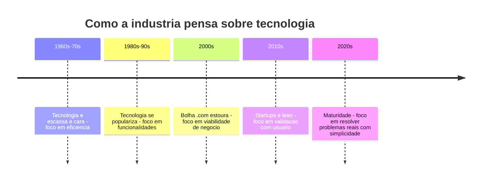
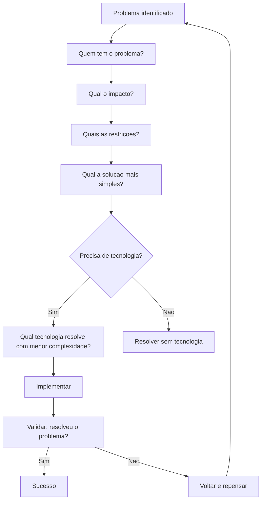
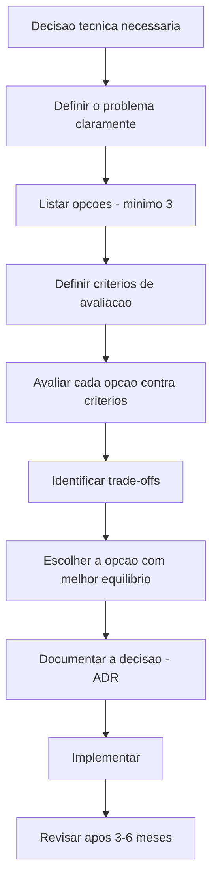
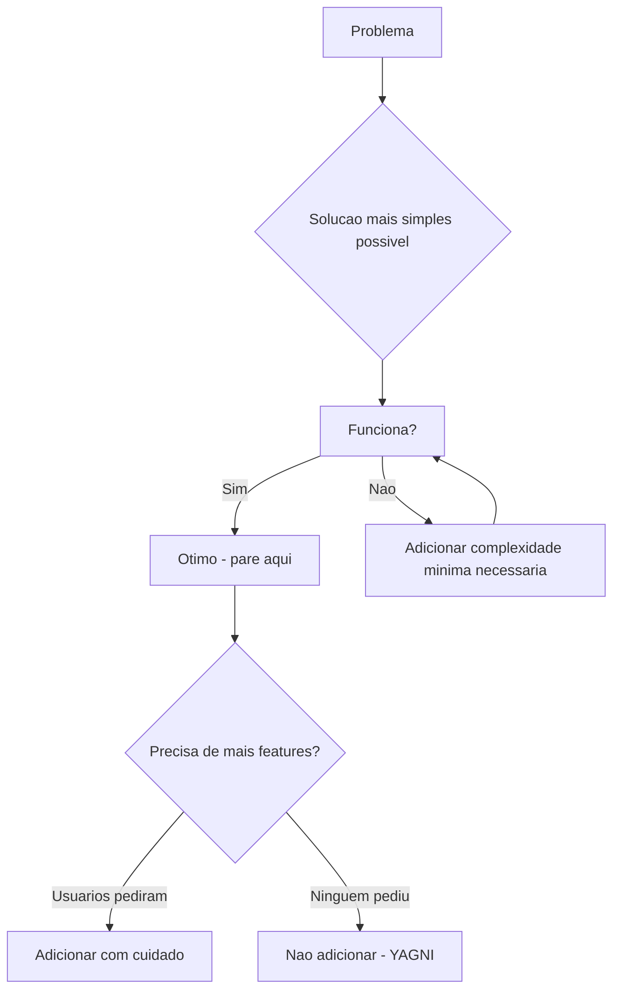

# 12.9 — O Problema que Precisamos Resolver: Tecnologia como Meio, Não como Fim

[← Anterior: Conceitos sobre Ferramentas](cap12-mod08-conceitos-sobre-ferramentas.md) · [Próximo: Curiosidade e Bases Sólidas →](cap12-mod10-curiosidade-bases.md)

---

## Introdução

No módulo anterior, falamos sobre a importância de priorizar conceitos sobre ferramentas. Agora vamos dar um passo além e falar sobre algo ainda mais fundamental: o propósito de tudo que fazemos como profissionais de tecnologia.

Tecnologia não existe por si mesma. Ninguém cria um banco de dados "porque bancos de dados são legais". Ninguém constrói uma API "porque APIs são interessantes". Ninguém escreve código "porque programar é divertido" — bom, talvez um pouco, mas esse não é o ponto.

Tecnologia existe para resolver problemas. Problemas de pessoas reais, de empresas reais, do mundo real. E o profissional de tecnologia que nunca perde isso de vista é infinitamente mais valioso do que aquele que se apaixona pela tecnologia e esquece do problema.

Este módulo é sobre manter o foco no que realmente importa: o problema que precisamos resolver.

Pode parecer estranho que um curso de tecnologia dedique um módulo inteiro a dizer "não se apaixone pela tecnologia". Mas essa é uma das lições mais valiosas que você pode aprender — e quanto mais cedo aprender, melhor. Profissionais que mantêm o foco no problema são mais eficazes, mais valorizados e mais satisfeitos com seu trabalho.

---

## A Evolução do Pensamento sobre Tecnologia

A indústria levou décadas para aprender que tecnologia por si só não gera valor. O valor vem de resolver problemas reais para pessoas reais. A tecnologia é apenas o meio.

---

## A Armadilha da Paixão pela Tecnologia

Paixão por tecnologia é ótima — é provavelmente o que te trouxe até aqui. Mas paixão sem direção pode se tornar um problema.

Desenvolvedores apaixonados por tecnologia frequentemente caem em armadilhas:

- **Over-engineering**: construir uma solução complexa para um problema simples. Usar microserviços, Kubernetes e event sourcing para um sistema que atende 50 usuários e caberia em um monolito com SQLite.

- **Tecnologia da moda**: escolher a ferramenta mais nova e hypada em vez da mais adequada para o problema. "Vamos usar blockchain!" — para quê? "Vamos usar IA!" — para resolver qual problema?

- **Solução em busca de problema**: ter uma tecnologia favorita e tentar encaixá-la em todo lugar. "Eu sei usar Redis, então vamos colocar Redis nesse projeto" — mesmo que o projeto não precise de cache.

- **Complexidade desnecessária**: adicionar camadas, abstrações e padrões que não são necessários. Cada camada de complexidade tem um custo — em tempo de desenvolvimento, em manutenção, em bugs potenciais.

### Exemplos Reais de Armadilhas

**Caso 1 — A startup que usou microserviços desde o dia 1:**
Uma startup de 3 pessoas decidiu usar microserviços, Kubernetes, event sourcing e CQRS para construir um MVP. Resultado: 6 meses de desenvolvimento para algo que poderia ter sido feito em 6 semanas com um monolito simples. Quando finalmente lançaram, o mercado já tinha mudado e o produto não era mais relevante. A tecnologia era impressionante — mas não resolveu o problema a tempo.

**Caso 2 — A empresa que reescreveu tudo em Rust:**
Uma empresa com um sistema funcional em Python decidiu reescrever tudo em Rust "porque é mais rápido". O sistema Python atendia 500 usuários com tempo de resposta de 200ms. Depois de 1 ano de reescrita, o sistema Rust atendia os mesmos 500 usuários com tempo de resposta de 50ms. Nenhum usuário percebeu a diferença. A empresa gastou 1 ano e centenas de milhares de reais para resolver um problema que não existia.

**Caso 3 — O desenvolvedor que usou blockchain para tudo:**
Um desenvolvedor propôs usar blockchain para um sistema de controle de estoque interno. Quando perguntaram "por quê?", a resposta foi "porque blockchain é o futuro". O problema real (controlar estoque) não precisava de descentralização, imutabilidade ou consenso distribuído — precisava de um banco de dados simples com controle de acesso. A solução com blockchain seria 100x mais complexa e lenta, sem nenhum benefício real.

### O Teste da Pergunta Simples

Antes de qualquer decisão técnica, faça a pergunta mais simples e mais poderosa que existe:

**"Qual problema isso resolve?"**

Se a resposta não for clara e específica, pare e pense. Se a resposta for "é uma boa prática", pergunte de novo: "Boa prática para resolver qual problema?" Se a resposta for "todo mundo está usando", pergunte: "Todo mundo tem o mesmo problema que eu?"

Essa pergunta não é anti-tecnologia — é pró-racionalidade. Ela garante que cada decisão técnica tem uma justificativa real, não apenas uma preferência pessoal ou uma tendência de mercado.

---

## Tecnologia é um Meio

Pense em tecnologia como um martelo. Um martelo é uma ferramenta excelente — para pregar pregos. Mas se o seu problema é apertar um parafuso, o martelo não é a resposta, por melhor que seja.

O profissional de tecnologia maduro não começa pela ferramenta — começa pelo problema:

1. **Qual é o problema?** Descreva sem mencionar tecnologia
2. **Quem tem esse problema?** Pessoas reais com necessidades reais
3. **Qual o impacto de resolver?** O que muda quando o problema é resolvido
4. **Quais são as restrições?** Tempo, dinheiro, equipe, infraestrutura existente
5. **Qual a solução mais simples que funciona?** Não a mais elegante, não a mais moderna — a mais simples que resolve

### A Técnica dos 5 Porquês

Uma técnica poderosa para chegar ao problema real é os **5 Porquês** (5 Whys), criada por Sakichi Toyoda na Toyota:

1. "O sistema está lento" → Por quê?
2. "O banco de dados demora para responder" → Por quê?
3. "As queries não usam índices" → Por quê?
4. "Ninguém criou índices nas tabelas" → Por quê?
5. "Não temos processo de revisão de performance" → **Este é o problema real**

Sem os 5 Porquês, a solução seria "migrar para um banco mais rápido" (tecnologia). Com os 5 Porquês, a solução é "criar processo de revisão de performance e adicionar índices" (processo + conceito). Muito mais simples, muito mais eficaz.

### Problemas vs Sintomas

Uma armadilha comum é confundir sintomas com problemas:

| Sintoma | Problema real |
|---------|-------------|
| O sistema esta lento | Queries sem indice, N+1 queries, falta de cache |
| Usuarios reclamam da interface | Fluxo confuso, muitos cliques para completar tarefa |
| Muitos bugs em producao | Falta de testes, code review superficial |
| Equipe nao entrega no prazo | Escopo mal definido, interrupcoes constantes |
| Codigo dificil de manter | Falta de arquitetura, divida tecnica acumulada |

Tratar o sintoma (comprar servidor mais potente) em vez do problema (queries sem índice) é como tomar analgésico para dor de dente em vez de ir ao dentista. Alivia temporariamente, mas o problema continua — e piora.

### O Problema por Trás do Pedido

Muitas vezes, quando alguém pede uma funcionalidade, o problema real é diferente do que parece:

- "Preciso de um relatório em PDF" → O problema real pode ser: "Preciso compartilhar dados com alguém que não tem acesso ao sistema"
- "Preciso de um app mobile" → O problema real pode ser: "Preciso acessar o sistema fora do escritório" (um site responsivo pode resolver)
- "Preciso de um dashboard em tempo real" → O problema real pode ser: "Preciso saber quando algo dá errado" (um alerta por e-mail pode resolver)

A habilidade de identificar o problema real por trás do pedido é uma das mais valiosas que um desenvolvedor pode ter. Pergunte "por quê?" até chegar ao problema real — e muitas vezes a solução será mais simples do que o pedido original.

Só depois de responder essas perguntas é que a tecnologia entra na conversa. E muitas vezes, a melhor solução técnica é a mais simples — não a mais sofisticada.

Esse fluxo parece óbvio, mas é surpreendente quantos projetos pulam direto para "qual tecnologia usar?" sem passar pelas perguntas anteriores. O resultado é software tecnicamente impressionante que não resolve o problema de ninguém.

### Simplicidade como Virtude

Existe uma frase atribuída a Albert Einstein: "Tudo deve ser feito da forma mais simples possível, mas não mais simples que isso." Em software, isso se traduz em:

- Prefira soluções simples que funcionam a soluções complexas que impressionam
- Cada linha de código é um custo de manutenção — menos código é melhor
- Cada dependência é um risco — menos dependências é melhor
- Cada camada de abstração é uma barreira para entendimento — menos camadas é melhor (até o ponto onde a simplicidade começa a prejudicar)

O código mais fácil de manter é o código que não existe. Antes de escrever código, pergunte: "Preciso mesmo resolver isso com código? Existe uma solução mais simples?"

### Exemplos de Simplicidade que Venceu

| Problema | Solucao complexa | Solucao simples que venceu |
|----------|-----------------|--------------------------|
| Compartilhar arquivos | Sistema de file sharing com sync, versioning, conflitos | Dropbox: uma pasta que sincroniza |
| Comunicacao em equipe | Suite completa com video, chat, docs, calendario | Slack: chat organizado em canais |
| Hospedagem de sites | Servidor dedicado com configuracao manual | Heroku: git push e o site esta no ar |
| Pagamentos online | Integracao bancaria complexa com certificados | Stripe: uma API simples |
| Busca na internet | Portal com categorias, diretorio, conteudo editorial | Google: um campo de busca |

Em todos esses casos, a solução que venceu não era a mais sofisticada tecnicamente — era a que resolvia o problema da forma mais simples possível. A simplicidade não é limitação — é vantagem competitiva.

### O Princípio de Gall

John Gall, em seu livro "Systemantics" (1975), formulou um princípio que todo desenvolvedor deveria conhecer:

"Um sistema complexo que funciona invariavelmente evoluiu de um sistema simples que funcionava. Um sistema complexo projetado do zero nunca funciona e não pode ser consertado para funcionar. Você precisa começar de novo com um sistema simples que funciona."

Isso explica por que MVPs funcionam e por que projetos "big bang" (construir tudo de uma vez) frequentemente falham. Comece simples, valide, e evolua. Não tente construir o sistema perfeito de primeira.

### Simplicidade e Manutenibilidade

Código simples é código manutenível. E manutenibilidade é uma das qualidades mais importantes de software — porque software vive muito mais tempo do que as pessoas imaginam.

Considere: o código que você escreve hoje provavelmente vai ser mantido por outra pessoa daqui a 1-2 anos. Essa pessoa pode ser um colega, um substituto, ou até você mesmo (que já esqueceu o contexto). Se o código é simples e claro, a manutenção é fácil. Se é complexo e "esperto", a manutenção é um pesadelo.

Uma regra prática: escreva código como se a pessoa que vai mantê-lo fosse um psicopata violento que sabe onde você mora. Ou seja: escreva código claro, simples e bem documentado.

---

## O Custo Oculto da Complexidade

Complexidade tem custos que nem sempre são óbvios:

### Custo Cognitivo

Cada camada de abstração, cada padrão de design, cada tecnologia no stack exige espaço mental. Desenvolvedores têm capacidade cognitiva limitada — quanto mais complexo o sistema, menos capacidade sobra para resolver o problema real.

Pesquisas em psicologia cognitiva mostram que humanos conseguem manter 7±2 itens na memória de trabalho ao mesmo tempo. Se seu sistema tem 15 camadas de abstração, ninguém consegue ter o quadro completo na cabeça. Isso leva a bugs, decisões ruins e frustração.

### Custo de Comunicação

Sistemas complexos são difíceis de explicar. Se você não consegue explicar a arquitetura do seu sistema em 5 minutos para um colega novo, o sistema é complexo demais. Complexidade dificulta comunicação, e comunicação ruim é uma das principais causas de fracasso em projetos (módulo 12.4).

### Custo de Recrutamento

Quanto mais tecnologias no stack, mais difícil é encontrar pessoas que conheçam todas. Um stack simples (Python + PostgreSQL + Docker) tem um pool de candidatos enorme. Um stack exótico (Elixir + CockroachDB + Nomad + Pulumi) tem um pool minúsculo. Simplicidade no stack facilita contratação.

### Custo de Debugging

Quando algo dá errado em um sistema simples, o problema é fácil de encontrar — há poucos lugares onde pode estar. Quando algo dá errado em um sistema complexo, o problema pode estar em qualquer uma das dezenas de camadas, serviços, filas e configurações. O tempo de debugging cresce exponencialmente com a complexidade.

---

## Decisões Técnicas Racionais

Um dos maiores desafios de um profissional de tecnologia é tomar decisões técnicas de forma racional, sem se deixar levar por emoções, preconceitos ou preferências pessoais.

### O Processo de Decisão Técnica

Decisões técnicas não deveriam ser tomadas por intuição ou preferência pessoal. Deveriam seguir um processo estruturado:

1. **Definir o problema claramente**: o que estamos tentando resolver?
2. **Listar opções**: quais são as alternativas? (mínimo 3)
3. **Definir critérios**: o que importa? Performance? Simplicidade? Custo? Manutenibilidade?
4. **Avaliar cada opção**: como cada alternativa se sai em cada critério?
5. **Identificar trade-offs**: o que ganhamos e perdemos com cada opção?
6. **Decidir**: escolher a opção com melhor equilíbrio para o contexto
7. **Documentar**: registrar a decisão e a justificativa (ADR)
8. **Revisar**: após 3-6 meses, a decisão ainda faz sentido?

### Exemplo de Decisão Estruturada

Problema: "Precisamos de um banco de dados para o novo projeto."

| Criterio | PostgreSQL | MongoDB | SQLite |
|----------|-----------|---------|--------|
| Dados relacionais | Excelente | Limitado | Bom |
| Escalabilidade | Alta | Alta | Baixa |
| Simplicidade de setup | Media | Media | Muito alta |
| Custo de infraestrutura | Medio | Medio | Zero |
| Experiencia da equipe | Alta | Baixa | Media |
| Transacoes ACID | Sim | Limitado | Sim |

Se o projeto é pequeno, com dados relacionais e equipe pequena → SQLite.
Se o projeto é médio, com dados relacionais e precisa de escalabilidade → PostgreSQL.
Se o projeto tem dados não-estruturados e precisa de flexibilidade → MongoDB.

A decisão depende do contexto, não da preferência pessoal. E está documentada para que qualquer pessoa entenda por que foi tomada.

### Vieses Comuns

Vieses cognitivos são atalhos mentais que nosso cérebro usa para tomar decisões rápidas — mas que frequentemente levam a decisões erradas. Em tecnologia, esses vieses são especialmente perigosos porque decisões técnicas têm consequências de longo prazo.

| Vies | O que e | Exemplo em tecnologia | Como combater |
|------|---------|----------------------|--------------|
| Vies de familiaridade | Preferir o que ja conhece | Sempre usar a mesma linguagem, mesmo quando outra seria melhor | Avaliar alternativas objetivamente |
| Vies de novidade | Preferir o que e novo | Adotar framework recem-lancado sem avaliar maturidade | Verificar maturidade, comunidade e estabilidade |
| Vies de autoridade | Seguir o que figuras famosas recomendam | Usar arquitetura X porque um palestrante famoso recomendou | Avaliar se o contexto dele e igual ao seu |
| Vies de confirmacao | Buscar informações que confirmam sua opiniao | Pesquisar apenas artigos que elogiam a tecnologia que você ja escolheu | Buscar ativamente argumentos contra sua escolha |
| Efeito manada | Fazer o que todos estao fazendo | Adotar microservicos porque todas as empresas grandes usam | Avaliar se seu contexto justifica |
| Sunk cost fallacy | Continuar investindo porque ja investiu muito | Manter tecnologia ruim porque ja gastou meses implementando | Avaliar o custo futuro, nao o passado |
| Anchoring | Fixar na primeira informacao recebida | Estimar prazo baseado na primeira impressao, sem analise | Decompor o problema antes de estimar |
| Dunning-Kruger | Superestimar competencia em areas que conhece pouco | Achar que sabe configurar seguranca porque leu um artigo | Reconhecer limites e buscar especialistas |

### O Viés do Sobrevivente em Tecnologia

Um viés especialmente perigoso em tecnologia é o **viés do sobrevivente**: olhamos para empresas bem-sucedidas e tentamos copiar suas decisões técnicas, sem considerar as milhares de empresas que tomaram as mesmas decisões e falharam.

"O Netflix usa microserviços, então devemos usar microserviços." Mas o Netflix tem 10.000+ engenheiros, bilhões de dólares de receita, e uma década de evolução arquitetural. Sua startup de 5 pessoas não tem o mesmo contexto. As empresas que copiaram a arquitetura do Netflix sem ter o mesmo contexto e falharam não aparecem nos artigos — só os sobreviventes aparecem.

A lição: não copie soluções — entenda problemas. A solução do Netflix resolve o problema do Netflix. Seu problema pode ser diferente e exigir uma solução diferente (provavelmente mais simples).

### Como Decidir Melhor

Para tomar decisões técnicas melhores:

- **Liste as opções**: não se prenda à primeira ideia. Quais são as alternativas?
- **Defina critérios**: o que importa para este problema? Performance? Simplicidade? Custo? Tempo de desenvolvimento? Manutenibilidade?
- **Avalie trade-offs**: toda decisão técnica tem prós e contras. Não existe solução perfeita — existe a melhor solução para o contexto
- **Considere o longo prazo**: a solução mais rápida agora pode ser a mais cara daqui a um ano
- **Peça opiniões diversas**: pessoas com experiências diferentes veem problemas diferentes
- **Documente a decisão**: registre por que escolheu A em vez de B. Seu eu futuro vai agradecer

### Framework de Decisão Técnica

Quando precisar tomar uma decisão técnica importante, use este framework:

### ADRs: Documentando Decisões

No módulo 12.4, mencionamos ADRs (Architecture Decision Records). Eles são especialmente úteis para decisões sobre tecnologia:

| Campo | O que documentar | Exemplo |
|-------|-----------------|---------|
| Contexto | Qual era a situacao | Precisamos de um banco de dados para o projeto X |
| Opcoes consideradas | Quais alternativas avaliamos | PostgreSQL, MongoDB, SQLite |
| Decisao | O que escolhemos | PostgreSQL |
| Justificativa | Por que escolhemos | Dados relacionais, precisa de transacoes ACID, equipe tem experiencia |
| Consequencias | O que muda com essa decisao | Precisa de servidor dedicado, mais complexo que SQLite |
| Status | Aceita, substituida, deprecada | Aceita |

Seis meses depois, quando alguém perguntar "por que usamos PostgreSQL?", a resposta está documentada. Sem ADR, a resposta seria "não sei, já estava assim quando cheguei".

---

## Complexidade Essencial vs Acidental

Fred Brooks, em seu artigo clássico "No Silver Bullet" (1986), fez uma distinção fundamental entre dois tipos de complexidade:

**Complexidade essencial**: a complexidade inerente ao problema que estamos resolvendo. Um sistema bancário é complexo porque bancos são complexos — regulamentações, múltiplas moedas, fraudes, conciliação. Essa complexidade não pode ser eliminada — ela existe no problema, não na solução.

**Complexidade acidental**: a complexidade que nós mesmos introduzimos na solução. Usar 5 microserviços para um CRUD simples é complexidade acidental. Criar 10 camadas de abstração para uma funcionalidade direta é complexidade acidental. Essa complexidade pode e deve ser eliminada.

| Tipo | Origem | Pode ser eliminada? | Exemplo |
|------|--------|-------------------|---------|
| Essencial | O problema em si | Nao - faz parte do dominio | Regras de calculo de impostos |
| Acidental | Nossa solucao | Sim - simplificar a solucao | Framework desnecessario, abstracoes excessivas |

O objetivo do bom desenvolvedor é minimizar a complexidade acidental enquanto lida com a complexidade essencial de forma clara e organizada. Quando alguém reclama que "o sistema é muito complexo", a pergunta é: a complexidade é essencial (o problema é complexo) ou acidental (a solução é mais complexa do que deveria)?

### Como Identificar Complexidade Acidental

Sinais de que a complexidade é acidental:

- Você precisa de mais de 5 minutos para explicar a arquitetura de um CRUD simples
- Novos membros da equipe levam semanas para entender o sistema
- Adicionar uma funcionalidade simples requer mudanças em 10+ arquivos
- O sistema tem mais código de infraestrutura do que código de negócio
- Você usa tecnologias que ninguém na equipe domina "porque são melhores"
- O sistema tem configurações que ninguém sabe para que servem

Se você reconhece esses sinais, provavelmente há complexidade acidental que pode ser removida.

---

## Métricas de Valor vs Métricas de Vaidade

Uma armadilha comum é medir o sucesso de um projeto por métricas que parecem impressionantes mas não indicam valor real:

### Métricas de Vaidade (parecem boas, não significam muito)

| Metrica | Por que e vaidade | O que medir em vez disso |
|---------|------------------|------------------------|
| Linhas de codigo escritas | Mais codigo nao e melhor | Problemas resolvidos |
| Numero de features | Mais features nao e melhor | Features que usuarios realmente usam |
| Tecnologias no stack | Mais tecnologias nao e melhor | Problemas que o stack resolve |
| Horas trabalhadas | Mais horas nao e mais produtivo | Valor entregue por unidade de tempo |
| Numero de deploys | Mais deploys nao e melhor se nao entregam valor | Impacto de cada deploy |
| Cobertura de testes | 100% de cobertura nao garante qualidade | Bugs encontrados em producao |

### Métricas de Valor (indicam impacto real)

| Metrica | O que indica | Como medir |
|---------|-------------|-----------|
| Problemas resolvidos | O software esta cumprindo seu proposito | Feedback de usuarios, tickets resolvidos |
| Satisfacao do usuario | Usuarios estao felizes com o produto | NPS, pesquisas, retencao |
| Tempo para resolver problema | Equipe e eficiente | Lead time, cycle time |
| Bugs em producao | Qualidade do software | Taxa de erros, incidentes |
| Custo de manutencao | Sistema e sustentavel | Tempo gasto em manutencao vs features |
| Adocao | Pessoas estao usando | Usuarios ativos, engajamento |

A diferença é sutil mas crucial: métricas de vaidade medem atividade, métricas de valor medem impacto. Um projeto pode ter milhares de linhas de código, dezenas de features e 100% de cobertura de testes — e ainda assim não resolver o problema de ninguém.

---

## A Arte de Dizer "Não" (Expandido)

Dizer "não" é uma das habilidades mais difíceis e mais valiosas em tecnologia. Não porque seja difícil pronunciar a palavra, mas porque a pressão para dizer "sim" é enorme:

- O cliente quer mais uma feature
- O gerente quer entregar mais rápido
- O colega quer usar a tecnologia da moda
- Você mesmo quer experimentar algo novo

Mas cada "sim" tem um custo:

| Cada sim a uma feature | Significa mais codigo para manter, testar e documentar |
|----------------------|------------------------------------------------------|
| Cada sim a uma tecnologia | Significa mais complexidade no stack |
| Cada sim a um prazo apertado | Significa menos qualidade ou mais divida tecnica |
| Cada sim a um escopo maior | Significa mais tempo ate entregar valor |

Profissionais maduros sabem que dizer "não" (ou "ainda não" ou "vamos validar primeiro") é um ato de responsabilidade, não de negatividade. É proteger o projeto de complexidade desnecessária e manter o foco no que realmente importa.

### Como Dizer "Não" de Forma Construtiva

Dizer "não" não significa ser rude ou inflexível. Significa redirecionar a conversa para o problema:

- Em vez de "Não, não vamos fazer isso" → "Qual problema essa feature resolve? Existe uma forma mais simples de resolver?"
- Em vez de "Não, essa tecnologia é ruim" → "Quais são os trade-offs? O que ganhamos e o que perdemos?"
- Em vez de "Não, não dá tempo" → "Com esse prazo, o que conseguimos entregar com qualidade? O que fica para a próxima versão?"

O "não" construtivo sempre volta para o problema. E quando o problema é claro, a decisão se torna mais fácil para todos.

---

## Tecnologia e Propósito

Uma reflexão final: por que você quer trabalhar com tecnologia? Se a resposta é "porque gosto de programar" — ótimo, mas não é suficiente. Programar é o meio. O propósito é resolver problemas que importam.

Os profissionais mais realizados em tecnologia são aqueles que encontram problemas que os motivam:

- Alguém que trabalha em healthtech porque quer melhorar o acesso à saúde
- Alguém que trabalha em edtech porque quer democratizar a educação
- Alguém que trabalha em fintech porque quer incluir pessoas no sistema financeiro
- Alguém que trabalha em sustentabilidade porque quer reduzir o impacto ambiental

Você não precisa salvar o mundo. Mas ter clareza sobre qual problema quer resolver — mesmo que seja "ajudar pequenas empresas a gerenciar seus produtos" — dá direção e significado ao seu trabalho.

Tecnologia é uma das ferramentas mais poderosas que a humanidade já criou. Use-a para resolver problemas que importam.

---

## O Valor de Dizer "Não"

Uma habilidade subestimada em tecnologia é saber dizer "não". Não a tudo — mas a coisas que não resolvem o problema ou que adicionam complexidade sem valor.

- "Vamos adicionar essa feature?" — Ela resolve qual problema do usuário?
- "Vamos migrar para essa tecnologia?" — Qual problema da tecnologia atual estamos resolvendo?
- "Vamos refatorar esse módulo?" — Qual problema concreto a refatoração resolve?

Dizer "não" (ou "ainda não" ou "precisamos entender melhor") não é ser negativo — é ser responsável. Cada "sim" tem um custo em tempo, complexidade e manutenção. Profissionais maduros sabem que o recurso mais escasso não é tecnologia — é tempo e atenção.

### O Custo Invisível do "Sim"

Cada funcionalidade que você adiciona ao sistema tem custos que vão muito além do tempo de desenvolvimento:

| Custo | Descricao | Exemplo |
|-------|-----------|---------|
| Desenvolvimento | Tempo para implementar | 2 semanas de trabalho |
| Testes | Tempo para testar a feature e regressao | 3 dias de testes |
| Documentacao | Tempo para documentar | 1 dia |
| Manutencao | Tempo para manter ao longo dos anos | Horas por mes, indefinidamente |
| Complexidade | Impacto na compreensao do sistema | Novos membros demoram mais para entender |
| Bugs | Mais codigo, mais bugs potenciais | 1-2 bugs por feature em media |
| Suporte | Usuarios com duvidas sobre a feature | Tickets de suporte |
| Oportunidade | Tempo que poderia ser usado em algo mais valioso | Feature mais importante adiada |

Quando você soma todos esses custos, muitas features que parecem "simples" na verdade são caras. E muitas não justificam o investimento — porque resolvem problemas que poucos usuários têm, ou que podem ser resolvidos de formas mais simples.

### A Regra do 80/20 (Princípio de Pareto)

O Princípio de Pareto se aplica perfeitamente a software: 80% dos usuários usam 20% das funcionalidades. Isso significa que 80% das funcionalidades são usadas por apenas 20% dos usuários — ou por ninguém.

Implicações práticas:
- Foque nos 20% de funcionalidades que 80% dos usuários precisam
- Antes de adicionar uma feature, pergunte: "Quantos usuários vão usar isso?"
- Funcionalidades pouco usadas ainda custam manutenção — considere removê-las
- Um produto com 10 funcionalidades excelentes é melhor que um com 100 funcionalidades mediocres

### Bikeshedding: O Perigo das Decisões Triviais

**Bikeshedding** (ou Lei da Trivialidade de Parkinson) é o fenômeno onde equipes gastam tempo desproporcional em decisões triviais e pouco tempo em decisões importantes.

Exemplo clássico: a equipe gasta 2 horas discutindo a cor do botão de login e 5 minutos decidindo a arquitetura do banco de dados. A cor do botão é fácil de opinar (todo mundo tem opinião sobre cores). A arquitetura do banco é complexa (poucos se sentem confiantes para opinar).

Para combater bikeshedding:
- Defina um limite de tempo para decisões triviais (5 minutos)
- Use votação rápida para decisões de baixo impacto
- Reserve tempo adequado para decisões de alto impacto
- Quando a discussão se prolongar em algo trivial, pergunte: "Qual o impacto real dessa decisão?"

---

## Entregando Valor

No final do dia, o que importa não é qual tecnologia você usou, quantas linhas de código escreveu, ou quão elegante é sua arquitetura. O que importa é: você resolveu o problema? Você entregou valor?

"Valor" pode significar coisas diferentes:

- Para o usuário: o sistema funciona, é rápido, é fácil de usar
- Para a empresa: o sistema gera receita, reduz custos, melhora processos
- Para a equipe: o código é manutenível, testável, compreensível
- Para você: o projeto te ensinou algo, te desafiou, te fez crescer

### Como Medir Valor

Valor é mais difícil de medir do que atividade. Mas existem formas:

| Pergunta | Como responder |
|----------|---------------|
| O software resolve o problema? | Feedback de usuarios, metricas de uso |
| Os usuarios estao satisfeitos? | NPS, pesquisas, taxa de retencao |
| O negocio esta melhor? | Receita, reducao de custos, eficiencia |
| A equipe esta saudavel? | Velocidade de entrega, satisfacao, turnover |
| O sistema e sustentavel? | Custo de manutencao, frequencia de bugs, facilidade de mudanca |

Se as respostas são positivas, você está entregando valor. Se não, precisa repensar — não a tecnologia, mas o problema que está resolvendo e como está resolvendo.

### O Teste Final

Antes de qualquer decisão técnica, faça o teste final:

"Se eu explicar essa decisão para alguém que não é técnico — meu chefe, meu cliente, minha mãe — ela faz sentido? Consigo explicar qual problema resolve e por que essa é a melhor forma de resolver?"

Se a resposta é sim, provavelmente é uma boa decisão. Se a resposta é "é complicado de explicar" ou "é uma boa prática", provavelmente precisa repensar.

O profissional que foca em entregar valor — em vez de focar em tecnologia pela tecnologia — é o profissional que cresce, que é promovido, que é respeitado, e que constrói coisas que realmente importam.

---

## Casos de Uso no Mundo Real

### Basecamp: Simplicidade como Vantagem Competitiva

O Basecamp é uma ferramenta de gestão de projetos que compete com gigantes como Jira, Asana e Monday. Enquanto os concorrentes adicionam funcionalidades constantemente (tornando-se cada vez mais complexos), o Basecamp mantém o foco em simplicidade. A empresa tem menos de 100 funcionários, é lucrativa sem investimento externo, e atende milhões de usuários. O fundador, Jason Fried, é famoso por dizer: "A melhor funcionalidade é a que você não constrói." O Basecamp é um exemplo vivo de que focar no problema (gestão simples de projetos) em vez da tecnologia (features infinitas) pode ser uma vantagem competitiva enorme.

### Craigslist: O Site "Feio" que Funciona

O Craigslist é um dos sites mais visitados do mundo — e um dos mais "feios". O design não mudou significativamente desde os anos 90. Não tem app nativo, não tem IA, não tem blockchain, não tem nada da moda. Mas resolve o problema (classificados online) de forma tão eficaz que sobrevive há mais de 25 anos enquanto concorrentes com tecnologia muito mais sofisticada vêm e vão. O Craigslist é a prova de que resolver o problema certo é mais importante do que usar a tecnologia certa.

### Google Search: Começou Simples

Quando Larry Page e Sergey Brin criaram o Google em 1998, a página inicial era (e ainda é) absurdamente simples: um campo de busca e dois botões. Enquanto concorrentes como Yahoo e AltaVista enchiam suas páginas de conteúdo, links e funcionalidades, o Google focou no problema: "o usuário quer encontrar algo na internet". A simplicidade da interface refletia a clareza do foco no problema. Hoje o Google é a empresa mais valiosa do mundo — não por ter a tecnologia mais sofisticada, mas por resolver o problema certo de forma excepcional.

---

## Over-Engineering: O Inimigo Silencioso

Over-engineering merece uma seção dedicada porque é um dos problemas mais comuns e mais destrutivos no desenvolvimento de software. É quando você constrói uma solução mais complexa do que o problema exige.

### Sinais de Over-Engineering

| Sinal | Exemplo | Alternativa simples |
|-------|---------|-------------------|
| Microservicos para app pequeno | 5 servicos para um CRUD com 100 usuarios | Monolito simples |
| Banco NoSQL sem necessidade | MongoDB para dados puramente relacionais | PostgreSQL ou SQLite |
| Cache sem necessidade | Redis para dados que mudam a cada requisicao | Sem cache |
| Message queue sem necessidade | RabbitMQ para comunicacao sincrona entre 2 servicos | Chamada HTTP direta |
| Kubernetes para 1 container | Cluster K8s para rodar 1 aplicacao | Docker Compose ou deploy direto |
| Abstracoes excessivas | 5 camadas de interfaces para 1 implementacao | Interface so quando tem 2+ implementacoes |

### O Custo Real do Over-Engineering

Over-engineering não é "apenas" complexidade desnecessária. Tem custos reais:

- **Tempo de desenvolvimento**: construir algo complexo leva mais tempo do que algo simples
- **Tempo de onboarding**: novos membros da equipe demoram mais para entender o sistema
- **Bugs**: mais código = mais bugs. Cada camada de abstração é uma oportunidade para erros
- **Manutenção**: código complexo é mais difícil e caro de manter
- **Performance**: abstrações têm overhead. Às vezes, a solução "elegante" é mais lenta que a simples
- **Custo de infraestrutura**: microserviços, message queues e clusters custam dinheiro

### A Regra do YAGNI

**YAGNI** (You Ain't Gonna Need It — Você Não Vai Precisar Disso) é um princípio que combate o over-engineering. A ideia é: não implemente algo até que seja realmente necessário. Não crie abstrações "para o futuro". Não adicione funcionalidades "porque talvez alguém precise".

A tentação é grande: "E se no futuro precisarmos de múltiplos bancos de dados? Melhor criar uma abstração agora." Mas na maioria das vezes, o futuro não chega como você imaginou. E quando chega, o contexto é diferente do que você previu, e a abstração que criou não serve.

É mais barato e mais seguro implementar a solução simples agora e refatorar quando (e se) a necessidade real aparecer. Com testes sólidos (módulo 12.1), refatorar é seguro e rápido.

---

## Simplicidade na Prática

Simplicidade não é fácil. Na verdade, criar soluções simples é mais difícil do que criar soluções complexas. Como disse Blaise Pascal: "Eu teria escrito uma carta mais curta, mas não tive tempo."

### Princípios de Simplicidade em Software

| Principio | O que significa | Exemplo |
|-----------|----------------|---------|
| Menos codigo e melhor | Cada linha de codigo e um custo de manutencao | Deletar codigo desnecessario |
| Menos dependencias e melhor | Cada dependencia e um risco | Usar stdlib quando possivel |
| Menos abstracoes e melhor | Cada camada e uma barreira para entendimento | Abstrair so quando necessario |
| Menos configuracao e melhor | Cada opcao e uma decisao que alguem precisa tomar | Defaults sensatos |
| Menos features e melhor | Cada feature e codigo para manter | Foco no essencial |

### O Paradoxo da Simplicidade

Existe um paradoxo: sistemas simples são mais difíceis de projetar do que sistemas complexos. Qualquer pessoa pode adicionar complexidade — basta adicionar mais código, mais camadas, mais configurações. Mas remover complexidade requer entendimento profundo do problema e coragem para dizer "não" a funcionalidades desnecessárias.

Steve Jobs era famoso por isso: "Simplicidade é a sofisticação máxima." O iPhone original não tinha copiar/colar, não tinha multitarefa, não tinha app store. Mas fazia o essencial de forma excepcional. As funcionalidades foram adicionadas depois, quando ficou claro que eram necessárias — não antes, "por precaução".

---

## Pensamento de Primeiro Princípio

Uma abordagem poderosa para focar no problema é o **pensamento de primeiro princípio** (first principles thinking), popularizado por Elon Musk mas usado por cientistas e engenheiros há séculos.

A ideia é: em vez de raciocinar por analogia ("todo mundo faz assim, então vou fazer igual"), decomponha o problema até seus elementos fundamentais e raciocine a partir deles.

Exemplo em software:
- **Raciocínio por analogia**: "Todas as empresas grandes usam microserviços, então devemos usar microserviços"
- **Primeiro princípio**: "Nosso problema é que o deploy de uma parte do sistema não deveria afetar outras partes. Microserviços resolvem isso, mas um monolito modular com deploy independente por módulo também resolve — com muito menos complexidade"

O pensamento de primeiro princípio te liberta de seguir tendências cegamente e te permite encontrar soluções que realmente se encaixam no seu contexto.

---

## O Papel da Empatia

Focar no problema requer empatia — a capacidade de se colocar no lugar de quem tem o problema. Desenvolvedores que nunca conversam com usuários tendem a construir soluções que fazem sentido para desenvolvedores, não para usuários.

Práticas que desenvolvem empatia:
- **Conversar com usuários**: não apenas ler requisitos — conversar, ouvir, observar
- **Usar o próprio produto**: se você constrói um sistema, use-o. Sinta as dores que os usuários sentem
- **Suporte ao cliente**: passar um dia respondendo tickets de suporte muda completamente sua perspectiva
- **Testes de usabilidade**: observar alguém usando seu sistema pela primeira vez é revelador (e humilhante)

A empatia não é apenas uma qualidade humana — é uma habilidade profissional que te torna um desenvolvedor melhor. Quando você entende o problema do ponto de vista de quem o tem, suas soluções são mais eficazes.

No próximo módulo, vamos falar sobre curiosidade e bases sólidas — duas qualidades que, combinadas com o foco no problema, formam a fundação de uma carreira longa e bem-sucedida em tecnologia.

---

## Como a IA pode te ajudar aqui
**Prompt 1 — Pedir ajuda prática:**
> "Estou considerando usar [tecnologia X] no meu projeto. Me ajude a avaliar se é a escolha certa: o problema é [descreva], as restrições são [descreva]."

**Prompt 2 — Explorar o conceito:**
> "Tenho um problema [descreva]. Qual seria a solução mais simples que funciona, sem over-engineering?"

**Prompt 3 — Comparar alternativas:**
> "Me ajude a listar os trade-offs entre [opção A] e [opção B] para resolver [problema]."

## Resumo do Módulo

| Conceito | Definição |
|----------|-----------|
| Tecnologia como meio | Tecnologia existe para resolver problemas, não como fim em si mesma |
| Over-engineering | Construir solução mais complexa do que o problema exige |
| Simplicidade | Preferir a solução mais simples que resolve o problema |
| Decisao racional | Escolher tecnologia com base em critérios objetivos, não emocoes |
| Trade-off | Compromisso entre vantagens e desvantagens de cada opcao |
| Entrega de valor | O que importa e resolver o problema, não a tecnologia usada |
| YAGNI | Nao implementar algo ate que seja realmente necessario |
| Complexidade essencial | Complexidade inerente ao problema, nao pode ser eliminada |
| Complexidade acidental | Complexidade introduzida pela solucao, pode ser eliminada |
| 5 Porques | Tecnica de perguntar por que repetidamente para chegar ao problema real |
| Vies cognitivo | Atalho mental que pode levar a decisoes erradas |
| Vies do sobrevivente | Olhar apenas para casos de sucesso, ignorando fracassos |
| Metricas de vaidade | Metricas que parecem boas mas nao indicam valor real |
| Metricas de valor | Metricas que indicam impacto real no problema resolvido |
| Principio de Gall | Sistemas complexos que funcionam evoluiram de sistemas simples |
| Primeiro principio | Raciocinar a partir dos elementos fundamentais do problema |

---

## Glossário do Módulo

| Termo | Definição |
|-------|-----------|
| Bias - Vies | Tendência inconsciente que influencia decisoes |
| Complexity - Complexidade | Grau de dificuldade de entender e manter um sistema |
| Over-engineering | Criar solução mais complexa do que necessário |
| Simplicity - Simplicidade | Qualidade de ser fácil de entender e manter |
| Trade-off | Compromisso entre opcoes com vantagens e desvantagens diferentes |
| Value delivery - Entrega de valor | Resolver o problema real do usuario ou da empresa |
| YAGNI - You Aint Gonna Need It | Principio de não implementar algo ate que seja realmente necessário |
| Essential complexity | Complexidade inerente ao problema, nao pode ser eliminada |
| Accidental complexity | Complexidade introduzida pela solucao, pode e deve ser eliminada |
| First principles thinking | Raciocinar a partir dos elementos fundamentais do problema |
| Survivorship bias | Vies de olhar apenas para casos de sucesso, ignorando fracassos |
| Sunk cost fallacy | Continuar investindo porque ja investiu muito, ignorando custo futuro |
| Dunning-Kruger effect | Superestimar competencia em areas que conhece pouco |
| Anchoring | Fixar na primeira informacao recebida ao tomar decisoes |
| ADR - Architecture Decision Record | Documento que registra decisoes de arquitetura e suas justificativas |
| Vanity metrics | Metricas que parecem impressionantes mas nao indicam valor real |
| Value metrics | Metricas que indicam impacto real no problema resolvido |
| No Silver Bullet | Artigo de Fred Brooks sobre a inexistencia de solucao magica em software |
| Empathy - Empatia | Capacidade de se colocar no lugar de quem tem o problema |
| NPS - Net Promoter Score | Metrica de satisfacao do usuario |
| 5 Whys - 5 Porques | Tecnica de perguntar por que repetidamente para chegar a causa raiz |
| Galls Law - Principio de Gall | Sistemas complexos funcionais evoluiram de sistemas simples |
| Cognitive load | Carga cognitiva, quantidade de informacao que o cerebro processa |
| Scope creep | Crescimento descontrolado do escopo de um projeto |
| Gold plating | Adicionar funcionalidades que ninguem pediu |
| Analysis paralysis | Planejar tanto que nunca comeca a construir |
| Bikeshedding | Gastar tempo desproporcional em decisoes triviais |
| Technical debt | Divida tecnica, custo futuro de decisoes rapidas |
| Lean | Filosofia de eliminar desperdicio e focar no valor |
| MVP | Produto Minimo Viavel, versao mais simples que resolve o problema |
| Build-Measure-Learn | Ciclo de construir, medir e aprender do Lean Startup |
| Occams Razor | Principio de que a explicacao mais simples e geralmente a correta |
| Pareto Principle | 80% dos resultados vem de 20% das causas |
| Bikeshedding | Gastar tempo desproporcional em decisoes triviais |
| Parkinsons Law of Triviality | Organizacoes dao atencao desproporcional a assuntos triviais |
| Root cause analysis | Analise de causa raiz, encontrar o problema real |
| Symptom vs Problem | Distinguir entre o que aparece e o que realmente causa |
| Constructive no | Dizer nao de forma que redireciona para o problema real |
| Cost of delay | Custo de adiar uma decisao ou entrega |
| Opportunity cost | Custo do que voce deixa de fazer ao escolher uma opcao |
| Satisficing | Escolher a opcao boa o suficiente em vez de buscar a perfeita |

---

## Na Cultura Popular

- **Moneyball — O Homem que Mudou o Jogo** (filme, 2011) — Billy Beane revolucionou o baseball ao focar em dados e resultados em vez de tradição e intuição. A mensagem é clara: foque no que realmente importa (vencer jogos), não no que parece importante (jogadores bonitos). Em tecnologia, foque no problema, não na ferramenta bonita.

- **The Goal — A Meta** (livro, 1984) — Eliyahu Goldratt escreveu um romance sobre gestão de fábrica que se tornou referência em gestão de projetos. O conceito central — identificar o gargalo real e focar nele — se aplica perfeitamente a decisões técnicas: qual é o problema real? Não o problema que parece existir, mas o que realmente limita o resultado.

- **The Lean Startup** (livro, 2011) — Eric Ries popularizou o conceito de MVP e o ciclo Construir-Medir-Aprender. A mensagem central é: não construa o produto perfeito — construa o mínimo necessário para validar se está resolvendo o problema certo. Depois evolua com base em dados reais.

- **Steve Jobs** (filme, 2015) — O filme mostra a obsessão de Jobs por simplicidade e foco. Quando voltou à Apple em 1997, a empresa tinha dezenas de produtos. Jobs cortou para 4. Essa decisão de "dizer não" a produtos que não resolviam problemas claros salvou a empresa da falência.

- **Jiro Dreams of Sushi** (documentário, 2011) — Jiro Ono faz sushi há mais de 70 anos. Ele não se preocupa com tendências gastronômicas — foca obsessivamente em resolver um problema: fazer o melhor sushi possível. A simplicidade e o foco no essencial são a base da sua excelência.

---

## Para Saber Mais

- [Teach Yourself Programming in Ten Years — Peter Norvig](https://norvig.com/21-days.html) — *Artigo clássico sobre aprender programação de verdade, focando em conceitos e resolução de problemas*
- [Simple Made Easy — Rich Hickey](https://www.infoq.com/presentations/Simple-Made-Easy/) — *Palestra influente sobre a diferença entre simples e fácil, e por que simplicidade importa*
- [The Twelve-Factor App](https://12factor.net/pt_br/) — *Metodologia para construir aplicações modernas com foco em simplicidade e boas práticas, em português*
- [No Silver Bullet — Fred Brooks](http://worrydream.com/refs/Brooks-NoSilverBullet.pdf) — *Artigo clássico de 1986 sobre por que não existe solução mágica em engenharia de software*
- [The Goal — Eliyahu Goldratt](https://www.amazon.com/Goal-Process-Ongoing-Improvement/dp/0884271951) — *Romance sobre gestão que ensina a identificar e focar no gargalo real — aplicável a decisões técnicas*
- [Getting Real — Basecamp](https://basecamp.com/gettingreal) — *Livro gratuito online sobre como construir software simples e focado, pela equipe do Basecamp*
- [It Doesn't Have to Be Crazy at Work — Basecamp](https://basecamp.com/books/calm) — *Livro sobre como trabalhar com calma e foco, resistindo à pressão por complexidade*
- [Thinking, Fast and Slow — Daniel Kahneman](https://www.amazon.com/Thinking-Fast-Slow-Daniel-Kahneman/dp/0374533555) — *Livro sobre vieses cognitivos e como eles afetam nossas decisões — aplicável a decisões técnicas*
- [Fabio Akita — Simplicidade](https://www.youtube.com/@Akitando) — *Canal brasileiro com vídeos profundos sobre por que simplicidade importa em software*

---

## Perguntas Frequentes (FAQ)

**P: Isso significa que não devo me empolgar com tecnologia nova?**
R: Pode se empolgar, sim. Curiosidade é uma qualidade. Mas na hora de decidir o que usar em um projeto real, deixe a empolgação de lado e avalie racionalmente.

**P: Como sei se estou fazendo over-engineering?**
R: Se você está resolvendo problemas que ainda não existem, adicionando camadas "para o futuro", ou usando padrões complexos para problemas simples, provavelmente está. Pergunte: "Preciso disso agora?"

**P: Simplicidade não significa código ruim?**
R: Não. Simplicidade é o oposto de código ruim. Código simples é claro, legível, fácil de entender e de manter. Código complexo desnecessariamente é que é ruim.

**P: E se o cliente pedir algo que não faz sentido tecnicamente?**
R: Seu papel é entender o problema por trás do pedido. Muitas vezes o cliente pede uma solução específica, mas o problema real é outro. Pergunte "por quê?" até chegar ao problema real.

**P: Como equilibrar simplicidade com preparação para o futuro?**
R: O princípio YAGNI (You Ain't Gonna Need It) ajuda: não implemente algo até que seja realmente necessário. Projete para ser extensível (interfaces, separação de responsabilidades), mas implemente apenas o que precisa agora.

**P: Todo mundo na empresa quer usar a tecnologia da moda. Como resistir?**
R: Com dados e argumentos. Mostre os trade-offs, os custos, os riscos. Proponha uma prova de conceito pequena antes de adotar em larga escala. Decisões baseadas em evidências são mais difíceis de contestar.

**P: Isso se aplica a projetos pessoais também?**
R: Em projetos pessoais, você tem mais liberdade para experimentar. É um ótimo lugar para testar tecnologias novas. Mas mesmo em projetos pessoais, definir o problema antes de escolher a tecnologia te ajuda a focar e terminar.

**P: O que é YAGNI?**
R: "You Ain't Gonna Need It" — você não vai precisar disso. É um princípio que diz: não implemente funcionalidades ou abstrações até que sejam realmente necessárias. Combate o over-engineering.

**P: Simplicidade não limita o crescimento do sistema?**
R: Não, se feita corretamente. Simplicidade não significa rigidez — significa ausência de complexidade desnecessária. Um sistema simples e bem estruturado (com interfaces, separação de responsabilidades) pode crescer facilmente. Um sistema over-engineered é mais difícil de evoluir porque a complexidade atrapalha.

**P: Como convencer a equipe a escolher a solução simples?**
R: Com dados e argumentos. Mostre o custo da complexidade (tempo de desenvolvimento, manutenção, bugs). Proponha a solução simples como MVP e evolua se necessário. Pergunte: "Qual problema a solução complexa resolve que a simples não resolve?"

**P: E se o cliente insistir em uma solução complexa?**
R: Entenda o problema por trás do pedido. Muitas vezes o cliente pede uma solução específica, mas o problema real é outro. Pergunte "por quê?" até chegar ao problema real. Depois proponha a solução mais simples que resolve esse problema.

**P: Over-engineering é sempre ruim?**
R: Quase sempre. A exceção é quando você tem certeza absoluta de que a complexidade será necessária em breve (por exemplo, regulamentação que entra em vigor em 3 meses). Mas "certeza absoluta" é rara — na maioria dos casos, YAGNI se aplica.

**P: O que é bikeshedding?**
R: É gastar tempo desproporcional em decisões triviais (como a cor de um botão) enquanto decisões importantes (como a arquitetura do banco) recebem pouca atenção. Acontece porque decisões triviais são fáceis de opinar e decisões complexas intimidam.

**P: O que é o Princípio de Pareto aplicado a software?**
R: 80% dos usuários usam 20% das funcionalidades. Isso significa que a maioria das features que você constrói será pouco usada. Foque nos 20% que realmente importam.

**P: Como saber se estou resolvendo o problema certo?**
R: Converse com os usuários. Observe como eles trabalham. Pergunte "por quê?" até chegar ao problema real. Valide com MVP antes de construir a solução completa. Se os usuários não usam o que você construiu, provavelmente está resolvendo o problema errado.

---

## Exercícios Práticos

1. **Análise de decisão**: pense em um projeto que você já fez (pode ser do curso). Que decisões técnicas você tomou? Para cada uma, responda: "Qual problema essa decisão resolveu?" Se não conseguir responder claramente, reflita se a decisão foi necessária. Escreva pelo menos 3 decisões com análise.

2. **Simplificando**: pegue um dos projetos que você construiu no curso e pense: o que poderia ser mais simples? Tem código que poderia ser removido? Tem abstrações que não são necessárias? Tem funcionalidades que ninguém pediu? Escreva uma lista de pelo menos 5 simplificações possíveis e explique o impacto de cada uma.

3. **Avaliação de trade-offs**: imagine que você precisa construir um sistema de chat simples. Liste 3 abordagens técnicas diferentes (por exemplo: polling HTTP, WebSockets, Server-Sent Events). Para cada uma, liste 3 vantagens e 3 desvantagens. Qual você escolheria e por quê? Justifique com base no problema, não na tecnologia.

4. **Estudo de caso — Over-engineering**: pesquise um caso real de projeto que falhou por over-engineering (há muitos relatos em blogs de engenharia). Descreva: (a) o que foi construído, (b) por que era mais complexo do que necessário, (c) qual seria a alternativa simples, (d) quais foram as consequências. Escreva pelo menos 2 parágrafos.

5. **O teste da pergunta simples**: escolha 3 tecnologias ou ferramentas que você gostaria de usar em um projeto futuro. Para cada uma, responda honestamente: "Qual problema específico essa tecnologia resolve no meu contexto?" Se a resposta for vaga ("é uma boa prática", "todo mundo usa"), reflita se realmente precisa dela.

### Nota sobre Simplicidade

A tentação de usar a tecnologia mais nova ou a arquitetura mais sofisticada é real, mas os melhores desenvolvedores sabem que simplicidade é uma virtude. Um sistema simples que funciona é infinitamente melhor que um sistema complexo que ninguém consegue manter. Antes de adicionar complexidade, pergunte: "isso resolve um problema real ou estou adicionando complexidade por diversão?"

---

[← Anterior: Conceitos sobre Ferramentas](cap12-mod08-conceitos-sobre-ferramentas.md) · [Próximo: Curiosidade e Bases Sólidas →](cap12-mod10-curiosidade-bases.md)
