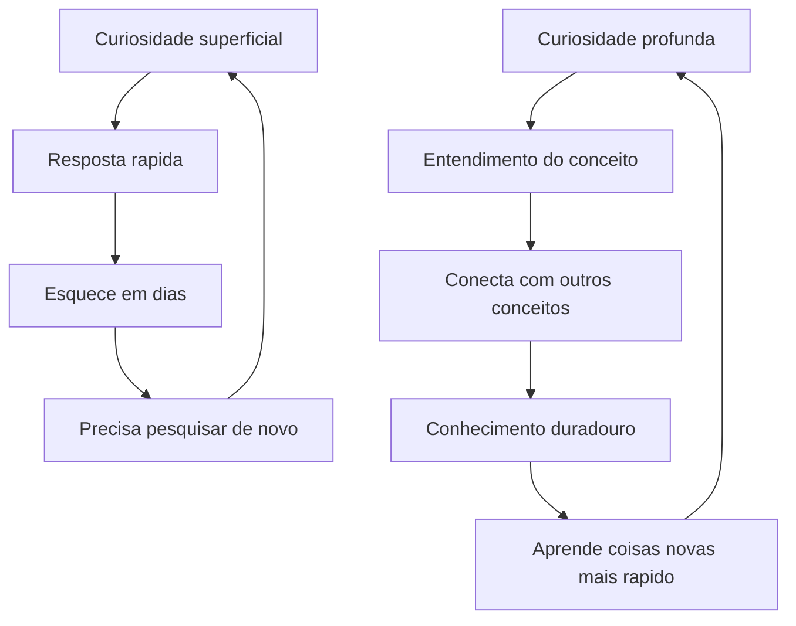
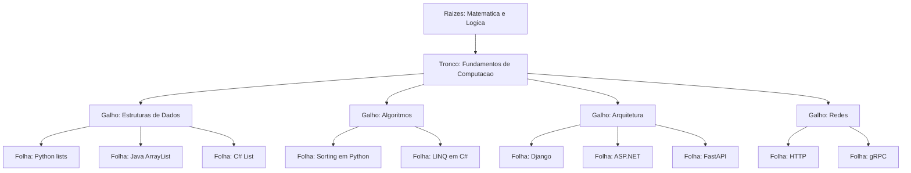
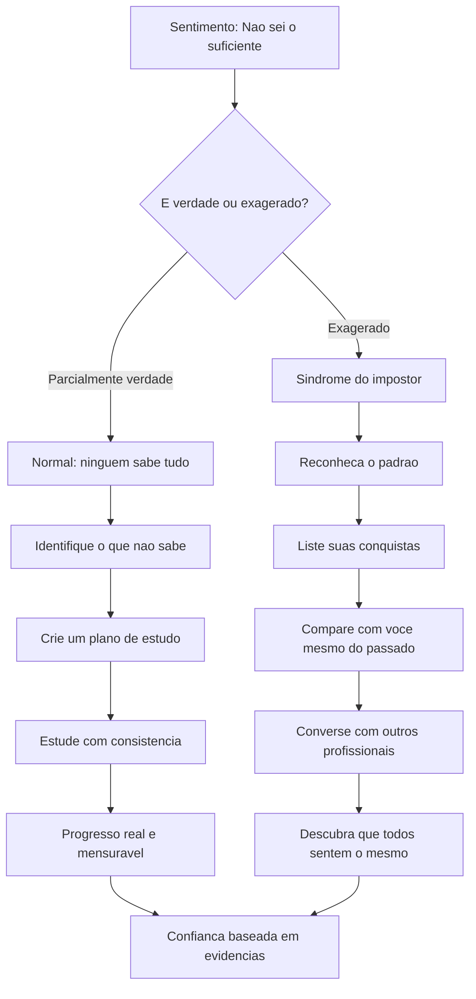
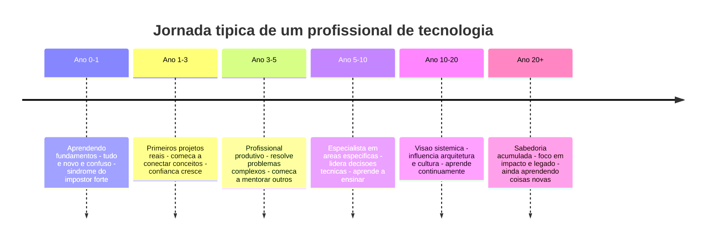
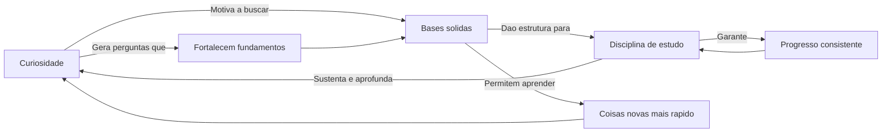

# 12.10 — Curiosidade e Bases Sólidas: O Perfil de um Bom Profissional

[← Anterior: O Problema que Precisamos Resolver](cap12-mod09-foco-no-problema.md) · [Próximo: Times de Tecnologia →](cap12-mod11-times-tecnologia.md)

---

## Introdução

No módulo anterior, falamos sobre manter o foco no problema — sobre como tecnologia é um meio, não um fim. Agora vamos falar sobre algo mais pessoal: o perfil do profissional que prospera em tecnologia.

Tecnologia é uma das áreas que mais muda no mundo. Linguagens surgem e desaparecem, frameworks nascem e morrem, paradigmas evoluem, empresas inteiras são criadas e destruídas em poucos anos. Nesse cenário de mudança constante, que tipo de profissional sobrevive e prospera?

A resposta não é "o que sabe mais ferramentas" nem "o que tem mais certificações". É o profissional que combina três características: **curiosidade genuína**, **disciplina de estudo** e **bases de conhecimento sólidas**. Com essas três, qualquer tecnologia nova é assimilável. Sem elas, cada mudança é uma crise.

Neste módulo, vamos explorar cada uma dessas características em profundidade. Vamos entender por que elas importam, como desenvolvê-las, e como lidar com os desafios emocionais que fazem parte da jornada — como a síndrome do impostor, que afeta até os profissionais mais experientes.

Se você está começando agora e sente que "nunca vai saber o suficiente", este módulo é especialmente para você. Spoiler: esse sentimento nunca desaparece completamente — mas você vai aprender a conviver com ele e transformá-lo em combustível.

Vamos explorar cada uma dessas características, entender como elas se conectam, e descobrir por que os profissionais mais bem-sucedidos da área são aqueles que nunca param de aprender — não por obrigação, mas por genuíno interesse.

Este é um dos módulos mais pessoais do curso. Não vamos falar de ferramentas ou técnicas — vamos falar de você, do seu perfil, e de como construir uma carreira sólida e satisfatória em tecnologia.

Ao final deste módulo, você terá um mapa claro de como cultivar essas três características e transformá-las em vantagem profissional duradoura.

---

## Curiosidade: O Motor que Nunca Para

A curiosidade é, talvez, a característica mais importante de um profissional de tecnologia. Não a curiosidade superficial de "quero saber o que é isso" — mas a curiosidade profunda de "quero entender por que isso funciona assim".

Profissionais curiosos não aceitam respostas superficiais. Quando algo funciona, eles querem saber por quê. Quando algo falha, eles querem entender a causa raiz, não apenas aplicar uma correção rápida. Quando encontram uma tecnologia nova, não perguntam apenas "como usar?" — perguntam "que problema resolve? como funciona por dentro? quais são os trade-offs?"

Essa curiosidade profunda é o que separa profissionais que crescem continuamente daqueles que estagnam após alguns anos. E a boa notícia é que curiosidade pode ser cultivada — não é um traço inato que você tem ou não tem.

### O Que a Pesquisa Diz sobre Curiosidade

A curiosidade não é apenas uma característica "legal de ter" — é um fator mensurável de sucesso profissional. Em 2011, pesquisadores da Universidade de Oregon publicaram um estudo mostrando que pessoas com alta curiosidade epistêmica (o desejo de entender como as coisas funcionam) tinham desempenho significativamente melhor em tarefas complexas de resolução de problemas.

Em 2015, a Harvard Business Review publicou um artigo intitulado "Why Curiosity Matters" mostrando que equipes com membros curiosos tomavam decisões melhores, cometiam menos erros de julgamento e eram mais inovadoras. O artigo citava pesquisas da INSEAD Business School mostrando que curiosidade reduzia conflitos em grupo porque pessoas curiosas ouvem mais e julgam menos.

No contexto de tecnologia, a curiosidade é ainda mais crítica porque a área muda constantemente. Um estudo da Stack Overflow de 2023 mostrou que 75% dos desenvolvedores aprendem pelo menos uma nova tecnologia por ano. Os que relataram maior satisfação com a carreira eram justamente os que descreviam o aprendizado como "prazeroso" — ou seja, os curiosos.

### A Origem da Curiosidade na Computação

A história da computação é, essencialmente, uma história de pessoas curiosas. Cada grande avanço nasceu de alguém que perguntou "e se...?" ou "por que não...?":

- Em 1843, **Ada Lovelace** ficou fascinada pela Máquina Analítica de Charles Babbage e perguntou: "E se essa máquina pudesse fazer mais do que cálculos?" Essa curiosidade a levou a escrever o que é considerado o primeiro algoritmo da história — antes mesmo de computadores existirem.

- Em 1936, **Alan Turing** perguntou: "Existem problemas que nenhuma máquina pode resolver?" Essa curiosidade o levou a criar o conceito de máquina universal — a base teórica de todo computador moderno.

- Em 1952, **Grace Hopper** perguntou: "Por que precisamos escrever programas em código de máquina?" Essa curiosidade a levou a criar o primeiro compilador e, depois, a linguagem COBOL — que ainda roda em sistemas bancários hoje, mais de 70 anos depois.

- Em 1991, **Linus Torvalds**, um estudante finlandês de 21 anos, perguntou: "Como sistemas operacionais funcionam por dentro?" Essa curiosidade o levou a criar o Linux — que hoje roda em 96% dos servidores do mundo, em todos os smartphones Android e na maioria dos dispositivos IoT.

- Em 2004, **Margaret Hamilton** recebeu reconhecimento tardio pelo software da Apollo 11. Sua curiosidade sobre como prevenir erros em sistemas críticos a levou a criar conceitos de engenharia de software que usamos até hoje — como tratamento de exceções e priorização de processos.

O padrão é claro: nenhuma dessas pessoas sabia de antemão que sua curiosidade levaria a algo revolucionário. Elas simplesmente queriam entender como as coisas funcionavam. A revolução foi consequência.

### Manifestações Práticas da Curiosidade

A curiosidade se manifesta de formas concretas no dia a dia de um profissional:

- **Ler código dos outros**: não apenas usar bibliotecas, mas abrir o código-fonte e entender como funcionam. Isso ensina padrões, técnicas e formas de pensar que nenhum tutorial ensina. Quando você lê o código do Django, do React ou do Linux, está aprendendo com os melhores programadores do mundo — de graça.

- **Investigar erros a fundo**: quando um erro aparece, não apenas copiar a mensagem no Google e aplicar a primeira solução. Entender o que causou o erro, por que a solução funciona, e como evitar no futuro. Cada erro investigado a fundo é uma aula que você nunca esquece.

- **Perguntar "por quê?" repetidamente**: por que usamos HTTPS? Porque criptografa os dados. Por que precisamos criptografar? Porque dados em trânsito podem ser interceptados. Por que podem ser interceptados? Porque a rede é compartilhada. Cada "por quê?" aprofunda o entendimento. Essa técnica é conhecida como "5 Porquês" e foi criada por Sakichi Toyoda na Toyota nos anos 1930.

- **Explorar além do necessário**: se você precisa aprender a usar um banco de dados, não pare em "como fazer SELECT". Entenda como índices funcionam, como o otimizador de queries decide o plano de execução, como os dados são armazenados no disco. Esse conhecimento extra é o que diferencia profissionais.

- **Fazer projetos pessoais**: a curiosidade mais produtiva é a que se transforma em ação. Quer entender como um servidor web funciona? Implemente um do zero. Quer entender criptografia? Implemente um algoritmo simples. Projetos pessoais são o laboratório da curiosidade.

- **Acompanhar a evolução da área**: ler artigos, assistir palestras, participar de comunidades. Não para "ficar por dentro de tudo" — isso é impossível — mas para manter uma visão ampla do que está acontecendo e por quê.

### Curiosidade Superficial vs. Curiosidade Profunda

Nem toda curiosidade é igual. Existe uma diferença importante entre curiosidade superficial e curiosidade profunda:

| Curiosidade superficial | Curiosidade profunda |
|------------------------|---------------------|
| "O que e Kubernetes?" | "Que problema Kubernetes resolve que Docker sozinho nao resolve?" |
| "Como usar React?" | "Por que React usa Virtual DOM e qual problema isso resolve?" |
| "Qual linguagem e melhor?" | "Quais trade-offs cada linguagem faz e por que?" |
| "Como fazer deploy?" | "O que acontece em cada etapa do deploy e por que cada uma existe?" |
| "Como corrigir esse erro?" | "O que causou esse erro e como evitar que aconteca de novo?" |
| "Qual framework usar?" | "Quais problemas cada framework resolve e quais cria?" |

A curiosidade superficial te dá respostas rápidas. A curiosidade profunda te dá entendimento duradouro. Ambas têm seu lugar — às vezes você precisa de uma resposta rápida. Mas o profissional que cultiva a curiosidade profunda constrói um conhecimento que se acumula e se conecta ao longo dos anos.

Repare que a curiosidade superficial cria um ciclo que não acumula — você pesquisa, esquece, pesquisa de novo. A curiosidade profunda cria um ciclo virtuoso — cada conceito entendido facilita o próximo.

### Cultivando a Curiosidade no Dia a Dia

Curiosidade não é algo que você tem ou não tem — é um músculo que pode ser exercitado. Algumas práticas para cultivar curiosidade profunda:

**Mantenha uma "lista de perguntas"**: sempre que encontrar algo que não entende, anote. Não precisa pesquisar na hora — o ato de anotar já é valioso. Reserve um tempo por semana para investigar 2-3 perguntas da lista. Com o tempo, você vai perceber que muitas perguntas se conectam entre si.

**Leia fora da sua área**: se você trabalha com backend, leia sobre frontend. Se trabalha com web, leia sobre sistemas embarcados. Se trabalha com Python, leia sobre como Rust gerencia memória. Conhecimento de áreas adjacentes enriquece sua perspectiva e gera conexões inesperadas.

**Questione o "sempre foi assim"**: muitas práticas em tecnologia existem por inércia, não por necessidade. Quando alguém disser "fazemos assim porque sempre fizemos", pergunte por quê. Às vezes a razão original ainda é válida. Às vezes não é — e questionar pode levar a melhorias significativas.

**Participe de code reviews com curiosidade**: quando revisar código de colegas, não apenas procure bugs. Pergunte: "Por que você escolheu essa abordagem?" "Que alternativas considerou?" "O que acontece se a entrada for X?" Code review é uma das melhores oportunidades de aprendizado mútuo.

**Experimente tecnologias diferentes**: reserve um tempo para experimentar linguagens, frameworks ou paradigmas que você não usa no trabalho. Não para trocar de stack — para expandir sua perspectiva. Um desenvolvedor Python que experimenta Haskell volta para Python com uma visão diferente sobre funções e imutabilidade. Um desenvolvedor web que experimenta programação de jogos volta com uma visão diferente sobre performance e otimização.

---

## Bases Sólidas: O Alicerce que Sustenta Tudo

Curiosidade sem base é dispersão. Você pula de assunto em assunto sem aprofundar nada. Bases sólidas são o que transformam curiosidade em competência real.

Imagine que você está construindo uma casa. A curiosidade é o que te faz querer construir — a empolgação com o projeto, a vontade de ver o resultado. Mas sem um alicerce sólido, a casa desmorona. Não importa quão bonito seja o acabamento se a fundação é fraca.

Em tecnologia, o "alicerce" são os fundamentos que não mudam — os conceitos que vimos no módulo 12.8. Vamos aprofundar cada um deles e entender por que são tão duráveis.

### Os Sete Pilares do Conhecimento em Tecnologia

| Pilar | Por que e solido | O que permite | Exemplo pratico |
|-------|-----------------|---------------|-----------------|
| Logica de programacao | Toda linguagem usa logica | Aprender qualquer linguagem | Se sabe logica, aprende Python, Java, Go ou Rust |
| Estruturas de dados | Todo sistema organiza dados | Escolher a estrutura certa | Saber quando usar lista, fila, pilha ou arvore |
| Algoritmos | Todo programa processa dados | Escrever codigo eficiente | Entender por que uma busca binaria e mais rapida |
| Modelagem de dados | Todo sistema persiste dados | Projetar bancos e APIs | Criar tabelas relacionais que nao geram problemas |
| Arquitetura | Todo sistema tem estrutura | Organizar sistemas complexos | Separar responsabilidades em camadas |
| Redes e protocolos | Todo sistema se comunica | Entender integracao e performance | Diagnosticar por que uma API esta lenta |
| Sistemas operacionais | Todo programa roda em um SO | Diagnosticar problemas de ambiente | Entender por que um processo consome muita memoria |

### A Analogia da Árvore do Conhecimento

Pense no conhecimento em tecnologia como uma árvore:

As **raízes** são matemática e lógica — o fundamento mais profundo. O **tronco** são os fundamentos de computação — ciência da computação propriamente dita. Os **galhos** são as áreas de conhecimento — estruturas de dados, algoritmos, arquitetura, redes. E as **folhas** são as ferramentas específicas — Python, Django, React, Docker.

Quando uma folha cai (uma ferramenta fica obsoleta), a árvore continua viva. Novas folhas crescem. Mas se o tronco ou as raízes estão fracos, a árvore inteira cai.

Profissionais que investem apenas em folhas (ferramentas) vivem em estado de ansiedade permanente — cada ferramenta nova é uma ameaça. Profissionais que investem no tronco e nas raízes (fundamentos) vivem em estado de confiança — cada ferramenta nova é apenas uma folha diferente na mesma árvore.

### O Teste dos Fundamentos

Como saber se suas bases são sólidas? Faça este teste mental. Para cada pergunta, avalie se consegue responder com confiança:

1. **Lógica**: se alguém te der um problema novo (que você nunca viu), consegue quebrá-lo em passos menores e pensar em uma solução?
2. **Estruturas de dados**: consegue explicar a diferença entre uma lista, uma fila e uma pilha? Sabe quando usar cada uma?
3. **Algoritmos**: entende por que busca binária é mais rápida que busca linear? Consegue explicar o conceito de complexidade?
4. **Modelagem**: se alguém te pedir para modelar um sistema de biblioteca, consegue pensar nas entidades, atributos e relacionamentos?
5. **Arquitetura**: entende por que separar código em camadas é importante? Sabe a diferença entre monolito e microsserviços?
6. **Redes**: sabe o que acontece quando você digita uma URL no navegador? Entende o que é HTTP, DNS, TCP?
7. **Sistemas operacionais**: entende o que é um processo, um thread, memória virtual?

Se respondeu "sim" para a maioria, suas bases estão no caminho certo. Se respondeu "não" para várias, não se preocupe — agora você sabe onde investir. E o fato de saber onde investir já é um sinal de maturidade profissional.

### Quando as Bases São Sólidas vs. Quando São Fracas

A diferença entre ter bases sólidas e não ter aparece em situações concretas do dia a dia:

| Situacao | Bases fracas | Bases solidas |
|----------|-------------|---------------|
| Nova linguagem surge | "Preciso aprender tudo do zero" | "Que paradigma usa? Tipagem estatica ou dinamica? Vou adaptar o que ja sei" |
| Bug complexo aparece | Tenta solucoes aleatorias ate funcionar | Analisa o problema sistematicamente, isola a causa raiz |
| Precisa escolher banco de dados | Usa o que todo mundo usa | Analisa requisitos, compara trade-offs, escolhe com criterio |
| Sistema fica lento | "Precisa de mais servidor" | Analisa complexidade algoritmica, identifica gargalos, otimiza |
| Precisa integrar dois sistemas | Copia codigo do Stack Overflow | Entende protocolos, desenha a integracao, trata erros |
| Entrevista tecnica | Decora respostas de perguntas comuns | Raciocina sobre problemas novos usando fundamentos |

### Como Fortalecer as Bases

Fortalecer bases não é glamouroso. Não gera likes nas redes sociais. Ninguém posta "Hoje estudei como árvores B funcionam em bancos de dados" e viraliza. Mas é o investimento com maior retorno a longo prazo.

Formas práticas de fortalecer bases:

- **Estude ciência da computação, não apenas programação**: programação é uma habilidade prática. Ciência da computação é o conhecimento teórico que fundamenta a prática. Ambos são necessários. Cursos como o CS50 de Harvard (gratuito) cobrem fundamentos que muitos profissionais nunca estudaram formalmente.

- **Resolva problemas algorítmicos**: sites como LeetCode, HackerRank e Exercism oferecem problemas que exercitam lógica e estruturas de dados. Não para decorar soluções — para praticar o pensamento. Comece com problemas fáceis e vá subindo. O objetivo não é resolver rápido — é entender profundamente.

- **Implemente coisas do zero**: implemente uma lista encadeada, um servidor HTTP simples, um banco de dados em memória. Não para usar em produção — para entender como funcionam por dentro. Quando você implementa algo do zero, descobre detalhes que nenhum tutorial mostra.

- **Leia livros fundamentais**: livros como "Introduction to Algorithms" (Cormen et al., 1990), "The Pragmatic Programmer" (Hunt e Thomas, 1999), "Clean Code" (Martin, 2008) e "Designing Data-Intensive Applications" (Kleppmann, 2017) são investimentos que pagam dividendos por décadas. Esses livros não envelhecem porque tratam de conceitos, não de ferramentas.

- **Ensine o que aprendeu**: explicar um conceito para outra pessoa é a melhor forma de descobrir se você realmente entendeu. Se não consegue explicar de forma simples, provavelmente não entendeu bem o suficiente. Richard Feynman, prêmio Nobel de Física, usava essa técnica — hoje conhecida como "Técnica Feynman".

### A História Mostra: Fundamentos Sobrevivem, Ferramentas Não

Para entender por que bases sólidas são tão importantes, olhe para a história da tecnologia e veja o que sobreviveu e o que desapareceu:

| Decada | Ferramentas populares que desapareceram | Fundamentos que continuam relevantes |
|--------|----------------------------------------|--------------------------------------|
| 1970s | COBOL dominava, Assembly era essencial | Logica de programacao, algoritmos de ordenacao |
| 1980s | Turbo Pascal, dBASE, Clipper | Estruturas de dados, modelagem relacional |
| 1990s | Visual Basic 6, Delphi, CGI scripts | Arquitetura cliente-servidor, protocolos HTTP |
| 2000s | Flash, jQuery, PHP procedural | Design patterns, REST, MVC |
| 2010s | AngularJS 1.x, Backbone.js, CoffeeScript | Componentes reutilizaveis, programacao funcional |

Repare no padrão: as ferramentas da coluna do meio mudaram completamente a cada década. Mas os fundamentos da coluna da direita continuam relevantes até hoje. Um profissional que aprendeu modelagem relacional nos anos 1980 ainda usa esse conhecimento em 2024. Um profissional que aprendeu apenas dBASE nos anos 1980 ficou obsoleto quando dBASE desapareceu.

Essa é a diferença entre investir em folhas (ferramentas) e investir no tronco (fundamentos). As folhas caem e crescem novas. O tronco permanece.

### O Efeito Composto do Conhecimento Fundamental

Conhecimento fundamental tem um efeito composto — cada conceito que você aprende torna mais fácil aprender o próximo. É como juros compostos em investimentos financeiros: no início o crescimento parece lento, mas com o tempo se torna exponencial.

Por exemplo: quando você entende bem estruturas de dados (listas, filas, pilhas, árvores), aprender sobre bancos de dados fica mais fácil — porque bancos de dados usam árvores B para índices, filas para transações, e listas para resultados de queries. Quando você entende bancos de dados, aprender sobre APIs fica mais fácil — porque APIs são a interface entre aplicações e dados. Quando você entende APIs, aprender sobre arquitetura de microsserviços fica mais fácil — porque microsserviços se comunicam via APIs.

Cada fundamento aprendido é um multiplicador para tudo que vem depois. É por isso que profissionais com bases sólidas parecem "aprender mais rápido" — não é que sejam mais inteligentes, é que cada novo conceito se conecta com dezenas de conceitos que já dominam.

---

## Disciplina de Estudo: Consistência Vence Intensidade

Curiosidade te faz querer aprender. Bases sólidas te dão o que aprender. Mas é a disciplina que transforma intenção em resultado.

A indústria de tecnologia tem uma cultura de "sprints de aprendizado" — estudar intensamente por uma semana e depois parar por meses. Isso não funciona. Conhecimento profundo se constrói com consistência, não com intensidade.

### A Neurociência do Aprendizado Consistente

A neurociência explica por que consistência funciona melhor que intensidade. Quando você estuda algo, seu cérebro forma conexões neurais (sinapses). Essas conexões são frágeis no início — como trilhas recém-abertas em uma floresta. Se você não passa por elas novamente em breve, elas desaparecem.

Mas quando você revisita o mesmo conceito repetidamente ao longo de dias e semanas, as conexões se fortalecem — como uma trilha que vira estrada de tanto ser usada. Esse processo se chama **consolidação de memória**, e acontece principalmente durante o sono.

É por isso que estudar 1 hora por dia durante 5 dias é muito mais eficaz do que estudar 5 horas em um único dia. No primeiro caso, seu cérebro tem 5 noites de sono para consolidar o aprendizado. No segundo, tem apenas uma.

### O Poder do Estudo Consistente

| Abordagem | Horas totais | Resultado tipico |
|-----------|-------------|-----------------|
| 8 horas em um sabado, nada no resto da semana | 8h por semana | Cansaco, pouca retencao, desanimo rapido |
| 1 hora por dia, 5 dias por semana | 5h por semana | Progresso constante, retencao alta, habito sustentavel |
| Bootcamp intensivo de 3 meses e parar | ~480h total | Conhecimento superficial que evapora em 6 meses |
| 1 hora por dia durante 2 anos | ~520h total | Conhecimento profundo e duradouro, bases solidas |

Repare que a abordagem consistente de 2 anos tem horas totais similares ao bootcamp — mas o resultado é radicalmente diferente. A diferença não está na quantidade de horas, mas na distribuição ao longo do tempo.

### A Curva de Aprendizado em Tecnologia

Todo aprendizado em tecnologia segue uma curva que pode ser frustrante se você não a conhece:

1. **Fase da empolgação** (primeiras semanas): tudo é novo e excitante. Você aprende rápido porque está partindo do zero. Cada pequena conquista parece enorme. "Fiz meu primeiro Hello World!"

2. **Fase do vale da desilusão** (meses 2-6): o progresso desacelera. Os conceitos ficam mais difíceis. Você começa a perceber o quanto não sabe. A síndrome do impostor ataca com força. Muitas pessoas desistem nesta fase.

3. **Fase da escalada** (meses 6-18): se você persistir, o progresso volta — mas de forma diferente. Não é mais sobre aprender coisas novas isoladas, mas sobre conectar conceitos. "Ah, é por isso que estruturas de dados importam para bancos de dados!"

4. **Fase da competência** (ano 2+): os fundamentos estão sólidos. Novas tecnologias são assimiladas rapidamente. Você começa a ter opiniões fundamentadas sobre decisões técnicas. A confiança cresce — baseada em evidências, não em ilusão.

A chave é sobreviver à fase 2 — o vale da desilusão. E a única forma de sobreviver é com disciplina. Curiosidade te trouxe até aqui, mas é a disciplina que te mantém quando a empolgação passa.

### O Conceito de Prática Deliberada

Em 1993, o psicólogo Anders Ericsson publicou um estudo que mudou a forma como entendemos expertise. Ele estudou violinistas do Conservatório de Berlim e descobriu que o que separava os melhores dos medianos não era talento inato — era a quantidade de **prática deliberada** (deliberate practice) ao longo dos anos.

Prática deliberada não é simplesmente repetir o que já sabe. É:

1. **Focar em pontos fracos**: identificar o que você não sabe bem e trabalhar especificamente nisso
2. **Buscar feedback**: ter alguma forma de saber se está melhorando (testes, projetos, code review)
3. **Sair da zona de conforto**: fazer coisas que são difíceis, não apenas as que são confortáveis
4. **Ser consistente**: praticar regularmente, não em rajadas

Aplicado a tecnologia, prática deliberada significa:

- Se você é bom em Python mas fraco em SQL, dedique tempo a SQL — não fique só praticando Python
- Se você consegue fazer CRUDs mas não entende algoritmos, estude algoritmos — não faça mais CRUDs
- Se você sabe copiar código mas não sabe debugar, pratique debugging — não copie mais código
- Se você trabalha bem sozinho mas tem dificuldade em code review, pratique code review — não evite

### Construindo o Hábito de Estudo

Construir um hábito de estudo é mais importante do que qualquer técnica de estudo. Um hábito medíocre praticado todo dia supera uma técnica perfeita praticada uma vez por mês.

Dicas práticas para construir o hábito:

- **Defina um horário fixo**: mesmo que sejam 30 minutos por dia, ter um horário fixo cria o hábito. O cérebro se acostuma e começa a "esperar" o estudo naquele horário. Muitos profissionais estudam de manhã cedo, antes do trabalho — quando a mente está fresca e não há distrações.

- **Tenha um plano**: não estude "o que der vontade". Tenha uma lista de temas e siga uma sequência. Sem plano, você tende a estudar o que é fácil e evitar o que é difícil — exatamente o oposto do que a prática deliberada recomenda.

- **Alterne teoria e prática**: leia sobre um conceito, depois implemente. Leia mais, implemente mais. A alternância entre teoria e prática é o que consolida o aprendizado. Só teoria vira conhecimento abstrato. Só prática vira habilidade sem entendimento.

- **Registre o que aprendeu**: mantenha notas, um blog, ou um repositório com seus estudos. Escrever consolida o aprendizado porque te obriga a organizar o pensamento. Muitos profissionais mantêm um "diário de aprendizado" — um arquivo simples onde anotam o que estudaram cada dia.

- **Aceite que é lento**: aprendizado profundo leva tempo. Não compare seu capítulo 1 com o capítulo 20 de outra pessoa. Peter Norvig, diretor de pesquisa do Google, escreveu um artigo famoso chamado "Teach Yourself Programming in Ten Years" — o título já diz tudo. Expertise leva anos, não semanas.

- **Celebre pequenas vitórias**: cada conceito entendido, cada bug resolvido, cada projeto concluído é uma vitória. Reconheça seu progresso. A jornada é longa — se você não celebrar as etapas, vai desanimar antes de chegar ao destino.

- **Celebre pequenas vitórias**: cada conceito entendido, cada bug resolvido, cada projeto concluído é uma vitória. Reconheça seu progresso. A jornada é longa — se você não celebrar as etapas, vai desanimar antes de chegar ao destino.

### Técnicas Práticas de Estudo para Tecnologia

Além dos hábitos gerais, existem técnicas específicas que funcionam bem para estudar tecnologia:

**Técnica Pomodoro adaptada para programação**: a técnica Pomodoro clássica usa blocos de 25 minutos de foco seguidos de 5 minutos de pausa. Para programação, muitos profissionais adaptam para blocos de 45-50 minutos — porque entrar no "fluxo" de código leva tempo e interrupções frequentes atrapalham. Use os 25 minutos para leitura e teoria, e os 45-50 minutos para prática de código.

**Spaced repetition para conceitos**: a repetição espaçada é uma técnica comprovada pela neurociência. Em vez de estudar um conceito uma vez e seguir em frente, revise-o em intervalos crescentes: 1 dia depois, 3 dias depois, 1 semana depois, 2 semanas depois. Ferramentas como Anki permitem criar flashcards com repetição espaçada automática. Muitos desenvolvedores usam Anki para memorizar conceitos de algoritmos, complexidade Big O e padrões de design.

**Rubber duck debugging para aprendizado**: a técnica do "pato de borracha" é famosa para debugging — você explica o problema para um pato de borracha (ou qualquer objeto) e, no processo de explicar, descobre a solução. A mesma técnica funciona para aprendizado: explique o conceito que está estudando em voz alta, como se estivesse ensinando alguém. Se travar, é sinal de que precisa estudar mais aquele ponto.

**Projetos pessoais como laboratório**: a forma mais eficaz de consolidar aprendizado em tecnologia é construir algo. Não precisa ser grande ou original — pode ser uma versão simplificada de algo que já existe. Quer entender como APIs funcionam? Construa uma API simples. Quer entender bancos de dados? Crie um CRUD. Quer entender Docker? Containerize um projeto seu. O ato de construir força você a lidar com detalhes que a teoria não cobre.

### O Mito do Talento Natural

Existe um mito persistente em tecnologia: o de que bons programadores "nasceram para isso". Que existe um "gene da programação" que algumas pessoas têm e outras não. Isso é falso — e perigoso.

Em 2014, pesquisadores da Universidade de Washington publicaram um estudo mostrando que o fator mais importante para o sucesso em programação não era aptidão matemática nem "pensamento lógico inato" — era **persistência**. Alunos que persistiam diante de dificuldades aprendiam programação tão bem quanto os que tinham "facilidade natural".

A psicóloga Carol Dweck, de Stanford, chama isso de **mentalidade de crescimento** (growth mindset): a crença de que habilidades podem ser desenvolvidas com esforço. O oposto é a **mentalidade fixa** (fixed mindset): a crença de que habilidades são inatas e imutáveis.

| Mentalidade fixa | Mentalidade de crescimento |
|-----------------|---------------------------|
| "Nao sou bom em logica" | "Ainda nao sou bom em logica, mas posso melhorar" |
| "Programacao nao e para mim" | "Programacao e dificil, mas estou progredindo" |
| "Erros significam que sou incompetente" | "Erros significam que estou aprendendo" |
| "Se preciso me esforcar, nao tenho talento" | "Esforco e como se desenvolve talento" |
| "Feedback negativo e ataque pessoal" | "Feedback negativo e oportunidade de melhoria" |

A verdade é que todo profissional de tecnologia que você admira passou por um período onde não sabia nada. Linus Torvalds não nasceu sabendo criar sistemas operacionais. Grace Hopper não nasceu sabendo criar compiladores. Eles aprenderam — com curiosidade, disciplina e persistência.

---

## A Síndrome do Impostor

Quase todo profissional de tecnologia, em algum momento da carreira, sente que não sabe o suficiente, que não merece estar onde está, que a qualquer momento vão "descobrir" que ele é uma fraude. Isso tem nome: **Síndrome do Impostor** (Impostor Syndrome).

O termo foi cunhado em 1978 pelas psicólogas Pauline Clance e Suzanne Imes, que estudaram mulheres de alto desempenho que, apesar de evidências objetivas de competência, sentiam que eram "fraudes". Desde então, pesquisas mostraram que a síndrome afeta pessoas de todas as áreas, gêneros e níveis de experiência — mas é especialmente prevalente em tecnologia.

Um estudo de 2018 publicado no Journal of Behavioral Science estimou que cerca de 70% das pessoas experimentam a síndrome do impostor em algum momento da vida. Em tecnologia, esse número pode ser ainda maior — a área é vasta, muda rápido e tem uma cultura de comparação constante.

### Por que Tecnologia Amplifica a Síndrome do Impostor

Vários fatores tornam a síndrome do impostor particularmente forte em tecnologia:

1. **A área é vasta demais**: ninguém domina tudo. Sempre haverá alguém que sabe mais sobre algum tema específico. Isso cria a ilusão de que "todo mundo sabe mais que eu".

2. **Mudança constante**: novas tecnologias surgem o tempo todo. A sensação de "estou ficando para trás" é permanente — mesmo para profissionais experientes.

3. **Visibilidade do trabalho**: código é público (especialmente em open source). Qualquer pessoa pode ver e criticar seu trabalho. Isso gera medo de exposição.

4. **Cultura de "rockstars"**: a indústria glorifica "gênios" — programadores que parecem saber tudo e resolver qualquer problema. Isso cria um padrão impossível de alcançar.

5. **Redes sociais**: desenvolvedores postam seus sucessos, não seus fracassos. Você vê o resultado final do trabalho dos outros, não as horas de frustração, os bugs que levaram dias para resolver, os projetos abandonados.

### Como Lidar com a Síndrome do Impostor

Algumas verdades que ajudam a combater a síndrome:

- **Ninguém sabe tudo**: nem os profissionais mais seniores. Eles sabem muito sobre algumas coisas e pouco sobre outras. A diferença é que sabem aprender rápido quando precisam — porque têm bases sólidas.

- **Não saber é normal**: se você soubesse tudo, não estaria aprendendo. E se não está aprendendo, está estagnando. O desconforto de não saber é sinal de crescimento, não de incompetência.

- **Comparação é armadilha**: você vê o resultado final do trabalho dos outros, não o processo. Não vê as horas de estudo, as tentativas fracassadas, os bugs que levaram dias para resolver. Compare com você mesmo de 6 meses atrás — esse é o único benchmark que importa.

- **Perguntar não é fraqueza**: os melhores profissionais perguntam o tempo todo. Perguntar demonstra curiosidade e humildade — duas qualidades valorizadas em qualquer equipe. O profissional que finge saber tudo é mais perigoso do que o que admite não saber.

- **Progresso é mais importante que posição**: não importa onde você está agora. Importa que está avançando. Cada conceito aprendido, cada problema resolvido, cada projeto concluído é progresso real e mensurável.

### Depoimentos Reais sobre a Síndrome do Impostor

Profissionais renomados já falaram publicamente sobre a síndrome do impostor:

- **David Heinemeier Hansson** (criador do Ruby on Rails): "Eu me sinto um impostor o tempo todo. Toda vez que começo algo novo, penso 'dessa vez vão descobrir que não sei o que estou fazendo'."

- **Scott Hanselman** (engenheiro da Microsoft, palestrante): "Eu sou um impostor. Você é um impostor. Todos nós somos impostores. A diferença é que alguns de nós continuam trabalhando apesar disso."

- **Maya Angelou** (escritora, não de tecnologia, mas a frase é universal): "Eu escrevi onze livros, mas cada vez que escrevo um novo, penso 'agora vão descobrir. Enganei todo mundo, e vão me pegar'."

Se pessoas com esse nível de realização sentem a síndrome do impostor, é seguro dizer que o sentimento não é evidência de incompetência — é evidência de que você se importa com a qualidade do seu trabalho.

E se você está sentindo isso agora, enquanto lê este material, saiba: é completamente normal. O fato de estar aqui, estudando, já é prova de que você está no caminho certo.

### A Síndrome do Impostor em Diferentes Fases da Carreira

A síndrome do impostor não desaparece com experiência — ela muda de forma:

| Fase da carreira | Como a sindrome se manifesta | O que ajuda |
|-----------------|------------------------------|-------------|
| Iniciante | "Nao sei nada, todo mundo sabe mais que eu" | Lembrar que todos comecaram do zero |
| Junior com 1-2 anos | "Ja deveria saber mais do que sei" | Comparar com voce mesmo de 6 meses atras |
| Pleno com 3-5 anos | "Sou bom no que faco, mas nao sei X, Y, Z" | Aceitar que especializacao e normal |
| Senior com 5-10 anos | "Lidero decisoes tecnicas mas e se estiver errado?" | Confiar no processo e buscar feedback |
| Staff e Principal | "Influencio a arquitetura inteira, a responsabilidade e enorme" | Lembrar que decisoes sao reversiveis |

Repare que a síndrome não desaparece — ela evolui. O que muda é sua capacidade de reconhecê-la e lidar com ela. Com o tempo, você aprende que o sentimento é um companheiro de jornada, não um inimigo.

### Estratégias Práticas para o Dia a Dia

Além de entender a síndrome intelectualmente, existem práticas concretas que ajudam:

1. **Mantenha um "diário de conquistas"**: anote cada problema que resolveu, cada conceito que aprendeu, cada feedback positivo que recebeu. Quando a síndrome atacar, releia o diário. Evidências concretas são o melhor antídoto contra sentimentos vagos de inadequação.

2. **Fale sobre isso**: converse com colegas sobre a síndrome do impostor. Você vai descobrir que quase todo mundo sente o mesmo. Normalizar o sentimento tira muito do seu poder.

3. **Separe fatos de sentimentos**: "Eu sinto que não sei o suficiente" é um sentimento. "Eu resolvi 3 bugs complexos esta semana" é um fato. Quando o sentimento aparecer, busque os fatos.

4. **Aceite o desconforto**: não tente eliminar a síndrome — tente conviver com ela. O desconforto de não saber tudo é o preço de trabalhar em uma área que nunca para de evoluir. É um preço justo.

---

## Aprendizado Contínuo: Uma Carreira, Não um Destino

Tecnologia não é uma profissão onde você "termina de aprender". Não existe um ponto onde você sabe tudo e pode parar. É uma jornada contínua — e isso é uma das coisas mais bonitas da área.

Profissionais que estão na área há 20, 30 anos continuam aprendendo. Não porque são obrigados, mas porque a área continua evoluindo e oferecendo problemas novos e interessantes.

### Por que o Aprendizado Nunca Para

Para entender por que o aprendizado contínuo é inevitável em tecnologia, considere a velocidade de mudança da área:

- Em 2010, Docker não existia. Hoje, containers são padrão da indústria.
- Em 2015, Kubernetes era um projeto interno do Google. Hoje, é a plataforma de orquestração dominante.
- Em 2020, poucos desenvolvedores usavam IA no dia a dia. Em 2024, ferramentas como GitHub Copilot e ChatGPT são parte do fluxo de trabalho de milhões.
- A cada ano, surgem novas linguagens, frameworks e paradigmas. Algumas vingam, outras desaparecem.

Isso não significa que você precisa aprender tudo — significa que precisa manter a capacidade de aprender. E essa capacidade vem de bases sólidas e curiosidade cultivada.

A boa notícia é que, com bases sólidas, cada nova tecnologia é mais fácil de aprender do que a anterior. O efeito composto do conhecimento fundamental trabalha a seu favor: quanto mais você sabe, mais rápido aprende coisas novas.

### O Modelo T de Conhecimento

Uma forma útil de pensar sobre aprendizado contínuo é o **modelo T** (T-shaped professional). A ideia, popularizada pela empresa de design IDEO nos anos 1990, é que o profissional ideal tem:

- **Barra horizontal do T**: conhecimento amplo sobre muitas áreas (generalista)
- **Barra vertical do T**: conhecimento profundo em uma ou duas áreas (especialista)

O profissional T-shaped sabe um pouco sobre muitas coisas (frontend, backend, banco de dados, infraestrutura, segurança) e muito sobre uma ou duas coisas (por exemplo, arquitetura de microsserviços e bancos de dados distribuídos).

| Perfil | Formato | Vantagem | Desvantagem |
|--------|---------|----------|-------------|
| Especialista puro | I | Profundidade extrema em uma area | Dificuldade de colaborar fora da especialidade |
| Generalista puro | Traco | Visao ampla, flexibilidade | Falta de profundidade, dificuldade em problemas complexos |
| T-shaped | T | Profundidade + amplitude | Leva mais tempo para construir |
| Pi-shaped | Pi | Profundidade em 2 areas + amplitude | Ainda mais tempo para construir |

O modelo T é especialmente relevante para quem está começando. No início, foque em construir a barra horizontal — aprenda um pouco sobre muitas áreas para ter visão ampla. Com o tempo, escolha uma ou duas áreas para aprofundar e construa a barra vertical.

### Como Escolher Sua Especialização

Uma das perguntas mais comuns de quem está começando é: "Em que devo me especializar?" A resposta honesta é: você não precisa decidir agora. Nos primeiros 1-2 anos, explore. Experimente frontend, backend, dados, infraestrutura, segurança. Veja o que te atrai mais — não apenas o que paga melhor ou o que está na moda.

Sinais de que você encontrou sua área:

- Você perde a noção do tempo quando está trabalhando naquilo
- Você lê sobre o assunto por vontade própria, não por obrigação
- Os problemas daquela área te fascinam, mesmo quando são difíceis
- Você tem opiniões sobre como as coisas deveriam ser feitas
- Você quer entender cada vez mais profundamente como funciona

Quando encontrar esses sinais, invista. Aprofunde. Construa a barra vertical do T. Mas nunca pare de manter a barra horizontal — o conhecimento amplo é o que te permite colaborar com profissionais de outras áreas e tomar decisões informadas.

### Estratégias de Aprendizado Contínuo

O segredo é transformar o aprendizado em algo sustentável e prazeroso, não em uma obrigação estressante. Algumas estratégias que funcionam:

**1. A Regra 70-20-10**

Modelo criado pelo Center for Creative Leadership nos anos 1980, sugere que o aprendizado eficaz vem de três fontes:

- **70% experiência prática**: aprender fazendo — projetos reais, problemas do dia a dia, código em produção
- **20% aprendizado social**: aprender com outros — mentoria, code review, pair programming, conversas com colegas
- **10% aprendizado formal**: aprender com conteúdo — cursos, livros, tutoriais, documentação

Isso significa que a maior parte do seu aprendizado vai acontecer trabalhando, não estudando. Mas os 10% de estudo formal são o que dá estrutura e profundidade aos 70% de prática.

**2. Aprendizado Just-in-Time vs. Just-in-Case**

- **Just-in-time**: aprender algo quando precisa. "Preciso usar Redis no projeto? Vou estudar Redis agora." Eficiente e prático, mas pode deixar lacunas.
- **Just-in-case**: aprender algo antes de precisar. "Vou estudar bancos de dados distribuídos porque pode ser útil no futuro." Mais abrangente, mas pode parecer "perda de tempo" no curto prazo.

O ideal é combinar os dois: use just-in-time para ferramentas específicas e just-in-case para fundamentos. Você não precisa estudar Redis "por precaução" — mas estudar como bancos de dados funcionam em geral é um investimento que sempre vale.

**3. Comunidades e Networking**

Aprender sozinho é possível, mas aprender em comunidade é mais eficaz e mais prazeroso. Comunidades oferecem:

- **Perspectivas diferentes**: outras pessoas pensam sobre os mesmos problemas de formas diferentes
- **Motivação**: ver outros aprendendo te motiva a continuar
- **Oportunidades**: muitas vagas e projetos surgem de conexões em comunidades
- **Mentoria informal**: profissionais mais experientes que compartilham conhecimento

Comunidades podem ser presenciais (meetups, conferências) ou online (Discord, Slack, fóruns, GitHub). O importante é participar ativamente — não apenas consumir conteúdo, mas contribuir com perguntas, respostas e projetos.

**4. O Poder de Ensinar**

Uma das formas mais eficazes de aprender é ensinar. Quando você explica um conceito para outra pessoa, precisa organizá-lo de forma clara e lógica — e nesse processo, descobre lacunas no seu próprio entendimento.

Formas de "ensinar" mesmo sendo iniciante:

- **Escreva um blog**: documente o que está aprendendo. Não precisa ser perfeito — o ato de escrever já consolida o aprendizado. Muitos profissionais seniores mantêm blogs desde o início da carreira.
- **Responda perguntas em fóruns**: Stack Overflow, Reddit, Discord — quando alguém faz uma pergunta que você sabe responder, responda. Formular a resposta te obriga a pensar com clareza.
- **Faça pair programming**: programar junto com outra pessoa te obriga a verbalizar seu raciocínio. Isso revela tanto o que você sabe quanto o que não sabe.
- **Crie tutoriais**: grave um vídeo curto ou escreva um passo a passo sobre algo que aprendeu. O público pode ser pequeno — o benefício principal é para você.

Richard Feynman, prêmio Nobel de Física, era famoso por sua capacidade de explicar conceitos complexos de forma simples. Ele dizia que se você não consegue explicar algo de forma simples, não entendeu de verdade. Essa filosofia, conhecida como "Técnica Feynman", é uma das ferramentas de aprendizado mais poderosas que existem.

**5. Construindo um Portfólio de Aprendizado**

Ao longo da sua carreira, construa um portfólio que documente sua jornada de aprendizado:

- **Repositórios no GitHub**: cada projeto pessoal, cada exercício resolvido, cada experimento. Não precisa ser código perfeito — precisa mostrar evolução.
- **Notas de estudo**: um repositório com anotações sobre conceitos que estudou. Serve como referência futura e como evidência de aprendizado.
- **Contribuições open source**: mesmo pequenas (corrigir um typo na documentação, reportar um bug) mostram que você participa da comunidade.
- **Blog ou diário técnico**: registre o que aprendeu, os problemas que resolveu, as decisões que tomou e por quê.

Esse portfólio não é apenas para mostrar a empregadores — é para você mesmo. Quando a síndrome do impostor atacar, olhe para seu portfólio e veja o quanto já evoluiu.

### A Evolução de um Profissional ao Longo do Tempo

Repare que o aprendizado nunca para. O que muda é o tipo de aprendizado: no início é sobre ferramentas e sintaxe; com o tempo, passa a ser sobre arquitetura, liderança e impacto. Mas a curiosidade e a disciplina são constantes em todas as fases.

---

## Juntando Tudo: O Triângulo do Profissional Completo

Curiosidade, bases sólidas e disciplina de estudo não funcionam isoladamente. Elas se reforçam mutuamente, formando um ciclo virtuoso:

- **Curiosidade sem bases** é dispersão: você pula de assunto em assunto sem aprofundar nada. Sabe um pouco sobre muitas coisas, mas não domina nenhuma.
- **Bases sem curiosidade** é estagnação: você tem fundamentos sólidos mas não os aplica a problemas novos. O conhecimento fica parado.
- **Disciplina sem curiosidade** é obrigação: você estuda por dever, não por interesse. O aprendizado se torna pesado e insustentável.
- **Curiosidade sem disciplina** é frustração: você quer aprender tudo mas não consegue aprofundar nada. Começa muitos projetos e não termina nenhum.

O profissional completo combina as três: curiosidade para querer aprender, bases para saber o que aprender, e disciplina para realmente aprender. Não é necessário ter as três em níveis iguais — cada pessoa tem um perfil diferente. Mas cultivar as três, mesmo que em graus diferentes, é o que diferencia profissionais que crescem continuamente daqueles que estagnam.

### Como Saber em Qual Investir

Se você não sabe por onde começar, faça esta autoavaliação simples:

| Sintoma | O que falta | O que fazer |
|---------|-------------|-------------|
| "Nao tenho vontade de estudar" | Curiosidade | Explore temas que te interessam, faca projetos pessoais divertidos |
| "Estudo mas nao consigo resolver problemas" | Bases solidas | Volte aos fundamentos: logica, estruturas de dados, algoritmos |
| "Comeco muitas coisas e nao termino" | Disciplina | Crie um plano simples, defina horario fixo, comece com 30 min por dia |
| "Sei usar ferramentas mas nao entendo por que" | Curiosidade profunda | Pratique os 5 Porques, leia codigo-fonte, implemente coisas do zero |
| "Aprendo rapido mas esqueco rapido" | Disciplina e revisao | Use repeticao espacada, ensine o que aprendeu, registre notas |

### Exemplos de Profissionais que Combinam as Três

Para tornar isso concreto, veja como profissionais reais combinam curiosidade, bases e disciplina:

**O desenvolvedor que virou arquiteto**: começou como desenvolvedor júnior em Python. Sua curiosidade o levou a perguntar "por que o sistema é organizado assim?" em vez de apenas escrever código. Investiu em bases sólidas de arquitetura lendo livros como "Clean Architecture" e "Designing Data-Intensive Applications". Com disciplina, estudou 45 minutos por dia durante 3 anos. Resultado: em 5 anos, passou de júnior a arquiteto de software — não porque decorou ferramentas, mas porque entendeu princípios.

**A analista que migrou para dados**: trabalhava como analista de negócios e ficou curiosa sobre como os dados que ela analisava eram armazenados e processados. Investiu em bases sólidas de SQL, modelagem de dados e estatística básica. Com disciplina, fez cursos online e projetos pessoais por 1 hora por dia durante 18 meses. Resultado: migrou para engenharia de dados com um entendimento profundo tanto do negócio quanto da tecnologia — uma combinação rara e muito valorizada.

**O autodidata que contribui para open source**: nunca fez faculdade de computação. Sua curiosidade o levou a ler o código-fonte de projetos open source que usava no trabalho. Investiu em bases sólidas implementando estruturas de dados do zero e estudando algoritmos. Com disciplina, contribuiu para projetos open source toda semana — começando com correções de documentação e evoluindo para features complexas. Resultado: em 3 anos, tornou-se maintainer de um projeto popular e recebeu ofertas de emprego de empresas de referência.

Esses exemplos mostram que não existe um único caminho. O que existe é um padrão: curiosidade + bases + disciplina = crescimento consistente.

---

## Como a IA pode te ajudar aqui

A IA é uma parceira poderosa para quem quer desenvolver curiosidade, fortalecer bases e manter disciplina de estudo. Use-a como um tutor pessoal que está sempre disponível.

**Prompt 1 — Criar um plano de estudo personalizado:**
> "Quero fortalecer minhas bases em estruturas de dados. Me monte um plano de estudo de 4 semanas, com 1 hora por dia, começando do básico e indo até árvores e grafos."

**Prompt 2 — Entender a síndrome do impostor:**
> "Estou sentindo a síndrome do impostor. Quais são as habilidades que um desenvolvedor júnior realmente precisa ter? Me ajude a fazer uma autoavaliação honesta."

**Prompt 3 — Explorar curiosidade profunda:**
> "Explique como um banco de dados relacional armazena dados no disco. Quero entender desde o nível do sistema de arquivos até como uma query SELECT encontra os dados."

**Prompt 4 — Recomendar recursos de estudo:**
> "Me recomende 3 livros fundamentais de ciência da computação para quem está começando, explicando o que cada um cobre e por que é importante."

Lembre-se: a IA é uma ferramenta de aprendizado, não um substituto. Use-a para tirar dúvidas, explorar conceitos e criar planos — mas o estudo e a prática são seus.

---

## Casos de Uso no Mundo Real

### Caso 1 — Google e a cultura de curiosidade

O Google é famoso por sua política de "20% time" — a ideia de que engenheiros podem dedicar 20% do seu tempo a projetos pessoais que não fazem parte do trabalho principal. Essa política nasceu da crença de que curiosidade gera inovação. Produtos como Gmail, Google News e AdSense nasceram de projetos de "20% time". Larry Page e Sergey Brin, fundadores do Google, sempre acreditaram que contratar pessoas curiosas era mais importante do que contratar pessoas com habilidades específicas. Em entrevistas, o Google historicamente priorizou capacidade de raciocínio e curiosidade sobre conhecimento de ferramentas específicas. A lição para quem está começando: empresas de ponta valorizam curiosidade e capacidade de aprender mais do que conhecimento de ferramentas específicas.

### Caso 2 — Spotify e o investimento em bases sólidas

O Spotify enfrentou um desafio de escala em 2013: seu sistema monolítico não conseguia mais suportar o crescimento de usuários. Em vez de simplesmente "migrar para microsserviços" (a moda da época), a equipe investiu meses estudando fundamentos de sistemas distribuídos — consistência eventual, teorema CAP, padrões de comunicação assíncrona. Esse investimento em bases sólidas permitiu que fizessem a migração de forma gradual e controlada, evitando os problemas que outras empresas enfrentaram ao adotar microsserviços sem entender os fundamentos. Hoje, o Spotify é referência em arquitetura de microsserviços — não porque usaram a ferramenta da moda, mas porque entenderam os conceitos antes de aplicar.

### Caso 3 — A história de Kelsey Hightower e a disciplina de estudo

Kelsey Hightower é um dos profissionais mais respeitados da indústria de tecnologia. Ele não tem diploma universitário. Começou como administrador de sistemas e, através de curiosidade e disciplina de estudo consistente, tornou-se um dos maiores especialistas em Kubernetes e computação em nuvem do mundo. Trabalhou no Google como Developer Advocate e é palestrante em conferências internacionais. Sua história ilustra que bases sólidas e disciplina de estudo podem levar mais longe do que qualquer diploma ou certificação. Em suas palestras, Hightower frequentemente enfatiza: "Não aprenda ferramentas. Aprenda conceitos. As ferramentas mudam, os conceitos ficam."

Esses três casos mostram um padrão consistente: empresas e profissionais que investem em curiosidade, bases sólidas e disciplina de estudo obtêm resultados superiores a longo prazo. Não é coincidência — é consequência direta dos princípios que discutimos neste módulo.

No próximo módulo, vamos falar sobre como profissionais de tecnologia trabalham em equipe — os papéis, responsabilidades e dinâmicas que fazem times de tecnologia funcionarem.

---

## Resumo do Módulo

| Conceito | Definicao |
|----------|-----------|
| Curiosidade profunda | Querer entender por que as coisas funcionam, nao apenas como usar |
| Bases solidas | Fundamentos de computacao que nao mudam e sustentam todo conhecimento futuro |
| Disciplina de estudo | Consistencia no aprendizado: pouco todo dia vale mais que muito de vez em quando |
| Pratica deliberada | Estudar focando em pontos fracos, com feedback e fora da zona de conforto |
| Mentalidade de crescimento | Crenca de que habilidades podem ser desenvolvidas com esforco e pratica |
| Sindrome do impostor | Sensacao de nao saber o suficiente, comum em tecnologia e superavel |
| Aprendizado continuo | Tecnologia exige estudo constante ao longo de toda a carreira |
| Modelo T | Profissional com conhecimento amplo em muitas areas e profundo em uma ou duas |
| Efeito composto | Cada fundamento aprendido facilita o aprendizado de tudo que vem depois |
| Regra 70-20-10 | 70% aprendizado pratico, 20% social, 10% formal |

---

## Glossário do Módulo

| Termo | Definicao |
|-------|-----------|
| Consolidation - Consolidacao de memoria | Processo cerebral de fortalecer conexoes neurais durante o sono e intervalos |
| Computer science - Ciencia da computacao | Estudo teorico dos fundamentos da computacao, distinto de programacao pratica |
| Continuous learning - Aprendizado continuo | Pratica de estudar e se atualizar ao longo de toda a carreira |
| Deliberate practice - Pratica deliberada | Metodo de estudo focado em pontos fracos, com feedback e fora da zona de conforto |
| Fixed mindset - Mentalidade fixa | Crenca de que habilidades sao inatas e imutaveis |
| Fundamentals - Fundamentos | Conceitos basicos que sustentam todo conhecimento avancado em tecnologia |
| Growth mindset - Mentalidade de crescimento | Crenca de que habilidades podem ser desenvolvidas com esforco e dedicacao |
| Impostor syndrome - Sindrome do impostor | Sensacao persistente de nao ser competente o suficiente apesar de evidencias contrarias |
| Just-in-case learning | Aprender algo antes de precisar, como investimento para o futuro |
| Just-in-time learning | Aprender algo no momento em que precisa, de forma pratica e imediata |
| Root cause - Causa raiz | A causa fundamental de um problema, nao apenas o sintoma visivel |
| T-shaped professional - Profissional T | Pessoa com conhecimento amplo em muitas areas e profundo em uma ou duas |

---

## Na Cultura Popular

- **The Pursuit of Happyness / À Procura da Felicidade** (filme, 2006) — Chris Gardner enfrenta dificuldades enormes mas nunca para de aprender e se esforçar. A mensagem de persistência, disciplina e fé no próprio potencial se aplica diretamente à carreira em tecnologia. Quando tudo parece impossível, é a consistência que faz a diferença.

- **Good Will Hunting / Gênio Indomável** (filme, 1997) — Will Hunting tem talento natural, mas é a combinação de curiosidade, estudo e mentoria que transforma potencial em resultado. O filme mostra que conhecimento sem direção e disciplina não se realiza — e que pedir ajuda não é fraqueza.

- **Hidden Figures / Estrelas Além do Tempo** (filme, 2016) — Três matemáticas negras da NASA nos anos 1960 mostram como curiosidade, bases sólidas em matemática e persistência diante de obstáculos podem mudar a história. Katherine Johnson, Dorothy Vaughan e Mary Jackson enfrentaram preconceito racial e de gênero, mas suas bases sólidas em fundamentos as tornaram indispensáveis.

- **Halt and Catch Fire** (série, 2014-2017) — Acompanha profissionais de tecnologia dos anos 1980 aos 1990, mostrando como curiosidade e visão levaram à criação de computadores pessoais, jogos online e a web. A série captura bem a tensão entre paixão por tecnologia e foco no problema real.

---

## Para Saber Mais

- [Teach Yourself Programming in Ten Years — Peter Norvig](https://norvig.com/21-days.html) — *Artigo clássico do diretor de pesquisa do Google sobre por que aprendizado profundo leva tempo e consistência, leitura obrigatória para qualquer desenvolvedor*
- [Exercism](https://exercism.org/) — *Plataforma gratuita com exercícios progressivos e mentoria em dezenas de linguagens, excelente para prática deliberada de fundamentos*
- [Base CS — Vaidehi Joshi](https://medium.com/basecs) — *Série de artigos que explica fundamentos de ciência da computação de forma acessível e visual, perfeita para fortalecer bases*
- [Roadmap.sh](https://roadmap.sh/) — *Mapas visuais de aprendizado para diferentes carreiras em tecnologia, ajuda a planejar o estudo e escolher especializacao*
- [CS50 — Harvard](https://cs50.harvard.edu/x/) — *Curso gratuito de ciência da computação focado em fundamentos, considerado um dos melhores cursos introdutorios do mundo*
- [Repositórios do Fino](https://github.com/RafaelFino) — *Projetos de referência do autor do curso, exemplos práticos de como aplicar fundamentos em projetos reais*

---

## Perguntas Frequentes (FAQ)

**P: Sinto que nunca vou saber o suficiente. Isso é normal?**
R: Completamente normal. A área é vasta demais para qualquer pessoa dominar tudo. O objetivo não é saber tudo — é ter bases sólidas e saber aprender o que precisa quando precisa. Até profissionais com 20 anos de experiência sentem isso.

**P: Quanto tempo leva para ter "bases sólidas"?**
R: Não há um ponto exato. É um processo contínuo. Mas com estudo consistente de 1 hora por dia, em 1-2 anos você terá fundamentos que te permitem aprender qualquer tecnologia nova com confiança. O efeito composto faz o progresso acelerar com o tempo.

**P: Devo fazer faculdade de ciência da computação?**
R: Não é obrigatório, mas é valioso. A faculdade oferece fundamentos teóricos difíceis de adquirir sozinho — como algoritmos, estruturas de dados e teoria da computação. Se não for possível, estude os mesmos temas por conta própria com cursos como o CS50 de Harvard. Os conceitos são os mesmos.

**P: Como lidar com a pressão de "ficar por dentro de tudo"?**
R: Não tente. Escolha uma área de foco, aprofunde nela, e mantenha uma visão geral do resto. Use o modelo T: profundidade em uma ou duas áreas, amplitude nas demais. Ninguém domina tudo — profissionais seniores são profundos em algumas áreas e têm visão ampla nas outras.

**P: Bootcamps funcionam?**
R: Funcionam como ponto de partida, mas não substituem estudo contínuo. Um bootcamp te dá velocidade inicial e contato com ferramentas, mas as bases precisam ser construídas ao longo do tempo. Pense no bootcamp como uma rampa de acesso, não como o destino.

**P: Como sei se estou progredindo?**
R: Compare com você mesmo de 6 meses atrás. Você resolve problemas que antes não conseguia? Entende conceitos que antes eram confusos? Lê código que antes era incompreensível? Consegue explicar algo que antes não sabia? Isso é progresso real e mensurável.

**P: É tarde demais para começar em tecnologia?**
R: Não. Pessoas começam em tecnologia em todas as idades. O que importa é curiosidade, disciplina e disposição para aprender. A idade é irrelevante — o que conta é a consistência do estudo e a vontade de entender como as coisas funcionam.

**P: Preciso ser bom em matemática?**
R: Para a maioria das áreas de desenvolvimento, não. Lógica é mais importante que matemática avançada. As quatro operações, porcentagem e lógica booleana cobrem 90% do que você vai precisar no dia a dia. Áreas como machine learning e computação gráfica exigem mais matemática, mas são especializações.

**P: Como escolher o que estudar primeiro?**
R: Comece pelos fundamentos: lógica de programação, uma linguagem (como Python), estruturas de dados básicas. Depois expanda para bancos de dados, APIs e arquitetura. Use o modelo just-in-case para fundamentos e just-in-time para ferramentas específicas. O importante é ter um plano e seguir com consistência.

**P: Estudar sozinho funciona ou preciso de um mentor?**
R: Estudar sozinho funciona, mas um mentor acelera muito o processo. Mentores ajudam a evitar armadilhas comuns, dão feedback sobre seu código e compartilham experiência prática. Se não tiver acesso a um mentor formal, participe de comunidades — a mentoria informal que acontece em fóruns, Discord e meetups é extremamente valiosa.

**P: Como lidar com a frustração quando algo não funciona?**
R: Frustração é parte do processo. Todo profissional experiente já passou horas ou dias travado em um problema. A diferença é que eles aprenderam a usar a frustração como sinal: "Preciso abordar isso de outro ângulo" ou "Preciso estudar esse conceito mais a fundo". Faça pausas, peça ajuda, e lembre-se de que cada problema resolvido fortalece suas bases.

**P: Devo me especializar cedo ou ser generalista?**
R: No início, seja generalista. Aprenda um pouco sobre muitas áreas para ter visão ampla e descobrir o que te interessa. Com 2-3 anos de experiência, comece a aprofundar em uma ou duas áreas. O modelo T é o ideal: amplitude primeiro, profundidade depois.

**P: Certificações valem a pena?**
R: Depende do contexto. Certificações de cloud (AWS, Azure, GCP) são valorizadas no mercado e te obrigam a estudar fundamentos. Certificações de ferramentas específicas têm valor menor e envelhecem rápido. Nenhuma certificação substitui experiência prática e bases sólidas — mas podem complementar.

**P: Como manter a motivação quando o progresso parece lento?**
R: Lembre-se da curva de aprendizado: o vale da desilusão é temporário. Mantenha um diário de conquistas e releia quando a motivação cair. Conecte-se com uma comunidade — ver outros na mesma jornada ajuda. E lembre-se: progresso lento ainda é progresso. Quem estuda 30 minutos por dia durante um ano acumula mais de 180 horas de estudo.

**P: Devo aprender várias linguagens ou focar em uma? E como saber se estou estudando as coisas certas?**
R: No início, foque em uma linguagem para construir bases sólidas de lógica e programação. Depois de 6-12 meses, experimente uma segunda linguagem com paradigma diferente. Para saber se está estudando as coisas certas, pergunte-se: "Isso é um fundamento ou uma ferramenta?" Fundamentos (lógica, estruturas de dados, arquitetura) são sempre a coisa certa. Ferramentas específicas, estude quando precisar para um projeto real. Use o roadmap.sh como guia.

---

## Exercícios Práticos

### Exercício 1 — Autoavaliação de bases (pesquisa e reflexão)

Faça uma lista dos sete pilares do conhecimento em tecnologia apresentados neste módulo (lógica, estruturas de dados, algoritmos, modelagem, arquitetura, redes, sistemas operacionais). Para cada um, avalie de 1 a 5 o quanto você se sente confiante. Depois, identifique os 2 pilares mais fracos e pesquise um recurso de estudo gratuito para cada um (pode ser um curso online, um livro, uma playlist de vídeos ou uma plataforma de exercícios). Escreva um parágrafo justificando por que escolheu esses recursos e como pretende usá-los.

**O que observar**: seja honesto na autoavaliação. Não há problema em ter notas baixas — o objetivo é identificar onde investir. Compare sua avaliação com o que você estudou ao longo deste curso e veja se os pilares mais fortes correspondem aos capítulos que você mais praticou.

### Exercício 2 — Plano de estudo pessoal (planejamento e disciplina)

Crie um plano de estudo para os próximos 30 dias. Defina: o que vai estudar (tema principal e subtemas), quanto tempo por dia (seja realista — 30 minutos é melhor que 3 horas que você não vai cumprir), em qual horário, e como vai praticar (exercícios, projetos, leitura). Use o conceito de prática deliberada: inclua pelo menos um tema que você acha difícil, não apenas os que são confortáveis. Ao final, defina 3 marcos de progresso — como você vai saber que avançou ao final dos 30 dias?

**O que observar**: o plano precisa ser sustentável. Se você definir 4 horas por dia e não conseguir cumprir, vai desanimar. Melhor começar com pouco e aumentar gradualmente. Revise o plano após a primeira semana e ajuste se necessário.

### Exercício 3 — Análise de trajetórias profissionais (estudo de caso)

Pesquise a trajetória de dois profissionais de tecnologia que você admira (podem ser os mencionados neste módulo ou outros). Para cada um, responda: (a) Qual foi o ponto de partida deles? Tinham formação formal em computação? (b) Que papel a curiosidade teve na trajetória deles? (c) Quais bases sólidas foram fundamentais para o sucesso deles? (d) Como a disciplina de estudo aparece na história deles? (e) Eles já falaram publicamente sobre síndrome do impostor ou dificuldades? Escreva uma análise comparativa de 1-2 parágrafos mostrando o que as duas trajetórias têm em comum e o que você pode aplicar na sua própria jornada.

**O que observar**: procure profissionais com trajetórias diferentes — um com formação acadêmica e outro autodidata, por exemplo. Isso mostra que não existe um único caminho. Fontes boas para pesquisa: entrevistas em podcasts, palestras em conferências (YouTube), artigos em blogs pessoais e perfis no LinkedIn.

### Exercício 4 — Ensinando para aprender (prática da Técnica Feynman)

Escolha um conceito que você aprendeu neste curso (pode ser de qualquer capítulo) e explique-o por escrito como se estivesse ensinando para alguém que nunca ouviu falar do assunto. Use analogias do cotidiano, exemplos concretos e linguagem simples. O texto deve ter pelo menos 10 linhas. Se travar em algum ponto — se não conseguir explicar algo de forma clara — é sinal de que precisa aprofundar ali. Anote esses pontos e pesquise mais sobre eles.

**O que observar**: a Técnica Feynman funciona porque te obriga a organizar o conhecimento de forma lógica. Se você consegue explicar algo de forma simples, realmente entendeu. Se precisa usar jargão técnico sem explicar, provavelmente está repetindo sem entender. Este exercício é tão valioso que muitos profissionais experientes o praticam regularmente — através de blogs, palestras ou mentoria.

### Exercício 5 — Mapeando sua curiosidade (reflexão pessoal)

Pense nos últimos 3 meses de estudo ou trabalho com tecnologia. Liste 5 momentos em que você sentiu curiosidade sobre algo — pode ser um erro que apareceu, uma tecnologia que ouviu falar, um conceito que não entendeu, ou algo que funcionou e você não sabia por quê. Para cada momento, classifique: (a) Você investigou a fundo ou deixou passar? (b) Se investigou, o que aprendeu? (c) Se deixou passar, por que? Falta de tempo, medo de não entender, ou simplesmente esqueceu? Ao final, identifique um padrão: você tende a investigar ou a deixar passar? O que poderia mudar para cultivar mais curiosidade profunda no dia a dia?

**O que observar**: não existe resposta certa. O objetivo é desenvolver consciência sobre seus hábitos de curiosidade. Muitas vezes, a curiosidade está lá mas é sufocada pela pressa do dia a dia. Identificar esse padrão é o primeiro passo para mudá-lo.

---

[← Anterior: O Problema que Precisamos Resolver](cap12-mod09-foco-no-problema.md) · [Próximo: Times de Tecnologia →](cap12-mod11-times-tecnologia.md)
