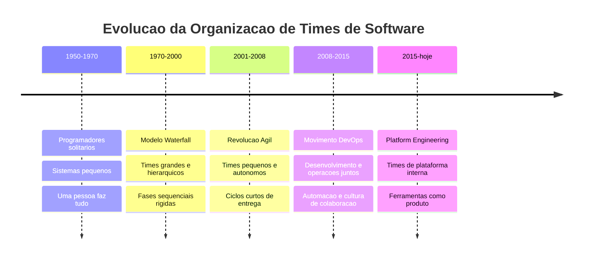
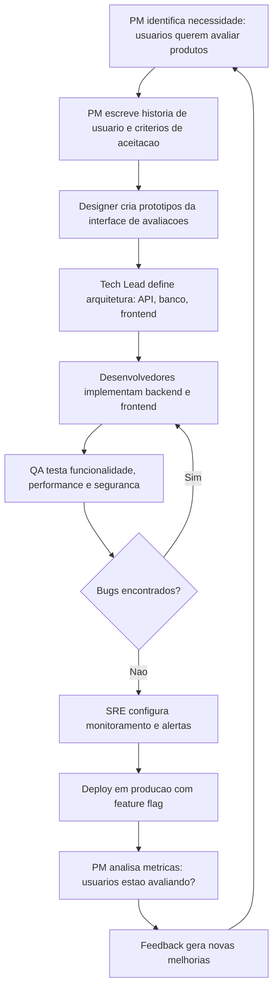
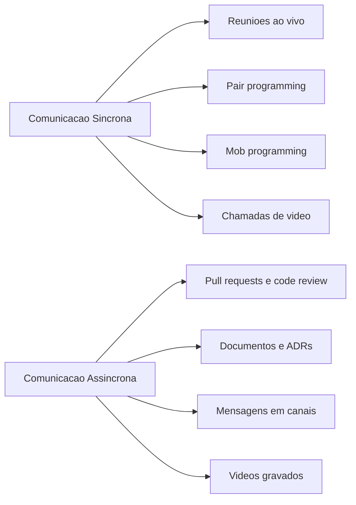
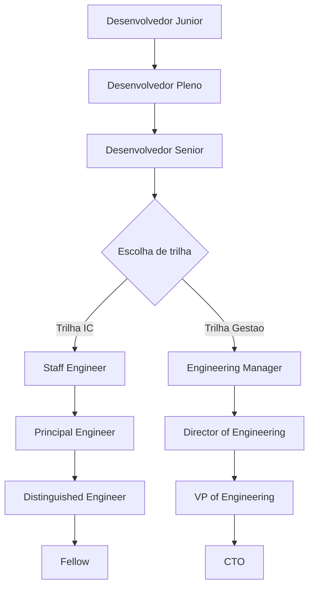

# 12.11 — Times de Tecnologia: Papéis, Responsabilidades e Como Equipes Funcionam

[← Anterior: Curiosidade e Bases Sólidas](cap12-mod10-curiosidade-bases.md) · [Próximo: A Jornada Profissional →](cap12-mod12-jornada-profissional.md)

---

## Introdução

No módulo anterior, falamos sobre curiosidade e bases sólidas — o perfil do profissional que prospera em tecnologia. Vimos que o conhecimento técnico é fundamental, mas que a postura de aprendizado contínuo é o que realmente diferencia os melhores profissionais. Agora vamos dar um passo além: entender o ambiente onde esse profissional trabalha.

Até agora neste curso, você trabalhou sozinho. Escreveu código no seu computador, testou no seu terminal, resolveu problemas por conta própria. Mas no mundo real, software é construído por equipes. E entender como essas equipes são organizadas, quais papéis existem e como as pessoas colaboram é tão importante quanto saber programar.

Pense assim: um jogador de futebol pode ser tecnicamente brilhante, mas se não entende as posições dos colegas, não sabe quando passar a bola e não se comunica em campo, o time não funciona. Em tecnologia é a mesma coisa. Você pode ser um excelente programador, mas se não entende o papel do Product Manager, não sabe como colaborar com o designer e não consegue se comunicar com o time de infraestrutura, sua eficiência cai drasticamente.

Muitos desenvolvedores iniciantes entram no mercado sem entender a estrutura ao redor deles. Não sabem o que um Product Manager faz, não entendem por que existe um DBA, não sabem a diferença entre um tech lead e um CTO. Isso gera confusão, frustração e, às vezes, conflitos desnecessários.

Neste módulo, vamos mapear os papéis mais comuns em equipes de tecnologia, entender suas responsabilidades, ver como todos trabalham juntos para entregar software, e explorar como a organização de times evoluiu ao longo das décadas. Vamos também falar sobre algo que ninguém ensina na faculdade: como sobreviver e prosperar como júnior dentro de um time.

No próximo módulo, vamos aprofundar a jornada profissional — os níveis de carreira, o que diferencia um júnior de um sênior, e as duas trilhas possíveis: técnica e gestão. Mas antes de falar sobre crescimento individual, precisamos entender o ecossistema onde esse crescimento acontece.

---

## A Evolução dos Times de Tecnologia: De Programadores Solitários a Equipes Multidisciplinares

Para entender como os times de tecnologia funcionam hoje, vale olhar para trás e ver como chegamos aqui. A história dos times de software é uma história de tentativa e erro — de modelos que funcionavam em uma época e falhavam em outra.

### Os Primórdios: O Programador Solitário (1950-1970)

Nos primeiros anos da computação, não existiam "times de software" como conhecemos. Programar era uma atividade quase artesanal. Uma pessoa — ou um grupo muito pequeno — escrevia todo o código de um sistema. Grace Hopper, uma das pioneiras da computação, trabalhou praticamente sozinha no primeiro compilador da história (o A-0 System, em 1952). Não havia Product Managers, designers, QAs ou SREs. O programador fazia tudo.

Isso funcionava porque os sistemas eram relativamente simples. Um programa de folha de pagamento cabia em algumas centenas de linhas de código. Mas conforme os sistemas cresceram, ficou claro que uma pessoa sozinha não dava conta.

### A Era Waterfall: Equipes Grandes e Hierárquicas (1970-1990)

Na década de 1970, a engenharia de software tentou se inspirar na engenharia civil. O modelo **Waterfall** (cascata) organizava o desenvolvimento em fases sequenciais: primeiro os analistas definiam todos os requisitos, depois os arquitetos projetavam o sistema, depois os programadores codificavam, depois os testadores testavam, e finalmente o time de operações colocava em produção.

Cada fase tinha um time diferente, e a comunicação entre eles era formal — documentos, especificações, aprovações. Era como uma linha de montagem: cada grupo fazia sua parte e passava para o próximo.

O problema? Software não é uma ponte. Requisitos mudam, usuários descobrem que querem algo diferente, tecnologias evoluem. Quando o time de testes encontrava um bug fundamental, já era tarde — o projeto estava meses adiantado e voltar era caro. O relatório CHAOS do Standish Group, publicado pela primeira vez em 1994, revelou que apenas 16% dos projetos de software eram entregues no prazo e orçamento. O modelo waterfall era previsível no papel, mas caótico na prática.

### A Revolução Ágil: Times Pequenos e Autônomos (2001-presente)

Em fevereiro de 2001, dezessete desenvolvedores se reuniram em um resort de ski em Snowbird, Utah, nos Estados Unidos. Entre eles estavam nomes como Kent Beck (criador do Extreme Programming), Martin Fowler, Robert C. Martin (Uncle Bob) e Ward Cunningham (inventor do wiki). Eles tinham algo em comum: estavam frustrados com o modelo waterfall.

O resultado dessa reunião foi o **Manifesto Ágil** — um documento de quatro valores e doze princípios que mudou para sempre como software é construído. Os valores centrais eram:

- **Indivíduos e interações** mais que processos e ferramentas
- **Software funcionando** mais que documentação abrangente
- **Colaboração com o cliente** mais que negociação de contratos
- **Responder a mudanças** mais que seguir um plano

Na prática, isso significou times menores, ciclos mais curtos, feedback mais rápido e menos burocracia. Em vez de planejar tudo por 6 meses e depois construir por mais 6, os times passaram a entregar incrementos pequenos a cada 2-4 semanas.

### DevOps e Platform Engineering: Quebrando Silos (2008-presente)

Mesmo com o ágil, ainda existia uma divisão clara: o time de desenvolvimento construía o software, e o time de operações colocava em produção. Essa divisão criava um problema clássico: os desenvolvedores queriam lançar features rápido, e o time de operações queria estabilidade. Os dois objetivos entravam em conflito.

Em 2008, Patrick Debois e Andrew Shafer começaram a discutir essa tensão em uma conferência. Em 2009, Debois organizou o primeiro **DevOpsDays** em Ghent, na Bélgica, e o termo "DevOps" nasceu. A ideia central era simples: derrubar o muro entre desenvolvimento e operações. Em vez de times separados que jogam software "por cima do muro", criar uma cultura onde todos são responsáveis pelo software desde o código até a produção.

Mais recentemente, surgiu o conceito de **Platform Engineering** — times dedicados a construir plataformas internas que facilitam o trabalho dos desenvolvedores. Em vez de cada time configurar sua própria infraestrutura, o time de plataforma oferece ferramentas prontas: pipelines de CI/CD, ambientes de teste, monitoramento. É como se fosse um "produto interno" da empresa.

Essa evolução não foi linear nem uniforme. Muitas empresas ainda usam modelos waterfall (especialmente em setores regulados como bancos e governo). Outras misturam abordagens. O importante é entender que a forma como times são organizados afeta diretamente a qualidade do software que produzem — e isso nos leva a um conceito fundamental.

---

## A Lei de Conway: A Estrutura do Time Define a Estrutura do Software

Em 1967, o cientista da computação Melvin Conway publicou um artigo com uma observação que se tornou uma das leis mais citadas da engenharia de software:

> "Organizações que projetam sistemas são restritas a produzir designs que são cópias das estruturas de comunicação dessas organizações."

Em linguagem simples: **a arquitetura do seu software vai espelhar a estrutura do seu time**. Se você tem três times separados — frontend, backend e banco de dados — seu sistema vai ter três camadas separadas que se comunicam por interfaces formais. Se você tem um time único que cuida de tudo, seu sistema tende a ser mais integrado.

Isso não é apenas teoria. A Amazon percebeu isso na prática no início dos anos 2000. Jeff Bezos emitiu o famoso "API Mandate" — um memorando interno que obrigava todos os times a se comunicarem exclusivamente por APIs. Cada time era dono de um serviço, e a única forma de acessar dados de outro time era através de uma API pública. Isso forçou uma arquitetura de microserviços que se tornou a base da AWS.

A Lei de Conway tem implicações práticas para você como desenvolvedor:

- Se o time de frontend e o time de backend não se comunicam bem, a API entre eles vai ser confusa
- Se o time de dados é isolado, as decisões de modelagem vão ser desconectadas das necessidades da aplicação
- Se o time de segurança só aparece no final do projeto, a segurança vai ser um "remendo" em vez de parte do design

Empresas que entendem a Lei de Conway organizam seus times de forma intencional. O Spotify, por exemplo, criou o modelo de "squads" — times pequenos e autônomos, cada um responsável por uma parte do produto. Cada squad tem todos os papéis necessários (desenvolvedor, designer, PM) para funcionar de forma independente. Isso produz software modular, onde cada parte pode evoluir sem depender das outras.

---

## Como Equipes de Tecnologia Sao Organizadas Hoje

Não existe uma estrutura única — cada empresa organiza suas equipes de forma diferente. Mas existem padrões comuns que você vai encontrar na maioria dos lugares.

### O Time de Produto

Em empresas modernas, o desenvolvimento de software é organizado em torno de **times de produto** — equipes multidisciplinares responsáveis por uma parte do sistema ou por um produto específico. Um time de produto típico inclui:

- Desenvolvedores (quem escreve o código)
- Product Manager (quem define o que construir)
- Designer (quem projeta a experiência do usuário)
- QA / Tester (quem garante a qualidade)

Esses times são geralmente pequenos — entre 5 e 10 pessoas — porque equipes menores se comunicam melhor e tomam decisões mais rápido. Jeff Bezos, fundador da Amazon, popularizou a regra das "duas pizzas": se o time não pode ser alimentado com duas pizzas, é grande demais. A razão é matemática: em um time de 5 pessoas, existem 10 canais de comunicação possíveis. Em um time de 10, são 45. Em um time de 15, são 105. A complexidade de comunicação cresce exponencialmente.

### Areas de Suporte

Além dos times de produto, existem áreas que suportam toda a organização:

- **Infraestrutura / SRE** (quem mantém os sistemas rodando)
- **Segurança** (quem protege os sistemas e dados)
- **Dados** (quem cuida de bancos de dados, analytics e pipelines)
- **Gestão** (quem coordena pessoas e estratégia)
- **Plataforma** (quem constrói ferramentas internas para outros times)

### Modelos de Organizacao

Diferentes empresas adotam diferentes modelos. Aqui estão os mais comuns:

| Modelo | Descricao | Exemplo | Vantagem | Desvantagem |
|--------|-----------|---------|----------|-------------|
| Funcional | Times por especialidade: frontend, backend, dados | Empresas tradicionais | Profundidade tecnica | Silos de comunicacao |
| Produto | Times multidisciplinares por produto ou feature | Spotify, Netflix | Autonomia e velocidade | Duplicacao de conhecimento |
| Matricial | Pessoas pertencem a um time funcional mas trabalham em projetos | Consultorias | Flexibilidade | Conflito de prioridades |
| Plataforma | Times de produto + time de plataforma interna | Mercado Livre, Nubank | Padronizacao com autonomia | Custo do time de plataforma |

---

## Os Papeis em Detalhes

Vamos agora mergulhar em cada papel. Para cada um, vamos ver não apenas o que a pessoa faz, mas por que o papel existe, qual problema resolve e como é o dia a dia.

### Desenvolvedor (Developer / Engineer)

É o papel que você está se preparando para exercer. O desenvolvedor escreve código, resolve problemas técnicos, implementa funcionalidades e corrige bugs.

Mas "escrever código" é uma simplificação enorme. No dia a dia, um desenvolvedor gasta surpreendentemente pouco tempo escrevendo código novo. Estudos mostram que desenvolvedores passam entre 35% e 50% do tempo lendo código existente, entendendo o sistema e planejando mudanças. O resto se divide entre reuniões, code reviews, debugging, documentação e comunicação.

Um dia típico de um desenvolvedor pode ser assim:

- **9h00** — Daily standup: reunião de 15 minutos onde cada pessoa diz o que fez ontem, o que vai fazer hoje e se tem algum impedimento
- **9h15** — Revisar pull requests de colegas (code review)
- **10h00** — Trabalhar em uma feature: ler o código existente, planejar a mudança, implementar
- **12h00** — Almoço
- **13h00** — Reunião de refinamento: discutir com o PM e o designer os próximos itens do backlog
- **14h00** — Continuar a feature, escrever testes
- **16h00** — Investigar um bug reportado por QA
- **17h00** — Atualizar documentação e responder mensagens

Desenvolvedores podem se especializar em áreas:

| Especializacao | Foco | Tecnologias tipicas | Salario medio Brasil 2024 |
|---------------|------|-------------------|--------------------------|
| Frontend | Interface do usuario | HTML, CSS, JavaScript, React, Angular | R$ 6.000 - R$ 15.000 |
| Backend | Logica de negocio, APIs, banco de dados | Python, Java, Go, C#, Node.js | R$ 7.000 - R$ 18.000 |
| Fullstack | Ambos, frontend e backend | Combinacao das anteriores | R$ 7.000 - R$ 16.000 |
| Mobile | Aplicativos para celular | Swift, Kotlin, React Native, Flutter | R$ 6.000 - R$ 15.000 |
| Dados | Pipelines de dados, analytics, ML | Python, SQL, Spark, TensorFlow | R$ 8.000 - R$ 20.000 |
| Embedded | Software para dispositivos fisicos | C, C++, Rust | R$ 7.000 - R$ 16.000 |
| DevOps e SRE | Infraestrutura e confiabilidade | Docker, Kubernetes, Terraform, AWS | R$ 8.000 - R$ 22.000 |

Os valores são aproximados e variam muito por região, empresa e experiência. O importante não é escolher pela remuneração, mas pela afinidade com o tipo de problema que cada área resolve.

### Product Manager (PM)

O Product Manager é quem define **o que** o time vai construir e **por quê**. Não é um chefe — é um facilitador que conecta as necessidades do negócio com as capacidades técnicas do time.

O papel de PM surgiu na indústria de bens de consumo. Em 1931, Neil McElroy, da Procter & Gamble, escreveu um memorando propondo que cada produto tivesse um "brand man" — alguém responsável por entender o mercado, definir estratégia e coordenar o desenvolvimento. Décadas depois, empresas de tecnologia adaptaram esse conceito para o desenvolvimento de software.

Responsabilidades de um PM:

- Entender o problema do usuário (pesquisa, entrevistas, dados)
- Definir prioridades (o que construir primeiro e o que pode esperar)
- Escrever requisitos e histórias de usuário
- Alinhar expectativas entre stakeholders e time técnico
- Medir resultados (a funcionalidade resolveu o problema?)
- Dizer "não" a pedidos que não se alinham com a estratégia

Um bom PM não diz **como** construir — diz **o que** construir e **por quê**. O "como" é responsabilidade do time técnico. Essa separação é fundamental: quando o PM começa a ditar soluções técnicas, o time perde autonomia e motivação. Quando o time técnico ignora o PM e constrói o que quer, o produto perde direção.

A relação entre PM e desenvolvedores é uma das mais importantes em um time. Quando funciona bem, é uma parceria onde cada lado traz sua expertise. Quando funciona mal, vira uma guerra de "eu quero isso" contra "isso é impossível".

### SRE (Site Reliability Engineer)

O SRE é o profissional que garante que os sistemas estejam funcionando, disponíveis e performando bem. O termo foi criado pelo Google em 2003, quando Ben Treynor Sloss definiu: "SRE é o que acontece quando você pede para um engenheiro de software cuidar de operações."

Antes do SRE existir, havia o "sysadmin" — o administrador de sistemas que configurava servidores manualmente, aplicava patches e apagava incêndios. O problema é que esse modelo não escalava. Quando o Google tinha milhares de servidores, não dava para gerenciar cada um manualmente. A solução foi tratar operações como um problema de engenharia de software: automatizar tudo, medir tudo, e usar código para gerenciar infraestrutura.

Responsabilidades de um SRE:

- Monitorar sistemas em produção (alertas, dashboards, métricas)
- Responder a incidentes (quando algo cai ou fica lento)
- Automatizar tarefas operacionais (deploy, scaling, recovery)
- Definir e medir SLOs (Service Level Objectives — objetivos de nível de serviço)
- Garantir que deploys sejam seguros e reversíveis
- Planejar capacidade (o sistema aguenta o crescimento?)
- Conduzir post-mortems (análise de incidentes sem culpar pessoas)

SREs vivem na interseção entre desenvolvimento e operações. Eles escrevem código, mas o foco é em confiabilidade, não em funcionalidades. Um SRE pode passar o dia escrevendo um script que automatiza a recuperação de um banco de dados, ou configurando alertas que detectam problemas antes que os usuários percebam.

### DBA (Database Administrator)

O DBA é o especialista em bancos de dados. Em empresas menores, desenvolvedores cuidam do banco. Em empresas maiores, DBAs são dedicados — e por boas razões. Um banco de dados mal configurado pode derrubar um sistema inteiro, e uma query mal escrita pode travar um servidor por horas.

Responsabilidades:

- Projetar e otimizar schemas de banco de dados
- Monitorar performance de queries (identificar queries lentas)
- Gerenciar backups e recuperação de dados
- Planejar migração de dados (mudar de versão, mudar de banco)
- Garantir segurança e controle de acesso ao banco
- Otimizar índices e planos de execução
- Planejar capacidade de armazenamento

O DBA é como o bibliotecário de uma biblioteca gigante. Ele não escreve os livros (dados), mas organiza as estantes (tabelas), cria o sistema de busca (índices), garante que nenhum livro se perca (backups) e controla quem pode entrar em cada seção (permissões).

### Tech Lead

O Tech Lead é um desenvolvedor sênior que, além de escrever código, lidera as decisões técnicas do time. Não é um gerente de pessoas — é um líder técnico.

Responsabilidades:

- Definir arquitetura e padrões técnicos do time
- Mentorar desenvolvedores menos experientes
- Revisar decisões técnicas críticas
- Garantir qualidade do código (padrões, testes, documentação)
- Ser a ponte entre o time técnico e o PM/gestão
- Resolver impedimentos técnicos
- Equilibrar dívida técnica com entrega de features

O Tech Lead vive um dilema constante: quanto tempo dedicar a escrever código versus quanto tempo dedicar a liderar. Se passa muito tempo codando, o time fica sem direção. Se passa muito tempo em reuniões, perde contato com o código e suas decisões técnicas ficam desconectadas da realidade.

### Engineering Manager (EM)

O Engineering Manager é o gestor de pessoas do time de engenharia. Diferente do Tech Lead (que lidera tecnicamente), o EM lidera pessoas.

Responsabilidades:

- Contratar e desenvolver talentos
- Fazer one-on-ones (reuniões individuais) com cada membro do time
- Avaliar performance e dar feedback construtivo
- Remover impedimentos organizacionais
- Garantir que o time tem os recursos necessários
- Cuidar da saúde, motivação e crescimento do time
- Mediar conflitos entre membros do time

O livro "The Manager's Path" de Camille Fournier descreve bem a transição de desenvolvedor para gestor: "Você deixa de ser avaliado pelo código que escreve e passa a ser avaliado pelo código que seu time escreve." Essa mudança de mentalidade é difícil para muitos desenvolvedores, que sentem que estão "perdendo" suas habilidades técnicas.

### CTO (Chief Technology Officer)

O CTO é o executivo responsável pela estratégia tecnológica da empresa. Em startups pequenas, o CTO pode escrever código. Em empresas grandes, o CTO define direção e lidera outros líderes.

Responsabilidades:

- Definir a visão tecnológica da empresa (quais tecnologias, quais plataformas)
- Escolher tecnologias e plataformas estratégicas
- Liderar a organização de engenharia (dezenas ou centenas de pessoas)
- Alinhar tecnologia com objetivos de negócio
- Representar tecnologia no nível executivo (board, investidores)
- Definir cultura de engenharia (como o time trabalha, quais valores prioriza)

### Outros Papeis Importantes

| Papel | Responsabilidade principal | Por que existe |
|-------|--------------------------|----------------|
| QA Engineer | Garantir qualidade atraves de testes manuais e automatizados | Desenvolvedores tendem a testar o "caminho feliz" e ignorar casos de borda |
| Designer UX/UI | Projetar a experiencia e interface do usuario | Software funcional mas confuso nao resolve o problema do usuario |
| DevOps Engineer | Automatizar infraestrutura e pipelines de CI/CD | Deploy manual e lento e propenso a erros |
| Security Engineer | Proteger sistemas contra ameacas e vulnerabilidades | Seguranca como "remendo" no final nao funciona |
| Data Engineer | Construir pipelines de dados e infraestrutura de analytics | Dados brutos sem processamento nao geram valor |
| Scrum Master | Facilitar processos ageis e remover impedimentos | Times precisam de alguem focado em melhorar o processo |
| Arquiteto de Software | Definir arquitetura de sistemas complexos | Decisoes de arquitetura erradas custam meses para corrigir |
| Technical Writer | Escrever documentacao tecnica clara e completa | Documentacao ruim gera retrabalho e confusao |

---

## Como Esses Papeis Interagem: O Ciclo de Vida de uma Feature

Para entender como todos esses papéis trabalham juntos, vamos acompanhar o caminho de uma feature — desde a ideia até a produção. Imagine que uma empresa de e-commerce quer adicionar um sistema de avaliações de produtos.

Esse ciclo é contínuo. Cada feature passa por todas essas etapas, e o feedback de uma feature alimenta as decisões sobre a próxima. Não é um processo linear — é um ciclo que se repete constantemente.

Vamos detalhar cada etapa:

1. **Descoberta (PM + Designer)**: O PM conversa com usuários, analisa dados e identifica que muitos clientes pedem avaliações de produtos. O designer faz pesquisa de usabilidade para entender como os usuários querem avaliar.

2. **Definição (PM + Tech Lead)**: O PM escreve a história de usuário: "Como cliente, quero avaliar produtos que comprei para ajudar outros clientes a decidir." O Tech Lead avalia a viabilidade técnica e estima o esforço.

3. **Design (Designer + Desenvolvedores)**: O designer cria protótipos da interface. Os desenvolvedores dão feedback sobre o que é viável tecnicamente.

4. **Implementação (Desenvolvedores)**: Os desenvolvedores escrevem o código — API para salvar avaliações, frontend para exibir e coletar, lógica de cálculo de média.

5. **Validação (QA)**: O QA testa cenários: e se o usuário tentar avaliar sem ter comprado? E se enviar texto com caracteres especiais? E se mil pessoas avaliarem ao mesmo tempo?

6. **Deploy (SRE + Desenvolvedores)**: O SRE configura o deploy gradual — primeiro para 1% dos usuários, depois 10%, depois 100%. Se algo der errado, é fácil reverter.

7. **Monitoramento (SRE + PM)**: Após o deploy, o SRE monitora métricas técnicas (latência, erros) e o PM monitora métricas de produto (quantos usuários avaliaram, qual a nota média).

---

## Metodologias Ageis: Como Times se Organizam no Dia a Dia

Entender os papéis é importante, mas como essas pessoas se organizam no dia a dia? É aqui que entram as metodologias ágeis — frameworks que definem como o trabalho é planejado, executado e revisado.

### Scrum

O Scrum é o framework ágil mais popular. Foi criado por Jeff Sutherland e Ken Schwaber no início dos anos 1990. O nome vem do rugby — "scrum" é a formação onde os jogadores se juntam para disputar a bola. A metáfora é intencional: o time trabalha junto, de forma coordenada, para avançar.

O Scrum organiza o trabalho em ciclos chamados **sprints** — períodos fixos de 1 a 4 semanas (geralmente 2 semanas). Cada sprint tem:

- **Sprint Planning**: reunião no início para definir o que será feito
- **Daily Standup**: reunião diária de 15 minutos para sincronizar o time
- **Sprint Review**: demonstração do que foi construído para stakeholders
- **Sprint Retrospective**: reflexão sobre o que funcionou e o que pode melhorar

Os papéis no Scrum são:

- **Product Owner** (similar ao PM): define as prioridades do backlog
- **Scrum Master**: facilita o processo e remove impedimentos
- **Development Team**: o time que constrói (desenvolvedores, designers, QAs)

### Kanban

O Kanban é uma alternativa mais flexível ao Scrum. Não tem sprints fixos — o trabalho flui continuamente. O nome vem do japonês e significa "cartão visual". Foi adaptado do sistema de produção da Toyota para o desenvolvimento de software por David Anderson em 2007.

O Kanban usa um quadro visual com colunas que representam os estágios do trabalho:

| Backlog | Em Andamento | Em Revisao | Em Teste | Concluido |
|---------|-------------|------------|----------|-----------|
| Feature A | Feature C | Feature B | | Feature D |
| Feature E | | | | Feature F |
| Feature G | | | | |

A regra principal do Kanban é o **WIP limit** (Work In Progress limit) — um limite de quantos itens podem estar em cada coluna ao mesmo tempo. Se o limite de "Em Andamento" é 3, ninguém pode começar um novo item até que um dos três em andamento seja concluído. Isso evita o problema de ter muitas coisas começadas e nenhuma terminada.

### Scrum vs Kanban: Quando Usar Cada Um

| Criterio | Scrum | Kanban |
|----------|-------|--------|
| Cadencia | Sprints fixos | Fluxo continuo |
| Planejamento | No inicio de cada sprint | Continuo, conforme capacidade |
| Papeis definidos | Sim: PO, SM, Dev Team | Nao tem papeis obrigatorios |
| Melhor para | Projetos com escopo definido | Manutencao e suporte continuo |
| Metricas | Velocidade por sprint | Lead time e throughput |
| Mudancas | Evitadas durante o sprint | Podem entrar a qualquer momento |

Na prática, muitos times usam uma combinação dos dois — às vezes chamada de "Scrumban". O importante não é seguir um framework à risca, mas ter um processo que funcione para o time.

---

## Comunicacao: A Habilidade Mais Subestimada

Se há uma habilidade que diferencia profissionais de tecnologia bons dos excelentes, é a comunicação. Não comunicação no sentido de "falar bonito" — mas no sentido de transmitir informação de forma clara, no momento certo, para a pessoa certa.

### Por Que Comunicacao e Tao Importante

Um estudo da Stripe (empresa de pagamentos) de 2018 estimou que desenvolvedores gastam, em média, 17,3 horas por semana lidando com problemas de comunicação: código mal documentado, requisitos ambíguos, decisões não registradas, retrabalho por mal-entendidos. Isso representa quase metade da semana de trabalho.

A comunicação em times de tecnologia tem desafios específicos:

- **Explicar conceitos técnicos para pessoas não-técnicas**: o PM precisa entender por que algo vai levar 3 semanas, não 3 dias. Se você não consegue explicar sem jargão, o PM não consegue defender o prazo.

- **Documentar decisões**: por que escolhemos essa arquitetura? Quais alternativas consideramos? Daqui a 6 meses, ninguém vai lembrar — a menos que esteja documentado. O formato ADR (Architecture Decision Record) é uma ferramenta excelente para isso.

- **Dar e receber feedback**: code review é comunicação. Apontar problemas de forma construtiva é uma habilidade. "Esse código está horrível" não é feedback — é agressão. "Essa função tem 200 linhas e faz 5 coisas diferentes. Que tal dividir em funções menores?" é feedback construtivo.

- **Pedir ajuda**: saber quando você está travado e pedir ajuda é mais produtivo do que gastar 3 dias tentando resolver sozinho algo que um colega resolveria em 30 minutos. A regra dos 30 minutos é útil: se você está travado há mais de 30 minutos sem progresso, peça ajuda.

- **Escrever bem**: e-mails, mensagens, documentação, comentários no código. Profissionais que escrevem com clareza são mais eficientes e causam menos mal-entendidos.

### Padroes de Colaboracao

Além da comunicação verbal e escrita, existem padrões de colaboração que times de tecnologia usam:

**Pair Programming** (programação em par): dois desenvolvedores trabalham juntos no mesmo código. Um escreve (o "driver") e o outro revisa em tempo real (o "navigator"). Parece ineficiente — duas pessoas fazendo o trabalho de uma? Na prática, estudos mostram que pair programming produz código com 15% menos bugs e facilita a transferência de conhecimento. É especialmente útil quando um júnior trabalha com um sênior.

**Mob Programming** (programação em grupo): todo o time trabalha junto no mesmo código, com um computador. Uma pessoa digita, as outras guiam. Parece ainda mais ineficiente, mas é excelente para resolver problemas complexos onde múltiplas perspectivas são necessárias.

**Code Review assíncrono**: o desenvolvedor abre um pull request, e colegas revisam quando têm tempo. É o modelo mais comum em times distribuídos. A chave é manter os pull requests pequenos (menos de 400 linhas de mudança) para que a revisão seja rápida e eficaz.

**Comunicação assíncrona**: em vez de reuniões para tudo, usar documentos, mensagens e vídeos gravados. Isso é especialmente importante em times com fusos horários diferentes. A empresa Basecamp (criadora do Ruby on Rails) é famosa por priorizar comunicação assíncrona — eles escrevem documentos detalhados em vez de fazer reuniões.

Na prática, times saudáveis usam uma combinação dos dois tipos. Reuniões síncronas são boas para decisões rápidas e alinhamento. Comunicação assíncrona é boa para documentação, revisão de código e discussões que não precisam de resposta imediata. O segredo é usar cada tipo no momento certo — e não transformar tudo em reunião.

---

## Trabalho Remoto vs Presencial: O Mundo Pos-Pandemia

A pandemia de COVID-19 em 2020 forçou uma transformação que a indústria de tecnologia já vinha discutindo há anos: o trabalho remoto em massa. De um dia para o outro, milhões de desenvolvedores passaram a trabalhar de casa.

O que descobrimos:

- **Trabalho remoto funciona** para a maioria das tarefas de desenvolvimento. Código pode ser escrito de qualquer lugar.
- **Comunicação assíncrona se tornou essencial**. Times que dependiam de "bater no ombro do colega" tiveram que aprender a documentar e comunicar por escrito.
- **Onboarding de juniores ficou mais difícil**. Aprender observando colegas (o "aprendizado por osmose") é muito mais difícil remotamente.
- **Saúde mental virou prioridade**. Isolamento, burnout e dificuldade de separar trabalho de vida pessoal afetaram muitos profissionais.

Hoje, a maioria das empresas de tecnologia adota um dos três modelos:

| Modelo | Descricao | Exemplos | Vantagem | Desvantagem |
|--------|-----------|----------|----------|-------------|
| Totalmente remoto | Sem escritorio fisico | GitLab, Automattic, Zapier | Acesso a talentos globais | Isolamento, comunicacao mais dificil |
| Hibrido | Alguns dias no escritorio, outros em casa | Google, Microsoft, Nubank | Flexibilidade com conexao presencial | Complexidade logistica |
| Totalmente presencial | Todos no escritorio todos os dias | Algumas startups, bancos tradicionais | Comunicacao facil, cultura forte | Limita pool de talentos |

Para você como júnior, o modelo importa. Em um ambiente presencial, é mais fácil aprender observando colegas e fazendo perguntas rápidas. Em um ambiente remoto, você precisa ser mais proativo: documentar dúvidas, agendar sessões de pair programming, e não ter medo de mandar mensagem pedindo ajuda.

---

## Trilhas de Carreira: IC vs Gestao

Uma das decisões mais importantes na carreira de um profissional de tecnologia é escolher entre duas trilhas: a trilha de **contribuidor individual** (IC — Individual Contributor) e a trilha de **gestão** (Management).

Essa distinção nem sempre existiu. Até os anos 2000, a única forma de "crescer" em muitas empresas era virar gerente. Desenvolvedores excelentes eram "promovidos" para cargos de gestão — e muitos odiavam. Perdiam contato com o código, passavam o dia em reuniões e sentiam que tinham perdido o que amavam fazer.

Empresas como Google, Facebook e Microsoft perceberam o problema e criaram trilhas paralelas. Hoje, um Staff Engineer (trilha IC) pode ter o mesmo nível hierárquico, salário e influência que um Engineering Manager (trilha gestão). São caminhos diferentes, não superiores ou inferiores.

### Trilha IC (Individual Contributor)

Na trilha IC, você continua sendo um profissional técnico. Seu impacto cresce não porque você gerencia mais pessoas, mas porque suas decisões técnicas afetam sistemas maiores e mais complexos.

| Nivel | Escopo de impacto | O que faz de diferente |
|-------|-------------------|----------------------|
| Junior | Tarefas individuais | Aprende e executa com orientacao |
| Pleno | Features completas | Executa com autonomia |
| Senior | Sistemas e times | Define solucoes e mentora |
| Staff | Multiplos times | Define direcao tecnica entre times |
| Principal | Organizacao inteira | Define estrategia tecnica da empresa |
| Distinguished/Fellow | Industria | Influencia a industria como um todo |

### Trilha de Gestao

Na trilha de gestão, seu impacto cresce através das pessoas. Você deixa de ser avaliado pelo código que escreve e passa a ser avaliado pelo crescimento e produtividade do seu time.

| Nivel | Escopo de impacto | O que faz de diferente |
|-------|-------------------|----------------------|
| Tech Lead | Um time | Lidera tecnicamente, ainda escreve codigo |
| Engineering Manager | Um time | Gerencia pessoas, pouco ou nenhum codigo |
| Director | Multiplos times | Define estrategia para uma area |
| VP of Engineering | Departamento | Define estrategia para toda engenharia |
| CTO | Empresa | Define visao tecnologica da empresa |

A escolha entre as trilhas não precisa ser definitiva. Muitos profissionais alternam — passam alguns anos como IC, experimentam gestão, e voltam para IC (ou vice-versa). O importante é entender que ambas são caminhos legítimos e valorizados.

---

## Resolucao de Conflitos em Times Tecnicos

Onde há pessoas, há conflitos. Em times de tecnologia, os conflitos mais comuns são:

**Conflitos técnicos**: "Devemos usar microserviços ou monolito?" "React ou Angular?" "SQL ou NoSQL?" Esses conflitos são saudáveis quando tratados como discussões técnicas com argumentos e dados. Ficam tóxicos quando viram guerras de ego.

**Conflitos de prioridade**: "O PM quer a feature X, mas o tech lead quer pagar dívida técnica." Esse conflito é natural e esperado. A solução é negociação: talvez 70% do sprint para features e 30% para dívida técnica.

**Conflitos interpessoais**: "Fulano nunca aceita feedback no code review." "Ciclano domina todas as reuniões." Esses conflitos precisam ser mediados — geralmente pelo Engineering Manager.

**Conflitos de processo**: "Scrum não funciona para nosso time." "As reuniões são longas demais." A retrospectiva é o momento certo para discutir isso.

Algumas práticas que ajudam a prevenir e resolver conflitos:

1. **Separar a pessoa da ideia**: criticar o código, não o programador. "Essa abordagem tem um problema de performance" é diferente de "Você não sabe programar."

2. **Usar dados, não opiniões**: "Microserviços vão aumentar a latência em 50ms por chamada" é mais produtivo que "Microserviços são ruins."

3. **Documentar decisões**: quando uma decisão técnica é tomada, registrar o contexto, as alternativas consideradas e o motivo da escolha. Isso evita rediscutir a mesma coisa meses depois.

4. **Assumir boa intenção**: quando alguém faz algo que parece errado, assumir primeiro que a pessoa tinha uma boa razão. Perguntar "por que você fez assim?" antes de criticar.

5. **Escalar quando necessário**: se dois desenvolvedores não conseguem concordar, o Tech Lead decide. Se o Tech Lead e o PM não concordam, o Engineering Manager media. Escalar não é fraqueza — é maturidade.

---

## Como Sobreviver e Prosperar Como Junior em um Time

Entrar em um time como júnior pode ser intimidador. Todo mundo parece saber mais que você, o código parece incompreensível, e você tem medo de fazer perguntas "bobas". Isso é completamente normal — todo sênior já foi júnior e sentiu exatamente a mesma coisa.

Aqui estão práticas que vão te ajudar:

**Faça perguntas sem medo**. Não existe pergunta boba. O que existe é ficar travado por horas em algo que um colega explicaria em 5 minutos. A maioria dos seniores gosta de ensinar — faz parte do papel deles.

**Documente o que aprende**. Crie um documento pessoal com anotações sobre o sistema, decisões do time, e coisas que você aprendeu. Isso acelera seu aprendizado e mostra proatividade.

**Peça feedback ativamente**. Não espere a avaliação semestral. Depois de terminar uma tarefa, pergunte ao seu Tech Lead: "O que eu poderia ter feito melhor?" Feedback frequente acelera o crescimento.

**Entenda o contexto antes de sugerir mudanças**. É tentador olhar para o código e pensar "isso está errado, eu faria diferente." Mas código legado existe por razões. Antes de sugerir mudanças, entenda por que as coisas são como são.

**Seja confiável nas coisas pequenas**. Entregue no prazo, avise quando estiver atrasado, responda mensagens, apareça nas reuniões. Confiabilidade é a base da confiança, e confiança é a base da autonomia.

**Aprenda o domínio do negócio**. Não basta saber programar — entenda o que a empresa faz, quem são os usuários, e como o software gera valor. Um júnior que entende o negócio toma decisões melhores do que um que só entende código.

**Participe ativamente de code reviews**. Mesmo como júnior, você pode (e deve) revisar código de colegas. Você vai aprender muito lendo código de pessoas mais experientes, e suas perguntas podem revelar problemas que ninguém mais notou.

---

## Como a IA pode te ajudar aqui

A inteligência artificial pode ser uma parceira valiosa para entender a dinâmica de times de tecnologia e se preparar para o mercado de trabalho.

**Prompt 1 — Explorar papéis e responsabilidades:**
> "Descreva o dia a dia típico de um SRE em uma empresa de médio porte. Quais ferramentas ele usa, quais problemas resolve e como interage com o time de desenvolvimento?"

**Prompt 2 — Simular cenários de time:**
> "Simule uma situação onde o Product Manager quer lançar uma feature urgente, mas o Tech Lead diz que o sistema precisa de refatoração antes. Como cada lado argumentaria? Como resolver esse conflito?"

**Prompt 3 — Preparar para entrevistas:**
> "Quais perguntas sobre trabalho em equipe e colaboração são comuns em entrevistas para desenvolvedor júnior? Me dê exemplos de boas respostas."

**Prompt 4 — Entender metodologias:**
> "Explique a diferença entre Scrum e Kanban com exemplos práticos. Em que tipo de projeto cada um funciona melhor?"

Lembre-se: a IA é uma ferramenta de aprendizado, não um substituto para a experiência real. Use-a para explorar cenários, tirar dúvidas e se preparar, mas o aprendizado verdadeiro acontece quando você está dentro de um time, colaborando com pessoas reais.

---

## Casos de Uso no Mundo Real

### Caso 1: O Modelo de Squads do Spotify

Em 2012, Henrik Kniberg e Anders Ivarsson publicaram um whitepaper descrevendo como o Spotify organizava seus times de engenharia. O modelo se tornou uma referência mundial.

**O problema**: o Spotify estava crescendo rapidamente — de dezenas para centenas de engenheiros. Com times tradicionais, a comunicação ficava lenta, as dependências entre times travavam o desenvolvimento, e a autonomia diminuía.

**A solução**: o Spotify criou "squads" — times pequenos (6-12 pessoas) e autônomos, cada um responsável por uma parte do produto (busca, playlists, pagamentos, etc.). Cada squad tinha todos os papéis necessários: desenvolvedores, designer, PM. Squads com missões relacionadas eram agrupados em "tribes" (tribos). Profissionais da mesma especialidade (todos os desenvolvedores backend, por exemplo) se conectavam em "chapters" para compartilhar conhecimento.

**O resultado**: o Spotify conseguiu escalar de 30 para mais de 300 engenheiros mantendo velocidade de entrega e qualidade. O modelo inspirou centenas de empresas ao redor do mundo — incluindo empresas brasileiras como Nubank e iFood.

**A lição**: a estrutura do time não é um detalhe administrativo — é uma decisão de engenharia que afeta diretamente a qualidade e velocidade do software.

### Caso 2: O Incidente do Knight Capital (2012) e a Importancia de Processos

Em 1 de agosto de 2012, a Knight Capital Group — uma das maiores empresas de trading dos Estados Unidos — perdeu 440 milhões de dólares em 45 minutos por causa de um erro de deploy.

**O que aconteceu**: um técnico esqueceu de atualizar o software em um dos oito servidores. O servidor antigo executou um código de teste que comprava e vendia ações descontroladamente. Em 45 minutos, a empresa acumulou posições de 7 bilhões de dólares que não deveria ter.

**O problema de time**: não havia processo claro de deploy. Não havia checklist. Não havia automação que garantisse que todos os servidores estivessem na mesma versão. Não havia monitoramento que detectasse o comportamento anômalo rapidamente. Era um problema de processo e comunicação, não de código.

**A lição**: times de tecnologia precisam de processos claros, automação de deploy, monitoramento e comunicação eficiente. Um único ponto de falha humana — um técnico esquecendo um servidor — destruiu uma empresa de 17 anos em menos de uma hora.

### Caso 3: A Transformacao do Nubank

O Nubank, fundado em 2013 por David Vélez, Cristina Junqueira e Edward Wible, é um exemplo brasileiro de como a organização de times de tecnologia pode ser uma vantagem competitiva.

**O contexto**: os bancos tradicionais brasileiros tinham times de tecnologia organizados em silos — um time para o app, outro para o backend, outro para o banco de dados, outro para infraestrutura. Mudanças simples exigiam coordenação entre múltiplos times e levavam semanas.

**A abordagem do Nubank**: desde o início, o Nubank organizou seus times em squads autônomos, cada um responsável por um domínio do negócio (cartão de crédito, conta corrente, investimentos). Cada squad tinha autonomia para escolher tecnologias, definir arquitetura e fazer deploy independentemente. A linguagem principal escolhida foi Clojure — uma decisão técnica ousada que atraiu engenheiros de alto nível.

**O resultado**: o Nubank conseguiu lançar produtos novos em semanas, enquanto bancos tradicionais levavam meses. Em 2023, o Nubank tinha mais de 80 milhões de clientes e era o maior banco digital do mundo fora da China. A organização dos times foi um fator decisivo nessa velocidade.

---

## Resumo do Módulo

| Conceito | Definicao |
|----------|-----------|
| Time de produto | Equipe multidisciplinar responsavel por uma parte do sistema |
| Lei de Conway | A arquitetura do software espelha a estrutura do time |
| Desenvolvedor | Profissional que escreve codigo e resolve problemas tecnicos |
| SRE | Engenheiro focado em confiabilidade e operacao de sistemas |
| Product Manager | Define o que construir e por que, com base em necessidades do usuario |
| DBA | Especialista em bancos de dados, performance e seguranca de dados |
| Tech Lead | Desenvolvedor senior que lidera decisoes tecnicas |
| Engineering Manager | Gestor de pessoas do time de engenharia |
| CTO | Executivo responsavel pela estrategia tecnologica |
| Scrum | Framework agil com sprints fixos e papeis definidos |
| Kanban | Metodo de fluxo continuo com limites de trabalho em progresso |
| Trilha IC | Carreira tecnica: Junior ate Distinguished Engineer |
| Trilha Gestao | Carreira de lideranca: Tech Lead ate CTO |
| Pair Programming | Dois desenvolvedores trabalhando juntos no mesmo codigo |
| Manifesto Agil | Documento de 2001 que definiu os valores do desenvolvimento agil |
| DevOps | Cultura que une desenvolvimento e operacoes |

---

## Glossário do Módulo

| Termo | Definicao |
|-------|-----------|
| ADR - Architecture Decision Record | Documento que registra uma decisao de arquitetura, o contexto e as alternativas |
| Agile - Agil | Conjunto de valores e principios para desenvolvimento iterativo e colaborativo |
| Backlog | Lista priorizada de itens de trabalho a serem feitos |
| Backend | Parte do sistema que processa logica e dados, invisivel ao usuario |
| Burnout | Esgotamento fisico e mental causado por excesso de trabalho |
| Code review | Processo de revisao de codigo por colegas antes da integracao |
| CTO - Chief Technology Officer | Executivo responsavel pela estrategia tecnologica da empresa |
| Daily standup | Reuniao diaria curta para sincronizar o time |
| DBA - Database Administrator | Administrador de banco de dados |
| DevOps | Cultura e praticas que unem desenvolvimento e operacoes |
| Engineering Manager | Gestor de pessoas em times de engenharia |
| Feature flag | Mecanismo que permite ativar ou desativar funcionalidades sem novo deploy |
| Frontend | Parte do sistema que o usuario ve e interage diretamente |
| Fullstack | Profissional que trabalha com frontend e backend |
| IC - Individual Contributor | Profissional que contribui tecnicamente sem gerenciar pessoas |
| Kanban | Metodo de gestao visual de fluxo de trabalho |
| Lead time | Tempo total desde o pedido ate a entrega |
| Manifesto Agil | Documento de 2001 com quatro valores e doze principios para desenvolvimento de software |
| Mob programming | Pratica onde todo o time programa junto em um unico computador |
| On-call | Plantao para responder a incidentes em producao fora do horario |
| One-on-one | Reuniao individual entre gestor e membro do time |
| Pair programming | Pratica onde dois desenvolvedores trabalham juntos no mesmo codigo |
| Platform Engineering | Disciplina de construir plataformas internas para facilitar o trabalho de outros times |
| PM - Product Manager | Profissional que define o que construir e prioriza o backlog |
| Post-mortem | Analise de um incidente para entender causas e prevenir recorrencia |
| Pull request | Solicitacao de revisao e integracao de codigo em um repositorio |
| QA - Quality Assurance | Garantia de qualidade, testes manuais e automatizados |
| Scrum | Framework agil com sprints, papeis definidos e cerimonias |
| Scrum Master | Facilitador do processo Scrum que remove impedimentos |
| SLO - Service Level Objective | Objetivo mensuravel de nivel de servico |
| Sprint | Ciclo fixo de trabalho no Scrum, geralmente de 2 semanas |
| Sprint Planning | Reuniao de planejamento no inicio de cada sprint |
| Sprint Retrospective | Reuniao de reflexao sobre o que funcionou e o que melhorar |
| Sprint Review | Demonstracao do trabalho concluido para stakeholders |
| Squad | Time pequeno e autonomo responsavel por uma parte do produto |
| SRE - Site Reliability Engineer | Engenheiro de confiabilidade de sistemas |
| Stakeholder | Pessoa interessada ou afetada pelo projeto |
| Tech Lead | Lider tecnico de um time de desenvolvimento |
| Throughput | Quantidade de itens entregues por unidade de tempo |
| Tribe | Agrupamento de squads com missoes relacionadas |
| Waterfall - Cascata | Modelo sequencial de desenvolvimento com fases rigidas |
| WIP limit | Limite de trabalho em progresso no Kanban |

---

## Na Cultura Popular

- **Silicon Valley** (série, 2014-2019) — A série da HBO retrata com humor ácido os diferentes papéis em uma startup de tecnologia: Richard, o CTO que quer perfeição técnica; Jared, o gerente que cuida das pessoas; Gilfoyle e Dinesh, os desenvolvedores com personalidades opostas que precisam colaborar. A série mostra de forma cômica (mas surpreendentemente realista) os conflitos entre visão técnica e visão de negócio, as dificuldades de escalar um time, e como a cultura de uma empresa é definida pelas pessoas que a compõem.

- **The Internship / Os Estagiários** (filme, 2013) — Dois vendedores conseguem estágio no Google e precisam entender a cultura de times de tecnologia. O filme mostra (de forma simplificada) como equipes multidisciplinares colaboram, como hackathons funcionam, e como habilidades não-técnicas como comunicação e criatividade são valorizadas mesmo em empresas de tecnologia.

- **Halt and Catch Fire** (série, 2014-2017) — Ambientada nos anos 1980 e 1990, a série mostra a evolução dos times de tecnologia desde os primórdios dos PCs até a internet. Cada temporada retrata um modelo diferente de organização: a startup de garagem, a empresa de médio porte, a comunidade online. É uma aula de história sobre como a indústria de tecnologia se organizou ao longo das décadas.

- **The Social Network / A Rede Social** (filme, 2010) — O filme sobre a criação do Facebook mostra os conflitos clássicos entre cofundadores com visões diferentes: Mark Zuckerberg focado no produto e Eduardo Saverin focado no negócio. Ilustra como a falta de alinhamento entre papéis pode destruir relacionamentos e empresas.

---

## Para Saber Mais

- [Accelerate — Nicole Forsgren, Jez Humble, Gene Kim](https://itrevolution.com/product/accelerate/) — *Pesquisa baseada em dados sobre o que diferencia equipes de tecnologia de alta performance. Leitura essencial para entender métricas de time.*
- [The Manager's Path — Camille Fournier](https://www.oreilly.com/library/view/the-managers-path/9781491973882/) — *Guia completo sobre a carreira em engenharia de software, do desenvolvedor júnior ao CTO. Explica cada nível e transição.*
- [Google SRE Book (gratuito)](https://sre.google/sre-book/table-of-contents/) — *Livro do Google sobre Site Reliability Engineering, disponível gratuitamente online. Referência definitiva sobre o papel de SRE.*
- [Spotify Engineering Culture (vídeo)](https://engineering.atspotify.com/) — *Blog de engenharia do Spotify com artigos sobre como organizam seus times, squads e cultura de engenharia.*
- [Roadmap.sh — Roles](https://roadmap.sh/) — *Mapas visuais de carreira para diferentes papéis em tecnologia. Excelente para entender o que estudar em cada trilha.*

---

## Perguntas Frequentes (FAQ)

**P: Preciso escolher uma especialização agora?**
R: Não. No início da carreira, explore diferentes áreas. Trabalhe com frontend, experimente backend, toque em infraestrutura. Com o tempo, você vai descobrir o que mais te interessa e onde tem mais aptidão. A maioria dos profissionais só se especializa depois de 2-3 anos de experiência.

**P: Frontend ou backend — qual é melhor?**
R: Nenhum é "melhor" — são diferentes. Frontend é visual e interativo: você vê o resultado imediatamente na tela. Backend é lógica e dados: você resolve problemas complexos nos bastidores. Ambos são igualmente importantes, igualmente desafiadores e igualmente bem remunerados. Escolha pelo tipo de problema que te atrai, não pelo salário.

**P: O que um desenvolvedor júnior faz no dia a dia?**
R: Implementa funcionalidades definidas por outros, corrige bugs, escreve testes, participa de code reviews, aprende com colegas mais experientes, e gradualmente assume tarefas mais complexas. Um bom júnior faz perguntas, documenta o que aprende e entrega com consistência.

**P: Preciso saber liderar para crescer na carreira?**
R: Não necessariamente. Existem duas trilhas: a trilha de gestão (Tech Lead, EM, CTO) e a trilha técnica (Senior, Staff, Principal Engineer). Ambas são valorizadas e bem remuneradas. Muitas empresas pagam o mesmo para um Staff Engineer e um Engineering Manager do mesmo nível.

**P: O que é "on-call" e vou precisar fazer?**
R: On-call é um plantão rotativo onde você fica disponível para responder a incidentes em produção fora do horário comercial. Nem todas as empresas têm, mas é comum em empresas com sistemas críticos (e-commerce, bancos, saúde). Geralmente, juniores não entram no on-call imediatamente — há um período de treinamento antes.

**P: Product Manager é chefe do desenvolvedor?**
R: Não. O PM define o que construir, o desenvolvedor define como. São papéis complementares, não hierárquicos. O PM não manda no desenvolvedor — eles colaboram. Na prática, o "chefe" do desenvolvedor é o Engineering Manager, que cuida de carreira, performance e crescimento.

**P: Preciso de habilidades sociais para ser desenvolvedor?**
R: Sim, absolutamente. Comunicação, colaboração e empatia são essenciais. Desenvolvimento de software é um trabalho em equipe, e profissionais que se comunicam bem são mais eficientes e mais valorizados. O estereótipo do programador isolado que não fala com ninguém é ultrapassado e prejudicial.

**P: O que é code review e por que é importante?**
R: É quando um colega revisa seu código antes de ser integrado ao projeto. Pega bugs, melhora qualidade, compartilha conhecimento e garante que o código segue os padrões do time. Não é uma avaliação pessoal — é uma prática de qualidade que beneficia todo o time.

**P: Scrum é obrigatório? Todo time usa?**
R: Não. Scrum é um framework popular, mas não é o único. Muitos times usam Kanban, outros usam uma mistura dos dois (Scrumban), e alguns criam seus próprios processos. O importante é ter algum processo que organize o trabalho e facilite a comunicação — qual processo específico importa menos.

**P: Como funciona o trabalho remoto em tecnologia?**
R: Depende da empresa. Algumas são totalmente remotas (sem escritório), outras são híbridas (alguns dias presencial, outros remoto), e algumas são totalmente presenciais. Para juniores, o modelo híbrido costuma ser o melhor: você tem a flexibilidade do remoto com a oportunidade de aprender presencialmente com colegas.

**P: O que é a Lei de Conway e por que devo me importar?**
R: A Lei de Conway diz que a arquitetura do software espelha a estrutura do time que o construiu. Isso importa porque significa que a forma como o time é organizado afeta diretamente a qualidade do código. Se você entende isso, consegue identificar problemas de arquitetura que na verdade são problemas de organização.

**P: Quanto tempo leva para deixar de ser júnior?**
R: Varia muito — de 1 a 3 anos, dependendo da empresa, do seu ritmo de aprendizado e das oportunidades que surgem. O mais importante não é o tempo, mas o crescimento real: autonomia, qualidade do código, capacidade de resolver problemas complexos e habilidade de colaborar com o time.

**P: Posso mudar de trilha depois (de IC para gestão ou vice-versa)?**
R: Sim, e isso é mais comum do que você imagina. Muitos profissionais experimentam gestão e decidem voltar para a trilha técnica (ou vice-versa). Algumas empresas até incentivam essa mobilidade. A experiência em ambas as trilhas é valiosa — um gestor que já foi IC entende melhor os desafios técnicos, e um IC que já foi gestor entende melhor as pressões organizacionais.

**P: Como lidar com conflitos técnicos no time?**
R: Use dados e argumentos técnicos, não opiniões pessoais. Proponha experimentos: "Vamos testar as duas abordagens em um protótipo e medir." Documente a decisão final e o motivo. Se não houver consenso, o Tech Lead ou o arquiteto decide. O importante é que, uma vez tomada a decisão, todo o time a respeite — mesmo quem discordou.

**P: O que é "dívida técnica" e por que os times discutem tanto sobre isso?**
R: Dívida técnica é o custo futuro de decisões técnicas rápidas tomadas no presente. É como uma dívida financeira: você "empresta" qualidade agora para entregar mais rápido, mas paga "juros" depois em forma de bugs, lentidão e dificuldade de manutenção. Times discutem porque o PM quer features novas e o time técnico quer pagar a dívida. O equilíbrio entre os dois é uma das negociações mais importantes em qualquer time.

---

## Exercícios Práticos

### Exercício 1 — Mapeando papéis em uma empresa real

Escolha uma empresa de tecnologia que você admira (pode ser brasileira ou internacional). Pesquise as vagas abertas dessa empresa em sites como LinkedIn, Glassdoor ou o próprio site da empresa. Analise:

- Quais papéis técnicos existem? (desenvolvedor, SRE, QA, etc.)
- Como os times parecem ser organizados? (por produto, por função, por tecnologia?)
- Existem trilhas de carreira separadas para IC e gestão?
- Quais habilidades não-técnicas são mencionadas nas descrições de vaga?

Escreva um resumo de 1 página com suas descobertas e reflexões sobre como essa empresa se compara com o que você aprendeu neste módulo.

### Exercício 2 — Simulação de montagem de time

Imagine que você foi contratado como CTO de uma startup que vai construir um aplicativo de delivery de comida (similar ao iFood). A startup tem orçamento para contratar 12 pessoas para o time de tecnologia.

Responda:

- Quais papéis você incluiria? Quantas pessoas em cada papel?
- Como você organizaria os times? (um time grande ou vários times pequenos?)
- Qual metodologia ágil você adotaria e por quê?
- Como você lidaria com o fato de que, no início, as pessoas precisarão acumular funções?
- Quais seriam suas 3 primeiras contratações e por quê?

Justifique cada decisão com base nos conceitos deste módulo.

### Exercício 3 — Análise de um incidente real

Pesquise sobre o incidente do Knight Capital Group em 2012 (mencionado na seção "Casos de Uso no Mundo Real" deste módulo). Leia pelo menos 2 fontes diferentes sobre o caso e responda:

- Quais papéis falharam nesse incidente? (desenvolvimento, operações, gestão?)
- Que processos poderiam ter prevenido o problema?
- Como a Lei de Conway se aplica a esse caso? (a estrutura do time contribuiu para o erro?)
- Se você fosse o CTO da Knight Capital após o incidente, quais mudanças organizacionais faria?

Escreva uma análise de 1-2 páginas com suas conclusões.

### Exercício 4 — Comunicação técnica adaptada

Escolha um conceito técnico que você aprendeu neste curso (pode ser qualquer um: variáveis, Docker, APIs, bancos de dados, etc.) e escreva três explicações diferentes:

1. Para um colega desenvolvedor (pode usar termos técnicos livremente)
2. Para um Product Manager (precisa explicar o impacto no produto, sem jargão técnico desnecessário)
3. Para um familiar que não é da área de tecnologia (sem nenhum jargão)

Compare as três versões e reflita: o que muda entre elas? Quais informações são essenciais em todas? Quais são específicas de cada público? Essa habilidade de adaptar a comunicação é uma das mais valiosas que você pode desenvolver.

### Exercício 5 — Estudo de caso: escolhendo entre Scrum e Kanban

Analise os dois cenários abaixo e recomende qual metodologia ágil seria mais adequada para cada um. Justifique sua escolha com argumentos baseados nas características de cada metodologia.

**Cenário A**: Uma startup de 8 pessoas está construindo um produto novo do zero. O escopo muda frequentemente conforme aprendem mais sobre os usuários. O time é todo presencial e se comunica o tempo todo.

**Cenário B**: Uma empresa de médio porte tem um time de 5 pessoas responsável por manter um sistema legado que processa pagamentos. O trabalho principal é corrigir bugs, atender chamados de suporte e fazer pequenas melhorias. Novos pedidos chegam a qualquer momento e têm prioridades diferentes.

Para cada cenário, explique: qual metodologia você recomendaria, por que ela se encaixa melhor, e quais adaptações faria para o contexto específico.

---

[← Anterior: Curiosidade e Bases Sólidas](cap12-mod10-curiosidade-bases.md) · [Próximo: A Jornada Profissional →](cap12-mod12-jornada-profissional.md)
