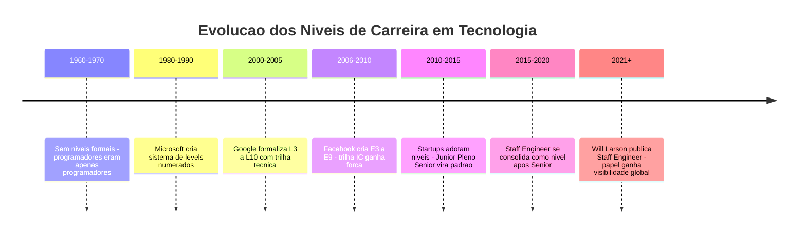
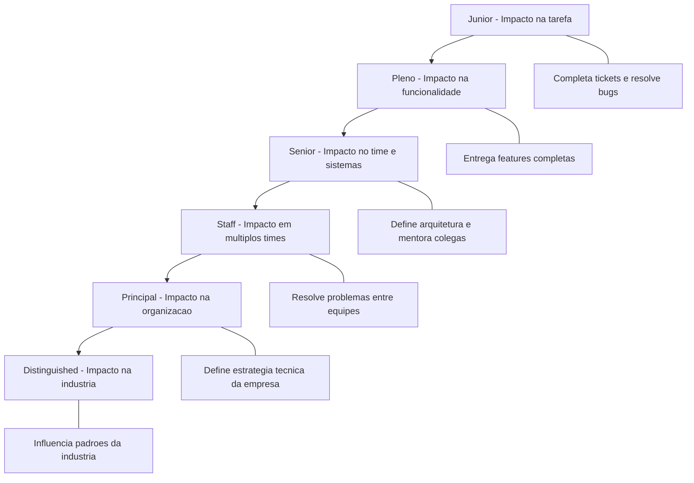
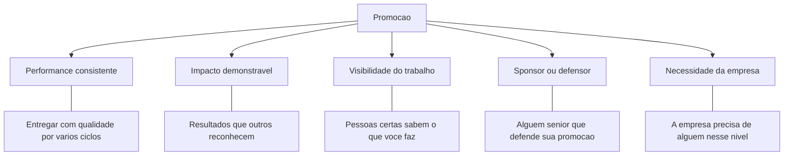
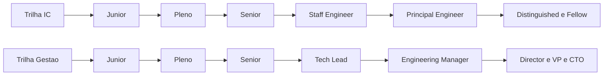

# 12.12 — A Jornada Profissional: De Júnior a Especialista

[← Anterior: Times de Tecnologia](cap12-mod11-times-tecnologia.md) · [Próximo: Projeto Final: TCC →](cap13-mod01-definicao-problema.md)

---

## Introdução

No módulo anterior, vimos os diferentes papéis que existem em times de tecnologia — de desenvolvedores a Product Managers, de QAs a SREs. Entendemos como equipes são organizadas, como a colaboração funciona na prática e por que ninguém constrói software sozinho. Agora vamos falar sobre algo que afeta diretamente você: a jornada de crescimento profissional. O que diferencia um júnior de um pleno? Um pleno de um sênior? Um sênior de um especialista?

A resposta pode te surpreender: não é apenas conhecimento técnico. Claro, um sênior sabe mais tecnicamente do que um júnior. Mas a diferença real está em algo mais amplo: autonomia, julgamento, impacto e postura.

Pense em um restaurante. Um cozinheiro iniciante segue receitas à risca. Um cozinheiro experiente adapta receitas ao contexto — sabe quando substituir um ingrediente, quando mudar o tempo de cozimento, quando improvisar. Um chef de cozinha não apenas cozinha bem — ele define o cardápio, treina a equipe, garante a qualidade de todos os pratos e representa o restaurante. A diferença entre eles não é só "saber cozinhar mais coisas". É julgamento, responsabilidade e impacto.

Em tecnologia, a jornada é parecida. E este módulo é sobre entender essa jornada — não para ter pressa de chegar ao topo, mas para saber o que esperar, o que desenvolver em cada fase, e por que a postura é tão importante quanto o conhecimento.

Se você está começando agora, este módulo é especialmente importante. Ele vai te dar um mapa do caminho à frente — e, mais importante, vai te mostrar que cada fase tem seu valor e seus aprendizados.

Este é o último módulo do capítulo 12 e, de certa forma, o encerramento da parte teórica do curso. Tudo que vimos até aqui — testes, CI/CD, segurança, open source, times — converge neste ponto: como você constrói uma carreira sólida e sustentável em tecnologia. No próximo capítulo, vamos colocar tudo em prática com o projeto final (TCC), onde você vai aplicar todos os conceitos que aprendeu ao longo do curso.

---

## Como Surgiram os Níveis de Carreira em Tecnologia

Nem sempre existiram "níveis" na carreira de tecnologia. Nos primórdios da computação, nas décadas de 1960 e 1970, programadores eram simplesmente "programadores". Não havia distinção formal entre júnior, pleno e sênior. Você entrava em uma empresa, programava, e com o tempo ganhava mais responsabilidade — mas sem uma estrutura clara de progressão.

O problema desse modelo ficou evidente conforme a indústria cresceu. Sem níveis definidos, não havia critérios claros para promoção. Decisões de salário eram arbitrárias. Profissionais talentosos não tinham como saber o que precisavam desenvolver para crescer. E empresas não conseguiam reter talentos porque não ofereciam um caminho visível de evolução.

Imagine uma escola onde não existem séries — todos os alunos estão na mesma sala, sem distinção de nível. Como o professor saberia o que ensinar? Como o aluno saberia se está progredindo? Como a escola decidiria quem está pronto para o próximo desafio? Esse era o problema das empresas de tecnologia antes dos níveis de carreira.

### A Revolução dos Níveis: Google, Microsoft e Facebook

A formalização dos níveis de carreira em tecnologia começou nas grandes empresas americanas nos anos 1990 e 2000. A Microsoft foi uma das pioneiras, criando um sistema de "levels" numerados (59, 60, 61... até 80+) que definia claramente o que se esperava em cada nível. O Google seguiu com seu próprio sistema (L3 para júnior, L4 para pleno, L5 para sênior, L6 para Staff, L7 para Principal, e assim por diante). O Facebook (hoje Meta) criou o sistema E3-E9.

Essas empresas perceberam algo fundamental: sem uma escada de carreira clara, os melhores engenheiros tinham apenas duas opções para crescer — virar gerente ou sair da empresa. E muitos dos melhores engenheiros não queriam ser gerentes. Eles queriam continuar resolvendo problemas técnicos complexos, mas com mais impacto e reconhecimento.

A criação da "trilha técnica" (Individual Contributor track) foi uma das inovações mais importantes da indústria. Pela primeira vez, um engenheiro podia chegar ao topo da carreira sem nunca gerenciar pessoas. Títulos como Staff Engineer, Principal Engineer e Distinguished Engineer foram criados para reconhecer contribuições técnicas de alto impacto.

Will Larson, autor do livro "Staff Engineer" (2021), documentou como essa evolução aconteceu. Ele entrevistou dezenas de Staff Engineers em empresas como Stripe, Slack e Dropbox, e mostrou que o papel ainda estava sendo definido — cada empresa interpretava de forma diferente o que significava ser Staff.

Hoje, a maioria das empresas de tecnologia — de startups a corporações — adota alguma variação desse modelo. Os nomes mudam, os números mudam, mas a estrutura é surpreendentemente consistente.

### O Papel de Cada Nível na Estrutura Organizacional

Para entender por que as empresas criaram tantos níveis, é preciso entender o problema que cada nível resolve. Não é apenas uma questão de "dar título bonito" — cada nível existe porque a empresa precisa de pessoas com escopos de atuação diferentes.

Um júnior resolve tarefas pontuais. Isso é essencial — sem alguém fazendo o trabalho do dia a dia, nada sai do papel. Mas se todos fossem júniors, quem definiria quais tarefas fazer? Quem garantiria que as tarefas se conectam em algo coerente? Quem tomaria decisões quando duas abordagens técnicas são possíveis?

É aí que entram os níveis mais altos. Um sênior garante que as decisões técnicas do time fazem sentido. Um Staff garante que as decisões de múltiplos times são coerentes entre si. Um Principal garante que a direção técnica da empresa inteira está alinhada com os objetivos de negócio.

Pense em uma orquestra. Os músicos individuais tocam seus instrumentos — cada um é excelente no que faz. Mas sem um maestro, cada um tocaria no seu ritmo, no seu volume, na sua interpretação. O maestro não toca melhor que nenhum músico individual — mas ele garante que todos toquem juntos, de forma harmônica. Os níveis mais altos de carreira em tecnologia funcionam de forma parecida: não é sobre ser "melhor programador", é sobre garantir harmonia em escala cada vez maior.

### Comparação de Níveis entre Grandes Empresas

Para você ter uma ideia de como os níveis se comparam entre empresas diferentes, veja esta tabela:

| Nivel generico | Google | Meta | Amazon | Microsoft | Apple |
|----------------|--------|------|--------|-----------|-------|
| Estagiario | L2 | E3 | SDE Intern | 59 | ICT1 |
| Junior | L3 | E3 | SDE I | 59-60 | ICT2 |
| Pleno | L4 | E4 | SDE II | 61-62 | ICT3 |
| Senior | L5 | E5 | SDE III | 63-64 | ICT4 |
| Staff | L6 | E6 | Principal SDE | 65-66 | ICT5 |
| Senior Staff | L7 | E7 | Sr Principal | 67-68 | ICT6 |
| Principal | L8 | E8 | Distinguished | 69-70 | Fellow |
| Distinguished | L9 | E9 | VP Distinguished | 71+ | Senior Fellow |
| Fellow | L10 | - | SVP Distinguished | Technical Fellow | - |

Perceba que os nomes mudam, mas a estrutura é a mesma. Um L5 no Google é equivalente a um E5 na Meta e a um SDE III na Amazon. O site Levels.fyi se tornou referência global justamente por mapear essas equivalências, permitindo que profissionais comparem ofertas entre empresas diferentes.

Um detalhe importante: a quantidade de pessoas em cada nível diminui drasticamente conforme você sobe. No Google, por exemplo, a maioria dos engenheiros está entre L3 e L5. Chegar a L6 já é raro. L7 é excepcional. L8+ são dezenas de pessoas em uma empresa com mais de 30.000 engenheiros. Isso não é para desanimar — é para dar perspectiva realista sobre o que cada nível representa.

### A Evolução dos Modelos de Carreira

Essa evolução mostra algo importante: os níveis de carreira não são uma invenção arbitrária. Eles surgiram para resolver problemas reais — retenção de talentos, clareza de expectativas, justiça salarial e reconhecimento de contribuições técnicas.

### Como os Níveis Chegaram ao Brasil

No Brasil, a adoção de níveis estruturados de carreira em tecnologia aconteceu mais tarde. Até meados dos anos 2010, a maioria das empresas brasileiras usava apenas três níveis: júnior, pleno e sênior — muitas vezes sem critérios claros para cada um. A promoção dependia mais de tempo de casa do que de competências demonstradas.

Com a chegada de empresas internacionais ao Brasil (Google, Meta, Amazon, Microsoft) e o crescimento de fintechs e startups brasileiras que adotaram práticas de gestão de pessoas das big techs americanas, o cenário mudou. Empresas como Nubank, iFood, Mercado Livre e PagSeguro passaram a implementar career ladders (escadas de carreira) mais detalhadas, com critérios objetivos para cada nível.

Hoje, o mercado brasileiro de tecnologia está em transição. Empresas mais maduras já têm níveis bem definidos com critérios claros. Empresas menores ainda usam o modelo informal de "júnior, pleno, sênior" sem muita estrutura. Saber em qual tipo de empresa você está — e o que ela espera de cada nível — é fundamental para gerenciar sua carreira.

O Nubank, por exemplo, publicou em 2020 seu framework de engenharia com níveis inspirados no modelo do Google, adaptados à realidade brasileira. O iFood seguiu caminho semelhante. Essas empresas perceberam que sem critérios claros, as promoções se tornavam políticas em vez de meritocráticas — e isso afastava os melhores profissionais.

### Faixas Salariais no Brasil em 2024

Para dar uma referência concreta, veja as faixas salariais aproximadas para desenvolvedores no Brasil em 2024, segundo pesquisas da Glassdoor, Levels.fyi e pesquisas salariais de consultorias como Robert Half e Michael Page:

| Nivel | Faixa salarial mensal CLT | Observacoes |
|-------|---------------------------|-------------|
| Estagiario | R$ 1.500 - R$ 3.000 | Varia muito por cidade e empresa |
| Junior | R$ 3.000 - R$ 6.000 | Entrada no mercado, 0-2 anos |
| Pleno | R$ 6.000 - R$ 12.000 | 2-5 anos, autonomia crescente |
| Senior | R$ 12.000 - R$ 22.000 | 5+ anos, referencia tecnica |
| Staff e Principal | R$ 18.000 - R$ 35.000 | Raro no Brasil, mais comum em big techs |
| Tech Lead e Manager | R$ 15.000 - R$ 30.000 | Gestao tecnica ou de pessoas |

Esses valores variam enormemente por região (São Paulo paga mais que outras capitais), por tipo de empresa (fintechs e big techs pagam mais que consultorias), por stack tecnológica (algumas linguagens pagam mais que outras) e por modelo de contratação (PJ costuma ter valores maiores que CLT, mas sem benefícios). Empresas internacionais com escritórios no Brasil ou que contratam remotamente podem pagar significativamente acima dessas faixas.

O importante não é decorar esses números — eles mudam todo ano. O importante é entender que existe uma progressão real e que investir no seu crescimento profissional tem retorno financeiro concreto. A diferença salarial entre um júnior e um sênior pode ser de 3x a 5x. Isso significa que investir 5 anos no seu desenvolvimento pode triplicar ou quintuplicar sua renda.

Outro ponto relevante: o mercado de tecnologia no Brasil ainda tem um déficit enorme de profissionais qualificados. Segundo a Brasscom (Associação Brasileira das Empresas de Tecnologia da Informação e Comunicação), o Brasil precisa de cerca de 530 mil novos profissionais de tecnologia até 2025, mas forma apenas uma fração disso. Isso significa que profissionais bem preparados têm poder de negociação — e entender os níveis de carreira te ajuda a negociar melhor.

---

## Os Níveis: Uma Visão Geral

A maioria das empresas de tecnologia organiza a carreira técnica em níveis. Os nomes variam, mas a estrutura é parecida:

| Nivel | Outros nomes comuns | Experiencia tipica | Escopo de impacto |
|-------|--------------------|--------------------|-------------------|
| Junior | Jr, Associate, Entry-level, L3, E3 | 0-2 anos | Tarefas individuais |
| Pleno | Mid-level, Intermediate, L4, E4 | 2-5 anos | Funcionalidades completas |
| Senior | Sr, L5, E5 | 5-10 anos | Sistemas e times |
| Staff | Staff Engineer, L6, E6 | 8-15 anos | Multiplos times |
| Principal | Principal Engineer, L7, E7 | 12-20 anos | Organizacao inteira |
| Distinguished | Distinguished Engineer, L8+, E8+ | 15+ anos | Industria |

Esses números de anos são aproximados e variam muito. Existem pessoas que chegam a sênior em 4 anos e outras que levam 12. O tempo é menos importante do que o crescimento real. O site Levels.fyi, que compara níveis entre empresas, mostra que a mesma pessoa pode ser "Senior" no Google e "Staff" em uma startup — porque os critérios variam.

### O Conceito de Escopo de Impacto

Uma das formas mais úteis de entender os níveis é pelo conceito de **escopo de impacto** (em inglês, *scope of impact*). Conforme você cresce na carreira, o escopo do seu impacto se expande:

- **Júnior**: seu impacto é na tarefa que você está fazendo. Você completa tickets, resolve bugs, implementa funcionalidades pequenas.
- **Pleno**: seu impacto é na funcionalidade inteira. Você entrega features completas, do requisito ao deploy.
- **Sênior**: seu impacto é no time e nos sistemas. Você melhora a arquitetura, mentora colegas, define padrões.
- **Staff**: seu impacto cruza times. Você resolve problemas que afetam múltiplas equipes, define direção técnica.
- **Principal**: seu impacto é organizacional. Você influencia a estratégia técnica da empresa inteira.
- **Distinguished**: seu impacto é na indústria. Você contribui para padrões, publica pesquisas, influencia como a comunidade inteira trabalha.

Essa progressão não é sobre "saber mais coisas". É sobre resolver problemas cada vez maiores e mais ambíguos, com impacto cada vez mais amplo.

Perceba como o escopo vai se ampliando. Um júnior se preocupa com "minha tarefa está funcionando?". Um sênior se preocupa com "o sistema inteiro está saudável?". Um Staff se preocupa com "os sistemas de todos os times estão alinhados?". Cada nível exige uma visão mais ampla e a capacidade de lidar com mais ambiguidade.

### O Que Muda Além do Escopo

Além do escopo de impacto, outras dimensões mudam conforme você avança:

| Dimensao | Junior | Pleno | Senior | Staff+ |
|----------|--------|-------|--------|--------|
| Ambiguidade | Tarefas bem definidas | Requisitos claros | Problemas vagos | Nem o problema esta claro |
| Autonomia | Precisa de orientacao | Trabalha sozinho | Define o caminho | Cria caminhos novos |
| Comunicacao | Reporta progresso | Discute solucoes | Propoe direcao | Constroi consenso |
| Influencia | No proprio codigo | Na feature | No time | Na organizacao |
| Risco | Baixo - erros sao esperados | Medio - erros sao corrigidos | Alto - erros afetam sistemas | Muito alto - erros afetam a empresa |
| Mentoria | Recebe mentoria | Ajuda colegas | Mentora ativamente | Desenvolve mentores |

Essa tabela mostra algo crucial: a transição entre níveis não é apenas "fazer mais do mesmo". É uma mudança qualitativa no tipo de trabalho que você faz. Um sênior não é um pleno que programa mais rápido — é alguém que resolve um tipo diferente de problema.

---

## As Transições: O Que Muda em Cada Nível

Entender os níveis é uma coisa. Entender o que muda na transição entre eles é outra — e é onde a maioria das pessoas se confunde. Vamos detalhar cada transição.

### De Júnior para Pleno: A Conquista da Autonomia

A transição de júnior para pleno é, para muitos, a mais transformadora. É quando você deixa de precisar de orientação constante e passa a entregar com autonomia.

**O que um júnior faz bem:**
- Segue instruções e completa tarefas definidas por outros
- Pede ajuda quando está travado (e isso é bom!)
- Aprende ferramentas, padrões e processos do time
- Escreve código que funciona, mesmo que não seja o mais elegante
- Faz perguntas — muitas perguntas

**O que um pleno faz que um júnior ainda não faz:**
- Recebe um requisito e transforma em código sem precisar de orientação passo a passo
- Identifica problemas antes que alguém aponte
- Estima quanto tempo uma tarefa vai levar (com razoável precisão)
- Escreve código que outros conseguem entender e manter
- Participa de code reviews com comentários úteis
- Entende o contexto de negócio por trás das tarefas técnicas

A analogia do restaurante funciona aqui: o cozinheiro júnior precisa que alguém diga "corte a cebola em cubos de 1cm". O cozinheiro pleno lê a receita e sabe o que fazer — inclusive adapta se a cebola for maior ou menor que o esperado.

**Quanto tempo leva?** Tipicamente 1-3 anos, mas depende muito da qualidade das experiências, não apenas do tempo. Um júnior que trabalha em projetos desafiadores com mentores bons pode fazer essa transição em 1 ano. Um júnior que faz tarefas repetitivas sem orientação pode levar 4 anos ou mais.

**Dica para quem está nessa fase:** não tenha medo de errar. Júniors que erram e aprendem crescem mais rápido do que júniors que evitam riscos. Seu time espera que você erre — o que importa é como você lida com o erro.

### De Pleno para Sênior: O Salto de Perspectiva

A transição de pleno para sênior é onde muita gente trava. Não porque falta conhecimento técnico, mas porque o que muda não é técnico — é perspectiva.

**O que um pleno faz bem:**
- Entrega funcionalidades completas com qualidade
- Trabalha de forma autônoma na maioria das tarefas
- Conhece bem as ferramentas e padrões do time
- Resolve problemas dentro do escopo definido

**O que um sênior faz que um pleno ainda não faz:**
- Define o escopo — não apenas executa o que foi definido
- Questiona requisitos quando não fazem sentido técnico
- Pensa em manutenibilidade, escalabilidade e impacto a longo prazo
- Mentora júniors e plenos, ajudando-os a crescer
- Toma decisões técnicas com trade-offs claros e documentados
- Influencia a direção técnica do time
- Sabe quando NÃO construir algo — quando a solução é simplificar, remover ou reutilizar

A diferença fundamental é: um pleno resolve o problema que recebeu. Um sênior questiona se é o problema certo a ser resolvido.

Pense em um médico. Um residente competente examina o paciente e trata os sintomas. Um médico sênior examina o paciente, questiona o diagnóstico inicial, considera causas alternativas e trata a causa raiz — não apenas os sintomas. A diferença não é "saber mais medicina". É julgamento clínico.

**Quanto tempo leva?** Tipicamente 3-5 anos após pleno, mas essa é a transição mais variável. Algumas pessoas nunca fazem essa transição — não por falta de capacidade, mas porque não desenvolvem as habilidades não-técnicas necessárias (comunicação, mentoria, visão sistêmica).

**Dica para quem está nessa fase:** comece a pensar além do código. Pergunte "por quê?" antes de "como?". Ofereça-se para mentorar alguém. Participe de decisões de arquitetura. Escreva documentação. Essas atividades "não-técnicas" são exatamente o que diferencia um sênior de um pleno.

### De Sênior para Staff: Cruzando Fronteiras

A transição de sênior para Staff é a menos compreendida — e a mais recente na indústria. Muitas empresas nem têm esse nível. Mas nas que têm, é uma mudança profunda.

**O que um sênior faz bem:**
- É referência técnica do time
- Toma decisões de arquitetura para o sistema do time
- Mentora colegas e eleva a qualidade do time
- Entrega projetos complexos com autonomia

**O que um Staff faz que um sênior ainda não faz:**
- Trabalha em problemas que cruzam múltiplos times
- Define padrões e práticas que toda a organização segue
- Identifica problemas sistêmicos que ninguém mais vê
- Influencia a estratégia técnica da empresa
- Navega ambiguidade extrema — problemas onde nem o problema está claro
- Constrói consenso entre times com prioridades conflitantes
- Escreve documentos de design que guiam o trabalho de dezenas de pessoas

Will Larson, no livro "Staff Engineer", identifica quatro arquétipos de Staff Engineers:

| Arquetipo | Descricao | Exemplo |
|-----------|-----------|---------|
| Tech Lead | Guia a direcao tecnica de um time ou area | Define arquitetura e prioridades tecnicas |
| Architect | Define a visao tecnica de longo prazo | Projeta sistemas que duram anos |
| Solver | Resolve problemas criticos e complexos | Entra em crises e encontra solucoes |
| Right Hand | Braco direito de um executivo tecnico | Executa a visao do VP ou CTO |

Nem todo sênior precisa ou quer virar Staff. É uma escolha legítima permanecer como sênior — muitos profissionais são extremamente felizes e bem remunerados nesse nível. A transição para Staff exige um tipo diferente de trabalho: menos código, mais comunicação, mais documentos, mais política organizacional. Nem todo mundo gosta disso, e tudo bem.

**Quanto tempo leva?** Tipicamente 3-7 anos após sênior, mas é a transição mais dependente de oportunidade. Você pode ter todas as habilidades de um Staff, mas se a empresa não tem problemas que cruzam times, não há espaço para demonstrar impacto nesse nível.

### O Que Realmente Determina uma Promoção

Muitos profissionais acreditam que promoção é automática — "se eu fizer meu trabalho bem por tempo suficiente, vou ser promovido". Essa crença é perigosa porque não reflete a realidade da maioria das empresas.

Na prática, promoções dependem de uma combinação de fatores:

Vamos detalhar cada fator:

**Performance consistente**: não basta ter um trimestre excepcional. Empresas querem ver consistência ao longo de vários ciclos de avaliação. Um profissional que entrega muito em um trimestre e pouco no seguinte gera menos confiança do que alguém que entrega bem de forma constante.

**Impacto demonstrável**: você precisa mostrar resultados concretos. "Trabalhei muito" não é impacto. "Reduzi o tempo de deploy de 2 horas para 15 minutos" é impacto. "Mentorei 3 júniors que agora entregam de forma autônoma" é impacto. Aprenda a quantificar e documentar seu trabalho.

**Visibilidade**: fazer um trabalho excelente que ninguém vê não gera promoção. Isso não significa se autopromover de forma arrogante — significa comunicar seu trabalho de forma clara. Escreva documentos, apresente resultados em reuniões, compartilhe aprendizados com o time.

**Sponsor**: em muitas empresas, promoções são decididas em comitês onde gestores defendem seus liderados. Ter alguém sênior que conhece seu trabalho e está disposto a defendê-lo é crucial. Isso não é "política" — é como organizações funcionam.

**Necessidade da empresa**: às vezes você está pronto para o próximo nível, mas a empresa não tem espaço. Uma startup com 10 pessoas pode não precisar de um Staff Engineer. Reconhecer isso evita frustração — e pode ser o sinal de que é hora de buscar uma empresa maior.

---

## O Fenômeno do Platô Sênior

Um dos fenômenos mais comuns — e menos discutidos — na carreira de tecnologia é o **platô sênior** (em inglês, *senior plateau*). É quando um profissional chega ao nível sênior e... para. Não porque não é capaz de crescer mais, mas porque o caminho à frente fica nebuloso.

### Por Que o Platô Acontece

O platô sênior acontece por várias razões:

1. **Falta de clareza**: muitas empresas não têm níveis acima de sênior. O profissional chega ao "topo" e não sabe para onde ir.

2. **Mudança de habilidades**: até sênior, o crescimento é principalmente técnico. Depois de sênior, o crescimento exige habilidades diferentes — comunicação, influência, visão estratégica. Muitos profissionais não sabem que precisam desenvolver essas habilidades.

3. **Zona de conforto**: ser sênior é confortável. Você é respeitado, bem pago, e sabe resolver a maioria dos problemas. Sair dessa zona exige esforço e risco.

4. **Falta de mentoria**: poucos profissionais acima de sênior existem, então é difícil encontrar mentores que já passaram por essa transição.

5. **Viés de promoção**: em muitas empresas, promoções até sênior são baseadas em competência técnica. Promoções acima de sênior são baseadas em impacto organizacional — e os critérios são menos claros.

6. **Síndrome do impostor**: muitos sêniors não se sentem "prontos" para o próximo nível. Eles olham para Staff Engineers e pensam "eu nunca vou ser assim". O que não percebem é que os Staff Engineers também se sentiram assim antes de chegar lá.

### Como Sair do Platô

Se você se encontrar no platô sênior (ou quiser se preparar para não cair nele), algumas estratégias ajudam:

- **Busque problemas maiores**: voluntarie-se para projetos que cruzam times. Isso demonstra capacidade de impacto amplo.
- **Desenvolva habilidades de comunicação**: escreva documentos de design, apresente propostas técnicas, facilite discussões.
- **Mentore ativamente**: ajudar outros a crescer é uma das formas mais visíveis de impacto além do código.
- **Construa relacionamentos**: conheça pessoas de outros times. Entenda os problemas deles. Ofereça ajuda.
- **Documente seu impacto**: muitos profissionais fazem trabalho de Staff sem o título. Documentar esse impacto é essencial para ser reconhecido.
- **Busque feedback estruturado**: peça feedback específico ao seu gestor sobre o que falta para o próximo nível. "O que eu precisaria demonstrar para ser considerado para Staff?" é uma pergunta poderosa.
- **Considere mudar de empresa**: às vezes o platô é da empresa, não seu. Uma empresa maior pode ter mais espaço para crescimento.

O platô sênior não é um destino — é uma fase. Com consciência e ação deliberada, é possível atravessá-lo. E se você decidir que sênior é onde quer ficar, isso também é uma escolha válida e respeitável.

---

## Postura versus Conhecimento: O Que Realmente Importa

Uma das lições mais importantes da carreira em tecnologia é que **postura importa tanto quanto conhecimento** — e em muitos casos, mais. Isso não significa que conhecimento técnico não importa. Significa que conhecimento técnico sozinho não é suficiente.

### O Que É Postura Profissional

Postura profissional é um conjunto de comportamentos e atitudes que definem como você trabalha, não apenas o que você sabe. Inclui:

| Aspecto | Descricao | Exemplo pratico |
|---------|-----------|-----------------|
| Responsabilidade | Assumir consequencias das suas decisoes | Quando um bug vai para producao, voce investiga e corrige em vez de culpar outros |
| Proatividade | Agir antes de ser pedido | Voce percebe um problema no codigo e abre um ticket antes que alguem reclame |
| Comunicacao | Expressar ideias com clareza | Voce explica uma decisao tecnica de forma que o PM entende |
| Colaboracao | Trabalhar bem com outros | Voce ajuda um colega travado mesmo quando nao e sua tarefa |
| Humildade | Reconhecer o que nao sabe | Voce diz nao sei, mas vou descobrir em vez de inventar uma resposta |
| Resiliencia | Lidar com frustracoes | Voce nao desiste apos 3 horas debugando um problema dificil |
| Curiosidade | Querer entender o porque | Voce nao aceita funciona assim sem entender a razao |
| Etica | Fazer o certo mesmo quando ninguem esta olhando | Voce reporta uma vulnerabilidade em vez de ignorar |

### Por Que Postura Pesa Tanto nas Promoções

Gestores de tecnologia frequentemente dizem que preferem promover alguém com postura excelente e conhecimento bom do que alguém com conhecimento excelente e postura mediana. Por quê?

Porque conhecimento se adquire. Postura é muito mais difícil de mudar.

Um desenvolvedor com postura excelente mas que não conhece uma tecnologia específica vai aprender essa tecnologia em semanas ou meses. Um desenvolvedor com conhecimento técnico brilhante mas que não colabora, não comunica bem e não assume responsabilidade vai criar problemas no time que duram anos.

Pense em um time de futebol. O jogador mais habilidoso do mundo, se não passa a bola, não respeita o técnico e não treina com o time, prejudica mais do que ajuda. O jogador com habilidade boa mas que joga pelo time, comunica em campo e se dedica nos treinos é muito mais valioso.

### A Armadilha do "Gênio Solitário"

A indústria de tecnologia tem um mito perigoso: o do "gênio solitário" — o programador brilhante que trabalha sozinho, não precisa de ninguém e resolve tudo com puro talento técnico. Filmes como "A Rede Social" reforçam esse mito, mostrando Mark Zuckerberg programando sozinho em seu dormitório.

A realidade é muito diferente. O Facebook foi construído por centenas de engenheiros. O Linux tem mais de 15.000 contribuidores. O Google foi fundado por duas pessoas, mas hoje tem mais de 30.000 engenheiros. Nenhum software relevante é construído por uma pessoa sozinha.

Empresas como Netflix e Google documentaram publicamente que demitem profissionais tecnicamente brilhantes que prejudicam o time. O termo "brilliant jerk" (gênio arrogante) descreve exatamente esse perfil: alguém que escreve código incrível mas que ninguém quer trabalhar junto. A conclusão da indústria é clara: o custo de manter um "brilliant jerk" é maior do que o valor que ele entrega.

Reed Hastings, CEO da Netflix, escreveu no livro "A Regra é Não Ter Regras" (2020) que a empresa tem tolerância zero para comportamento tóxico, independentemente do talento técnico. Ele argumenta que uma pessoa tóxica pode destruir a produtividade de um time inteiro — e nenhum código brilhante compensa isso.

---

## As Duas Trilhas: IC versus Gestão

Em algum momento da carreira — geralmente entre pleno e sênior — você vai se deparar com uma escolha: continuar na trilha técnica (Individual Contributor, ou IC) ou migrar para gestão (Management).

Essa é uma das decisões mais importantes da carreira, e muita gente a toma sem entender o que está escolhendo. Vamos detalhar cada trilha.

### A Trilha Técnica - Individual Contributor

Na trilha IC, você continua resolvendo problemas técnicos. Conforme avança, os problemas ficam maiores e mais complexos, mas a natureza do trabalho permanece técnica.

**Progressão típica:**
Junior → Pleno → Senior → Staff Engineer → Principal Engineer → Distinguished Engineer → Fellow

**O que você faz em cada nível:**
- **Sênior IC**: referência técnica do time, define arquitetura local, mentora colegas
- **Staff IC**: resolve problemas entre times, define padrões organizacionais, escreve documentos de design
- **Principal IC**: define direção técnica da empresa, influencia estratégia de produto, representa a empresa externamente
- **Distinguished e Fellow**: influencia a indústria, publica pesquisas, define padrões que outras empresas seguem

**Vantagens da trilha IC:**
- Você continua fazendo o que (provavelmente) te atraiu para tecnologia: resolver problemas
- Menos reuniões, mais tempo focado
- Impacto técnico direto e mensurável
- Flexibilidade — é mais fácil mudar de empresa como IC

**Desafios da trilha IC:**
- Acima de sênior, as oportunidades são limitadas (poucas vagas de Staff e Principal)
- O trabalho muda: menos código, mais documentos, mais comunicação
- Pode ser solitário — você trabalha em problemas que poucos entendem
- Em muitas empresas brasileiras, a trilha IC acima de sênior simplesmente não existe

### A Trilha de Gestão - Management

Na trilha de gestão, você para de resolver problemas técnicos diretamente e passa a criar as condições para que outros resolvam.

**Progressão típica:**
Senior → Tech Lead → Engineering Manager → Senior Manager → Director → VP of Engineering → CTO

**O que você faz em cada nível:**
- **Tech Lead**: meio técnico, meio gestão. Ainda escreve código, mas também coordena o time
- **Engineering Manager**: gestão de pessoas. Contrata, desenvolve, avalia, demite. Pouco ou nenhum código
- **Director**: gestão de gestores. Define estratégia para múltiplos times
- **VP e CTO**: define a visão técnica da empresa inteira

**Vantagens da trilha de gestão:**
- Impacto multiplicado — você melhora o trabalho de muitas pessoas
- Mais oportunidades de liderança e visibilidade
- Salários competitivos (em muitas empresas, gestores ganham igual ou mais que ICs do mesmo nível)
- Satisfação de ver pessoas crescerem sob sua orientação

**Desafios da trilha de gestão:**
- Você para de programar (ou programa muito menos)
- Reuniões. Muitas reuniões
- Lidar com conflitos interpessoais, demissões, avaliações difíceis
- Seu sucesso depende do sucesso dos outros — menos controle direto
- Se você não gosta de lidar com pessoas, vai ser infeliz

### Comparação Direta: IC versus Gestão

| Aspecto | Trilha IC | Trilha Gestao |
|---------|-----------|---------------|
| Foco diario | Problemas tecnicos | Pessoas e processos |
| Codigo | Escreve codigo regularmente | Pouco ou nenhum codigo |
| Reunioes | Poucas, focadas em design | Muitas, variadas |
| Impacto | Direto, tecnico | Indireto, multiplicado |
| Metrica de sucesso | Qualidade tecnica e inovacao | Performance do time |
| Estresse principal | Problemas tecnicos complexos | Conflitos interpessoais |
| Reversibilidade | Facil voltar a codar | Dificil voltar apos anos sem codar |
| Oportunidades no Brasil | Limitadas acima de senior | Mais abundantes |

### A Decisão Não É Permanente

Um ponto importante: a escolha entre IC e gestão não precisa ser definitiva. Muitos profissionais experimentam gestão e voltam para IC (ou vice-versa). Charity Majors, CTO da Honeycomb e autora influente na comunidade de engenharia, defende o conceito de "pendulum" — alternar entre IC e gestão ao longo da carreira para desenvolver habilidades complementares.

O que ela argumenta é que um gestor que já foi IC sênior entende melhor os desafios técnicos do time. E um IC que já experimentou gestão entende melhor as restrições organizacionais. Essa experiência cruzada torna o profissional mais completo em qualquer trilha.

O importante é tomar a decisão de forma consciente, não por pressão. "Virar gerente porque é o único caminho de crescimento" é uma péssima razão. "Virar gerente porque descobri que gosto de desenvolver pessoas" é uma ótima razão.

---

## A Importância da Mentoria

Se existe um fator que acelera carreiras mais do que qualquer outro, é a mentoria. Ter alguém mais experiente que te orienta, compartilha erros que já cometeu e te ajuda a enxergar pontos cegos faz uma diferença enorme — especialmente no início da carreira.

### O Que É Mentoria na Prática

Mentoria não é um curso. Não é alguém que te ensina a programar. É um relacionamento onde uma pessoa mais experiente te ajuda a navegar decisões de carreira, te dá feedback honesto e te expõe a perspectivas que você não teria sozinho.

Na prática, mentoria pode acontecer de várias formas:

| Tipo | Descricao | Exemplo |
|------|-----------|---------|
| Formal | Programa estruturado da empresa | Empresa designa um senior para cada junior |
| Informal | Relacionamento natural | Voce admira um colega e pede conselhos regularmente |
| Reversa | Junior ensina senior | Junior ensina senior sobre uma tecnologia nova |
| Em grupo | Um mentor com varios mentorados | Tech lead faz sessoes semanais com o time |
| Externa | Mentor fora da empresa | Voce encontra um mentor em comunidades ou eventos |

### Por Que Mentoria Acelera Carreiras

A razão é simples: mentores já cometeram os erros que você vai cometer. Eles podem te ajudar a evitar armadilhas que levariam meses ou anos para você descobrir sozinho.

Um exemplo concreto: um júnior pode passar 2 anos fazendo tarefas repetitivas sem perceber que está estagnado. Um mentor perceberia isso em semanas e diria: "Você precisa buscar projetos mais desafiadores. Converse com seu gestor sobre isso."

Outro exemplo: um pleno pode evitar code reviews porque tem medo de críticas. Um mentor diria: "Code reviews são a forma mais rápida de aprender. Cada comentário é uma aula gratuita de alguém mais experiente."

Pesquisas da Sun Microsystems (hoje Oracle) mostraram que profissionais com mentores eram promovidos 5 vezes mais frequentemente do que profissionais sem mentores. E os próprios mentores eram promovidos 6 vezes mais — porque mentorar desenvolve habilidades de liderança.

### Como Encontrar um Mentor

Encontrar um mentor pode parecer intimidante, mas não precisa ser formal. Algumas estratégias:

- **Dentro da empresa**: identifique alguém que você admira e peça conselhos. Não precisa ser uma relação formal de "mentor e mentorado". Pode começar com "posso te fazer uma pergunta sobre carreira?"
- **Em comunidades**: participe de meetups, conferências e comunidades online. Muitos profissionais experientes gostam de ajudar iniciantes.
- **Open source**: contribua para projetos open source. Os mantenedores frequentemente se tornam mentores naturais dos contribuidores mais ativos.
- **Programas formais**: empresas como Google, Microsoft e Nubank têm programas de mentoria estruturados. Startups menores podem não ter, mas você pode sugerir a criação de um.

### Como Ser um Bom Mentorado

Mentoria é uma via de mão dupla. Para aproveitar ao máximo, você precisa ser um bom mentorado:

- **Venha preparado**: não chegue na conversa sem saber o que perguntar. Traga dúvidas específicas.
- **Aplique o que aprendeu**: nada frustra mais um mentor do que dar conselhos que são ignorados.
- **Dê feedback**: diga ao mentor o que está funcionando e o que não está.
- **Respeite o tempo**: mentores são pessoas ocupadas. Seja pontual e objetivo.
- **Retribua**: quando você crescer, mentore outros. Essa é a melhor forma de agradecer.

---

## Construindo Reputação e Marca Pessoal

Em tecnologia, sua reputação é um dos seus ativos mais valiosos. Não estamos falando de "ser famoso" — estamos falando de ser reconhecido como alguém confiável, competente e que agrega valor.

### O Que É Reputação Profissional

Reputação profissional é o que as pessoas dizem sobre você quando você não está na sala. É construída ao longo do tempo, através de entregas consistentes, comportamento ético e contribuições visíveis.

Pense em dois cenários:

**Cenário A**: um gestor precisa montar um time para um projeto crítico. Ele pensa em você imediatamente porque sabe que você entrega com qualidade, comunica bem e colabora com o time.

**Cenário B**: um recrutador procura candidatos para uma vaga sênior. Ele encontra seu perfil no GitHub com projetos bem documentados, artigos técnicos no blog e recomendações de colegas no LinkedIn.

Nos dois cenários, sua reputação trabalha a seu favor — mesmo quando você não está ativamente buscando oportunidades.

### Como Construir Reputação

A construção de reputação não acontece da noite para o dia. É um processo gradual que envolve várias frentes:

**Dentro da empresa:**
- Entregue com qualidade e consistência — essa é a base de tudo
- Comunique seu trabalho de forma clara (documentos, apresentações, demos)
- Ajude colegas sem esperar nada em troca
- Assuma responsabilidade quando algo dá errado
- Seja a pessoa que resolve problemas, não a que cria

**Fora da empresa:**
- Mantenha um perfil atualizado no LinkedIn e GitHub
- Escreva sobre o que aprende (blog, artigos, posts em redes sociais)
- Participe de comunidades e eventos
- Contribua para projetos open source
- Apresente palestras em meetups locais (não precisa ser em conferências grandes)

### A Armadilha do Personal Branding Vazio

Um alerta importante: existe uma diferença entre construir reputação genuína e fazer "personal branding" vazio. Postar conteúdo genérico no LinkedIn, colecionar certificados sem profundidade e se autopromover sem substância pode gerar visibilidade de curto prazo, mas não constrói reputação real.

A reputação genuína vem de contribuições reais. Um artigo técnico detalhado sobre como você resolveu um problema complexo vale mais do que 100 posts motivacionais. Uma contribuição significativa para um projeto open source vale mais do que 50 certificados de cursos online.

O teste é simples: se alguém investigar mais a fundo, vai encontrar substância? Se a resposta for sim, sua reputação é sólida. Se a resposta for não, é apenas fachada — e profissionais experientes percebem a diferença rapidamente.

---

## Open Source como Acelerador de Carreira

No módulo 12.5, falamos sobre open source como filosofia e movimento. Aqui vamos falar sobre open source como estratégia de carreira — porque contribuir para projetos de código aberto é uma das formas mais eficazes de acelerar seu crescimento profissional.

### Por Que Open Source Acelera Carreiras

Contribuir para projetos open source oferece benefícios que são difíceis de obter de outra forma:

**Exposição a código de alta qualidade**: projetos como Linux, Kubernetes, React e Django são mantidos por alguns dos melhores engenheiros do mundo. Ler e contribuir para esse código é como ter aulas particulares com especialistas.

**Feedback público e de qualidade**: quando você abre um pull request em um projeto open source, engenheiros experientes revisam seu código e dão feedback detalhado. Esse feedback é gratuito e frequentemente melhor do que o que você receberia em muitas empresas.

**Portfólio visível**: suas contribuições ficam registradas publicamente no GitHub. Qualquer recrutador ou gestor pode ver exatamente o que você fez, como você se comunica e qual a qualidade do seu código.

**Networking natural**: ao contribuir para um projeto, você interage com pessoas de empresas diferentes, países diferentes e perspectivas diferentes. Essas conexões podem abrir portas que você nem imaginava.

**Prática em ambientes reais**: projetos open source têm CI/CD, code reviews, issues, documentação — tudo que você encontra em empresas reais. É uma forma de ganhar experiência profissional mesmo antes do primeiro emprego.

### Como Começar a Contribuir

Muitos iniciantes acham que precisam ser experts para contribuir com open source. Isso não é verdade. Existem contribuições de todos os níveis:

| Nivel de contribuicao | Exemplos | Dificuldade |
|----------------------|----------|-------------|
| Documentacao | Corrigir typos, melhorar README, traduzir docs | Baixa |
| Issues | Reportar bugs com detalhes, confirmar bugs de outros | Baixa |
| Testes | Adicionar testes para codigo existente | Media |
| Bug fixes | Corrigir bugs simples com issues marcadas como good first issue | Media |
| Features | Implementar funcionalidades novas | Alta |
| Arquitetura | Propor mudancas estruturais, escrever RFCs | Muito alta |

A maioria dos projetos grandes tem issues marcadas como "good first issue" ou "help wanted" — essas são especificamente pensadas para novos contribuidores. Comece por elas.

### Histórias Reais de Carreira via Open Source

Muitos profissionais construíram carreiras inteiras a partir de contribuições open source:

- **Evan You** criou o Vue.js como projeto pessoal e hoje é mantido por uma comunidade global. Ele vive exclusivamente de patrocínios para o projeto.
- **Dan Abramov** contribuiu para o ecossistema React, criou o Redux, e foi contratado pelo time do React no Facebook (hoje Meta) por causa dessas contribuições.
- **Sindre Sorhus** mantém mais de 1.000 pacotes npm e é um dos desenvolvedores mais influentes do ecossistema JavaScript — tudo através de open source.

Esses são casos extremos, mas ilustram o ponto: contribuições open source são visíveis, verificáveis e demonstram competência de forma que nenhum currículo consegue.

---

## Casos de Uso no Mundo Real

### Caso 1: A Career Ladder do Spotify — Transparência como Ferramenta de Retenção

O Spotify enfrentou um problema comum em empresas de tecnologia em rápido crescimento: engenheiros talentosos saíam porque não viam um caminho claro de crescimento. Em 2019, a empresa publicou seu "Engineering Career Framework" — um documento detalhado que descreve exatamente o que se espera em cada nível, desde júnior até Distinguished Engineer.

O framework do Spotify é organizado em quatro dimensões: Technology (habilidades técnicas), System (pensamento sistêmico), People (colaboração e mentoria) e Process (melhoria de processos). Cada nível tem descrições claras em cada dimensão, com exemplos concretos de comportamentos esperados.

O resultado foi significativo: a retenção de engenheiros melhorou porque as pessoas sabiam exatamente o que precisavam desenvolver para crescer. As conversas de carreira entre gestores e liderados ficaram mais objetivas. E as promoções se tornaram mais justas porque os critérios eram públicos e consistentes.

A lição para você: quando entrar em uma empresa, pergunte se existe um career framework. Se existir, estude-o. Se não existir, converse com seu gestor sobre o que é esperado em cada nível. Clareza de expectativas é o primeiro passo para crescimento intencional.

### Caso 2: O "Brilliant Jerk" da Uber — Quando Talento Técnico Não Compensa Comportamento Tóxico

Em 2017, a Uber passou por uma crise cultural que quase destruiu a empresa. Susan Fowler, engenheira da Uber, publicou um blog post descrevendo assédio e cultura tóxica na empresa. A investigação que se seguiu revelou que a Uber tolerava comportamento tóxico de profissionais tecnicamente brilhantes — o clássico "brilliant jerk".

O CEO Travis Kalanick foi forçado a renunciar. A empresa perdeu bilhões em valor de mercado. Dezenas de engenheiros talentosos saíram. O novo CEO, Dara Khosrowshahi, implementou novos valores culturais que priorizavam colaboração e respeito acima de resultados individuais.

A lição é clara: nenhuma habilidade técnica compensa comportamento tóxico. A Uber aprendeu da forma mais cara possível que postura profissional não é "nice to have" — é fundamental para a sobrevivência da empresa.

### Caso 3: Kelsey Hightower — De Autodidata a Distinguished Engineer no Google

Kelsey Hightower é um dos exemplos mais inspiradores de jornada profissional em tecnologia. Ele não tem diploma universitário em computação. Começou como administrador de sistemas, aprendeu programação por conta própria e se tornou um dos profissionais mais respeitados da indústria.

Hightower se tornou conhecido por suas contribuições para o ecossistema Kubernetes, suas palestras em conferências e sua capacidade de explicar conceitos complexos de forma simples. Ele chegou ao nível de Distinguished Engineer no Google Cloud — um dos níveis mais altos da empresa — sem nunca ter passado por uma universidade tradicional.

O que diferenciou Hightower não foi apenas conhecimento técnico. Foi sua capacidade de comunicar, de ensinar, de construir comunidade e de resolver problemas que importavam para muitas pessoas. Ele é a prova viva de que a jornada profissional em tecnologia depende mais de postura, curiosidade e impacto do que de diplomas ou credenciais formais.

Hightower se aposentou do Google em 2023, aos 42 anos, deixando um legado que inspira milhares de profissionais ao redor do mundo. Sua história mostra que o caminho não precisa ser linear — o importante é crescer de forma consistente e genuína.

---

## Como a IA pode te ajudar aqui

A inteligência artificial pode ser uma parceira valiosa para planejar e acelerar sua jornada profissional. Use-a como ferramenta de reflexão e pesquisa, não como substituta do seu próprio julgamento.

**Prompt 1 — Autoavaliação de nível profissional:**
> "Sou desenvolvedor com 3 anos de experiência. Trabalho com Python e Django, faço code reviews, e já mentorei 1 estagiário. Baseado nas descrições típicas de níveis de carreira em tecnologia (júnior, pleno, sênior), em qual nível você acha que eu estou? O que eu precisaria desenvolver para chegar ao próximo nível?"

**Prompt 2 — Plano de desenvolvimento para promoção:**
> "Quero fazer a transição de pleno para sênior nos próximos 2 anos. Minhas habilidades fortes são: código limpo, testes automatizados e conhecimento de banco de dados. Minhas fraquezas são: comunicação em reuniões, documentação técnica e mentoria. Crie um plano de desenvolvimento trimestral com ações concretas para cada fraqueza."

**Prompt 3 — Preparação para entrevista de nível sênior:**
> "Vou fazer uma entrevista para uma vaga de desenvolvedor sênior em uma fintech. Me faça 10 perguntas que avaliam não apenas conhecimento técnico, mas também julgamento, tomada de decisão e capacidade de lidar com ambiguidade. Depois de cada resposta minha, me dê feedback sobre o que um entrevistador sênior esperaria ouvir."

Lembre-se: a IA pode te ajudar a estruturar pensamentos e explorar cenários, mas as decisões de carreira são suas. Use a IA como espelho para reflexão, não como oráculo que decide por você.

---

## Resumo do Módulo

| Conceito | Descricao |
|----------|-----------|
| Niveis de carreira | Estrutura de progressao profissional que define expectativas e escopo de impacto em cada fase |
| Escopo de impacto | Conceito que mede a amplitude da influencia de um profissional - de tarefas individuais ate a industria |
| Trilha IC | Caminho de carreira tecnica onde o profissional continua resolvendo problemas tecnicos em escala crescente |
| Trilha de gestao | Caminho de carreira onde o profissional passa a gerenciar pessoas e criar condicoes para outros resolverem problemas |
| Plato senior | Fenomeno onde profissionais estacionam no nivel senior por falta de clareza, mentoria ou oportunidade |
| Postura profissional | Conjunto de comportamentos e atitudes que definem como voce trabalha - responsabilidade, comunicacao, colaboracao |
| Brilliant jerk | Profissional tecnicamente brilhante mas com comportamento toxico que prejudica o time |
| Mentoria | Relacionamento onde uma pessoa mais experiente orienta outra em decisoes de carreira e desenvolvimento |
| Career ladder | Estrutura formal de niveis de carreira com criterios claros para cada nivel |
| Sponsor | Pessoa senior que conhece seu trabalho e defende sua promocao em comites de avaliacao |
| Reputacao profissional | O que as pessoas dizem sobre voce quando voce nao esta na sala - construida por entregas e comportamento |
| Open source como carreira | Estrategia de usar contribuicoes open source para acelerar crescimento, construir portfolio e networking |

---

## Glossário do Módulo

| Termo | Definicao |
|-------|-----------|
| Brilliant jerk | Profissional tecnicamente excelente mas com comportamento toxico que prejudica a equipe |
| Career framework | Documento que descreve expectativas, habilidades e comportamentos esperados em cada nivel de carreira |
| Career ladder | Estrutura formal de niveis de carreira com criterios objetivos para progressao |
| CTO | Chief Technology Officer - executivo responsavel pela visao e estrategia tecnica da empresa |
| Distinguished Engineer | Nivel muito alto na trilha IC, com impacto na industria inteira |
| Engineering Manager | Gestor de engenharia responsavel por pessoas, contratacao, desenvolvimento e avaliacao |
| Fellow | Nivel mais alto da trilha IC em algumas empresas, equivalente a VP em impacto |
| Good first issue | Label em projetos open source que marca issues adequadas para novos contribuidores |
| IC | Individual Contributor - profissional na trilha tecnica que nao gerencia pessoas |
| Levels.fyi | Site que compara niveis e salarios entre empresas de tecnologia |
| Mentoria | Relacionamento de orientacao entre profissional experiente e menos experiente |
| Mentoria reversa | Quando um profissional menos experiente ensina algo a um mais experiente |
| Pendulum | Conceito de alternar entre trilha IC e gestao ao longo da carreira |
| Personal branding | Construcao intencional de imagem e reputacao profissional |
| Principal Engineer | Nivel alto na trilha IC, com impacto organizacional |
| RFC | Request for Comments - documento que propoe mudancas tecnicas para discussao |
| Scope of impact | Escopo de impacto - amplitude da influencia de um profissional |
| Senior plateau | Plato senior - estagnacao no nivel senior por falta de clareza ou oportunidade |
| Sponsor | Pessoa senior que defende a promocao de um profissional em comites de avaliacao |
| Staff Engineer | Nivel acima de senior na trilha IC, com impacto em multiplos times |
| Tech Lead | Papel hibrido entre tecnico e gestao, coordena direcao tecnica do time |
| VP of Engineering | Vice-presidente de engenharia, responsavel por multiplos times e diretores |

---

## Na Cultura Popular

- **A Rede Social** (filme, 2010) — conta a história da criação do Facebook e reforça o mito do "gênio solitário". Assista com olhar crítico: o filme romantiza o trabalho individual, mas na realidade o Facebook foi construído por centenas de engenheiros trabalhando em equipe. É um bom exercício identificar onde o filme distorce a realidade da indústria.

- **Halt and Catch Fire** (série, 2014-2017) — acompanha profissionais de tecnologia dos anos 1980 aos 2000, mostrando as tensões entre trilha técnica e gestão, as decisões de carreira difíceis e como a indústria evoluiu. Excelente para entender que os dilemas de carreira que discutimos neste módulo existem desde o início da computação pessoal.

- **Silicon Valley** (série, 2014-2019) — comédia que satiriza a cultura de startups, incluindo os absurdos dos níveis de carreira, a política de promoções e o conflito entre IC e gestão. Apesar do humor, retrata com precisão muitos dos desafios reais que profissionais de tecnologia enfrentam.

- **O Jogo da Imitação** (filme, 2014) — mostra Alan Turing liderando uma equipe para quebrar o código Enigma. Apesar de ser retratado como gênio solitário, o filme mostra que o sucesso dependeu da colaboração de toda a equipe — e que as habilidades interpessoais de Turing (ou a falta delas) impactaram diretamente o projeto.

---

## Para Saber Mais

- [Levels.fyi](https://www.levels.fyi/) — *Site que compara níveis de carreira e salários entre empresas de tecnologia globalmente. Essencial para entender equivalências entre empresas.*

- [Staff Engineer — Will Larson](https://staffeng.com/) — *Site complementar ao livro, com entrevistas e histórias de Staff Engineers em diversas empresas. Excelente para entender o que acontece depois de sênior.*

- [The Engineering Manager — Charity Majors](https://charity.wtf/) — *Blog da CTO da Honeycomb com artigos profundos sobre carreira em engenharia, o conceito de pendulum entre IC e gestão, e liderança técnica.*

- [Glassdoor Brasil](https://www.glassdoor.com.br/) — *Plataforma com avaliações de empresas, salários e entrevistas no mercado brasileiro. Útil para pesquisar faixas salariais e cultura de empresas.*

- [Fabio Akita — Carreira em Tecnologia](https://www.youtube.com/@Akitando) — *Canal brasileiro com conteúdo profundo sobre carreira, tecnologia e decisões profissionais. Vídeos longos e detalhados que complementam os temas deste módulo.*

---

## Perguntas Frequentes (FAQ)

**P: Preciso de faculdade para crescer na carreira de tecnologia?**

R: Não necessariamente. Muitos profissionais de sucesso em tecnologia são autodidatas — Kelsey Hightower (Distinguished Engineer no Google) e David Heinemeier Hansson (criador do Ruby on Rails) são exemplos. No entanto, um diploma pode abrir portas em empresas mais tradicionais e facilitar processos de visto para trabalhar no exterior. O mais importante é demonstrar competência real através de projetos, contribuições e entregas consistentes. No Brasil, empresas de tecnologia modernas (Nubank, iFood, Mercado Livre) valorizam mais habilidades demonstráveis do que diplomas.

**P: Quanto tempo leva para ir de júnior a sênior?**

R: Tipicamente entre 5 e 10 anos, mas varia enormemente. Alguns profissionais fazem essa transição em 4 anos com experiências intensas e mentoria de qualidade. Outros levam 12 anos ou mais. O fator determinante não é o tempo, mas a qualidade das experiências: trabalhar em projetos desafiadores, receber feedback constante, mentorar outros e buscar problemas cada vez maiores. Não tenha pressa — cada fase tem aprendizados valiosos.

**P: É verdade que depois de sênior o trabalho muda completamente?**

R: Sim, e essa é a parte que pega muita gente de surpresa. Até sênior, o crescimento é principalmente técnico — você aprende mais linguagens, frameworks, padrões. Depois de sênior, o crescimento exige habilidades diferentes: comunicação escrita (documentos de design), influência sem autoridade (convencer outros times), visão estratégica (conectar decisões técnicas com objetivos de negócio) e mentoria em escala. Muitos profissionais não fazem essa transição porque não sabem que precisam desenvolver essas habilidades.

**P: Devo escolher entre trilha IC e gestão logo no início da carreira?**

R: Não. Nos primeiros anos, foque em construir uma base técnica sólida e desenvolver postura profissional. A escolha entre IC e gestão geralmente faz sentido a partir do nível sênior, quando você já tem experiência suficiente para saber o que gosta. Antes disso, experimente: mentore alguém, lidere um projeto pequeno, escreva documentos técnicos. Essas experiências vão te ajudar a entender qual trilha combina mais com você.

**P: Como sei se estou pronto para ser promovido?**

R: Uma regra prática usada em muitas empresas: você deve estar consistentemente operando no próximo nível antes de ser promovido. Ou seja, se você quer ser promovido a sênior, deve estar fazendo trabalho de sênior há pelo menos 6 meses. Promoção não é um prêmio por bom comportamento — é o reconhecimento de que você já está atuando naquele nível. Se você não sabe o que é esperado no próximo nível, pergunte ao seu gestor. Essa conversa é fundamental.

**P: O que faço se minha empresa não tem níveis claros de carreira?**

R: Isso é comum, especialmente em empresas menores. Algumas opções: (1) converse com seu gestor sobre criar critérios, mesmo que informais; (2) use frameworks públicos de empresas como Spotify, GitLab ou Buffer como referência para sua autoavaliação; (3) busque mentores externos que possam te dar perspectiva; (4) se a falta de estrutura está limitando seu crescimento, considere buscar uma empresa com career ladder mais definida. Não espere a empresa resolver isso por você — tome a iniciativa.

**P: Contribuir para open source realmente ajuda na carreira?**

R: Sim, especialmente para quem está começando. Contribuições open source são um portfólio público e verificável. Recrutadores e gestores podem ver exatamente o que você fez, como se comunica e qual a qualidade do seu código. Além disso, o processo de contribuição (abrir issues, fazer pull requests, receber code reviews) simula o ambiente profissional real. Não precisa ser uma contribuição gigante — corrigir documentação, adicionar testes ou resolver um "good first issue" já demonstra iniciativa e capacidade.

**P: É normal se sentir "impostor" mesmo depois de anos de experiência?**

R: Completamente normal. A síndrome do impostor afeta profissionais de todos os níveis — inclusive Staff Engineers e CTOs. Uma pesquisa da Blind (rede social anônima para profissionais de tecnologia) mostrou que 58% dos engenheiros de big techs relatam síndrome do impostor. O importante é reconhecer que esse sentimento é comum e não deixar que ele te paralise. Converse com colegas e mentores sobre isso — você vai descobrir que quase todo mundo se sente assim em algum momento.

**P: Salário é o melhor indicador de nível profissional?**

R: Não necessariamente. Salário depende de muitos fatores além do nível: região, tipo de empresa, modelo de contratação, stack tecnológica e momento do mercado. Um sênior em uma consultoria pode ganhar menos que um pleno em uma fintech. Um júnior em São Paulo pode ganhar mais que um pleno em uma cidade menor. Use salário como um dos indicadores, mas não o único. Foque em crescimento de habilidades e impacto — o salário tende a acompanhar.

**P: Como lidar com a pressão de "ter que saber tudo" em tecnologia?**

R: Ninguém sabe tudo. Nem os Distinguished Engineers do Google sabem tudo. A tecnologia evolui rápido demais para qualquer pessoa acompanhar tudo. O segredo é ter bases sólidas (lógica, estruturas de dados, arquitetura — tudo que vimos neste curso) e saber aprender rápido quando precisa. Um sênior não é alguém que sabe todas as respostas — é alguém que sabe encontrar respostas rapidamente e tomar boas decisões com informação incompleta.

**P: Vale a pena fazer certificações?**

R: Depende do contexto. Certificações de cloud (AWS, Azure, GCP) podem ser úteis para vagas específicas e para demonstrar conhecimento em uma área. Certificações genéricas de programação raramente fazem diferença. O mais importante é que a certificação represente conhecimento real, não apenas memorização de respostas. Se você vai fazer uma certificação, estude de verdade e aplique o conhecimento em projetos reais. Uma certificação sem prática é apenas um papel.

**P: Como negociar salário ao mudar de nível?**

R: Pesquise antes: use Glassdoor, Levels.fyi e pesquisas salariais para saber a faixa do mercado. Documente seu impacto com números concretos ("reduzi o tempo de deploy em 80%", "mentorei 3 júniors que agora entregam de forma autônoma"). Negocie com base em valor entregue, não em necessidade pessoal. Se a empresa não pode pagar o que o mercado paga, negocie outros benefícios (horário flexível, trabalho remoto, budget para conferências). E lembre-se: a melhor hora de negociar é quando você tem alternativas — manter seu perfil atualizado e sua rede ativa te dá poder de negociação mesmo quando não está buscando emprego.

---

## Exercícios Práticos

### Exercício 1 — Autoavaliação de Nível Profissional

Usando a tabela de dimensões por nível apresentada neste módulo (ambiguidade, autonomia, comunicação, influência, risco, mentoria), faça uma autoavaliação honesta:

1. Para cada dimensão, identifique em qual nível você se encaixa hoje (mesmo que seja "pré-júnior" — tudo bem, você está aprendendo).
2. Para cada dimensão, identifique uma ação concreta que você poderia tomar nos próximos 3 meses para avançar para o próximo nível.
3. Identifique qual dimensão é sua maior força e qual é sua maior fraqueza.
4. Escreva um parágrafo explicando por que você acha que sua maior fraqueza é a que mais precisa de atenção — e o que aconteceria se você não a desenvolvesse.

Este exercício não tem resposta certa ou errada. O objetivo é desenvolver autoconsciência sobre onde você está e para onde quer ir.

### Exercício 2 — Análise Comparativa: IC versus Gestão

Pesquise duas vagas reais no LinkedIn ou Glassdoor:
- Uma vaga de Staff Engineer (ou Senior Engineer com escopo amplo)
- Uma vaga de Engineering Manager

Para cada vaga, analise:
1. Quais habilidades técnicas são exigidas?
2. Quais habilidades não-técnicas são exigidas?
3. Qual é o escopo de impacto descrito na vaga?
4. Qual vaga te atrai mais e por quê?

Escreva uma reflexão de pelo menos 10 linhas comparando as duas vagas e explicando qual trilha parece mais alinhada com seus interesses atuais. Justifique sua escolha com argumentos baseados no que aprendeu neste módulo.

### Exercício 3 — Estudo de Caso: O Dilema da Promoção

Leia o cenário abaixo e responda às perguntas:

**Cenário**: Marina é desenvolvedora plena há 3 anos em uma startup de 50 pessoas. Ela é tecnicamente excelente — escreve código limpo, conhece bem a stack e resolve bugs rapidamente. Porém, ela evita code reviews ("demora muito"), não participa de reuniões de arquitetura ("não é minha responsabilidade") e nunca mentorou ninguém ("não tenho tempo"). Seu gestor disse que ela não será promovida a sênior no próximo ciclo.

1. Por que Marina não foi promovida, apesar de ser tecnicamente excelente?
2. Quais dimensões da tabela de níveis Marina precisa desenvolver?
3. Se você fosse mentor de Marina, quais 3 ações concretas sugeriria para os próximos 6 meses?
4. Marina argumenta que "sênior deveria ser sobre código, não sobre reuniões". Você concorda ou discorda? Justifique com base no conceito de escopo de impacto.
5. Se Marina decidir que não quer desenvolver habilidades não-técnicas, quais são as consequências para sua carreira a longo prazo?

### Exercício 4 — Plano de Contribuição Open Source

Escolha um projeto open source que use uma tecnologia que você conhece (ou está aprendendo) e crie um plano de primeira contribuição:

1. Qual projeto você escolheu e por quê?
2. Encontre 3 issues marcadas como "good first issue" ou "help wanted". Para cada uma, descreva brevemente o que precisa ser feito.
3. Qual dessas issues você se sente mais preparado para resolver? Por quê?
4. Quais habilidades você desenvolveria ao resolver essa issue?
5. Como essa contribuição poderia aparecer no seu portfólio profissional?

Se você ainda não tem experiência com nenhuma tecnologia específica, escolha um projeto de documentação (como a tradução de docs para português) e faça o mesmo exercício.

---

[← Anterior: Times de Tecnologia](cap12-mod11-times-tecnologia.md) · [Próximo: Projeto Final: TCC →](cap13-mod01-definicao-problema.md)
