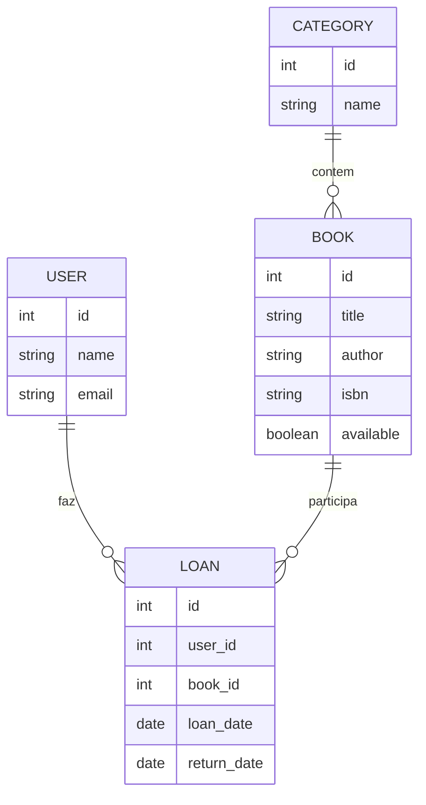
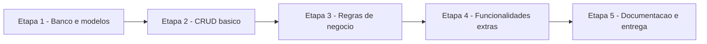

# 13.1 — Definindo o Problema e Planejando a Solução

[← Anterior: A Jornada Profissional](cap12-mod12-jornada-profissional.md) · [Próximo: Modelagem e Arquitetura do Projeto →](cap13-mod02-modelagem-arquitetura.md)

---

## Introdução

Você chegou ao último capítulo. Parabéns — de verdade. Você começou sem saber o que era um computador e agora sabe programar em Python, C e C#, entende bancos de dados, arquitetura de software e já construiu uma API REST completa. Isso não é pouco.

No capítulo 11, você construiu uma API de produtos com FastAPI e SQLite — um sistema real, com persistência, validação, paginação e arquitetura em camadas. Agora, no capítulo 12, você vai fazer algo diferente: vai criar um projeto inteiro do zero, desde a definição do problema até a entrega final. Esse é o seu TCC — Trabalho de Conclusão de Curso.

Mas antes de escrever uma única linha de código, você precisa responder a pergunta mais importante de todas: **qual problema você quer resolver?**

Essa pergunta não é retórica. Ela é o ponto de partida de todo software que já existiu. Ninguém criou o Google "porque sim" — criou porque encontrar informação na internet era impossível. Ninguém criou o Uber "porque sim" — criou porque pegar um táxi era imprevisível e caro. Todo software que funciona começa com um problema real que alguém decidiu resolver.

Neste módulo, você vai aprender a identificar um problema, definir o escopo do que vai construir, planejar as etapas e criar um documento que vai guiar todo o seu desenvolvimento. É o módulo mais importante do capítulo — porque um projeto sem planejamento é como uma viagem sem mapa: você até pode chegar em algum lugar, mas provavelmente não onde queria.

---

## Por que Planejar Antes de Programar?

Existe uma tentação enorme de abrir o editor e começar a escrever código imediatamente. Todo programador já sentiu isso. O problema é que código sem planejamento gera retrabalho, frustração e projetos abandonados.

Vamos pensar em uma analogia. Imagine que você quer construir uma casa. Você não começa colocando tijolos — você primeiro decide quantos quartos quer, onde vai ser a cozinha, qual o tamanho do terreno, quanto pode gastar. Depois faz uma planta. Depois calcula os materiais. Só então começa a construir.

Software funciona da mesma forma. A "planta" do software é o planejamento: o que o sistema faz, para quem, quais dados manipula, como as partes se conectam. Sem essa planta, você vai construir, derrubar e reconstruir várias vezes.

### O Custo de Não Planejar

Estudos da indústria de software mostram um padrão consistente:

| Quando o erro é encontrado | Custo relativo para corrigir |
|----------------------------|------------------------------|
| Durante o planejamento | 1x |
| Durante o desenvolvimento | 6x a 10x |
| Durante os testes | 15x a 40x |
| Depois da entrega | 60x a 100x |

Esses números vem de pesquisas como o COCOMO (Constructive Cost Model) de Barry Boehm, publicadas nos anos 1980 e confirmadas em estudos posteriores. A mensagem é clara: quanto mais cedo você encontra um problema, mais barato e corrigi-lo.

Na prática, isso significa que gastar 2 horas planejando pode economizar 20 horas de retrabalho. Não é exagero — é experiência de quem já construiu software profissionalmente.

### Planejamento no Mundo Real

Empresas de tecnologia investem tempo significativo em planejamento antes de escrever código:

- No **Spotify**, antes de construir uma nova funcionalidade, os times escrevem um documento chamado "DIBB" (Data, Insight, Belief, Bet) que define o problema, a hipótese e o que vão construir para testar essa hipótese.
- No **Google**, engenheiros escrevem "Design Docs" — documentos de 5 a 20 páginas que descrevem o problema, as alternativas consideradas e a solução escolhida. Só depois de aprovado o design doc é que o código começa.
- Na **Amazon**, antes de construir qualquer produto novo, os times escrevem um "Press Release" fictício — como se o produto já existisse. Isso força a equipe a pensar no problema do ponto de vista do usuário antes de pensar na tecnologia.

Você não precisa escrever 20 páginas. Mas precisa responder algumas perguntas fundamentais antes de começar.

---

## Passo 1: Identificando o Problema

O primeiro passo é escolher um problema para resolver. Esse problema pode vir de várias fontes:

### Problemas do Seu Dia a Dia

Olhe ao redor. Que tarefas você faz repetidamente que poderiam ser automatizadas? Que informações você precisa consultar com frequência? Que processos são confusos ou desorganizados?

Exemplos:
- "Eu anoto minhas despesas em um caderno e nunca sei quanto gastei no mês" → sistema de controle financeiro
- "Na loja do meu pai, o estoque é controlado em uma planilha que sempre da erro" → sistema de controle de estoque
- "Meu grupo de estudos não consegue organizar quem vai apresentar o que" → sistema de organização de tarefas
- "Eu treino na academia mas nunca lembro quais exercícios fiz na semana passada" → sistema de registro de treinos

### Problemas de Outras Pessoas

Converse com amigos, familiares, colegas. Pergunte: "Que tarefa você faz no computador ou no celular que é chata ou confusa?" As respostas podem surpreender.

### Problemas Clássicos de Aprendizado

Se você não encontrar um problema pessoal, existem problemas clássicos que são excelentes para um TCC:

| Problema | Descrição | Complexidade |
|----------|-----------|-------------|
| Biblioteca | Gerenciar livros, empréstimos e usuários | Média |
| Agenda de contatos | Cadastrar, buscar e organizar contatos | Baixa-Média |
| Controle financeiro | Registrar receitas, despesas e gerar relatórios | Média |
| Lista de tarefas (To-Do) | Criar, organizar e marcar tarefas como concluídas | Baixa |
| Cardápio de restaurante | Gerenciar pratos, categorias e preços | Média |
| Controle de estoque | Registrar produtos, entradas, saídas e alertas | Média-Alta |
| Sistema de notas | Registrar alunos, disciplinas e notas | Média |
| Registro de treinos | Registrar exercícios, séries, cargas e histórico | Média |
| Blog simples | Criar, editar e listar posts com categorias | Média |
| Catálogo de filmes | Cadastrar filmes, avaliações e recomendações | Média |

### Critérios para um Bom Problema de TCC

Nem todo problema é adequado para um TCC. O problema ideal tem estas características:

| Critério | Por que importa | Exemplo bom | Exemplo ruim |
|----------|----------------|-------------|-------------|
| Escopo definido | Você consegue terminar | CRUD de produtos com categorias | Rede social completa |
| Dados estruturados | Exercita modelagem | Produtos tem nome, preço, categoria | "Um app de IA" |
| Operações CRUD | Exercita o básico | Criar, listar, editar, remover | Apenas visualização |
| Regras de negócio | Exercita lógica | "Não pode vender com estoque zero" | Sem regras |
| Pelo menos 2 entidades | Exercita relacionamentos | Produtos e Categorias | Apenas uma tabela |
| Relevância pessoal | Mantem motivação | Algo que você usaria | Algo que ninguém quer |

---

## Passo 2: Definindo o Escopo

Depois de escolher o problema, você precisa definir o escopo — ou seja, o que o seu sistema vai fazer e, tao importante quanto, o que ele NÃO vai fazer.

Escopo é a fronteira do seu projeto. Sem essa fronteira, o projeto cresce infinitamente e nunca fica pronto. Isso tem um nome na indústria: **scope creep** (expansão de escopo) — e é a causa número um de projetos que nunca são entregues.

### Como Definir o Escopo

Use a técnica do "MVP" — Minimum Viable Product (Produto Mínimo Viável). O MVP é a versão mais simples do seu sistema que ainda resolve o problema. Tudo que não é essencial fica para depois.

Exemplo para um sistema de controle financeiro:

**Dentro do escopo (MVP):**
- Cadastrar receitas e despesas
- Categorizar transações (alimentação, transporte, lazer)
- Listar transações com filtros por data e categoria
- Mostrar saldo total e por categoria
- Persistir dados em banco de dados

**Fora do escopo (futuro):**
- Gráficos e dashboards
- Importação de extratos bancários
- Múltiplos usuários
- App mobile
- Integração com bancos
- Notificações de gastos

Perceba: o MVP já resolve o problema ("saber quanto gastei no mês"). As funcionalidades "fora do escopo" são melhorias que podem vir depois — mas o sistema funciona sem elas.

### A Regra do "Precisa vs Seria Legal"

Para cada funcionalidade que você pensar, pergunte:

- **"O sistema funciona sem isso?"** Se sim, está fora do MVP.
- **"Isso resolve o problema principal?"** Se não, está fora do MVP.
- **"Eu consigo implementar isso com o que aprendi?"** Se não, está fora do MVP.

Essa disciplina é difícil — todo mundo quer adicionar "só mais uma coisinha". Mas é essa disciplina que separa projetos entregues de projetos abandonados.

---

## Passo 3: Descrevendo as Entidades

Toda aplicação manipula dados. Esses dados são organizados em entidades — conceitos do mundo real que o sistema precisa representar. Você já fez isso no capítulo 8 (modelagem de dados) e no capítulo 9 (classes e objetos). Agora vai aplicar no seu projeto.

### Identificando Entidades

Para encontrar as entidades do seu sistema, releia a descrição do problema é destaque os substantivos. Eles geralmente são as entidades.

Exemplo: "Um sistema para gerenciar uma **biblioteca**. O **usuário** pode pegar **livros** emprestados. Cada **empréstimo** tem uma data de devolução."

Entidades identificadas: Usuário, Livro, Empréstimo.

### Descrevendo Cada Entidade

Para cada entidade, defina:

1. **Nome**: como você vai chamar essa entidade (em inglês, seguindo a convenção)
2. **Atributos**: quais informações ela guarda
3. **Relacionamentos**: como ela se conecta com outras entidades
4. **Regras**: restrições e validações

Exemplo para a entidade "Livro":

```
Entidade: Book (Livro)

Atributos:
- id: identificador unico (inteiro, gerado automaticamente)
- title: titulo do livro (texto, obrigatorio)
- author: autor do livro (texto, obrigatorio)
- isbn: codigo ISBN (texto, unico)
- year: ano de publicacao (inteiro)
- available: se esta disponivel para emprestimo (booleano)

Relacionamentos:
- Um livro pode ter muitos emprestimos (ao longo do tempo)
- Um livro pertence a uma categoria (opcional)

Regras:
- ISBN deve ser unico (nao pode ter dois livros com o mesmo ISBN)
- Titulo e autor sao obrigatorios
- Um livro so pode ser emprestado se "available" for verdadeiro
```

### Mapeando Relacionamentos

Depois de listar as entidades, desenhe como elas se conectam. Use os tipos de relacionamento que você aprendeu no capítulo 8:

| Tipo | Significado | Exemplo |
|------|------------|---------|
| 1:1 | Um para um | Um usuário tem um perfil |
| 1:N | Um para muitos | Uma categoria tem muitos livros |
| N:M | Muitos para muitos | Um livro pode ter muitos autores, um autor pode ter muitos livros |

Para o TCC, tente ter pelo menos 2 entidades com pelo menos 1 relacionamento entre elas. Isso exercita modelagem de dados e joins SQL.



---

## Passo 4: Listando as Funcionalidades

Com o problema definido, o escopo delimitado e as entidades mapeadas, agora você lista o que o sistema vai fazer. Cada funcionalidade é uma ação que o usuário pode executar.

### Formato de Funcionalidade

Para cada funcionalidade, descreva:

```
Funcionalidade: [nome curto]
Descricao: O que o usuario pode fazer
Entrada: Que dados o usuario fornece
Saida: O que o sistema retorna
Regras: Validacoes e restricoes
```

### Exemplo: Sistema de Biblioteca

**Funcionalidade 1: Cadastrar livro**
- Descrição: O usuário cadastra um novo livro no sistema
- Entrada: título, autor, ISBN, ano, categoria
- Saída: Livro criado com ID gerado
- Regras: ISBN deve ser único; título e autor obrigatórios

**Funcionalidade 2: Buscar livros**
- Descrição: O usuário busca livros por título, autor ou categoria
- Entrada: termo de busca e/ou filtro de categoria
- Saída: Lista de livros que correspondem a busca
- Regras: Busca parcial (não precisa digitar o título completo)

**Funcionalidade 3: Realizar empréstimo**
- Descrição: O usuário pega um livro emprestado
- Entrada: ID do usuário, ID do livro
- Saída: Empréstimo criado com data de devolução
- Regras: Livro deve estar disponível; usuário não pode ter mais de 3 empréstimos ativos

**Funcionalidade 4: Devolver livro**
- Descrição: O usuário devolve um livro emprestado
- Entrada: ID do empréstimo
- Saída: Empréstimo marcado como devolvido, livro volta a ficar disponível
- Regras: Só pode devolver empréstimos ativos

### Priorizando Funcionalidades

Nem todas as funcionalidades tem a mesma importância. Use a classificação:

| Prioridade | Significado | Critério |
|-----------|------------|---------|
| Essencial | O sistema não funciona sem isso | CRUD básico das entidades principais |
| Importante | Melhora muito a experiência | Filtros, busca, validações |
| Desejável | Seria legal ter | Relatórios, estatísticas, exportação |

Para o TCC, foque nas funcionalidades essenciais e importantes. As desejáveis são bônus.

---

## Passo 5: Escolhendo a Tecnologia

Você já conhece várias tecnologias. Para o TCC, a escolha depende do que você quer exercitar:

### Opção 1: Python + FastAPI + SQLite (Recomendada)

Esta é a opção mais natural para o TCC. Você já construiu uma API completa com essa stack no capítulo 11. Vantagens:
- Você já conhece a stack
- FastAPI gera documentação automática
- SQLite não precisa instalar nada
- Python é produtivo para prototipação rápida

Ideal para: projetos focados em API REST, CRUD com regras de negócio, sistemas de catálogo ou gerenciamento.

### Opção 2: C# + .NET + SQLite

Se você quer exercitar orientação a objetos em profundidade, C# é uma ótima escolha. Você aprendeu a linguagem no capítulo 9 e pode aplicar todos os patterns (Factory, Repository, SOLID).

Ideal para: projetos que se beneficiam de tipagem forte e organização OOP rigorosa.

### Opção 3: Python CLI + SQLite

Se você prefere algo mais simples, sem API REST, pode construir uma aplicação de linha de comando (CLI) com Python e SQLite. É similar ao que você fez no capítulo 5 (CRUD em memória) e no capítulo 8 (CRUD com banco), mas com mais funcionalidades e melhor organização.

Ideal para: quem quer focar em lógica e modelagem sem a complexidade de HTTP.

### Tabela Comparativa

| Critério | Python + FastAPI | C# + .NET | Python CLI |
|----------|-----------------|-----------|-----------|
| Complexidade | Média | Média-Alta | Baixa |
| Aprendizado extra | Pouco | Pouco | Nenhum |
| Portfolio | Excelente | Excelente | Bom |
| Documentação automática | Sim (Swagger) | Sim (Swagger) | Não |
| Exercita API REST | Sim | Sim | Não |
| Exercita OOP | Parcial | Total | Parcial |

Não existe escolha errada. Escolha a que faz mais sentido para você e para o problema que quer resolver.

---

## Passo 6: Criando o Documento de Planejamento

Agora você vai juntar tudo em um documento. Esse documento é o "contrato" do seu projeto — ele define o que você vai construir e serve como guia durante todo o desenvolvimento.

### Estrutura do Documento

Crie um arquivo chamado `README.md` na raiz do seu projeto com a seguinte estrutura:

```markdown
# [Nome do Projeto]

## O Problema
[1-2 paragrafos explicando qual problema o sistema resolve]

## A Solucao
[1 paragrafo descrevendo o que o sistema faz para resolver o problema]

## Escopo

### Dentro do Escopo (MVP)
- [funcionalidade 1]
- [funcionalidade 2]
- ...

### Fora do Escopo (Futuro)
- [funcionalidade futura 1]
- [funcionalidade futura 2]
- ...

## Entidades

### [Entidade 1]
- Atributos: ...
- Relacionamentos: ...
- Regras: ...

### [Entidade 2]
- Atributos: ...
- Relacionamentos: ...
- Regras: ...

## Funcionalidades

### Essenciais
1. [funcionalidade] — [descricao curta]
2. ...

### Importantes
1. [funcionalidade] — [descricao curta]
2. ...

### Desejaveis
1. [funcionalidade] — [descricao curta]
2. ...

## Tecnologia
- Linguagem: [Python/C#]
- Framework: [FastAPI/.NET/CLI]
- Banco de dados: [SQLite]
- Outras: [se houver]

## Estrutura de Pastas (planejada)
[arvore de diretorios que voce pretende usar]
```

### Exemplo Completo: Sistema de Controle Financeiro

```markdown
# FinControl — Controle Financeiro Pessoal

## O Problema
Muitas pessoas nao sabem quanto gastam por mes nem em que categorias
gastam mais. Anotar despesas em cadernos ou planilhas e trabalhoso
e facil de esquecer. O resultado e que no final do mes a pessoa
nao sabe para onde foi o dinheiro.

## A Solucao
O FinControl e uma API REST que permite registrar receitas e despesas,
categoriza-las e consultar resumos por periodo e categoria. Com ele,
o usuario sabe exatamente quanto ganhou, quanto gastou e onde gastou.

## Escopo

### Dentro do Escopo (MVP)
- Cadastrar transacoes (receita ou despesa)
- Categorizar transacoes
- Listar transacoes com filtros (data, categoria, tipo)
- Consultar saldo total
- Consultar resumo por categoria
- Gerenciar categorias

### Fora do Escopo (Futuro)
- Graficos e dashboards
- Multiplos usuarios
- Importacao de extratos bancarios
- App mobile
- Orcamento mensal com alertas

## Entidades

### Transaction (Transacao)
- Atributos: id, description, amount, type (income/expense),
  category_id, date, created_at
- Relacionamentos: pertence a uma Category
- Regras: amount deve ser positivo; type so pode ser
  "income" ou "expense"; description obrigatoria

### Category (Categoria)
- Atributos: id, name, description
- Relacionamentos: tem muitas Transactions
- Regras: name deve ser unico; nao pode remover categoria
  com transacoes

## Funcionalidades

### Essenciais
1. Criar transacao — registrar receita ou despesa com valor,
   descricao e categoria
2. Listar transacoes — ver todas as transacoes com filtros
3. Criar categoria — cadastrar nova categoria de transacao
4. Listar categorias — ver todas as categorias disponiveis
5. Consultar saldo — ver total de receitas menos despesas

### Importantes
1. Filtrar por periodo — listar transacoes de um intervalo de datas
2. Resumo por categoria — ver quanto foi gasto em cada categoria
3. Editar transacao — corrigir dados de uma transacao existente
4. Remover transacao — excluir transacao errada

### Desejaveis
1. Resumo mensal — comparar gastos entre meses
2. Top categorias — ranking das categorias com mais gastos
3. Busca por descricao — encontrar transacoes por texto

## Tecnologia
- Linguagem: Python 3.10+
- Framework: FastAPI
- Banco de dados: SQLite
- Validacao: Pydantic
- Servidor: Uvicorn

## Estrutura de Pastas
fincontrol/
├── main.py
├── database.py
├── models/
│   ├── transaction.py
│   └── category.py
├── repositories/
│   ├── transaction_repository.py
│   └── category_repository.py
├── services/
│   ├── transaction_service.py
│   └── category_service.py
├── routers/
│   ├── transactions.py
│   └── categories.py
└── fincontrol.db
```

Esse documento não precisa ser perfeito. Ele vai evoluir durante o desenvolvimento. Mas ter essa base escrita antes de começar a programar faz toda a diferença.

---

## Passo 7: Planejando as Etapas de Desenvolvimento

Um projeto não é construido de uma vez. Ele é construido em etapas — cada etapa adiciona funcionalidade sobre a anterior. Você já fez isso no projeto do capítulo 11 (4 fases incrementais). Agora vai planejar as etapas do seu próprio projeto.

### Desenvolvimento Incremental

A ideia é simples: construa o mínimo que funciona, teste, e só então adicione mais. Isso tem vários nomes na indústria — desenvolvimento incremental, iterativo, agile — mas o princípio é o mesmo: entregar valor em pedaços pequenos.



### Modelo de Etapas para o TCC

| Etapa | O que construir | Resultado esperado |
|-------|----------------|-------------------|
| 1 | Banco de dados e modelos | Tabelas criadas, modelos definidos |
| 2 | CRUD básico | Criar, listar, buscar, editar, remover funcionando |
| 3 | Regras de negócio | Validações, restrições, tratamento de erros |
| 4 | Funcionalidades extras | Filtros, busca, relatórios, estatísticas |
| 5 | Documentação e entrega | README completo, código comentado, testes |

Cada etapa deve ser um "checkpoint" — um ponto onde o sistema funciona e você pode mostrar para alguém. Se você só conseguir completar até a etapa 3, ainda terá um projeto funcional. As etapas 4 e 5 são o diferencial.

### Estimando o Tempo

Não existe fórmula mágica para estimar tempo em software. Mas uma regra prática funciona bem para iniciantes:

1. Estime quanto tempo você acha que vai levar
2. Multiplique por 2
3. Esse é o tempo real

Isso não é piada — é experiência. Programadores experientes erram estimativas por fatores de 2x a 3x. Iniciantes erram por fatores maiores. A razão é que sempre aparecem problemas que você não previu: um bug estranho, uma funcionalidade mais complexa do que parecia, uma dependência que não funciona como esperado.

Para o TCC, uma estimativa realista:

| Etapa | Estimativa otimista | Estimativa realista |
|-------|--------------------|--------------------|
| Planejamento (este módulo) | 2h | 3-4h |
| Banco e modelos | 2h | 3-4h |
| CRUD básico | 4h | 6-8h |
| Regras de negócio | 3h | 5-6h |
| Funcionalidades extras | 4h | 6-8h |
| Documentação | 2h | 3-4h |
| Total | 17h | 26-34h |

Esses números são aproximados. O importante é ter uma noção de que o projeto vai levar dezenas de horas, não dias. Planeje seu tempo de acordo.

---

## Erros Comuns no Planejamento

### Erro 1: Escopo Grande Demais

O erro mais comum. O aluno quer construir "um sistema completo de e-commerce com carrinho, pagamento, frete e recomendações". Isso é um projeto de equipe de 6 meses, não um TCC individual.

**Como evitar**: use a regra do MVP. Se você não consegue descrever o sistema em 1 parágrafo, o escopo está grande demais.

### Erro 2: Escopo Pequeno Demais

O oposto também acontece. "Um sistema que cadastra nomes em uma lista" não exercita quase nada do que você aprendeu.

**Como evitar**: garanta que o projeto tem pelo menos 2 entidades relacionadas, operações CRUD completas e pelo menos 3 regras de negócio.

### Erro 3: Tecnologia Desconhecida

Querer usar React, Angular, MongoDB ou qualquer tecnologia que você não aprendeu no curso. O TCC não é o momento de aprender tecnologia nova — é o momento de demonstrar o que você aprendeu.

**Como evitar**: use apenas tecnologias que você já praticou nos capítulos anteriores.

### Erro 4: Pular o Planejamento

"Eu já sei o que quero fazer, não preciso escrever." Precisa sim. Escrever força você a pensar com clareza. Ideias na cabeca parecem completas, mas quando você tenta escrever, percebe as lacunas.

**Como evitar**: escreva o documento de planejamento antes de abrir o editor de código. Mostre para alguém e peça feedback.

### Erro 5: Não Versionar Desde o Inicio

Começar o projeto sem Git e perder a capacidade de voltar atrás quando algo da errado.

**Como evitar**: crie o repositório Git no primeiro minuto do projeto. Faça commits frequentes. Você aprendeu isso no capítulo 4.

---

## Checklist de Planejamento

Antes de seguir para o próximo módulo, verifique se você tem:

- [ ] Um problema claro e definido (1-2 parágrafos)
- [ ] Escopo delimitado (o que está dentro e fora do MVP)
- [ ] Pelo menos 2 entidades com atributos e relacionamentos
- [ ] Lista de funcionalidades priorizadas (essencial, importante, desejável)
- [ ] Tecnologia escolhida (linguagem, framework, banco)
- [ ] Estrutura de pastas planejada
- [ ] Etapas de desenvolvimento definidas
- [ ] Repositório Git criado com o README.md inicial

Se todos os itens estão marcados, você está pronto para começar a modelagem e a arquitetura no próximo módulo.

---

## Como a IA pode te ajudar aqui

**Prompt 1 — Pedir ajuda prática:**
> "Estou pensando em criar um sistema de [descrição]. Me ajude a definir as entidades, atributos e relacionamentos."

**Prompt 2 — Praticar com projetos:**
> "Revise este documento de planejamento do meu projeto e me diga se está faltando algo importante ou se o escopo está adequado para um TCC."

**Prompt 3 — Explorar o conceito:**
> "Quero criar um sistema de controle financeiro. Me ajude a listar as funcionalidades essenciais, importantes e desejáveis, separando o que é MVP do que é futuro."

---

## Casos de Uso no Mundo Real

### Caso 1: Startups e o MVP

Toda startup começa com um MVP. O Airbnb começou como um site simples onde os fundadores alugavam colchões infláveis no apartamento deles em San Francisco. Não tinha sistema de pagamento, não tinha avaliação, não tinha mapa. Era um site com fotos e um formulário de contato. Esse MVP validou a ideia — e só depois vieram as funcionalidades que conhecemos hoje. O processo que você está aprendendo (definir problema, delimitar escopo, construir o mínimo) é exatamente o que startups fazem.

### Caso 2: Documentos de Design no Google

No Google, nenhum projeto significativo começa sem um "Design Doc". Engenheiros escrevem documentos de 5 a 20 páginas descrevendo o problema, as alternativas consideradas, a solução proposta, os riscos e o plano de implementação. Outros engenheiros revisam o documento e dão feedback antes de qualquer código ser escrito. O documento de planejamento que você está criando para o TCC segue o mesmo princípio — em escala menor, mas com a mesma lógica.

### Caso 3: Planejamento em Equipes Ágeis

Em empresas que usam metodologias ágeis (Scrum, Kanban), o planejamento acontece em ciclos curtos chamados "sprints" (geralmente 2 semanas). Antes de cada sprint, a equipe define o que vai construir, estima o esforço e prioriza as tarefas. O que você está fazendo — definir escopo, priorizar funcionalidades, planejar etapas — é a versão individual desse processo.

---

## Resumo do Módulo

| Conceito | Definição |
|----------|-----------|
| Definição do problema | Identificar qual problema real o software vai resolver |
| Escopo | Fronteira do projeto — o que está dentro e fora |
| MVP | Minimum Viable Product — versão mínima que resolve o problema |
| Scope creep | Expansão descontrolada do escopo que impede a entrega |
| Entidade | Conceito do mundo real representado no sistema (ex: Produto, Usuário) |
| Atributo | Informação que uma entidade guarda (ex: nome, preço) |
| Relacionamento | Conexão entre entidades (ex: Produto pertence a Categoria) |
| Funcionalidade | Ação que o usuário pode executar no sistema |
| Desenvolvimento incremental | Construir em etapas, cada uma adicionando valor |
| Documento de planejamento | README.md que define problema, escopo, entidades e plano |

---

## Glossário do Módulo

| Termo | Definição |
|-------|-----------|
| Atributo | Informação individual que uma entidade armazena |
| COCOMO | Constructive Cost Model — modelo de estimativa de custo de software |
| CRUD | Create, Read, Update, Delete — operações básicas de dados |
| Design Doc | Documento de design técnico usado em empresas como Google |
| Entidade | Representação de um conceito do mundo real no sistema |
| Escopo | Conjunto de funcionalidades que o projeto vai implementar |
| Estimativa | Previsão de quanto tempo uma tarefa vai levar |
| Funcionalidade | Capacidade específica que o sistema oferece ao usuário |
| MVP | Minimum Viable Product — produto mínimo viável |
| Relacionamento | Conexão lógica entre duas entidades |
| Scope creep | Expansão descontrolada do escopo de um projeto |
| Sprint | Ciclo curto de desenvolvimento em metodologias ágeis |
| Stakeholder | Pessoa interessada ou afetada pelo projeto |
| TCC | Trabalho de Conclusão de Curso |

---

## Na Cultura Popular

- **The Social Network** (filme, 2010) — conta a criação do Facebook. Mark Zuckerberg começou com um problema simples ("conectar alunos de Harvard") e um MVP mínimo (um diretório com fotos e perfis). O filme mostra como o escopo foi crescendo — e os conflitos que isso gerou. Excelente para entender a importância de definir escopo desde o inicio.

- **Silicon Valley** (série, 2014-2019) — a série inteira gira em torno de uma startup tentando construir um produto. Cada temporada mostra os desafios de definir o que construir, priorizar funcionalidades e lidar com scope creep. O personagem Richard Hendricks vive o dilema de querer construir "a plataforma perfeita" enquanto investidores querem um MVP que funcione.

- **Halt and Catch Fire** (série, 2014-2017) — mostra a evolução da indústria de tecnologia dos anos 1980 aos 2000. Os personagens passam por ciclos de planejamento, construção e entrega de produtos — desde PCs até a internet. A série ilustra como todo produto começa com alguém identificando um problema e decidindo resolvê-lo.

---

## Para Saber Mais

- [How to Write a Good README](https://www.makeareadme.com/) — *Guia prático para escrever READMEs claros e completos para seus projetos*
- [Conventional Commits](https://www.conventionalcommits.org/pt-br/) — *Padrão de mensagens de commit que você vai usar no TCC (em português)*
- [GitHub Student Developer Pack](https://education.github.com/pack) — *Ferramentas gratuitas para estudantes, incluindo GitHub Pro e domínios*
- [Choose a License](https://choosealicense.com/) — *Guia para escolher a licença certa para seu projeto open source*
- [Repositórios do Fino](https://github.com/RafaelFino) — *Projetos de referência do autor do curso — veja como projetos reais são estruturados*

---

## Perguntas Frequentes (FAQ)

**P: Posso fazer o TCC em dupla ou grupo?**
R: O TCC é individual. O objetivo é que você demonstre o que aprendeu. Mas você pode (e deve) pedir feedback de colegas sobre o planejamento e o código.

**P: Preciso inventar algo original?**
R: Não. Um CRUD de biblioteca bem feito é melhor que uma "rede social com IA" mal feita. O que importa é a qualidade da execução, não a originalidade da ideia.

**P: Posso usar o projeto do capítulo 11 como base?**
R: Você pode usar a mesma stack (Python + FastAPI + SQLite), mas o projeto deve ser diferente. O objetivo é que você passe pelo processo completo de planejamento e construção, não que copie algo pronto.

**P: E se eu mudar de ideia no meio do projeto?**
R: Acontece. Se a mudança for pequena (trocar uma entidade, adicionar um campo), ajuste o documento de planejamento e siga em frente. Se a mudança for grande (trocar o problema inteiro), avalie se vale a pena recomeçar ou se é melhor adaptar o que já tem.

**P: Quanto tempo devo gastar no planejamento?**
R: Entre 3 e 5 horas. Parece muito, mas esse tempo se paga durante o desenvolvimento. Um planejamento de 4 horas pode economizar 20 horas de retrabalho.

**P: O documento de planejamento precisa ser perfeito?**
R: Não. Ele precisa ser claro e completo o suficiente para guiar o desenvolvimento. Você vai ajustá-lo durante o projeto — isso é normal e esperado.

**P: Posso usar IA para me ajudar no planejamento?**
R: Sim, é recomendado. A IA é excelente para brainstorming, revisão de documentos e sugestão de funcionalidades. Mas a decisão final é sua — você precisa entender e concordar com tudo que está no documento.

**P: E se eu não conseguir terminar todas as etapas?**
R: Entregue o que conseguiu. Um projeto com etapas 1-3 completas e bem feitas é melhor que um projeto com 5 etapas mal feitas. Qualidade importa mais que quantidade.

**P: Preciso fazer deploy do projeto?**
R: Não é obrigatório, mas é um diferencial. Se você conseguir colocar o projeto rodando em algum lugar (mesmo que seja um servidor local com Docker), isso mostra maturidade técnica.

**P: Como sei se meu escopo está adequado?**
R: Regra prática: se você consegue descrever o sistema em 1 parágrafo e listar as funcionalidades em meia página, o escopo está bom. Se precisa de 3 páginas só para listar funcionalidades, está grande demais.

**P: Posso mudar a tecnologia no meio do projeto?**
R: Pode, mas é arriscado. Trocar de FastAPI para Flask no meio do desenvolvimento significa reescrever boa parte do código. Se você perceber cedo (antes da etapa 2), a troca é viável. Depois disso, adapte o que tem.

**P: Preciso de autenticação no TCC?**
R: Não é obrigatório. Autenticação (login, JWT, permissões) adiciona complexidade significativa. Para o TCC, foque no CRUD, regras de negócio e arquitetura. Autenticação é um excelente diferencial se você tiver tempo, mas não é requisito.

**P: Posso fazer um projeto que já existe (tipo um clone de app)?**
R: Sim. Fazer um "mini-iFood" (cardápio + pedidos) ou um "mini-Trello" (tarefas + projetos) é perfeitamente válido. O importante não é a originalidade da ideia, mas a qualidade da execução. Clones simplificados de apps conhecidos são ótimos para TCC porque o problema já está bem definido.

**P: Preciso de interface gráfica (frontend)?**
R: Não. Para o TCC, uma API REST testável via curl e Swagger é suficiente. Frontend (HTML, CSS, JavaScript) é um diferencial, mas não é requisito. Se você quiser adicionar, faça depois que o backend estiver completo e funcionando.

**P: Posso usar bibliotecas externas além do FastAPI?**
R: Sim, desde que faça sentido. FastAPI, Uvicorn e Pydantic são as dependências básicas. Se precisar de algo específico (como python-dateutil para manipulação de datas), use. Mas evite adicionar bibliotecas desnecessárias — cada dependência é um ponto de complexidade.


---

## Exercícios Práticos

### Exercício 1: Escolha e Defina seu Problema

Escolha um problema para o seu TCC. Escreva:
1. O problema em 1-2 parágrafos (qual dor você quer resolver?)
2. A solução em 1 parágrafo (o que o sistema faz?)
3. Por que esse problema importa para você (motivação pessoal)

Dica: se você não consegue explicar o problema para alguém que não é de tecnologia em 30 segundos, o problema não está claro o suficiente.

### Exercício 2: Crie o Documento de Planejamento

Usando a estrutura apresentada neste módulo, crie o `README.md` completo do seu projeto:
- Problema e solução
- Escopo (dentro e fora do MVP)
- Entidades com atributos e relacionamentos
- Funcionalidades priorizadas
- Tecnologia escolhida
- Estrutura de pastas
- Etapas de desenvolvimento

### Exercício 3: Inicialize o Repositório

1. Crie uma pasta para o seu projeto
2. Inicialize o Git: `git init`
3. Crie o `README.md` com o documento de planejamento
4. Faça o primeiro commit: `git commit -m "docs: initial project planning"`
5. Crie um repositório no GitHub e faça o push

A partir de agora, todo o desenvolvimento do TCC deve ser versionado com Git. Commits frequentes, mensagens claras, branches quando fizer sentido.


### Nota sobre a Importância da Definição

A definição do problema é a etapa mais subestimada de qualquer projeto. Desenvolvedores iniciantes tendem a pular direto para o código, mas profissionais experientes sabem que tempo investido na definição do problema economiza semanas de retrabalho. Um problema bem definido já contém metade da solução.

### Perguntas que Ajudam a Definir o Problema

| Pergunta | Por que importa |
|----------|-----------------|
| Quem tem esse problema? | Define o público-alvo e as necessidades |
| Como resolvem hoje? | Mostra as limitações da solução atual |
| O que acontece se não resolver? | Avalia a urgência e o impacto |
| Qual o menor escopo que resolve? | Evita over-engineering |
| Como vou saber que resolvi? | Define critérios de sucesso mensuráveis |

Essas perguntas parecem simples, mas respondê-las com honestidade e profundidade é o que separa projetos que dão certo de projetos que ficam pelo caminho.

### Exemplos de Problemas Bem Definidos vs Mal Definidos

| Mal definido | Bem definido |
|-------------|-------------|
| "Quero fazer um app" | "Moradores do meu condomínio não conseguem reservar a churrasqueira porque o processo é por papel e gera conflitos" |
| "Quero usar IA" | "Atendentes da loja gastam 40% do tempo respondendo as mesmas 10 perguntas — um chatbot resolveria" |
| "Quero fazer um site" | "Artesãos locais não têm onde vender online sem pagar taxas altas de marketplace" |
| "Quero automatizar" | "O time financeiro gasta 8 horas por mês copiando dados de planilhas para o sistema — um script resolveria em minutos" |

Perceba que os problemas bem definidos têm: quem sofre, qual a dor, e uma noção de como medir o sucesso.

---

[← Anterior: A Jornada Profissional](cap12-mod12-jornada-profissional.md) · [Próximo: Modelagem e Arquitetura do Projeto →](cap13-mod02-modelagem-arquitetura.md)
