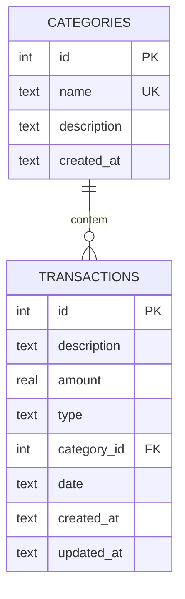
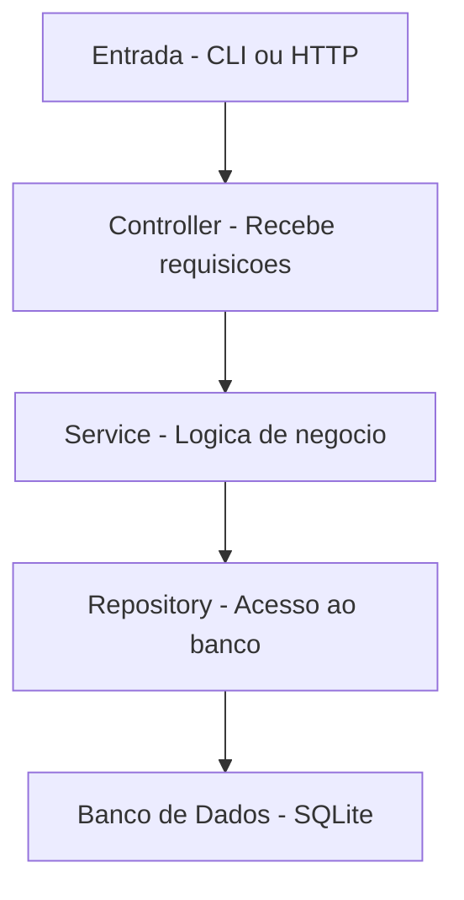
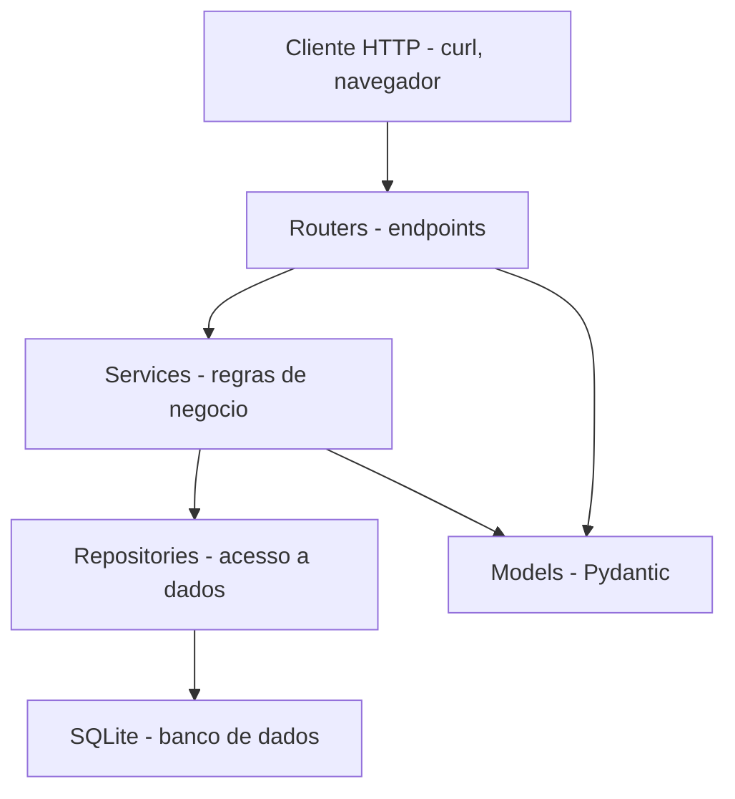
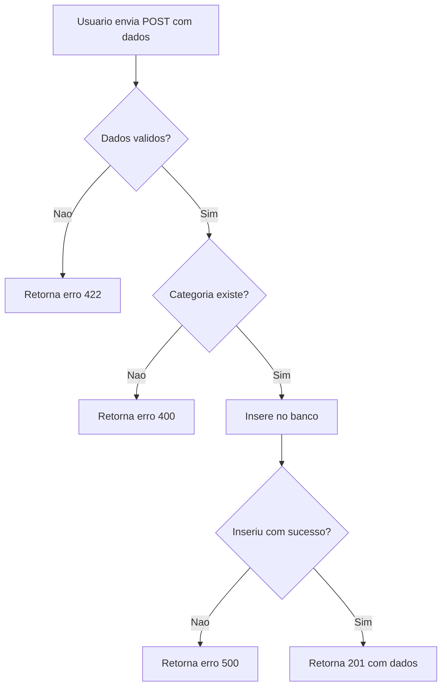

# 13.2 — Modelagem e Arquitetura do Projeto

[← Anterior: Definindo o Problema e Planejando a Solução](cap13-mod01-definição-problema.md) · [Próximo: Desenvolvimento Incremental →](cap13-mod03-desenvolvimento.md)

---

## Introdução

No módulo anterior, você definiu o problema, delimitou o escopo, listou entidades e funcionalidades, e criou o documento de planejamento do seu TCC. Agora é hora de transformar esse planejamento em algo mais concreto: a modelagem de dados e a arquitetura do sistema.

Modelagem e arquitetura são as "plantas" do seu software. A modelagem define como os dados serão organizados no banco de dados — quais tabelas existem, quais campos cada uma tem, como se relacionam. A arquitetura define como o código será organizado — quais camadas existem, qual a responsabilidade de cada uma, como as partes se comunicam.

Você já praticou modelagem no capítulo 8 (bancos de dados) e arquitetura no capítulo 10 (camadas). Neste módulo, você vai aplicar esses conhecimentos no seu próprio projeto, tomando decisões reais sobre como estruturar o sistema.

A diferença entre este módulo e os anteriores e que agora não existe "resposta certa" — as decisões são suas. Você vai precisar pensar, avaliar alternativas e justificar suas escolhas. Isso é exatamente o que desenvolvedores fazem no dia a dia.

---

## Por que Modelar Antes de Programar?

Imagine que você vai construir uma estante de livros. Você pode simplesmente pegar madeira e pregos e começar a montar. Talvez funcione. Mas é mais provável que você descubra no meio do caminho que as prateleiras ficaram tortas, que não cabem os livros grandes, ou que a estante não cabe no espaço que você tinha.

A alternativa e medir o espaço, decidir quantas prateleiras quer, calcular as dimensões e só então cortar a madeira. Leva mais tempo no início, mas o resultado é muito melhor.

Modelagem de dados e a mesma coisa. Se você começar a criar tabelas no banco sem pensar nos relacionamentos, vai descobrir no meio do desenvolvimento que precisa de campos que não existem, que os relacionamentos estão errados, ou que uma consulta importante é impossível com a estrutura atual.

### O Custo de Mudar o Modelo Depois

Mudar a estrutura do banco de dados depois que o código já está escrito e caro:

| O que muda | O que precisa ser refeito |
|-----------|--------------------------|
| Adicionar um campo | Query de ALTER TABLE, atualizar modelo, atualizar repositório, atualizar serviço, atualizar validação |
| Mudar um relacionamento | Reescrever queries, reescrever lógica de negócio, reescrever testes |
| Dividir uma tabela em duas | Migrar dados, reescrever todo o acesso a dados, atualizar todas as camadas |
| Mudar o tipo de um campo | Migrar dados existentes, atualizar validações, atualizar testes |

Por isso, investir tempo na modelagem antes de programar economiza muito retrabalho.

---

## Parte 1: Modelagem de Dados

### Revisao Rápida: Conceitos do Capítulo 8

Antes de modelar, vamos relembrar os conceitos essenciais:

| Conceito | Definição | Exemplo |
|----------|-----------|---------|
| Tabela | Estrutura que armazena dados de uma entidade | tabela `products` |
| Campo (coluna) | Informação individual dentro de uma tabela | `name`, `price`, `stock` |
| Registro (linha) | Uma instância da entidade | Um produto específico |
| Chave primária (PK) | Campo que identifica unicamente cada registro | `id` |
| Chave estrangeira (FK) | Campo que referência a PK de outra tabela | `category_id` |
| Relacionamento | Conexão lógica entre tabelas | Produto pertence a Categoria |
| Índice | Estrutura que acelera buscas | Índice no campo `name` |

### Passo 1: Do Documento de Planejamento ao Modelo

No módulo anterior, você listou entidades com atributos. Agora você vai transformar isso em tabelas SQL reais.

Para cada entidade do seu planejamento:

1. Defina o nome da tabela (em ingles, plural, snake_case)
2. Liste todos os campos com tipo de dado
3. Marque campos obrigatórios
4. Defina a chave primária
5. Identifique chaves estrangeiras
6. Adicione campos de controle (created_at, updated_at)

### Exemplo: Modelando o Sistema de Controle Financeiro

Vamos usar o exemplo do FinControl (do módulo anterior) para mostrar o processo completo.

**Entidades do planejamento:**
- Transaction (receita ou despesa)
- Category (categoria de transação)

**Tabela `categories`:**

| Campo | Tipo | Obrigatório | Descrição |
|-------|------|-------------|-----------|
| id | INTEGER | Sim | Chave primária, autoincremento |
| name | TEXT | Sim | Nome da categoria (único) |
| description | TEXT | Não | Descrição da categoria |
| created_at | TEXT | Sim | Data de criação (ISO 8601) |

**Tabela `transactions`:**

| Campo | Tipo | Obrigatório | Descrição |
|-------|------|-------------|-----------|
| id | INTEGER | Sim | Chave primária, autoincremento |
| description | TEXT | Sim | Descrição da transação |
| amount | REAL | Sim | Valor (sempre positivo) |
| type | TEXT | Sim | "income" ou "expense" |
| category_id | INTEGER | Sim | FK para categories.id |
| date | TEXT | Sim | Data da transação (ISO 8601) |
| created_at | TEXT | Sim | Data de criação (ISO 8601) |
| updated_at | TEXT | Não | Data da última atualização |

### Passo 2: Escrevendo o SQL de Criação

Com as tabelas definidas, escreva o SQL que cria o banco:

```sql
-- Criacao do banco de dados do FinControl
-- Tabela de categorias (deve ser criada primeiro por causa da FK)

CREATE TABLE IF NOT EXISTS categories (
    id INTEGER PRIMARY KEY AUTOINCREMENT,  -- "id" = identificador unico
    name TEXT NOT NULL UNIQUE,             -- "name" = nome da categoria
    description TEXT,                       -- "description" = descricao
    created_at TEXT NOT NULL DEFAULT (datetime('now'))  -- "created_at" = data de criacao
);

-- Tabela de transacoes

CREATE TABLE IF NOT EXISTS transactions (
    id INTEGER PRIMARY KEY AUTOINCREMENT,  -- "id" = identificador unico
    description TEXT NOT NULL,             -- "description" = descricao da transacao
    amount REAL NOT NULL CHECK (amount > 0),  -- "amount" = valor (deve ser positivo)
    type TEXT NOT NULL CHECK (type IN ('income', 'expense')),  -- "type" = tipo
    category_id INTEGER NOT NULL,          -- "category_id" = referencia a categoria
    date TEXT NOT NULL,                    -- "date" = data da transacao
    created_at TEXT NOT NULL DEFAULT (datetime('now')),  -- "created_at" = criacao
    updated_at TEXT,                       -- "updated_at" = ultima atualizacao
    FOREIGN KEY (category_id) REFERENCES categories(id)  -- chave estrangeira
);

-- Indices para acelerar consultas frequentes

CREATE INDEX IF NOT EXISTS idx_transactions_category ON transactions(category_id);
CREATE INDEX IF NOT EXISTS idx_transactions_date ON transactions(date);
CREATE INDEX IF NOT EXISTS idx_transactions_type ON transactions(type);
```

Saída esperada (ao executar no SQLite):
```
(nenhuma saida — tabelas criadas com sucesso)
```

### Passo 3: Validando o Modelo

Antes de seguir, valide o modelo com estas perguntas:

| Pergunta | Se a resposta for "não" |
|----------|------------------------|
| Toda entidade tem chave primária? | Adicione um campo `id` |
| Todo relacionamento tem chave estrangeira? | Adicione o campo FK |
| Campos obrigatórios estão marcados como NOT NULL? | Adicione NOT NULL |
| Campos unicos estão marcados como UNIQUE? | Adicione UNIQUE |
| Existem campos de controle (created_at)? | Adicione-os |
| As consultas que você precisa são possíveis? | Revise o modelo |

A última pergunta e a mais importante. Pense nas funcionalidades que você listou e verifique se o modelo suporta todas elas:

- "Listar transações por categoria" → precisa de `category_id` na tabela transactions ✓
- "Calcular saldo total" → precisa somar `amount` agrupando por `type` ✓
- "Filtrar por período" → precisa do campo `date` ✓
- "Resumo por categoria" → precisa de JOIN entre transactions e categories ✓

Se alguma funcionalidade não é possível com o modelo atual, ajuste o modelo agora — antes de escrever código.

### Diagrama de Entidade-Relacionamento

Documente o modelo com um diagrama ER usando Mermaid:



Esse diagrama deve estar no README.md do seu projeto. Ele ajuda qualquer pessoa (inclusive você no futuro) a entender rapidamente a estrutura do banco.

---

## Parte 2: Arquitetura do Sistema

### Revisao Rápida: Conceitos do Capítulo 10

No capítulo 10, você aprendeu a arquitetura em 3 camadas:



| Camada | Responsabilidade | O que Não faz |
|--------|-----------------|---------------|
| Controller | Receber entrada, validar formato, retornar resposta | Lógica de negócio, acesso ao banco |
| Service | Regras de negócio, validações de domínio, orquestração | Acesso direto ao banco, formatação de resposta |
| Repository | Queries SQL, acesso ao banco, conversao de dados | Lógica de negócio, validação de entrada |

### Erros Comuns de Modelagem

Antes de decidir a arquitetura, vamos falar sobre erros que iniciantes cometem na modelagem e como evita-los:

**Erro 1: Colocar tudo em uma tabela só**

Iniciantes tendem a criar uma única tabela com todos os dados. Por exemplo, em vez de ter tabelas separadas para `transactions` e `categories`, colocam o nome da categoria diretamente na tabela de transações.

| Abordagem | Problema |
|-----------|---------|
| `transactions.category_name = "Alimentacao"` | Se você renomear a categoria, precisa atualizar todas as transações |
| `transactions.category_id = 1` (FK) | Renomear a categoria muda em um lugar só |

A regra e: se um dado se repete em múltiplos registros, ele provavelmente deveria estar em uma tabela separada.

**Erro 2: Não usar chaves estrangeiras**

Sem chaves estrangeiras, nada impede que você crie uma transação com `category_id = 999` mesmo que essa categoria não exista. O banco aceita — e o sistema fica com dados inconsistentes.

Sempre use `FOREIGN KEY` para garantir integridade referencial.

**Erro 3: Esquecer campos de controle**

Campos como `created_at` e `updated_at` parecem desnecessários no início, mas são essenciais para:
- Saber quando um registro foi criado (auditoria)
- Ordenar por data de criação
- Debugar problemas ("quando esse registro foi modificado?")

Adicione `created_at` em todas as tabelas. `updated_at` nas tabelas que permitem edicao.

**Erro 4: Tipos de dados errados**

| Dado | Tipo errado | Tipo correto | Por que |
|------|------------|-------------|---------|
| Preço | INTEGER | REAL | Preços tem centavos (25.50) |
| Data | TEXT livre | TEXT ISO 8601 | Formato padrão permite ordenação |
| Booleano | TEXT ("sim"/"não") | INTEGER (0/1) | SQLite não tem tipo BOOLEAN nativo |
| ID | TEXT | INTEGER AUTOINCREMENT | Mais eficiente e sequencial |

**Erro 5: Não pensar nas consultas**

O modelo deve suportar todas as consultas que você precisa. Antes de finalizar, liste as consultas principais e verifique se são possíveis:

```
Consultas que preciso fazer:
1. Listar transacoes por categoria → preciso de category_id na tabela
2. Somar despesas por mes → preciso de date e type na tabela
3. Buscar transacao por descricao → preciso de description na tabela
4. Mostrar nome da categoria junto com transacao → preciso de JOIN
```

Se alguma consulta não é possível com o modelo atual, ajuste antes de começar a programar.

### Boas Práticas de Nomeacao

Nomes consistentes facilitam a leitura e manutenção do código:

| Elemento | Convenção | Exemplo bom | Exemplo ruim |
|----------|-----------|-------------|-------------|
| Tabela | Plural, snake_case | `transactions` | `Transaction`, `trans` |
| Campo | Singular, snake_case | `category_id` | `CategoryID`, `catId` |
| Chave primária | `id` | `id` | `transaction_id` (na própria tabela) |
| Chave estrangeira | `{tabela_singular}_id` | `category_id` | `cat`, `fk_category` |
| Índice | `idx_{tabela}_{campo}` | `idx_transactions_date` | `index1` |
| Booleano | Prefixo `is_` ou `has_` | `is_active` | `active` (ambiguo) |
| Data | Sufixo `_at` ou `_date` | `created_at`, `due_date` | `creation`, `when` |

### Decidindo a Arquitetura do Seu TCC

Para o TCC, você tem duas opcoes principais de arquitetura:

**Opcao A: API REST (FastAPI)**

Se você escolheu Python + FastAPI, a arquitetura e idêntica a do capítulo 11:

```
projeto/
├── main.py                    # Ponto de entrada
├── database.py                # Configuracao do banco
├── models/                    # Modelos Pydantic
│   ├── __init__.py
│   ├── transaction.py
│   └── category.py
├── repositories/              # Acesso ao banco
│   ├── __init__.py
│   ├── transaction_repository.py
│   └── category_repository.py
├── services/                  # Logica de negocio
│   ├── __init__.py
│   ├── transaction_service.py
│   └── category_service.py
├── routers/                   # Endpoints HTTP
│   ├── __init__.py
│   ├── transactions.py
│   └── categories.py
└── projeto.db                 # Banco SQLite
```

**Opcao B: CLI (Python puro)**

Se você escolheu Python CLI, a arquitetura e similar mas sem a camada HTTP:

```
projeto/
├── main.py                    # Ponto de entrada (menu CLI)
├── database.py                # Configuracao do banco
├── models.py                  # Classes de dados
├── repositories/
│   ├── transaction_repository.py
│   └── category_repository.py
├── services/
│   ├── transaction_service.py
│   └── category_service.py
└── projeto.db                 # Banco SQLite
```

**Opcao C: C# + .NET**

Se você escolheu C#, a arquitetura segue os patterns do capítulo 9:

```
Projeto/
├── Program.cs                 # Ponto de entrada
├── Domain/                    # Entidades de dominio
│   ├── Transaction.cs
│   └── Category.cs
├── Interfaces/                # Contratos
│   ├── ITransactionRepository.cs
│   └── ICategoryRepository.cs
├── Repositories/              # Implementacoes
│   ├── TransactionRepository.cs
│   └── CategoryRepository.cs
├── Services/                  # Logica de negocio
│   ├── TransactionService.cs
│   └── CategoryService.cs
└── projeto.db                 # Banco SQLite
```

### Definindo os Contratos entre Camadas

Antes de implementar, defina o que cada camada espera receber e o que retorna. Isso é o "contrato" entre as camadas.

Para o exemplo do FinControl com FastAPI:

**Models (Pydantic):**

```python
# models/transaction.py

from pydantic import BaseModel, Field  # "BaseModel" = modelo base do Pydantic
from typing import Optional  # "Optional" = campo opcional
from datetime import date  # "date" = tipo de data

class TransactionCreate(BaseModel):
    """Dados para criar uma transacao"""
    description: str = Field(min_length=1, max_length=200)  # "description" = descricao
    amount: float = Field(gt=0)  # "amount" = valor (maior que zero)
    type: str = Field(pattern="^(income|expense)$")  # "type" = tipo
    category_id: int  # "category_id" = id da categoria
    date: str  # "date" = data da transacao

class TransactionResponse(BaseModel):
    """Dados retornados ao consultar uma transacao"""
    id: int  # "id" = identificador
    description: str  # "description" = descricao
    amount: float  # "amount" = valor
    type: str  # "type" = tipo (income ou expense)
    category_id: int  # "category_id" = id da categoria
    category_name: str  # "category_name" = nome da categoria
    date: str  # "date" = data
    created_at: str  # "created_at" = data de criacao
```

Saída esperada:
```
(nenhuma saida — sao definicoes de modelo, nao executaveis sozinhas)
```

**Repository (interface conceitual):**

```python
# O repositorio deve oferecer estas operacoes:

# create(transaction) -> Transaction
#   Insere uma transacao no banco e retorna com ID gerado

# get_by_id(id) -> Transaction ou None
#   Busca uma transacao pelo ID

# get_all(filters) -> list[Transaction]
#   Lista transacoes com filtros opcionais

# update(id, data) -> Transaction ou None
#   Atualiza uma transacao existente

# delete(id) -> bool
#   Remove uma transacao, retorna True se removeu

# get_summary_by_category() -> list[dict]
#   Retorna resumo de gastos agrupado por categoria

# get_balance() -> dict
#   Retorna total de receitas, despesas e saldo
```

**Service (regras de negócio):**

```python
# O servico deve implementar estas regras:

# Ao criar transacao:
#   - Verificar se a categoria existe (senao, erro 400)
#   - Validar que amount > 0
#   - Validar que type e "income" ou "expense"
#   - Validar que date esta no formato correto

# Ao remover categoria:
#   - Verificar se existem transacoes nessa categoria
#   - Se existirem, nao permitir remocao (erro 409)

# Ao consultar saldo:
#   - Somar todas as receitas (type = "income")
#   - Somar todas as despesas (type = "expense")
#   - Saldo = receitas - despesas
```

Definir esses contratos antes de implementar tem duas vantagens enormes:

1. Você sabe exatamente o que cada parte do código precisa fazer
2. Você pode implementar as camadas em qualquer ordem (ou em paralelo, se estiver trabalhando em equipe)

---

## Parte 3: Documentando as Decisões

### Por que Documentar Decisões?

Durante a modelagem e a arquitetura, você toma várias decisões. Algumas são obvias, outras não. Documentar o "por que" de cada decisão ajuda você (e qualquer pessoa que leia o código) a entender as escolhas feitas.

Na indústria, isso é chamado de ADR — Architecture Decision Record (Registro de Decisão de Arquitetura). Empresas como ThoughtWorks, Spotify e muitas outras usam ADRs para documentar decisões técnicas.

Você não precisa de um formato formal. Um simples registro no README.md já ajuda:

```markdown
## Decisoes Tecnicas

### Por que SQLite?
SQLite foi escolhido porque nao precisa de instalacao separada,
os dados ficam em um unico arquivo e ja vem embutido no Python.
Para um projeto individual com volume baixo de dados, SQLite
e mais que suficiente.

### Por que separar em camadas?
A separacao em camadas (router/service/repository) facilita
a manutencao e permite trocar o banco de dados no futuro sem
reescrever a logica de negocio. Tambem facilita testes.

### Por que Pydantic para validacao?
Pydantic valida dados automaticamente e gera documentacao
no Swagger. Isso reduz codigo de validacao manual e garante
que dados invalidos nunca chegam ao banco.

### Por que datas como TEXT no SQLite?
SQLite nao tem tipo DATE nativo. Armazenar datas como TEXT
no formato ISO 8601 (YYYY-MM-DD) permite ordenacao correta
e e compativel com a maioria das ferramentas.
```

### Decisões Comuns que Você Vai Precisar Tomar

| Decisão | Alternativas | Critério de escolha |
|---------|-------------|-------------------|
| Banco de dados | SQLite, PostgreSQL, MySQL | Complexidade, instalação, escala |
| Formato de datas | TEXT ISO 8601, INTEGER timestamp | Legibilidade vs performance |
| IDs | AUTOINCREMENT, UUID | Simplicidade vs unicidade global |
| Validação | Manual, Pydantic, Marshmallow | Integração com framework |
| Tratamento de erros | Códigos HTTP, exceções customizadas | Consistência, clareza |
| Paginação | Offset/limit, cursor | Simplicidade vs performance |

Para o TCC, as escolhas mais simples geralmente são as melhores. Você pode justificar: "Escolhi X porque é mais simples e atende ao escopo do projeto."

---

## Parte 4: Diagramas do Projeto

Diagramas ajudam a visualizar o sistema. Para o TCC, inclua pelo menos estes diagramas no README.md:

### Diagrama de Arquitetura

Mostra as camadas e como se conectam:



### Diagrama ER

Mostra as tabelas e relacionamentos (você já fez isso na Parte 1).

### Diagrama de Fluxo (opcional mas recomendado)

Mostra o fluxo de uma operação importante:



---

## Parte 5: Testando o Modelo Antes de Programar

Antes de começar a implementar, teste o modelo de dados diretamente no SQLite. Isso garante que as tabelas estão corretas e que as consultas que você precisa são possíveis.

### Testando no Terminal

```bash
# Criar o banco de teste
sqlite3 teste_modelo.db

# Dentro do sqlite3, executar o SQL de criacao
# (copie e cole o SQL que voce escreveu)

# Verificar que as tabelas foram criadas
.tables

# Verificar a estrutura
.schema categories
.schema transactions

# Inserir dados de teste
INSERT INTO categories (name, description) VALUES ('Alimentacao', 'Gastos com comida');
INSERT INTO categories (name, description) VALUES ('Transporte', 'Gastos com locomocao');

INSERT INTO transactions (description, amount, type, category_id, date)
VALUES ('Almoco', 25.50, 'expense', 1, '2026-04-28');

INSERT INTO transactions (description, amount, type, category_id, date)
VALUES ('Salario', 5000.00, 'income', 1, '2026-04-01');

# Testar consultas
SELECT * FROM transactions;
SELECT * FROM transactions WHERE type = 'expense';
SELECT t.*, c.name as category_name
FROM transactions t
JOIN categories c ON t.category_id = c.id;

# Testar restricoes
INSERT INTO transactions (description, amount, type, category_id, date)
VALUES ('Teste', -10, 'expense', 1, '2026-04-28');
-- Deve falhar: CHECK constraint (amount > 0)

INSERT INTO transactions (description, amount, type, category_id, date)
VALUES ('Teste', 10, 'invalido', 1, '2026-04-28');
-- Deve falhar: CHECK constraint (type IN ('income', 'expense'))

# Sair
.quit

# Remover o banco de teste
rm teste_modelo.db
```

Saída esperada para a consulta com JOIN:
```
1|Almoco|25.5|expense|1|2026-04-28|...|Alimentacao
2|Salario|5000.0|income|1|2026-04-01|...|Alimentacao
```

Se todas as consultas funcionam e as restrições rejeitam dados invalidos, o modelo está correto. Se algo falha, ajuste o SQL antes de começar a programar.

### Consultas que Você Deve Testar

| Funcionalidade | Query de teste |
|---------------|---------------|
| Listar todos | `SELECT * FROM {tabela}` |
| Buscar por ID | `SELECT * FROM {tabela} WHERE id = 1` |
| Filtrar | `SELECT * FROM {tabela} WHERE {campo} = {valor}` |
| JOIN | `SELECT t.*, c.name FROM {tabela} t JOIN {outra} c ON t.fk = c.id` |
| Agregacao | `SELECT type, SUM(amount) FROM transactions GROUP BY type` |
| Contagem | `SELECT COUNT(*) FROM {tabela}` |
| Restrição NOT NULL | `INSERT INTO {tabela} ({campo}) VALUES (NULL)` — deve falhar |
| Restrição UNIQUE | Inserir valor duplicado — deve falhar |
| Restrição FK | Inserir FK inexistente — deve falhar |

Se todas essas queries funcionam como esperado, você pode seguir com confiança para a implementação.

---

## Checklist de Modelagem e Arquitetura

Antes de seguir para o próximo módulo, verifique:

- [ ] Todas as tabelas definidas com campos, tipos e restrições
- [ ] SQL de criação das tabelas escrito e testado
- [ ] Relacionamentos mapeados com chaves estrangeiras
- [ ] Diagrama ER no README.md
- [ ] Estrutura de pastas definida
- [ ] Contratos entre camadas documentados (o que cada camada faz)
- [ ] Decisões técnicas documentadas com justificativas
- [ ] Diagrama de arquitetura no README.md
- [ ] Modelo validado contra as funcionalidades planejadas
- [ ] Commit feito: `docs: add data model and architecture`

---

## Como a IA pode te ajudar aqui

**Prompt 1 — Revisar com a IA:**
> "Revise este SQL de criação de tabelas e me diga se tem algum problema de modelagem, índices faltando ou restrições que deveriam existir."

**Prompt 2 — Praticar com projetos:**
> "Estou em duvida entre usar [opcao A] e [opcao B] para [decisão]. Quais são os pros e contras de cada um para um projeto de TCC?"

**Prompt 3 — Pedir ajuda prática:**
> "Tenho estas entidades: [lista]. Me ajude a definir os campos, tipos e relacionamentos para um banco SQLite."

---

## Casos de Uso no Mundo Real

### Caso 1: Modelagem no iFood

Quando o iFood precisa adicionar uma nova funcionalidade (como "cupons de desconto"), a primeira coisa que os engenheiros fazem e modelar os dados. Que tabelas precisam existir? Quais campos? Como se relacionam com pedidos, restaurantes e usuários? Essa modelagem e discutida em reuniões de design review antes de qualquer código ser escrito. O processo que você está fazendo no TCC e o mesmo — em escala menor.

### Caso 2: Arquitetura no Nubank

O Nubank e conhecido por sua arquitetura de microservicos. Mas antes de criar qualquer microservico novo, a equipe define a arquitetura: quais camadas o serviço tera, como se comunica com outros serviços, quais dados armazena. Essa definição e documentada e revisada por outros engenheiros. A separacao em camadas que você esta aplicando no TCC e o mesmo princípio que o Nubank usa em escala muito maior.

### Caso 3: ADRs na ThoughtWorks

A ThoughtWorks (consultoria de tecnologia que criou o conceito de "Technology Radar") popularizou o uso de ADRs — Architecture Decision Records. Cada decisão técnica significativa e documentada com contexto, alternativas consideradas e justificativa da escolha. Quando um novo membro entra na equipe, ele le os ADRs para entender por que o sistema e como é. O registro de decisões que você está fazendo no README.md segue o mesmo princípio.

---

## Resumo do Módulo

| Conceito | Definição |
|----------|-----------|
| Modelagem de dados | Processo de definir tabelas, campos e relacionamentos |
| Diagrama ER | Representação visual das entidades e seus relacionamentos |
| Chave primária (PK) | Campo que identifica unicamente cada registro |
| Chave estrangeira (FK) | Campo que referência a PK de outra tabela |
| Arquitetura em camadas | Organização do código em camadas com responsabilidades definidas |
| Contrato entre camadas | Definição do que cada camada recebe e retorna |
| ADR | Architecture Decision Record — registro de decisão técnica |
| Índice | Estrutura no banco que acelera consultas em campos específicos |

---

## Glossário do Módulo

| Termo | Definição |
|-------|-----------|
| ADR | Architecture Decision Record — documento que registra uma decisão técnica |
| AUTOINCREMENT | Recurso do banco que gera IDs sequenciais automaticamente |
| CHECK | Restrição SQL que válida valores de um campo |
| Controller | Camada que recebe requisições e retorna respostas |
| Diagrama ER | Entity-Relationship Diagram — diagrama de entidade-relacionamento |
| FK | Foreign Key — chave estrangeira que referência outra tabela |
| INDEX | Estrutura que acelera buscas em campos específicos |
| ISO 8601 | Padrão internacional de formato de data (YYYY-MM-DD) |
| NOT NULL | Restrição SQL que impede valores vazios |
| PK | Primary Key — chave primária que identifica cada registro |
| Pydantic | Biblioteca Python de validação e serialização de dados |
| Repository | Camada responsável pelo acesso ao banco de dados |
| Service | Camada responsável pela lógica de negócio |
| snake_case | Convenção de nomenclatura com palavras separadas por underline |
| UNIQUE | Restrição SQL que impede valores duplicados |
| UUID | Universally Unique Identifier — identificador único universal |

---

## Na Cultura Popular

- **The Imitation Game** (filme, 2014) — Alan Turing precisou projetar a máquina Enigma antes de construi-lá. Ele não começou soldando peças — começou desenhando diagramas e definindo como cada parte se conectava. O processo de modelagem e arquitetura que você está fazendo segue a mesma lógica: projetar antes de construir.

- **Apollo 13** (filme, 1995) — quando o módulo lunar teve problemas, os engenheiros da NASA precisaram redesenhar sistemas com os materiais disponíveis. Eles comecaram desenhando diagramas e definindo como cada peça se encaixava antes de montar qualquer coisa. Planejamento e modelagem salvaram vidas.

---

## Para Saber Mais

- [SQLBolt](https://sqlbolt.com/) — *Tutorial interativo de SQL com exercícios no navegador — ótimo para revisar antes de modelar*
- [DB Fiddle](https://www.db-fiddle.com/) — *Playground SQL no navegador para testar suas queries de criação de tabelas*
- [Martin Fowler — Patterns of Enterprise Application Architecture](https://martinfowler.com/eaaCatalog/) — *Catalogo de patterns de arquitetura por Martin Fowler*
- [The Twelve-Factor App](https://12factor.net/pt_br/) — *Metodologia para construir aplicações modernas (em portugues)*

---

## Perguntas Frequentes (FAQ)

**P: Preciso fazer o diagrama ER a mao ou posso usar ferramenta?**
R: Use Mermaid no próprio README.md — e o mais prático. Se preferir algo visual, ferramentas como dbdiagram.io ou draw.io também funcionam. O importante e ter o diagrama, não a ferramenta.

**P: Quantas tabelas meu projeto precisa ter?**
R: No mínimo 2 tabelas com pelo menos 1 relacionamento entre elas. Isso exercita modelagem relacional e joins. Projetos com 3-5 tabelas são ideais para um TCC.

**P: Posso mudar o modelo depois de começar a programar?**
R: Sim, mas tente minimizar mudanças. Pequenos ajustes (adicionar um campo) são normais. Mudanças grandes (trocar relacionamentos) são caras. Por isso investimos tempo na modelagem agora.

**P: Preciso criar índices?**
R: Para o TCC, índices nos campos de chave estrangeira e nos campos usados em filtros (como date, type) são suficientes. Não precisa otimizar para milhoes de registros.

**P: O que é melhor: um arquivo SQL separado ou criar as tabelas no código?**
R: Para o TCC, criar as tabelas no código (no arquivo database.py) é mais prático. Mas ter o SQL documentado no README.md ajuda a entender o modelo sem ler o código.

**P: Preciso documentar todas as decisões técnicas?**
R: Documente as decisões que não são obvias. "Usei SQLite porque e simples" é uma boa decisão para documentar. "Usei Python porque o curso ensina Python" não precisa.

**P: Como sei se minha arquitetura esta boa?**
R: Se cada camada tem uma responsabilidade clara e você consegue explicar o que cada arquivo faz em uma frase, a arquitetura esta boa. Se um arquivo faz "tudo", precisa separar.

**P: Posso usar uma arquitetura diferente da de 3 camadas?**
R: Pode, mas para o TCC a arquitetura de 3 camadas e a mais adequada. Ela e simples o suficiente para implementar sozinho e complexa o suficiente para demonstrar organização.

**P: Como testo se as chaves estrangeiras estão funcionando?**
R: Tente inserir um registro com uma FK que não existe (ex: `category_id = 999` quando não existe categoria 999). Se o banco rejeitar com erro de FK constraint, está funcionando. Se aceitar, verifique se você habilitou foreign keys no SQLite (`PRAGMA foreign_keys = ON`).

**P: Preciso de um diagrama de classes?**
R: Para o TCC com Python, o diagrama ER e o diagrama de arquitetura são suficientes. Diagrama de classes é mais útil para projetos em C# ou Java onde a hierarquia de classes e complexa.

**P: Posso ter tabelas sem relacionamento?**
R: Pode, mas não é ideal para o TCC. O objetivo e exercitar modelagem relacional, e isso requer pelo menos 1 relacionamento. Se uma tabela não se relaciona com nenhuma outra, questione se ela realmente precisa existir como tabela separada.

**P: O que é normalização é preciso me preocupar com isso?**
R: Normalização e o processo de organizar dados para evitar redundancia. Na prática, para o TCC, basta seguir a regra: "se um dado se repete em múltiplos registros, ele deveria estar em uma tabela separada". Isso já é normalização básica (1FN e 2FN) sem precisar decorar as formas normais.

**P: Devo usar PRAGMA foreign_keys = ON no SQLite?**
R: Sim. Por padrão, o SQLite não verifica chaves estrangeiras. Você precisa ativar com `PRAGMA foreign_keys = ON` no início de cada conexão. Sem isso, o banco aceita qualquer valor em campos FK, mesmo que não exista na tabela referenciada.

**P: Posso ter mais de 2 entidades?**
R: Sim, e recomendado. 3-5 entidades e o ideal para um TCC. Mais que 5 pode ser escopo demais. Menos que 2 não exercita modelagem relacional. Cada entidade adicional deve ter um proposito claro no sistema.

**P: Preciso de tabelas de juncao (N:M)?**
R: Depende do seu modelo. Se você tem um relacionamento muitos-para-muitos (ex: um livro pode ter muitos autores, um autor pode ter muitos livros), precisa de uma tabela de juncao. Para o TCC, relacionamentos 1:N (um para muitos) são suficientes é mais simples. Tabelas de juncao são um diferencial.


---

## Exercícios Práticos

### Exercício 1: Modele seu Banco de Dados

Usando as entidades do seu documento de planejamento:
1. Defina todas as tabelas com campos, tipos e restrições
2. Escreva o SQL de criação (CREATE TABLE)
3. Crie o diagrama ER com Mermaid
4. Valide o modelo contra suas funcionalidades

### Exercício 2: Defina a Arquitetura

1. Escolha a opcao de arquitetura (API REST, CLI ou C#)
2. Defina a estrutura de pastas completa
3. Documente o contrato de cada camada (o que recebe, o que retorna)
4. Crie o diagrama de arquitetura com Mermaid

### Exercício 3: Documente e Commite

1. Atualize o README.md com: diagrama ER, diagrama de arquitetura, decisões técnicas
2. Crie o arquivo database.py (ou equivalente) com o SQL de criação das tabelas
3. Teste a criação do banco executando o script
4. Commit: `feat(database): add data model and database setup`


### Nota sobre Decisões de Arquitetura

Toda decisão de arquitetura é um trade-off. Não existe arquitetura perfeita — existe a arquitetura certa para o contexto. Microserviços resolvem problemas de escala mas adicionam complexidade operacional. Monolitos são simples de desenvolver mas podem ficar difíceis de manter quando crescem. O segredo é documentar as decisões e os motivos, para que no futuro você (ou outra pessoa) entenda por que as escolhas foram feitas.

### ADR — Architecture Decision Records

Uma prática profissional muito usada é registrar decisões de arquitetura em documentos chamados ADR (Architecture Decision Records). Cada ADR documenta:

| Campo | Descrição |
|-------|-----------|
| Título | Nome curto da decisão |
| Contexto | Qual problema motivou a decisão |
| Decisão | O que foi decidido |
| Alternativas | O que foi considerado e descartado |
| Consequências | O que muda com essa decisão (positivo e negativo) |

Exemplo: "Decidimos usar SQLite em vez de PostgreSQL porque o projeto é local, não precisa de acesso concorrente, e simplifica a instalação para o aluno."

---

[← Anterior: Definindo o Problema e Planejando a Solução](cap13-mod01-definição-problema.md) · [Próximo: Desenvolvimento Incremental →](cap13-mod03-desenvolvimento.md)
