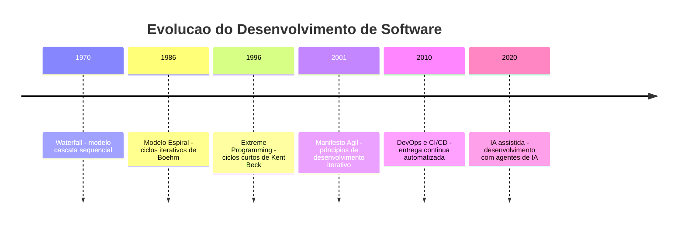
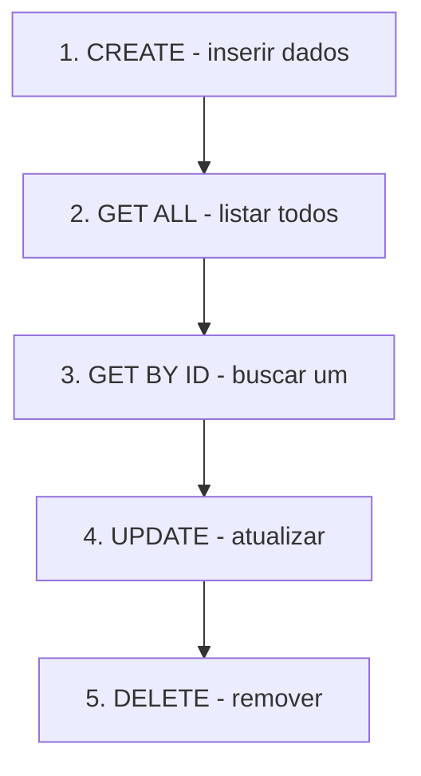
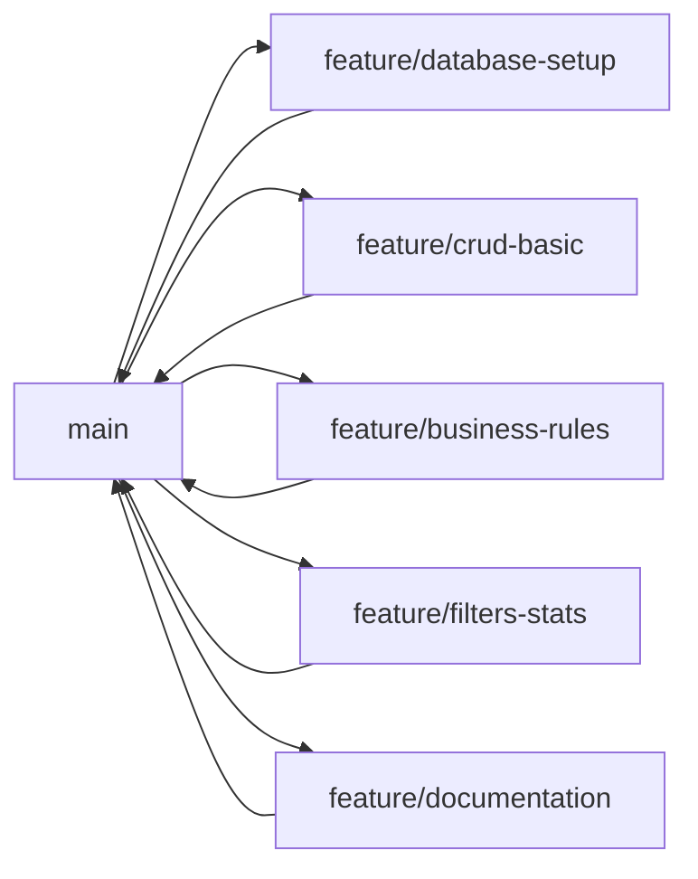

# 13.3 — Desenvolvimento Incremental

[← Anterior: Modelagem e Arquitetura do Projeto](cap13-mod02-modelagem-arquitetura.md) · [Próximo: Documentação Técnica →](cap13-mod04-documentação.md)

---

## Introdução

Nos dois módulos anteriores, você definiu o problema, delimitou o escopo, modelou os dados e projetou a arquitetura do seu TCC. Agora começa a parte que todo programador espera: escrever código.

Mas existe uma forma certa é uma forma errada de fazer isso. A forma errada e tentar construir tudo de uma vez — abrir o editor e escrever centenas de linhas de código sem parar, sem testar, sem commitar. O resultado quase sempre é um monte de código que não funciona e que você não sabe onde esta o erro.

A forma certa e o desenvolvimento incremental: construir em etapas pequenas, testar cada etapa antes de seguir para a próxima, e commitar o código funcionando a cada passo. Você já fez isso nos projetos dos capítulos 8 e 11 — agora vai aplicar no seu próprio projeto, com autonomia total.

Este módulo não vai te dar código pronto para copiar. Vai te ensinar o processo de desenvolvimento que programadores profissionais usam todos os dias. O código e seu — as decisões são suas. O que você vai aprender aqui é como organizar o trabalho para chegar ao resultado.

---

## O que é Desenvolvimento Incremental?

Desenvolvimento incremental significa construir o software em pedacos pequenos e funcionais. Cada pedaco adiciona algo ao sistema, e ao final de cada pedaco você tem um sistema que funciona — mesmo que incompleto.

A alternativa seria o desenvolvimento "big bang": planejar tudo, escrever tudo, e só testar no final. Esse modelo foi usado por decadas na indústria de software e tem um nome formal: modelo Waterfall (cascata). O problema e que ele quase nunca funciona para software, porque:

1. Você só descobre erros no final, quando é mais caro corrigi-los
2. Requisitos mudam durante o desenvolvimento
3. E impossível prever todos os problemas antecipadamente
4. A motivação cai quando você trabalha semanas sem ver resultado

### A História do Desenvolvimento Incremental

Nos anos 1960 e 1970, software era desenvolvido como engenharia civil: primeiro o projeto completo, depois a construção, depois os testes. Esse modelo funcionava para pontes e predios, mas falhava para software porque software é muito mais flexível e mutavel.

Nos anos 1980, pesquisadores como Barry Boehm propuseram o modelo espiral — uma abordagem iterativa onde o software e construido em ciclos. Cada ciclo adiciona funcionalidade e reduz riscos.

Nos anos 1990, Kent Beck criou o Extreme Programming (XP), que levou a ideia ao extremo: ciclos curtissimos, testes antes do código, feedback constante. Em 2001, um grupo de desenvolvedores publicou o Manifesto Ágil, consolidando esses princípios.

Hoje, praticamente toda empresa de tecnologia usa alguma forma de desenvolvimento incremental. O nome muda — Scrum, Kanban, XP, Lean — mas o princípio e o mesmo: construir pouco, testar, ajustar, repetir.



### Por que Funciona?

O desenvolvimento incremental funciona por razoes psicologicas e técnicas:

**Razoes técnicas:**
- Erros são encontrados cedo, quando são baratos de corrigir
- Cada etapa e pequena o suficiente para caber na sua cabeça
- O sistema sempre funciona (mesmo que incompleto)
- Você pode mudar de direção sem perder tudo

**Razoes psicologicas:**
- Você ve progresso real a cada etapa (motivação)
- Cada commit é uma "vitoria" pequena
- O medo de "quebrar tudo" diminui (você pode voltar atrás com Git)
- A sensacao de controle aumenta

---

## As 5 Etapas do Seu TCC

No módulo 12.1, você definiu etapas de desenvolvimento. Agora vamos detalhar cada uma com o processo exato que você deve seguir.

### Etapa 1: Banco de Dados e Modelos

**Objetivo:** Criar o banco de dados e os modelos de dados. Ao final desta etapa, o banco existe com as tabelas corretas e você tem classes/modelos que representam os dados.

**O que fazer:**

1. Criar o arquivo `database.py` com a função de inicialização do banco
2. Escrever o SQL de criação das tabelas (você já fez isso no módulo 12.2)
3. Criar os modelos de dados (Pydantic para FastAPI, classes para C#, dicionários para CLI)
4. Testar: executar o script e verificar que o banco foi criado
5. Testar: verificar que as tabelas existem com os campos corretos

**Como testar:**

```bash
# Executar o script de criacao do banco
python3 database.py

# Verificar que o arquivo do banco foi criado
ls -la projeto.db

# Verificar as tabelas (usando sqlite3 no terminal)
sqlite3 projeto.db ".tables"

# Verificar a estrutura de uma tabela
sqlite3 projeto.db ".schema transactions"
```

Saída esperada:
```
categories   transactions
```

```
CREATE TABLE transactions (
    id INTEGER PRIMARY KEY AUTOINCREMENT,
    description TEXT NOT NULL,
    ...
);
```

**Commit ao finalizar:**
```bash
git add .
git commit -m "feat(database): add database setup and models"
```

**Checkpoint:** o banco existe, as tabelas estão corretas, os modelos estão definidos. O sistema ainda não faz nada útil — e isso é normal. Você construiu a fundacao.

---

### Etapa 2: CRUD Básico

**Objetivo:** Implementar as operações básicas de criar, listar, buscar, editar e remover para a entidade principal. Ao final desta etapa, você consegue manipular dados pelo terminal (curl para API) ou pelo menu (CLI).

**O que fazer:**

1. Criar o repositório da entidade principal (queries SQL)
2. Criar o serviço (por enquanto, apenas repassa para o repositório)
3. Criar o controller/router (endpoints para API) ou menu (para CLI)
4. Testar cada operação individualmente
5. Repetir para a segunda entidade

**Ordem de implementação recomendada:**



Essa ordem faz sentido porque:
- Você precisa criar dados antes de listar
- Você precisa listar para saber os IDs
- Você precisa de IDs para buscar, atualizar e remover

**Como testar (exemplo com FastAPI):**

```bash
# 1. Criar uma categoria
curl -X POST http://localhost:8000/categories \
  -H "Content-Type: application/json" \
  -d '{"name": "Alimentacao", "description": "Gastos com comida"}'
# Esperado: {"id": 1, "name": "Alimentacao", ...}

# 2. Listar categorias
curl http://localhost:8000/categories
# Esperado: [{"id": 1, "name": "Alimentacao", ...}]

# 3. Criar uma transacao
curl -X POST http://localhost:8000/transactions \
  -H "Content-Type: application/json" \
  -d '{"description": "Almoco", "amount": 25.50, "type": "expense", "category_id": 1, "date": "2026-04-28"}'
# Esperado: {"id": 1, "description": "Almoco", ...}

# 4. Listar transacoes
curl http://localhost:8000/transactions
# Esperado: [{"id": 1, "description": "Almoco", ...}]

# 5. Buscar por ID
curl http://localhost:8000/transactions/1
# Esperado: {"id": 1, "description": "Almoco", ...}

# 6. Atualizar
curl -X PUT http://localhost:8000/transactions/1 \
  -H "Content-Type: application/json" \
  -d '{"description": "Almoco no restaurante", "amount": 32.00, "type": "expense", "category_id": 1, "date": "2026-04-28"}'
# Esperado: {"id": 1, "description": "Almoco no restaurante", ...}

# 7. Remover
curl -X DELETE http://localhost:8000/transactions/1
# Esperado: {"message": "Transaction deleted"}
```

**Commit ao finalizar:**
```bash
git add .
git commit -m "feat(crud): add basic CRUD operations for transactions and categories"
```

**Checkpoint:** você consegue criar, listar, buscar, editar e remover dados. O sistema já é funcional — simples, mas funcional. Se você parasse aqui, já teria algo para mostrar.

---

### Etapa 3: Regras de Negócio

**Objetivo:** Adicionar validações e regras que tornam o sistema robusto. Ao final desta etapa, o sistema rejeita dados invalidos e trata erros de forma consistente.

**O que fazer:**

1. Adicionar validações no serviço (não no repositório, não no controller)
2. Implementar tratamento de erros consistente
3. Testar cenários de erro (dados invalidos, registros inexistentes, violacoes de regra)

**Regras típicas que todo projeto precisa:**

| Regra | Onde implementar | Exemplo |
|-------|-----------------|---------|
| Campos obrigatórios | Model (Pydantic) | Nome não pode ser vazio |
| Valores validos | Model + Service | Preço deve ser positivo |
| Unicidade | Service + Repository | Nome da categoria deve ser único |
| Integridade referencial | Service | Categoria deve existir ao criar transação |
| Restrições de remoção | Service | Não remover categoria com transações |
| Formato de dados | Model | Data deve estar no formato YYYY-MM-DD |

**Como testar cenários de erro:**

```bash
# Criar transacao com categoria inexistente
curl -X POST http://localhost:8000/transactions \
  -H "Content-Type: application/json" \
  -d '{"description": "Teste", "amount": 10, "type": "expense", "category_id": 999, "date": "2026-04-28"}'
# Esperado: HTTP 400 — {"detail": "Category not found"}

# Criar transacao com valor negativo
curl -X POST http://localhost:8000/transactions \
  -H "Content-Type: application/json" \
  -d '{"description": "Teste", "amount": -10, "type": "expense", "category_id": 1, "date": "2026-04-28"}'
# Esperado: HTTP 422 — erro de validacao

# Remover categoria que tem transacoes
curl -X DELETE http://localhost:8000/categories/1
# Esperado: HTTP 409 — {"detail": "Category has transactions and cannot be deleted"}

# Buscar transacao inexistente
curl http://localhost:8000/transactions/999
# Esperado: HTTP 404 — {"detail": "Transaction not found"}
```

**Padrão de tratamento de erros:**

Defina um padrão consistente para erros. Para APIs REST:

| Situação | Status HTTP | Mensagem |
|----------|------------|---------|
| Dados invalidos (formato) | 422 | Detalhes da validação |
| Dados invalidos (regra de negócio) | 400 | Descrição do problema |
| Registro não encontrado | 404 | "{Entity} not found" |
| Conflito (duplicata, dependência) | 409 | Descrição do conflito |
| Erro interno | 500 | "Internal server error" |

**Commit ao finalizar:**
```bash
git add .
git commit -m "feat(validation): add business rules and error handling"
```

**Checkpoint:** o sistema rejeita dados invalidos, trata erros de forma clara e consistente. Isso é o que separa um projeto amador de um projeto profissional.

---

### Etapa 4: Funcionalidades Extras

**Objetivo:** Adicionar funcionalidades que melhoram a experiência: filtros, busca, paginação, estatisticas. Ao final desta etapa, o sistema e completo e útil.

**O que fazer (escolha as que fazem sentido para o seu projeto):**

1. Paginação (skip/limit para listas grandes)
2. Filtros (por categoria, por data, por tipo)
3. Busca por texto (parcial, case-insensitive)
4. Estatisticas e resumos (totais, medias, agrupamentos)
5. Ordenação (por data, por valor, por nome)

**Exemplo: Implementando filtros**

Para o FinControl, filtros úteis seriam:

```bash
# Filtrar transacoes por tipo
curl "http://localhost:8000/transactions?type=expense"

# Filtrar por categoria
curl "http://localhost:8000/transactions?category_id=1"

# Filtrar por periodo
curl "http://localhost:8000/transactions?date_from=2026-04-01&date_to=2026-04-30"

# Combinar filtros
curl "http://localhost:8000/transactions?type=expense&category_id=1&date_from=2026-04-01"
```

**Exemplo: Implementando estatisticas**

```bash
# Saldo geral
curl http://localhost:8000/transactions/balance
# Esperado: {"income": 5000.00, "expense": 3200.00, "balance": 1800.00}

# Resumo por categoria
curl http://localhost:8000/transactions/summary
# Esperado: [{"category": "Alimentacao", "total": 800.00, "count": 15}, ...]
```

**Commit ao finalizar cada funcionalidade:**
```bash
git add .
git commit -m "feat(filters): add date and category filters for transactions"
git add .
git commit -m "feat(stats): add balance and category summary endpoints"
```

**Checkpoint:** o sistema está completo. Todas as funcionalidades essenciais e importantes estão implementadas. O sistema e útil e demonstra competência técnica.

---

### Etapa 5: Polimento e Entrega

**Objetivo:** Preparar o projeto para entrega. Código limpo, documentação completa, tudo funcionando.

**O que fazer:**

1. Revisar o código: remover prints de debug, organizar imports, adicionar comentários
2. Testar tudo do início ao fim (criar banco novo, popular, testar todas as operações)
3. Atualizar o README.md com instruções de instalação e uso
4. Verificar que o projeto roda em uma máquina limpa (sem dependências escondidas)
5. Fazer o commit final e tag de versão

**Commit final:**
```bash
git add .
git commit -m "chore: final cleanup and documentation"
git tag -a v1.0.0 -m "TCC v1.0.0 - first release"
```

**Checkpoint:** o projeto está pronto para entrega. Qualquer pessoa pode clonar o repositório, seguir as instruções do README e rodar o sistema.

---

## Testando o Projeto

### Por que Testar?

Testar não é opcional — e parte do desenvolvimento. Código não testado e código que você não sabe se funciona. E a diferença entre "eu acho que funciona" e "eu sei que funciona".

### Teste Manual Estruturado

Para o TCC, testes manuais são suficientes. Mas "teste manual" não significa "clicar aleatoriamente e ver se funciona". Significa seguir um roteiro:

**Roteiro de teste para CRUD:**

```
1. CRIAR
   - Criar registro com dados validos → deve retornar 201 com dados
   - Criar registro com campo obrigatorio faltando → deve retornar 422
   - Criar registro com valor invalido → deve retornar 400 ou 422
   - Criar registro duplicado (se aplicavel) → deve retornar 409

2. LISTAR
   - Listar quando nao tem registros → deve retornar lista vazia []
   - Listar apos criar registros → deve retornar todos
   - Listar com filtros → deve retornar apenas os filtrados
   - Listar com paginacao → deve retornar a pagina correta

3. BUSCAR POR ID
   - Buscar ID existente → deve retornar o registro
   - Buscar ID inexistente → deve retornar 404

4. ATUALIZAR
   - Atualizar com dados validos → deve retornar registro atualizado
   - Atualizar ID inexistente → deve retornar 404
   - Atualizar com dados invalidos → deve retornar 400 ou 422

5. REMOVER
   - Remover ID existente → deve retornar sucesso
   - Remover ID inexistente → deve retornar 404
   - Remover com dependencias (se aplicavel) → deve retornar 409
   - Verificar que o registro nao aparece mais na listagem
```

### Teste de Integração Simples

Além de testar cada operação isoladamente, teste o fluxo completo:

1. Criar categoria "Alimentacao"
2. Criar transação na categoria "Alimentacao"
3. Listar transações — deve aparecer
4. Filtrar por categoria — deve aparecer
5. Atualizar a transação
6. Verificar que a atualização persistiu
7. Tentar remover a categoria — deve falhar (tem transações)
8. Remover a transação
9. Remover a categoria — agora deve funcionar
10. Listar tudo — deve estar vazio

Se esse fluxo funciona do início ao fim, o sistema esta integro.

### Teste de Persistência

Um teste que muitos esquecem: os dados sobrevivem a reinicializacao?

1. Criar alguns registros
2. Parar o servidor (Ctrl+C)
3. Reiniciar o servidor
4. Listar registros — devem estar lá

Se os dados sumiram, o banco não esta sendo persistido corretamente.

### Documentando os Testes

Crie um arquivo `tests.md` ou uma seção no README com os testes que você executou:

```markdown
## Testes Realizados

### CRUD de Categorias
- [x] Criar categoria com dados validos (201)
- [x] Criar categoria com nome duplicado (409)
- [x] Listar categorias (200)
- [x] Buscar categoria por ID (200)
- [x] Buscar categoria inexistente (404)
- [x] Remover categoria sem transacoes (200)
- [x] Remover categoria com transacoes (409)

### CRUD de Transacoes
- [x] Criar transacao com dados validos (201)
- [x] Criar transacao com categoria inexistente (400)
- [x] Criar transacao com valor negativo (422)
- [x] Listar transacoes (200)
- [x] Filtrar por tipo (200)
- [x] Filtrar por categoria (200)
- [x] Buscar por ID (200)
- [x] Atualizar transacao (200)
- [x] Remover transacao (200)

### Persistencia
- [x] Dados sobrevivem a reinicializacao do servidor
```

Isso mostra para o avaliador que você testou sistematicamente, não aleatoriamente.

---

## Boas Práticas Durante o Desenvolvimento

### 1. Commits Frequentes

Faça commits pequenos e frequentes. Cada commit deve representar uma mudança lógica e completa:

| Bom commit | Commit ruim |
|-----------|------------|
| `feat(crud): add create transaction endpoint` | `update` |
| `fix(validation): reject negative amounts` | `fix bug` |
| `refactor(repository): extract SQL to constants` | `changes` |
| `docs(readme): add installation instructions` | `wip` |

A regra prática: se você não consegue descrever o commit em uma frase curta, ele provavelmente faz coisas demais. Divida em commits menores.

### 2. Teste Antes de Commitar

Nunca commite código que você não testou. Antes de cada commit:

1. Execute o sistema
2. Teste a funcionalidade que você acabou de implementar
3. Teste rapidamente as funcionalidades anteriores (para garantir que não quebrou nada)
4. Só então faça o commit

### 3. Um Problema de Cada Vez

Quando encontrar um bug ou quiser adicionar algo, resista a tentacao de resolver tudo ao mesmo tempo. Termine o que está fazendo, commite, e só então comece a próxima tarefa.

Isso evita a situação temida de "eu estava arrumando X, ai vi que Y também precisava mudar, ai mexi em Z, e agora nada funciona e eu não sei o que quebrou".

### 4. Use Branches para Experimentos

Se você quer tentar algo arriscado (mudar a estrutura do banco, refatorar uma camada inteira), crie uma branch:

```bash
# Criar branch para experimento
git checkout -b experiment/new-database-structure

# Trabalhar na branch...
# Se funcionou:
git checkout main
git merge experiment/new-database-structure
git branch -d experiment/new-database-structure

# Se nao funcionou:
git checkout main
git branch -D experiment/new-database-structure
# Pronto — nada foi perdido
```

### 5. Não Tenha Medo de Errar

Erros são parte do processo. Todo programador profissional comete erros todos os dias. A diferença e que programadores experientes:

- Encontram erros mais rápido (porque testam frequentemente)
- Corrigem erros mais facilmente (porque commits são pequenos)
- Aprendem com os erros (porque documentam o que deu errado)

Se algo der errado, respire, leia a mensagem de erro com calma, e investigue. A maioria dos erros tem soluções simples.

---

## Debugging: Encontrando e Corrigindo Erros

Você aprendeu debugging no capítulo 5 (módulo 5.14). Agora vai aplicar em um projeto maior. As técnicas são as mesmas, mas o contexto é mais complexo.

### Erros Comuns por Etapa

**Etapa 1 (Banco de dados):**

| Erro | Causa provável | Solução |
|------|---------------|---------|
| `no such table: X` | Tabela não foi criada | Verificar SQL de criação, deletar banco e recriar |
| `UNIQUE constraint failed` | Tentando inserir valor duplicado | Verificar se o campo tem UNIQUE e o valor já existe |
| `NOT NULL constraint failed` | Campo obrigatório sem valor | Verificar se todos os campos NOT NULL estão preenchidos |
| `FOREIGN KEY constraint failed` | Referenciando registro inexistente | Verificar se o registro referenciado existe |

**Etapa 2 (CRUD):**

| Erro | Causa provável | Solução |
|------|---------------|---------|
| `422 Unprocessable Entity` | JSON inválido ou campo faltando | Verificar o body da requisição |
| `500 Internal Server Error` | Erro no código Python | Verificar o terminal do servidor para ver o traceback |
| Dados não aparecem na listagem | Query SQL errada | Testar a query diretamente no sqlite3 |
| Update não funciona | WHERE clause errada | Verificar se o ID está correto na query |

**Etapa 3 (Regras de negócio):**

| Erro | Causa provável | Solução |
|------|---------------|---------|
| Validação não funciona | Regra no lugar errado (controller em vez de service) | Mover validação para o service |
| Erro 500 em vez de 400 | Exceção não tratada | Adicionar try/except no service |
| Mensagem de erro genérica | Não esta retornando HTTPException com detail | Usar HTTPException com mensagem específica |

### A Técnica do "Print Estrategico"

Quando algo não funciona e você não sabe por que, adicione prints nos pontos-chave:

```python
# Exemplo: debugando por que uma transacao nao e criada

def create_transaction(self, data):
    print(f"DEBUG: Recebido data = {data}")  # O que chegou?
    
    category = self.category_repo.get_by_id(data.category_id)
    print(f"DEBUG: Categoria encontrada = {category}")  # Existe?
    
    if not category:
        print(f"DEBUG: Categoria {data.category_id} nao existe")
        raise HTTPException(status_code=400, detail="Category not found")
    
    result = self.transaction_repo.create(data)
    print(f"DEBUG: Resultado do insert = {result}")  # Funcionou?
    
    return result
```

Saída esperada (no terminal do servidor):
```
DEBUG: Recebido data = TransactionCreate(description='Almoco', amount=25.5, ...)
DEBUG: Categoria encontrada = {'id': 1, 'name': 'Alimentacao', ...}
DEBUG: Resultado do insert = {'id': 1, 'description': 'Almoco', ...}
```

Depois de encontrar e corrigir o problema, remova os prints de debug. Código de produção não deve ter prints de debug.

---

## Gerenciando o Tempo

### O Problema da Procrastinacao

Projetos grandes sofrem de um problema psicologico: parecem tão grandes que você não sabe por onde começar, então não começa. Isso tem nome — paralisia por análise.

A solução e o desenvolvimento incremental que estamos ensinando. Em vez de pensar "preciso construir um sistema inteiro", pense "preciso criar a tabela de categorias". Essa tarefa e pequena, concreta e factivel. Quando terminar, pense na próxima tarefa pequena.

### A Técnica Pomodoro

Uma técnica simples que funciona bem para programação:

1. Escolha uma tarefa específica ("implementar endpoint POST /transactions")
2. Trabalhe focado por 25 minutos (sem celular, sem redes sociais)
3. Faça uma pausa de 5 minutos
4. Repita
5. A cada 4 ciclos, faça uma pausa maior (15-30 minutos)

25 minutos parece pouco, mas e impressionante quanto você consegue fazer quando esta 100% focado.

### Quando Pedir Ajuda

Existe uma regra prática na indústria chamada "regra dos 15 minutos":

- Se você esta travado em um problema há mais de 15 minutos sem progresso, peça ajuda
- "Ajuda" pode ser: pesquisar no Google, perguntar para a IA, perguntar para um colega
- Não é fraqueza pedir ajuda — e eficiência

Programadores profissionais pedem ajuda o tempo todo. A diferença e que eles sabem descrever o problema com clareza: "Estou tentando fazer X, esperava Y, mas esta acontecendo Z. Já tentei A e B."

---

## Versionamento Durante o Desenvolvimento

### Estratégia de Branches para o TCC

Para o TCC, uma estratégia simples funciona bem:



Cada etapa é uma feature branch. Ao terminar a etapa, merge na main. Isso mantém a main sempre funcionando.

### Histórico de Commits Ideal

Um bom histórico de commits conta a história do projeto:

```
feat(database): add database setup and table creation
feat(models): add Pydantic models for transactions and categories
feat(repository): add category repository with CRUD operations
feat(repository): add transaction repository with CRUD operations
feat(service): add category service
feat(service): add transaction service
feat(router): add category endpoints
feat(router): add transaction endpoints
feat(validation): add business rules for transaction creation
feat(validation): add category deletion protection
fix(repository): fix date format in transaction queries
feat(filters): add date range filter for transactions
feat(filters): add category and type filters
feat(stats): add balance endpoint
feat(stats): add category summary endpoint
docs(readme): add installation and usage instructions
chore: final cleanup and code comments
```

Cada linha conta o que foi feito. Qualquer pessoa que leia esse histórico entende como o projeto foi construido.

---

## Como a IA pode te ajudar aqui

**Prompt 1 — Entender erros comuns:**
> "Estou recebendo este erro ao tentar inserir no banco: [erro]. O que pode estar causando?"

**Prompt 2 — Criar com ajuda da IA:**
> "Implementei o endpoint de listagem mas os filtros não estão funcionando. Aqui esta meu código: [código]. O que está errado?"

**Prompt 3 — Ver exemplos práticos:**
> "Quero adicionar paginação na listagem de transações. Como faco isso com FastAPI e SQLite? Me mostre um exemplo simples."

---

## Casos de Uso no Mundo Real

### Caso 1: Sprints no Spotify

No Spotify, o desenvolvimento e organizado em sprints de 2 semanas. Cada sprint tem um objetivo claro ("implementar busca por podcast") e ao final da sprint o time entrega algo funcional. Se não conseguiram terminar tudo, o que ficou vai para a próxima sprint. O desenvolvimento incremental que você esta praticando no TCC segue o mesmo princípio — etapas com objetivos claros e entregas funcionais.

### Caso 2: Feature Flags na Netflix

A Netflix usa uma técnica chamada "feature flags" — funcionalidades novas são desenvolvidas incrementalmente e ficam "escondidas" atrás de uma flag. Quando a funcionalidade está pronta e testada, a flag e ativada e os usuários começam a ver. Isso permite desenvolvimento incremental sem afetar usuários. No seu TCC, cada etapa e como uma "feature flag" — você adiciona funcionalidade sem quebrar o que já funciona.

### Caso 3: Commits Atomicos no Linux Kernel

O kernel do Linux é um dos maiores projetos de software do mundo, com milhoes de linhas de código. Linus Torvalds (criador do Linux e do Git) insiste em commits atomicos — cada commit faz uma única coisa e pode ser revertido independentemente. Essa disciplina permite que milhares de desenvolvedores trabalhem no mesmo projeto sem caos. A prática de commits pequenos e frequentes que você esta aprendendo vem diretamente dessa filosofia.

---

## Resumo do Módulo

| Conceito | Definição |
|----------|-----------|
| Desenvolvimento incremental | Construir software em etapas pequenas e funcionais |
| Waterfall | Modelo sequencial onde tudo é planejado antes de construir |
| Manifesto Ágil | Conjunto de princípios que priorizam entrega iterativa |
| Sprint | Ciclo curto de desenvolvimento com objetivo definido |
| Commit atomico | Commit que faz uma única mudança lógica e completa |
| Feature branch | Branch criada para desenvolver uma funcionalidade específica |
| Checkpoint | Ponto onde o sistema funciona e pode ser demonstrado |
| Debugging | Processo de encontrar e corrigir erros no código |
| Pomodoro | Técnica de gestao de tempo com ciclos de 25 minutos |
| Feature flag | Mecanismo para esconder funcionalidades em desenvolvimento |

---

## Glossário do Módulo

| Termo | Definição |
|-------|-----------|
| Agile | Metodologia de desenvolvimento iterativo e incremental |
| Branch | Ramificacao do código para desenvolvimento paralelo |
| Checkpoint | Ponto de verificação onde o sistema esta funcional |
| CI/CD | Continuous Integration/Continuous Delivery — integração e entrega continuas |
| Commit | Registro de uma alteração no histórico do Git |
| CRUD | Create, Read, Update, Delete — operações básicas de dados |
| Debug | Processo de encontrar e corrigir erros |
| DevOps | Cultura que integra desenvolvimento e operações |
| Feature branch | Branch dedicada a uma funcionalidade específica |
| Feature flag | Mecanismo para ativar/desativar funcionalidades |
| HTTPException | Exceção do FastAPI que retorna erro HTTP com mensagem |
| Kanban | Metodologia ágil baseada em quadro visual de tarefas |
| Merge | Unir alterações de uma branch em outra |
| MVP | Minimum Viable Product — produto mínimo viavel |
| Pomodoro | Técnica de produtividade com ciclos de 25 minutos |
| Scrum | Metodologia ágil com sprints e papeis definidos |
| Sprint | Ciclo de desenvolvimento de duracao fixa |
| Tag | Marcacao de versão no Git |
| Traceback | Rastro de erro que mostra onde o problema ocorreu |
| Waterfall | Modelo de desenvolvimento sequencial |
| XP | Extreme Programming — metodologia ágil de Kent Beck |

---

## Na Cultura Popular

- **The Martian** (filme, 2015) — Mark Watney, preso em Marte, precisa resolver problemas um de cada vez para sobreviver. Ele não tenta resolver tudo ao mesmo tempo — prioriza, executa, testa e segue para o próximo problema. E desenvolvimento incremental na forma mais pura: "vou resolver o problema de hoje, e amanha resolvo o de amanha."

- **Jiro Dreams of Sushi** (documentario, 2011) — Jiro Ono, considerado o melhor sushiman do mundo, passou decadas aperfeicoando cada etapa do processo de fazer sushi. Ele não tentou dominar tudo de uma vez — começou pelo arroz, depois o peixe, depois o corte. Cada etapa foi praticada até a perfeicao antes de seguir para a próxima. O desenvolvimento incremental segue a mesma filosofia.

---

## Para Saber Mais

- [Conventional Commits](https://www.conventionalcommits.org/pt-br/) — *Padrão de mensagens de commit que você deve usar no TCC (em portugues)*
- [Pro Git Book](https://git-scm.com/book/pt-br/v2) — *Livro oficial do Git, gratuito e em portugues — revise branches e merges*
- [Learn Git Branching](https://learngitbranching.js.org/?locale=pt_BR) — *Tutorial visual e interativo sobre branches em Git*
- [FastAPI Documentation](https://fastapi.tiangolo.com/) — *Documentação oficial do FastAPI com exemplos para consultar durante o desenvolvimento*

---

## Perguntas Frequentes (FAQ)

**P: Posso pular etapas se já sei o que fazer?**
R: Não recomendamos. Mesmo que você saiba implementar tudo, seguir as etapas garante que você testa cada parte e commita incrementalmente. Pular etapas e a receita para bugs dificeis de encontrar.

**P: E se eu travar em uma etapa e não conseguir avancar?**
R: Use a regra dos 15 minutos. Se não conseguir resolver sozinho, peça ajuda (IA, colegas, forums). Descreva o problema com clareza: o que você tentou, o que esperava e o que aconteceu.

**P: Quantos commits devo fazer por etapa?**
R: Não existe número magico. A regra e: um commit por mudança lógica completa. Uma etapa pode ter 3 commits ou 15 — depende da complexidade. O importante e que cada commit faça sentido sozinho.

**P: Posso refatorar código entre etapas?**
R: Sim, e recomendado. Se ao começar a etapa 3 você percebe que o código da etapa 2 poderia ser melhor, refatore. Commite a refatoração separadamente: `refactor(repository): extract common query logic`.

**P: E se eu descobrir que o modelo de dados está errado?**
R: Corrija o mais cedo possível. Delete o banco, ajuste o SQL, recrie. Quanto mais código depende do modelo errado, mais caro e a correção. Por isso investimos tempo na modelagem (módulo 12.2).

**P: Preciso testar manualmente toda vez?**
R: Para o TCC, testes manuais são suficientes. Testes automatizados (pytest, unittest) são um diferencial, mas não são obrigatórios. Se você quiser adicionar, faça na etapa 5.

**P: Como sei que uma etapa esta "pronta"?**
R: Quando você consegue demonstrar a funcionalidade para alguém. Se você pode mostrar "olha, eu crio uma transação aqui é ela aparece na listagem", a etapa está pronta.

**P: É normal o desenvolvimento demorar mais do que eu planejei?**
R: Sim, completamente normal. A regra do "multiplique por 2" existe por um motivo. Não se frustre — ajuste o plano e siga em frente.

---

## Exercícios Práticos

### Exercício 1: Implemente a Etapa 1

1. Crie o arquivo `database.py` com a inicialização do banco
2. Crie os modelos de dados
3. Execute e verifique que o banco foi criado corretamente
4. Commit: `feat(database): add database setup and models`

### Exercício 2: Implemente a Etapa 2

1. Implemente o CRUD completo da entidade principal
2. Teste cada operação (criar, listar, buscar, editar, remover)
3. Implemente o CRUD da segunda entidade
4. Commit: `feat(crud): add basic CRUD operations`

### Exercício 3: Implemente a Etapa 3

1. Adicione pelo menos 3 regras de negócio no serviço
2. Teste cenários de erro (dados invalidos, registros inexistentes)
3. Verifique que as mensagens de erro são claras e consistentes
4. Commit: `feat(validation): add business rules and error handling`

---

[← Anterior: Modelagem e Arquitetura do Projeto](cap13-mod02-modelagem-arquitetura.md) · [Próximo: Documentação Técnica →](cap13-mod04-documentação.md)
