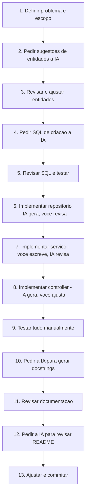
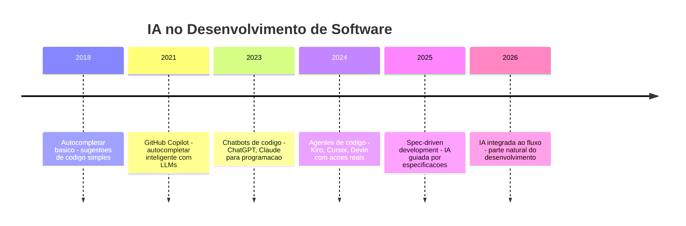

# 13.6 — Usando IA no Desenvolvimento: Do Requisito ao Código

[← Anterior: Apresentação e Defesa do Projeto](cap13-mod05-apresentacao.md) · [Próximo: Projeto Final — TCC →](../projects/projeto-tcc.md)

---

## Introdução

Ao longo de todo o curso, você viu seções "Como a IA pode te ajudar aqui" em cada módulo. Agora, no último módulo do curso, vamos juntar tudo é falar de IA como ferramenta de desenvolvimento de forma completa e honesta.

No capítulo 1 (módulo 1.10), você teve o primeiro contato com IA — o que é, como funciona em alto nível, onde esta presente no dia a dia. No capítulo 5 (módulo 5.18), você aprendeu a usar IA para aprender programação — como fazer perguntas, como interpretar respostas, como não depender cegamente. Agora você vai aprender a usar IA como ferramenta de trabalho no ciclo completo de desenvolvimento: do requisito ao código, passando por modelagem, arquitetura, implementação, testes e documentação.

A mensagem central deste módulo e simples: IA é uma ferramenta poderosa, mas você é o desenvolvedor. A IA não substitui seu conhecimento — ela amplifica. Um desenvolvedor que não sabe programar não vai se tornar bom usando IA. Mas um desenvolvedor que sabe programar pode se tornar muito mais produtivo.

Pense na IA como uma calculadora. Uma calculadora não substitui o conhecimento de matemática — se você não sabe o que calcular, a calculadora não ajuda. Mas se você sabe o que precisa, a calculadora faz o trabalho mecânico muito mais rápido.

---

## O que a IA Faz Bem

Vamos ser pragmaticos. A IA (especificamente, modelos de linguagem como os usados em ferramentas de desenvolvimento) e excelente em certas tarefas e limitada em outras. Saber a diferença é fundamental.

### Tarefas onde a IA Brilha

| Tarefa | Por que a IA e boa nisso | Exemplo |
|--------|-------------------------|---------|
| Gerar código repetitivo | Patterns são previsiveis | CRUD completo, DTOs, configurações |
| Documentação | Texto estruturado e o forte de LLMs | READMEs, docstrings, comentários |
| Explicar código | Análise de texto e padrão | "O que este código faz?" |
| Encontrar erros | Reconhecimento de padrões | "Por que estou recebendo este erro?" |
| Refatoração | Transformação de texto | Renomear, extrair funções, reorganizar |
| Testes | Gerar variantes e cenários | Testes unitarios, dados de teste |
| Brainstorming | Gerar alternativas | "Que funcionalidades um sistema de X poderia ter?" |
| Formatação | Transformação estrutural | Converter JSON para tabela, SQL para diagrama |

### Números Reais de Produtividade

Pesquisas da indústria mostram ganhos significativos em tarefas específicas:

| Tarefa | Tempo sem IA | Tempo com IA | Ganho |
|--------|-------------|-------------|-------|
| Criar modelo Pydantic com 10 campos | 5-10 min | 10-30 seg | 10-20x |
| CRUD completo (controller + service + repo) | 30-60 min | 2-5 min | 10-15x |
| Escrever README completo | 30-60 min | 5-10 min | 5-6x |
| Debugar erro específico | 15-60 min | 2-10 min | 3-6x |
| Escrever testes unitarios | 20-40 min | 3-8 min | 4-5x |
| Entender código desconhecido | 30-120 min | 5-15 min | 5-8x |

Esses números variam muito dependendo da complexidade e do contexto. Mas a tendência e clara: para tarefas repetitivas e estruturadas, a IA economiza tempo significativo.

---

## O que a IA Não Faz Bem

Tão importante quanto saber onde a IA ajuda e saber onde ela falha. Usar IA para tarefas onde ela é fraca gera frustacao e resultados ruins.

### Limitações Reais

| Limitação | Por que acontece | Consequência |
|-----------|-----------------|-------------|
| Decisões de arquitetura | IA não conhece seu contexto de negócio | Pode sugerir arquitetura inadequada |
| Lógica de negócio complexa | Regras específicas do seu domínio | Pode implementar regras erradas |
| Código que precisa de contexto amplo | Janela de contexto e limitada | Pode ignorar dependências |
| Segurança | Não entende ameacas específicas | Pode gerar código vulneravel |
| Performance otimizada | Não conhece seu volume de dados | Pode sugerir soluções ineficientes |
| Criatividade real | Gera baseado em padrões existentes | Não inventa abordagens genuinamente novas |

### O Problema da Alucinacao

LLMs (Large Language Models) as vezes geram informações que parecem corretas mas são inventadas. Isso é chamado de "alucinacao". No contexto de código:

- Pode sugerir funções que não existem em uma biblioteca
- Pode inventar parâmetros de API
- Pode gerar SQL com sintaxe de outro banco de dados
- Pode citar documentação que não existe

**Regra de ouro: sempre verifique o que a IA gera.** Não copie e cole cegamente. Leia, entenda e teste.

### A Metafora do Estagiario Muito Rápido

Uma forma útil de pensar na IA: ela é como um estagiario extremamente rápido, que sabe muito sobre muitos assuntos, mas que não conhece o seu projeto específico. Você precisa:

1. Dar instruções claras (o estagiario não adivinha o que você quer)
2. Revisar o trabalho (o estagiario pode cometer erros)
3. Dar contexto (o estagiario não sabe o histórico do projeto)
4. Ser específico (pedidos vagos geram resultados vagos)

---

## IA no Ciclo de Desenvolvimento

Vamos percorrer cada fase do desenvolvimento de software e ver como a IA pode ajudar em cada uma.

### Fase 1: Planejamento e Requisitos

**Como a IA ajuda:**
- Brainstorming de funcionalidades
- Identificar entidades e relacionamentos
- Sugerir regras de negócio
- Revisar documentos de planejamento

**Exemplo de prompt:**
```
Estou criando um sistema de controle financeiro pessoal.
As entidades principais sao Transaction e Category.

Me ajude a:
1. Listar todas as funcionalidades essenciais
2. Identificar regras de negocio importantes
3. Sugerir campos para cada entidade
4. Apontar relacionamentos entre entidades
```

**O que esperar:** a IA vai gerar uma lista abrangente. Você vai precisar filtrar — nem tudo que ela sugere faz sentido para o seu escopo.

### Fase 2: Modelagem de Dados

**Como a IA ajuda:**
- Gerar SQL de criação de tabelas
- Sugerir índices
- Criar diagramas ER em Mermaid
- Revisar modelos existentes

**Exemplo de prompt:**
```
Tenho estas entidades para um sistema financeiro:

Transaction: id, description, amount, type (income/expense),
category_id, date, created_at
Category: id, name, description, created_at

Gere:
1. SQL de criacao das tabelas para SQLite
2. Indices recomendados
3. Diagrama ER em Mermaid
```

**O que esperar:** SQL funcional e diagrama correto. Revise os tipos de dados e restrições — a IA pode usar tipos de outro banco (VARCHAR em vez de TEXT para SQLite, por exemplo).

### Fase 3: Implementação

**Como a IA ajuda:**
- Gerar código boilerplate (modelos, repositórios, serviços)
- Implementar funções específicas
- Resolver erros
- Sugerir melhorias

**Exemplo de prompt (geração):**
```
Crie o repositorio de transacoes para SQLite em Python.
Use o modulo sqlite3 (stdlib).
O repositorio deve ter: create, get_by_id, get_all,
update, delete.
Siga este padrao: [cole um exemplo de repositorio existente]
```

**Exemplo de prompt (debug):**
```
Estou recebendo este erro ao criar uma transacao:

sqlite3.IntegrityError: FOREIGN KEY constraint failed

O codigo do repositorio e:
[cole o codigo]

O SQL de criacao da tabela e:
[cole o SQL]

O que esta causando o erro e como corrijo?
```

**O que esperar:** para geração, código funcional que precisa de ajustes. Para debug, diagnóstico geralmente correto com solução prática.

### Fase 4: Testes

**Como a IA ajuda:**
- Gerar cenários de teste
- Criar dados de teste realistas
- Identificar casos de borda que você não pensou
- Gerar scripts de teste

**Exemplo de prompt:**
```
Tenho este endpoint POST /transactions que cria uma transacao.
Campos obrigatorios: description, amount (> 0),
type (income/expense), category_id, date.

Gere uma lista de cenarios de teste cobrindo:
- Happy path
- Campos faltando
- Valores invalidos
- Casos de borda
```

**O que esperar:** lista abrangente de cenários. A IA e particularmente boa em pensar em casos de borda que humanos esquecem (strings vazias, valores zero, datas no futuro, caracteres especiais).

### Fase 5: Documentação

**Como a IA ajuda:**
- Gerar README a partir do código
- Criar docstrings para funções
- Gerar dicionário de dados
- Formatar e organizar documentação existente

**Exemplo de prompt:**
```
Gere um README.md completo para meu projeto.

O projeto e uma API REST de controle financeiro com:
- Python 3.10 + FastAPI + SQLite
- Endpoints: [lista]
- Arquitetura em 3 camadas
- Funcionalidades: [lista]

Inclua: descricao, instalacao, uso com exemplos curl,
modelo de dados, arquitetura, decisoes tecnicas.
```

**O que esperar:** README bem estruturado que precisa de ajustes nos detalhes (caminhos de arquivo, nomes exatos de endpoints, dados de exemplo).

---

## Princípios de Comunicação com IA

A qualidade do que você recebe da IA depende diretamente da qualidade do que você envia. Isso não é cliche — e mecânica. O modelo gera a resposta mais provável dado o contexto que recebeu. Contexto vago gera resposta genérica. Contexto preciso gera resposta precisa.

### Princípio 1: Seja Específico

| Pedido vago | Pedido específico |
|------------|------------------|
| "Melhore este código" | "Extraia a lógica de validação para uma função separada e adicione tratamento para campos nulos" |
| "Crie uma API" | "Crie o endpoint GET /transactions que retorna lista paginada com filtros por data e categoria" |
| "Adicione testes" | "Adicione testes para TransactionService.create() cobrindo: transação válida, categoria inexistente, valor negativo" |

### Princípio 2: De Contexto

A IA não conhece seu projeto. Quanto mais contexto relevante você fornecer, melhor o resultado:

- Mostre o código existente ("siga este padrão")
- Explique a arquitetura ("o projeto usa 3 camadas: router, service, repository")
- Mencione restrições ("use apenas sqlite3 da stdlib, sem ORM")
- Diga o que já tentou ("já tentei X mas deu erro Y")

### Princípio 3: Divida Tarefas Complexas

Em vez de pedir "crie o sistema inteiro", divida:

1. "Crie o modelo Pydantic para Transaction"
2. "Crie o repositório de Transaction com CRUD"
3. "Crie o serviço com regras de negócio"
4. "Crie o router com endpoints"

Cada pedido e pequeno, verificavel e corrigivel. Se algo der errado, você sabe exatamente onde.

### Princípio 4: Itere

A primeira resposta da IA raramente e perfeita. Trate como um rascunho:

1. Peça a primeira versão
2. Revise e identifique problemas
3. Peça ajustes específicos
4. Repita até ficar satisfeito

Isso é mais eficiente do que tentar obter a resposta perfeita na primeira tentativa.

### Princípio 5: Verifique Sempre

Nunca confie cegamente no que a IA gera. Sempre:

- Leia o código gerado e entenda cada linha
- Teste o código antes de commitar
- Verifique se funções e bibliotecas mencionadas realmente existem
- Compare com a documentação oficial quando tiver duvida

### Princípio 6: Aprenda com o Código Gerado

Quando a IA gera código, não apenas use — estude. Pergunte-se:

- "Por que ela usou essa abordagem?"
- "Existe uma forma melhor de fazer isso?"
- "Eu conseguiria escrever isso sozinho?"

Se a resposta para a última pergunta e "não", você encontrou uma oportunidade de aprendizado. Pesquise o conceito, entenda a técnica e pratique até conseguir.

---

## Prompts que Funcionam vs Prompts que Não Funcionam

A diferença entre um prompt bom é um ruim pode ser a diferença entre uma resposta útil é uma resposta inutil. Aqui estão exemplos reais:

### Para Geração de Código

| Prompt ruim | Prompt bom | Por que o bom é melhor |
|------------|-----------|----------------------|
| "Crie uma API" | "Crie o endpoint POST /transactions com FastAPI. Recebe TransactionCreate (Pydantic) e retorna TransactionResponse. Use sqlite3 para persistir." | Específica framework, modelo, banco e operação |
| "Faça o banco de dados" | "Crie o SQL de criação para SQLite com tabelas categories e transactions. Categories tem id, name (unique), description. Transactions tem id, description, amount (CHECK > 0), type (CHECK IN income/expense), category_id (FK), date." | Específica banco, tabelas, campos e restrições |
| "Adicione validação" | "No TransactionService.create(), adicione validação: verificar se category_id existe no banco antes de inserir. Se não existir, levantar HTTPException 400 com mensagem 'Category not found'." | Específica onde, o que validar e como tratar o erro |

### Para Debug

| Prompt ruim | Prompt bom | Por que o bom é melhor |
|------------|-----------|----------------------|
| "Não funciona" | "Ao chamar POST /transactions, recebo 500 Internal Server Error. O traceback mostra: sqlite3.OperationalError: no such table: transactions. O database.py esta assim: [código]" | Inclui erro exato, traceback e código relevante |
| "Tem um bug" | "A listagem de transações retorna category_id mas eu preciso do category_name. A query atual e: SELECT * FROM transactions. Como faco JOIN com categories para incluir o nome?" | Descreve o comportamento atual e o desejado |

### Para Documentação

| Prompt ruim | Prompt bom | Por que o bom é melhor |
|------------|-----------|----------------------|
| "Documente o código" | "Adicione docstrings Google style a estas 3 funções do TransactionRepository. Inclua descrição, parâmetros com tipos e retorno. O projeto usa sqlite3 e retorna dicionários." | Específica estilo, escopo e contexto |
| "Faça o README" | "Gere a seção 'Endpoints da API' do README com tabela Markdown. Os endpoints são: POST/GET/PUT/DELETE /transactions e POST/GET/DELETE /categories. Inclua método, URL e descrição curta." | Específica seção, formato e conteúdo |

---

## Armadilhas Comuns ao Usar IA

### Armadilha 1: Copiar sem Entender

O maior risco de usar IA e copiar código que você não entende. Se algo der errado, você não sabe consertar. Se alguém perguntar como funciona, você não sabe explicar.

**Regra:** se você não consegue explicar cada linha do código para outra pessoa, não use esse código.

### Armadilha 2: Pedir Demais de Uma Vez

Pedir "crie o sistema inteiro" gera código longo, difícil de revisar e cheio de suposicoes que podem estar erradas. Divida em pedacos pequenos.

### Armadilha 3: Não Dar Contexto

"Crie um endpoint de listagem" sem dizer qual framework, qual banco, qual padrão de código. A IA vai chutar — e pode chutar errado.

### Armadilha 4: Ignorar Erros da IA

Se a IA gera código com erro, não peça "corrija" sem entender o que está errado. Entenda o erro primeiro, depois peça a correção específica.

### Armadilha 5: Depender da IA para Aprender

IA e ótima para acelerar o trabalho, mas não substitui o aprendizado. Se você usa IA para gerar todo o código sem entender os conceitos, você não esta aprendendo — esta delegando. No TCC, o objetivo e demonstrar que Você aprendeu.

---

## Exemplos Práticos: IA no TCC

Vamos ver exemplos concretos de como usar IA em cada fase do TCC, com prompts reais e o que esperar de cada um.

### Exemplo 1: Brainstorming de Entidades

**Você digita:**
```
Estou criando um sistema de registro de treinos de academia.
O usuario registra exercicios que fez, com series, repeticoes e carga.
Quero poder ver o historico e a evolucao de carga ao longo do tempo.

Quais entidades voce sugere? Para cada uma, liste os campos
com tipos de dados para SQLite.
```

**O que a IA provavelmente retorna:**
- Entidades: Exercise, Workout, WorkoutExercise (tabela de juncao)
- Campos detalhados com tipos
- Possivelmente entidades extras que você não pensou (MuscleGroup, User)

**O que você faz:**
- Avalia se as entidades fazem sentido para o seu escopo
- Remove o que esta fora do MVP (User, se o sistema e individual)
- Ajusta nomes e tipos conforme sua preferência
- Verifica se os relacionamentos estão corretos

### Exemplo 2: Gerando um Repositório

**Você digita:**
```
Crie um repositorio Python para a entidade Exercise usando sqlite3.
O banco e "fittracker.db".
A tabela exercises tem: id (INTEGER PK), name (TEXT NOT NULL),
muscle_group (TEXT NOT NULL), created_at (TEXT DEFAULT now).

Metodos: create, get_by_id, get_all, update, delete.
Siga este padrao:
[cole um exemplo de repositorio que voce ja tem]
```

**O que a IA provavelmente retorna:**
- Classe completa com todos os métodos
- Queries SQL para cada operação
- Tratamento básico de erros

**O que você faz:**
- Le cada método e entende a query SQL
- Verifica se os nomes de campos batem com a tabela
- Testa cada método individualmente
- Ajusta o estilo para ficar consistente com o resto do projeto

### Exemplo 3: Debugando um Erro

**Você digita:**
```
Estou recebendo este erro ao listar exercicios:

TypeError: 'NoneType' object is not subscriptable

O codigo do repositorio e:

def get_all(self):
    cursor = self.conn.execute("SELECT * FROM exercises")
    rows = cursor.fetchall()
    return [{"id": row[0], "name": row[1]} for row in rows]

O que esta causando o erro?
```

**O que a IA provavelmente retorna:**
- Diagnóstico: `fetchall()` esta retornando None ou a conexão esta fechada
- Sugestões: verificar se a tabela existe, se a conexão esta aberta
- Código corrigido com verificação

**O que você faz:**
- Verifica se o diagnóstico faz sentido
- Testa a sugestão
- Se não resolver, fornece mais contexto e pede novamente

### Exemplo 4: Melhorando Documentação

**Você digita:**
```
Adicione docstrings a estas funcoes seguindo o padrao Google style.
Inclua descricao, parametros e retorno.

def create(self, data):
    query = "INSERT INTO exercises (name, muscle_group) VALUES (?, ?)"
    cursor = self.conn.execute(query, (data.name, data.muscle_group))
    self.conn.commit()
    return self.get_by_id(cursor.lastrowid)

def get_by_id(self, exercise_id):
    cursor = self.conn.execute(
        "SELECT * FROM exercises WHERE id = ?", (exercise_id,)
    )
    row = cursor.fetchone()
    if not row:
        return None
    return {"id": row[0], "name": row[1], "muscle_group": row[2]}
```

**O que a IA provavelmente retorna:**
- Docstrings completas com descrição, Args e Returns
- Possivelmente sugestões de melhoria no código

**O que você faz:**
- Verifica se as descricoes estão corretas
- Ajusta o tom e o nível de detalhe
- Garante consistência com o resto do projeto

---

## Workflow Completo: Do Requisito ao Código com IA

Aqui esta um fluxo de trabalho completo mostrando como integrar IA no desenvolvimento do TCC:



Perceba o padrão: a IA gera, você revisa. A IA sugere, você decide. A IA acelera, você direciona. Em nenhum momento a IA toma decisões por você.

### Quanto Tempo a IA Economiza no TCC?

Estimativa realista para um TCC com FastAPI + SQLite:

| Fase | Sem IA | Com IA | Economia |
|------|--------|--------|----------|
| Planejamento | 4h | 2-3h | 25-50% |
| Modelagem | 4h | 2h | 50% |
| CRUD básico | 8h | 3-4h | 50-60% |
| Regras de negócio | 6h | 4h | 30% |
| Funcionalidades extras | 8h | 4-5h | 40% |
| Documentação | 4h | 1-2h | 50-75% |
| Total | 34h | 16-20h | 40-50% |

A economia e real, mas note: você ainda precisa de 16-20 horas. A IA não faz o trabalho por você — ela acelera as partes mecanicas para que você foque nas decisões.

---

## IA e Ética no Desenvolvimento

### Credito e Autoria

Se você usa IA para gerar partes do código, seja transparente. No contexto do TCC:

- Você pode usar IA como ferramenta (assim como usa Google, Stack Overflow, documentação)
- Você deve entender tudo que está no seu projeto
- Você deve ser capaz de explicar qualquer parte do código
- Se perguntado, diga honestamente: "usei IA para gerar o boilerplate do repositório e depois ajustei"

### Código Gerado vs Código Entendido

A diferença entre um desenvolvedor que usa IA bem é um que usa mal:

| Usa IA bem | Usa IA mal |
|-----------|-----------|
| Pede código, le, entende, ajusta | Copia e cola sem ler |
| Sabe explicar cada linha | "A IA fez, não sei como funciona" |
| Usa IA para acelerar, não para substituir | Depende da IA para tudo |
| Verifica e testa o resultado | Assume que está correto |
| Aprende com o código gerado | Não aprende nada |

### O Futuro do Desenvolvimento com IA

A IA não vai substituir desenvolvedores — vai mudar o que desenvolvedores fazem. Em vez de escrever código repetitivo, você vai focar em:

- Entender problemas e definir soluções
- Tomar decisões de arquitetura
- Revisar e validar código
- Garantir qualidade e segurança
- Comunicar ideias técnicas

Essas habilidades são exatamente o que este curso ensinou. Conceitos são para sempre — ferramentas apenas os implementam.

---

## A Evolução da IA no Desenvolvimento de Software

### De Autocompletar a Agentes

A IA no desenvolvimento evoluiu rapidamente:



Cada geração adicionou capacidade:

| Geração | O que faz | Limitação |
|---------|----------|----------|
| Autocompletar | Sugere a próxima linha | Não entende contexto amplo |
| Chatbot | Responde perguntas, gera código | Não executa ações |
| Agente | Le arquivos, executa comandos, cria código | Precisa de direção humana |
| Spec-driven | Segue especificações estruturadas | Ainda precisa de revisao humana |

### O que Não Mudou

Apesar de toda a evolução, algumas coisas continuam iguais:

- Você precisa entender o problema antes de pedir solução
- Você precisa revisar o que a IA gera
- Você precisa tomar decisões de arquitetura
- Você precisa garantir qualidade e segurança
- Você precisa comunicar ideias para outras pessoas

Essas habilidades são "a prova de IA" — não importa quao boa a IA fique, elas continuam sendo humanas.

### Conselho para o Futuro

A IA vai continuar evoluindo. Novas ferramentas vão surgir. Modelos vão ficar mais capazes. Mas os princípios que você aprendeu neste curso — lógica de programação, estruturas de dados, modelagem, arquitetura, comunicação — são permanentes.

Invista em conceitos, não em ferramentas. Aprenda a pensar como programador, não apenas a usar ferramentas de programador. A IA amplifica quem você é — se você é um bom programador, a IA te torna excelente. Se você não sabe programar, a IA não resolve isso.

---

## Recapitulação: O que Você Aprendeu Neste Curso

Este é o último módulo do curso. Vamos recapitular a jornada:

| Capítulo | O que você aprendeu | Habilidade central |
|----------|--------------------|--------------------|
| 1 | Como computadores funcionam | Fundamentos |
| 2 | Linux e sistemas operacionais | Ambiente de trabalho |
| 3 | Terminal e linha de comando | Produtividade |
| 4 | Git e controle de versão | Colaboração |
| 5 | Python e lógica de programação | Pensamento lógico |
| 6 | Docker e containers | Ambientes reproduziveis |
| 7 | C e estruturas de dados | Como dados funcionam na memória |
| 8 | Bancos de dados e SQL | Persistência e modelagem |
| 9 | OOP com C# | Organização de código |
| 10 | Arquitetura de software | Estruturacao de sistemas |
| 11 | APIs e integracoes | Comunicação entre sistemas |
| 12 | TCC e IA | Autonomia e ferramentas modernas |

Você começou sem saber o que era um computador. Agora sabe programar em 3 linguagens, modelar dados, projetar arquitetura, construir APIs e usar IA como ferramenta. Isso é uma transformação real.

O próximo passo e seu. Continue praticando, continue construindo, continue aprendendo. A tecnologia muda rápido, mas quem tem base sólida se adapta a qualquer mudança.

---

## Ferramentas de IA para Desenvolvimento

### IDEs com IA Integrada

Ferramentas modernas de desenvolvimento integram IA diretamente no editor de código:

| Ferramenta | O que faz | Como ajuda |
|-----------|----------|-----------|
| Kiro | IDE com agente de IA integrado | Cria arquivos, executa comandos, refatora código |
| GitHub Copilot | Autocompletar com IA | Sugere código enquanto você digita |
| Cursor | Editor com IA | Chat integrado com contexto do projeto |

### Chatbots de IA

Para perguntas e geração de código fora do editor:

| Ferramenta | Melhor para |
|-----------|------------|
| ChatGPT | Perguntas gerais, explicações, brainstorming |
| Claude | Análise de código, documentação, raciocínio |
| Gemini | Pesquisa, integração com Google |

### Como Escolher

Para o TCC, qualquer ferramenta funciona. O importante não é a ferramenta — são os princípios de uso que você aprendeu neste módulo.

---

## Como a IA pode te ajudar aqui

**Prompt 1 — Entender erros comuns:**
> "Revise o código do meu TCC e sugira melhorias de organização, nomes de variáveis e tratamento de erros. Aqui esta o código: [código]"

**Prompt 2 — Criar com ajuda da IA:**
> "Gere uma lista de perguntas que um avaliador poderia fazer sobre meu TCC. O projeto e [descrição]. As tecnologias são [lista]."

**Prompt 3 — Pedir ajuda prática:**
> "Estou travado neste problema: [descrição]. Já tentei [tentativas]. O erro e [erro]. Me ajude a diagnosticar."

---

## Casos de Uso no Mundo Real

### Caso 1: Desenvolvimento com IA no Nubank

O Nubank adotou ferramentas de IA para desenvolvimento em 2024. Engenheiros usam IA para gerar boilerplate, escrever testes e documentar código. Mas toda geração passa por code review humano — nenhum código gerado por IA vai para produção sem revisao. O ganho reportado e de 20-30% em produtividade para tarefas repetitivas.

### Caso 2: GitHub Copilot na Indústria

O GitHub reportou em 2024 que desenvolvedores usando Copilot completam tarefas 55% mais rápido em media. Mas o número varia muito: para tarefas repetitivas (boilerplate, testes), o ganho e enorme. Para tarefas criativas (arquitetura, design), o ganho e mínimo. Isso confirma o que discutimos: IA acelera o mecânico, não o criativo.

### Caso 3: IA na Educação de Programação

Universidades como Harvard (CS50) e MIT já integram IA no ensino de programação. O professor David Malan do CS50 criou um assistente de IA que ajuda alunos a debugar código sem dar a resposta pronta — ele faz perguntas que guiam o aluno até a solução. Essa abordagem é exatamente o que recomendamos: use IA para aprender, não para evitar aprender.

---

## Resumo do Módulo

| Conceito | Definição |
|----------|-----------|
| IA como ferramenta | Usar IA para acelerar trabalho, não para substituir conhecimento |
| Alucinacao | Quando a IA gera informação que parece correta mas e inventada |
| Prompt | Instrução ou pergunta enviada para a IA |
| Contexto | Informações que você fornece para a IA entender seu projeto |
| Iteração | Processo de refinar resultados da IA em múltiplas rodadas |
| Code review | Revisao de código gerado (por IA ou humano) antes de usar |
| Boilerplate | Código repetitivo e estrutural que segue padrões previsiveis |

---

## Glossário do Módulo

| Termo | Definição |
|-------|-----------|
| Alucinacao | Geração de informação falsa mas plausivel por um LLM |
| Boilerplate | Código repetitivo e padronizado necessário para estrutura |
| Chatbot | Interface de conversa com um modelo de IA |
| Code review | Processo de revisao de código por outra pessoa ou ferramenta |
| Copilot | Ferramenta de autocompletar código com IA do GitHub |
| DTO | Data Transfer Object — objeto para transferir dados entre camadas |
| IDE | Integrated Development Environment — ambiente de desenvolvimento |
| Iteração | Ciclo de refinamento progressivo |
| Kiro | IDE com agente de IA integrado |
| LLM | Large Language Model — modelo de linguagem de grande escala |
| Prompt | Instrução ou pergunta enviada para um modelo de IA |
| Prompt engineering | Técnica de formular prompts para obter melhores resultados |
| Token | Unidade básica de texto processada por um LLM |

---

## Na Cultura Popular

- **Her** (filme, 2013) — um homem desenvolve um relacionamento com uma IA. O filme explora os limites da interação humano-máquina e levanta questões sobre o que a IA realmente "entende" versus o que ela simula entender. É uma reflexao relevante sobre não atribuir capacidades humanas a ferramentas de IA.

- **Ex Machina** (filme, 2014) — um programador testa uma IA para determinar se ela é realmente inteligente. O filme questiona a diferença entre parecer inteligente e ser inteligente — exatamente o dilema que enfrentamos com LLMs que geram texto convincente mas nem sempre correto.

- **O Dilema das Redes** (documentario, 2020) — mostra como algoritmos de IA moldam comportamento nas redes sociais. Relevante para entender que IA é uma ferramenta poderosa que pode ser usada para o bem ou para o mal — a responsabilidade e de quem usa.

---

## Para Saber Mais

- [FastAPI Documentation](https://fastapi.tiangolo.com/) — *Documentação oficial do FastAPI — exemplo de documentação excelente gerada com ajuda de IA*
- [GitHub Copilot](https://github.com/features/copilot) — *Ferramenta de autocompletar código com IA*
- [Repositórios do Fino](https://github.com/RafaelFino) — *Projetos de referência do autor do curso*
- [Prompt Engineering Guide](https://www.promptingguide.ai/) — *Guia abrangente sobre como formular prompts eficazes para LLMs*

---

## Perguntas Frequentes (FAQ)

**P: Posso usar IA no TCC?**
R: Sim. IA é uma ferramenta, como Google ou Stack Overflow. O importante e que você entenda tudo que está no projeto e consiga explicar qualquer parte do código.

**P: Se eu usar IA, o TCC ainda é "meu"?**
R: Sim, desde que você tenha tomado as decisões (escopo, arquitetura, regras de negócio) e entenda o código. Um arquiteto usa calculadora para calcular estruturas — o projeto ainda é dele.

**P: A IA vai substituir programadores?**
R: Não no futuro próximo. A IA muda o que programadores fazem — menos código repetitivo, mais decisões de design e arquitetura. As habilidades que você aprendeu neste curso (lógica, modelagem, arquitetura) são exatamente as que continuam relevantes.

**P: Qual a melhor IA para programação?**
R: Depende da tarefa. Para autocompletar no editor, GitHub Copilot e Kiro são excelentes. Para perguntas e explicações, ChatGPT e Claude funcionam bem. Experimente e veja qual se adapta ao seu fluxo.

**P: E se a IA gerar código com bug?**
R: Acontece frequentemente. Por isso você sempre testa o código gerado. Trate código da IA como código de um colega — revise antes de usar.

**P: A IA pode fazer meu TCC inteiro?**
R: Tecnicamente, pode gerar código. Mas você não aprenderia nada, não saberia explicar na defesa e não desenvolveria as habilidades que o curso ensina. O TCC e sobre demonstrar aprendizado, não sobre entregar código.

**P: Como sei se estou usando IA "demais"?**
R: Se você não consegue explicar o que o código faz sem olhar para ele, você está usando demais. Se você entende cada linha e tomou as decisões de design, está usando na medida certa.

**P: A IA vai melhorar com o tempo?**
R: Sim. Modelos ficam mais capazes a cada ano. Mas os princípios de uso (ser específico, dar contexto, verificar, iterar) continuam os mesmos. Aprenda os princípios, não decore as ferramentas.

**P: Preciso saber programar se a IA gera código?**
R: Sim, mais do que nunca. Você precisa saber programar para: avaliar se o código gerado está correto, debugar quando algo da errado, tomar decisões de arquitetura, e adaptar o código ao seu contexto. IA amplifica habilidade — não cria habilidade do zero.

**P: Como a IA lida com código em portugues?**
R: LLMs entendem portugues, mas a maioria do código de treinamento e em ingles. Por isso, nomes de variáveis e funções em ingles geram resultados melhores. Comentários e documentação em portugues funcionam bem.

**P: A IA pode revisar meu código?**
R: Sim, é uma das melhores aplicações. Cole seu código e peça: "Revise este código e aponte problemas de organização, nomes de variáveis, tratamento de erros e boas práticas." A IA e excelente em identificar padrões problematicos.

**P: Devo mencionar que usei IA na apresentação do TCC?**
R: Se perguntarem, seja honesto. "Usei IA para gerar boilerplate e revisar documentação, mas todas as decisões de arquitetura e regras de negócio são minhas." Isso mostra maturidade e honestidade.

**P: A IA pode me ajudar a estudar para a defesa?**
R: Sim. Peça: "Simule um avaliador de TCC e me faça 10 perguntas sobre um projeto de API REST com FastAPI e SQLite." Depois pratique respondendo. A IA pode até avaliar suas respostas e sugerir melhorias.

**P: Qual o limite de usar IA no aprendizado?**
R: O limite e quando você para de pensar. Se você pede para a IA resolver um exercício e apenas copia a resposta, você não aprendeu nada. Se você tenta resolver primeiro, trava, pede ajuda a IA, entende a solução e depois refaz sozinho — você aprendeu. A diferença e o esforco mental que você investe.

**P: A IA pode gerar testes automatizados para meu projeto?**
R: Sim, e faz isso bem. Peça: "Gere testes com pytest para o endpoint POST /transactions. Cubra: criação válida (201), campo faltando (422), categoria inexistente (400), valor negativo (422)." Revise os testes gerados e ajuste para o seu projeto.


---

## Exercícios Práticos

### Exercício 1: Gere e Revise

1. Peça para uma IA gerar o repositório de uma das suas entidades
2. Leia cada linha do código gerado
3. Identifique pelo menos 2 coisas que você mudaria
4. Faça as mudanças e explique por que

### Exercício 2: Debug Assistido

1. Introduza um bug proposital no seu código (troque um nome de campo, remova um import)
2. Copie a mensagem de erro
3. Peça para a IA diagnosticar
4. Compare o diagnóstico da IA com o que você sabe que está errado
5. Avalie: a IA acertou? Parcialmente? Errou?

### Exercício 3: Documentação com IA

1. Peça para a IA gerar docstrings para 3 funções do seu projeto
2. Revise cada docstring: esta correta? Esta completa? O tom esta adequado?
3. Ajuste o que for necessário
4. Commit: `docs: add AI-assisted docstrings with manual review`


### Nota sobre o Futuro da IA no Desenvolvimento

A IA está transformando a forma como desenvolvemos software, mas não está substituindo desenvolvedores. O que está mudando é o perfil do profissional: em vez de memorizar sintaxe e APIs, o desenvolvedor do futuro precisa saber pensar sobre problemas, avaliar soluções e usar IA como ferramenta de produtividade. Os conceitos que você aprendeu neste curso — lógica, estruturas de dados, arquitetura, modelagem — são exatamente o que a IA não substitui.

### O que a IA Faz Bem vs O que Você Faz Melhor

| Tarefa | IA | Desenvolvedor |
|--------|-----|---------------|
| Gerar código boilerplate | Excelente | Tedioso e repetitivo |
| Entender o problema do cliente | Limitada | Essencial — requer empatia e contexto |
| Escrever testes unitários | Boa para casos simples | Melhor para casos de borda e cenários complexos |
| Decidir arquitetura | Sugere opções | Decide com base no contexto real |
| Debugar código | Ajuda a identificar padrões | Entende o contexto e a intenção |
| Code review | Pega problemas de estilo | Avalia design e manutenibilidade |
| Documentar código | Gera rascunhos úteis | Garante que a doc reflete a realidade |

A melhor abordagem é usar IA para acelerar as tarefas mecânicas e investir seu tempo nas decisões que realmente importam.

---

[← Anterior: Apresentação e Defesa do Projeto](cap13-mod05-apresentacao.md) · [Próximo: Projeto Final — TCC →](../projects/projeto-tcc.md)
