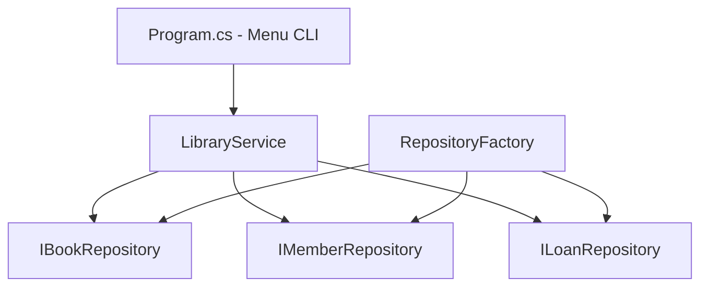
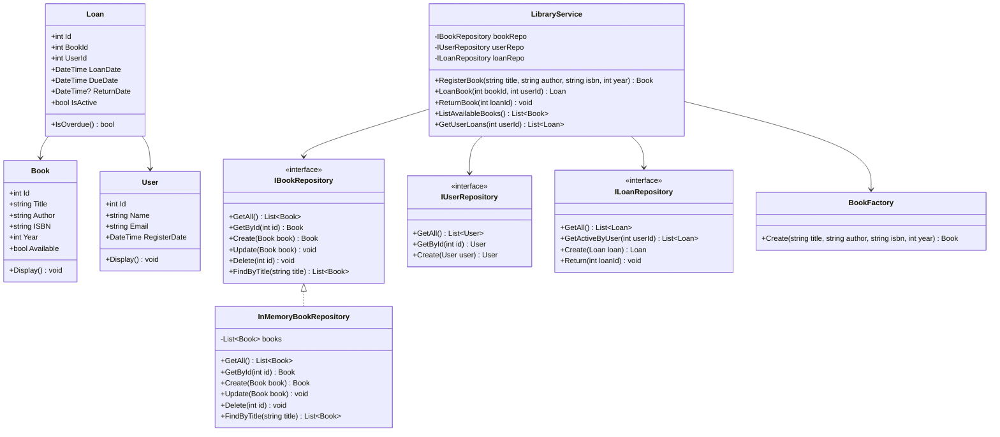

# Projeto do Capítulo 9 — Sistema de Biblioteca OOP

## Descrição

Sistema de gerenciamento de biblioteca implementado em C# com .NET, aplicando todos os conceitos de Programação Orientada a Objetos do capítulo 9: classes, encapsulamento, interfaces, herança, polimorfismo, Factory Pattern, Repository Pattern e princípios SOLID.

## Objetivo

Construir um sistema funcional que permita cadastrar livros e membros, realizar empréstimos e devoluções, com regras de negócio e persistência intercambiável (memória ou SQLite).

## Tecnologias

- C# / .NET 8+
- SQLite (opcional, via Microsoft.Data.Sqlite)
- Console Application (CLI)

## Funcionalidades

1. Cadastrar, listar, buscar e remover livros
2. Cadastrar, listar e buscar membros
3. Realizar empréstimos (com validação de disponibilidade e limite)
4. Realizar devoluções
5. Listar empréstimos ativos
6. Alternar entre armazenamento em memória e SQLite via configuração

## Arquitetura



## Estrutura de Pastas

```
BibliotecaOOP/
├── Program.cs
├── Models/
│   ├── Book.cs
│   ├── Member.cs
│   └── Loan.cs
├── Interfaces/
│   ├── IBookRepository.cs
│   ├── IMemberRepository.cs
│   └── ILoanRepository.cs
├── Repositories/
│   └── InMemory/
│       ├── InMemoryBookRepository.cs
│       ├── InMemoryMemberRepository.cs
│       └── InMemoryLoanRepository.cs
├── Services/
│   └── LibraryService.cs
└── Factory/
    └── RepositoryFactory.cs
```

## Fases de Desenvolvimento

### Fase 1 — Modelar o Domínio (Book, Member, Loan)

Criar as classes com encapsulamento adequado. Cada classe deve ter:
- Atributos com tipos corretos
- Construtor que inicializa todos os campos obrigatórios
- Método `Display()` para exibição formatada
- Métodos de negócio quando aplicável (`CanBorrow()` em Member)

### Fase 2 — Definir Interfaces dos Repositories

Criar interfaces com operações CRUD para cada entidade:
- `IBookRepository`: Add, GetById, GetAll, SearchByTitle, Update, Delete
- `IMemberRepository`: Add, GetById, GetAll, Update
- `ILoanRepository`: Add, GetById, GetActiveLoans, GetLoansByMember

### Fase 3 — Implementar InMemoryRepository

Implementar cada interface usando `List<T>` em memória. Isso permite testar toda a lógica sem banco de dados.

### Fase 4 — Implementar LibraryService

Criar o serviço com lógica de negócio:
- Validação de dados (nome não vazio, etc.)
- Regras de empréstimo (livro disponível, membro com limite)
- Orquestração (atualizar estados ao emprestar/devolver)
- Listagens e buscas

### Fase 5 — Criar Menu CLI

Menu interativo com todas as operações. Usar switch/case para navegação.

### Fase 6 — Implementar SqliteRepository (Opcional)

Adicionar persistência real com SQLite. Instalar via NuGet:
```bash
dotnet add package Microsoft.Data.Sqlite
```

### Fase 7 — Usar Factory

Criar `RepositoryFactory` que retorna InMemory ou SQLite baseado em configuração.

### Fase 8 — Testar e Documentar

Testar todos os cenários, verificar intercambiabilidade e documentar.


---

## Diagrama de Classes

O sistema usa orientação a objetos com interfaces e o pattern Repository. Aqui está o diagrama completo das classes:



### Explicação das Relações

| Relação | Significado | No diagrama |
|---------|------------|-------------|
| `IBookRepository <.. InMemoryBookRepository` | InMemoryBookRepository implementa a interface | Linha tracejada com seta |
| `LibraryService --> IBookRepository` | Service depende da interface, não da implementação | Seta sólida |
| `Loan --> Book` | Empréstimo referencia um livro | Seta sólida |

O ponto mais importante: `LibraryService` depende de `IBookRepository` (interface), não de `InMemoryBookRepository` (implementação). Isso significa que você pode trocar a implementação (ex: de InMemory para SQLite) sem mudar o Service.

---

## Exemplos de Entrada e Saída

### Cadastrar um livro

```
=== Biblioteca Digital ===
1. Cadastrar livro
2. Listar livros
3. Buscar livro
4. Emprestar livro
5. Devolver livro
6. Listar empréstimos
7. Sair

Opcao: 1
Titulo: O Senhor dos Aneis
Autor: J.R.R. Tolkien
ISBN: 978-0-618-64015-7
Ano: 1954

Livro cadastrado com sucesso! ID: 1
```

### Emprestar um livro

```
Opcao: 4
ID do livro: 1
ID do usuario: 1

Emprestimo realizado!
Livro: O Senhor dos Aneis
Usuario: Maria Silva
Data de devolucao: 15/02/2024
```

### Tentar emprestar livro indisponível

```
Opcao: 4
ID do livro: 1
ID do usuario: 2

Erro: Livro 'O Senhor dos Aneis' nao esta disponivel.
Previsao de devolucao: 15/02/2024
```

### Devolver um livro

```
Opcao: 5
ID do emprestimo: 1

Livro devolvido com sucesso!
Livro: O Senhor dos Aneis
Devolvido em: 10/02/2024 (5 dias antes do prazo)
```

### Listar empréstimos ativos

```
Opcao: 6

=== Emprestimos Ativos ===
ID  Livro                    Usuario         Devolucao    Status
1   O Senhor dos Aneis       Maria Silva     15/02/2024   No prazo
2   1984                     Pedro Santos    20/02/2024   No prazo
3   Dom Quixote              Ana Costa       05/02/2024   ATRASADO

Total: 3 emprestimo(s) ativo(s), 1 atrasado(s)
```

---

## Detalhamento dos Design Patterns

### Factory Pattern — BookFactory

O Factory encapsula a criação de objetos. Em vez de criar livros diretamente com `new Book(...)`, você usa uma fábrica que pode:
- Gerar IDs automaticamente
- Validar dados antes de criar
- Definir valores padrão (ex: `Available = true`)

```csharp
// "BookFactory" = fabrica de livros
class BookFactory
{
    private static int _nextId = 1;

    // "Create" = criar livro
    public static Book Create(string title, string author, string isbn, int year)
    {
        // Validacoes
        if (string.IsNullOrWhiteSpace(title))
            throw new ArgumentException("Titulo e obrigatorio");
        if (year < 0 || year > DateTime.Now.Year)
            throw new ArgumentException("Ano invalido");

        return new Book
        {
            Id = _nextId++,
            Title = title.Trim(),
            Author = author.Trim(),
            ISBN = isbn.Trim(),
            Year = year,
            Available = true  // livro novo sempre disponivel
        };
    }
}
```

### Repository Pattern — InMemoryBookRepository

O Repository abstrai o acesso a dados. A interface define o contrato, e a implementação decide como armazenar:

```csharp
// Implementacao em memoria — dados vivem em uma lista
// "InMemoryBookRepository" = repositorio de livros em memoria
class InMemoryBookRepository : IBookRepository
{
    // "books" = lista de livros
    private List<Book> books = new List<Book>();

    public List<Book> GetAll() => books;

    public Book GetById(int id)
    {
        return books.FirstOrDefault(b => b.Id == id);
    }

    public Book Create(Book book)
    {
        books.Add(book);
        return book;
    }

    public void Delete(int id)
    {
        var book = GetById(id);
        if (book != null) books.Remove(book);
    }

    public List<Book> FindByTitle(string title)
    {
        return books.Where(b =>
            b.Title.Contains(title, StringComparison.OrdinalIgnoreCase)
        ).ToList();
    }
}
```

A vantagem: se depois você quiser trocar para SQLite, cria `SqliteBookRepository` implementando a mesma interface `IBookRepository`. O `LibraryService` não muda nada — ele só conhece a interface.

---

## Critérios de Avaliação Detalhados

| Critério | Peso | O que é avaliado |
|----------|------|-----------------|
| Funcionalidade | 40% | CRUD completo funciona, empréstimos e devoluções corretos |
| Organização OOP | 25% | Classes bem definidas, interfaces usadas, patterns aplicados |
| Código limpo | 15% | Nomes descritivos, comentários, indentação, sem código duplicado |
| Tratamento de erros | 10% | Entradas inválidas tratadas, mensagens claras |
| Documentação | 10% | README completo, código comentado |

### Checklist de Entrega

- [ ] Todas as classes do diagrama implementadas
- [ ] Interface IBookRepository definida e implementada
- [ ] Factory pattern usado para criar livros
- [ ] Repository pattern usado para acesso a dados
- [ ] Menu CLI funcional com todas as opções
- [ ] Empréstimo verifica disponibilidade do livro
- [ ] Devolução marca livro como disponível novamente
- [ ] Limite de 3 empréstimos por usuário respeitado
- [ ] Mensagens de erro claras para todas as situações
- [ ] README.md com descrição do projeto e como executar
## Regras de Negócio

| Regra | Descrição |
|-------|-----------|
| Limite de empréstimos | Cada membro pode ter no máximo 3 empréstimos ativos |
| Disponibilidade | Só pode emprestar livro com status "Disponível" |
| Devolução | Ao devolver, livro volta a "Disponível" e contador do membro diminui |
| Validação de dados | Nome, título e autor não podem ser vazios |
| ISBN único | Não permitir dois livros com mesmo ISBN |

## Critérios de Conclusão

- [ ] Classes de domínio implementadas com encapsulamento
- [ ] Interfaces de repository definidas
- [ ] InMemoryRepository funcional para todas as entidades
- [ ] LibraryService com todas as regras de negócio
- [ ] Menu CLI com todas as operações
- [ ] Código organizado em pastas
- [ ] Trocar de "memory" para "sqlite" não quebra nada (se implementado)

## Conceitos OOP Aplicados

| Conceito | Onde |
|----------|------|
| Classes e Objetos | Book, Member, Loan |
| Encapsulamento | Atributos privados, propriedades |
| Interfaces | IBookRepository, IMemberRepository, ILoanRepository |
| Polimorfismo | InMemory e SQLite intercambiáveis |
| Factory | RepositoryFactory |
| Repository | Abstração de acesso a dados |
| SOLID — SRP | Cada classe com uma responsabilidade |
| SOLID — DIP | Service depende de interfaces |
| Composição | Service contém repositories |

## Extensões Sugeridas

Após completar o projeto base:
1. Multas por atraso (R$1/dia após 14 dias)
2. Categorias de livros (Ficção, Técnico, etc.)
3. Busca avançada (por autor, ISBN, categoria)
4. Relatório de estatísticas
5. Histórico de empréstimos por membro
6. Reserva de livros emprestados

## Conexão com Projetos Anteriores

- Cap 5: CRUD em memória (Python, procedural)
- Cap 8: CRUD com SQLite (Python, procedural)
- Cap 9: Sistema OOP com interfaces e patterns (C#)
- Cap 10: Organização em camadas formais
- Cap 11: Exposição como API REST
