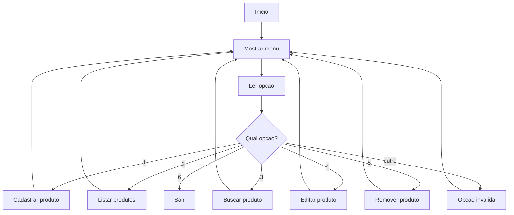

# Projeto do Capítulo 5 — Gerenciador de Contatos em Python

[← Voltar ao Capítulo 5](../capitulos/cap05-mod18-ia-para-programacao-conteudo.md) · [Próximo Capítulo →](../capitulos/cap06-mod01-o-que-e-virtualizacao.md)

---

## Visão Geral

Neste projeto, você vai construir um **Gerenciador de Contatos** completo no terminal. É um programa que permite cadastrar, listar, buscar, editar e remover contatos — tudo armazenado em memória (sem banco de dados, usando listas e dicionários).

Este projeto consolida todos os conceitos do capítulo 5: variáveis, tipos, condicionais, loops, funções, coleções, estrutura de programa, debugging, tratamento de erros e algoritmos.

É parecido com o que empresas fazem em sistemas de CRM (Customer Relationship Management) — softwares que gerenciam contatos de clientes. A diferença é que sistemas profissionais usam banco de dados e interface gráfica, enquanto o nosso usa memória e terminal. Mas a lógica é a mesma.

---

## O que Você Vai Construir

Um programa Python com menu interativo no terminal:

```
========================================
   GERENCIADOR DE CONTATOS
========================================

1. Cadastrar contato
2. Listar todos os contatos
3. Buscar contato por nome
4. Editar contato
5. Remover contato
6. Estatisticas
7. Sair

Escolha uma opcao: _
```

---

## Requisitos do Projeto

### Dados de cada contato

Cada contato é um dicionário com:
- `name` (nome) — texto, obrigatório, não pode ser vazio
- `phone` (telefone) — texto, obrigatório
- `email` (e-mail) — texto, opcional (pode ser vazio)
- `city` (cidade) — texto, opcional

### Funcionalidades obrigatórias


1. **Cadastrar contato:** pedir todos os dados com validação (nome e telefone obrigatórios). Usar `try`/`except` onde necessário. Não permitir nomes duplicados.

2. **Listar contatos:** mostrar todos os contatos formatados em tabela. Se não houver contatos, mostrar mensagem amigável.

3. **Buscar por nome:** busca parcial e case-insensitive. Se digitar "ana", deve encontrar "Ana Maria", "Mariana", etc.

4. **Editar contato:** buscar pelo nome, mostrar os dados atuais e permitir alterar cada campo (Enter para manter o valor atual).

5. **Remover contato:** buscar pelo nome, confirmar antes de remover ("Tem certeza? s/n").

6. **Estatísticas:** mostrar total de contatos, quantos têm e-mail, quantos têm cidade preenchida.

7. **Sair:** encerrar o programa com mensagem de despedida.

### Requisitos técnicos

- Usar funções para cada operação (não colocar tudo no main)
- Usar a estrutura de programa do módulo 5.13 (constantes, funções, main, ponto de entrada)
- Tratar todos os erros de entrada (o programa nunca deve parar com Traceback)
- Comentários em português, variáveis em inglês
- Menu deve repetir até o usuário escolher sair

---

## Desenvolvimento Incremental

Construa o projeto em fases. Teste cada fase antes de avançar.

### Fase 1 — Estrutura básica e cadastro

1. Crie o arquivo `contacts.py`
2. Defina a lista global de contatos: `contacts = []`
3. Crie a função `show_menu()` que mostra o menu
4. Crie a função `main()` com o loop do menu
5. Crie a função `register_contact()` que pede os dados e adiciona à lista
6. Teste: cadastre 2-3 contatos e verifique com `print(contacts)`

**Seu projeto está pronto para a Fase 1 quando:** consegue cadastrar contatos e eles aparecem na lista.

### Fase 2 — Listagem e busca

1. Crie a função `list_contacts()` que mostra todos os contatos formatados
2. Crie a função `search_contact()` que busca por nome (parcial, case-insensitive)
3. Teste: cadastre contatos e teste a listagem e busca

**Seu projeto está pronto para a Fase 2 quando:** consegue listar todos os contatos e buscar por parte do nome.

### Fase 3 — Edição e remoção

1. Crie a função `edit_contact()` que permite alterar dados
2. Crie a função `remove_contact()` que remove com confirmação
3. Teste: edite e remova contatos, verifique que a lista é atualizada

**Seu projeto está pronto para a Fase 3 quando:** consegue editar e remover contatos sem erros.

### Fase 4 — Estatísticas e polimento

1. Crie a função `show_statistics()` com as contagens
2. Adicione validação de nome duplicado no cadastro
3. Revise o tratamento de erros em todas as funções
4. Teste todos os fluxos, incluindo casos especiais (lista vazia, nome não encontrado)

**Seu projeto está completo quando:** todas as 7 opções do menu funcionam, nenhuma entrada inválida causa Traceback, e o código está organizado em funções com comentários.

---

## Exemplo de Execução Completa

```
========================================
   GERENCIADOR DE CONTATOS
========================================

1. Cadastrar contato
2. Listar todos os contatos
3. Buscar contato por nome
4. Editar contato
5. Remover contato
6. Estatisticas
7. Sair

Escolha uma opcao: 1

--- Cadastrar Contato ---
Nome: Ana Silva
Telefone: 11999887766
E-mail (Enter para pular): ana@email.com
Cidade (Enter para pular): Sao Paulo
Contato 'Ana Silva' cadastrado com sucesso!

Escolha uma opcao: 1

--- Cadastrar Contato ---
Nome: Bruno Costa
Telefone: 21988776655
E-mail (Enter para pular):
Cidade (Enter para pular): Rio de Janeiro
Contato 'Bruno Costa' cadastrado com sucesso!

Escolha uma opcao: 2

--- Lista de Contatos (2) ---
Nome                 Telefone        E-mail               Cidade
----------------------------------------------------------------------
Ana Silva            11999887766     ana@email.com        Sao Paulo
Bruno Costa          21988776655     -                    Rio de Janeiro

Escolha uma opcao: 3

--- Buscar Contato ---
Digite o nome (ou parte): ana

Resultados para 'ana':
  Ana Silva - Tel: 11999887766 - Email: ana@email.com - Cidade: Sao Paulo

Escolha uma opcao: 6

--- Estatisticas ---
Total de contatos: 2
Com e-mail: 1 (50.0%)
Com cidade: 2 (100.0%)

Escolha uma opcao: 7

Ate mais! Seus contatos foram perdidos (estavam apenas na memoria).
Nos proximos capitulos, voce vai aprender a salvar dados em arquivos e bancos de dados!
```

---


---

## Fluxo do Programa



---

## Estrutura de Código Sugerida

Organize seu programa seguindo a estrutura que você aprendeu no módulo 5.13:

```python
# ============================================
# CRUD de Produtos em Memoria
# Descricao: Cadastrar, listar, buscar,
#            editar e remover produtos.
# ============================================

# --- Constantes ---
APP_NAME = "Gerenciador de Produtos"
VERSION = "1.0"
MENU_OPTIONS = [
    "Cadastrar produto",
    "Listar produtos",
    "Buscar produto",
    "Editar produto",
    "Remover produto",
    "Sair"
]

# --- Funcoes de dados ---
# add_product(), find_product(), list_products(),
# update_product(), remove_product()

# --- Funcoes de interface ---
# show_menu(), get_choice(), get_product_data(),
# show_product(), show_product_list()

# --- Funcao principal ---
# def main(): ...

# --- Ponto de entrada ---
# if __name__ == "__main__": main()
```

Cada função de dados deve receber a lista de produtos como parâmetro e retornar resultados — sem usar `print()` nem `input()`. As funções de interface cuidam da interação com o usuário.

---

## Exemplos de Saída por Operação

### Cadastrar produto

```
Nome do produto: Notebook
Preco: R$ 3500.00
Categoria: Eletronicos

Produto 'Notebook' cadastrado com sucesso! (ID: 1)
```

### Listar produtos (com produtos)

```
=== Lista de Produtos ===
ID   Nome                 Preco        Categoria
---  -------------------  ----------   ---------------
1    Notebook             R$ 3500.00   Eletronicos
2    Mouse                R$   89.90   Perifericos
3    Teclado              R$  199.90   Perifericos

Total: 3 produto(s)
```

### Listar produtos (vazio)

```
=== Lista de Produtos ===
Nenhum produto cadastrado.
```

### Buscar produto (encontrado)

```
Buscar por nome: note

=== Resultados ===
1 resultado(s) encontrado(s):
ID   Nome                 Preco        Categoria
1    Notebook             R$ 3500.00   Eletronicos
```

### Buscar produto (não encontrado)

```
Buscar por nome: tablet

Nenhum produto encontrado com 'tablet'.
```

### Editar produto

```
ID do produto para editar: 1

Produto atual:
  Nome: Notebook
  Preco: R$ 3500.00
  Categoria: Eletronicos

Novo nome (Enter para manter): Notebook Pro
Novo preco (Enter para manter): 4200.00
Nova categoria (Enter para manter):

Produto atualizado com sucesso!
```

### Remover produto

```
ID do produto para remover: 2

Produto encontrado: Mouse (R$ 89.90)
Confirma remocao? (s/n): s

Produto 'Mouse' removido com sucesso!
```

---

## Erros Comuns e Como Evitar

### Erro 1: Usar índice da lista como ID

```python
# RUIM — se remover um produto, os indices mudam
products[0]  # era "Notebook", agora e "Mouse"

# BOM — usar um campo ID no dicionario
product = {"id": 1, "name": "Notebook", ...}
```

O ID deve ser gerado automaticamente (um contador que incrementa) e nunca mudar, mesmo quando produtos são removidos.

### Erro 2: Não validar entrada do usuário

```python
# RUIM — se o usuario digitar "abc" no preco, da erro
price = float(input("Preco: "))

# BOM — tratar o erro
try:
    price = float(input("Preco: R$ "))
    if price <= 0:
        print("Preco deve ser positivo!")
except ValueError:
    print("Valor invalido! Digite um numero.")
```

### Erro 3: Comparar strings sem normalizar

```python
# RUIM — "notebook" != "Notebook"
if product["name"] == search_term:

# BOM — comparar em minusculas
if product["name"].lower() == search_term.lower():
```

### Erro 4: Modificar lista durante iteração

```python
# RUIM — pode pular elementos ou dar erro
for product in products:
    if product["price"] == 0:
        products.remove(product)

# BOM — criar lista nova ou iterar por indice reverso
products = [p for p in products if p["price"] != 0]
```

### Erro 5: Não confirmar remoção

Sempre peça confirmação antes de remover. O usuário pode ter digitado o ID errado. Uma mensagem "Tem certeza? (s/n)" evita acidentes.

---

## Testando Seu Programa

Antes de considerar o projeto pronto, teste estes cenários:

| Cenário | O que testar | Resultado esperado |
|---------|-------------|-------------------|
| Lista vazia | Listar sem cadastrar nada | Mensagem "Nenhum produto" |
| Cadastro normal | Cadastrar com dados válidos | Produto aparece na lista |
| Preço inválido | Digitar "abc" no preço | Mensagem de erro, não quebra |
| Preço negativo | Digitar "-10" no preço | Mensagem de erro |
| Busca parcial | Buscar "note" tendo "Notebook" | Encontra o produto |
| Busca inexistente | Buscar "xyz" | Mensagem "não encontrado" |
| Editar mantendo | Pressionar Enter sem digitar | Mantém valor atual |
| Remover e listar | Remover produto e listar | Produto não aparece mais |
| ID inexistente | Editar/remover ID que não existe | Mensagem de erro |
| Opção inválida | Digitar "7" ou "abc" no menu | Mensagem "opção inválida" |
## Dicas

- Comece simples e vá adicionando funcionalidades
- Teste cada função isoladamente antes de integrar no menu
- Use `print()` de debug quando algo não funcionar (módulo 5.14)
- Lembre-se do padrão de entrada segura do módulo 5.15
- A busca parcial pode usar `in`: `"ana" in "Ana Maria".lower()`
- Para a edição, use `input()` com valor padrão: se o usuário pressionar Enter sem digitar nada, mantenha o valor atual

---

## Critérios de Conclusão

Seu projeto está completo quando:

- [ ] Todas as 7 opções do menu funcionam corretamente
- [ ] Nenhuma entrada inválida causa Traceback (tudo tratado com try/except ou validação)
- [ ] A busca é parcial e case-insensitive
- [ ] A edição permite manter valores atuais pressionando Enter
- [ ] A remoção pede confirmação antes de remover
- [ ] O código está organizado em funções (não tem tudo no main)
- [ ] Variáveis em inglês com comentários em português
- [ ] O programa usa a estrutura do módulo 5.13 (constantes, funções, main, ponto de entrada)

---

## Desafios Extras (Opcional)

Se terminou o projeto e quer ir além:

1. **Ordenação:** adicione uma opção para listar contatos em ordem alfabética (use `sorted()`)
2. **Exportar:** crie uma função que mostra todos os contatos em formato CSV (valores separados por vírgula)
3. **Importar:** crie uma função que recebe dados em formato "nome;telefone;email;cidade" e cadastra
4. **Favoritos:** adicione um campo `favorite` (booleano) e uma opção para listar apenas favoritos

---

## Conexão com os Próximos Capítulos

Este projeto armazena dados apenas na memória — quando o programa fecha, tudo é perdido. Nos próximos capítulos, você vai evoluir esse conceito:

- **Capítulo 6 (Docker):** vai aprender a empacotar este programa em um container
- **Capítulo 8 (Bancos de Dados):** vai aprender a salvar dados em SQLite para que persistam entre execuções
- **Capítulo 11 (APIs):** vai transformar este programa em uma API REST com FastAPI

Cada capítulo constrói sobre o anterior. O gerenciador de contatos é o ponto de partida de uma jornada que vai até APIs profissionais.

---

[← Voltar ao Capítulo 5](../capitulos/cap05-mod18-ia-para-programacao-conteudo.md) · [Próximo Capítulo →](../capitulos/cap06-mod01-o-que-e-virtualizacao.md)
