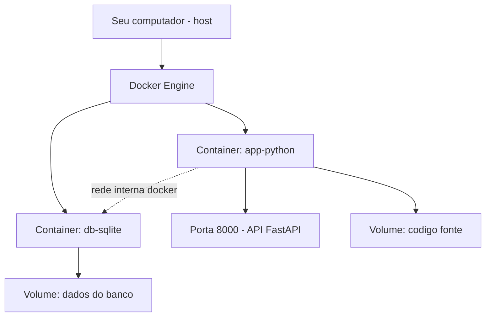
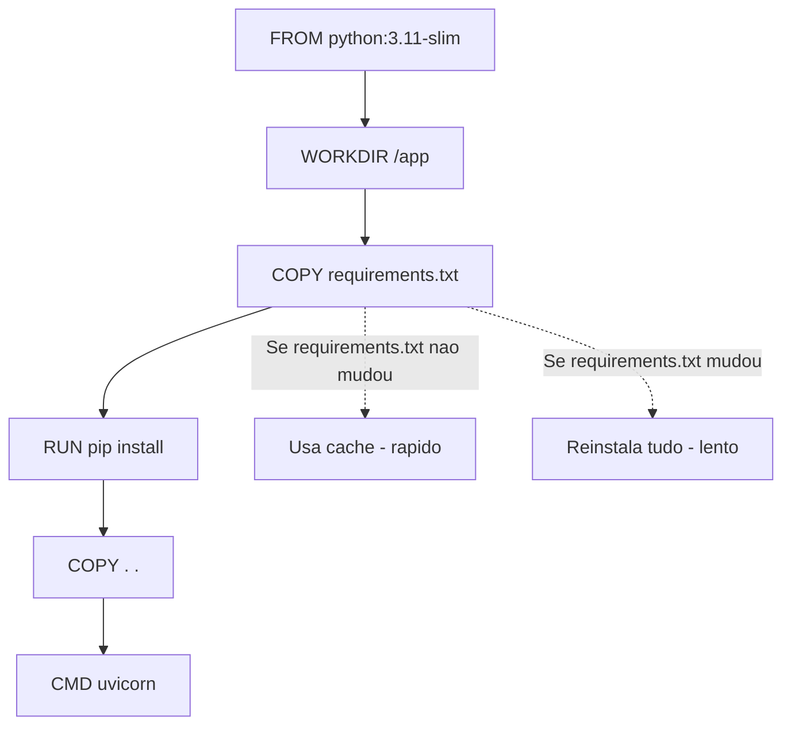

# Projeto do Capítulo 6 — Containerizando uma Aplicação Python

[← Voltar ao Capítulo 6](../capitulos/cap06-mod05-docker-compose-conteudo.md) · [Próximo Capítulo →](../capitulos/cap07-mod01-porque-c-conteudo.md)

---

## Visão Geral

Neste projeto, você vai pegar uma aplicação Python e transformá-la em um ambiente completo com Docker. O objetivo é consolidar tudo que aprendeu no capítulo 6: Dockerfiles, imagens, containers, volumes, variáveis de ambiente e Docker Compose.

Você vai containerizar uma aplicação Python simples (pode ser o gerenciador de contatos do capítulo 5 ou criar uma nova), adicionar um banco de dados PostgreSQL como serviço auxiliar, e orquestrar tudo com Docker Compose.

Esse é o tipo de trabalho que desenvolvedores fazem no dia a dia: pegar uma aplicação existente e empacotá-la para rodar em containers, garantindo que funcione igual em qualquer ambiente.

---

## O que Você Vai Construir

Um ambiente Docker completo com:

1. Uma aplicação Python containerizada (com Dockerfile)
2. Um banco de dados PostgreSQL em container
3. Um arquivo `docker-compose.yml` orquestrando ambos
4. Volumes para persistência de dados
5. Variáveis de ambiente para configuração
6. Um README documentando como rodar o projeto

---

## Requisitos do Projeto

### Obrigatórios

- [ ] Dockerfile funcional para a aplicação Python
- [ ] `.dockerignore` excluindo arquivos desnecessários
- [ ] `docker-compose.yml` com pelo menos 2 serviços (app + banco)
- [ ] Volume nomeado para persistência do banco de dados
- [ ] Variáveis de ambiente para configuração (senha do banco, nome do banco, etc.)
- [ ] README.md documentando como rodar o projeto
- [ ] O projeto deve ser reproduzível: qualquer pessoa com Docker deve conseguir rodar

### Desejáveis (bônus)

- [ ] Usar `python:3.12-slim` como imagem base
- [ ] Usar `ENV PYTHONUNBUFFERED=1` no Dockerfile
- [ ] Otimização de cache (copiar requirements.txt antes do código)
- [ ] Bind mount para desenvolvimento (código local refletido no container)

---

## Desenvolvimento Incremental

### Fase 1 — A Aplicação Python

Crie (ou adapte) uma aplicação Python simples. Pode ser:
- O gerenciador de contatos do capítulo 5 (adaptado)
- Uma lista de tarefas (to-do list)
- Um cadastro de produtos simples

A aplicação deve ter um menu interativo no terminal com operações básicas (cadastrar, listar, buscar).

Nesta fase, a aplicação roda localmente sem Docker e guarda dados em memória (como no capítulo 5).

**Critério de conclusão:** a aplicação roda com `python3 app.py` e funciona corretamente.

### Fase 2 — O Dockerfile

Crie um Dockerfile para a aplicação:
1. Use `python:3.12-slim` como base
2. Defina `WORKDIR /app`
3. Copie `requirements.txt` e instale dependências
4. Copie o código
5. Defina o `CMD`

Crie também o `.dockerignore`.

**Critério de conclusão:** `docker build -t meu-projeto .` constrói sem erros e `docker run -it --rm meu-projeto` roda a aplicação.

### Fase 3 — Docker Compose com Banco de Dados

Crie o `docker-compose.yml` com dois serviços:
1. A aplicação Python (build a partir do Dockerfile)
2. PostgreSQL com variáveis de ambiente configuradas

Configure o volume para persistência do banco.

**Critério de conclusão:** `docker compose up -d` sobe ambos os serviços e `docker compose ps` mostra os dois rodando.

### Fase 4 — Variáveis de Ambiente e Configuração

Configure a aplicação para ler configurações de variáveis de ambiente:
- Nome do banco, usuário, senha via variáveis
- A aplicação imprime as configurações ao iniciar

**Critério de conclusão:** mudar uma variável no `docker-compose.yml` e reconstruir reflete a mudança na aplicação.

### Fase 5 — Documentação

Crie um `README.md` para o projeto com:
- O que o projeto faz
- Pré-requisitos (Docker instalado)
- Como rodar (`docker compose up -d`)
- Como parar (`docker compose down`)
- Estrutura de arquivos
- Variáveis de ambiente disponíveis

**Critério de conclusão:** uma pessoa que nunca viu o projeto consegue rodá-lo seguindo apenas o README.

---

## Estrutura de Arquivos Esperada

```
meu-projeto-docker/
├── app.py                  # Aplicacao Python
├── requirements.txt        # Dependencias Python
├── Dockerfile              # Receita da imagem
├── .dockerignore           # Arquivos excluidos do build
├── docker-compose.yml      # Orquestracao dos servicos
└── README.md               # Documentacao
```

---


---

## Diagrama de Arquitetura

O projeto usa dois containers que se comunicam via rede Docker:



| Componente | O que faz | Porta |
|-----------|----------|-------|
| app-python | Roda a aplicação Python/FastAPI | 8000 |
| db-sqlite | Armazena o banco SQLite em volume | - |
| Volume código | Monta seu código dentro do container | - |
| Volume dados | Persiste o banco entre reinícios | - |

---

## Dockerfile Detalhado

O Dockerfile é a "receita" para construir a imagem do seu container. Cada linha é uma instrução:

```dockerfile
# Imagem base — Python 3.11 versao slim (menor e mais rapida)
FROM python:3.11-slim

# Diretorio de trabalho dentro do container
# Todos os comandos seguintes rodam nesta pasta
WORKDIR /app

# Copiar apenas o arquivo de dependencias primeiro
# Isso aproveita o cache do Docker — se requirements.txt nao mudou,
# o Docker nao reinstala as dependencias
COPY requirements.txt .

# Instalar dependencias Python
# --no-cache-dir evita guardar cache do pip (imagem menor)
RUN pip install --no-cache-dir -r requirements.txt

# Copiar o resto do codigo
# Isso vem DEPOIS do pip install para aproveitar o cache
COPY . .

# Porta que a aplicacao usa
EXPOSE 8000

# Comando para iniciar a aplicacao
# uvicorn main:app — roda o FastAPI
# --host 0.0.0.0 — aceita conexoes de fora do container
# --port 8000 — porta da aplicacao
CMD ["uvicorn", "main:app", "--host", "0.0.0.0", "--port", "8000"]
```

### Por que copiar requirements.txt separado?

O Docker constrói imagens em camadas. Cada instrução (`FROM`, `COPY`, `RUN`) cria uma camada. Se uma camada não mudou, o Docker usa o cache — não precisa refazer.

Se você copiar tudo de uma vez (`COPY . .`) e depois instalar dependências, qualquer mudança no seu código invalida o cache e força a reinstalação de todas as dependências. Copiando `requirements.txt` primeiro, as dependências só são reinstaladas quando o arquivo de dependências muda — o que é raro.



---

## docker-compose.yml Detalhado

O docker-compose orquestra múltiplos containers:

```yaml
# docker-compose.yml
version: "3.8"

services:
  # Servico da aplicacao Python
  app:
    # Construir a imagem a partir do Dockerfile local
    build: .
    # Mapear porta: host:container
    ports:
      - "8000:8000"
    # Montar o codigo como volume (hot reload)
    volumes:
      - .:/app
    # Variavel de ambiente para o banco
    environment:
      - DATABASE_PATH=/data/products.db
    # Depende do servico de dados
    depends_on:
      - data
    # Reiniciar automaticamente se o container cair
    restart: unless-stopped

  # Servico de dados (volume para o banco)
  data:
    image: busybox
    volumes:
      - db-data:/data

# Volumes nomeados — persistem entre reinícios
volumes:
  db-data:
```

### Explicação de cada campo

| Campo | Significado |
|-------|-----------|
| `build: .` | Constrói a imagem usando o Dockerfile na pasta atual |
| `ports: "8000:8000"` | Mapeia porta 8000 do host para 8000 do container |
| `volumes: .:/app` | Monta a pasta atual dentro do container em /app |
| `environment` | Define variáveis de ambiente dentro do container |
| `depends_on` | Garante que o serviço data inicia antes do app |
| `restart: unless-stopped` | Reinicia o container automaticamente se cair |
| `volumes: db-data` | Volume nomeado que persiste dados entre reinícios |

---

## Comandos Essenciais

### Construir e iniciar

```bash
# Construir as imagens e iniciar os containers
docker-compose up --build

# Iniciar em segundo plano (detached)
docker-compose up --build -d

# Ver logs dos containers
docker-compose logs -f

# Ver logs de um servico especifico
docker-compose logs -f app
```

### Parar e limpar

```bash
# Parar os containers
docker-compose down

# Parar e remover volumes (CUIDADO: apaga dados do banco)
docker-compose down -v

# Remover imagens construidas
docker-compose down --rmi local
```

### Verificar status

```bash
# Ver containers rodando
docker-compose ps

# Entrar dentro do container (para debug)
docker-compose exec app bash

# Executar um comando dentro do container
docker-compose exec app python3 -c "print('ola de dentro do container')"
```

---

## Troubleshooting

### "docker: command not found"

Docker não está instalado. Instale seguindo a documentação oficial: https://docs.docker.com/get-docker/

### "permission denied" ao rodar docker

No Linux, adicione seu usuário ao grupo docker:
```bash
sudo usermod -aG docker $USER
# Depois faça logout e login novamente
```

### "port is already allocated"

Outro processo está usando a porta 8000. Soluções:
- Parar o outro processo
- Mudar a porta no docker-compose: `"8001:8000"`

### Container inicia e para imediatamente

Verifique os logs:
```bash
docker-compose logs app
```

Causas comuns:
- Erro de sintaxe no código Python
- Dependência faltando no requirements.txt
- Caminho do banco de dados incorreto

### Mudanças no código não aparecem

Se não está usando volume mount, precisa reconstruir:
```bash
docker-compose up --build
```

Com volume mount (`volumes: .:/app`), as mudanças aparecem automaticamente — mas pode precisar reiniciar o uvicorn.

### "ModuleNotFoundError" dentro do container

A dependência não está no `requirements.txt`. Adicione e reconstrua:
```bash
echo "nome-do-pacote" >> requirements.txt
docker-compose up --build
```

---

## Testando o Projeto

Depois de subir os containers, teste a API:

```bash
# Verificar se a API esta rodando
curl http://localhost:8000/docs

# Criar um produto
curl -X POST http://localhost:8000/products \
  -H "Content-Type: application/json" \
  -d '{"name": "Notebook", "price": 3500.00}'

# Listar produtos
curl http://localhost:8000/products
```

### Checklist de Conclusão

- [ ] Dockerfile construído e funcional
- [ ] docker-compose.yml com serviço app e volume de dados
- [ ] `docker-compose up --build` inicia sem erros
- [ ] API acessível em http://localhost:8000
- [ ] Documentação Swagger acessível em http://localhost:8000/docs
- [ ] Dados persistem entre reinícios do container
- [ ] `docker-compose down` para os containers corretamente
- [ ] README.md com instruções de como rodar com Docker
## Critérios de Avaliação

Seu projeto está pronto quando:

1. `docker compose up -d` sobe todos os serviços sem erros
2. `docker compose ps` mostra todos os serviços rodando
3. A aplicação funciona corretamente dentro do container
4. Os dados do banco persistem entre `docker compose down` e `docker compose up`
5. O README permite que outra pessoa rode o projeto sem ajuda
6. O `.dockerignore` exclui arquivos desnecessários
7. A imagem usa `python:3.12-slim` (não a versão full)

---

## Dicas de Implementação

- Comece simples: faça a aplicação funcionar localmente primeiro, depois containerize
- Teste cada fase antes de avançar para a próxima
- Se algo não funcionar, use `docker compose logs` para ver os erros
- Lembre-se: `docker compose down` preserva volumes, `docker compose down -v` remove tudo
- Use `docker compose up --build` para forçar reconstrução da imagem após mudanças no Dockerfile

---

## Conexão com o Mundo Real

Esse projeto é muito parecido com o que desenvolvedores fazem no primeiro dia em uma empresa nova:

1. Clonam o repositório do projeto
2. Leem o README
3. Rodam `docker compose up`
4. Começam a trabalhar

O `docker-compose.yml` que você está criando é exatamente o tipo de arquivo que equipes de desenvolvimento mantêm em seus repositórios. Quando você entrar no mercado de trabalho, vai encontrar arquivos assim em praticamente todo projeto.

---

## Referências

- [Docker Compose Documentation](https://docs.docker.com/compose/) — *Documentação oficial*
- [Awesome Compose](https://github.com/docker/awesome-compose) — *Exemplos de docker-compose.yml para diferentes stacks*
- [Repositórios do Fino](https://github.com/RafaelFino) — *Projetos de referência do autor*

---

[← Voltar ao Capítulo 6](../capitulos/cap06-mod05-docker-compose-conteudo.md) · [Próximo Capítulo →](../capitulos/cap07-mod01-porque-c-conteudo.md)
