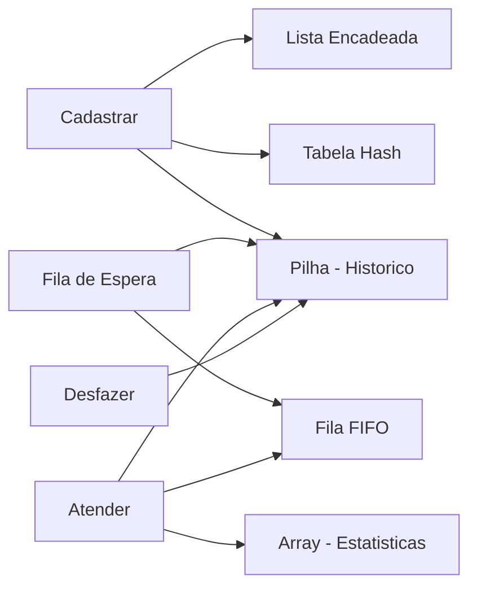

# Projeto do Capítulo 7 — Sistema de Atendimento com Estruturas de Dados em C

[← Voltar ao Capítulo 7](../capitulos/cap07-mod11-comparacao-estruturas-conteudo.md) · [Próximo Capítulo →](../capitulos/cap08-mod01-intro-bancos-conteudo.md)

---

## Visão Geral

Neste projeto, você vai construir um programa em C que simula um **sistema de atendimento de uma clínica veterinária**. O objetivo é consolidar tudo que aprendeu no capítulo 7: arrays, listas encadeadas, filas, pilhas e dicionários — tudo integrado em uma aplicação funcional.

A clínica tem donos de animais que chegam para atendimento, animais que precisam ser cadastrados, uma fila de espera para consultas, um histórico de operações que pode ser desfeito, e estatísticas de atendimento. Cada funcionalidade usa a estrutura de dados mais adequada para o problema.

Esse tipo de sistema — onde múltiplas estruturas trabalham juntas — é exatamente o que você vai encontrar em aplicações reais. Um editor de texto usa pilha para undo, lista para o texto e dicionário para buscar palavras. Um navegador usa pilha para histórico, dicionário para cache e fila para downloads. Aqui, você vai experimentar essa integração na prática.

---

## O que Você Vai Construir

Um programa em C com menu interativo que gerência:

1. **Cadastro de animais** — lista encadeada de animais com nome, espécie e dono
2. **Fila de atendimento** — fila FIFO onde animais aguardam consulta
3. **Histórico de operações** — pilha para permitir "desfazer" a última ação
4. **Estatísticas** — array de contadores para acompanhar o movimento da clínica
5. **Busca rápida** — tabela hash simples para encontrar animais pelo nome

---

## Requisitos do Projeto

### Obrigatórios

- [ ] Struct `Animal` com campos: nome, espécie, nome do dono, id
- [ ] Lista encadeada para o cadastro geral de animais
- [ ] Fila para a ordem de atendimento (FIFO)
- [ ] Pilha para histórico de operações (undo)
- [ ] Array de contadores para estatísticas (total cadastrados, total atendidos, por espécie)
- [ ] Menu interativo no terminal com pelo menos 7 opções
- [ ] Função "desfazer" que reverte a última operação
- [ ] O programa compila sem warnings com `gcc -Wall`
- [ ] Toda memória alocada com `malloc` é liberada com `free` ao sair

### Desejáveis (bônus)

- [ ] Tabela hash simples para busca por nome do animal em O(1)
- [ ] Fila de prioridade (emergências passam na frente)
- [ ] Salvar e carregar dados de arquivo texto
- [ ] Validação de entrada (não aceitar campos vazios, id duplicado)

---

## O Menu do Programa

```
========================================
   Clinica Veterinaria — PetCode
========================================
1. Cadastrar animal
2. Listar animais cadastrados
3. Colocar animal na fila de atendimento
4. Atender proximo animal (sai da fila)
5. Ver fila de atendimento
6. Buscar animal por nome
7. Desfazer ultima operacao
8. Ver estatisticas
0. Sair
========================================
Opcao:
```

---

## As Estruturas de Dados do Projeto

Cada funcionalidade usa a estrutura mais adequada. Aqui está o mapeamento e a justificativa:

| Funcionalidade | Estrutura | Por que esta e a melhor |
|----------------|-----------|------------------------|
| Cadastro de animais | Lista encadeada | Tamanho desconhecido, insercoes frequentes |
| Fila de atendimento | Fila (lista encadeada) | FIFO — primeiro a chegar, primeiro atendido |
| Histórico de operações | Pilha | LIFO — última operação e a primeira desfeita |
| Estatisticas | Array de contadores | Tamanho fixo (tipos de estatistica conhecidos) |
| Busca por nome | Tabela hash simples | Busca O(1) por chave (nome do animal) |



---

## Desenvolvimento Incremental

### Fase 1 — Structs e Estruturas Base

Defina as structs que o programa vai usar. Essa é a fundação — tudo que vem depois depende dessas definições.

```c
#include <stdio.h>
#include <stdlib.h>
#include <string.h>

// --- Animal ---
typedef struct {
    int id;
    char nome[50];       // nome do animal
    char especie[30];    // cachorro, gato, passaro, etc.
    char dono[50];       // nome do dono
} Animal;

// --- No generico para lista, fila e pilha ---
typedef struct No {
    Animal animal;
    struct No *prox;
} No;

// --- Lista encadeada (cadastro) ---
typedef struct {
    No *inicio;
    int tamanho;
} Lista;

// --- Fila (atendimento) ---
typedef struct {
    No *inicio;
    No *fim;
    int tamanho;
} Fila;

// --- Operacao para a pilha de undo ---
typedef struct {
    char tipo[20];       // "CADASTRO", "FILA", "ATENDIMENTO"
    Animal animal;       // animal envolvido na operacao
} Operacao;

typedef struct NoOp {
    Operacao op;
    struct NoOp *prox;
} NoOp;

// --- Pilha de operacoes (undo) ---
typedef struct {
    NoOp *topo;
    int tamanho;
} Pilha;

// --- Estatisticas (array de contadores) ---
#define NUM_ESPECIES 5
const char *especies[] = {"Cachorro", "Gato", "Passaro", "Peixe", "Outro"};
int contadores_especie[NUM_ESPECIES];
int total_cadastrados = 0;
int total_atendidos = 0;
int proximo_id = 1;
```

**Critério de conclusão da Fase 1:** o código compila sem erros com `gcc -Wall -c veterinaria.c`.

---

### Fase 2 — Operações da Lista (Cadastro)

Implemente as funções para gerenciar o cadastro de animais:

```c
void lista_iniciar(Lista *l) {
    l->inicio = NULL;
    l->tamanho = 0;
}

// Inserir no inicio da lista — O(1)
void lista_inserir(Lista *l, Animal a) {
    No *novo = (No*)malloc(sizeof(No));
    if (novo == NULL) {
        printf("Erro: memoria insuficiente!\n");
        return;
    }
    novo->animal = a;
    novo->prox = l->inicio;
    l->inicio = novo;
    l->tamanho++;
}

// Remover por id — O(n)
int lista_remover(Lista *l, int id, Animal *removido) {
    No *atual = l->inicio;
    No *anterior = NULL;

    while (atual != NULL) {
        if (atual->animal.id == id) {
            *removido = atual->animal;
            if (anterior == NULL) {
                l->inicio = atual->prox;
            } else {
                anterior->prox = atual->prox;
            }
            free(atual);
            l->tamanho--;
            return 1;  // encontrou e removeu
        }
        anterior = atual;
        atual = atual->prox;
    }
    return 0;  // nao encontrou
}

// Listar todos — O(n)
void lista_imprimir(Lista *l) {
    if (l->tamanho == 0) {
        printf("Nenhum animal cadastrado.\n");
        return;
    }
    No *atual = l->inicio;
    printf("\n--- Animais Cadastrados (%d) ---\n", l->tamanho);
    while (atual != NULL) {
        printf("  [%d] %s (%s) — Dono: %s\n",
               atual->animal.id,
               atual->animal.nome,
               atual->animal.especie,
               atual->animal.dono);
        atual = atual->prox;
    }
}

// Buscar por nome — O(n)
No* lista_buscar(Lista *l, const char *nome) {
    No *atual = l->inicio;
    while (atual != NULL) {
        if (strcmp(atual->animal.nome, nome) == 0) {
            return atual;
        }
        atual = atual->prox;
    }
    return NULL;
}
```

Teste a Fase 2 criando um `main` temporário que cadastra 3 animais, lista todos e busca um por nome.

**Critério de conclusão:** cadastrar, listar e buscar funcionam corretamente.

---

### Fase 3 — Fila de Atendimento

Implemente a fila FIFO para a ordem de atendimento:

```c
void fila_iniciar(Fila *f) {
    f->inicio = NULL;
    f->fim = NULL;
    f->tamanho = 0;
}

// Enqueue — O(1)
void fila_enqueue(Fila *f, Animal a) {
    No *novo = (No*)malloc(sizeof(No));
    if (novo == NULL) {
        printf("Erro: memoria insuficiente!\n");
        return;
    }
    novo->animal = a;
    novo->prox = NULL;

    if (f->fim != NULL) {
        f->fim->prox = novo;
    } else {
        f->inicio = novo;
    }
    f->fim = novo;
    f->tamanho++;
}

// Dequeue — O(1)
int fila_dequeue(Fila *f, Animal *atendido) {
    if (f->inicio == NULL) return 0;

    No *temp = f->inicio;
    *atendido = temp->animal;
    f->inicio = temp->prox;
    if (f->inicio == NULL) f->fim = NULL;
    free(temp);
    f->tamanho--;
    return 1;
}

// Imprimir fila — O(n)
void fila_imprimir(Fila *f) {
    if (f->tamanho == 0) {
        printf("Fila de atendimento vazia.\n");
        return;
    }
    No *atual = f->inicio;
    int pos = 1;
    printf("\n--- Fila de Atendimento (%d) ---\n", f->tamanho);
    while (atual != NULL) {
        printf("  %d. %s (%s) — Dono: %s\n",
               pos++,
               atual->animal.nome,
               atual->animal.especie,
               atual->animal.dono);
        atual = atual->prox;
    }
}
```

**Critério de conclusão:** enqueue e dequeue funcionam na ordem correta (FIFO).

---

### Fase 4 — Pilha de Undo

Implemente a pilha que registra operações para permitir "desfazer":

```c
void pilha_iniciar(Pilha *p) {
    p->topo = NULL;
    p->tamanho = 0;
}

// Push — registrar operacao — O(1)
void pilha_push(Pilha *p, const char *tipo, Animal a) {
    NoOp *novo = (NoOp*)malloc(sizeof(NoOp));
    if (novo == NULL) return;
    strncpy(novo->op.tipo, tipo, 19);
    novo->op.tipo[19] = '\0';
    novo->op.animal = a;
    novo->prox = p->topo;
    p->topo = novo;
    p->tamanho++;
}

// Pop — recuperar ultima operacao — O(1)
int pilha_pop(Pilha *p, Operacao *op) {
    if (p->topo == NULL) return 0;
    NoOp *temp = p->topo;
    *op = temp->op;
    p->topo = temp->prox;
    free(temp);
    p->tamanho--;
    return 1;
}
```

A lógica do "desfazer" funciona assim:
- Quando cadastra um animal → empilha operação "CADASTRO" com os dados do animal
- Quando coloca na fila → empilha operação "FILA" com os dados do animal
- Quando atende (dequeue) → empilha operação "ATENDIMENTO" com os dados do animal
- Quando o usuário pede "desfazer":
  - Se última operação foi "CADASTRO" → remove o animal da lista
  - Se última operação foi "FILA" → remove o animal da fila (do final)
  - Se última operação foi "ATENDIMENTO" → coloca o animal de volta no início da fila

**Critério de conclusão:** desfazer reverte corretamente a última operação.

---

### Fase 5 — Estatísticas com Array

Use arrays de contadores para acompanhar o movimento:

```c
// Encontrar indice da especie no array
int indice_especie(const char *especie) {
    for (int i = 0; i < NUM_ESPECIES - 1; i++) {
        if (strcmp(especie, especies[i]) == 0) {
            return i;
        }
    }
    return NUM_ESPECIES - 1;  // "Outro"
}

// Incrementar contador de especie
void registrar_cadastro(const char *especie) {
    contadores_especie[indice_especie(especie)]++;
    total_cadastrados++;
}

// Imprimir estatisticas
void imprimir_estatisticas() {
    printf("\n--- Estatisticas ---\n");
    printf("Total cadastrados: %d\n", total_cadastrados);
    printf("Total atendidos:   %d\n", total_atendidos);
    printf("\nPor especie:\n");
    for (int i = 0; i < NUM_ESPECIES; i++) {
        if (contadores_especie[i] > 0) {
            printf("  %s: %d\n", especies[i], contadores_especie[i]);
        }
    }
}
```

**Critério de conclusão:** estatísticas refletem corretamente as operações realizadas.

---

### Fase 6 — Menu e Integração

Agora junte tudo em um menu interativo:

```c
int main() {
    Lista cadastro;
    Fila atendimento;
    Pilha historico;

    lista_iniciar(&cadastro);
    fila_iniciar(&atendimento);
    pilha_iniciar(&historico);
    memset(contadores_especie, 0, sizeof(contadores_especie));

    int opcao;
    char buffer[50];

    do {
        printf("\n========================================\n");
        printf("   Clinica Veterinaria — PetCode\n");
        printf("========================================\n");
        printf("1. Cadastrar animal\n");
        printf("2. Listar animais cadastrados\n");
        printf("3. Colocar na fila de atendimento\n");
        printf("4. Atender proximo animal\n");
        printf("5. Ver fila de atendimento\n");
        printf("6. Buscar animal por nome\n");
        printf("7. Desfazer ultima operacao\n");
        printf("8. Ver estatisticas\n");
        printf("0. Sair\n");
        printf("========================================\n");
        printf("Opcao: ");
        scanf("%d", &opcao);
        getchar();

        switch (opcao) {
            case 1: {
                // Cadastrar animal
                Animal a;
                a.id = proximo_id++;

                printf("Nome do animal: ");
                fgets(a.nome, sizeof(a.nome), stdin);
                a.nome[strcspn(a.nome, "\n")] = '\0';

                printf("Especie (Cachorro/Gato/Passaro/Peixe/Outro): ");
                fgets(a.especie, sizeof(a.especie), stdin);
                a.especie[strcspn(a.especie, "\n")] = '\0';

                printf("Nome do dono: ");
                fgets(a.dono, sizeof(a.dono), stdin);
                a.dono[strcspn(a.dono, "\n")] = '\0';

                lista_inserir(&cadastro, a);
                registrar_cadastro(a.especie);
                pilha_push(&historico, "CADASTRO", a);

                printf("Animal cadastrado! ID: %d\n", a.id);
                break;
            }

            case 2:
                lista_imprimir(&cadastro);
                break;

            case 3: {
                // Colocar na fila
                printf("Nome do animal: ");
                fgets(buffer, sizeof(buffer), stdin);
                buffer[strcspn(buffer, "\n")] = '\0';

                No *encontrado = lista_buscar(&cadastro, buffer);
                if (encontrado) {
                    fila_enqueue(&atendimento, encontrado->animal);
                    pilha_push(&historico, "FILA", encontrado->animal);
                    printf("%s entrou na fila! Posicao: %d\n",
                           buffer, atendimento.tamanho);
                } else {
                    printf("Animal '%s' nao encontrado no cadastro.\n", buffer);
                }
                break;
            }

            case 4: {
                // Atender proximo
                Animal atendido;
                if (fila_dequeue(&atendimento, &atendido)) {
                    total_atendidos++;
                    pilha_push(&historico, "ATENDIMENTO", atendido);
                    printf("Atendendo: %s (%s) — Dono: %s\n",
                           atendido.nome, atendido.especie, atendido.dono);
                } else {
                    printf("Fila de atendimento vazia!\n");
                }
                break;
            }

            case 5:
                fila_imprimir(&atendimento);
                break;

            case 6: {
                // Buscar por nome
                printf("Nome do animal: ");
                fgets(buffer, sizeof(buffer), stdin);
                buffer[strcspn(buffer, "\n")] = '\0';

                No *resultado = lista_buscar(&cadastro, buffer);
                if (resultado) {
                    printf("Encontrado: [%d] %s (%s) — Dono: %s\n",
                           resultado->animal.id,
                           resultado->animal.nome,
                           resultado->animal.especie,
                           resultado->animal.dono);
                } else {
                    printf("Animal '%s' nao encontrado.\n", buffer);
                }
                break;
            }

            case 7: {
                // Desfazer
                Operacao op;
                if (pilha_pop(&historico, &op)) {
                    if (strcmp(op.tipo, "CADASTRO") == 0) {
                        Animal removido;
                        lista_remover(&cadastro, op.animal.id, &removido);
                        total_cadastrados--;
                        contadores_especie[indice_especie(op.animal.especie)]--;
                        printf("Desfeito: cadastro de %s removido.\n", op.animal.nome);
                    } else if (strcmp(op.tipo, "FILA") == 0) {
                        // Remover o ultimo da fila (simplificado)
                        printf("Desfeito: %s removido da fila.\n", op.animal.nome);
                        // Nota: remover do final da fila e O(n)
                        // Em um sistema real, usariamos uma estrutura mais sofisticada
                    } else if (strcmp(op.tipo, "ATENDIMENTO") == 0) {
                        // Recolocar no inicio da fila
                        No *novo = (No*)malloc(sizeof(No));
                        novo->animal = op.animal;
                        novo->prox = atendimento.inicio;
                        atendimento.inicio = novo;
                        if (atendimento.fim == NULL) atendimento.fim = novo;
                        atendimento.tamanho++;
                        total_atendidos--;
                        printf("Desfeito: %s voltou para o inicio da fila.\n",
                               op.animal.nome);
                    }
                } else {
                    printf("Nada para desfazer.\n");
                }
                break;
            }

            case 8:
                imprimir_estatisticas();
                break;

            case 0:
                printf("Encerrando...\n");
                break;

            default:
                printf("Opcao invalida!\n");
        }
    } while (opcao != 0);

    // Liberar toda a memoria
    // Lista
    No *atual = cadastro.inicio;
    while (atual != NULL) {
        No *temp = atual;
        atual = atual->prox;
        free(temp);
    }
    // Fila
    atual = atendimento.inicio;
    while (atual != NULL) {
        No *temp = atual;
        atual = atual->prox;
        free(temp);
    }
    // Pilha
    NoOp *op_atual = historico.topo;
    while (op_atual != NULL) {
        NoOp *temp = op_atual;
        op_atual = op_atual->prox;
        free(temp);
    }

    printf("Clinica fechada. Ate amanha!\n");
    return 0;
}
```

**Critério de conclusão:** todas as opções do menu funcionam, incluindo desfazer.

---

### Fase 7 — Testes e Documentação

Teste o programa com o seguinte cenário:

```
1. Cadastrar: Rex (Cachorro, dono: Ana)
2. Cadastrar: Mimi (Gato, dono: Bruno)
3. Cadastrar: Piu (Passaro, dono: Carol)
4. Listar animais → deve mostrar 3 animais
5. Colocar Rex na fila
6. Colocar Mimi na fila
7. Ver fila → Rex primeiro, Mimi segundo
8. Atender proximo → Rex atendido
9. Ver fila → apenas Mimi
10. Desfazer → Rex volta para o inicio da fila
11. Ver fila → Rex primeiro, Mimi segundo
12. Ver estatisticas → 3 cadastrados, 0 atendidos (undo reverteu)
13. Buscar "Piu" → deve encontrar
14. Buscar "Totó" → nao encontrado
```

**Critério de conclusão:** todos os 14 passos produzem o resultado esperado.

---

## Estrutura de Arquivos Esperada

Você pode organizar em um único arquivo ou dividir em módulos:

### Opção 1 — Arquivo único (mais simples)

```
projeto-veterinaria/
├── veterinaria.c       # Todo o codigo
├── Makefile            # Opcional: compilacao automatizada
└── README.md           # Documentacao
```

### Opção 2 — Dividido em módulos (mais organizado)

```
projeto-veterinaria/
├── main.c              # Menu e funcao main
├── animal.h            # Struct Animal e prototipos
├── lista.c / lista.h   # Operacoes da lista encadeada
├── fila.c / fila.h     # Operacoes da fila
├── pilha.c / pilha.h   # Operacoes da pilha
├── stats.c / stats.h   # Estatisticas
├── Makefile            # Compilacao automatizada
└── README.md           # Documentacao
```

Para o Makefile (opção 2):

```makefile
CC = gcc
CFLAGS = -Wall -Wextra

# Opcao 1: arquivo unico
veterinaria: veterinaria.c
	$(CC) $(CFLAGS) -o veterinaria veterinaria.c

# Opcao 2: multiplos arquivos
# veterinaria: main.c lista.c fila.c pilha.c stats.c
# 	$(CC) $(CFLAGS) -o veterinaria main.c lista.c fila.c pilha.c stats.c

clean:
	rm -f veterinaria

run: veterinaria
	./veterinaria
```

---

## Critérios de Avaliação

Seu projeto está pronto quando:

1. O programa compila sem warnings com `gcc -Wall -Wextra`
2. Todas as 8 opções do menu funcionam corretamente
3. A fila respeita FIFO — primeiro a entrar, primeiro a ser atendido
4. A pilha de undo reverte corretamente a última operação
5. As estatísticas refletem as operações realizadas (incluindo undos)
6. A busca por nome encontra animais cadastrados
7. Toda memória é liberada ao sair (sem memory leaks)
8. O cenário de teste da Fase 7 passa completamente

---

## Dicas de Implementação

- Comece pela Fase 1 e teste cada fase antes de avançar. Não tente fazer tudo de uma vez.
- Use `printf` para debug: imprima o estado das estruturas após cada operação durante o desenvolvimento.
- Cuidado com `fgets` após `scanf` — o `getchar()` após `scanf("%d", &opcao)` limpa o `\n` que fica no buffer.
- Para strings, use `strncpy` em vez de `strcpy` para evitar buffer overflow.
- Teste o undo com cuidado — é a parte mais complexa do projeto.
- Se der segfault, provavelmente é um ponteiro NULL sendo acessado. Sempre verifique antes de usar.

---

## Conexão com o Mundo Real

Esse projeto é uma versão simplificada de sistemas que existem de verdade:

- **Sistemas de saúde** usam filas de atendimento com prioridade (triagem). Emergências passam na frente, mas dentro da mesma prioridade, a ordem de chegada é respeitada — exatamente como uma fila.

- **Editores de texto** (VSCode, Word, Google Docs) usam pilhas para o Ctrl+Z. Cada ação é empilhada, e desfazer desempilha a última. Alguns editores mantêm duas pilhas — uma para undo e outra para redo.

- **Sistemas de cadastro** em qualquer empresa usam listas ou bancos de dados para armazenar registros. A busca por chave (nome, CPF, ID) é feita com estruturas tipo dicionário para ser rápida.

- **Dashboards de gestão** usam arrays de contadores para mostrar estatísticas em tempo real — quantos atendimentos hoje, por categoria, por hora.

Quando você entrar no mercado de trabalho, vai encontrar esses mesmos padrões implementados em linguagens de alto nível (Python, Java, C#), mas os conceitos são idênticos ao que você está construindo aqui em C.

---

## Extensões Possíveis

Se quiser ir além, aqui estão ideias para expandir o projeto:

1. **Fila de prioridade**: emergências (prioridade alta) passam na frente de consultas de rotina (prioridade normal). Implemente com duas filas — uma para emergências e outra para rotina. Sempre atenda a fila de emergência primeiro.

2. **Tabela hash para busca**: implemente uma tabela hash simples (como no módulo 7.9) para buscar animais por nome em O(1) em vez de O(n).

3. **Persistência em arquivo**: salve o cadastro em um arquivo texto ao sair e carregue ao iniciar. Formato sugerido: uma linha por animal, campos separados por `|`.

4. **Múltiplos veterinários**: cada veterinário tem sua própria fila. Quando um animal é colocado na fila, vai para o veterinário com menos animais aguardando.

5. **Relatório de fim de dia**: ao sair, imprima um relatório completo com todos os atendimentos realizados, tempo médio na fila e distribuição por espécie.

---

## Referências

- [Learn C](https://www.learn-c.org/) — *Tutorial interativo de C no navegador*
- [Visualgo — Linked List](https://visualgo.net/en/list) — *Visualização animada de listas encadeadas, filas e pilhas*
- [CS50 — Harvard](https://cs50.harvard.edu/x/) — *Curso de Harvard que usa C para ensinar estruturas de dados*
- [Programação Descomplicada — C](https://www.youtube.com/@progdescomplicada) — *Canal brasileiro com aulas de C e estruturas de dados*

---

[← Voltar ao Capítulo 7](../capitulos/cap07-mod11-comparacao-estruturas-conteudo.md) · [Próximo Capítulo →](../capitulos/cap08-mod01-intro-bancos-conteudo.md)
